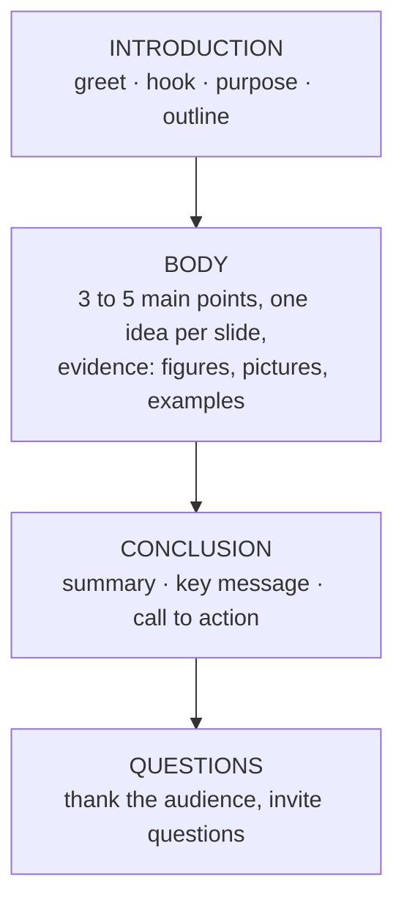

## What Makes a Presentation Effective?

A presentation is **you, talking to an audience, supported by visual aids**. The slides are not the presentation — **you are**. Good slides make your message clearer and easier to remember; bad slides (walls of text, clashing colours, flying words) distract the audience and make you look unprepared.

PowerPoint is a **presentation graphics program**: it lets you prepare every component of a presentation — the **on-screen slides**, your **speaker notes** and **audience handouts**. This lesson is about the thinking and design *before* you open PowerPoint, and the delivery *after* the slides are ready.

<Analogy>
Your slides are the **road signs**, not the road. A road sign says "Ibadan 25 km" in a few large words that you read in a second while driving. Nobody puts the history of Ibadan on a road sign. Your audience is "driving" through your talk — give them signs, and tell them the story yourself.
</Analogy>

---

## Planning a Presentation

Planning **before** you create slides:

- **improves the quality** of the presentation,
- makes it **more effective and enjoyable** for the audience, and
- **saves you time and effort** (you don't redo slides that didn't fit the purpose).

As you plan, determine these five things:

<Step step="1" title="Purpose of the presentation">
What do you want to achieve? To **inform** (report results), **persuade** (get a proposal approved), **instruct** (teach a procedure), or **celebrate/inspire**? Write the purpose as one sentence — every slide must serve it.
</Step>

<Step step="2" title="Type of presentation">
Will you deliver it **in person** to a live audience, **online**, as a **self-running** show (a kiosk at an open day), or will people **read it on their own**? A self-running show needs timings; a read-alone deck needs more text than a spoken one.
</Step>

<Step step="3" title="Audience">
Who are they — classmates, lecturers, a secondary-school principal, company directors, villagers at a health talk? How many? What do they already know?
</Step>

<Step step="4" title="Audience needs">
What does this audience need from you: background, figures, a decision, a demonstration? Use **their language** — avoid jargon for non-specialists.
</Step>

<Step step="5" title="Time available">
How long do you have? A rough guide is **1–2 minutes per content slide**. A 10-minute slot does not need 40 slides.
</Step>

### Common types of presentation *(beyond the notes)*

| Type | Aim | Example |
|---|---|---|
| **Informative** | Share facts, results or updates | Project progress report, research findings |
| **Instructional / demonstration** | Teach how to do something | How to register courses on the portal |
| **Persuasive** | Convince the audience to act or agree | Proposal for a new computer lab |
| **Inspirational / motivational** | Move feelings, celebrate | Send-forth, award ceremony |
| **Decision-making** | Lay out options so a group can decide | Choosing a software vendor |

### A simple structure

---

## Writing the Slide Text

**Think of your text as a visual map of your oral presentation.** The slide shows the key words; your voice supplies the explanation.

**Keep phrases parallel.** If one bullet starts with a verb, all the bullets should start with a verb. If one bullet is a full sentence, all of them should be.

| Not parallel ✗ | Parallel ✓ |
|---|---|
| Registration of courses | **Register** courses |
| You should pay your fees | **Pay** school fees |
| Hostel | **Collect** hostel allocation |
| Attending orientation is compulsory | **Attend** orientation |

**Make sure the text suits your purpose and audience** — a talk to Year 1 students and a talk to the Senate on the same topic should not use the same words.

Use **bulleted lists** to highlight key points and **numbered lists** for sequences (steps that must happen in order):

1. Wake up
2. Pray
3. Bathe
4. Eat
5. Go for lectures

---

## Design Rules

These rules come from the course's PowerPoint tutorial. Examiners ask you to **list** them, and the practical tasks are marked against them.

| Area | Rule |
|---|---|
| **Structure** | **Ensure every slide has a title.** |
| | Make **headings larger than sub-headings**. |
| | Use **bulleted lists** to highlight key points and **numbered steps** to show sequences. |
| **Amount of text** | Follow the **6 × 6 rule**: **six or fewer items per slide** and **six or fewer words per item**. |
| | **Omit unnecessary articles, pronouns and adjectives** (a, an, the, we, very…). |
| | Keep your text **simple** and **minimise** the amount of text on each slide. |
| **Colour** | Ensure your **colour scheme is suitable** for the topic and audience. |
| | Ensure the **background colour contrasts with the text colour** (dark on light, or light on dark). |
| | **Avoid too many colours, clutter or fancy visual effects.** |
| **Consistency** | **Edit the whole slide deck** so the organisation is logical and the design is consistent (same fonts, colours, transitions). |
| **Text style** | **Avoid all capital letters** — harder to read, and it looks like shouting. |
| | **Proofread** carefully for spelling and grammar. |
| **Images and data** | Ensure **images are clear and relevant**. |
| | **Label all figures and tables.** |
| | **Put units beside numbers** on graphs and charts (kg, ₦, %, years). |

Other widely used guidelines *(beyond the notes)*: body text **at least 24 pt** and titles around **36–44 pt**; one or two fonts only, preferably plain sans-serif fonts such as Calibri or Arial; **one idea per slide**.

### Before and after: "History of UI"

The tutorial shows the same content twice. **Before** — a paragraph pasted onto a slide:

> The University of Ibadan was Established in 1948. The University of Ibadan, UI as it is fondly referred to, is the first University in Nigeria. Until 1962 when it became a full-fledged independent University, it was a College of the University of London in a special relationship scheme. The University, which took off with academic programmes in Arts, Science and Medicine, is now a comprehensive citadel of learning with academic programmes in sixteen Faculties…

**After** — the same facts as a visual map:

- Established in 1948
- As a College of the University of London
- Became a full-fledged independent university in 1962
- Founding faculties: Arts, Science, Medicine
- Currently has sixteen faculties
- Also runs postgraduate programmes

The presenter *says* the details ("UI, as it is fondly called, is Nigeria's first university…"); the slide only anchors them.

### Try it: the slide design checker

Load the **before** slide, then fix it until every rule passes. Try the **worst slide** preset too — how many problems can you spot before reading the checklist?

<SlideDesignChecker />

<ExamTip>
"List and explain five design rules for preparing a PowerPoint presentation" is a standard 5-mark question. Name the rule **and** give a reason or example: *"Follow the 6 × 6 rule — at most six bullets per slide and six words per bullet, so the audience listens to you instead of reading."*
</ExamTip>

---

## Visual Aids and How to Use Them

A **visual aid** is anything the audience **sees** that supports what you **say**.

| Visual aid | Best for | Tips |
|---|---|---|
| **Slides** (PowerPoint) | Key points, structure, images | Follow the design rules; one idea per slide |
| **Charts and graphs** | Numerical comparisons and trends | Column/bar to compare, line for trends over time, pie for parts of a whole; label axes and units |
| **Tables** | Exact figures side by side | Few rows and columns; highlight the important number |
| **Diagrams / SmartArt** | Processes, cycles, hierarchies (organogram) | Keep boxes few and labels short |
| **Photographs and pictures** | Showing real things and places | Clear, relevant, high enough resolution; never stretched |
| **Video and audio** | Demonstrations, testimonies | Short clips; test sound and playback before the talk |
| **Handouts** | Details the audience keeps | Printed from PowerPoint (2–6 slides per page); give out at the right time |
| **Objects / models / props** | Letting people see the real thing | Big enough to be seen from the back |
| **Whiteboard / flip chart** | Working things out live with the audience | Write large and neatly; face the audience when talking |

**Using visual aids effectively:**

1. **Keep them simple** — one message per visual.
2. Make sure they are **visible from the back row** (size, contrast).
3. **Introduce and explain** each visual — don't just flash it.
4. **Talk to the audience, not to the screen**; never read slides word for word.
5. **Show a visual only while you are talking about it** (animate items in, or blank the screen with **B**).
6. **Rehearse** with the equipment and have a **backup** (a PDF copy on a flash drive, printed notes).

### Objects you can put on a slide

When asked to *"list objects/content available in a presentation application"*, think of the INSERT tab: **text boxes and placeholders, pictures, shapes, tables, charts, SmartArt diagrams, WordArt, video, audio, hyperlinks, equations and symbols, headers and footers (date, slide number)**.

---

## Accessibility

Good design is also **accessible** design — it works for people with poor eyesight, colour blindness or other needs:

- **High contrast** between text and background; the default black-on-white theme is plain but very accessible.
- **Large, plain fonts**; avoid decorative and script fonts.
- **Don't rely on colour alone** — "the red bars" means nothing to someone who is red-green colour blind; add labels.
- Avoid **busy patterned backgrounds**, flashing effects and too many different animations.
- Give pictures **alternative text** (right-click → Format Picture / Edit Alt Text) for screen-reader users.
- Use the **slide title placeholders** — screen readers use them to navigate.

---

## Proofreading: Two Kinds of Spell Check

Always do a **final spelling check** of all slides (REVIEW → Spelling, or **F7**). PowerPoint performs two types of check:

| Check | What it catches | Example |
|---|---|---|
| **Regular spelling** | A word that is **not in the dictionary** (red wavy underline) | "Univarsity" |
| **Contextual spelling** | A real word used in the **wrong context** | "**Who's** house is this?" should be "**Whose** house is this?" |

The spell checker cannot catch everything — "form" for "from" or a wrong name passes silently. **Read every slide yourself.**

---

## Delivering the Presentation

The slides are ready; now the **oral presentation**. Tips from the course tutorial:

| Tip | What it means in practice |
|---|---|
| **Maintain eye contact and smile** | Look at different parts of the room, not at the screen or the floor |
| **Use gestures and facial expressions** | Natural hand movements to stress points; show enthusiasm |
| **Avoid distractions** | Phone on silent; no jingling keys, pacing or playing with the pointer |
| **Be prepared — practice makes perfect** | Rehearse aloud, with a timer, several times |
| **Be confident** | Stand upright, speak clearly and loudly enough for the back row |
| **Speak freely and avoid filler words** | Talk *to* people, not *from* the slides; cut "ehm", "like", "you know" |
| **Use effective pauses** | Pause after an important point so it sinks in |
| **Speak the language of the audience** | Vocabulary and examples they understand |
| **Effective beginning and end** | Open with a hook (question, story, surprising figure); close with a clear summary and thank-you |
| **Engage the audience** | Ask questions, invite examples, use a short activity |

### Presenter tools in PowerPoint

- **Speaker notes** — typed in the **Notes pane** under each slide (Normal view) or in **Notes Page** view; they help you remember what to say and can be printed.
- **Presenter View** — on a second screen/projector setup, *you* see your notes, the next slide and a timer while the audience sees only the current slide.
- **Rehearse Timings** — rehearse with a clock and save how long each slide takes.
- During the show: **B** = black screen, **W** = white screen, type a slide number + **Enter** to jump, **Esc** to end.

### Recording a presentation

A learning outcome of this course is to record a presentation with narration or screen capture:

| Tool | Where | What it does |
|---|---|---|
| **Record Slide Show** | SLIDE SHOW tab → Set Up group | Plays the show while recording your **narration**, **slide and animation timings** and **laser pointer**; you choose Start Recording from Beginning or from Current Slide |
| **Create a Video** | FILE → Export → Create a Video | Turns the presentation (with recorded timings and narrations) into a video file (MPEG-4 or WMV in 2013) |
| **Screen Recording** | INSERT → Media → Screen Recording (PowerPoint 2016 and later; also Microsoft 365's **Record** tab) | Captures part of your screen with audio — e.g. a software demonstration — and inserts it on a slide |

---

## Practical Tasks Like the Exam

Past practical questions ask you to produce presentations such as a **"Happy New Year" card**, **six slides on "The day I will never forget"**, **six slides on "Myself"**, or a **presentation to your former secondary school principal about the school and your stay there**. A plan for the six-slide personal story:

| Slide | Layout | Content |
|---|---|---|
| 1 | Title Slide | Title, your name and matric number |
| 2 | Title and Content | Setting: when and where (3–4 short bullets) |
| 3 | Two Content | What happened — bullets + a relevant picture |
| 4 | Title and Content | How it felt / turning point |
| 5 | Title and Content | Lessons learnt (parallel phrases) |
| 6 | Title Only / Section Header | Conclusion and thank-you |

Apply **one theme**, **one transition applied to all**, slide numbers in the footer (not on the title slide), and check every slide against the design rules. For a **card**, first change the **slide size** (DESIGN → Slide Size → Custom Slide Size) so the slide has the card's shape.

---

## Practice Questions

<Reveal question="1. List five things you should determine when planning a presentation.">
The **purpose** of the presentation, the **type** of presentation, the **audience**, the audience's **needs**, and the **time available**.
</Reveal>

<Reveal question="2. State the 6 × 6 rule and why it is used.">
Use **six or fewer items per slide** and **six or fewer words per item**. It keeps slides simple and readable so the audience listens to the speaker instead of reading paragraphs, and it forces the presenter to reduce text to key phrases.
</Reveal>

<Reveal question="3. What does 'keep phrases parallel' mean? Give an example.">
All the items in a list should have the same grammatical form: if one starts with a verb, all start with verbs; if one is a complete sentence, all are. Example: "Register courses / Pay fees / Attend orientation" (all verbs) rather than "Registration / You should pay fees / Orientation is compulsory".
</Reveal>

<Reveal question="4. List any five design rules for preparing a PowerPoint presentation.">
Any five: every slide has a title; headings larger than sub-headings; bullets for key points and numbers for sequences; follow the 6 × 6 rule; omit unnecessary articles, pronouns and adjectives; suitable colour scheme; background contrasting with text; avoid too many colours, clutter and fancy effects; consistent design across the deck; avoid all capitals; proofread for spelling and grammar; clear and relevant images; label figures and tables; put units on graphs and charts.
</Reveal>

<Reveal question="5. Distinguish between the two types of spelling check performed by PowerPoint.">
**Regular** spelling check flags words that are not in PowerPoint's dictionary. **Contextual** spelling check flags correctly spelt words used in the wrong context, e.g. "Who's house is this?" instead of "Whose house is this?".
</Reveal>

<Reveal question="6. List any four objects (content) that can be placed on a PowerPoint slide.">
Any four: text boxes/placeholders, pictures, shapes, tables, charts, SmartArt, WordArt, video, audio, hyperlinks, equations, symbols.
</Reveal>

<Reveal question="7. Give five tips for effective oral presentation.">
Any five: maintain eye contact and smile; use gestures and facial expressions; avoid distractions; practise (be prepared); be confident; speak freely without filler words; use effective pauses; speak the language of the audience; have an effective beginning and end; engage the audience.
</Reveal>

<Takeaway>
- **Plan first**: purpose, type, audience, audience needs, time available.
- Slides are a **visual map** of your talk — key phrases, **parallel** wording, bullets for points and numbers for steps.
- **Design rules**: title on every slide, headings bigger than sub-points, **6 × 6 rule**, simple text, suitable high-contrast colours, no clutter, consistency, no ALL CAPS, proofread, clear relevant images, labelled figures, units on charts.
- Choose **visual aids** that suit the message and explain each one; talk to the audience, not the screen.
- PowerPoint checks **regular** and **contextual** spelling — still proofread yourself.
- Deliver with eye contact, confidence, pauses and no filler words; use **speaker notes**, **Presenter View**, **Rehearse Timings** and **Record Slide Show**.
</Takeaway>

## Exam Tips

- **Lists win marks**: the five planning factors, the design rules and the oral-presentation tips are asked almost word for word. Learn at least six of each.
- Always **explain** each point in one clause — "avoid all capitals *because they are harder to read and look like shouting*".
- In practical tasks the marker checks **titles on slides, the 6 × 6 rule, contrast and consistency** before anything fancy. A plain, clean deck beats one with ten different animations.
- Remember the **contextual spelling** example (Whose / Who's) — it is a favourite.
- For a card or poster, change the **slide size first**, then design.
