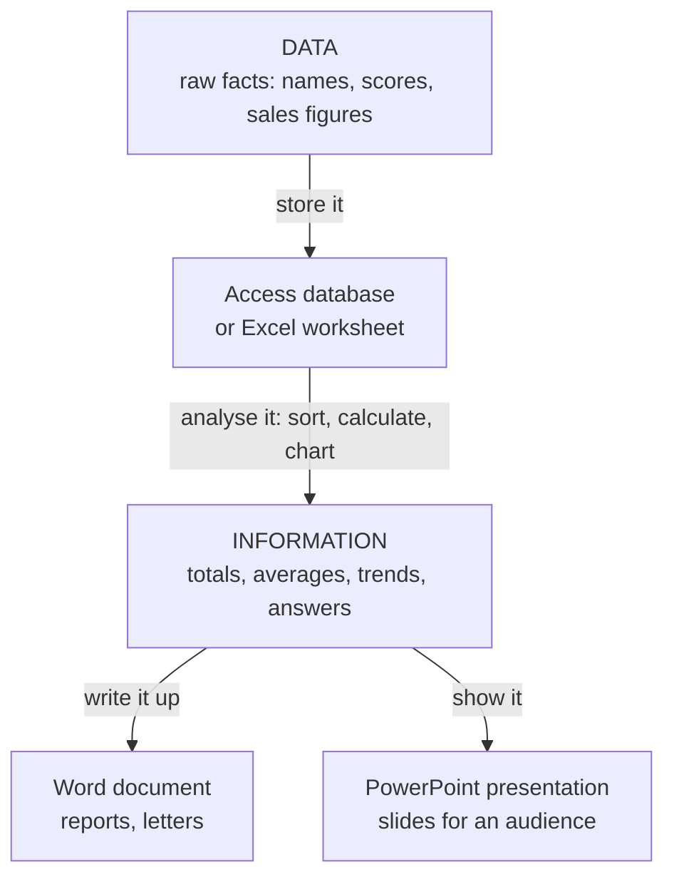

## What This Course Is About

Have you ever needed to keep a list of your friends and their addresses, type and format a report for your boss, store a large amount of numerical data for analysis, and then **present** what the analysis shows to a room full of people? CSC 272 teaches exactly that chain of work using the applications already installed on most computers.

The course is a **service course** (2 units, compulsory): it is less about theory and more about being able to **do** things with the software. The CSC 272 lecturer's stated objectives are to:

1. Explain the fundamentals of **effective visual presentation** and the types of visual aids.
2. Demonstrate **Microsoft PowerPoint**, including how to enhance visual appeal.
3. Demonstrate **Microsoft Word**, including advanced tasks: table of contents, references, mail merge and track changes.
4. Demonstrate **Microsoft Excel**: workbooks, worksheets, calculations, formulas and charts.
5. Explain the fundamentals of **databases** and demonstrate **Microsoft Access**.

**Assessment:** Examination **60%**, Continuous Assessment **40%**. Past examinations are largely **practical** — you sit at a computer and produce files (a Word document with a set page-numbering format, an Excel workbook with several sheets and a chart, a PowerPoint card or presentation, an Access table), plus short theory questions.

<ExamTip>
Practical exam instructions usually include: **append your matric number to every file name** and **save all your work in a named folder on your flash drive**. Losing marks because a file was saved in the wrong place, or not saved at all, is painful — press **Ctrl+S** early and often.
</ExamTip>

---

## Data, Information and Information Management

| Term | Meaning | Example |
|---|---|---|
| **Data** | Raw, unprocessed facts and figures | `67, 12, 40, 76` (scores) |
| **Information** | Data that has been **processed** — organised, calculated, summarised — so that it is **meaningful** and useful for a decision | "The class average is 48.75; one student scored below 25" |
| **Information management** | Collecting, storing, organising, processing, retrieving and presenting information so the right people get the right information at the right time | A department's system for student records and results |
| **Information Management System (IMS)** | The combination of **people, procedures, data and software** used for information management | Access database of students + Excel analysis + reports |

### Types of data an information system can capture

When you design a system for a client (a past-question scenario), think about **what kinds of data** it must hold. Access calls these **data types**:

| Type of data | Examples | Access data type |
|---|---|---|
| **Text / alphanumeric** | Names, addresses, matric numbers like `UI/CSC/045` | Short Text, Long Text |
| **Numeric** | Quantity in stock, score, age | Number |
| **Currency** | Price, salary, fees | Currency |
| **Date and time** | Date of birth, appointment time | Date/Time |
| **Logical (Boolean)** | Paid? Registered? — only two values | Yes/No |
| **Identifiers** | Automatically generated unique numbers | AutoNumber |
| **Multimedia / files** | Passport photograph, scanned certificate | OLE Object, Attachment |
| **Links** | Web address, email address | Hyperlink |

Data can also be classified in other ways, for example:

- **Numeric** (numbers you can calculate with), **alphabetic** (letters only) and **alphanumeric** (letters and digits, e.g. a matric number — you never do arithmetic on it).
- **Quantitative** (measured, numbers: height, score) versus **qualitative** (descriptive categories: gender, state of origin, grade).
- **Structured** (fits neatly in rows and columns: a class list) versus **unstructured** (free text, images, audio, video).

<Analogy>
Data is like **raw foodstuff** in the market — rice, pepper, tomatoes. Information is the **cooked meal**: the same ingredients, processed so they are useful. The Office applications are your **kitchen equipment**: Access is the store room, Excel is the cooking pot, Word and PowerPoint are the plates you serve on.
</Analogy>

---

## The Microsoft Office Suite

**Microsoft Office** is a family (suite) of **productivity applications** made by Microsoft for homes, schools, offices and organisations. It runs on **Windows** and **macOS** (and in simpler web and mobile versions). The programs are normally installed together as "Microsoft Office", although each can also be installed separately.

Programs in the suite include **Word**, **Excel**, **PowerPoint**, **Access**, **Outlook** (email and calendar), **Publisher** (desktop publishing), **OneNote** (digital notebook), and — sold separately — **Project** (project scheduling) and **Visio** (diagrams). CSC 272 covers the first four.

*Figure: The four applications studied in CSC 272. Each program is started by clicking its icon. Icons differ between Office versions — the lecture notes use Office 2013, whose icons are flat coloured tiles with a white initial.*

### Why Microsoft Office — and what are the alternatives?

The course uses Microsoft Office because it is the **most common suite** for preparing and managing data and it comes pre-installed on many computers. Alternatives do the same jobs, and files can usually be opened by either:

| Suite | Word processor | Spreadsheet | Presentation | Database |
|---|---|---|---|---|
| **Microsoft Office** | Word | Excel | PowerPoint | Access |
| **LibreOffice / Apache OpenOffice** (free, open source) | Writer | Calc | Impress | Base |
| **Google Workspace** (in the browser) | Docs | Sheets | Slides | — |
| **Apple iWork** | Pages | Numbers | Keynote | — |

### Which version?

The lecture notes describe **Office 2013**. Later versions (2016, 2019, 2021 and Microsoft 365) keep the same Ribbon idea, so everything you learn transfers. The main visible differences:

| Office 2013 | Office 2016 and later |
|---|---|
| Tab names in CAPITALS (HOME, INSERT) | Tab names in Title Case (Home, Insert) |
| Word: **PAGE LAYOUT** tab | Word: renamed **Layout** |
| — | A **Tell me / Search** box to find any command by typing its name |
| Start Screen with templates (new in 2013) | Same idea |

---

## The Four Applications

<Tabs>
<Tab label="Word">

**Microsoft Word** is a **word processor**: a graphical program for **typing, editing, formatting and printing** text documents — letters, reports, CVs, assignments, flyers.

- A Word file is called a **document**.
- Extension: **.doc** (Word 97–2003) or **.docx** (Word 2007 and later).

Helpful tools in Word include:

- choice of **typefaces** (fonts) and formatting
- **word count** (also counts characters, paragraphs and lines)
- **thesaurus** — synonyms and antonyms to improve your writing
- insertion of **pictures**, **tables**, **charts**, **equations** and **symbols**
- **spelling and grammar checker** (add-ons such as Grammarly can plug in)
- **tracking of changes** in a document others have edited
- printing in different ways; saving as a **web page** or PDF

Lectures on Word: its window and Ribbon, formatting, editing and tables, and advanced features (table of contents, references, mail merge, section breaks).

</Tab>
<Tab label="Excel">

**Microsoft Excel** is a **spreadsheet** application. A spreadsheet is a grid of **rows and columns** of values that can be **manipulated mathematically** with basic arithmetic and complex functions — ideal for maintaining, analysing and calculating **small-to-medium sets of numerical data**.

- An Excel file is called a **workbook**, because it contains one or more **worksheets**.
- Extension: **.xls** (Excel 97–2003) or **.xlsx** (Excel 2007 and later).

What you can do with Excel:

- **number crunching** — formulas and hundreds of built-in functions
- **charts and graphs** (column, bar, line, pie…)
- **storing and importing** data; **sorting** and **filtering**
- **manipulating text** (LEFT, RIGHT, MID, UPPER…)
- **automation of tasks** with macros written in **VBA** (Visual Basic for Applications)
- getting data from other programs, historically via **DDE** (Dynamic Data Exchange)
- data analysis for statistics, finance, forecasting, inventory, billing and business intelligence
- spelling checker

</Tab>
<Tab label="Access">

**Microsoft Access** is a **database management system (DBMS)** — specifically a **relational** database program. It stores **large amounts of related information** (for reference, reporting and analysis) while keeping each kind of data distinct, and manages it faster and more safely than a spreadsheet.

- An Access file is called a **database**.
- Extension: **.mdb** (Access 2003 and earlier) or **.accdb** (Access 2007 and later).

Access is built around four main **objects**:

| Object | Purpose |
|---|---|
| **Tables** | **Store** the data (rows = records, columns = fields) |
| **Queries** | **Ask questions** of the data — select, filter, sort and combine records from one or more tables |
| **Forms** | User-friendly screens to **enter, edit and view** records |
| **Reports** | Formatted **printouts** of data, grouped and totalled |

A business owner could use Access to keep every client's details, invoices and payments; track finances, stock and production; manage marketing and sales; and run reports in minutes — for example, "customers who are behind on payment".

</Tab>
<Tab label="PowerPoint">

**Microsoft PowerPoint** is a **presentation** program for designing **slides** used to report results and tell a story to an audience — in business meetings, seminars, lectures and training. It favours **fewer words and a straight-to-the-point, visual approach**.

- A PowerPoint file is called a **presentation** (a collection of slides).
- Extension: **.ppt** (97–2003) or **.pptx** (2007 and later); **.ppsx** opens straight into the slide show.

What you can do with PowerPoint:

- insert **pictures, graphics, charts, tables and SmartArt** diagrams to support your points
- insert **video and audio**
- apply **themes** and attractive backgrounds
- add **transitions** and **animations** (special effects)
- write **speaker notes** and print **handouts**
- spelling checker

</Tab>
</Tabs>

### Summary: which application for which job?

| Application | Type of program | A file is called | Extension (old / new) | Use it when you need to… |
|---|---|---|---|---|
| **Word** | Word processor | Document | .doc / .docx | type, format and print reports, letters and other documents |
| **Excel** | Spreadsheet | Workbook (of worksheets) | .xls / .xlsx | calculate and analyse a small amount of mainly numerical data, and chart it |
| **Access** | Database management | Database | .mdb / .accdb | collect and organise a large amount of related data for easy retrieval, reporting and analysis |
| **PowerPoint** | Presentation | Presentation (of slides) | .ppt / .pptx | present information visually to an audience |

### Excel or Access?

Both can hold a list of records, so students often mix them up.

| Excel is better when… | Access is better when… |
|---|---|
| the data is **mostly numbers** you want to calculate with | the data is large and much of it is **non-numerical** (names, descriptions) |
| there is **one list**, reasonably small | there are **several related lists** (students, courses, registrations) that must be linked without repeating data |
| you want **charts** and "what-if" calculations quickly | you need **forms** for data entry, **queries** and printed **reports** |
| one person uses it | **many users** share it and data must be kept consistent |

---

## Starting an Office Application

**Ways to launch** any Office program on Windows:

1. **Start menu search** — click Start (or press the Windows key), type the program name, e.g. `Word`, and choose it from the results.
   - **Windows 7:** Start → type in the Start Search box.
   - **Windows 8:** on the Start screen just start typing; or from the desktop press Start and type.
   - **Windows 10/11:** type in the search box on the taskbar (or after pressing Start).
2. **All Programs / All apps** list → Microsoft Office 2013 → the program.
3. A **desktop shortcut** or an icon **pinned to the taskbar**.
4. **Double-click a file** — Windows opens it in the program associated with its extension (a `.xlsx` file opens Excel).

When an Office 2013 program starts it shows the **Start Screen**: recent files on the left, **templates** on the right, with **Blank document / Blank workbook / Blank presentation / Blank desktop database** first.

---

## The Office Environment

Every Office application window is built from the same parts, so once you know one program you can find your way around the others.

| Part | Where | What it does |
|---|---|---|
| **Title bar** | Very top | Shows the file name and program, e.g. `Document1 - Word` |
| **Quick Access Toolbar (QAT)** | Top-left | Always-visible commands (Save, Undo, Redo by default); customisable |
| **FILE tab** | Left end of the tabs | Opens **Backstage view**: New, Open, Save, Save As, Print, Share, Export, Close, Options |
| **Ribbon** | Below the title bar | **Tabs** → **groups** → **commands**, organised by task |
| **Dialog Box Launcher** | Small ↘ arrow in the corner of some groups | Opens a dialog box with more options for that group |
| **Contextual tabs** | Appear at the right of the tabs | Show only when you select an object — e.g. PICTURE TOOLS, TABLE TOOLS, CHART TOOLS |
| **Mini Toolbar** | Pops up near selected text | Quick formatting without switching tabs |
| **ScreenTips** | When you rest the mouse on a button | The command's name and what it does |
| **Status bar** | Very bottom | Information about the file (page/slide number, word count, Ready) |
| **View buttons and Zoom slider** | Bottom-right | Change the view; magnify (zoom does **not** change the real size) |

<ExamTip>
A common short question: *"Which tool is available in Word, Excel and PowerPoint?"* — the **spelling and grammar checker** appears in the feature list of all of them (and so do the Ribbon, Quick Access Toolbar, Clipboard, Undo/Redo and Zoom).
</ExamTip>

### Shortcuts that work in all four programs

| Shortcut | Action | Shortcut | Action |
|---|---|---|---|
| `Ctrl+N` | New file | `Ctrl+Z` | Undo |
| `Ctrl+O` | Open | `Ctrl+Y` | Redo |
| `Ctrl+S` | Save | `Ctrl+C` / `Ctrl+X` / `Ctrl+V` | Copy / Cut / Paste |
| `F12` | Save As | `Ctrl+A` | Select all |
| `Ctrl+P` | Print | `Ctrl+B` / `Ctrl+I` / `Ctrl+U` | Bold / Italic / Underline |
| `F7` | Spelling check | `Ctrl+F` / `Ctrl+H` | Find / Replace |
| `F1` | Help | `Alt+F4` | Close the program |

---

## Choose the Right Application

<MCQ question="A small shop owner wants to record 20 days of sales figures and quickly see the total, the average and a chart. Which application?">
<Option>Microsoft Word</Option>
<Option correct>Microsoft Excel</Option>
<Option>Microsoft Access</Option>
<Option>Microsoft PowerPoint</Option>
<Explain>A small amount of mainly numerical data that needs calculating (SUM, AVERAGE) and charting is exactly what a spreadsheet is for.</Explain>
</MCQ>

<MCQ question="A hospital needs to keep patients, doctors and appointments in one place without typing a patient's details again for every visit, and to print a list of each doctor's patients. Which application?">
<Option>Microsoft Excel</Option>
<Option correct>Microsoft Access</Option>
<Option>Microsoft Word</Option>
<Option>Microsoft PowerPoint</Option>
<Explain>Large amounts of **related** data in several lists (patients, doctors, visits) that must be linked, queried and reported on is a database job.</Explain>
</MCQ>

<MCQ question="What is an Excel file called, and what is its extension in Excel 2013?">
<Option>A document, .docx</Option>
<Option>A worksheet, .xls</Option>
<Option correct>A workbook, .xlsx</Option>
<Option>A database, .accdb</Option>
<Explain>An Excel file is a **workbook** containing one or more **worksheets**. From Excel 2007 onwards it is saved as .xlsx (.xls was the Excel 97–2003 format).</Explain>
</MCQ>

<MCQ question="Which of these is NOT one of the four main objects of a Microsoft Access database?">
<Option>Tables</Option>
<Option>Queries</Option>
<Option correct>Slides</Option>
<Option>Reports</Option>
<Explain>The four main Access objects are **tables, queries, forms and reports**. Slides belong to PowerPoint.</Explain>
</MCQ>

---

## Practice Questions

<Reveal question="1. How are the various Office applications launched?">
Click **Start**, type the program's name (e.g. Excel) and select it from the search results (Windows 7: Start Search box; Windows 8: type on the Start screen; Windows 10/11: search box on the taskbar). Alternatively use All Programs → Microsoft Office, a desktop/taskbar shortcut, or double-click a saved file of that type. Office 2013 then shows its Start Screen, where you choose a blank file or a template.
</Reveal>

<Reveal question="2. You have a small amount of data and want to analyse it. Which application would you use, and why?">
**Microsoft Excel** — a spreadsheet is designed for maintaining, analysing and calculating small sets of (mainly numerical) data using formulas, functions, sorting, filtering and charts.
</Reveal>

<Reveal question="3. You own a small business and need to keep track of lots of information in one place and later generate reports from it. Which Office application suits you?">
**Microsoft Access** — a database management program built to collect and organise large amounts of related information in tables, find it with queries, enter it through forms and print it as reports (e.g. customers owing money, stock levels).
</Reveal>

<Reveal question="4. Which tool is available in Word, Excel and PowerPoint?">
The **spelling and grammar checker** (Review tab → Spelling, F7). Other shared tools include the Ribbon, Quick Access Toolbar, Clipboard (cut, copy, paste), Undo/Redo and Zoom.
</Reveal>

<Reveal question="5. A client needs an information management system. Enumerate four types of data that could be captured.">
Any four, with examples: **text** (names, addresses), **numbers** (quantity, age), **currency** (price, salary), **date/time** (date of birth, appointment), **Yes/No** (paid or not), **AutoNumber identifiers** (customer ID), **pictures/attachments** (passport photo), **hyperlinks** (email or website).
</Reveal>

<Reveal question="6. Distinguish between data and information.">
**Data** are raw, unprocessed facts (e.g. a list of scores). **Information** is data that has been processed — organised, calculated or summarised — so that it is meaningful and supports a decision (e.g. "the average score is 48.75 and 3 students failed").
</Reveal>

<Takeaway>
- CSC 272 = **store** data (Access/Excel) → **analyse** it into information (Excel/Access) → **present** it (Word/PowerPoint).
- **Word** = word processor → *document* (.docx). **Excel** = spreadsheet → *workbook* of worksheets (.xlsx). **Access** = relational DBMS → *database* (.accdb) with tables, queries, forms, reports. **PowerPoint** = presentation program → *presentation* of slides (.pptx).
- Old (97–2003) formats end without the **x**: .doc, .xls, .ppt, and Access used .mdb.
- Excel for small numerical analysis and charts; Access for large, related, mostly non-numerical data shared by many users.
- Every Office window shares the title bar, Quick Access Toolbar, FILE tab (Backstage), Ribbon (tabs → groups → commands), dialog box launchers, contextual tabs, status bar and zoom.
</Takeaway>

## Exam Tips

- **Know the file names and extensions** for all four programs — including the older ones (.doc, .xls, .ppt, .mdb). They appear as one-mark questions.
- **"Which application would you use for…"** questions: justify your answer with the *kind* of data (numerical vs related lists) and the *task* (calculate, store and report, type, present).
- **List and give the use of the Access objects** (tables, queries, forms, reports) — a very common question; you will study them in detail in the Access lessons.
- **Types of data** questions: give the type *and* an example for each (e.g. Date/Time — date of birth).
- In the practical exam, **rename your files with your matric number** and save to the folder you were told to use before you do anything else.
