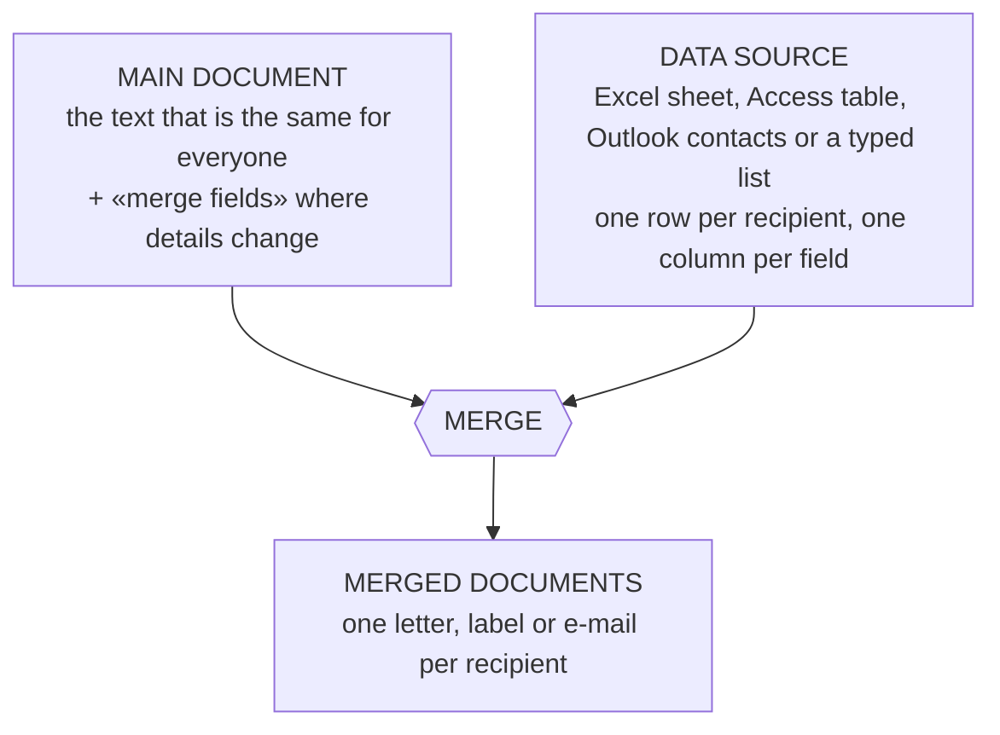

## Why These Features Matter

The practical CSC 272 exam rarely asks you to "make text bold". It asks for things like:

- *"A document of at least six pages numbered in the format -a-, with a header text."*
- *"Number the first three pages in the header with alphabets (a, b, c) and the rest of the document in the footer with Roman numerals (i, ii, …)."*
- *"Insert pictures on three different pages and tables on three pages; insert a title page, a list of pictures on page 2 and a list of tables on page 3."*
- *"Pages 2–4 contain text with at least five references; generate the reference list on the last page."*
- *"Paragraph two is arranged in four columns while paragraphs one and three stay in one column."*
- *"Reproduce this formula on the last page."*

Every one of these is a feature of the **REFERENCES**, **INSERT**, **PAGE LAYOUT** and **MAILINGS** tabs covered in this lesson — and every one depends on doing things *Word's way* (styles, captions, fields, sections) rather than typing numbers by hand.

---

## Styles: the Foundation

A **style** is a named set of formatting (font, size, colour, spacing) you apply in one click from HOME → **Styles**. The important ones for long documents are **Title**, **Heading 1** (chapters), **Heading 2** (sections), **Heading 3** (sub-sections) and **Normal** (body text).

Using heading styles gives you, for free:

- a consistent look (change the style once — every heading updates: right-click the style → **Modify**),
- the **Navigation pane** (VIEW → Navigation Pane) listing your headings for quick jumps,
- **Outline view**, and above all
- an **automatic table of contents**.

---

## Table of Contents

1. Format every chapter title with **Heading 1** and section titles with **Heading 2** (and **Heading 3** if needed).
2. Put the insertion point where the contents should go (usually a new page after the title page — **Ctrl+Enter** for a page break).
3. REFERENCES → **Table of Contents** → **Automatic Table 1** (or **Custom Table of Contents…** to choose the number of levels, tab leader dots and format).
4. Word lists every heading with its **page number** and a dotted **leader**; hold **Ctrl** and click an entry to jump to it.
5. After editing the document, REFERENCES → **Update Table**: choose **Update page numbers only** (if you only added or removed text) or **Update entire table** (if you added, removed or renamed headings).

The table is a **field** — a snapshot. It never updates itself. Try it: build the contents, then rename a heading or add a page break and watch it go out of date; compare the two update options.

<TocDemo />

---

## Captions, Lists of Figures and Lists of Tables

A **caption** is a numbered label on a picture, table or equation: *Figure 1: Hospital records room*, *Table 2: Respondents by state*. Word numbers captions automatically and renumbers them when you add or remove one.

**Insert a caption:**

1. Click the picture (or anywhere in the table).
2. REFERENCES → Captions → **Insert Caption**.
3. **Label**: *Figure*, *Table* or *Equation* (**New Label…** for others, e.g. *Picture*); **Position**: *Below selected item* (usual for figures) or *Above* (usual for tables).
4. Type the description after the number → **OK**.

**Generate the list** (a *table of figures*):

1. Click where the list should go (e.g. page 2).
2. REFERENCES → Captions → **Insert Table of Figures**.
3. Choose the **Caption label**: **Figure** gives a *list of figures (pictures)*; **Table** gives a *list of tables* → **OK**.
4. Update it like a table of contents (**Update Table**).

**Cross-reference** (REFERENCES or INSERT tab) lets you write "see Figure 3" so that the number updates too.

<ExamTip>
The exam instruction "insert the **list of pictures** on page 2 and the **list of tables** on page 3" is exactly **Insert Caption** on every picture/table, then **Insert Table of Figures** twice (caption label *Figure*, then *Table*). A typed list earns nothing — the marker clicks an entry to see whether it is a real, linked list.
</ExamTip>

---

## Footnotes and Endnotes

| | Footnote | Endnote |
|---|---|---|
| **Where the note appears** | Bottom of the **same page** | End of the **document** (or section) |
| **Insert** | REFERENCES → **Insert Footnote** (**Ctrl+Alt+F**) | REFERENCES → **Insert Endnote** (**Ctrl+Alt+D**) |
| **Numbering** | 1, 2, 3 … by default | i, ii, iii … by default |

Word places a superscript reference mark in the text and keeps notes numbered correctly as you add or delete them.

---

## Citations and the Reference List

Word can manage your sources and build the reference list (bibliography) automatically.

1. REFERENCES → Citations & Bibliography → **Style**: choose the referencing style your department wants — **APA**, **MLA**, **Chicago**, **Harvard**, **IEEE**…
2. Click where the citation belongs → **Insert Citation** → **Add New Source…**
3. Choose the **Type of Source** (Book, Journal Article, Web site, Report…) and fill in **Author**, **Title**, **Year**, **City**, **Publisher** (fields change with the type) → **OK**. Word inserts an in-text citation such as *(Adeyemi, 2019)*.
4. To cite the same source again: Insert Citation → pick it from the list.
5. **Manage Sources** shows the *Master List* (every source you have ever entered) and the *Current List* (this document); edit or delete sources here.
6. On the last page: **Bibliography** → **References** (or *Bibliography* / *Works Cited*). Word builds the list from every cited source, alphabetised and formatted in the chosen style — with a **hanging indent**.
7. After adding more citations, click the list → **Update Citations and Bibliography**.

A typical APA entry produced by Word:

> Adeyemi, T. (2019). *Health information systems in Nigeria*. Ibadan: University Press.

---

## Page Breaks and Section Breaks

PAGE LAYOUT → Page Setup → **Breaks**:

| Break | What it does |
|---|---|
| **Page** (Ctrl+Enter) | Text after it starts on the **next page** — same section |
| **Column** | Text after it moves to the **next column** |
| **Text Wrapping** | Moves text below a picture/object (used with text wrapping around objects) |
| **Section: Next Page** | Starts a **new section on the next page** |
| **Section: Continuous** | Starts a new section **on the same page** — e.g. to change the number of columns mid-page |
| **Section: Even Page** | New section starting on the next **even-numbered** page (a blank page may be inserted) |
| **Section: Odd Page** | New section starting on the next **odd-numbered** page — chapters that must start on a right-hand page |

**A section is a part of a document with its own page layout**: margins, **orientation**, paper size, **columns**, **headers and footers**, and **page-number format and starting number**. By default a document is **one section**, so any of those settings apply to the whole document; section breaks let different parts differ — e.g. one landscape page in a portrait report, prelims numbered i, ii, iii and the body 1, 2, 3.

Section breaks are invisible when printed; switch on **Show/Hide ¶** to see them as `::::Section Break (Next Page)::::` — and to delete one (click it, press Delete).

<ExamTip>
"List and explain the types of section breaks in MS Word" (3 marks) — name **Next Page, Continuous, Even Page, Odd Page** and say where each new section starts. Add *why* sections exist: different page numbering, headers/footers, orientation or columns in different parts of one document.
</ExamTip>

### One paragraph in four columns

1. Select **only** paragraph two (don't include the ¶ of paragraph three).
2. PAGE LAYOUT → **Columns** → **More Columns…**
3. **Number of columns**: 4; optionally tick **Line between**.
4. **Apply to: Selected text** → **OK**.

Word automatically inserts **Continuous** section breaks before and after the paragraph, so paragraphs one and three stay in one column. (With ¶ on you can see the two breaks.)

---

## Headers, Footers and Page Numbers per Section

INSERT → **Header** / **Footer** / **Page Number** (or double-click the top or bottom margin) opens the header/footer area and the **HEADER & FOOTER TOOLS → DESIGN** tab. Double-click the body (or **Close Header and Footer**) to leave.

The key tools for sectioned documents:

| Tool | What it does |
|---|---|
| **Link to Previous** | ON (default) = this section's header/footer is **"Same as Previous"** — identical to the section before. Turn it **OFF** before giving a section different header/footer content |
| **Page Number → Format Page Numbers…** | **Number format** (1, 2, 3 / - 1 -, - 2 - / a, b, c / A, B, C / i, ii, iii / I, II, III) and **Page numbering: Continue from previous section** or **Start at** |
| **Different First Page** | The first page of the section gets its own (usually empty) header/footer — no number on the title page |
| **Different Odd & Even Pages** | Separate headers for left and right pages (books) |
| **Go to Header / Go to Footer, Previous / Next** | Move between the header and footer, and between sections |

The header and footer are **linked separately**: unlinking the header does not unlink the footer.

### The classic exam task, step by step

*Pages 1–3 numbered a, b, c in the **header**; the rest numbered i, ii, iii… in the **footer**.*

1. Type (or insert) the content so there are at least 4 pages. At the **end of page 3**: PAGE LAYOUT → Breaks → **Next Page** (section break). You now have section 1 (pages 1–3) and section 2 (page 4 onward).
2. Click on page 1 → INSERT → **Page Number** → **Top of Page** → pick a design. Page Number → **Format Page Numbers** → **a, b, c** → OK. Pages 1–3 show a, b, c — and so, for now, does section 2.
3. Go to the **header of page 4** (section 2): click **Link to Previous** to turn it **off**, then **delete** the page number there.
4. **Go to Footer** (still section 2): turn **Link to Previous** off, then Page Number → **Bottom of Page** → a design.
5. Page Number → **Format Page Numbers** → **i, ii, iii**, **Start at: i** → OK.
6. Check pages 3 and 4 — section 1's header must still show *c*, and its footer must be empty.

For **"-a-" format on every page with a header text**: type the header text, then in the header type `-`, insert the page number (Page Number → **Current Position** → Plain Number), type `-` again, and set Format Page Numbers to **a, b, c**. (Word's built-in list has "- 1 -" but not "- a -", so you type the dashes yourself.)

Practise both tasks below — the checklist marks your result like an examiner would:

<PageNumberingLab />

---

## Mail Merge

**Mail merge** produces **many personalised documents** — letters, envelopes, labels, e-mails, a directory — from **one main document** and a **data source** (a list of recipients). Use it whenever the same letter goes to many people with small differences: admission letters, result slips, invitations, invoices.

**The Mail Merge Wizard** (MAILINGS → Start Mail Merge → **Step-by-Step Mail Merge Wizard**) has six steps:

1. **Select document type** — Letters, E-mail messages, Envelopes, Labels or Directory.
2. **Select starting document** — the current document, a template, or an existing document.
3. **Select recipients** — use an existing list (e.g. an Excel workbook), Outlook contacts, or type a new list. **Edit Recipient List** lets you sort, filter and untick people.
4. **Write your letter** — type the text and insert **Address Block**, **Greeting Line** or individual **merge fields** such as «FirstName», «Score». **Rules → If…Then…Else** inserts text that depends on a field (e.g. "passed" if Score ≥ 45, otherwise "failed").
5. **Preview your letters** — see real data, record by record (**Preview Results** and the arrows on the ribbon).
6. **Complete the merge** — **Finish & Merge → Edit Individual Documents** (a new document with every letter, which you can check and save), **Print Documents**, or **Send E-mail Messages**.

The same steps are available directly on the MAILINGS tab: **Start Mail Merge → Select Recipients → Insert Merge Field → Preview Results → Finish & Merge**. Walk through the wizard here:

<MailMergeDemo />

---

## Equations

INSERT → Symbols → **Equation** (or **Alt+=**) creates an **equation object**: a maths zone that keeps the formula together, sized and spaced correctly, and moves as one piece. The **EQUATION TOOLS → DESIGN** tab offers:

- **Tools**: built-in equations (area of a circle, quadratic formula, Pythagoras, binomial theorem…), **Professional** vs **Linear** display.
- **Symbols**: ±, ∞, ≠, ≤, ≥, ×, ÷, Greek letters (α, β, θ, π, Σ…), arrows.
- **Structures**: **Fraction**, **Script** (superscript/subscript), **Radical** (√), **Integral**, **Large Operator** (Σ, Π), **Bracket**, **Function** (sin, cos, log), **Accent** (x̄, ẋ), **Limit and Log**, **Operator**, **Matrix**.

Click a structure, then click each dotted box inside it and type. Or type **linear format** directly and press **Space** — Word converts it:

| You type in the equation box | Word shows |
|---|---|
| `x^2` · `x_i` | superscript · subscript |
| `a/b` then Space | a stacked fraction |
| `\sqrt(b^2-4ac)` | square root |
| `\alpha \beta \theta \pi \Sigma` | α β θ π Σ |
| `\pm \times \div \le \ge \ne \infty` | ± × ÷ ≤ ≥ ≠ ∞ |
| `\sum_(i=1)^n x_i` | summation with limits |
| `\int_0^1 x^2 dx` | integral with limits |

Formulas you should be able to reproduce quickly:

$$
x = \frac{-b \pm \sqrt{b^2 - 4ac}}{2a}
\qquad
\bar{x} = \frac{\sum_{i=1}^{n} x_i}{n}
$$

$$
\sin(\theta - \phi) = \sin\theta\cos\phi - \cos\theta\sin\phi
\qquad
\int_{0}^{1} x^2\,dx = \frac{1}{3}
$$

In linear format the quadratic formula is typed as `x=(-b\pm\sqrt(b^2-4ac))/2a` followed by a space; the mean is `x\bar=(\sum_(i=1)^n x_i)/n`.

<ExamTip>
When an exam asks you to **reproduce a formula**, it must be built with the **Equation** tool — typed text with superscript formatting or a pasted picture is marked down. Check brackets, subscripts and the Greek letters carefully against the question paper; build fractions with the Fraction structure so numerator and denominator stay together.
</ExamTip>

---

## Pictures on the Page

Past tasks also ask for pictures on particular pages or arranged in a grid:

1. Click where the picture goes → INSERT → **Pictures** → choose the file → **Insert**.
2. **PICTURE TOOLS → FORMAT → Wrap Text**: *In Line with Text* (moves like a character — simplest and most stable), *Square*, *Tight*, *Top and Bottom*, *Behind/In Front of Text*.
3. Resize with a **corner** handle (keeps proportions); **Crop** unwanted edges.
4. Add a caption (REFERENCES → Insert Caption) so it appears in the list of figures.
5. For *four labelled pictures in a 2 × 2 arrangement*, insert a table with 2 columns and 2 rows (or 4 rows if captions sit in their own rows), put one picture per cell, and caption each one.

A **cover/title page**: INSERT → **Cover Page** (a designed page), or type the title yourself and set PAGE LAYOUT → Page Setup → Layout → **Vertical alignment: Center**.

---

## Practice Questions

<MCQ question="Which section break would you use to make paragraph two of a page appear in four columns without moving it to a new page?">
<Option>Next Page</Option>
<Option correct>Continuous</Option>
<Option>Odd Page</Option>
<Option>Column break</Option>
<Explain>A Continuous section break starts a new section on the same page, so the column layout can change mid-page. Word inserts continuous breaks for you when you apply columns to selected text.</Explain>
</MCQ>

<MCQ question="Section 2's header still shows the same page numbers as section 1 even after you changed its number format. What have you most likely forgotten?">
<Option>To insert a page break</Option>
<Option correct>To turn off Link to Previous in section 2's header</Option>
<Option>To update the table of contents</Option>
<Option>To tick Different Odd & Even Pages</Option>
<Explain>While Link to Previous is on, section 2's header is "Same as Previous": its content mirrors section 1. Turn it off before deleting or changing what is in section 2's header or footer.</Explain>
</MCQ>

<MCQ question="You renamed two chapter headings and added a new section heading. Which command brings the table of contents up to date?">
<Option>Update page numbers only</Option>
<Option correct>Update entire table</Option>
<Option>Insert Table of Figures</Option>
<Option>Mark Entry</Option>
<Explain>Update page numbers only keeps the old entries' text and ignores new headings. Update entire table rebuilds the list from the current headings.</Explain>
</MCQ>

<Reveal question="1. List and explain the types of section breaks found in MS Word.">
**Next Page** — the new section starts on the next page. **Continuous** — the new section starts on the same page (e.g. to change the number of columns). **Even Page** — the new section starts on the next even-numbered page. **Odd Page** — it starts on the next odd-numbered page. Sections allow different page numbering, headers/footers, orientation, margins and columns in different parts of a document.
</Reveal>

<Reveal question="2. Describe how to number the first three pages a, b, c in the header and the rest i, ii, iii in the footer.">
Insert a **Next Page section break** at the end of page 3. On page 1 insert a page number at the **top of page** and set Format Page Numbers to **a, b, c**. In section 2's header turn **Link to Previous off** and delete the number. In section 2's footer turn **Link to Previous off**, insert a page number at the **bottom of page**, and set Format Page Numbers to **i, ii, iii** with **Start at i**.
</Reveal>

<Reveal question="3. Explain the steps to insert a list of tables on page 3 of a document.">
Give every table a caption with REFERENCES → **Insert Caption** (label **Table**). Then click on page 3 → REFERENCES → **Insert Table of Figures** → Caption label **Table** → OK. Use Update Table after adding more tables.
</Reveal>

<Reveal question="4. What is mail merge? State its three main components and list the six steps of the wizard.">
Mail merge creates many personalised documents from one main document and a list of recipients. Components: the **main document**, the **data source** (recipient list) and the **merge fields** that link them (giving the **merged documents**). Steps: select document type; select starting document; select recipients; write your letter (insert fields); preview; complete the merge (Finish & Merge).
</Reveal>

<Reveal question="5. How would you generate a reference list for a document with five cited sources?">
Choose the style (REFERENCES → Style, e.g. APA). For each citation use **Insert Citation → Add New Source**, filling in type, author, title, year and publisher. On the last page, click **Bibliography → References**. Word builds the formatted, alphabetised list; use **Update Citations and Bibliography** after adding more citations.
</Reveal>

<Reveal question="6. Differentiate between a footnote and an endnote.">
A **footnote** appears at the bottom of the page on which it is referenced (Insert Footnote, Ctrl+Alt+F); an **endnote** is collected at the end of the document or section (Insert Endnote, Ctrl+Alt+D). Both are numbered automatically.
</Reveal>

<Takeaway>
- Apply **Heading 1/2/3** styles, then REFERENCES → **Table of Contents**; update with **Update page numbers only** or **Update entire table**.
- **Insert Caption** (Figure/Table) on every picture and table, then **Insert Table of Figures** (caption label Figure → list of figures; Table → list of tables).
- **Footnotes** (page bottom) vs **endnotes** (document end). **Insert Citation → Add New Source**, choose a **Style**, then **Bibliography → References**.
- **Section breaks**: Next Page, Continuous, Even Page, Odd Page — each section has its own layout, headers/footers and page numbering. **Columns → Apply to: Selected text** adds continuous breaks automatically.
- Headers/footers: turn off **Link to Previous** before changing a section; **Format Page Numbers** sets the format and **Start at**; **Different First Page** hides the title-page number; type dashes for **-a-**.
- **Mail merge** = main document + data source + merge fields → Finish & Merge. Six wizard steps.
- **Equations**: INSERT → Equation (Alt+=), Structures and Symbols, or linear format + Space.
</Takeaway>

## Exam Tips

- The page-numbering task appears in almost every practical paper. Remember the order: **section break → first section's numbers → unlink → second section's numbers → Start at**.
- Lists of figures/tables, tables of contents and reference lists must be **generated**, not typed.
- "Types of section breaks" and "steps of mail merge" are favourite theory questions — learn the names exactly.
- For "-a-", say that you **type** the dashes around a page-number field formatted a, b, c.
- Build every formula with the **Equation** tool and proof-read it symbol by symbol.
