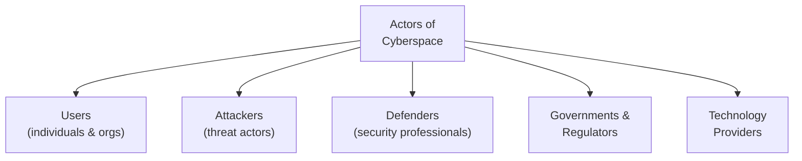
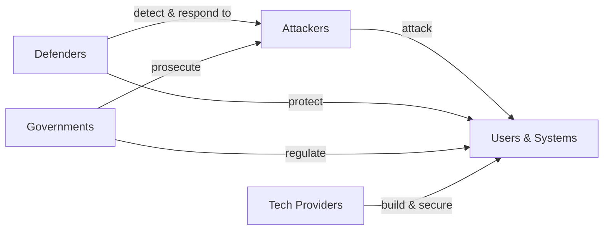

## Cyberspace Is a Crowded Place

Cyberspace is not just wires and code — it is a domain populated by many actors with different roles, goals, and capabilities. Understanding who these actors are, and what motivates them, is essential to understanding the cybersecurity landscape.

**Real-world analogy:** A city has many actors: residents, businesses, criminals, police, and government. Each has different goals, and the interactions between them shape daily life. Cyberspace has an equivalent cast of characters, and security emerges from their interactions.

---

## Categorising the Actors

The main actors of cyberspace can be grouped by their primary role:

---

## Actor Group 1: Users (Individuals and Organisations)

The vast majority of cyberspace actors are ordinary users — individuals and organisations who use digital systems for daily life and business.

| User type | Role | Security relevance |
|---|---|---|
| **Individuals** | Personal use (email, banking, social media) | Targets of fraud, phishing; the "weakest link" |
| **Businesses** | Commerce, operations | Hold valuable data; targets of attacks |
| **Critical infrastructure operators** | Power, water, healthcare, finance | High-value targets; attacks cause societal harm |
| **Educational institutions** | Research, student data | Hold sensitive data; often under-resourced for security |

**Key point:** Users are both the reason cyberspace exists and often its weakest security link. Most successful attacks exploit user behaviour (clicking phishing links, weak passwords) rather than breaking technology directly.

---

## Actor Group 2: Attackers (Threat Actors)

Those who seek to exploit, damage, or profit from cyberspace illegitimately. (Covered in detail in the "Evolution of Cyber-Attacks" topic.)

| Attacker | Capability | Motivation |
|---|---|---|
| **Nation-states** | Very high | Espionage, warfare, strategic advantage |
| **Organised crime** | High | Financial gain |
| **Hacktivists** | Medium | Political/social causes |
| **Insiders** | Variable (have legitimate access) | Revenge, profit, negligence |
| **Script kiddies** | Low | Notoriety, mischief |

### Hacktivists
A notable group: **hacktivists** combine "hacking" and "activism." They attack systems to promote a political or social cause — defacing websites, leaking documents, or launching DoS attacks against organisations they oppose. (Example: groups protesting government policies by disrupting government websites.)

---

## Actor Group 3: Defenders (Security Professionals)

Those whose role is to protect systems and respond to threats.

| Role | Responsibility |
|---|---|
| **Security analysts** | Monitor systems, investigate alerts |
| **Penetration testers (ethical hackers)** | Legally attack systems to find vulnerabilities before criminals do |
| **Incident responders** | Handle and contain security breaches |
| **Security architects** | Design secure systems |
| **CISO (Chief Information Security Officer)** | Lead organisational security strategy |

### Ethical Hackers (White Hats)
A special and important type of defender. **Ethical hackers** use the same techniques as criminal hackers — but legally, with permission, to find and fix vulnerabilities before malicious actors exploit them.

**The "hat" colour scheme:**

| Hat | Description |
|---|---|
| **White hat** | Ethical hacker — works legally to improve security |
| **Black hat** | Malicious hacker — attacks for personal gain or harm |
| **Grey hat** | Operates in between — may break rules but without malicious intent |

---

## Actor Group 4: Governments and Regulators

Governments play multiple roles in cyberspace:

1. **Regulator** — making and enforcing cybersecurity laws
2. **Defender** — protecting national infrastructure and citizens
3. **Attacker** — some governments conduct offensive cyber operations (cyber-warfare, espionage)
4. **Service provider** — delivering digital government services (which must be secured)

**The dual role tension:** A government may simultaneously work to defend its citizens' security AND conduct surveillance or offensive operations. This creates ongoing debates about privacy, civil liberties, and the balance of power.

**Regulatory bodies:**
- National cybersecurity agencies (e.g., Nigeria's National Information Technology Development Agency — NITDA)
- Data protection authorities
- Law enforcement cybercrime units

---

## Actor Group 5: Technology Providers

Companies and organisations that build the infrastructure and software of cyberspace:

| Provider | Role | Security responsibility |
|---|---|---|
| **Software vendors** | Build applications, OS | Must produce secure software, issue patches |
| **Cloud providers** | Host data and services | Secure infrastructure (shared responsibility) |
| **ISPs (Internet Service Providers)** | Provide connectivity | Can detect and mitigate attacks at scale |
| **Security vendors** | Build security tools | Provide firewalls, antivirus, IDS |

### The Shared Responsibility Model
In cloud computing, security is shared between the provider and the customer:
- **Provider** secures the underlying infrastructure (data centres, hardware, network)
- **Customer** secures their data, access controls, and applications

Misunderstanding this division causes breaches — for example, a customer leaving a cloud storage bucket publicly accessible is the customer's responsibility, not the provider's.

---

## How the Actors Interact

Security is not static — it is a constant interaction between attackers seeking to exploit and defenders seeking to protect, within a framework set by governments and built on technology from providers. This is sometimes called the "cybersecurity arms race" — as defenses improve, attacks evolve, and vice versa.

---

## The Impact on Different Sectors

Cyber-attacks affect different sectors in different ways:

| Sector | Impact of attacks |
|---|---|
| **Civil/public services** | Disruption of healthcare, utilities; erosion of public trust |
| **Military** | Compromised communications, intelligence; cyberspace as a "fifth domain" of warfare (after land, sea, air, space) |
| **Business** | Financial loss, reputation damage, regulatory penalties |
| **Privacy** | Exposure of personal data, surveillance concerns |
| **Government** | Disruption of services, espionage, threats to democratic processes |

---

## Key Takeaway

> Cyberspace is populated by interacting actors: **users** (individuals and organisations, often the weakest security link), **attackers** (nation-states, organised crime, hacktivists, insiders, script kiddies), **defenders** (security analysts, ethical hackers/white hats, incident responders), **governments** (regulators, defenders, sometimes attackers), and **technology providers** (software, cloud, security vendors). The shared responsibility model divides cloud security between provider and customer. Security emerges from the constant interaction — an arms race — between these actors. Cyber-attacks impact civil, military, business, privacy, and government domains differently.

---

## Exam Tips

**What lecturers test:**
- Identify and describe the main actors of cyberspace
- Explain the white hat / black hat / grey hat distinction
- Define ethical hacking and explain its value
- Explain the shared responsibility model in cloud security
- Describe how cyber-attacks impact different sectors (civil, military, business, privacy, government)

**Common mistakes:**
- Forgetting that governments can be attackers as well as defenders and regulators
- Confusing hacktivists (political motivation) with cybercriminals (financial motivation)
- Thinking cloud providers are responsible for all cloud security — the customer shares responsibility

**Likely question:**
> "Identify the main actors of cyberspace and describe the role of each. Explain the difference between white hat, black hat, and grey hat hackers, and explain the value of ethical hacking to organisations." (12 marks)
