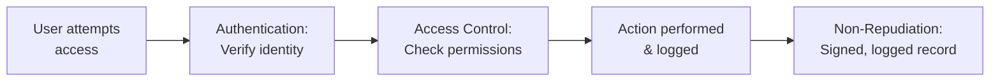

## Three Questions Every Secure System Asks

When you interact with a secure system, it must answer three questions:

1. **"Who are you?"** → Authentication
2. **"What are you allowed to do?"** → Access Control
3. **"Can you deny you did this?"** → Non-Repudiation

These three principles work together to control and account for access. Let us examine each.

---

## Authentication: "Who Are You?"

**Authentication** is the process of confirming the identity of a user or system. It is the first line of defense — before granting any access, the system must verify you are who you claim to be.

**Real-world analogy:** Authentication is like showing your ID at a bank. Before the teller helps you access your account, they verify your identity. The ID proves you are the account holder.

### The Three Factors of Authentication

Authentication relies on one or more "factors" — categories of evidence:

| Factor | Description | Examples |
|---|---|---|
| **Something you know** | Knowledge | Password, PIN, security question |
| **Something you have** | Possession | Phone, security token, smart card |
| **Something you are** | Inherence (biometric) | Fingerprint, face, iris, voice |

### Authentication Methods

1. **Password / PIN** — the most common; "something you know"
2. **Token generation** — physical or app-based codes; "something you have"
3. **Biometric verification** — fingerprints, face; "something you are"
4. **Multi-Factor Authentication (MFA)** — combines two or more factors; the gold standard
5. **One-Time Password (OTP)** — a code valid for a single login, sent via SMS or app

### Why Multi-Factor Authentication (MFA) Is the Gold Standard

A password alone (one factor) can be stolen. But MFA requires multiple factors:

**Example:** To log in, you need:
- Your password (something you know) — AND
- A code from your phone app (something you have)

Even if an attacker steals your password, they cannot log in without also having your phone. This dramatically increases security.

> **Note:** SMS-based MFA is being bypassed by attackers (SIM-swapping). App-based authenticators (Google Authenticator, Authy) are now recommended over SMS.

---

## Access Control: "What Are You Allowed To Do?"

Once authenticated, **access control** determines what resources you can access and what actions you can perform. Authentication proves who you are; access control decides what you can do.

**Real-world analogy:** Authentication is showing your ID to enter an office building. Access control is the set of doors your keycard can open inside — you can enter your own department but not the server room or the CEO's office.

### Three Goals of Access Control

1. Prevent unauthorized users from accessing resources
2. Prevent legitimate users from accessing resources in an unauthorized way
3. Enable legitimate users to access resources in an authorized way

### Basic Elements of Access Control

| Element | Definition |
|---|---|
| **Subject** | An entity that accesses objects (a user, process, or application) |
| **Object** | A resource being accessed (file, database record, program) |
| **Access right** | The way a subject may access an object (read, write, execute) |

**Subject categories:**
- **Owner** — the creator of a resource
- **Group** — a set of users sharing access rights
- **World** — everyone else (may have limited or no access)

### Access Control Models

#### Discretionary Access Control (DAC)
The **owner** of a resource decides who can access it. Access is based on the identity of the requester.

- Identity-based: data owners grant access to specific users/groups
- Permissions stored in an **Access Control List (ACL)** — a list of users/groups and their access levels

**Example:** You create a document and decide who can read or edit it (like sharing a Google Doc and choosing "can view" or "can edit" for specific people). This is discretionary — at your discretion.

**Weakness:** Relies on owners making good decisions; prone to error.

#### Mandatory Access Control (MAC)
Access is determined by **security clearance levels** assigned by a central authority — not by individual owners.

- Subjects and objects have clearance/classification levels
- A subject can access an object only if their clearance ≥ the object's classification
- Regular users cannot change security attributes, even for data they created
- Enforced by the operating system or security kernel

**Example:** Military classification — Top Secret, Secret, Confidential, Unclassified. A person with "Secret" clearance cannot read "Top Secret" documents, regardless of who created them. The classification is mandatory, set by administrators.

**Strength:** Most secure model; supports zero-trust principles.

#### Role-Based Access Control (RBAC)
Access is based on the user's **role** within the organisation, not their individual identity.

**Example:** In a hospital system:
- "Doctor" role → can view and update patient medical records
- "Receptionist" role → can view appointment schedules but not medical details
- "Pharmacist" role → can view prescriptions

When a new doctor joins, you assign them the "Doctor" role — they automatically get all the appropriate permissions. RBAC simplifies management in large organisations.

### Comparing the Models

| Model | Access decided by | Best for |
|---|---|---|
| DAC | Resource owner | Flexible, collaborative environments |
| MAC | Central authority (clearance levels) | High-security, military, government |
| RBAC | User's organisational role | Large organisations with defined roles |

### The Principle of Least Privilege

A foundational access control principle: **give every subject the minimum access necessary to do their job — and no more.**

**Why:** If an account is compromised, the damage is limited to what that account could access. A receptionist account that cannot access medical records cannot leak them, even if hacked.

---

## Non-Repudiation: "Can You Deny You Did This?"

**Non-repudiation** is the ability to prove that a particular action or transaction was performed by a specific party — so they cannot later deny having done it.

**Real-world analogy:** Non-repudiation is like a signed, witnessed contract. You cannot later claim "I never agreed to this" because your signature proves you did. In digital systems, the equivalent is a cryptographic proof.

### Measures for Non-Repudiation

1. **Digital signatures** — cryptographic proof that a specific person signed a document; cannot be forged
2. **Electronic certificates** — verify the identity behind a digital signature
3. **Secure transaction records / audit logs** — tamper-proof records of who did what and when

**Example:** When you make an online bank transfer, the transaction is digitally signed and logged. You cannot later claim "I never made that transfer" — the cryptographic record proves you authorized it. This protects both you and the bank.

---

## How They Work Together

A complete secure transaction: you authenticate (prove identity), the system checks access control (are you allowed?), you perform the action, and non-repudiation ensures the action is provably attributed to you.

---

## Key Takeaway

> Three principles govern secure access. **Authentication** confirms identity using factors: something you know (password), something you have (token), something you are (biometric) — MFA combines these and is the gold standard. **Access control** determines what an authenticated user can do, via models: DAC (owner decides), MAC (central clearance levels), RBAC (role-based). The principle of least privilege grants minimum necessary access. **Non-repudiation** ensures actions cannot be denied, using digital signatures and audit logs.

---

## Exam Tips

**What lecturers test:**
- Define authentication, access control, and non-repudiation — distinguish them clearly
- State the three authentication factors with examples
- Explain MFA and why it is more secure than passwords alone
- Compare DAC, MAC, and RBAC with examples
- Define and justify the principle of least privilege
- Explain non-repudiation and how digital signatures provide it

**Common mistakes:**
- Confusing authentication (who you are) with authorization/access control (what you can do)
- Mixing up DAC (owner decides) and MAC (central authority decides)
- Forgetting non-repudiation is about preventing denial, not preventing access

**Likely question:**
> "Distinguish between authentication, access control, and non-repudiation. Compare the three access control models (DAC, MAC, RBAC), giving an example use case for each." (14 marks)
