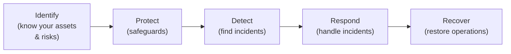
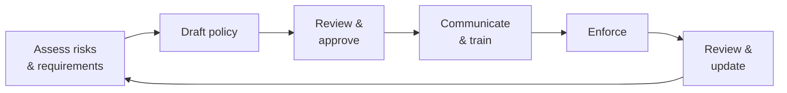

## Security Beyond Technology

Cybersecurity is not just a technical problem — it is also a matter of policy, law, and governance. Even the best technical defenses fail without clear rules about responsibilities, acceptable behaviour, and legal consequences. Governments regulate cyberspace to protect citizens, businesses, and national interests.

**Real-world analogy:** Road safety is not achieved by car engineering alone. It requires traffic laws, licensing, speed limits, and enforcement. Cybersecurity similarly needs both technology (the "engineering") and policy/regulation (the "laws and rules").

---

## Cybersecurity Policy

A **cybersecurity policy** is a formal set of rules and guidelines that define how an organisation or nation protects its information and systems. Policies operate at different levels:

| Level | Scope | Example |
|---|---|---|
| **Organisational** | A single company/institution | A university's IT security policy |
| **National** | An entire country | Nigeria's National Cybersecurity Policy and Strategy |
| **International** | Cross-border cooperation | The Budapest Convention on Cybercrime |

---

## Why Governments Regulate IT

Governments regulate information technology and cyberspace for several reasons:

1. **Protect citizens** — from fraud, identity theft, and privacy violations
2. **Protect critical infrastructure** — power grids, water, healthcare, finance must be secured
3. **National security** — defend against cyber-warfare and espionage
4. **Economic stability** — a secure digital economy attracts investment
5. **Law enforcement** — provide legal basis to prosecute cybercriminals
6. **Data protection** — ensure organisations handle personal data responsibly

---

## Key Areas of Cybersecurity Regulation

### Data Protection and Privacy
Laws governing how personal data is collected, stored, used, and shared.

| Regulation | Region | Key requirement |
|---|---|---|
| **GDPR** | European Union | Strict consent, data subject rights, breach notification |
| **NDPR** | Nigeria | Nigeria Data Protection Regulation — consent, lawful processing |
| **HIPAA** | USA (healthcare) | Protect patient medical data |
| **PCI-DSS** | Global (payments) | Secure handling of payment card data |

**Core data protection principles** (common across regulations):
1. Lawful, fair processing with consent
2. Purpose limitation (use only for stated purpose)
3. Data minimisation (collect only what is needed)
4. Accuracy
5. Storage limitation (do not keep longer than needed)
6. Security (protect against breaches)
7. Accountability (organisations must demonstrate compliance)

**Penalties:** GDPR fines can reach €20 million or 4% of global revenue. These severe penalties make compliance a board-level concern, not just an IT issue.

### Cybercrime Laws
Laws that criminalize hacking, fraud, and other cyber-offences, providing a legal basis for prosecution.

**Nigeria's Cybercrimes Act (2015):** Criminalizes unauthorized access, data interference, identity theft, cyberstalking, and more. It provides law enforcement with the legal framework to pursue cybercriminals.

### Breach Notification Laws
Require organisations to notify authorities and affected individuals when a data breach occurs. This transparency allows victims to protect themselves (e.g., changing passwords, monitoring accounts).

---

## Cybersecurity Guidelines and Standards

Beyond laws, **guidelines and standards** provide recommended best practices. They are often voluntary but widely adopted.

| Standard | Purpose |
|---|---|
| **ISO/IEC 27001** | International standard for information security management systems (ISMS) |
| **NIST Cybersecurity Framework** | US framework: Identify, Protect, Detect, Respond, Recover |
| **CIS Controls** | Prioritized set of defensive actions |

### The NIST Cybersecurity Framework

A widely-used framework organising security into five core functions:

| Function | Question it answers |
|---|---|
| **Identify** | What do we have and what are the risks? |
| **Protect** | How do we safeguard our assets? |
| **Detect** | How do we know when something is wrong? |
| **Respond** | What do we do when an incident occurs? |
| **Recover** | How do we get back to normal? |

This framework gives organisations a structured, comprehensive approach to managing cybersecurity.

---

## The Policy Development Process

A policy is not "write once and forget." It must be communicated to staff, enforced consistently, and reviewed regularly as threats and technology evolve.

---

## National Cybersecurity Strategy

A **national cybersecurity strategy** is a government's high-level plan to protect the nation's cyberspace. Common components:

1. **Protecting critical national infrastructure** (power, water, finance, telecoms)
2. **Combating cybercrime** (laws, law enforcement capacity)
3. **Building cyber defense capabilities** (military and civilian)
4. **Public awareness and education** (citizens as the first line of defense)
5. **International cooperation** (cybercrime crosses borders)
6. **Developing a skilled cybersecurity workforce**

**Example:** Nigeria's National Cybersecurity Policy and Strategy (NCPS) aims to secure the nation's cyberspace, protect critical infrastructure, and build capacity.

---

## Challenges in Cybersecurity Regulation

| Challenge | Why it is hard |
|---|---|
| **Jurisdiction** | Attacks cross borders; laws stop at borders |
| **Pace of change** | Technology evolves faster than laws |
| **Attribution** | Hard to prove who launched an attack |
| **Balancing security and privacy** | Surveillance powers can threaten civil liberties |
| **Balancing security and innovation** | Over-regulation can stifle technology growth |

**The jurisdiction problem:** An attacker in Country A attacks a victim in Country B using servers in Country C. Whose laws apply? Which police investigate? This is why international cooperation (treaties, shared frameworks) is essential.

---

## Key Takeaway

> Cybersecurity is governed not only by technology but by policy, law, and regulation. Governments regulate IT to protect citizens, critical infrastructure, and national security. Data protection laws (GDPR, NDPR) impose strict requirements with severe penalties. Cybercrime laws (Nigeria's Cybercrimes Act 2015) provide a basis for prosecution. Standards like ISO 27001 and the NIST Framework (Identify, Protect, Detect, Respond, Recover) guide best practice. National cybersecurity strategies coordinate a country's defenses. Key challenges include cross-border jurisdiction, the pace of technological change, and balancing security with privacy and innovation.

---

## Exam Tips

**What lecturers test:**
- Explain why governments regulate IT and cyberspace
- Describe data protection principles and name key regulations (GDPR, NDPR)
- Describe the five functions of the NIST Cybersecurity Framework
- Explain components of a national cybersecurity strategy
- Discuss challenges in regulating cyberspace (especially jurisdiction)

**Common mistakes:**
- Treating cybersecurity as purely technical — it has major policy and legal dimensions
- Forgetting that data protection laws carry severe financial penalties
- Underestimating the jurisdiction problem in cross-border attacks

**Likely question:**
> "Why do governments regulate cyberspace? Describe the five core functions of the NIST Cybersecurity Framework. Explain two major challenges governments face in regulating cybersecurity." (14 marks)
