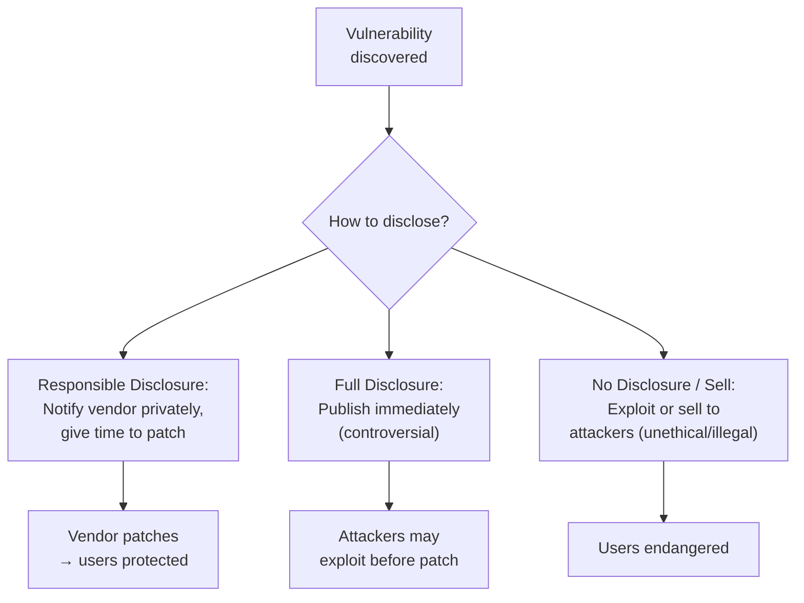

## Power Demands Responsibility

Cybersecurity professionals hold significant power. They have access to sensitive data, knowledge of how to break into systems, and the ability to monitor others' activities. With this power comes serious ethical and legal responsibility.

**Real-world analogy:** A locksmith knows how to open any lock. This skill can serve good (helping people locked out of their homes) or evil (burglary). What separates a professional locksmith from a burglar is not skill — it is ethics and law. Cybersecurity professionals face the same reality.

---

## Why Ethics Matters in Cybersecurity

A security professional could easily:
- Read private emails and messages
- Steal or sell sensitive data
- Plant backdoors for later access
- Use their skills for personal gain

The same techniques that protect systems can be used to attack them. **The only thing distinguishing an ethical professional from a criminal is their commitment to ethical principles and legal compliance.**

---

## Core Ethical Principles for Security Professionals

Professional bodies (IEEE, ACM, (ISC)²) define ethical principles. The key ones:

### 1. Honesty
Conduct all activities and services honestly. Do not misrepresent your capabilities, findings, or actions. If you cannot do something, say so.

### 2. Lawful Behaviour
Comply with all applicable laws and regulations. Even if you have the technical ability to do something, you must not break the law.

### 3. Integrity
Act with integrity at all times. Report conflicts of interest. Do not let personal gain compromise your professional judgment.

### 4. Confidentiality
Respect the privacy and confidentiality of the data you access. Information you encounter in your work must not be disclosed or misused.

### 5. Competence
Maintain professional knowledge and skills. Cybersecurity evolves rapidly — an ethical professional commits to lifelong learning to remain competent.

### 6. Professionalism
Act professionally; serve as a positive role model; assist colleagues and the profession.

### 7. Responsible Disclosure
When you find a vulnerability, report it responsibly — give the vendor time to fix it before publicising it, so attackers do not exploit it in the meantime.

### 8. Avoid Harm
Above all, do not cause harm. Security work should protect people, not endanger them.

---

## Responsible Disclosure: An Ethical Cornerstone

When a security researcher discovers a vulnerability, they face an ethical choice about how to handle it:

| Approach | Ethics |
|---|---|
| **Responsible (coordinated) disclosure** | Ethical — vendor notified privately, given time to patch before public disclosure |
| **Full disclosure** | Controversial — immediate public disclosure pressures vendors but exposes users to risk |
| **Selling the exploit** | Unethical and often illegal — endangers users for profit |

**Bug bounty programs:** Many companies pay researchers who responsibly report vulnerabilities — aligning ethical behaviour with financial reward.

---

## Common Ethical Dilemmas

### Dilemma 1: Discovering a Vulnerability Without Permission
You notice a serious flaw in a company's website while browsing. Do you:
- Test it further to confirm? (May be illegal — unauthorized access)
- Report it? (Ethical, but you risk legal trouble for how you found it)
- Ignore it? (Safe for you, but leaves users at risk)

**Ethical response:** Report it through responsible channels, being careful not to access data or test beyond what is necessary to demonstrate the issue. Do not exploit it.

### Dilemma 2: Employer Asks You to Do Something Unethical
Your manager asks you to monitor an employee's private communications without justification, or to hide a breach from customers.

**Ethical response:** Refuse to participate in illegal or unethical activity. Escalate through proper channels. Your professional ethics override workplace pressure. Document your objections.

### Dilemma 3: Privacy vs. Security
Implementing strong security monitoring may infringe on user privacy. Where is the line?

**Ethical response:** Collect only the data necessary for security; be transparent about monitoring; respect privacy laws; balance the legitimate need for security against individuals' right to privacy.

### Dilemma 4: Dual-Use Knowledge
You develop a powerful security tool that could be used to attack as well as defend.

**Ethical response:** Consider how the tool could be misused; restrict access; document responsible use; weigh the benefit to defenders against the risk to potential victims.

---

## Legal Obligations

Beyond ethics, security professionals have legal obligations:

| Obligation | Description |
|---|---|
| **Authorized access only** | Never access systems without explicit permission (even with good intent) |
| **Data protection compliance** | Handle personal data per GDPR/NDPR |
| **Mandatory breach reporting** | Report breaches as required by law |
| **Respect intellectual property** | Do not steal code, data, or trade secrets |
| **Honour contracts and NDAs** | Maintain confidentiality agreements |

**Critical point:** "I was just testing security" is NOT a legal defense for unauthorized access. Penetration testing requires explicit written authorization (a "rules of engagement" document). Without it, even well-intentioned testing is a crime.

---

## Professional Codes of Conduct

Major professional organisations publish ethics codes that members must follow:

- **(ISC)² Code of Ethics:** Protect society; act honourably; provide diligent service; advance the profession
- **ACM/IEEE Software Engineering Code:** Eight principles covering public interest, client, product, judgment, management, profession, colleagues, and self
- **EC-Council Code of Ethics:** For certified ethical hackers

These codes are not just suggestions — violating them can result in loss of certification and professional standing.

---

## The Ethical Hacker's Authorization

For an ethical hacker, the difference between legal and illegal activity is **authorization**. Before any penetration test:

1. **Written authorization** (scope, what is permitted, what is off-limits)
2. **Rules of engagement** (timing, methods allowed, emergency contacts)
3. **Defined scope** (which systems, what depth)
4. **Confidentiality agreement** (findings kept private)

With these, testing is legal and ethical. Without them, the identical actions are criminal.

---

## Key Takeaway

> Cybersecurity professionals hold the power to access, monitor, and breach systems — only ethics and law distinguish them from criminals. Core ethical principles include honesty, lawful behaviour, integrity, confidentiality, competence, and avoiding harm. Responsible disclosure (notifying vendors privately before going public) is an ethical cornerstone. Professionals face dilemmas around unauthorized vulnerability discovery, unethical employer requests, and privacy vs. security — always resolved by refusing illegal acts and minimising harm. Legally, authorized access only is paramount: "just testing" is no defense for unauthorized access. Ethical hacking is legal only with explicit written authorization.

---

## Exam Tips

**What lecturers test:**
- State and explain core ethical principles for security professionals
- Explain responsible disclosure and contrast it with full disclosure and selling exploits
- Analyse an ethical dilemma and propose an ethical response
- Explain why authorization is the key legal requirement for ethical hacking
- Describe what a professional code of ethics requires

**Common mistakes:**
- Thinking technical skill alone makes someone an "ethical hacker" — authorization and ethics are what matter
- Believing "good intentions" excuse unauthorized access — it does not, legally
- Confusing responsible disclosure (private first) with full disclosure (immediate public)

**Likely question:**
> "Explain the concept of responsible disclosure and why it is considered the ethical way to handle a discovered vulnerability. Describe an ethical dilemma a security professional might face and explain how professional ethics should guide their response." (12 marks)
