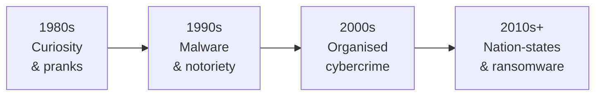

## Understanding the Enemy

To defend against cyber-attacks, you must understand how they have evolved and who is behind them. The motivations, capabilities, and methods of attackers have changed dramatically over decades — from teenage curiosity to billion-dollar criminal enterprises and nation-state operations.

**Real-world analogy:** Crime has evolved — from a lone pickpocket, to organised gangs, to sophisticated international syndicates. Understanding the criminal's motivation and capability shapes how you defend. Cybersecurity is no different.

---

## A Brief History of Cyber-Attacks

### 1970s–1980s: The Era of Curiosity
Early "hackers" were often researchers and hobbyists exploring systems out of curiosity. The first computer worm, the **Morris Worm (1988)**, was created by a student — not to cause harm, but it spread uncontrollably and crashed thousands of computers, demonstrating the danger of self-propagating code.

### 1990s: The Rise of Malware
As personal computers spread, viruses spread with them — often via floppy disks and email attachments. Motivation shifted toward notoriety and mischief. The **ILOVEYOU virus (2000)** spread via email and caused billions in damage worldwide.

### 2000s: Cybercrime Goes Professional
Attackers realised that hacking could be profitable. Organised criminal groups emerged, focused on financial gain: stealing credit cards, banking credentials, and identities. Botnets (networks of infected computers) were rented out for attacks.

### 2010s–Present: Nation-States and Advanced Threats
Governments entered cyberspace as a domain of conflict. **Stuxnet (2010)** — a sophisticated worm believed to be a nation-state creation — physically damaged Iranian nuclear centrifuges, proving that cyber-attacks could cause real-world physical destruction. Ransomware became a billion-dollar criminal industry. Cyber-attacks became tools of espionage, warfare, and large-scale crime.

---

## Categories of Cyber Threats

Modern cyber threats fall into distinct categories based on motivation and actor:

### Cybercrime
Criminal activity targeting or using computers, committed for **financial gain**. Carried out by individuals or organised groups (cybercriminals, hackers).

**Examples:** Credit card fraud, ransomware, identity theft, banking trojans.

### Cyber Warfare
Digital attacks by one **nation-state** to disrupt the vital computer systems of another, with the goal of causing damage, disruption, or destruction.

**Examples:** Attacks on power grids, military systems, election infrastructure.

### Cyber Terrorism
The convergence of cyberspace and terrorism — unlawful attacks against computers and networks to **intimidate or coerce a government or population** for political or social objectives.

**Examples:** Website defacement for propaganda, DoS attacks on government services, attacks on critical infrastructure to spread fear.

### Cyber Espionage (Cyber Spying)
Obtaining secret or confidential information **without permission** — for political, economic, or military advantage.

**Examples:** Stealing trade secrets, accessing classified government data, corporate espionage.

---

## Who Are the Threat Actors?

A **threat actor** is an individual or group that initiates cyber-attacks. Different actors have different capabilities and motivations:

| Threat Actor | Capability | Motivation |
|---|---|---|
| **Nation-states** | Very high (funded, organised) | Espionage, strategic advantage, warfare |
| **Organised crime groups** | High (well-funded, sophisticated) | Financial gain |
| **Highly capable criminals** | High | Profit |
| **Motivated individuals** | Medium | Fame, fun, profit, revenge |
| **Script kiddies** | Low (use pre-made tools) | Curiosity, mischief, notoriety |

### Script Kiddies
Inexperienced attackers who use pre-written tools and scripts created by others, without deep understanding. Despite their low skill, they can cause real damage because powerful attack tools are freely available.

### Insider Threats
A special category — threats from WITHIN the organisation:
- Disgruntled employees leaking or stealing data
- Negligent staff who fall for phishing
- Contractors with excessive access

**Motivations:** Revenge, financial gain, ideology, or simple carelessness. Insider threats are particularly dangerous because insiders already have legitimate access.

---

## Categorising Cybercrime by Target

| Target | Description | Examples |
|---|---|---|
| **Person** | Targets individuals | Phishing, cyberstalking, identity theft, email hacking |
| **Property** | Targets organisations/assets | Credit card fraud, software piracy, DoS attacks, data theft |
| **Government** | Targets state systems | Cyber terrorism, web hacking, espionage |

---

## Why Attacks Are Increasing

Several factors drive the relentless growth in cyber-attacks:

1. **Expanding attack surface:** More devices online (IoT — estimated 64 billion devices by 2026) means more entry points
2. **Profitability:** Ransomware and fraud are highly lucrative
3. **Low risk for attackers:** Attackers can operate from anywhere, often beyond the reach of law enforcement
4. **Availability of tools:** Attack tools and "ransomware-as-a-service" are sold on the dark web
5. **Digital transformation:** More business and personal life is online, raising the stakes
6. **Remote work:** Home networks are less protected than corporate ones

---

## Real-World Impact Examples

| Attack | Year | Impact |
|---|---|---|
| **Stuxnet** | 2010 | Physically destroyed nuclear centrifuges (nation-state) |
| **WannaCry ransomware** | 2017 | Disrupted UK NHS, cancelled thousands of medical appointments |
| **Equifax breach** | 2017 | 147 million people's personal data exposed |
| **Colonial Pipeline** | 2021 | Ransomware shut down major US fuel pipeline |

These show that cyber-attacks have moved from abstract data theft to causing tangible, physical, and societal harm.

---

## The Defender's Takeaway

Understanding the evolution of attacks shapes defense:
- Against **script kiddies:** basic hygiene (patches, strong passwords) defeats most
- Against **organised crime:** layered defenses, employee training, backups
- Against **nation-states:** the most sophisticated defenses; assume breach is possible
- Against **insider threats:** least privilege, monitoring, audit logs

You cannot defend equally against all threats — you assess which actors realistically target your organisation and defend accordingly (linking back to risk management).

---

## Key Takeaway

> Cyber-attacks have evolved from 1980s curiosity-driven exploration, through 1990s malware and 2000s organised cybercrime, to today's nation-state warfare and billion-dollar ransomware. Threats are categorised as cybercrime (financial gain), cyber warfare (nation vs. nation), cyber terrorism (intimidation for political goals), and cyber espionage (stealing secrets). Threat actors range from low-skill script kiddies to highly capable nation-states, plus dangerous insider threats. Attacks are increasing due to expanding attack surfaces, profitability, low risk for attackers, and digital transformation.

---

## Exam Tips

**What lecturers test:**
- Describe the evolution of cyber-attacks across the decades
- Define and distinguish cybercrime, cyber warfare, cyber terrorism, and cyber espionage
- List the types of threat actors and their capabilities/motivations
- Explain what an insider threat is and why it is dangerous
- Explain factors driving the increase in cyber-attacks

**Common mistakes:**
- Confusing cyber warfare (nation-states) with cyber terrorism (intimidation for political/social goals)
- Underestimating script kiddies — low skill but can use powerful pre-made tools
- Forgetting insider threats — not all attacks come from outside

**Likely question:**
> "Describe the four main categories of cyber threats (cybercrime, cyber warfare, cyber terrorism, cyber espionage), distinguishing them by motivation and actor. Explain what an insider threat is and why it poses a particular challenge." (12 marks)
