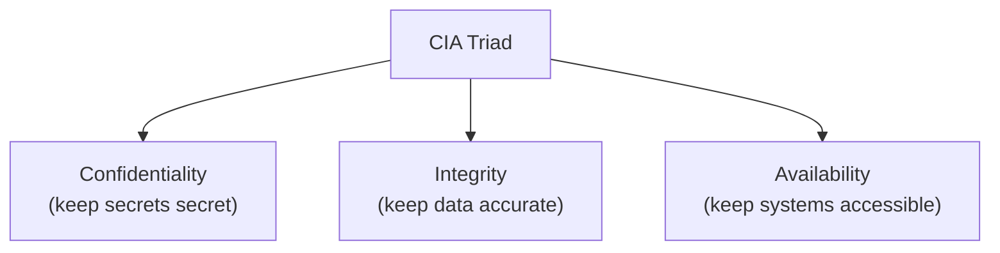
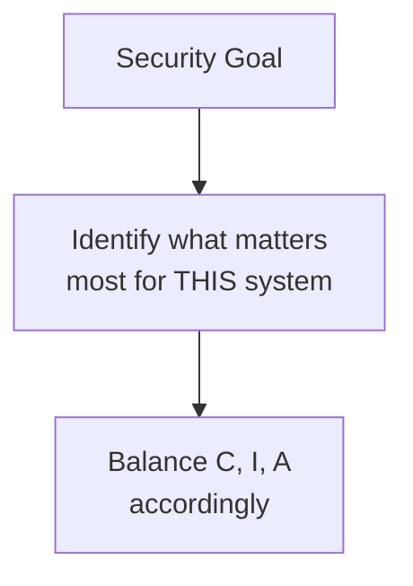

## What Is Cybersecurity?

**Cybersecurity** is the protection of internet-connected systems — including hardware, software, and data — from cyber attacks, damage, or unauthorized access.

Three complementary definitions help build a full picture:

1. **Broad:** Cybersecurity encompasses people, processes, and technologies working together to reduce threats, reduce vulnerabilities, deter attacks, respond to incidents, and recover from them.

2. **Technical:** The body of technologies, processes, and practices designed to protect networks, computers, programs, and data from attack, damage, or unauthorized access.

3. **Simple:** The protection of internet-connected systems from cyber attacks.

**Breaking down the word:**
- **Cyber** = anything related to computer systems, networks, programs, or data
- **Security** = protection — including systems security, network security, application security, and information security

---

## What Is Cyberspace?

**Cyberspace** is the digital environment where information is generated, processed, stored, and exchanged through interconnected systems and communications.

It is the virtual, non-physical world created by interconnected computer networks. When you send a message, shop online, or play an online game, those interactions happen "in cyberspace."

**Real-world analogy:** Cyberspace is to digital interactions what physical space is to physical interactions. Just as a city has roads (networks), buildings (servers), and people moving between them (data), cyberspace has the same structure in digital form.

---

## The CIA Triad: The Foundation of Security

Every security measure, every attack, and every defense relates to one or more of three core properties. These three properties form the **CIA Triad** — the most fundamental model in cybersecurity.

> **CIA does not refer to the intelligence agency.** It stands for Confidentiality, Integrity, Availability.

---

## Pillar 1: Confidentiality

**Confidentiality** means preventing the disclosure of information to unauthorized parties. Only those who are permitted to see data should be able to see it.

**Real-world analogy:** Confidentiality is like a sealed letter. Only the intended recipient should be able to open and read it. If a stranger reads your private letter, confidentiality is broken.

**How confidentiality is compromised:**
- Weak or cracked encryption
- Man-in-the-Middle (MITM) attacks (intercepting communications)
- Unauthorized disclosure of sensitive data
- Shoulder-surfing (looking over someone's shoulder)

**Measures to ensure confidentiality:**
1. **Data encryption** — converting readable plaintext into unreadable ciphertext; only those with the key can decrypt
2. **Two-factor authentication (2FA)** — requiring two forms of identity verification
3. **Biometric verification** — fingerprints, face recognition
4. **Security tokens** — physical or digital devices proving identity

**Example:** When you log into your bank, your password and account details are encrypted so that even if someone intercepts the data, they cannot read it. That is confidentiality in action.

---

## Pillar 2: Integrity

**Integrity** means protecting information from being modified by unauthorized parties. Data must remain accurate, complete, and trustworthy.

**Real-world analogy:** Integrity is like a tamper-evident seal on a medicine bottle. If the seal is broken, you know the contents may have been altered and cannot be trusted. Data integrity ensures that information has not been tampered with.

**How integrity is compromised:**
- Unauthorized modification of data
- Transmission errors that corrupt data
- Malware that alters files
- Insider tampering

**Measures to ensure integrity:**
1. **Cryptographic checksums / hashes** — a "fingerprint" of data; if the data changes, the fingerprint changes, revealing tampering
2. **File permissions** — restricting who can modify data
3. **Uninterrupted power supplies** — preventing corruption from power failures
4. **Data backups** — restoring correct data if it is altered

**Example:** When you download software, the website often provides a "hash" (like SHA-256). After downloading, you can compute the hash of your file and compare. If they match, the file was not tampered with in transit — integrity confirmed.

---

## Pillar 3: Availability

**Availability** means ensuring that authorized parties can access information and systems when they need them. A secure system is useless if legitimate users cannot use it.

**Real-world analogy:** Availability is like a 24-hour pharmacy. The medicine must be there when you need it. If the pharmacy is locked when you have an emergency, it does not matter how secure the medicine cabinet is — you cannot get what you need.

**How availability is compromised:**
- Denial-of-Service (DoS) attacks (flooding a system so legitimate users cannot access it)
- Hardware failures
- Power outages
- Natural disasters
- Ransomware (locking access to data)

**Measures to ensure availability:**
1. **Data backups** to external drives or cloud
2. **Firewalls** to block malicious traffic
3. **Backup / uninterrupted power supplies (UPS)**
4. **Data redundancy** (multiple copies, multiple servers)
5. **Routine system maintenance**
6. **Disaster recovery strategies**

**Example:** When a website uses multiple servers in different locations, if one server fails, others take over — the website remains available. That is availability engineering.

---

## The Triad in Balance

The three pillars often involve trade-offs. Maximizing one can compromise another:

| Scenario | Trade-off |
|---|---|
| Encrypting everything heavily (high confidentiality) | May slow down access (lower availability) |
| Making data freely accessible (high availability) | May expose it (lower confidentiality) |
| Locking data with strict permissions (high integrity) | May frustrate legitimate edits (lower availability) |

Good security finds the **right balance** for the specific context. A public news website prioritizes availability. A military intelligence system prioritizes confidentiality. A banking system needs all three at high levels.

---

## Worked Scenario: Applying the CIA Triad

**Scenario:** A university stores student records (names, grades, financial data) in an online system.

| Threat | Pillar affected | Protection |
|---|---|---|
| Hacker steals and publishes grades | Confidentiality | Encryption, access control |
| Someone changes a student's grade illegally | Integrity | Audit logs, permissions, checksums |
| System crashes during registration week | Availability | Redundant servers, backups, load balancing |

A complete security plan addresses all three pillars.

---

## Key Takeaway

> Cybersecurity protects internet-connected systems from attack and unauthorized access. Cyberspace is the digital environment where information is created, stored, and exchanged. The CIA Triad is the foundation of all security: **Confidentiality** (only authorized parties can read data — via encryption, 2FA), **Integrity** (data is not tampered with — via hashes, permissions), and **Availability** (authorized users can access systems when needed — via backups, redundancy, firewalls). Every security concept relates to one or more of these three pillars, and good security balances them for the specific context.

---

## Exam Tips

**What lecturers test:**
- Define cybersecurity and cyberspace
- State and explain the three pillars of the CIA triad — with a real-world analogy for each
- For each pillar, list how it is compromised and how it is protected
- Apply the CIA triad to a given scenario (classify threats by pillar)
- Explain the trade-offs between the three pillars

**Common mistakes:**
- Thinking CIA means the intelligence agency — it is Confidentiality, Integrity, Availability
- Confusing integrity (data not altered) with confidentiality (data not disclosed)
- Forgetting availability is a security goal — many students focus only on keeping data secret

**Likely question:**
> "Explain the CIA triad. For each of the three components, define it, give a real-world analogy, state one way it can be compromised, and state two measures to protect it." (15 marks)
