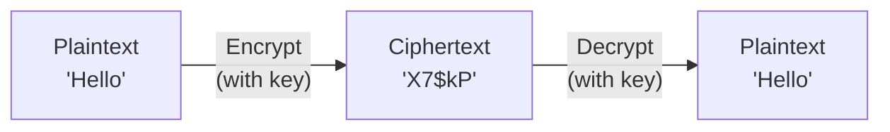
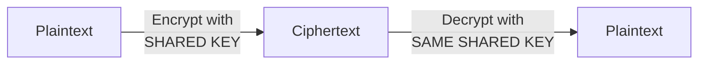
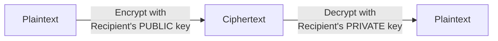
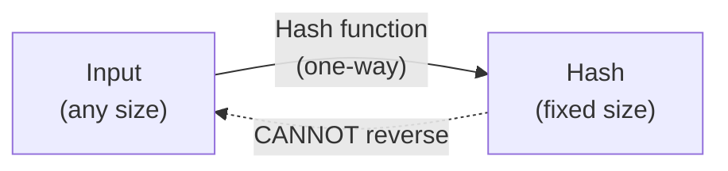

## The Need for Secrecy

Imagine sending a postcard through the mail. Anyone who handles it — postal workers, sorters, anyone — can read it. Now imagine you want to send a private message. You need a way to scramble it so that only the intended recipient can unscramble it.

**Cryptography** is the science of securing communication and information through codes, so that only authorized parties can read it. It transforms readable information (**plaintext**) into scrambled information (**ciphertext**) and back again.

**Real-world analogy:** Cryptography is like a locked box. You put a message in, lock it, and send it. Only someone with the right key can unlock it and read the message. Anyone who intercepts the locked box sees only a sealed container.

---

## Core Cryptography Terms

| Term | Meaning |
|---|---|
| **Plaintext** | The original readable message |
| **Ciphertext** | The scrambled, unreadable message |
| **Encryption** | Converting plaintext → ciphertext |
| **Decryption** | Converting ciphertext → plaintext |
| **Key** | The secret value that controls encryption/decryption |
| **Cipher** | The algorithm used to encrypt/decrypt |



---

## A Simple Example: The Caesar Cipher

Before modern cryptography, simple ciphers were used. The **Caesar cipher** shifts each letter by a fixed number of positions.

**Example (shift of 3):**
- A → D, B → E, C → F, ... X → A, Y → B, Z → C

Plaintext: `HELLO`  
Ciphertext: `KHOOR` (each letter shifted 3 forward)

To decrypt, shift back by 3: `KHOOR` → `HELLO`.

**The key** is the shift amount (3). Anyone who knows the key can decrypt.

**Weakness:** Only 25 possible keys — easily broken by trying all of them (brute force). Modern cryptography uses keys so large that brute force is computationally impossible.

---

## Type 1: Symmetric Encryption

In **symmetric encryption**, the SAME key is used for both encryption and decryption. The sender and receiver must both have the same secret key.



**Real-world analogy:** A single key that both locks and unlocks a door. Both you and your trusted friend have identical copies of this one key.

**Examples of symmetric algorithms:** AES (Advanced Encryption Standard), DES, 3DES.

**Advantages:**
- Fast — efficient for large amounts of data
- Strong when using modern algorithms like AES-256

**The key distribution problem:**
How do you securely share the secret key in the first place? If you send the key over the internet, an attacker could intercept it. This is symmetric encryption's main weakness — and it is what asymmetric encryption solves.

---

## Type 2: Asymmetric Encryption (Public-Key)

In **asymmetric encryption**, there are TWO different but mathematically related keys:
- A **public key** — shared openly with everyone
- A **private key** — kept secret by the owner

What one key encrypts, only the other can decrypt.



**Real-world analogy:** A public mailbox. Anyone can drop a letter in (encrypt with the public key — the slot is open to all). But only the owner has the key to open the mailbox and read the letters (decrypt with the private key).

**How it solves key distribution:**
- You publish your public key for everyone to see — no secrecy needed
- Anyone can encrypt a message to you using your public key
- Only YOU can decrypt it, using your private key
- The private key never travels anywhere — no interception risk

**Examples of asymmetric algorithms:** RSA, ECC (Elliptic Curve Cryptography).

**Advantages:** Solves key distribution; enables digital signatures.  
**Disadvantage:** Much slower than symmetric encryption.

### The Best of Both Worlds

In practice, systems combine both:
1. Use slow asymmetric encryption to securely exchange a symmetric key
2. Use fast symmetric encryption for the actual data

This is how HTTPS (secure websites) works — the padlock in your browser.

---

## Type 3: Hashing

**Hashing** is different from encryption. A **hash function** takes input of any size and produces a fixed-size output (the "hash" or "digest"). Crucially, hashing is **one-way** — you cannot reverse it to get the original input.



**Real-world analogy:** Hashing is like a fingerprint. A person's fingerprint uniquely identifies them, but you cannot reconstruct the person from just their fingerprint. A hash uniquely represents data, but you cannot reconstruct the data from the hash.

**Properties of a good hash function:**
1. **Deterministic** — same input always gives the same hash
2. **One-way** — cannot reverse the hash to find the input
3. **Collision-resistant** — extremely unlikely for two different inputs to produce the same hash
4. **Avalanche effect** — a tiny change in input drastically changes the hash

**Examples of hash functions:** SHA-256, SHA-3, MD5 (now considered weak).

**Example:**
```
SHA-256("hello")  = 2cf24dba5fb0a30e26e83b2ac5b9e29e...
SHA-256("hellp")  = a7c8e9f12d4b6e8a0c2f5d7b9e1a3c5f...  (completely different!)
```

Changing just one letter (`hello` → `hellp`) produces a totally different hash — the avalanche effect.

**Uses of hashing:**
- **Password storage:** Store the hash of a password, not the password itself. When you log in, the system hashes your input and compares hashes. Even if the database is stolen, the actual passwords are not revealed.
- **Integrity verification:** Hash a file before and after transmission; if hashes match, the file was not altered.

---

## Digital Signatures

A **digital signature** combines hashing and asymmetric encryption to prove that a message came from a specific sender and was not altered.

**How it works:**
1. The sender hashes the message
2. The sender encrypts the hash with their PRIVATE key — this is the signature
3. The recipient decrypts the signature with the sender's PUBLIC key to get the hash
4. The recipient independently hashes the message and compares

If the hashes match: the message is authentic (only the sender's private key could create the signature) and unaltered (the hash matches).

**This provides:**
- **Authentication** — proves who sent it
- **Integrity** — proves it was not changed
- **Non-repudiation** — the sender cannot deny signing it

---

## Comparing the Three

| Technique | Keys | Reversible? | Main use |
|---|---|---|---|
| **Symmetric encryption** | One shared key | Yes (with key) | Fast bulk data encryption |
| **Asymmetric encryption** | Public + private pair | Yes (with private key) | Key exchange, signatures |
| **Hashing** | No key | No (one-way) | Integrity, password storage |

---

## Key Takeaway

> Cryptography secures information by converting plaintext to ciphertext. **Symmetric encryption** uses one shared key — fast but requires secure key distribution. **Asymmetric encryption** uses a public/private key pair — the public key encrypts, only the matching private key decrypts, solving key distribution. **Hashing** is one-way (cannot be reversed), producing a fixed-size fingerprint used for integrity checks and password storage. **Digital signatures** combine hashing and asymmetric encryption to provide authentication, integrity, and non-repudiation.

---

## Exam Tips

**What lecturers test:**
- Define plaintext, ciphertext, encryption, decryption, key
- Distinguish symmetric and asymmetric encryption — keys used, speed, key distribution
- Explain how asymmetric encryption solves the key distribution problem
- Explain hashing — why it is one-way, and the avalanche effect
- Explain how passwords should be stored (hashed, not plaintext)
- Describe how a digital signature works and what three properties it provides

**Common mistakes:**
- Saying hashing is "encryption" — hashing is one-way and has no key; encryption is reversible with a key
- Confusing which key encrypts in asymmetric: to send a secret TO someone, use THEIR public key
- Thinking symmetric encryption is "weaker" — AES-256 is extremely strong; its only issue is key distribution

**Likely question:**
> "Distinguish between symmetric and asymmetric encryption. Explain how asymmetric encryption solves the key distribution problem inherent in symmetric encryption. Why should passwords be stored using hashing rather than encryption?" (14 marks)
