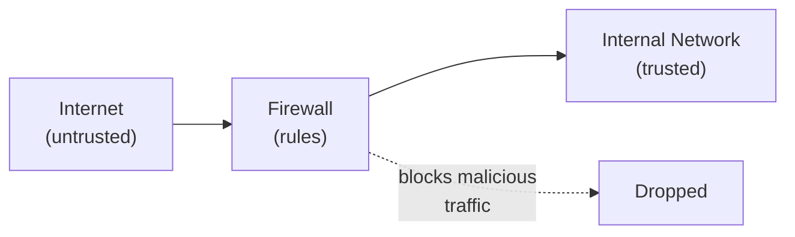
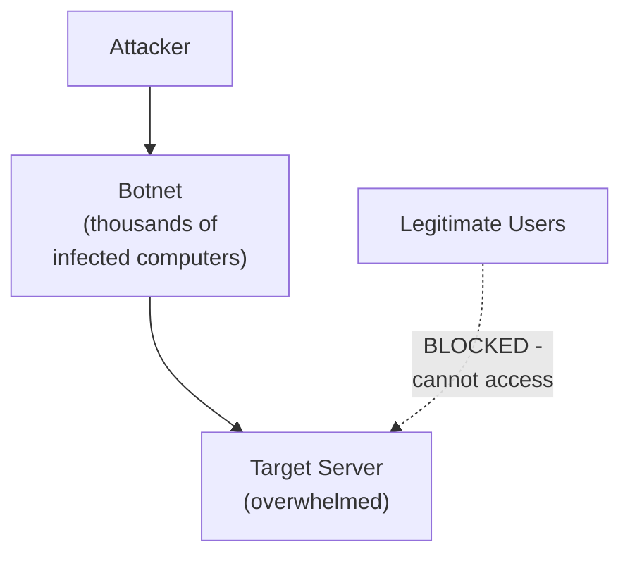

## Why Network Security Matters

Data is most vulnerable when it moves. A file sitting on an encrypted disk is relatively safe; the same file travelling across the internet passes through many networks and devices, any of which could intercept it. **Network security** protects data and systems as they communicate over networks.

**Real-world analogy:** Securing a building (host security) is different from securing the roads between buildings (network security). A valuable item is safe in a vault, but during transport between vaults it is exposed to robbery. Network security guards the "roads" data travels on.

---

## Core Network Security Tools

### Firewalls
A **firewall** monitors and controls network traffic based on security rules. It sits between a trusted internal network and untrusted external networks (like the internet), deciding which traffic to allow or block.

**Types:**
- **Packet-filtering firewall:** examines individual packets (source/destination, port)
- **Stateful firewall:** tracks the state of connections, more intelligent
- **Application firewall:** inspects the content of traffic at the application level

### Virtual Private Networks (VPN)
A **VPN** creates an encrypted "tunnel" through the public internet. Data inside the tunnel is encrypted, so even though it travels over public networks, it cannot be read by interceptors.

**Use case:** A remote worker connects to the company network via VPN — their traffic is encrypted, protecting confidentiality even on an untrusted home or public Wi-Fi network.

### Encryption in Transit (TLS/HTTPS)
**TLS (Transport Layer Security)** encrypts data between a client and server. This is what the padlock icon and "https://" in your browser indicate — your communication with the website is encrypted, protecting against interception (Man-in-the-Middle attacks).

### Network Segmentation
Dividing a network into isolated zones so that a breach in one zone does not spread to others. For example, keeping the guest Wi-Fi separate from the internal corporate network.

---

## Denial-of-Service (DoS) Attacks

A **Denial-of-Service (DoS)** attack aims to make a system or network unavailable to legitimate users — directly attacking the **Availability** pillar of the CIA triad.

**How it works:** The attacker floods the target with so much traffic or so many requests that the system is overwhelmed and cannot respond to legitimate users.

**Real-world analogy:** Imagine hundreds of fake customers crowding into a shop, blocking the entrance and occupying all the staff with pointless questions. Real customers cannot get in or get served. The shop is effectively shut down without any break-in.

### DoS vs. DDoS

| Type | Source | Description |
|---|---|---|
| **DoS** | Single source | One machine floods the target |
| **DDoS (Distributed)** | Many sources | Thousands of machines (a botnet) flood the target simultaneously |

**DDoS is far more dangerous** because:
- Traffic comes from thousands of sources — hard to block by IP
- The combined volume can be massive (terabits per second)
- The attacking computers are often innocent victims (infected machines in a botnet)

### Defending Against DoS/DDoS
- **Rate limiting:** restrict requests per source
- **Traffic filtering:** block suspicious patterns
- **DDoS mitigation services:** (e.g., Cloudflare) absorb and filter massive traffic
- **Over-provisioning:** having enough capacity to absorb attacks

---

## Malware: Malicious Software

**Malware** is any software designed to harm, exploit, or compromise systems. Different types behave differently.

### Virus
A **virus** is malicious code that attaches itself to a legitimate program or file. It requires a **host** and **human action** to spread — when the user runs the infected program, the virus activates and infects other files.

**Analogy:** Like a biological virus, it cannot spread on its own — it needs a host (the program) and a carrier (the user running it). It attaches to healthy files and corrupts them.

**Characteristics:**
- Requires user action (running the infected file)
- Attaches to host files
- Spreads when infected files are shared

### Worm
A **worm** is self-replicating malware that spreads **automatically** across networks WITHOUT needing a host file or human action.

**Analogy:** Unlike a virus, a worm is like a self-driving infectious agent — it moves from computer to computer on its own, exploiting network vulnerabilities, with no human needed.

**Characteristics:**
- Self-propagating (no human action needed)
- Spreads across networks automatically
- Can spread extremely fast (the Morris Worm, WannaCry)

**Key difference: Virus needs human action and a host file; a worm spreads automatically by itself.**

### Trojan Horse
A **Trojan** is malware disguised as legitimate software. The user is tricked into installing it, believing it is something useful.

**Analogy:** Named after the wooden horse of Greek mythology — it looks like a gift, but soldiers (malware) are hidden inside. The user willingly brings it in.

**Characteristics:**
- Disguised as legitimate software
- Does not self-replicate
- Often creates a "backdoor" for the attacker

### Ransomware
**Ransomware** encrypts the victim's files and demands payment (ransom) for the decryption key. It directly attacks Availability.

**Examples:** WannaCry (2017) disrupted the UK NHS. Colonial Pipeline (2021) shut down US fuel distribution.

**Defense:** Regular, tested backups (so you can restore without paying), prompt patching (WannaCry exploited an unpatched vulnerability).

### Other Malware Types

| Type | Behaviour |
|---|---|
| **Spyware** | Secretly monitors and collects user information |
| **Adware** | Displays unwanted advertisements |
| **Rootkit** | Hides deep in the system to maintain stealthy access |
| **Botnet malware** | Turns the computer into a "bot" controlled by an attacker |

---

## Comparison: Virus vs. Worm vs. Trojan

| Property | Virus | Worm | Trojan |
|---|---|---|---|
| Self-replicating | Yes (via host files) | Yes (automatically) | No |
| Needs host file | Yes | No | No |
| Needs human action | Yes | No | Yes (to install) |
| Spreads over network alone | No | Yes | No |
| Disguised as legitimate | No | No | Yes |

---

## Social Engineering: Attacking the Human

Many attacks bypass technical defenses entirely by manipulating people. **Social engineering** exploits human psychology rather than technical vulnerabilities.

| Technique | Description |
|---|---|
| **Phishing** | Fake emails/messages tricking users into revealing credentials or clicking malicious links |
| **Spear phishing** | Targeted phishing using personal information to appear legitimate |
| **Pretexting** | Creating a false scenario (impersonating IT support, police) to extract information |
| **Baiting** | Offering something enticing (free download, USB drive) to deliver malware |
| **Scareware** | Fake warnings ("Your PC is infected!") to trick users into installing malware |

**Why it works:** It is often easier to trick a person into giving up their password than to crack it technically. Humans are frequently the weakest link, which is why security training is essential.

---

## Key Takeaway

> Network security protects data in transit using firewalls (control traffic), VPNs (encrypted tunnels), TLS/HTTPS (encrypted web traffic), and network segmentation. Denial-of-Service (DoS) attacks flood systems to make them unavailable; DDoS uses a botnet of many machines and is far harder to stop. Malware types differ: a **virus** needs a host file and human action; a **worm** self-propagates automatically across networks; a **Trojan** is disguised as legitimate software; **ransomware** encrypts files for payment. Social engineering attacks the human element through phishing, pretexting, and baiting — often the easiest path for attackers.

---

## Exam Tips

**What lecturers test:**
- Explain how a DoS attack works and why DDoS is harder to defend against
- Distinguish virus, worm, and Trojan clearly (the comparison table is high-value)
- Describe network security tools (firewall, VPN, TLS)
- Explain social engineering techniques, especially phishing
- Explain ransomware and the best defense (backups + patching)

**Common mistakes:**
- Confusing virus (needs host + human action) with worm (self-propagating) — this is the most commonly tested distinction
- Thinking a firewall stops all attacks — it controls network traffic but does not stop social engineering or malware already inside
- Forgetting that DoS attacks Availability specifically

**Likely question:**
> "Distinguish between a virus, a worm, and a Trojan horse, stating how each spreads. Explain how a Distributed Denial-of-Service (DDoS) attack works and why it is more difficult to defend against than a simple DoS attack." (14 marks)
