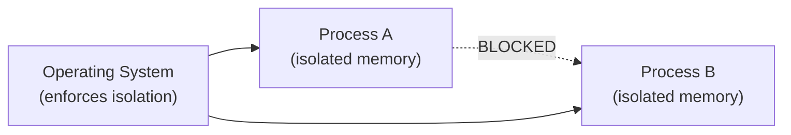
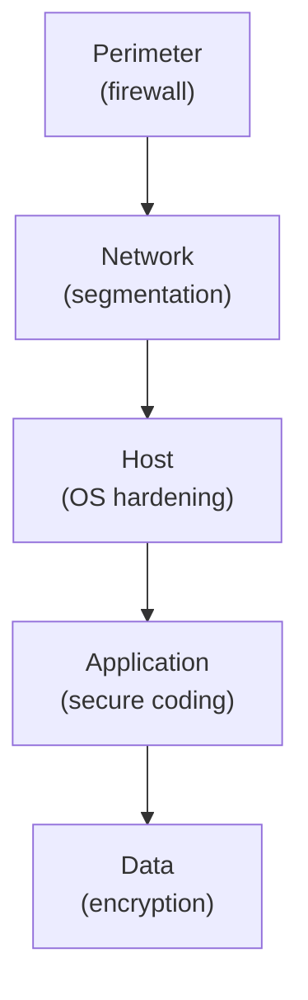
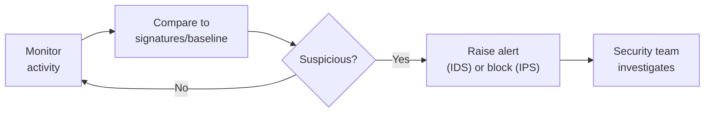

## The Operating System as Security Gatekeeper

The operating system (OS) sits between applications and hardware. It controls every access to memory, files, devices, and the network. This makes the OS the most fundamental security gatekeeper — if the OS is compromised, everything running on it is compromised.

**Real-world analogy:** The OS is like a building's central security system. It controls who enters which rooms, what each person can access, and logs all activity. If the security system itself is hacked, no individual lock matters.

---

## OS Protection Mechanisms

### 1. Process Isolation
Each running program (process) is given its own isolated memory space. One process cannot read or write another process's memory.

**Why it matters:** If a malicious program runs, it cannot directly read another program's sensitive data (like passwords held in memory by your browser). The OS enforces strict boundaries.



### 2. User Mode vs. Kernel Mode
Modern CPUs operate in two privilege levels:

| Mode | Privilege | Who runs here |
|---|---|---|
| **Kernel mode** | Full hardware access | The OS core (kernel) |
| **User mode** | Restricted access | Applications |

Applications run in user mode and cannot directly access hardware. To do anything privileged (read a file, access the network), they must ask the OS via a **system call**. The OS checks permissions before allowing the operation.

**Why it matters:** A buggy or malicious application cannot directly crash the system or access hardware — it is sandboxed in user mode. This containment limits the damage any single program can do.

### 3. Access Control and File Permissions
The OS enforces who can read, write, or execute each file. Recall the access control models (DAC, MAC, RBAC). The OS is what actually enforces these rules at runtime.

**Unix/Linux file permissions example:**
```
-rwxr-xr--   owner: read/write/execute
             group: read/execute
             others: read only
```

### 4. Authentication and User Accounts
The OS maintains user accounts and authenticates users at login. Each user has an identity and associated permissions. The OS ensures users can only do what their account permits.

### 5. Memory Protection
Beyond isolation, the OS uses techniques like:
- **Address Space Layout Randomization (ASLR):** randomizes memory locations so attackers cannot predict where to inject code
- **Data Execution Prevention (DEP):** marks certain memory regions as non-executable, preventing injected code from running

These directly counter buffer overflow attacks.

---

## Defense in Depth

No single mechanism is sufficient. **Defense in depth** layers multiple protections so that if one fails, others still protect the system.



**Analogy:** A castle does not rely on one wall. It has a moat, outer walls, inner walls, guards, and a keep. An attacker must defeat every layer. Defense in depth applies the same principle to information systems.

---

## Intrusion Detection Systems (IDS)

Despite all protections, determined attackers sometimes get through. An **Intrusion Detection System (IDS)** monitors systems and networks for signs of malicious activity or policy violations, and raises alerts.

**Analogy:** An IDS is like a burglar alarm. Locks (OS protections) try to keep intruders out. But if someone breaks in anyway, the alarm (IDS) detects the intrusion and alerts you.

### Types of IDS

| Type | Monitors | Example |
|---|---|---|
| **Network-based IDS (NIDS)** | Network traffic | Detects a port scan or flood across the network |
| **Host-based IDS (HIDS)** | Activity on a single host | Detects unauthorized changes to system files |

### Detection Methods

**1. Signature-based detection**
Compares activity against a database of known attack patterns ("signatures").

- **Strength:** Very accurate for known attacks; few false positives
- **Weakness:** Cannot detect new (zero-day) attacks with no signature yet

**Analogy:** Like recognizing a wanted criminal from a photo. Works perfectly if you have the photo — useless against someone not yet in the database.

**2. Anomaly-based detection**
Establishes a baseline of "normal" behaviour and flags deviations.

- **Strength:** Can detect new, unknown attacks
- **Weakness:** More false positives (unusual but legitimate behaviour gets flagged)

**Analogy:** Like noticing someone behaving strangely even if you do not recognize them. Catches new threats but may raise false alarms.

### IDS vs. IPS

| System | Action |
|---|---|
| **IDS (Detection)** | Detects and ALERTS — passive |
| **IPS (Prevention)** | Detects and BLOCKS — active |

An **Intrusion Prevention System (IPS)** goes further than an IDS — it not only detects attacks but actively blocks them in real time (e.g., dropping malicious packets, blocking the attacker's IP).

---

## The Detection Process



---

## Logging and Auditing

A crucial OS security feature: **logging**. The OS records security-relevant events:
- Login attempts (successful and failed)
- File access
- Permission changes
- System errors

**Audit logs** serve multiple purposes:
- **Detection:** Unusual patterns (many failed logins) signal attacks
- **Investigation:** After an incident, logs reveal what happened
- **Non-repudiation:** Logs prove who did what (linking to non-repudiation)

**Important:** Logs themselves must be protected — attackers often try to delete logs to hide their tracks. Logs should be written to secure, tamper-resistant storage.

---

## Worked Example: Detecting a Brute-Force Attack

**Scenario:** An attacker tries thousands of password combinations against a user account.

**How OS protection + IDS respond:**
1. **OS logging** records each failed login attempt
2. **Anomaly-based IDS** notices an abnormal rate of failed logins from one IP
3. **Alert raised** — security team notified
4. **IPS (if present)** automatically blocks the attacking IP
5. **Account lockout** policy (OS-enforced) locks the account after N failed attempts

Multiple layers (defense in depth) work together: logging detects, IDS alerts, IPS/lockout blocks.

---

## Key Takeaway

> The operating system is the fundamental security gatekeeper, enforcing process isolation, user/kernel mode separation, access control, authentication, and memory protection (ASLR, DEP). Defense in depth layers multiple protections so failure of one does not compromise the system. Intrusion Detection Systems (IDS) monitor for malicious activity using signature-based detection (known attacks) or anomaly-based detection (deviations from normal). An IPS goes further by actively blocking attacks. Logging and auditing record security events for detection, investigation, and non-repudiation.

---

## Exam Tips

**What lecturers test:**
- Describe OS protection mechanisms (process isolation, user/kernel mode, access control, memory protection)
- Explain defense in depth with an example
- Distinguish signature-based and anomaly-based IDS — strengths and weaknesses of each
- Distinguish IDS (detect/alert) from IPS (detect/block)
- Explain the importance of logging and why logs must be protected

**Common mistakes:**
- Confusing IDS (passive, alerts) with IPS (active, blocks)
- Thinking signature-based detection can catch zero-day attacks — it cannot (no signature exists yet)
- Forgetting that anomaly-based detection produces more false positives

**Likely question:**
> "Distinguish between signature-based and anomaly-based intrusion detection, giving the strengths and weaknesses of each. Explain the principle of defense in depth and how it would protect against an attacker attempting to breach a system." (12 marks)
