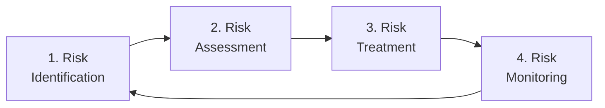

## You Cannot Eliminate All Risk

Perfect security is impossible. Every system has vulnerabilities; every organisation faces threats. The goal of **risk management** is not to eliminate all risk — that would be impossibly expensive — but to identify risks, understand them, and reduce them to an acceptable level.

**Real-world analogy:** You cannot make driving 100% safe, but you manage the risk: wear a seatbelt, maintain the car, drive carefully, buy insurance. Risk management applies the same thinking to information security.

---

## Key Terms

| Term | Definition |
|---|---|
| **Asset** | Something valuable to protect (data, systems, reputation) |
| **Threat** | A potential cause of harm (hacker, malware, flood) |
| **Vulnerability** | A weakness that a threat can exploit (unpatched software, weak password) |
| **Risk** | The potential for loss when a threat exploits a vulnerability |
| **Impact** | The damage if the risk materializes |

**The relationship:**

$$\text{Risk} = \text{Threat} \times \text{Vulnerability} \times \text{Impact}$$

A threat with no matching vulnerability poses little risk. A vulnerability with no threat to exploit it poses little risk. Risk exists when threat, vulnerability, and potential impact combine.

---

## The Risk Management Process

### Step 1: Risk Identification
Identify assets, the threats to them, and the vulnerabilities that could be exploited.

**Example assets and threats:**

| Asset | Threat | Vulnerability |
|---|---|---|
| Student database | Hackers | Unpatched server software |
| Email system | Phishing | Untrained staff |
| Website | DDoS attack | No traffic filtering |
| Physical servers | Fire/flood | No off-site backup |

### Step 2: Risk Assessment
For each risk, assess:
- **Likelihood:** How probable is it? (Low / Medium / High)
- **Impact:** How severe would the damage be? (Low / Medium / High / Catastrophic)

**Risk Level = Likelihood × Impact**

#### The Risk Matrix

| Likelihood \ Impact | Low | Medium | High |
|---|---|---|---|
| **High** | Medium | High | **Critical** |
| **Medium** | Low | Medium | High |
| **Low** | Negligible | Low | Medium |

Prioritize the Critical and High risks (top-right).

### Step 3: Risk Treatment
For each significant risk, choose a strategy:

| Strategy | Description | Example |
|---|---|---|
| **Avoid** | Eliminate the risk | Don't store data you don't need |
| **Reduce (Mitigate)** | Lower likelihood or impact | Patch software, train staff, encrypt data |
| **Transfer** | Shift risk to another party | Buy cyber-insurance; outsource to a secure provider |
| **Accept** | Acknowledge and prepare | Accept minor risks with a contingency plan |

### Step 4: Risk Monitoring
Risks change over time. New threats emerge; systems change. Continuously review and update the risk assessment.

---

## Disaster Recovery and Business Continuity

Despite the best risk management, disasters happen — fires, floods, cyberattacks, hardware failures. **Disaster Recovery (DR)** and **Business Continuity Planning (BCP)** prepare the organisation to survive and recover.

### The Difference

| Concept | Focus |
|---|---|
| **Business Continuity (BCP)** | Keeping the business running during a disruption (the whole organisation) |
| **Disaster Recovery (DR)** | Restoring IT systems and data after a disaster (the technology) |

DR is a subset of BCP. BCP asks "how do we keep operating?"; DR asks "how do we get our systems back?"

---

## Two Critical Disaster Recovery Metrics

### Recovery Time Objective (RTO)
The maximum acceptable time to restore a system after a disaster.

**Example:** "Our student portal must be back online within 4 hours of any outage." RTO = 4 hours.

### Recovery Point Objective (RPO)
The maximum acceptable amount of data loss, measured in time.

**Example:** "We can afford to lose at most 1 hour of data." This means backups must run at least every hour. RPO = 1 hour.

**Worked example:** A bank with RPO = 5 minutes and RTO = 30 minutes:
- Backups every 5 minutes (so at most 5 minutes of transactions lost)
- Full recovery within 30 minutes of any disaster

Tighter RTO/RPO requires more investment (real-time replication, hot standby servers).

---

## Disaster Recovery Strategies

| Strategy | Description | Cost | Recovery speed |
|---|---|---|---|
| **Backup & Restore** | Restore from backups | Low | Slow (hours-days) |
| **Cold Site** | Empty facility, set up after disaster | Low-medium | Slow |
| **Warm Site** | Partially equipped standby facility | Medium | Medium |
| **Hot Site** | Fully equipped, continuously synced | High | Fast (minutes) |

A hospital's life-critical systems need a hot site (instant failover). A small business newsletter system might survive with simple backups.

---

## The Disaster Recovery Plan

A documented DR plan includes:
1. **Risk assessment** — what disasters are possible
2. **Critical systems list** — what must be recovered first (prioritized)
3. **Backup procedures** — what is backed up, how often, where stored
4. **Recovery procedures** — step-by-step restoration instructions
5. **Roles and contacts** — who does what, contact information
6. **Testing schedule** — DR plans must be tested regularly (an untested plan often fails when needed)

---

## The 3-2-1 Backup Rule

A widely-recommended backup strategy:

- **3** copies of your data
- **2** different storage media
- **1** copy off-site

**Example:** Original data on the server (1), backup on an external drive (2), and a copy in cloud storage off-site (3, off-site). If the building burns down, the off-site cloud copy survives.

---

## Worked Example: DR Plan for a University

**Critical systems (prioritized):**
1. Student records database (RTO: 2 hours, RPO: 15 minutes)
2. Learning management system (RTO: 4 hours, RPO: 1 hour)
3. Library catalogue (RTO: 24 hours, RPO: 24 hours)

**Strategy:**
- Student records: hot standby with real-time replication (most critical)
- LMS: warm site, hourly backups
- Library: simple daily backups (least critical)

**3-2-1 implementation:** Data on primary server, nightly backup to on-campus storage, continuous sync to off-campus cloud.

---

## Key Takeaway

> Risk management identifies assets, threats, and vulnerabilities, then assesses risk by likelihood × impact and treats it (avoid, reduce, transfer, accept). The risk matrix prioritizes which risks need attention. Disaster recovery prepares for the worst: RTO (max acceptable downtime) and RPO (max acceptable data loss) define recovery targets. DR strategies range from simple backups to hot sites. The 3-2-1 rule (3 copies, 2 media, 1 off-site) is a backup best practice. DR plans must be tested — an untested plan often fails when needed.

---

## Exam Tips

**What lecturers test:**
- Define asset, threat, vulnerability, and risk; state their relationship
- Describe the risk management process and the risk matrix
- Explain the four risk treatment strategies (avoid, reduce, transfer, accept)
- Define RTO and RPO with examples — and distinguish them
- Explain the 3-2-1 backup rule
- Distinguish business continuity from disaster recovery

**Common mistakes:**
- Confusing RTO (time to recover) with RPO (data loss tolerance)
- Confusing threat (the danger) with vulnerability (the weakness)
- Forgetting that DR plans must be tested regularly

**Likely question:**
> "Define RTO and RPO. A company states: 'We can tolerate at most 30 minutes of data loss and need systems restored within 2 hours.' Identify the RTO and RPO. Explain the 3-2-1 backup rule and how it would support this company's disaster recovery." (12 marks)
