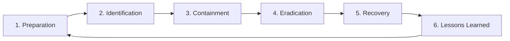

## Why Policies Matter

Technology alone cannot secure an organisation. The strongest firewall is useless if employees write passwords on sticky notes, click phishing links, or share accounts. **Security policies** are the rules and guidelines that govern how people, processes, and technology protect an organisation's assets.

**Real-world analogy:** A bank has vaults and alarms (technology), but it also has rules: who can open the vault, how cash is counted, what to do during a robbery. Without these rules and procedures, the technology is only half the protection. Security policies are an organisation's "rules for staying safe."

---

## What Is a Security Policy?

A **security policy** is a documented set of rules, expectations, and procedures that define how an organisation protects its information assets. It specifies:
- What must be protected
- Who is responsible
- What is and is not allowed
- How violations are handled

A good policy is **clear, enforceable, and aligned with the organisation's goals**.

---

## Types of Security Policies

| Policy type | What it governs | Example rule |
|---|---|---|
| **Acceptable Use Policy (AUP)** | How employees may use IT resources | "Company email may not be used for personal business" |
| **Password Policy** | Password requirements | "Passwords must be 12+ characters, changed every 90 days" |
| **Access Control Policy** | Who can access what | "Access granted on least-privilege basis" |
| **Data Classification Policy** | How data is categorized and handled | "Confidential data must be encrypted" |
| **Incident Response Policy** | How security incidents are handled | "Report suspected breaches within 1 hour" |
| **BYOD Policy** | Use of personal devices | "Personal phones must have device encryption to access email" |

---

## Components of a Good Security Policy

1. **Purpose** — why the policy exists
2. **Scope** — who and what it applies to
3. **Roles and responsibilities** — who is accountable for what
4. **Rules and requirements** — the actual do's and don'ts
5. **Enforcement** — consequences of violations
6. **Review schedule** — when the policy is updated

---

## What Is a Security Incident?

A **security incident** is any event that threatens the confidentiality, integrity, or availability of information systems. Examples:

- Malware infection
- Unauthorized access (hacking)
- Data breach (data stolen or leaked)
- Denial-of-Service attack
- Lost or stolen device with sensitive data
- Insider misuse

Not every event is an incident — but every incident must be handled systematically.

---

## The Incident Response Lifecycle

When an incident occurs, a structured response minimizes damage and speeds recovery. The widely-used NIST incident response lifecycle has six phases:

### Phase 1: Preparation
Get ready BEFORE an incident occurs:
- Create an incident response plan
- Train staff
- Set up monitoring and logging tools
- Establish a response team with defined roles

### Phase 2: Identification (Detection)
Recognize that an incident is occurring:
- Monitor logs and alerts
- Investigate suspicious activity
- Determine the scope and severity
- Classify the incident

### Phase 3: Containment
Stop the incident from spreading:
- **Short-term containment:** isolate affected systems (disconnect from network)
- **Long-term containment:** apply temporary fixes while planning permanent solutions

**Analogy:** If a fire breaks out, you first contain it (close doors, use extinguishers on that room) before worrying about repairing the damage.

### Phase 4: Eradication
Remove the cause of the incident:
- Delete malware
- Close the vulnerability that was exploited
- Remove unauthorized access

### Phase 5: Recovery
Restore systems to normal operation:
- Restore data from clean backups
- Rebuild affected systems
- Verify systems are clean before reconnecting
- Monitor closely for signs of recurrence

### Phase 6: Lessons Learned (Post-Incident)
After the incident is resolved:
- Document what happened and how it was handled
- Identify what worked and what did not
- Update policies and defenses to prevent recurrence
- Share findings with the team

This phase feeds back into Preparation — making the organisation more resilient over time.

---

## Worked Example: Responding to a Ransomware Incident

**Scenario:** A university's student records server is hit by ransomware that encrypts all files and demands payment.

| Phase | Actions |
|---|---|
| **Preparation** | (Already done) Backups exist, response team trained, plan in place |
| **Identification** | IT notices files encrypted, ransom note appears; classify as critical incident |
| **Containment** | Immediately disconnect the infected server from the network to prevent spread to other systems |
| **Eradication** | Wipe the infected server completely; identify how ransomware entered (phishing email) |
| **Recovery** | Restore data from clean backups (NOT paying ransom); rebuild server; verify clean |
| **Lessons Learned** | Phishing entered via email — implement email filtering and staff training; verify backup integrity regularly |

**Key insight:** Because backups existed (Preparation), the university recovered without paying the ransom. Organisations without backups often have no choice but to pay — which funds criminals and does not guarantee recovery.

---

## Why "Lessons Learned" Is Critical

Many organisations skip the final phase — they fix the immediate problem and move on. This is a mistake. Without learning:
- The same vulnerability gets exploited again
- The response process does not improve
- Defenses remain weak

The best security organisations treat every incident as a learning opportunity that makes them stronger.

---

## Key Takeaway

> Security policies are documented rules that govern how an organisation protects its assets — covering acceptable use, passwords, access control, data classification, and incident response. A good policy has purpose, scope, responsibilities, rules, enforcement, and review. When an incident occurs, the six-phase incident response lifecycle (Preparation, Identification, Containment, Eradication, Recovery, Lessons Learned) provides a structured response that minimizes damage. The "Lessons Learned" phase feeds back to make the organisation more resilient.

---

## Exam Tips

**What lecturers test:**
- Define a security policy and list its components
- Name and describe different types of security policies
- List and explain the six phases of the incident response lifecycle
- Apply the incident response lifecycle to a given scenario (e.g., ransomware, data breach)
- Explain why the "lessons learned" phase is important

**Common mistakes:**
- Confusing containment (stop the spread) with eradication (remove the cause) — they are distinct phases
- Forgetting the preparation phase — incident response begins before any incident
- Thinking recovery means just restoring data — it also includes verification and monitoring

**Likely question:**
> "Describe the six phases of the incident response lifecycle. Apply them to a scenario where an organisation discovers that an employee's laptop containing customer data has been stolen." (14 marks)
