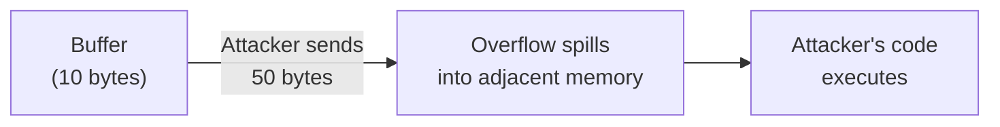
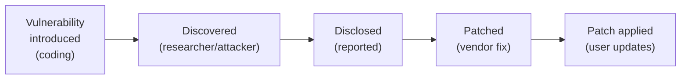
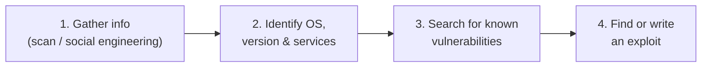

## Software Is Where Attacks Happen

Most cyberattacks succeed not by breaking strong encryption, but by exploiting **vulnerabilities** — flaws or weaknesses in software that attackers can use to gain unauthorized access, steal data, or disrupt systems.

A **vulnerability** is a weakness in a system that can be exploited by a threat. Vulnerabilities exist because software is written by humans, and humans make mistakes.

**Real-world analogy:** A vulnerability is like an unlocked window in an otherwise secure house. The front door has the best lock available (strong encryption), but the burglar does not use the door — they climb in through the window that someone forgot to lock (the software flaw).

---

## Where Do Vulnerabilities Come From?

| Source | Example |
|---|---|
| **Coding errors** | Forgetting to check input bounds |
| **Design flaws** | Storing passwords in plaintext |
| **Configuration mistakes** | Leaving default admin passwords |
| **Outdated software** | Not applying security patches |
| **Logic errors** | Allowing negative quantities in a shopping cart |

---

## Common Vulnerability Types

### 1. Buffer Overflow

A **buffer** is a region of memory allocated to hold data. A **buffer overflow** occurs when a program writes more data than the buffer can hold, spilling into adjacent memory.

**How it is exploited:** An attacker sends input larger than expected. The excess data overwrites adjacent memory — potentially including instructions the program will execute. A skilled attacker can craft the overflow to inject and run their own malicious code.



**Prevention:** Always check input length before writing to a buffer. Use memory-safe languages (Java, Python) that perform automatic bounds-checking. In C/C++, use safe functions (`strncpy` instead of `strcpy`).

### 2. SQL Injection

When a program builds database queries by directly inserting user input, an attacker can inject malicious SQL code.

**Vulnerable code:**
```
query = "SELECT * FROM users WHERE username = '" + userInput + "'"
```

**Normal input:** `alice` → `SELECT * FROM users WHERE username = 'alice'` ✓

**Malicious input:** `' OR '1'='1` →
```sql
SELECT * FROM users WHERE username = '' OR '1'='1'
```
Since `'1'='1'` is always true, this returns ALL users — bypassing authentication.

**Even worse input:** `'; DROP TABLE users; --` could delete the entire users table.

**Prevention:** Use **parameterized queries** (prepared statements) that separate code from data:
```
query = "SELECT * FROM users WHERE username = ?"
// user input is bound separately, never treated as SQL code
```

### 3. Cross-Site Scripting (XSS)

An attacker injects malicious scripts into web pages viewed by other users. When a victim loads the page, the script runs in their browser.

**Example:** A comment field that does not sanitize input. An attacker posts:
```html
<script>steal(document.cookie)</script>
```
Every user who views that comment unknowingly runs the attacker's script, which could steal their session cookies.

**Prevention:** Sanitize and escape all user input before displaying it. Treat user input as data, never as executable code.

### 4. Broken Authentication

Weak authentication mechanisms that allow attackers to compromise accounts:
- Weak password requirements
- Session tokens that do not expire
- Credentials transmitted without encryption

**Prevention:** Enforce strong passwords, use MFA, encrypt credentials in transit (HTTPS), expire sessions.

### 5. Security Misconfiguration

Systems left in insecure default states:
- Default admin passwords unchanged
- Unnecessary services enabled
- Detailed error messages revealing system internals
- Open cloud storage buckets

**Prevention:** Harden configurations, change defaults, disable unused features, limit error detail.

### 6. Using Components with Known Vulnerabilities

Software often uses third-party libraries. If a library has a known vulnerability and is not updated, the whole application is vulnerable.

**Example:** The 2017 Equifax breach exploited a known, unpatched vulnerability in the Apache Struts library, exposing 147 million people's data.

**Prevention:** Keep all dependencies updated; monitor for security advisories.

---

## Hardware Vulnerabilities

Not every weakness lives in code. **Hardware vulnerabilities** come from design flaws in the physical components of a system — the chips, memory, and devices themselves — rather than from the software running on them. Because they exist *below* the software layer, they can sometimes bypass software defences entirely.

**Real-world analogy:** A software vulnerability is an unlocked window in the house. A hardware vulnerability is a weakness in the bricks the house is built from — no amount of locking the windows helps if the wall itself can be pushed through.

### Rowhammer

RAM (memory) is made of tiny capacitors packed extremely close together, each storing one bit as an electrical charge. Because they are so densely packed, repeatedly changing one capacitor electrically disturbs its neighbours.

The **Rowhammer** exploit abuses this physical side effect: by repeatedly rewriting the *same* memory addresses, an attacker can read data from *nearby* memory cells — **even if those cells are protected**.

### SYNful Knock (2015)

A vulnerability in **Cisco IOS** (the operating system that runs on Cisco routers) that let attackers take over enterprise routers — including the **Cisco 1841, 2811, and 3825** models. Once a router was compromised, an attacker could:
- monitor all network traffic passing through it
- use the router as a foothold to infect other devices on the network

It was introduced when an **altered or fake IOS version** was installed on the routers — so the compromise entered through the software image loaded onto the hardware.

**Prevention:**
- **Verify the integrity of the downloaded IOS image** before installing it, so a tampered image is detected and rejected.
- **Restrict physical access** to equipment to authorised personnel only.

> **Note:** Hardware attacks are usually **targeted**, not random — they require effort and specific knowledge of the victim's equipment. For everyday use, normal antivirus combined with basic physical security is sufficient protection.

---

## The OWASP Top 10

The **Open Web Application Security Project (OWASP)** publishes the "Top 10" most critical web application security risks. It is the industry-standard reference. The list includes:

1. Broken Access Control
2. Cryptographic Failures
3. Injection (including SQL injection)
4. Insecure Design
5. Security Misconfiguration
6. Vulnerable and Outdated Components
7. Identification and Authentication Failures
8. Software and Data Integrity Failures
9. Security Logging and Monitoring Failures
10. Server-Side Request Forgery (SSRF)

Knowing the OWASP Top 10 is expected of any security professional.

---

## The Vulnerability Lifecycle



**Zero-day vulnerability:** A vulnerability that is discovered and exploited by attackers BEFORE the vendor knows about it or has a patch. These are extremely dangerous because no defense exists yet.

**The patching gap:** Even after a patch is released, many systems remain unpatched for months — attackers exploit this window. Applying security updates promptly is one of the most important defenses.

---

## How Attackers Exploit a Vulnerability

Finding and using a vulnerability is a deliberate, staged process. Understanding it shows defenders exactly where they can break the chain.



1. **Gather information about the target.** The attacker collects data using a tool such as a **port scanner**, or through **social engineering** (tricking people into revealing details).
2. **Identify the system.** From that information they determine the **operating system, its exact version, and the services running** on it.
3. **Search for known vulnerabilities.** They look up vulnerabilities specific to that OS version or service — public databases list thousands.
4. **Obtain an exploit.** They find a **previously written exploit** to use against the weakness; if none exists, a skilled attacker may **write their own**.

Each step depends on the one before it, so defences like limiting information disclosure (step 1) and promptly patching known vulnerabilities (step 3) break the chain before an exploit is ever launched.

---

## Secure Coding Practices

| Practice | Prevents |
|---|---|
| **Input validation** | Injection, buffer overflow |
| **Parameterized queries** | SQL injection |
| **Output encoding/escaping** | XSS |
| **Least privilege** | Limiting damage from any single flaw |
| **Keep dependencies updated** | Known-vulnerability exploits |
| **Error handling** | Information leakage |
| **Code review & testing** | Catching flaws before release |

**The golden rule of secure coding:** **Never trust user input.** All input from users, networks, or files must be validated and sanitized before use. Most vulnerabilities stem from trusting input that should not be trusted.

---

## Worked Example: Securing a Login Form

**Vulnerable version:**
```
query = "SELECT * FROM users WHERE user='" + input + "' AND pass='" + pw + "'"
// Vulnerable to SQL injection
```

**Secured version:**
```
// 1. Validate input (only allow expected characters)
// 2. Use parameterized query
query = "SELECT * FROM users WHERE user=? AND pass_hash=?"
bind(query, username, hash(password))
// 3. Compare hashed passwords, never plaintext
// 4. Use HTTPS so credentials are encrypted in transit
// 5. Add rate limiting to prevent brute-force
```

This single login form, properly secured, addresses SQL injection, broken authentication, and cryptographic failures simultaneously.

---

## Key Takeaway

> A vulnerability is a weakness in software that attackers exploit. Common types include buffer overflow (writing past memory limits), SQL injection (injecting database commands via input), XSS (injecting scripts into web pages), broken authentication, and security misconfiguration. The golden rule is: never trust user input — validate, sanitize, and use parameterized queries. The OWASP Top 10 lists the most critical web risks. Zero-day vulnerabilities are exploited before patches exist; promptly applying patches closes the window attackers exploit.

---

## Exam Tips

**What lecturers test:**
- Define vulnerability and distinguish it from threat and risk
- Explain how SQL injection works and how parameterized queries prevent it
- Explain buffer overflow and how memory-safe languages prevent it
- Explain XSS and the prevention (input sanitization)
- Define zero-day vulnerability
- State secure coding practices, especially "never trust user input"

**Common mistakes:**
- Confusing SQL injection (database) with XSS (browser scripts)
- Thinking strong encryption protects against vulnerabilities — most attacks bypass encryption by exploiting software flaws
- Forgetting that updating dependencies is a critical defense

**Likely question:**
> "Explain SQL injection with an example of a malicious input and what it achieves. Describe two methods to prevent SQL injection. Why is 'never trust user input' considered the golden rule of secure coding?" (12 marks)
