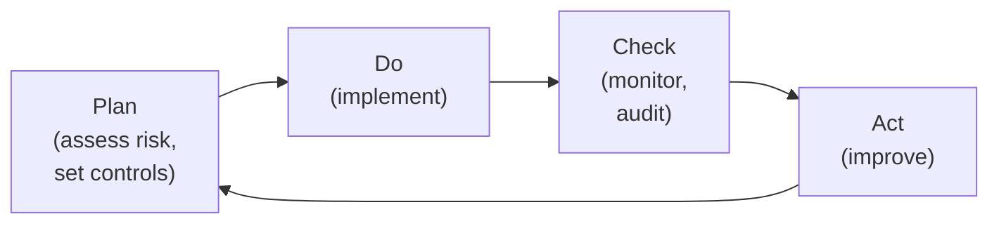
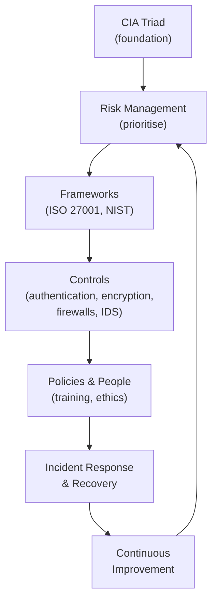

## Why We Need Standards and Frameworks

Cybersecurity is enormously complex. An organisation faces countless threats, must protect many assets, and has limited resources. How do you decide what to do, in what order, and how to know if you are doing enough?

**Standards and frameworks** answer these questions. They provide structured, proven approaches so organisations do not have to invent security from scratch. They turn the vague goal "be secure" into concrete, prioritised actions.

**Real-world analogy:** Building codes in construction. An architect does not invent safety rules for each building — they follow established codes that encode decades of accumulated knowledge about what makes buildings safe. Cybersecurity frameworks are "building codes" for secure systems.

---

## Standards vs. Frameworks

| | Standard | Framework |
|---|---|---|
| **Nature** | Specific, often certifiable requirements | Flexible structure and guidance |
| **Example** | ISO/IEC 27001 | NIST Cybersecurity Framework |
| **Use** | "Comply with these requirements" | "Organise your security around these functions" |

---

## Major Cybersecurity Standards and Frameworks

### ISO/IEC 27001
The leading international standard for **Information Security Management Systems (ISMS)**. Organisations can be formally certified against it.

**What it requires:**
- A systematic approach to managing sensitive information
- Risk assessment and treatment
- Defined security controls (ISO 27002 lists them)
- Continuous monitoring and improvement

**Why it matters:** ISO 27001 certification demonstrates to customers and partners that an organisation takes security seriously and follows internationally recognised practices.

### NIST Cybersecurity Framework
Developed by the US National Institute of Standards and Technology. Organised around five core functions (covered earlier):

It is flexible and widely adopted internationally, not just in the US.

### CIS Controls
The Center for Internet Security publishes a prioritised list of defensive actions (the "CIS Controls"). They are ordered so organisations know what to do first for maximum impact.

**Example top controls:**
1. Inventory of hardware assets
2. Inventory of software assets
3. Data protection
4. Secure configuration
5. Account management

The prioritisation is valuable: an organisation with limited resources can implement the top controls first and get the biggest security improvement.

### Other Notable Frameworks

| Framework | Focus |
|---|---|
| **PCI-DSS** | Payment card data security (mandatory for card processors) |
| **COBIT** | IT governance and management |
| **SOC 2** | Service organisation security controls (for cloud/SaaS providers) |

---

## How Frameworks Help

Frameworks provide several benefits:

1. **Structure** — organise security efforts coherently
2. **Prioritisation** — know what to do first
3. **Completeness** — avoid missing important areas
4. **Benchmarking** — measure your security against an external standard
5. **Communication** — a common language for discussing security with stakeholders
6. **Compliance** — meet regulatory and contractual requirements

---

## Managing "Big Risk"

As society's dependence on digital systems deepens, the potential consequences of cyber-attacks grow to "big risk" levels — systemic risks that can affect entire economies, critical infrastructure, or national security.

### Characteristics of Big Risk

- **Systemic:** A single attack can cascade across interconnected systems
- **High-impact:** Potential for catastrophic damage (power grid failure, financial system collapse)
- **Hard to predict:** Novel attacks, unknown vulnerabilities
- **Cross-boundary:** Affects multiple organisations, sectors, and nations

**Example:** An attack on a major cloud provider could simultaneously disrupt thousands of businesses that depend on it — a systemic, big risk.

### Strategies for Managing Big Risk

#### 1. Resilience Over Prevention
Accept that not all attacks can be prevented. Focus on **resilience** — the ability to detect, respond to, and recover from attacks quickly.

> "It is not a question of IF you will be breached, but WHEN."

This mindset shift — from "build perfect walls" to "assume breach and prepare to recover" — is central to modern security thinking.

#### 2. Defense in Depth
Layer multiple defenses (covered earlier). No single control is relied upon; if one fails, others protect.

#### 3. Public-Private Partnership
Most critical infrastructure (power, telecoms, finance) is privately owned, but its security is a public concern. Governments and private operators must cooperate — sharing threat intelligence, coordinating responses.

#### 4. Risk-Based Prioritisation
With limited resources, focus on the highest risks (highest likelihood × impact). Not everything can be protected equally — protect what matters most.

#### 5. Continuous Monitoring and Improvement
Threats evolve, so defenses must too. Frameworks like ISO 27001 build in continuous improvement cycles (Plan-Do-Check-Act).

---

## The Business Case for Security

Security is not just a technical issue — it is a business decision. Frameworks help make the business case:

| Cost of poor security | Cost of good security |
|---|---|
| Breach response and recovery | Security tools and staff |
| Regulatory fines (GDPR: up to 4% of revenue) | Compliance and certification |
| Reputation damage and lost customers | Training and awareness |
| Legal liability | Frameworks and audits |
| Operational disruption | — |

**The key insight:** Investing in security (following frameworks, implementing controls) is far cheaper than the consequences of a major breach. Frameworks help quantify and justify this investment to leadership.

---

## Bringing It All Together

A mature cybersecurity programme combines everything from this course:

Security is not a product you buy or a one-time project. It is an ongoing, structured, risk-based programme guided by frameworks, built on the CIA triad, implemented through technical controls and policies, and continuously improved.

---

## Key Takeaway

> Standards (ISO/IEC 27001 — certifiable ISMS requirements) and frameworks (NIST Cybersecurity Framework — Identify, Protect, Detect, Respond, Recover; CIS Controls — prioritised actions) provide structured, proven approaches to managing security at scale. They offer structure, prioritisation, completeness, benchmarking, and compliance. Managing "big risk" — systemic, high-impact threats — requires a shift from prevention to **resilience** (assume breach, prepare to recover), defense in depth, public-private partnership, risk-based prioritisation, and continuous improvement (Plan-Do-Check-Act). Security is an ongoing programme, not a one-time purchase, and investing in it is far cheaper than the consequences of a major breach.

---

## Exam Tips

**What lecturers test:**
- Distinguish standards (ISO 27001) from frameworks (NIST)
- Describe the benefits frameworks provide to organisations
- Explain the shift from prevention to resilience ("assume breach")
- Explain strategies for managing systemic/big risk
- Make the business case for cybersecurity investment (cost of poor vs. good security)
- Describe the Plan-Do-Check-Act continuous improvement cycle

**Common mistakes:**
- Treating security as a one-time project rather than a continuous programme
- Thinking the goal is to prevent ALL attacks — modern thinking emphasises resilience and recovery
- Forgetting that frameworks help prioritise when resources are limited

**Likely question:**
> "Explain the role of standards and frameworks (such as ISO 27001 and the NIST Cybersecurity Framework) in managing cybersecurity. Explain the shift from a 'prevention' mindset to a 'resilience' mindset, and why it is important for managing large-scale risk." (15 marks)
