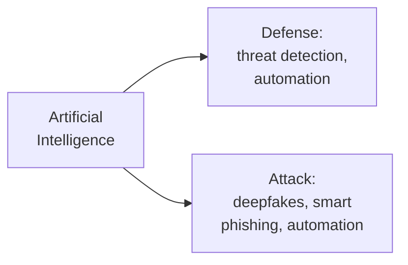
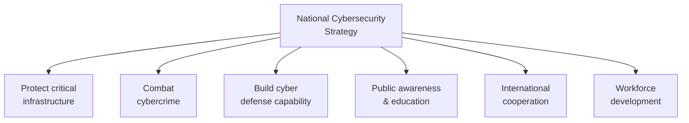

## Cybersecurity Never Stands Still

Cybersecurity is a moving target. As technology advances, new vulnerabilities emerge, attackers adopt new techniques, and defenders develop new countermeasures. Understanding current trends helps anticipate where threats and defenses are heading.

**Real-world analogy:** Medicine constantly evolves as new diseases emerge and treatments improve. A doctor who stopped learning decades ago would be dangerous today. Cybersecurity professionals must continually update their knowledge as the landscape shifts.

---

## Major Current Trends

### 1. Remote Work Risks
The shift to remote and hybrid work (accelerated by COVID-19) expanded the attack surface dramatically. Home networks are less protected than corporate ones, and personal devices may lack security controls.

**Implications:** Attackers target home offices, VPN vulnerabilities, and unsecured home Wi-Fi. Organisations must extend security beyond the office perimeter.

### 2. The Internet of Things (IoT) Explosion
Billions of internet-connected devices — smart home gadgets, industrial sensors, medical devices, vehicles. An estimated **64 billion IoT devices** by 2026.

**The problem:** Many IoT devices have weak or no security (default passwords, no update mechanism, minimal processing power for encryption). Each device is a potential entry point.

**Example:** The Mirai botnet (2016) infected hundreds of thousands of poorly-secured IoT devices (cameras, routers) and used them to launch one of the largest DDoS attacks ever recorded.

### 3. Rise of Ransomware
Ransomware has become a billion-dollar criminal industry. There are now 120+ known ransomware families, and "Ransomware-as-a-Service" (RaaS) lets even low-skill criminals launch attacks.

**Trend:** Attackers now use "double extortion" — encrypting data AND threatening to leak it publicly unless paid.

### 4. Cloud Security Challenges
As organisations move to cloud computing, new vulnerabilities emerge: misconfigured cloud storage, weak access controls, and confusion over the shared responsibility model.

### 5. AI in Cybersecurity (Double-Edged Sword)

**AI as defender:** Machine learning detects anomalies, identifies threats faster than humans, and automates responses. Organisations using AI-based security reportedly saved an average of $3.58 million per breach (2020).

**AI as attacker:** Attackers use AI to craft convincing phishing emails, generate deepfakes, automate attacks, and find vulnerabilities faster.

### 6. Sophisticated Social Engineering
Phishing is becoming more targeted and convincing. "Whaling" attacks target senior executives. Attackers research victims via social media to craft believable pretexts.

### 7. Data Privacy as a Discipline
Regulations like GDPR and NDPR have elevated data privacy to a board-level concern. Organisations now appoint Data Protection Officers and treat privacy as a core function.

### 8. Multi-Factor Authentication Evolution
MFA is now the gold standard, but attackers are bypassing SMS-based MFA (via SIM-swapping). The trend is toward app-based authenticators and hardware security keys (FIDO2).

### 9. Mobile and 5G Security
As mobile devices handle more sensitive tasks and 5G enables more connectivity, the mobile threat landscape grows. 5G's increased connectivity introduces new vulnerabilities.

---

## Cyberspace as the Fifth Domain of Warfare

Militaries now recognise cyberspace as a domain of conflict alongside land, sea, air, and space — the **"fifth domain."**

**Implications:**
- Nations develop offensive and defensive cyber capabilities
- Critical infrastructure (power, water, finance) becomes a military target
- Cyber-attacks can cause physical destruction (Stuxnet damaged centrifuges)
- "Cyber deterrence" parallels nuclear deterrence strategy

---

## National Cybersecurity Strategies

A **national cybersecurity strategy** is a government's coordinated plan to secure its cyberspace. As cyber threats grow, more nations are formalising strategies.

### Core Components of a National Strategy

| Component | Goal |
|---|---|
| **Critical infrastructure protection** | Secure power, water, finance, telecoms, healthcare |
| **Combating cybercrime** | Strong laws, capable law enforcement |
| **Cyber defense capability** | Military and civilian defensive (and sometimes offensive) capacity |
| **Public awareness** | Educate citizens — the first line of defense |
| **International cooperation** | Cybercrime crosses borders; cooperation is essential |
| **Workforce development** | Train cybersecurity professionals to fill the skills gap |

### The Evolution of National Strategies
National cybersecurity strategies have evolved through stages:
1. **Early stage:** Focus on protecting government systems
2. **Maturing:** Expand to critical infrastructure and cybercrime
3. **Advanced:** Comprehensive — including offensive capability, international leadership, and economic dimensions

**Example:** Nigeria's National Cybersecurity Policy and Strategy aims to protect critical national information infrastructure, combat cybercrime, build national capacity, and foster international cooperation.

---

## Managing Cybersecurity in the Face of Big Risk

As reliance on digital systems deepens, the potential impact of cyber-attacks grows. Managing this "big risk" requires:

1. **Standards and frameworks** (ISO 27001, NIST) to structure defenses
2. **Resilience thinking** — assume breaches will happen; plan to detect, respond, and recover, not just prevent
3. **Public-private partnership** — most critical infrastructure is privately owned, so government and industry must cooperate
4. **Continuous adaptation** — strategies must evolve as fast as threats

---

## The Skills Gap

A major trend and challenge: there are far more cybersecurity jobs than qualified professionals to fill them. This **skills gap** means:
- Organisations struggle to defend themselves adequately
- Strong career opportunities for those entering the field
- National strategies prioritise cybersecurity education and training

---

## Key Takeaway

> Cybersecurity continually evolves. Major trends include remote work risks, the IoT explosion (64 billion devices by 2026, often poorly secured), ransomware as a billion-dollar industry, cloud security challenges, and AI as both a defensive tool and an attack weapon. Cyberspace is now the "fifth domain" of warfare. National cybersecurity strategies coordinate a country's response, covering critical infrastructure protection, combating cybercrime, defense capability, public awareness, international cooperation, and workforce development. Managing "big risk" requires standards, resilience thinking (assume breach), public-private partnership, and continuous adaptation. A significant skills gap creates both challenge and opportunity.

---

## Exam Tips

**What lecturers test:**
- Describe current trends in cybersecurity (IoT, ransomware, AI, remote work)
- Explain how AI is a "double-edged sword" in cybersecurity
- Describe the components of a national cybersecurity strategy
- Explain "cyberspace as the fifth domain of warfare"
- Discuss the cybersecurity skills gap and its implications

**Common mistakes:**
- Treating AI as only a defensive tool — it is also used by attackers
- Forgetting that IoT devices are often the WEAKEST security points, not strong ones
- Listing trends without explaining their security implications

**Likely question:**
> "Describe four major current trends in cybersecurity and explain the security implications of each. Outline the key components of a national cybersecurity strategy." (15 marks)
