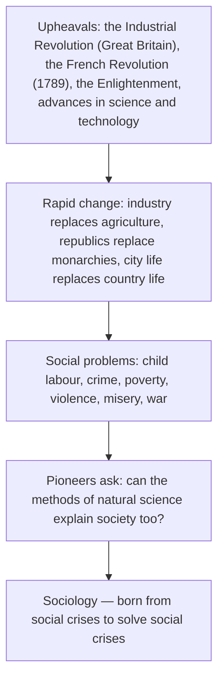
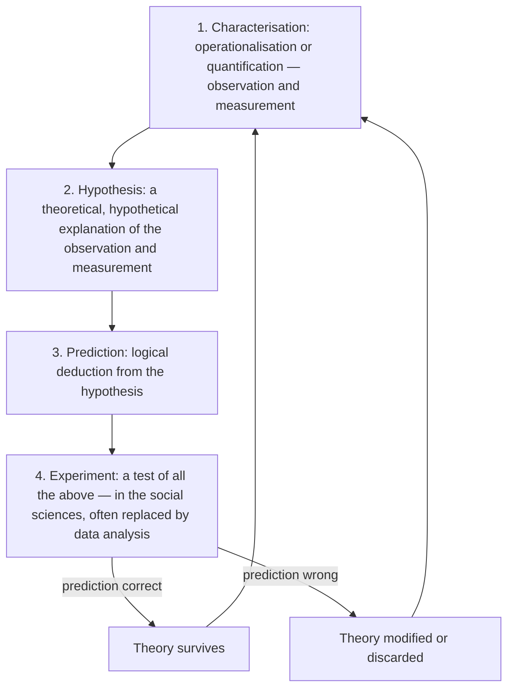

## What Is Sociology?

The word **sociology** combines:

- the Latin ***socius*** — **"companion" or "associate"**;
- the Greek ***logia*** — **"study of"**.

Literally, then, sociology is **the study of associations**. More generally it is defined as:

- **the scientific study of human society**;
- **the study of all human interactions and relationships**;
- **the study of social groups**.

The term was coined by the French philosopher **Auguste Comte**, who saw sociology as **the apex of the achievement of all sciences**.

The *concept* existed long before the *name*. Every society, at its own level of civilisation, has studied human relationships and structures — through biological abilities, the resources in its environment, and time. Societies recorded their patterns as **cultures, arts, music, customs and traditions**, and custodians handed them down the generations.

### How sociology was born

Sociology became a **field of study** only with the crises of **industrialisation** and the **French Revolution**. It was born out of the **upheavals of the 18th and 19th centuries** in **Great Britain** and **Western Europe**, especially **Germany and France**.



The pioneers saw **how much the natural sciences had revealed about the natural world**. So they looked for a science that could **explain and interpret the fundamental laws governing social phenomena** and help **resolve social crises**, using **the same methods as the natural sciences**. In the textbook's words, sociology is a discipline **"birthed from social crises to solve social crises"**, as people began applying the **scientific method** to human life and behaviour.

### The pioneers

| Pioneer | Dates | Nationality and note |
|---|---|---|
| **Auguste Comte** | 1798–1857 | French philosopher; **coined "sociology"**; founder of **positivism** |
| **Karl Marx** | 1818–1883 | German philosopher and economic historian (the textbook spells it "Max") |
| **Harriet Martineau** | 1802–1876 | British |
| **Herbert Spencer** | 1820–1903 | British (the textbook gives 1893; Spencer died in 1903) |
| **Émile Durkheim** | 1858–1917 | French; sociology as the study of **social facts** |
| **Max Weber** | 1864–1920 | German; **interpretive understanding of social action** |

### Society — the central theme

**Society** refers generally to the social world around us, with all its structures, institutions and organisations. Specifically, three definitions are given:

| Source | Society is… |
|---|---|
| **Stockard (1997)** | A group of people who live within some type of **bounded territory** and share a **common way of life** — and that common way of life is **culture** |
| **Hobbs and Blank (1975)** | A large human grouping that shares a **common culture** and has a **comprehensive social system**, including the social institutions required to meet **basic needs** |
| **Giddens (1994)** | A **system of interrelationships** that connect individuals together |

**Zerihun (2005)** gives a fuller definition of sociology. It is **a discipline in the social sciences** that uses **systematic methods of empirical investigation and critical analysis** to develop and refine knowledge about **human social structure and activity**. Sometimes the goal is to apply that knowledge to **government policies designed to benefit the general social welfare**.

Compared with the other social sciences, sociology is **very broad**: hardly any aspect of life has escaped it. Music, relationships, inequality, death, health, drugs, work, sexuality, education and religion have all been studied sociologically. That is why **no single definition** is easy.

---

## Definitions by Scholars

| Scholar | Definition |
|---|---|
| **Auguste Comte** | The study of **social statics** and **social dynamics**. **Statics** = social order — elements that **persist** and resist change. **Dynamics** = the **changing, progressing** dimensions of society. In **1839**: the **science of human association**, or the study of **gregarious life**. In ***System of Positive Politics*** (1851): an **abstract theoretical science of social phenomena** whose business is to **discover social laws** and so explain social phenomena |
| **Anthony Giddens** | The **scientific study of society**, interested in **social relationships between people in a group context**. It covers how we interact, the laws governing interaction, and how the social world influences individuals and vice versa. It deals with **factually observable** subject matter, depends on **empirical research**, and formulates **theories and generalisations** (Giddens 1982) |
| **Soroka (1992)** | A **debunking science** — it looks for **levels of reality** beyond official interpretations and **common-sense explanations**. Sociologists seek to understand **what is** and do **not make value judgements** |
| **Max Weber** | *"A science which attempts the **interpretive understanding of social action** in order to arrive at a **causal explanation of its course and effects**"* |
| **Team of Experts (2000)** | A social science that studies the **processes and patterns of individual and group interaction**, the **forms of organisation of social groups**, the relationships among them, and **group influences on individual behaviour** (and vice versa) |
| **Émile Durkheim** | The study of **social facts** — the **patterns of behaviour** that characterise a social group, to be studied **objectively**. The sociologist uncovers social facts and **explains them using other social facts** |
| **Harry M. Johnson** | *"The science that deals with **social groups**: their internal forms or modes of organisation, the processes that tend to maintain or change these forms of organisation, and the relations between groups"* |
| **Wright and Randall (1978)** | The study of **relationships between people living together in groups**. It seeks **patterns** in those relationships that may **justify or refute generalisations** |
| **Ogunbameru (2009)** | The study of **social life, social change** and the **social causes and consequences of human behaviour**. Its range: from the **intimate family** to the **hostile mob**; organised crime to religious cults; race, gender and class to shared beliefs; the sociology of work to the sociology of sport |
| **Henry Fairchild** | The study of **man and his human environment** in their relations to each other |
| **Morris Ginsberg** | *"In the broadest sense… the study of **human interactions and inter-relations**, their conditions and consequences"* |

### Weber's idea of "social action"

For Weber, **action** includes all human behaviour to which the individual **attaches a subjective meaning**. Action may be:

- **overt** (visible) or purely **inward**;
- a **positive intervention** in a situation, **deliberately refraining** from intervening, or **passively acquiescing**.

Action becomes **social** when, because of the meaning the actor attaches to it, it **takes account of the behaviour of others** and is oriented by it.

<Analogy>
Opening an umbrella when it rains is *action*, but it is not *social* action — you are responding to the weather. Hiding your phone because you see a known pickpocket approaching **is** social action: its meaning depends on what you expect **another person** to do. Weber wants sociologists to understand that meaning.
</Analogy>

### So many definitions — is sociology confused?

No. **Abraham (1977)** warns that the vagueness of the many definitions must **not** mislead us into thinking the subject matter is uncertain. Each definition emphasises **a special way of looking at social behaviour** that no other discipline can match. Together they cover:

- sociology **as a science**;
- the **structure and function of society as a system**;
- the **nature, complexity and content** of human social behaviour;
- the **fundamentals of human social life**;
- the **interaction of humans with their external environment**;
- the **indispensability of social interaction** for human development;
- **how the social world affects us**.

<SortingGame title="Who said it?">

```sort
@buckets Comte | Weber | Durkheim | Giddens | Soroka | Ginsberg
Sociology studies social statics and social dynamics => Comte :: Statics = order that persists; dynamics = change and progress.
Sociology is the interpretive understanding of social action to arrive at a causal explanation => Weber :: Weber stressed the subjective meaning actors attach to action.
Sociology is the study of social facts, explained by other social facts => Durkheim :: Durkheim wanted social facts studied objectively.
Sociology is the scientific study of society, relying on empirical research => Giddens :: Giddens: factually observable subject matter, empirical research, theories.
Sociology is a debunking science that looks beyond official and common-sense explanations => Soroka :: Soroka (1992): sociologists understand what is, without value judgements.
Sociology is the study of human interactions and inter-relations, their conditions and consequences => Ginsberg :: Morris Ginsberg's broad definition.
Sociology is the science of human association — the study of gregarious life => Comte :: Comte's 1839 definition.
```

</SortingGame>

---

## What Sociology Is Not

Sociology is **not the discussion at the newspaper vendor's stand**. In the early morning, Nigerian workers gather in twos and threes and argue about social issues. The conversation is *social*, but it is **not sociology**, for two reasons:

1. Individuals discuss from their own **"circumference of understanding"** — a **self-centred, individualistic** perspective.
2. There is **no system of methodised knowledge** — no **science**.

---

## The Sociological Imagination

To explain the social world we must look at our own experiences **in the light of what is going on around us**. **Henslin and Nelson (1995)** describe this as the ability to look:

- **beyond individual psychology** to the many facets of **social and cultural forces**;
- at *"the recurring patterns in people's attitudes and actions, and how these patterns vary across time, cultures and social groups."*

The tool that turns mere discussion into sociological study was proposed by **C. Wright Mills** (1916–1962): the **sociological imagination** (Mills 1959). It is **the ability to study "the structure of society" at the same time as "individual lives"**.

- It shows the **connection between individual problems and social issues**. Individual problems can only be understood **in the context of wider social forces**.
- It helps people **step outside their personal, self-centred view** of the world.
- It is a way of seeing the world **through sociological lenses** — seeing the **social and non-biological forces** that shape us as individuals, groups and communities (Giddens 1982).

**Good sociology examines both structure and interaction.** The sociological imagination combines:

- **structural theories** — **functionalism** and **Marxism**;
- **interactionist** theories.

Only by studying **major changes in society** *and* **individual lives** together can we understand social life (Haralambos and Holborn 2008).

**It goes beyond armchair sociology.** Armchair sociology tries to understand how the social world works **without scientific methods**. Many people believe they understand the world without any systematic attempt to study it. Sociologists instead **get up from their armchairs** and **test their theories using the scientific method**.

<SortingGame title="Personal trouble or public issue?">

```sort
@buckets Personal trouble | Public issue
One graduate misses three job interviews because he overslept => Personal trouble :: The explanation lies in his own circumstances and choices.
Youth unemployment rises sharply across the whole country => Public issue :: When the rate rises for millions, the cause lies in the structure of the economy — it needs a sociological explanation.
A couple divorces after one partner's affair => Personal trouble :: A specific, individual situation.
The national divorce rate doubles in a decade => Public issue :: A pattern across society points to social forces — changing laws, economy, values.
A trader's shop burns down after an electrical fault => Personal trouble :: A private misfortune.
Thousands of families are displaced by communal conflict => Public issue :: A social problem rooted in group relations and structure.
```

</SortingGame>

*(The terms "personal troubles" and "public issues" are Mills's own, from* The Sociological Imagination *— beyond the textbook's wording, but the textbook's unemployment example makes exactly this point.)*

---

## Sociology and the Scientific Method

### Positivism

Engaging the **scientific method** in the study of social life is called **positivism**. **Auguste Comte** founded the "positive philosophy". Positivism **rejected metaphysical explanations** of events in society in favour of **knowledge based on systematic observation and experiment**.

- The **scientific method** is **a logical system used to evaluate data derived from systematic observation** of society and social phenomena.
- Its **end result is a law**.
- The positivist approach seeks to **explain and predict** social phenomena.
- It includes **observation, hypotheses, deductions and theories**.
- **Predictions** from theories are **tested**. If a prediction proves correct, the theory **survives**; if not, it is **modified or discarded**.

**Comte's law of three stages** *(beyond the textbook, but examined)*: Comte argued that human ideas — and societies — pass through **three stages**:

1. **Theological** — events are explained by **gods and supernatural forces**.
2. **Metaphysical** — events are explained by **abstract forces** or essences ("nature").
3. **Positive (scientific)** — events are explained by **observation, experiment and laws**.

Sociology belongs to the **positive** stage. Comte's first name for it was **"social physics"**.

### The four steps of the scientific method

The essential elements are **iterations and recursions** of four steps:



### Induction and deduction

Sociology uses **two approaches** in research design and in the overall research framework:

| | Inductive method | Deductive method |
|---|---|---|
| **Direction** | **Particular → general** | **General → particular** |
| **Starts with** | **Observation and data collection** | A **general theoretical principle** |
| **Ends with** | **Hypotheses and theories** built from particular instances (Scupin and DeCorse 1995) | **Specific assertions and claims** derived from the theory (Dooley 1995) |
| **Example** | Interview 50 market women, notice most joined a thrift (esusu) group after losing access to bank loans, then propose a theory about informal finance | Start from the theory that social integration reduces deviance, and predict that students in active campus fellowships will commit fewer exam offences |

**Why the scientific method matters:** it helps us observe the world **critically, empirically and rationally**, and collect and analyse data **systematically** to arrive at **scientific knowledge**.

<SortingGame title="Inductive or deductive?">

```sort
@buckets Inductive | Deductive
A researcher observes many okada riders, notices patterns in their routes, and then builds a theory of informal transport => Inductive :: Moving from particular observations to a general theory.
A researcher starts from Durkheim's theory of integration and predicts lower suicide among married people => Deductive :: Deriving a specific claim from a general theory.
Field notes from a village are analysed first, and a theory emerges from them => Inductive :: Theory is built from the data.
A hypothesis drawn from Marxist theory is tested on data about factory workers' pay => Deductive :: From general theory to a particular testable claim.
```

</SortingGame>

---

## The Focus of Sociology

**Sociology focuses on the social interaction that takes place in the society.** Its focal point is **the investigation, description and analysis of social interaction** (Hobbs and Blank 1975):

- **"Social"** — sociology is not concerned with humans as **biological beings** or as **isolated beings**, but as beings **involved with others**.
- **"Interaction"** — what people do: behaviour **oriented between or among individuals**. **Social interaction** is **behaviour between two or more people that is given meaning**.

**Compared with psychology, which deals with individuals, sociology is concerned with group behaviour.** Individual behaviour becomes a sociological object only when its **patterns are related to the wider context** in which people live. Through interaction people **react and change** according to the actions of others. Since new forms of behaviour keep emerging, **change is always in the works**.

### Durkheim's study of suicide (1897)

Suicide looks like the **most individual act possible**. Yet **Émile Durkheim** showed that:

- **suicide rates varied between countries and between social groups**, consistently over time;
- **married people had lower suicide rates than the unmarried**.

The key factor was **integration into social groups**. Married people with children in a **close-knit religious community** were much less likely to commit suicide than **childless single people** outside any religious community (Holborn 2008). His conclusion: **an apparently individual act is shaped by social factors**.

*(The textbook says England consistently had a higher suicide rate than France. In Durkheim's own tables it was the other way round — France's rate was roughly double England's. Either way, the point is that each country's rate was **stable and distinctive**, which only social causes can explain.)*

### What sociologists study

Interaction ranges from a **newborn's first contact with its mother** to a **philosophical debate at an international conference**, and from a **casual passing on the street** to the **most intimate relationships** (World Book Encyclopedia 1994). The major units of interaction (Broom and Selznick 1973):

| Unit | Examples |
|---|---|
| **Social groups** | Family, peer groups |
| **Social relationships** | Social roles, **dyadic** (two-person) relationships |
| **Social organisations** | Governments, corporations, school systems |
| **Territorial organisations** | Communities, schools |

**Social relations, social stratification, culture and deviance** are also traditional concerns of sociology.

### Levels of analysis

<Tabs>
<Tab label="Macro level">
**Macro-sociology** looks at interactions in the **larger society**. It examines **large-scale social phenomena** that determine how groups are organised and positioned in the social structure — e.g. **social class** and the **relations of groups to one another**.

- It analyses the **social system as a whole** and focuses on **population**.
- It uses **statistical analysis** and empirical studies.
- It studies **broad subjects**, but its findings can also be applied to small phenomena.
</Tab>
<Tab label="Micro level">
**Micro-sociology** focuses on **social interaction** — **interpersonal relationships**, and what people do and how they behave when they interact.

- It is usually employed by the **symbolic interactionist** perspective.
- It relies on **small-scale studies**.
- It uses **interpretive methods**, drawing conclusions from observing how individuals interact.
</Tab>
<Tab label="Meso level">
Some scholars add a **meso level**, which analyses social phenomena **in between** the micro and macro levels — e.g. organisations, communities and ethnic associations.
</Tab>
</Tabs>

<SortingGame title="Macro, micro or meso?">

```sort
@buckets Macro | Micro | Meso
Comparing poverty rates across Nigeria's six geopolitical zones => Macro :: Large-scale patterns across the whole society, using statistics.
Observing how two roommates negotiate the use of a shared fan => Micro :: Face-to-face interaction between individuals.
Studying how a hometown development association organises its members => Meso :: An organisation sits between the individual and the whole society.
Analysing how social class shapes access to university education nationwide => Macro :: Social class and group positions in the social structure.
Recording how customers and traders bargain at Bodija market stalls => Micro :: Interpretive study of everyday interaction.
Studying decision-making within a trade union branch => Meso :: A mid-level group between individuals and society.
```

</SortingGame>

### Subject areas

Within this framework, sociology examines:

| Area | Focus |
|---|---|
| **Social organisation and social order** | Institutions and groups — their formation, change, functioning and relations to individuals and each other |
| **Social control** | How members of society **influence one another** to maintain order |
| **Social change** | How society and institutions change through **technical inventions, cultural diffusion, cultural conflict and social movements** |
| **Social processes** | The **patterns** in which social change takes place and its modes |
| **Social groups** | How groups are formed and structured, and how they function and change |
| **Social problems** | Conditions that cause difficulty for **large numbers of people** and that society seeks to eliminate: juvenile delinquency, crime, chronic alcoholism, suicide, drug addiction, racial prejudice, ethnic conflict, war, industrial conflict, slums, urban poverty, prostitution, child abuse, problems of older persons, marital conflict |

---

## The Relevance of Sociology

| Relevance | Explanation |
|---|---|
| **1. Understanding ourselves** | Why we think, behave and act as we do — through the concepts of **culture** and **socialisation**. Culture reveals our **diversities and commonalities**, including our origins and history through **anthropological studies**. **Ogunbameru (2009):** there is **no such thing as "human nature"** — the way we think, behave and feel is shaped by **socialisation** |
| **2. Self-enlightenment** | Knowledge of the conditions of our lives and of how society works **empowers** us. We can influence the forces affecting our lives, **respond to government policies**, and **suggest our own policy alternatives** (Giddens) |
| **3. Understanding how society works** | **Peter Berger**, *Invitation to Sociology* (the textbook spells it "Burger"): sociology helps people **take charge of their lives**. They learn that the way they live is **socially constructed**, not natural or inevitable. Example: women in a **Cairo** community saw some illnesses as **"fatal"** — bound to happen and to be accepted. Sociology shows such beliefs are social products |
| **4. The sociological imagination** | A rich understanding of individual lives **in a wider social context**. **Unemployment, war and marital breakdown** are felt as personal problems, but individual reactions add up to **consequences for society** (Haralambos and Holborn 2008). It helps us **cast aside biased assumptions, stereotypes and ethnocentric thinking**, becoming more critical, broad-minded and respectful |
| **5. Structure and dynamics of society** | Shows how **social structures** (class, race, stratification) and **institutions** (family, economy, polity, religion) shape attitudes and actions. It makes us **more sensitive to social issues** and offers **solutions to social pathologies** — poverty, divorce, corruption, crime, delinquency, robbery (Zerihun 2005) |
| **6. Social policy** | **Descriptive sociology** supplies information for **social policy decisions** — e.g. tackling poverty starts with a sociologist's investigation of the facts |
| **7. Careers** | Social research, **social work**, personnel work, **human relations in industry**, public relations, social services, **community and town planning**, government, communication administration, **university teaching**. It also appears in **engineering** (industrial sociology) and **agriculture** (rural sociology) |
| **8. International problems** | Physical science has brought nations closer, but **socially** the world lags behind and is divided by stress, conflict and modern warfare. Sociology helps **understand the underlying causes and tensions** and propose solutions |
| **9. Keeping up with modern life** | Promotes what Giddens called **social adequacy**. Sociology has **enriched human culture** by bringing scientific understanding to social phenomena, and it trains a **rational approach** through **comparative study** of other societies |
| **10. The most significant** | Sociology **brought science to the study of society**. If society is to progress, human and social welfare must be developed — and the best approach is sociology |

---

## Quick Check

<MCQ question="The word sociology comes from…">
<Option>Greek socius and Latin logos</Option>
<Option correct>Latin socius (companion) and Greek logia (study of)</Option>
<Option>Latin societas and Greek kratos</Option>
<Option>French société and Latin logia</Option>
<Explain>Socius (Latin) means companion or associate; logia (Greek) means study of — literally, the study of associations.</Explain>
</MCQ>

<MCQ question="Who was the first to develop the concept of sociology and coin the term?">
<Option>Émile Durkheim</Option>
<Option>Max Weber</Option>
<Option correct>Auguste Comte</Option>
<Option>Karl Marx</Option>
<Explain>Comte (1798–1857), the French philosopher and founder of positivism, coined the term. He first called it "social physics" and saw it as the apex of all sciences.</Explain>
</MCQ>

<MCQ question="According to ____, sociology should be concerned with understanding the social actions of individuals in society.">
<Option>Comte</Option>
<Option>Durkheim</Option>
<Option correct>Weber</Option>
<Option>Ritzer</Option>
<Explain>Weber defined sociology as the interpretive understanding of social action, in order to arrive at a causal explanation of its course and effects.</Explain>
</MCQ>

<MCQ question="Compared to psychology, which deals with ____, sociology as a discipline is concerned with ____ behaviour.">
<Option>human, animal</Option>
<Option>society, family</Option>
<Option correct>individuals, group</Option>
<Option>family, society</Option>
<Explain>Psychology deals with individuals; sociology looks beyond individual behaviour to interaction and patterns within the wider social context.</Explain>
</MCQ>

<MCQ question="Which step of the scientific method is a theoretical, hypothetical explanation of the observation and measurement?">
<Option>Characterisation</Option>
<Option correct>Hypothesis</Option>
<Option>Prediction</Option>
<Option>Experiment</Option>
<Explain>Characterisation is observation and measurement; hypothesis explains it; prediction is a logical deduction from the hypothesis; experiment tests all of them.</Explain>
</MCQ>

<MCQ question="The sociological imagination was propounded by…">
<Option>Anthony Giddens</Option>
<Option correct>C. Wright Mills</Option>
<Option>Peter Berger</Option>
<Option>Herbert Spencer</Option>
<Explain>C. Wright Mills (1959): the ability to study the structure of society and individual lives at the same time.</Explain>
</MCQ>

<MCQ question="The inductive method moves from…">
<Option>general theory to particular claims</Option>
<Option correct>particular observations to general theories</Option>
<Option>hypothesis to experiment only</Option>
<Option>macro level to micro level</Option>
<Explain>Induction builds theories from particular observations; deduction derives particular claims from a general theory.</Explain>
</MCQ>

<MCQ question="How many stages did Auguste Comte argue that human ideas pass through?">
<Option>Two</Option>
<Option correct>Three</Option>
<Option>Four</Option>
<Option>Five</Option>
<Explain>Comte's law of three stages: theological, metaphysical and positive (scientific).</Explain>
</MCQ>

<MCQ question="Which level of analysis is usually employed by the symbolic interactionist perspective?">
<Option>Macro level</Option>
<Option correct>Micro level</Option>
<Option>Meso level</Option>
<Option>Global level</Option>
<Explain>Micro-sociology studies face-to-face interaction and interpersonal relationships using interpretive methods — the home of symbolic interactionism.</Explain>
</MCQ>

## Practice Questions

<Reveal question="1. Define sociology and give the definitions of any four scholars.">
Sociology (Latin socius + Greek logia) is the scientific study of human society — of human interactions, relationships and social groups. Scholars: Comte — the study of social statics and dynamics, the science of human association; Giddens — the scientific study of society and social relationships, based on empirical research; Weber — the interpretive understanding of social action to arrive at a causal explanation of its course and effects; Durkheim — the study of social facts; Johnson — the science of social groups, their organisation and relations; Ginsberg — the study of human interactions and inter-relations, their conditions and consequences.
</Reveal>

<Reveal question="2. Explain the historical circumstances that gave birth to sociology.">
Sociology emerged from the upheavals of the 18th and 19th centuries in Britain and Western Europe: the Industrial Revolution, the French Revolution of 1789, the Enlightenment and advances in natural science. Industry replaced agriculture, republics replaced monarchies and city life replaced rural life, producing child labour, crime, poverty, violence and war. Pioneers such as Comte, Marx, Martineau, Spencer, Durkheim and Weber sought a science of society using natural-science methods — a discipline born from social crises to solve social crises.
</Reveal>

<Reveal question="3. What is the sociological imagination, and why is it important?">
C. Wright Mills (1959): the ability to study the structure of society and individual lives at the same time — seeing the connection between personal problems and social issues. It helps people step outside their self-centred view of the world, and it combines structural theories (functionalism, Marxism) with interactionism. It goes beyond armchair sociology and common sense. Example: one person's unemployment may have specific causes, but rising unemployment rates are a public issue needing explanation.
</Reveal>

<Reveal question="4. Outline the steps of the scientific method and distinguish induction from deduction.">
The steps are characterisation (observation and measurement), hypothesis (a theoretical explanation of the observations), prediction (a logical deduction from the hypothesis) and experiment (testing — often replaced by data analysis in the social sciences). A correct prediction lets the theory survive; a wrong one leads to modifying or discarding it. Induction moves from particular observations to general theories; deduction derives particular claims from a general theory.
</Reveal>

<Reveal question="5. Discuss the focus of sociology with reference to Durkheim's study of suicide and the levels of analysis.">
Sociology focuses on social interaction — meaningful behaviour between two or more people (Hobbs and Blank 1975) — rather than on individuals as biological or isolated beings. Durkheim (1897) showed that suicide, an apparently individual act, varies consistently between countries and groups, and is lower among married and religiously integrated people, so it is shaped by social integration. Levels of analysis: macro (large-scale structures, class, statistics), micro (interpersonal interaction, symbolic interactionism) and meso (in between). Subject areas include social order, control, change, processes, groups and problems.
</Reveal>

<Reveal question="6. Discuss six ways in which sociology is relevant.">
Any six: it helps us understand ourselves through culture and socialisation (there is no fixed human nature); self-enlightenment and empowerment to influence policy; understanding that our lives are socially constructed (Berger); the sociological imagination, which removes bias, stereotypes and ethnocentrism; understanding structures and institutions and solving social pathologies such as poverty, crime and corruption; information for social policy; careers in research, social work, industry, planning and teaching; solving international tensions; keeping up with modern society (social adequacy); and above all bringing science to the study of society.
</Reveal>

<Takeaway>
- **Sociology** = Latin *socius* (companion) + Greek *logia* (study of); the **scientific study of human society**, interactions and groups. Term coined by **Auguste Comte**.
- Born from the **Industrial Revolution, the French Revolution (1789), the Enlightenment and scientific advances** — "from social crises to solve social crises".
- **Pioneers**: Comte, Marx, Martineau, Spencer, Durkheim, Weber.
- **Definitions**: Comte (statics and dynamics), Giddens (scientific study of society), Soroka (debunking science), **Weber (social action)**, **Durkheim (social facts)**, Johnson (social groups), Ginsberg (interactions and inter-relations).
- **Not** the vendor's-stand discussion — it is methodised, scientific knowledge.
- **Sociological imagination** (**C. Wright Mills**, 1959): structure of society and individual lives together.
- **Positivism**: the scientific method — **characterisation → hypothesis → prediction → experiment**; **induction** (particular → general) vs **deduction** (general → particular); Comte's **three stages**.
- **Focus**: **social interaction**; psychology = individuals, sociology = group behaviour; Durkheim's **suicide** study; **macro / micro / meso** levels.
- **Relevance**: self-understanding, empowerment, social construction (Berger), imagination, solving social problems, **social policy**, careers, international problems, and **bringing science to society**.
</Takeaway>

## Exam Tips

- Match **scholar → definition** quickly: *social facts* = Durkheim; *social action / interpretive understanding* = Weber; *statics and dynamics* = Comte; *debunking science* = Soroka; *sociological imagination* = Mills.
- Memorise the **four steps of the scientific method in order**, and which one is "a theoretical, hypothetical explanation" (**hypothesis**).
- Know that **positivism** = applying the scientific method to society, and that Comte founded the **positive philosophy**.
- For essays on relevance, give **at least one example** per point (Berger's Cairo example, unemployment, poverty policy).
