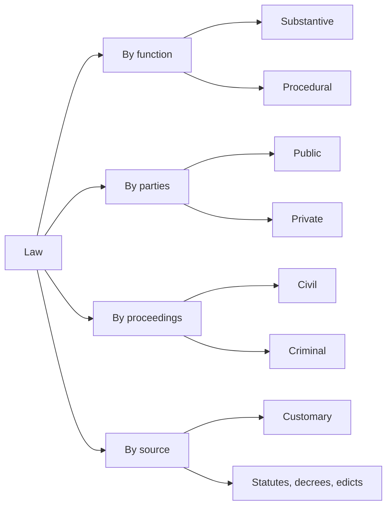

## Three Interrelated Ideas

**Law** is *a body of official rules and regulations, generally found in constitutions, legislation, judicial opinions and the like, used to govern a society and to control the behaviour of its members* (**Ugiade 2004**).

The chapter's author, **O. I. Adejumo**, argues that **law, democracy and good governance are interrelated**:

- **Democracy** needs the **people's participation in every aspect of governance** — and that starts with the **source of law** that establishes democracy: **the constitution**.
- **Good governance** is captured in the **welfare equation** of the people: is government delivering security and welfare?
- **Law** is the framework that makes both possible — it creates the institutions, guarantees rights and punishes abuse.

The author raises hard questions about the **1999 Constitution**. It was **enacted by the military** after being hurriedly put together by the **Constitution Debate Co-ordinating Committee**. Its preamble says *"We the People of the Federal Republic of Nigeria…"* — but did it really **emanate from the people**? If not, there is doubt about the origin of our democracy. And because the Nigerian state has, in the author's view, **defaulted on its social contract** with the people (security and welfare), the country faces a **legitimacy crisis**.

---

## What Is Law?

| Source | Definition |
|---|---|
| **Ugiade (2004)** | A body of official rules and regulations in constitutions, legislation, judicial opinions, etc., used to govern a society and control the behaviour of its members |
| **Black's Law Dictionary (2004)** | The regime that orders human activities and relations through **systematic application of the force of politically organised society**, or through social pressure backed by force. Also: the aggregate of legislation, judicial precedents and accepted legal principles that courts apply in deciding controversies |
| **John Austin (1832)** | *"A rule laid down for the guidance of an intelligent being by an intelligent being having power over him"* — law is **the command of the sovereign** (the commander) to the citizens (the commanded) |
| **Generic sense** | A body of rules of action or conduct **prescribed by the controlling authority** and having **binding legal force** — it must be obeyed, subject to **sanctions**; a solemn expression of the will of the supreme power of the state |

In modern societies laws are made by **authorised bodies** (legislatures, administrative bodies) and are **backed and enforced by the coercive power of the state** through penalties or remedies. Law is the instrument by which society **regulates the conduct** of its members.

Why do we need law at all? **Philip Cook (1986)**: if we disbanded all law enforcement agencies and removed all sanctions from the penal laws, the result would be **"a crime wave of unprecedented proportions."** The very existence of laws secures obedience from those who would otherwise disobey.

### Law, sovereignty and the citizen

Law also **expresses and sustains the sovereignty of the state**, and defines the **rights and duties of citizens**. The 1999 Constitution:

- Makes it the **duty of all organs of government**, and of all authorities and persons exercising legislative, executive or judicial powers, to **conform to, observe and apply** Chapter II (section 13).
- Declares (section 14(2)) that:
  - **(a)** **sovereignty belongs to the people of Nigeria**, from whom government, through the Constitution, derives all its powers and authority;
  - **(b)** the **security and welfare of the people** shall be the **primary responsibility of government**;
  - **(c)** the **participation of the people** in their government shall be ensured.

**Duties of every citizen** (section 24):

| | Every citizen shall… |
|---|---|
| (a) | **Abide by the Constitution**, respect its ideals and institutions, the National Flag, National Anthem, National Pledge and legitimate authorities |
| (b) | Help to **enhance the power, prestige and good name of Nigeria**, defend Nigeria and render national service as required |
| (c) | **Respect the dignity** and rights of other citizens and live in unity and harmony |
| (d) | Make a **positive and useful contribution** to the advancement of the community where he resides |
| (e) | **Render assistance to lawful agencies** in the maintenance of law and order |
| (f) | **Declare his income honestly** and **pay his tax promptly** |

---

## Functions of Law

| Function | Explanation |
|---|---|
| **1. Maintenance of public order** | Without the rule of law and courts to enforce it, each of us would be free to push and bully our fellow citizens (the textbook cites "Lord Donalds"). Law protects the harmless and defenceless from robbery, murder, kidnapping, rape, stealing and terrorism — it **preserves life and protects property** |
| **2. Facilitates co-operative action** | Business transactions rest on the **law of contract**; a students' union works only after members agree on rules (a constitution) to guide their relations; in a **federation**, tiers of government co-operate on matters one tier cannot handle alone |
| **3. Confers legitimacy** | **Malcolm N. Shaw (2010)**: legitimacy is a property of a rule or rule-making institution that **exerts a pull towards compliance**, because those addressed believe it came into being and operates according to **generally accepted principles of right process**. A legitimate rule enjoys a "double dose of approval". **Ernst O. Ugiagbe (2004)**: law **moderates the struggle for power** by providing criteria of **legitimate succession** and saying who may exercise what power — e.g. the 1999 Constitution's conditions for election into office |
| **4. Upholds rights and duties** | A **right** is something due to a person by just claim, legal guarantee or moral principle — a legally enforceable claim that another will or will not do an act (Black's 2004). A **duty** is a legal obligation owed to another who has a corresponding right. Once a right and duty are recognised in law, **law enforces them** |
| **5. Communicates standards** | By defining rights and responsibilities and backing them with **sanctions**, law becomes a powerful agency of communication — e.g. **section 36** sets the standards for a **fair hearing** |

**Rights and duties are correlative** — *where there is no duty there can be no right*. Rights may come from:

- **status as a human being** (every adult's right to take part in elections);
- the **constitution** (freedom of association, the right to fair hearing);
- a particular **role or status** (a manufacturer's duty to avoid harmful negligence; parents' duty to provide necessaries of life for their children).

<Analogy>
Your right to your allocated bed space in the hostel only means something because every other student has a **duty** not to take it. If nobody owed you that duty, your "right" would just be a wish. That is why the textbook says rights and duties are **correlative** — they come as a pair.
</Analogy>

**Where is the law found?** In **statutes, decrees, edicts and constitutional enactments**, as **interpreted by the courts**. Law varies with each society and with the culture and heritage of its people.

---

## Law and Morality

| Law | Morality |
|---|---|
| Rules backed by the state | Behaviour based on notions of what is **good or bad** in the circumstances |
| Violation **attracts sanctions** | Violation is **not sanctioned by law**, no matter how reprehensible |

The line between them is thin and **varies by society**. In the **South** of Nigeria, **adultery and fornication** are regarded as morally wrong but are **not punishable** under the law. In the **North**, **adultery, fornication and drinking alcohol** are **offences punishable** under the **Penal Code and Sharia law**.

---

## Classification of Law

### Substantive and procedural law

- **Substantive law** defines the **rights and duties** of persons and **prohibits wrongs**. For example, the **Criminal and Penal Codes** prohibit murder, stealing, robbery, rape, kidnapping, terrorism and examination malpractice. It also settles matters such as:
  - what is needed for a **binding contract**;
  - what **intent** is needed to commit corruption;
  - when a person is **entitled to compensation**.
- **Procedural law** covers **all the rules for processing civil and criminal cases** through the courts:
  - which **court or agency** may handle a dispute;
  - the **form** of trial, hearing or appeal;
  - the **time limits**.

  Its rules must be **strictly followed**. **Failure to comply may make a trial a nullity.** Procedural rules come from **statutes** and from the courts' own **rules of court**.

Procedural law is so important that it receives **constitutional protection** in **Chapter IV**. Every defendant gets **procedural due process**, including:

- **free legal representation** if they cannot afford a lawyer;
- a **speedy, public trial** by an **impartial judge**;
- the **right to be heard**.

*(The textbook cites section 33 for these guarantees. Section 33 is the right to life — these due-process guarantees are in **section 36**, the right to fair hearing.)*

### Public and private law

| | Public law | Private law |
|---|---|---|
| **Concerns** | Relationships **within government** and **between government and individuals** | Relationships of **people with one another** — their rights and obligations **towards each other** |
| **Affects** | The **entire society** — public rights and obligations | Private ownership and use of property, contracts, family relations, land, compensation for harm or breach of contract |
| **Areas** | **Constitutional law**, **criminal law**, **administrative law**, law of taxation | **Contract**, **family law**, **equity and trusts**, **torts**, **labour law**, **land law**, **business/commercial law** |
| **Why** | Criminal law is public because **every member of society is a potential victim** — penalties deter would-be criminals | An aggrieved party can **seek redress in court** if another fails to perform an agreed obligation |

"**Person**" in private law includes **corporations** — companies, government institutions and other registered bodies. Once duly registered they can **sue and be sued** in their own name. They are not human beings but **juristic persons**.

The line is **blurring**:

- **Labour law** now regulates competition even among private organisations.
- Formerly purely private **property and contract** law is now subject to legislation and regulation.
- **Taxation** (public law) reaches the whole private sphere.
- Courts make **manufacturers liable** to consumers for injuries caused by defective products.

*(The textbook ends its private-law paragraph with "Public law deals with the rights and duties of individuals towards each other rather than towards the state" — that describes **private** law; it is a slip.)*

### Civil and criminal law

- **Civil law** is the body of law (federal and state) on **civil or private rights enforced by civil actions** — proceedings that are **not criminal** and carry **no penal sanction**.
  - Example: a **breach of contract** leads to a civil action for **money damages** to compensate the **plaintiff** for losses caused by the **defendant**.
  - Note that "civil law" has a second meaning: the **legal tradition originating in ancient Rome** (used in France, Germany, etc.), as opposed to the English **common law** tradition Nigeria inherited.
- **Criminal law** **defines crimes, establishes punishments**, and regulates the **investigation and prosecution** of those accused.

Criminal law has two parts:

- **Substantive criminal law** defines the crime and its penalty — e.g. what counts as stealing, and what punishment a thief receives.
- **Criminal procedure** sets the steps for **investigating, arresting, charging, prosecuting, convicting and sentencing** — e.g. how a murder trial must be conducted.

A key constitutional rule (section 36(12)):

> "…a person shall not be convicted of a criminal offence unless that offence is defined and the penalty therefor is prescribed in a **written law**" — an Act of the National Assembly, a Law of a State, or subsidiary legislation made under a law.



<SortingGame title="Public law or private law?">

```sort
@buckets Public law | Private law
The State prosecutes a man for armed robbery => Public law :: Criminal law is public — every member of society is a potential victim.
A tenant sues her landlord for refusing to refund a deposit => Private law :: A dispute between private persons over a contract.
The Supreme Court decides whether a governor may dissolve elected local government councils => Public law :: Constitutional law — relations between governments and between government and citizens.
A company sues a supplier for delivering substandard cement => Private law :: Contract between juristic persons — companies can sue and be sued.
A couple goes to court over custody of their children after divorce => Private law :: Family law is part of private law.
A citizen challenges a ministry's decision to cancel his licence without a hearing => Public law :: Administrative law — the individual against the state.
A pedestrian injured by a careless driver sues for compensation => Private law :: The law of torts — compensation for harm one person causes another.
FIRS assesses a trader for unpaid income tax => Public law :: Taxation is public law reaching into the private sphere.
```

</SortingGame>

---

## Customary Law

**Customary law** is the **traditional law of the people** in a given community — the **unwritten law** they recognise as **binding**. It regulates their relations with one another and is a **source of Nigerian law**. It is **neither uniform nor universally applicable**: it varies from culture to culture and community to community.

### Characteristics (with cases)

| Characteristic | Explanation and authority |
|---|---|
| **Acceptability** | It derives its validity from **acceptance by the community** as binding. *Eleko v. Government of Nigeria*: **"it is the assent of the native community that gives a custom its validity."** *Owonyin v. Omotosho*: customary law is **"a mirror of accepted usage."** |
| **Unwritten** | It is largely **unwritten** |
| **Flexibility** | Because it is unwritten it is **dynamic** and changes with circumstances. *Lewis v. Bankole* (**Osborne C.J.**): "one of the most striking features of West African native custom is its **flexibility**… it shows unquestionable **adaptability to altered circumstance** without entirely losing its character" |

### Example: sharing the estate of someone who dies intestate

When a person dies **intestate** (without a will), customary law may govern the sharing of the estate — and it differs even within one ethnic group:

- **Yoruba – *idi-igi*:** distribution **through the mothers** — the estate is first shared equally among the **wives' branches** (each wife and her children), then within each branch.
- **Yoruba – *ori-ojori*:** distribution **per head** — every child gets an equal share.
- **Benin:** customary law favours the **eldest son**. *(More precisely, the eldest son inherits the **Igiogbe** — the house where the father lived and died — while the rest of the estate is shared; beyond the textbook.)*

Try it: a man leaves **₦12,000,000** and two wives — Wife A has three children, Wife B has one. Change the estate value, or change Tunde's mother to **Wife B**, and watch how the two methods compare.

<ExcelSheet title="Idi-igi versus ori-ojori" height="250" cols="5">

```sheet
[Estate]
@width A 150
@width B 110
@width C:D 120
@bold A1:A2 A4:D4 A9:D9
@format currency B1 C5:D9
Estate value | 12000000
Number of wives (branches) | 2

Child | Mother | Idi-igi share | Ori-ojori share
Ade | Wife A | =$B$1/$B$2/COUNTIF($B$5:$B$8,B5) | =$B$1/COUNTA($A$5:$A$8)
Bisi | Wife A | =$B$1/$B$2/COUNTIF($B$5:$B$8,B6) | =$B$1/COUNTA($A$5:$A$8)
Tunde | Wife A | =$B$1/$B$2/COUNTIF($B$5:$B$8,B7) | =$B$1/COUNTA($A$5:$A$8)
Kemi | Wife B | =$B$1/$B$2/COUNTIF($B$5:$B$8,B8) | =$B$1/COUNTA($A$5:$A$8)
Total | | =SUM(C5:C8) | =SUM(D5:D8)
@select C8
```

</ExcelSheet>

Under *idi-igi* Kemi, the **only child of her branch**, receives half the estate (₦6,000,000), while each of Wife A's three children receives ₦2,000,000. Under *ori-ojori* all four receive ₦3,000,000. *(Beyond the textbook: in* Dawodu v. Danmole *(1962) the Privy Council upheld idi-igi as a valid custom, not repugnant to natural justice.)*

### When the courts apply customary law

Nigerian courts must **observe and enforce** customary law that is applicable, provided it passes the **repugnancy test**:

1. It must not be **repugnant to natural justice, equity and good conscience**.
2. It must not be **incompatible**, directly or by implication, with any **law currently in force**.

If a custom passes, **nobody shall be deprived of its benefit**. It applies:

- where the **parties are natives**;
- between natives and non-natives, where **substantial injustice** would result from strictly applying another rule of law.

A party **cannot claim** customary law if:

- the parties **agreed** (expressly, or by the nature of the transaction) that their obligations would be governed **by some other law**; or
- the transaction is **unknown to customary law**.

---

## Constitutional Law

**Constitutional law** is part of **public law** — the law regulating the relationship between **the citizen and the state**. It is **the body of law concerned with government**, and the idea of a constitution is **as old as government itself**.

A **constitution** is the **frame or composition of a government**:

- how the government is **structured** in terms of its **organs**;
- the **distribution of powers** within it;
- the **relations of the organs** *inter se* (among themselves);
- the **procedures** for exercising powers.

**Hood Phillips and Jackson** define a constitution in two senses:

| Abstract sense | Concrete sense |
|---|---|
| The **system of laws, customs and conventions** that define the composition and powers of the organs of state and regulate their relations to one another and to the private citizen | The **document** in which the most important laws of the constitution are **authoritatively ordained** |

This is why the **United Kingdom**, with no single document, still **has a constitution** (abstract sense).

A good constitution:

- sets out **in unambiguous terms** the structure and functions of the **legislature, executive and judiciary**;
- **regulates government** and **safeguards the governed**;
- prevents one organ encroaching on another — **separation of powers**.

Written constitutions are usually **entrenched** — they can be amended or repealed only by **special procedures**. The constitution is **higher law** made by the **constituent power**, which in liberal democracies is **the people**. So a constitution should become effective **only after the people approve it**.

### Classification of constitutions

| Classification | Meaning | Examples |
|---|---|---|
| **Written** | One document (or a set of documents) can be pointed to as the constitution; a **deliberate creation**, separate from and prior to government | Nigeria, USA, India, South Africa. At independence Nigeria had **a combination of documents** — one constitution for each Region plus one for the Federation |
| **Unwritten** | No single document; rules are found in **statutes, law reports, case law, works of authority and conventions** — **an organic growth** from the life and habits of a people | United Kingdom, New Zealand |
| **Rigid** | Amendment needs a **special procedure** | 1999 Constitution (as amended); US Constitution |
| **Flexible** | Can be amended by **ordinary legislation** | Clifford (1922), Richards (1946), Macpherson (1951) — all **written but flexible** |
| **Monarchical** | Head of state is a **monarch** | Nigeria's 1960 Independence Constitution (ceremonial Queen); European monarchies — real power lies with the prime minister |
| **Republican** | Head of state is a **president** | Nigeria's 1963 Republican Constitution (ceremonial president) |
| **Presidential** | The people **elect both the executive head and the legislature**; a legislator appointed minister or commissioner **forfeits his seat** — separation of powers | USA; Nigeria since **1979** |
| **Parliamentary** | The people elect the legislature, which produces the executive: the **prime minister** comes from the majority party; ministers **must be members** of parliament | UK; Nigeria under the **1960 and 1963** constitutions. Many Nigerians canvass a return to it to **cut the cost of governance** |
| **Federal** | Powers **shared between the centre and the units**, each **autonomous** in its constitutionally allocated sphere | USA, Nigeria, India |
| **Unitary** | **Hierarchical**; lower tiers exist for **administrative purposes** without real autonomy | Britain, The Gambia |
| **Confederal** | Like a federation, but the **central government is weaker** than and subordinate to the component units | — |

**How rigid is the 1999 Constitution?** Section 9(2): a bill to alter the Constitution must be:

1. supported by **at least two-thirds of all members of each House** of the National Assembly; and
2. approved by resolution of the **Houses of Assembly of at least two-thirds of the States** (24 of 36).

**Creating a new state** (section 8) has its own, even stricter procedure, which includes a **referendum**.

*Note:* the student summary says the pre-independence flexible constitutions "were also unwritten". The textbook says they were **written but flexible** — which is correct.

**The UK's constitutional statutes** include:

- **Magna Carta** (1215)
- the **Petition of Right** (1628)
- the **Bill of Rights** (1689)
- the **Act of Settlement** (1701)
- the **Acts of Union with Scotland** (1707)
- the **Parliament Acts** (1911 and 1949)
- the **Statute of Westminster** (1931)

*(The textbook's dates are slightly off for three of these: it gives the Bill of Rights as 1688 — the year of the Glorious Revolution — the Act of Settlement as 1700, and the Act of Union as "1906", which is a misprint.)*

<Analogy>
A **flexible** constitution is like the house rules your room agreed on — any room meeting can change them. A **rigid** one is like the university's statute: changing it needs the Senate, the Council and the Visitor. Nigeria chose rigidity so that no single government can rewrite the rules to suit itself.
</Analogy>

<SortingGame title="Classify the constitutional feature">

```sort
@buckets Written | Unwritten | Rigid | Flexible | Parliamentary | Presidential
Rules of government are found in statutes, case law and conventions, not one document => Unwritten :: That is the UK model — an organic growth from the life of a people.
An amendment needs two-thirds of each House and two-thirds of the State Houses of Assembly => Rigid :: Section 9(2) of the 1999 Constitution — a special procedure.
The Richards Constitution of 1946 could be changed by ordinary legislation => Flexible :: Pre-independence constitutions were written but flexible.
A single document deliberately framed and approved as the charter of government => Written :: A written constitution is a deliberate creation, prior to government.
A senator appointed a minister must give up his seat => Presidential :: Separation of powers — one person cannot serve in two arms.
The prime minister is the leader of the majority party in the legislature => Parliamentary :: The executive comes out of the elected legislature (Nigeria 1960–1966).
Ministers must be, or quickly become, members of the legislature => Parliamentary :: Fusion of executive and legislature is the hallmark of the parliamentary system.
The people elect both the executive head and the legislators separately => Presidential :: Both arms get a direct mandate from the voters.
```

</SortingGame>

---

## Historical Development of Nigerian Constitutional Law

Nigeria's constitutional law began with the **colonial constitutions**:

| Year | Constitution | Key point |
|---|---|---|
| **1914** | **Lord Lugard's** Constitution | Amalgamation era |
| **1922** | **Hugh Clifford's** Constitution | Written but flexible |
| **1946** | **Arthur Richards's** Constitution | Written but flexible |
| **1951** | **John Macpherson's** Constitution | Written but flexible |
| **1954** | **Federal (Oliver Lyttelton)** Constitution | Made Nigeria a **federation of three regions** — **Northern, Eastern and Western** — with **Lagos as federal territory** |
| **1960** | **Independence Constitution** | Enacted and given force of law by the **British Parliament** (the colonial suzerain) |
| **1963** | **Republican Constitution** | Largely a re-enactment of 1960; **four regions** after the **Mid-Western Region** was carved out of the West (August 1963) |
| **1966** | Military takeover | The 1963 Constitution was **suspended**; rule by **decrees and edicts** |
| **1979** | **1979 Constitution** | Return to civil rule, **1 October 1979** |
| **1999** | **1999 Constitution** | Enacted by the military for the Fourth Republic (in force since 29 May 1999) |

### The 1979 transition: five stages

<FlowDiagram title="Planned transition to civil rule, 1975–1979">
<FlowStep title="1. Constitution Drafting Committee (1975)">
Set up to produce a **draft constitution** (the textbook dates it September 1975; it was inaugurated in October 1975 under Chief F. R. A. Williams — beyond the textbook). Members were chosen **two per state**, plus learned Nigerians in history, law, economics and political science (Joye and Igweike 1982). The Supreme Military Council committed itself to:

- **(a)** a **federal system** based on democracy and the rule of law, guaranteeing fundamental human rights;
- **(b)** genuine, **truly national political parties**;
- **(c)** an **executive presidential system**;
- **(d)** an **independent judiciary**;
- **(e)** corrective institutions such as the **Corrupt Practices Tribunal** and **Public Complaints Bureau**;
- **(f)** a **constitutional restriction on the number of states** to be created.
</FlowStep>
<FlowStep title="2. New states and local government reform (1976)">
States were increased from **twelve to nineteen** (the textbook says April 1976; the states were announced on 3 February 1976 — beyond the textbook). A **common national framework for local government** aimed at:

- making services **responsive to local wishes**;
- **democratic self-government** close to the grassroots;
- **mobilising** human and material resources;
- a **two-way channel** of communication between communities and government.
</FlowStep>
<FlowStep title="3. Constituent Assembly (1977)">
Established by the **Constituent Assembly Decree No. 50 of 1977** (members chosen August 1977) with full power to **deliberate on the draft constitution**. It had three categories of members: **elected**, **nominated**, and **members of the Constitution Drafting Committee**.
</FlowStep>
<FlowStep title="4. FEDECO, parties and elections (1978–79)">
The **Federal Electoral Commission (FEDECO)** was established. The **ban on politics was lifted**, new parties and voters were **registered**, and FEDECO supervised elections to the new federal and state offices.
</FlowStep>
<FlowStep title="5. Handover (1 October 1979)">
The military handed power to the **newly elected civilian officials** at federal and state levels.
</FlowStep>
</FlowDiagram>

### Unique features of the 1979 Constitution

1. **A US-style federal presidential system** with **three tiers of government**: federal, state and local.
2. **Legislative lists** (Second Schedule):

   | List | Who legislates | Examples (1999 Constitution) |
   |---|---|---|
   | **Exclusive** (Part I) | **Federal government only** (National Assembly) | Defence, external affairs, citizenship, currency, police, mines and minerals (oil), immigration, customs |
   | **Concurrent** (Part II) | **Both federal and state** | Collection of certain taxes, electric power, university and post-primary education, statistics, agricultural and industrial development |
   | **Residual** | **States only** — matters on **neither list** (Akande 1982) | Chieftaincy matters |

   *(Beyond the textbook: the 2023 constitutional amendments moved railways and correctional services to the Concurrent List.)*

3. **Chapter II — Fundamental Objectives and Directive Principles of State Policy**, new in Nigerian constitution-making. The Constitution Drafting Committee gave **six reasons** for it:
   1. It prescribes **definite duties** of the state towards its subjects — power is for the **welfare of society**, not the personal aggrandisement of politicians.
   2. It sets **targets** for development and a **yardstick for judging the performance** of any government.
   3. It defines **national goals**, without which a new nation would be **"rudderless"** and drift aimlessly.
   4. In a vast country where people put **local interests** first, it is a constant **reminder of unity** for successive governments.
   5. It **removes the objectives from political controversy** — future debates can centre on implementation and timing.
   6. It admits that society's aspirations and values are **not stagnant**.

   The objectives cover:

   - political, economic, social, educational, foreign-policy and environmental objectives;
   - Nigerian cultures and the obligations of the mass media;
   - national ethics and the duties of citizens.

   **But Chapter II is not justiciable.** Section 6(6)(c) bars the courts from deciding whether any act, law or judicial decision conforms with it. A citizen **cannot sue** a government for failing to achieve these objectives.
4. **Sections 4, 5 and 6** — the three arms of government:

   | Section | Arm | Shared between |
   |---|---|---|
   | **4** | **Legislature** | National Assembly (Senate and House of Representatives) and the State Houses of Assembly |
   | **5** | **Executive** | The President and the State Governors |
   | **6** | **Judiciary** | Federal courts and state courts |

   The 1999 Constitution keeps the same section numbers.
5. **Chapter IV — Fundamental Human Rights**, also known in some countries as a **Bill of Rights**.

<SortingGame title="Exclusive, Concurrent or Residual?">

```sort
@buckets Exclusive | Concurrent | Residual
Defence and the armed forces => Exclusive :: Only the federal government may legislate on defence.
Printing and issuing the naira => Exclusive :: Currency, coinage and legal tender are federal matters.
Granting Nigerian citizenship => Exclusive :: Citizenship is on the Exclusive List.
The Nigeria Police Force => Exclusive :: The Constitution establishes one police force for Nigeria (section 214).
A state government establishing its own university => Concurrent :: University education is on the Concurrent List — both levels may legislate.
Generating electricity for areas not covered by the national grid => Concurrent :: Electric power is on the Concurrent List.
Collecting and publishing statistics => Concurrent :: Statistics is a concurrent matter.
Chieftaincy matters and recognition of traditional rulers => Residual :: Matters on neither list belong to the states.
```

</SortingGame>

---

## Fundamental Human Rights

**Ajomo (2003):** human rights are the rights human beings enjoy **by virtue of their humanity** — "whether black, white, yellow, grey or red" — whose deprivation would be a **grave affront to one's natural sense of justice**.

Their roots lie in **natural law** — the **higher law**, in accordance with nature, that applies to all men and is **unchangeable and eternal**. Fundamental rights are **not created by the state**. They are universal, **antedate the state**, belong to individuals, and **cannot be waived**. Their modern formulation dates from the **American and French revolutions** of the late 18th century. The **American Declaration of Independence** put it this way:

> "We hold these truths to be self-evident, that all men are created equal, that they are endowed by their Creator with certain unalienable Rights, that among these are Life, Liberty and the pursuit of Happiness."

They appear in **Chapter IV of the 1979 and 1999 Constitutions**:

| Section | Right | Key content |
|---|---|---|
| **33** | **Life** | No one shall be **intentionally** deprived of life **except in execution of a court sentence** for a criminal offence of which he has been found guilty in Nigeria |
| **34** | **Dignity of the human person** | No **torture**, inhuman or degrading treatment; no **slavery or servitude**; no **forced or compulsory labour** |
| **35** | **Personal liberty** | No deprivation of liberty **except in listed cases and by a procedure permitted by law** |
| **36** | **Fair hearing** | A fair hearing **within a reasonable time** by an **independent and impartial** court or tribunal |
| **37** | **Private and family life** | Privacy of citizens, their homes, correspondence, telephone conversations and telegraphic communications |
| **38** | **Thought, conscience and religion** | Includes freedom to **change** religion and to **manifest and propagate** it |
| **39** | **Expression and the press** | Freedom to hold opinions and to receive and impart ideas and information |
| **40** | **Peaceful assembly and association** | Includes forming or belonging to political parties, trade unions and other associations |
| **41** | **Freedom of movement** | Move freely throughout Nigeria and reside anywhere; not to be expelled from or refused entry to Nigeria |
| **42** | **Freedom from discrimination** | No discrimination by community, ethnic group, place of origin, sex, religion or political opinion |
| **43** | **Acquire and own immovable property** anywhere in Nigeria | Following the procedures prescribed by the law of the place |
| **44** | **Protection against compulsory acquisition** of property | Only with **prompt payment of compensation**, determined by a court or tribunal |

### The key rights in detail

**Right to life (s. 33)** — the first basic right, but **not absolute**. A person may be executed after being tried and sentenced to death for a **capital offence**. Also, a person is **not regarded as deprived of life** if he dies from the use of **force reasonably necessary**, to the extent permitted by law:

- **(a)** for the **defence of any person from unlawful violence**, or for the **defence of property**;
- **(b)** to effect a **lawful arrest** or prevent the **escape** of a person lawfully detained;
- **(c)** to **suppress a riot, insurrection or mutiny**.

For punishment, **offences are of three kinds**:

| Class | Definition | Examples |
|---|---|---|
| **Felony** | A serious crime declared a felony by law, or punishable (without proof of a previous conviction) with **death or imprisonment for three years or more** | Murder, treason, armed robbery, terrorism; kidnapping in some states |
| **Misdemeanour** | Declared a misdemeanour, or punishable with imprisonment of **at least six months but less than three years** | — |
| **Simple offence** | **All other offences** | — |

**Dignity of the human person (s. 34)** — the ban on forced labour is **not breached** by compulsory service in:

- the **Armed Forces** or the **Police**;
- a national service scheme such as the **NYSC**;
- normal **communal or civil obligations**, e.g. the **monthly sanitation exercise**.

**Personal liberty (s. 35)** — a **qualified** right, designed so that no citizen is detained at the whim of those in authority. Liberty may be taken away only:

| | Exception |
|---|---|
| (a) | To execute a **lawful sentence** for a criminal offence of which the person was found guilty |
| (b) | For **failure to comply with a court order** or another legal obligation |
| (c) | To bring the person **to court on reasonable suspicion** of an offence, or as reasonably necessary to **prevent** him committing one |
| (d) | For a **minor** — for his **education or welfare** |
| (e) | To treat persons with **infectious disease**, persons of **unsound mind**, **drug or alcohol addicts**, or **vagrants** |
| (f) | To prevent **unlawful entry into Nigeria**, or for **expulsion, extradition** or other lawful removal |

A person arrested or detained has four safeguards:

- the **right to remain silent** until he has consulted a **lawyer of his choice**;
- the **facts and grounds** of the arrest must be given to him **in writing within 24 hours**, in a language he understands;
- he must be brought **before a court within a reasonable time**;
- if the arrest was unlawful, he is entitled to **compensation and a public apology**.

*(Beyond the textbook: section 35(5) defines a reasonable time as one day where a court is within 40 km, otherwise two days or longer if the court considers it reasonable.)*

**Fair hearing (s. 36)** — the **widest and most all-embracing** right. Subsections **1–3** cover **civil** rights and obligations; subsections **4–12** cover **criminal** cases. At common law it rests on two Latin maxims:

- ***nemo judex in causa sua*** — **no man shall be a judge in his own cause**;
- ***audi alteram partem*** — **hear the other side**.

To satisfy section 36:

1. The trial must be held **in public**.
2. The court or tribunal must be **independent and impartial**.
3. An accused person is **presumed innocent** until proved guilty.
4. He is entitled to a fair hearing **within a reasonable time**.
5. He must be **informed promptly, in a language he understands and in detail**, of the offence.
6. He must be given **adequate time and facilities** to prepare his defence.
7. He may defend himself **in person or by a lawyer of his choice**.
8. He may **examine prosecution witnesses** and call his own.
9. He is entitled to a **free interpreter** if he does not understand the language of the trial.
10. **No retroactive offences** — no one is guilty of an act that was not an offence when it was done, and no heavier penalty may apply than the one in force at the time.
11. **No double jeopardy** — a person tried and convicted or acquitted cannot be tried again for the same offence, except on the order of a superior court.
12. **No compulsion to testify** — an accused cannot be forced to give evidence at his trial.
13. **Only written law** — no conviction unless the offence is defined and its penalty prescribed in a **written law**.

**Other rights:**

- **Religion (s. 38)**:
  - no student may be forced to receive **religious instruction** or attend ceremonies of a religion **other than his own** (or one not approved by his parent or guardian);
  - a religious community may give instruction to its own pupils in **its own schools**;
  - the section gives **no right to form or join a secret society**.
- **Expression (s. 39)** — mirrors **Article 19 of the Universal Declaration of Human Rights**. It can be limited only by a law **reasonably justifiable in a democratic society**, and it is **not a licence to spread false news** likely to cause fear and alarm.
- **Assembly and association (s. 40)** — two or more persons may associate for a common purpose within the law. The assembly must be **peaceful** and the purpose **lawful**.
- **Movement (s. 41)** — may be restricted by law, e.g. to **extradite** a person for trial abroad or to serve a sentence outside Nigeria.
- **Discrimination (s. 42)**:
  - no citizen may be favoured or disadvantaged by any law or executive action because of **community, ethnic group, place of origin, sex, religion or political opinion**;
  - s. 42(2): no disability or deprivation merely because of **the circumstances of his birth**.

### Limitations on fundamental rights

| Provision | Rights affected | When |
|---|---|---|
| **Section 45(1)** | The **qualified rights** in sections **37, 38, 39, 40 and 41** | By a law **reasonably justifiable in a democratic society** in the interest of **defence, public safety, public order, public morality or public health**, or to **protect the rights and freedoms of others**. Such measures can be **challenged in court** |
| **Section 45(2)** | **Life (s. 33)** and **personal liberty (s. 35)** | Only **in the event of war** or during a **period of emergency** declared under **section 305** |

*Note:* the textbook introduces this as "section 46". The general restriction and derogation clause is **section 45**. Section 46 gives the **High Court** power to enforce fundamental rights when a person alleges they have been, are being or are likely to be breached.

<SortingGame title="Which right is being violated?">

```sort
@buckets Life (s. 33) | Dignity (s. 34) | Personal liberty (s. 35) | Fair hearing (s. 36) | Expression (s. 39) | Non-discrimination (s. 42)
A suspect is beaten in a police cell to force a confession => Dignity (s. 34) :: Torture and inhuman treatment are forbidden.
A man is detained for three weeks without being told why or taken to court => Personal liberty (s. 35) :: He must be told the grounds in writing within 24 hours and taken to court within a reasonable time.
A judge hears a land case in which he owns part of the disputed land => Fair hearing (s. 36) :: Nemo judex in causa sua — no one may judge his own cause.
A disciplinary panel expels a student without letting her present her side => Fair hearing (s. 36) :: Audi alteram partem — hear the other side.
Police shoot dead an unarmed man who was not resisting or escaping => Life (s. 33) :: Force is lawful only when reasonably necessary — this is not.
A girl is made to work on a farm without pay to settle her father's debt => Dignity (s. 34) :: Forced labour and servitude are prohibited.
A journalist is detained for publishing an opinion criticising a governor => Expression (s. 39) :: Freedom to hold opinions and impart ideas; only laws justifiable in a democracy may limit it.
An applicant is refused a federal job solely because of her state of origin => Non-discrimination (s. 42) :: Place of origin is a forbidden ground of discrimination.
```

</SortingGame>

---

## What Constitutional Powers Belong to the People?

Much power is delegated to the **federal government** and great power is reserved to the **states** — but in a free, democratic society **the people possess the ultimate power**.

| Power | How it works |
|---|---|
| **The vote** | Every elective office must be won by receiving the **majority of the people's votes**. For the **presidential election the whole federation is one constituency**, and every registered voter may vote. The power is valuable only where the people's choice is **respected** and the electoral system is **credible** |
| **Recall** | Voters can **remove an elected legislator** — of the National Assembly or a State House of Assembly — **before his term ends**. *(Beyond the textbook: a petition signed by more than half of the registered voters in the constituency, then approved by a simple majority of them in a referendum conducted by INEC within 90 days — sections 69 and 110.)* |
| **Impeachment** | The **President, Vice-President, Governor and Deputy Governor cannot be recalled**. They can be **impeached** by the **legislature acting on the people's behalf** |
| **Referendum petition** | Used by voters to **veto unwanted laws** already passed, or laws enacted when the legislature overrode an executive veto. Popular in developed democracies; the textbook notes it is **yet to be used in Nigeria**. *(The 1999 Constitution has no such citizens' veto. It uses referendums for **creating new states** and similar questions — section 8.)* |

---

## Criminal Law

**Criminal law** is the branch of law that **defines crimes and establishes punishments**. It seeks to **protect the public from harm** in two ways:

- by **punishing** those who have done harm;
- by **threatening** would-be criminals with punishment.

The harm it targets ranges from **death and bodily injury** to loss of or damage to **property**, **sexual assault**, **disturbance of public peace**, kidnapping and terrorism.

A **crime** is **an act or omission** which renders the person doing it liable to **punishment** under the **Criminal Code** or any Act or Law in Nigeria.

### The two elements of a crime

| Element | Meaning |
|---|---|
| ***Actus reus*** — **guilty act** | The person **voluntarily** did a prohibited act, or **failed to act** when the law imposed a duty to act. **Accidental or involuntary** conduct attracts **no liability** |
| ***Mens rea*** — **guilty mind** | The required state of mind — acting **intentionally, knowingly, maliciously, wilfully, recklessly or negligently**, or with intent to achieve a specific result. It separates **inadvertent acts** from criminal ones |

**Both must co-exist** — a guilty act alone is not enough. The exception is **strict liability** offences, e.g. **drink-driving**, where the act alone suffices.

### Defences to crimes

A person who raises a defence is **not denying he did the act**. He is saying he should not be punished because of his **state of mind** or the **circumstances** — his mind was not guilty.

| Defence | Rule |
|---|---|
| **Alibi** | **Factual**: the accused was **not at the scene** when the crime was committed |
| **Insanity** | He did the act, but **mental disease or natural mental infirmity** deprived him of the capacity to **understand what he was doing**, to **control his actions**, or to **know he ought not** to do it |
| **Intoxication** | **Criminal Code:** as a general rule **no defence**. Two exceptions: (1) the intoxication was **involuntary** — caused by another's malicious or negligent act — and he did not know what he was doing or that it was wrong; (2) the intoxication made him **insane**, temporarily or otherwise. **Penal Code:** a defence **only if the intoxication was involuntary** |
| **Immature age** | Under **7** — **not criminally responsible** for any act. Under **12** — not responsible **unless it is proved** he had the **capacity to know** he ought not to do it. A **male under 12** is presumed **incapable of carnal knowledge** |
| **Duress** | He committed the crime because another person exerted **extreme influence or compulsion** on him |
| **Mistake of fact** | A defence if the mistake means he **lacked the mental fault** for the crime — e.g. taking another's coat **believing it is his own** negates the intent to permanently deprive, so it is not stealing. But **mistake (ignorance) of law is no defence** |
| **Self-defence** | Force that **reasonably appears necessary** against imminent unlawful force. **Deadly force** is justified if he reasonably believes it necessary to prevent **immediate death or serious bodily harm** to himself, his spouse, child, wards, servants, or even his property |

<SortingGame title="Which defence (if any) applies?">

```sort
@buckets Alibi | Insanity | Immature age | Duress | Mistake of fact | Self-defence | No defence
A six-year-old takes a phone from a shop => Immature age :: A child under seven is not criminally responsible for any act.
A trader proves he was in Kano when the robbery happened in Ibadan => Alibi :: A factual defence — he was not at the scene.
A man picks up an identical coat at a party, honestly believing it is his => Mistake of fact :: There is no intent to permanently deprive the owner.
A man says he did not know that selling unregistered drugs is an offence => No defence :: Ignorance or mistake of law is no defence.
A man drinks heavily at a party by choice and then assaults a guest => No defence :: Voluntary intoxication is generally no defence.
A driver is forced at gunpoint to drive robbers' getaway car => Duress :: He acted under extreme compulsion by another person.
A woman stabs an attacker who was trying to strangle her => Self-defence :: Force reasonably necessary against an imminent threat of death.
A man with a severe mental illness kills without understanding what he is doing => Insanity :: Mental disease deprived him of capacity to understand or control his actions.
```

</SortingGame>

### The police, arrest and search

The first criminal-justice agency an offender meets is the **police**. **Section 214(1)** of the 1999 Constitution establishes **one Police Force for Nigeria**. **Section 4 of the Police Act** (Cap 359, LFN 1990) lists its general duties:

- **(a)** prevention of crime;
- **(b)** detection of crime;
- **(c)** apprehension of offenders;
- **(d)** preservation of law and order;
- **(e)** protection of life and property;
- **(f)** enforcement of all laws and regulations they are charged with;
- **(g)** such military duties within or outside Nigeria as may be required.

*(Beyond the textbook: that Act has been replaced by the **Police Act 2020**, and arrest procedure is now largely governed by the **Administration of Criminal Justice Act 2015**.)*

**Arrest** is **taking a person into custody by restricting his movement or right to leave**. The police need **probable cause** — facts that would lead a **reasonable person** to believe the suspect committed or was committing a crime. The arrested person may **not be handcuffed** or unnecessarily restrained, **except**:

- by **order of the court**;
- where **violence or escape** is reasonably feared;
- where restraint is necessary for **his own safety**.

<Tabs>
<Tab label="With a warrant">
A **warrant of arrest** is **an authority in writing by a court** to a police officer or any other person to **arrest an offender**.

- **When:** applied for when the allegation is **serious** or a **summons has been disobeyed**. It is issued upon a **complaint on oath**.
- **Form:** it must be **in writing**, dated and **signed by the judge or magistrate**. It names the person who will execute it and the person to be arrested, and specifies the **offence**.
- **Issue:** on **any day, including Sundays and public holidays**, at any time — though not inside the actual courtroom where a court is sitting.
- **Where executed:** anywhere **within the state**. It may not be executed inside a **legislative house without permission** (the textbook says "of the President"; in practice, of the presiding officer).
- **Showing it:** it must be **shown** to the person arrested, unless there is good reason not to. The officer need not have it on him at the time of arrest, but must produce it **as soon as possible on request**.
- **Validity:** it remains in force **until executed or cancelled** by a judge or magistrate.
- **After arrest:** the person is taken **to the court that issued it**, unless an endorsement on the back allows release on conditions (bail).
</Tab>
<Tab label="Without a warrant">
**A police officer** may arrest without a warrant anyone who:

- commits **any offence in his presence** (even an offence which normally requires a warrant); or
- he **reasonably suspects** has committed an **indictable offence**.

He is **not liable for false imprisonment** if the arrest was made on reasonable grounds, even if no offence was committed.

**A judge or magistrate** may arrest, or direct the arrest of, anyone who commits an offence **in his presence** within his division or district.

**A private person** may arrest without a warrant anyone who:

- **(a)** commits an **indictable offence in his view**;
- **(b)** he **reasonably suspects** has committed a **felony**;
- **(c)** he reasonably suspects has committed a **misdemeanour by night**.

He must hand the suspect over to a **police officer**, or take him to the **nearest police station**, **without reasonable delay**.
</Tab>
<Tab label="Search">
**Search of the person:** after a lawful arrest, the police may **search the body** of the arrested person. They may also **detain and search** anyone reasonably suspected of carrying **stolen property**. **A woman must be searched by a woman police officer.**

**Search of premises:** requires a **search warrant** — a search without one is **unlawful**. There are two exceptions:

- **customs officers** may search premises without a warrant (s. 147(1), Customs and Excise Management Act);
- a **justice of the peace** may direct a search in his presence (s. 85, Criminal Procedure Code).

**Seizure:** only goods **named in the warrant** may be seized. However, the officer may also seize goods he reasonably believes are **stolen or relevant to another offence**. When lawfully arresting a person at home, the police may remove documents that are **material evidence**. They must **act reasonably** and detain the suspect **no longer than necessary**.
</Tab>
</Tabs>

<FlowDiagram title="From arrest without warrant to court">
<FlowStep title="1. Arrest">
On **probable cause**. No handcuffs unless violence or escape is feared, or the court orders it.
</FlowStep>
<FlowStep title="2. Police station">
The suspect is taken with **all reasonable dispatch** to a police station. He must be given **reasonable facilities to obtain legal advice** and to **arrange bail**, and he may **remain silent** until he has consulted his lawyer.
</FlowStep>
<FlowStep title="3. Charge to court — or bail">
He must be brought before a court with jurisdiction **within 24 hours**. If that is not practicable, the police **shall release him on bail** (on his recognisance, with or without sureties) — **unless the offence is capital or serious**.
</FlowStep>
<FlowStep title="4. Police bail">
If investigation cannot be completed quickly, he is released on bail to **report back** at a stated time. **Police bail is free** — although, as the textbook notes, police in practice still collect money for "administrative bail".
</FlowStep>
</FlowDiagram>

---

## Democracy

**Black's Law Dictionary:** democracy is **government by the people, either directly or through representatives elected by the people**. The word comes from Greek writings of about the **fifth century BC**:

- ***demos*** — the **common people**, the masses;
- ***kratos*** — **power**.

So democracy means **power belongs to the people** — mainly the electorate. When they hand that power to elected representatives, it should be **used for the good of all**.

### Two schools of thought

**Janda, Berry and Goldman (1999):** the **procedural** approach focuses on **how decisions are made**; the **substantive** approach focuses on **what government does**.

<Tabs>
<Tab label="Procedural democracy">
Democracy is a **form of government**. What matters is the **procedures** that let the people govern: meeting to discuss issues, **voting**, running for office. It rests on three principles:

| Question | Principle |
|---|---|
| Who should participate? | **Universal participation** — every adult in the political community may vote |
| How much should each vote count? | **Political equality** — all votes count **equally** |
| How many votes are needed to decide? | **Majority rule** — the group does what **50% plus one** of participants want |

**Participatory democracy** — every adult deciding every issue — is **impossible** at national level. All Nigerian adults cannot gather at the National Assembly complex in Abuja to vote on every policy. So the Constitution institutes a **representative democracy**: citizens elect officials to decide **on their behalf**, as their **agents**.

What if the representatives stop deciding as the people would have? The answer is **responsiveness** — representatives must **respond to public opinion**.
</Tab>
<Tab label="Substantive democracy">
Democracy lies in the **substance of government policies**. Certain principles must be built into what government does:

- **Civil liberties** — e.g. **freedom of religion** and **freedom of expression**. Substantive theorists would reject a law making a state support one religion, since **section 10** says the Federation or a State **shall not adopt any religion as State religion**.
- **Civil rights** — powers or privileges government may not arbitrarily deny, e.g. protection against **discrimination** (section 42(1) and (2)).
- The **provision for human needs**.
</Tab>
</Tabs>

Essentially, democracy is **a set of institutions** meeting at least two requirements:

1. It must elicit, as accurately as possible, the opinion of as many people as possible on **who shall represent them** and **how the country should be governed**. At a minimum this means **universal suffrage**, **political parties**, and **fresh elections at relatively frequent intervals**.
2. It must ensure that representatives **pursue the overall interest of the electorate**.

Democracy can take different forms — e.g. **social** and **liberal** democracy. Because it upholds the **people's will and collective dignity**, it must be **entrenched and protected against abuse**.

**Elements of democracy — L. T. Sargent (1990):**

- **(a)** citizens' **involvement** in political decision making;
- **(b)** some degree of **equality** among citizens;
- **(c)** some degree of **liberty** granted or retained by citizens;
- **(d)** a system of **representation**;
- **(e)** an **electoral system of majority rule**.

<SortingGame title="Procedural or substantive democracy?">

```sort
@buckets Procedural | Substantive
Every adult citizen may vote in elections => Procedural :: Universal participation — about how decisions are made.
Each person's vote carries the same weight => Procedural :: Political equality.
A motion passes if 50% plus one of members support it => Procedural :: Majority rule.
Government may not adopt any religion as a state religion => Substantive :: Section 10 protects freedom of religion — about what government does.
The press may criticise government without being shut down => Substantive :: Civil liberties must be guaranteed in policy.
No citizen may be denied a benefit because of the circumstances of his birth => Substantive :: A civil right under section 42(2).
Elections are held at regular, frequent intervals => Procedural :: A procedure for renewing the people's mandate.
Government policy must provide for citizens' basic needs => Substantive :: Substance — the provision for human needs.
```

</SortingGame>

---

## Good Governance

**Akinseye-George (2000):** good governance means subjecting the whole process of governance to **accountability, transparency and openness** — and it must also be **legitimate**. Another key factor is the **welfare equation of the people** as the goal of governance.

The **International Monetary Fund** stresses:

- **transparency** of government business;
- **effective management of public resources**;
- a **stable, transparent economic and regulatory environment** for private-sector activity.

Critics reply that a notion of good governance that is rich in **macroeconomic technicalities** but lacks **social and political content** is ambiguous. That content is **people's welfare, popular empowerment, and responsive and responsible government**.

### Ten characteristics of good governance

| | |
|---|---|
| 1. Policies that bring **happiness and the good life** of citizens | 6. **Openness** in government transactions |
| 2. **Accountability** of government officials | 7. **Free flow of information** |
| 3. **Transparency** in government procedures | 8. **Respect for the rule of law** |
| 4. **Predictability** in government behaviour | 9. **Freedom of the press** |
| 5. Expectation of **rational decisions** by government | 10. **Decentralisation** of power and decision making |

**People are central** to good governance. Life in the **state of nature** was "solitary, poor, nasty, brutish and short" (Hobbes). People instituted the state to secure their **freedoms and welfare as a commonwealth**. The state is relevant only if it **protects the health of the commonwealth**:

- **Any deviation from the social contract** — the terms binding state and citizens — **amounts to corruption** and violation of the people's rights.
- **Everything that promotes the health and stability of the commonwealth is good governance.**

### Corruption: the major obstacle

**Corruption** is the major problem militating against good governance in Nigeria. It:

- **reduces the quality** of public goods and services;
- **concentrates the state's resources in a few hands**;
- denies most citizens basic necessities — **health care, good roads, potable water, stable power, quality education, prompt wages and pensions**.

A successful **war on corruption** would **reduce poverty** and deliver the **dividends of democracy**. **Accountability** is central to that war, and its procedure should be clearly stipulated at every level of government:

| | Accountability measure |
|---|---|
| (a) | **Appropriate self-disclosure** — officials report their activities to their employer or constituency |
| (b) | **Scrutiny** — the books are open to verification by all |
| (c) | **Ownership of decisions by the people** — every official must imbibe the people's sovereignty |
| (d) | Resources that would have been **privatised** (diverted to private pockets) are used for **development** |
| (e) | Government business runs through **due process**, making government more effective and the state more efficient |
| (f) | A war on corruption is **indirectly a war on poverty**, since corruption promotes **inequality** in the distribution of wealth |

To reduce corruption to an insignificant level, Nigeria needs a state that is **responsive, responsible, legitimate and strong enough** to impose its rule and **enforce sanctions against corrupt persons**.

### Conclusion

Law, democracy and good governance are **interrelated**. Together they guarantee **freedom, liberty and the dividends of democracy**. The essence of democracy is **popular participation** in forming government through elections. A government **of the people and for the people** must:

- fulfil its side of the **social contract** through **welfare programmes** that relieve the suffering of the masses;
- be **transparent** in how it conducts business;
- be ready to **account for its stewardship**.

---

## Quick Check

<MCQ question="The Legislature under the 1999 Constitution is provided for in…">
<Option correct>Section 4</Option>
<Option>Section 3</Option>
<Option>Section 5</Option>
<Option>Section 8</Option>
<Explain>Section 4 vests legislative powers in the National Assembly and the State Houses of Assembly; section 5 is the executive and section 6 the judiciary. Section 3 lists the states and section 8 deals with creating new states.</Explain>
</MCQ>

<MCQ question="Section 35 says no person shall be deprived of personal liberty save in listed cases and by a procedure permitted by law. This right is therefore…">
<Option>absolute</Option>
<Option correct>qualified</Option>
<Option>mandatory</Option>
<Option>non-justiciable</Option>
<Explain>It is qualified — the Constitution itself lists exceptions (lawful sentence, court order, reasonable suspicion, minors, infectious disease, immigration). Non-justiciable describes Chapter II, not Chapter IV rights.</Explain>
</MCQ>

<MCQ question="John Austin (1832) saw law essentially as…">
<Option>the custom accepted by a community</Option>
<Option correct>the command of the sovereign to the citizens</Option>
<Option>a mirror of accepted usage</Option>
<Option>a moral principle of right and wrong</Option>
<Explain>Austin: "a rule laid down for the guidance of an intelligent being by an intelligent being having power over him" — the commander (sovereign) to the commanded (citizens). "Mirror of accepted usage" describes customary law (Owonyin v. Omotosho).</Explain>
</MCQ>

<MCQ question="The two elements that must co-exist for criminal liability are…">
<Option>alibi and duress</Option>
<Option correct>actus reus and mens rea</Option>
<Option>felony and misdemeanour</Option>
<Option>substantive and procedural law</Option>
<Explain>Actus reus (guilty act) and mens rea (guilty mind). Strict-liability offences such as drink-driving are the exception, where the act alone suffices.</Explain>
</MCQ>

<MCQ question="Under the Criminal Code, a person is not criminally responsible for any act or omission if he is under the age of…">
<Option correct>seven</Option>
<Option>ten</Option>
<Option>twelve</Option>
<Option>eighteen</Option>
<Explain>Under 7: no criminal responsibility at all. Between 7 and 12: not responsible unless it is proved he had capacity to know he ought not to do the act.</Explain>
</MCQ>

<MCQ question="Which constitution made Nigeria a federation of three regions with Lagos as federal territory?">
<Option>Clifford Constitution, 1922</Option>
<Option>Richards Constitution, 1946</Option>
<Option correct>Lyttelton Constitution, 1954</Option>
<Option>Republican Constitution, 1963</Option>
<Explain>The Federal (Oliver Lyttelton) Constitution of 1954 created the Northern, Eastern and Western Regions with Lagos as federal territory. The Mid-West made it four regions in 1963.</Explain>
</MCQ>

<MCQ question="The Fundamental Objectives and Directive Principles of State Policy (Chapter II) are…">
<Option>enforceable in any High Court</Option>
<Option correct>not justiciable — courts cannot enforce them</Option>
<Option>limited to the federal government only</Option>
<Option>the same as fundamental human rights</Option>
<Explain>Section 6(6)(c) excludes from the courts any question whether an act or law conforms with Chapter II. Chapter IV rights, by contrast, are enforceable in the High Court.</Explain>
</MCQ>

<MCQ question="Audi alteram partem means…">
<Option>no man shall be a judge in his own cause</Option>
<Option correct>hear the other side</Option>
<Option>let the buyer beware</Option>
<Option>the people's welfare is the supreme law</Option>
<Explain>Audi alteram partem — hear the other side. Nemo judex in causa sua — no man shall be a judge in his own cause. Both underpin the right to fair hearing (s. 36).</Explain>
</MCQ>

<MCQ question="Under section 9(2), an alteration of the 1999 Constitution must be supported by…">
<Option>a simple majority of the National Assembly</Option>
<Option>the President and two-thirds of the Senate</Option>
<Option correct>two-thirds of all members of each House and the Houses of Assembly of two-thirds of the states</Option>
<Option>a national referendum</Option>
<Explain>That special procedure is what makes the 1999 Constitution rigid. Creating new states (section 8) has its own procedure, which includes a referendum.</Explain>
</MCQ>

## Practice Questions

<Reveal question="1. Define law and explain five functions of law.">
Law is a body of official rules and regulations found in constitutions, legislation and judicial opinions, used to govern a society and control its members' behaviour (Ugiade 2004); Austin called it the command of the sovereign. Functions: (1) maintenance of public order — preserving life and property; (2) facilitating co-operative action — contracts, associations, co-operation in a federation; (3) conferring legitimacy — rules made by right process attract compliance (Shaw 2010) and law sets criteria for legitimate succession (Ugiagbe 2004); (4) upholding rights and duties, which are correlative; (5) communicating standards backed by sanctions, e.g. section 36 on fair hearing.
</Reveal>

<Reveal question="2. Distinguish between (a) substantive and procedural law, (b) public and private law.">
(a) Substantive law defines rights and duties and prohibits wrongs (Criminal and Penal Codes on murder, stealing, etc.); procedural law is the rules for processing civil and criminal cases — which court, the form of trial, time limits — and non-compliance can make a trial a nullity. (b) Public law governs relations within government and between government and individuals (constitutional, criminal, administrative law) and affects the whole society; private law governs relations among persons, including juristic persons such as companies (contract, family, torts, land, labour, equity and trusts).
</Reveal>

<Reveal question="3. What is customary law? State its characteristics with decided cases.">
Customary law is the unwritten traditional law of a community, accepted as binding; it is a source of Nigerian law and is not uniform. Characteristics: acceptability — "the assent of the native community gives a custom its validity" (Eleko v. Government of Nigeria), "a mirror of accepted usage" (Owonyin v. Omotosho); unwritten; flexible and adaptable (Lewis v. Bankole, Osborne C.J.). Courts enforce it if it is not repugnant to natural justice, equity and good conscience nor incompatible with any law in force. Example: Yoruba idi-igi (through mothers) versus ori-ojori (per head).
</Reveal>

<Reveal question="4. Classify constitutions, giving an example of each class.">
Written (Nigeria, USA) vs unwritten (UK, New Zealand); rigid — special amendment procedure (1999 Constitution s. 9(2), US) vs flexible — amended by ordinary law (Clifford 1922, Richards 1946, Macpherson 1951); monarchical (1960 Independence Constitution) vs republican (1963); presidential — people elect both executive and legislature, ministers leave the legislature (USA, Nigeria since 1979) vs parliamentary — executive drawn from the majority in the legislature (UK, Nigeria 1960–66); federal (USA, Nigeria, India) vs unitary (Britain, The Gambia); and confederal, where the centre is weaker than the units.
</Reveal>

<Reveal question="5. Explain any four fundamental rights under the 1999 Constitution and the limits placed on them.">
Any four, e.g.: life (s. 33) — no intentional deprivation except by court sentence, and force reasonably necessary for defence, lawful arrest or suppressing riots is excepted; dignity (s. 34) — no torture, slavery or forced labour (military, NYSC and sanitation excepted); personal liberty (s. 35) — qualified, with listed exceptions, the right to silence, written grounds within 24 hours, compensation for unlawful detention; fair hearing (s. 36) — public trial by an impartial court, presumption of innocence, no double jeopardy, no retroactive offences, conviction only under written law. Limits: s. 45(1) allows laws reasonably justifiable in a democratic society for defence, public safety, order, morality, health or others' rights to restrict ss. 37–41; s. 45(2) allows derogation from ss. 33 and 35 only in war or a declared emergency.
</Reveal>

<Reveal question="6. Distinguish procedural from substantive democracy.">
Procedural democracy (how decisions are made) rests on universal participation, political equality and majority rule (50% plus one); since participatory democracy is impossible at national level, Nigeria uses representative democracy, kept honest by responsiveness to public opinion. Substantive democracy (what government does) requires policies that guarantee civil liberties (e.g. no state religion, s. 10; freedom of expression), civil rights (non-discrimination, s. 42) and provision for human needs (Janda, Berry and Goldman 1999).
</Reveal>

<Reveal question="7. What is good governance, and why is corruption its greatest enemy in Nigeria?">
Good governance subjects governance to accountability, transparency and openness, must be legitimate, and aims at the people's welfare (Akinseye-George 2000); its marks include accountability, transparency, predictability, openness, free flow of information, rule of law, press freedom and decentralisation. Corruption lowers the quality of public services, concentrates resources in a few hands and denies citizens health care, roads, water, power, education and wages — any deviation from the social contract is corruption. Remedies: self-disclosure, open books, people's ownership of decisions, due process, and a responsive, legitimate and strong state able to sanction the corrupt.
</Reveal>

<Takeaway>
- **Law** = official rules to govern society (Ugiade); Austin: **command of the sovereign**; **sovereignty belongs to the people** (s. 14(2)); citizens' duties in **s. 24**.
- **Functions of law**: public order, co-operative action, legitimacy, rights and duties (correlative), communicating standards.
- **Classes**: substantive/procedural, public/private (juristic persons), civil/criminal; **customary law** — acceptability (Eleko), unwritten, flexible (Lewis v. Bankole), **repugnancy test**; idi-igi vs ori-ojori.
- **Constitutions**: written/unwritten, rigid (s. 9(2): two-thirds + two-thirds)/flexible, monarchical/republican, presidential/parliamentary, federal/unitary, confederal.
- **History**: Lugard 1914 → Clifford 1922 → Richards 1946 → Macpherson 1951 → **Lyttelton 1954 (3 regions)** → 1960 → 1963 (**Mid-West, 4 regions**) → 1966 coup → 1979 (five-stage transition; **Chapter II non-justiciable**, **ss. 4/5/6 = legislature/executive/judiciary**) → 1999.
- **Rights** ss. 33–44; **s. 35 is qualified**; fair hearing = *nemo judex*, *audi alteram partem*; limits in **s. 45** (war/emergency for ss. 33 and 35).
- **People's powers**: vote, **recall** (legislators), **impeachment** (executives), referendum.
- **Crime** = actus reus + mens rea (strict liability exception); defences: alibi, insanity, intoxication (involuntary), **under 7 / under 12**, duress, mistake of **fact** (not law), self-defence.
- **Democracy** = demos + kratos; **procedural** (universal participation, political equality, majority rule) vs **substantive** (civil liberties, civil rights); Sargent's five elements.
- **Good governance** = accountability, transparency, openness (Akinseye-George); **corruption** is the main obstacle.
</Takeaway>

## Exam Tips

- **Section numbers are favourite MCQs**:
  - **4 / 5 / 6** — legislature / executive / judiciary;
  - **9** — amendment; **10** — no state religion; **14(2)** — sovereignty;
  - **33–44** — the rights; **45** — limits; **214** — police.
- Remember that **Chapter II is non-justiciable** (s. 6(6)(c)) while **Chapter IV rights are enforceable**.
- Know which rights are **qualified** — practically all of them, including **life** and **personal liberty**. No right in Chapter IV is absolute.
- Match the **cases** to the characteristics of customary law: *Eleko* → assent/acceptability; *Owonyin* → mirror of accepted usage; *Lewis v. Bankole* → flexibility.
- For **defences**, remember the ages (**7** and **12**) and that **ignorance of law is no defence**, but mistake of **fact** can be.
- In essays on democracy, **name the three procedural principles** and give **one constitutional section** as an example of a substantive guarantee (s. 10 or s. 42).
