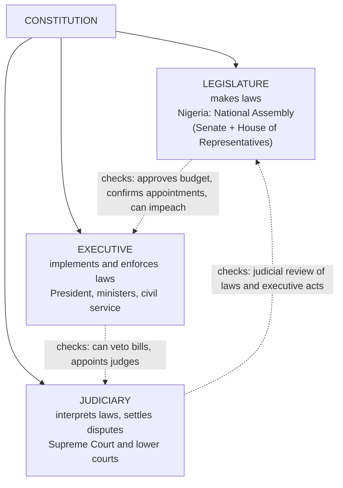

## What Government Is For

A modern state has two primary purposes: **maintaining order** and **promoting citizens' welfare**. The state is abstract; its impact is felt only through its **government**, which works through three kinds of activity:

| Activity | Meaning | Organ |
|---|---|---|
| **Rule making** | Making laws | **Legislature** |
| **Rule application** | Implementing policies, enforcing rules | **Executive** |
| **Rule adjudication** | Interpreting laws, settling disputes | **Judiciary** |

### Three components of government

Government is **the decision-making and enforcing agency of the state that controls the monopoly of the legitimate use of force**. This highlights three components:

1. **Government exists to make and enforce decisions** — society must decide collectively on its goals and the means to reach them (e.g. which economic strategy Nigeria should adopt to reduce poverty, armed robbery and corruption). Government is the **highest and most formal** level at which such decisions are made.
2. **Government is the ultimate source of coercion** — collective decisions must be enforced, so some agency must have a **monopoly of force**. Force is not always advisable, but may be unavoidable when people resist collective decisions.
3. **Government's conduct is normally seen as legitimate** — people accept that it is right for government to seek and receive their obedience.

### Why government is indispensable

**Herman Finer** (1956) called government **"man's unending adventure"** — his **heaviest collective and individual burden** and his **supreme hope of liberation from individual feebleness**. It is unending because man is deficient in wisdom, virtue, strength and material resources compared with his expanding capacity to imagine and want; every achievement reveals new horizons. A complete act of government **converts the desires or will of some individuals or groups into the behaviour of the rest of society** — on morals (e.g. abortion, divorce), religion, or the economy (monopolies, unemployment). Government thus has two broad parts: **the process of politics** and **the process of administration**.

### The roles of government (Rowe 1969)

| Role | Why government is needed | Example |
|---|---|---|
| **Contract enforcement** | Deals among people who trust each other in a small community need no enforcement, but most deals involve strangers — the temptation to **double-cross** is high | Courts enforcing a building contract |
| **Collective action** | A project would benefit everyone, but no individual is prepared to pay for it. Private actions have public consequences (social costs/benefits); you usually can't exclude people from them; individuals won't keep bearing private costs for social benefit — so social costs rise and benefits fall | Government building roads, running immunisation, fighting pollution |
| **Social well-being (welfare)** | To make society better it may be necessary to help some groups **at the expense of others** (e.g. the poor at the expense of the rich); the rich resist redistribution, so it needs **legitimate coercion** | Progressive taxation, social safety nets |

---

## How Governments Are Formed

### The democratic method

**Democracy** is **government by the whole population or all eligible members of a state, typically through elected representatives**. Democratic elections rest on these **principles**:

| | | |
|---|---|---|
| 1. Citizen (popular) participation | 6. Free and fair elections | 11. Neutrality of state institutions |
| 2. Political equality | 7. Separation of powers | 12. Popular sovereignty |
| 3. Political tolerance | 8. Respect for human rights | 13. Secret ballot |
| 4. Accountability and transparency | 9. Rule of law | |
| 5. Political competition | 10. Periodic elections | |

**Procedure for establishing a democratic government:**

1. **Delimitation** of constituencies
2. **Registration of voters**
3. **Registration of political parties** and **nomination of candidates**
4. **Balloting** (secret or open)
5. **Counting** of votes and **declaration** of results
6. **Litigation** — legal settlement of electoral disputes by those who feel cheated
7. **Swearing-in** of winners
8. **Formation of the cabinet** according to the constitution

### Non-democratic methods

| Method | Meaning | Examples |
|---|---|---|
| **Imperialistic mode** | Imperial powers set up quasi-governments in territories they control — **colonial** government | All governments in Nigeria **before independence**: governors appointed by Britain, with powerless advisory councils |
| **Military coup (coup d'état)** | The armed forces seize power **"through the barrel of the gun"** — the fastest, shortest route to power but the most destructive. Triggered by poor leadership, societal violence, corruption, military ambition. **Always illegal**, because it suspends the constitution that created the armed forces | Thailand 2014; Burkina Faso 2015; Central African Republic 2013; Egypt 2013; Mali 2012; Guinea-Bissau 2012 — and, more recently, Mali 2020–21, Guinea 2021, Burkina Faso 2022, Niger 2023, Gabon 2023 |
| **Election rigging** | Falsifying or manipulating the selection of leaders — an incumbent "helps" a favoured party into power | The **1965 Western Region election (NNDP)** and the **1983 national election (NPN)** in Nigeria |

---

## The Organs of Government

Whatever the system, government is divided into **three branches (organs)**: the **legislature**, the **executive** and the **judiciary**. Countries such as the **United States** and **Nigeria** separate them to **prevent abuse of power**.



**Separation of powers** *(the doctrine associated with **Montesquieu**, 1748)*: the three functions are given to **separate organs with separate personnel**, so that no one person or body holds all power. **Checks and balances** let each organ limit the others. Presidential systems (USA, Nigeria) apply it strictly; parliamentary systems **fuse** the executive and legislature.

### The executive

The **executive** implements or carries out the policies, laws and decisions of government within the constitution. It includes the **head of government** (President in Nigeria and the USA), the **ministers**, and the whole body of administrative officials — the **civil service**.

- The **President and cabinet ministers** are the **temporary (political) executive**; the **civil servants** are the **permanent executive**.
- It is the most visible and indispensable arm: **even under military rule**, when the legislature disappears, the executive remains (the junta leader becomes Head of State and Commander-in-Chief).
- Functions: **general administration** and **law enforcement**, **external relations and defence**, a role in **legislation**, **control of the purse**, and the **prerogative of mercy** (reprieves and pardons).
- Two main forms: **parliamentary (cabinet)** — head of state and head of government are separate (Britain); **presidential** — separates the chief executive from the legislature.

### The legislature

The **legislature** makes laws and formulates policy. It is called **Parliament** in Britain, **Congress** in the USA, the **Diet** in Japan and the **National Assembly** in Nigeria. For **Garner**, the legislature "unquestionably occupies the paramount place" among the organs — it controls **supply** (money), creates public offices and new services, and **amends or abolishes** laws. Yet it is the arm **most vulnerable to political instability** (it is the first casualty of a coup). Most legislatures follow the **Westminster (British)** or **American** model.

| | Unicameral (one chamber) | Bicameral (two chambers) |
|---|---|---|
| **Common in** | Unitary, centralised states | Federal states and many democracies |
| **Examples** | Uganda, Costa Rica, Portugal, Sweden | **Nigeria** (Senate + House of Representatives), **Britain** (House of Lords + House of Commons), **USA** (Senate + House of Representatives) |
| **Advantages** | Quick, cheaper, can meet emergencies | Checks and balances, thoroughness, more informed input; the second chamber checks hasty laws |
| **Disadvantages** | Hasty legislation, easier to manipulate | More expensive, may delay bills |

Functions of the legislature: **law making** and **deliberation**; **legitimising policies** and turning political decisions into law; **representing** the people and **conveying their views** to the executive; **influencing and checking** the executive; **financial** control (budget); a forum for **national debate**; and some **judicial** functions (impeachment). In Nigeria and the USA the **upper chamber (Senate)** alone **screens and confirms** appointments of ministers, ambassadors, the Attorney-General and senior judges.

### The judiciary

The **judiciary** is the **system of courts that interprets and administers the law** and resolves disputes. It does not make or enforce laws but **applies the law to the facts of each case**, ensuring **equal justice**. It usually consists of a **court of final appeal (Supreme Court)** and lower courts, and is often called **the last hope of the common man** — and the **least dangerous** branch.

- **Judicial review**: courts can **annul laws and executive acts** that conflict with a higher norm — the constitution, primary legislation or international law.
- **Independence of the judiciary** is vital. Safeguards include **security of tenure**, appointment of **competent judges**, respect for the **rule of law**, and paying judges' salaries from the **Consolidated Revenue Fund** (so the executive cannot starve them).

---

## Classifying Forms of Government

Plato, **Aristotle**, and the Romans **Polybius** and **Cicero** all proposed classifications. The main criteria:

| Criterion | Forms |
|---|---|
| **Size of the ruling class and public involvement** | Monarchy, Aristocracy, Polity (good); Tyranny, Oligarchy, Democracy/Mobocracy (perverted) |
| **Distribution of power** | Unitary, Federal, Confederal |
| **Relationship among the organs** | Presidential, Parliamentary (cabinet), Dual executive (mixed) |
| **State ideology** | Capitalism, Socialism, Communism |
| **Elite behaviour and social structure** (Lijphart) | Consociational, centripetal, centrifugal, depoliticised democracy |
| **Other** | Fascism, Feudalism, Theocracy, Totalitarianism, Colonialism, Militarism |

### Aristotle's six forms

The earliest and most famous typology (4th century BC, in ***The Politics***) — it lasted nearly **twenty-five centuries**. Two questions: **who rules** (one, few, many)? and **in whose interest** (all, or themselves)?

| Who rules | Legitimate (in the interest of all) | Corrupt (in the rulers' own interest) |
|---|---|---|
| **One** | **Monarchy** | **Tyranny** |
| **A few** | **Aristocracy** | **Oligarchy** |
| **Many** | **Polity** | **Democracy** |

- **Monarchy** — rule by one (king or queen) in the interest of all; **absolute** or **constitutional (limited)** monarchy (Jordan, England, Morocco, most traditional African societies). It degenerates into **tyranny** — one ruler for his own benefit (Idi Amin, Sani Abacha, Mobutu Sese Seko, Muammar Gaddafi).
- **Aristocracy** — from Greek *aristos*, "**government of the best**": several people ruling for all (in practice the wealthy using their wealth for the common good). Degenerates into **oligarchy** — a privileged few ruling selfishly.
- **Polity** — **constitutional democracy**: the rule of many in the interest of all, with constitutional protection of rights — Aristotle's **best** form. It degenerates into **democracy**, which Aristotle defined as the many ruling in their own interest — the **worst** form.

Today **democracy** is the most desirable form of government — its meaning has changed since Aristotle. Hence **Akindele et al.** (1998) list **Monarchy, Aristocracy and Democracy** as legitimate, and **Tyranny, Oligarchy and Mobocracy** as the corrupt forms. **Mobocracy** is **rule by the mob** — violence, disorder and hooliganism, which can break out even in democracies during crisis and insurgency.

### Unitary, federal and confederal

| | Unitary | Federal | Confederal |
|---|---|---|---|
| **Where power lies** | All legislative and executive authority in **one central government** | **Constitutionally divided** between central and regional governments, each **independent and coordinate** in its sphere | Most power stays with **member states**, which keep their **sovereignty**; a **weak centre** handles a few common matters (defence, external relations) |
| **Sub-units** | Merely **deconcentrated** administrative units — no constitutional powers, no taxing power, exist **at the mercy of the centre** | States/regions with their own constitutionally guaranteed powers | Sovereign states in a **league** |
| **Why adopted** | **Homogeneous** population, **small** territory, willingness to set aside differences | **Fear of insecurity**, **heterogeneous** population, **geographical contiguity**, **common colonial heritage**, even development, common defence | Cooperation (social, political, economic) while keeping maximum autonomy |
| **Weakness** | Can ignore local needs | Can drift into **over-centralisation** | **Unstable, weak, prone to secession** |
| **Examples** | Ghana, Britain, France, Kenya | **Nigeria** (federal government, **36 states**, **774 local governments** and the **FCT**), USA, Brazil, India, Germany | The 13 American states under the **Articles of Confederation (1781–1789)**; the **German Confederation (1815–1866)** |

**K. C. Wheare** (1953) defined federalism as **a constitutional division of power between two levels of government such that each is independent and coordinate** — the **federal principle**. The key difference: a **confederation is a league of sovereign states**, whereas **federation creates a new state** to which the units surrender sovereignty. (The textbook also cites Canada's **1867** "Confederation" — despite the name, it created a federal state.)

<SortingGame title="Unitary, federal or confederal?">

```sort
@buckets Unitary | Federal | Confederal
Regions exist at the mercy of the central government and have no taxing powers => Unitary :: Sub-units in a unitary state are only deconcentrated administrative units.
Nigeria's arrangement of a federal government, 36 states and 774 local governments => Federal :: Powers are divided by the constitution between levels of government.
Member states keep their sovereignty and can easily walk away => Confederal :: A confederation is a league of sovereign states with a weak centre — prone to secession.
Adopted by a small country with a homogeneous population => Unitary :: Homogeneity and small size favour a unitary system.
Each level of government is independent and coordinate in its own sphere (Wheare) => Federal :: This is Wheare's federal principle.
The American states under the Articles of Confederation, 1781–1789 => Confederal :: The Articles created a loose league, replaced by the federal constitution in 1789.
Britain and France => Unitary :: Both concentrate supreme legislative authority in one central government.
```

</SortingGame>

### Presidential, parliamentary and dual executive

| | Presidential | Parliamentary (cabinet, "Westminster") | Dual executive (mixed) |
|---|---|---|---|
| **Heads** | President is **both head of state and head of government** | **Ceremonial head of state** (monarch, president or governor-general) + **Prime Minister** as real head of government | An elected **President** with considerable powers **and** a **Prime Minister** responsible to parliament |
| **Relationship to legislature** | **Separation of powers**; president elected for a fixed term (directly — Nigeria's 2nd and 4th Republics — or via an **electoral college** — USA) | **Fusion of powers**: PM and cabinet come from parliament; **collective responsibility** to parliament | Combines US and British elements |
| **Powers** | Chief executive, Commander-in-Chief; makes treaties and appoints ambassadors, judges and others **with legislative consent** | PM chooses, chairs, disciplines and can dismiss ministers | President appoints the PM, commands the armed forces, chairs cabinet and defence council, negotiates treaties, can dissolve the Assembly; PM runs day-to-day government |
| **Examples** | USA, Nigeria (1979–83 and since 1999), Ghana, Côte d'Ivoire, Belarus | Britain ("mother of parliaments"), Japan, the Netherlands, Israel, **Nigeria under the 1960 and 1963 constitutions** | **France** (also Finland, Portugal, Sri Lanka, Lebanon, Morocco in different versions) |

*Note:* the textbook describes the French President as chosen by an electoral college for seven years — that was the original 1958 arrangement. Since **1962** the French President has been **directly elected**, and since **2002** the term is **five years**. France adopted the dual executive after a history of **political instability**, to create a **strong executive** and more stability.

### Ideology: capitalism, socialism, communism

| | Capitalism | Socialism | Communism |
|---|---|---|---|
| **Ownership** | **Private individuals and firms** own the means of production, distribution and exchange; prices and markets coordinate the economy | Essential industries and services **publicly/collectively owned** and democratically controlled for **equal opportunity and benefit** | The **community as a whole** (in practice the state under an elite party) owns property and controls production, labour and distribution — and largely social and cultural life |
| **Politics** | Promotes **liberty** and **multi-party democracy** | Modern (democratic) socialism: reform through **parliament and evolution**, not revolution | Overthrow of capitalism by **workers' revolution**; in theory a **classless society** of abundance, in practice **coercive, authoritarian** regimes |
| **History** | European origins, peak in the **19th century**, spread from England; dominant until the **Russian Revolution of 1917** produced a rival system | Late 19th-century socialist movement revised Marx | **Karl Marx and Friedrich Engels**; **Lenin** led the Soviet state after **1917**; the USSR collapsed in **1991** |
| **Examples** | USA, Canada, Germany, Japan (no pure case; **Britain** as a welfare state is midway between capitalism and socialism) | Former USSR (1917), Albania (1944), North Korea (1948), China (1949), Cuba (1959), Cambodia and Laos (1975); remnants in Cuba, Vietnam, Tanzania | Soviet Union and its allies; **neo-communist** parties in several post-Soviet states |

Communism is described as an **advanced stage of socialism**. Most democratic socialists denied that the Soviet Union achieved socialism, calling it an **authoritarian tyranny**.

### Lijphart: elite behaviour and social structure

**Arend Lijphart** classified democracies by two features: whether **elites cooperate (coalescent)** or **compete (adversarial)**, and whether society is **homogeneous** or **heterogeneous** (divided by ethnicity, religion, language):

| | Homogeneous society | Heterogeneous (plural) society |
|---|---|---|
| **Coalescent elites** | **Depoliticised** democracy — agreement on basics | **Consociational** democracy — leaders of different groups share power (grand coalitions, proportionality): Switzerland, Belgium, the Netherlands |
| **Adversarial elites** | **Centripetal** democracy — competition that pulls towards the centre: Britain, the USA | **Centrifugal** democracy — groups pull power towards themselves; unstable |

### Other forms of government

| Form | Meaning | Examples |
|---|---|---|
| **Fascism** | Dictatorial rule, central control of private enterprise, **repression of opposition, terror**, **extreme nationalism**; the ruler dominates all social forces yet mobilises the masses | Italy under **Mussolini (from 1922)**, Germany under **Hitler (from 1933)**, Argentina (1943) |
| **Feudalism** | Political power derived from **control over land** (land tenure) | Western European nobility in the High Middle Ages |
| **Theocracy** | Greek *theokratia*, "**government by a god**": God is sole sovereign, laws are divine commands, the **clergy** rule | Calvin's Geneva, Cromwell's attempts, the **caliphate**, **Ayatollah Khomeini's Iran** |
| **Totalitarianism** | All social, political, economic, intellectual, cultural and spiritual life **subordinated to the rulers**; a higher form of despotism — a **dictator** controlling a party | Hitler's Germany, **Stalin's USSR**, **Mao's China**, Kim Il Sung's North Korea, Hafez al-Assad's Syria, Saddam Hussein's Iraq |
| **Colonialism** | One country assumes **political control** over another, usually by military force | Most of Africa before independence. Countries commonly cited as never colonised: **Ethiopia** and **Liberia** (the textbook also lists Egypt, though it was under British control 1882–1922) |
| **Militarism** | Rule by the **armed forces**, deriving power from **the barrel of the gun**; governs by **decrees and edicts** | Nigeria's military regimes (below) |

**Military rule in Nigeria** began after the coup of **15 January 1966**, which overthrew the **Tafawa Balewa** government; Major-General **Aguiyi-Ironsi** became Head of State. Later regimes:

| Head of State | Period |
|---|---|
| Yakubu **Gowon** | July 1966 – July 1975 |
| Murtala **Mohammed** | July 1975 – 13 February 1976 |
| Olusegun **Obasanjo** | February 1976 – 1 October 1979 |
| Muhammadu **Buhari** | 31 December 1983 – 27 August 1985 |
| Ibrahim **Babangida** | August 1985 – August 1993 |
| Sani **Abacha** | November 1993 – 8 June 1998 |
| Abdulsalami **Abubakar** | June 1998 – 29 May 1999 |

**Nigeria today** combines several classifications: a **federal, capitalist, presidential, democratic** system. Most real countries mix forms; several (aristocracy, oligarchy, feudalism, polity, theocracy, colonialism) matter today mainly for understanding the typology.

---

## Practice Questions

<MCQ question="In Aristotle's classification, the corrupt form of aristocracy is…">
<Option>Tyranny</Option>
<Option correct>Oligarchy</Option>
<Option>Democracy</Option>
<Option>Mobocracy</Option>
<Explain>Aristocracy (rule of the best few for all) degenerates into oligarchy (rule of a few for themselves). Monarchy becomes tyranny; polity becomes democracy.</Explain>
</MCQ>

<MCQ question="Which organ of government is regarded as the 'last hope of the common man'?">
<Option>The executive</Option>
<Option>The legislature</Option>
<Option correct>The judiciary</Option>
<Option>The civil service</Option>
<Explain>The courts interpret the law and settle disputes, including disputes against the government, so the judiciary is seen as the last hope of the common man.</Explain>
</MCQ>

<MCQ question="Collective responsibility and fusion of powers are features of the…">
<Option>presidential system</Option>
<Option correct>parliamentary (cabinet) system</Option>
<Option>confederal system</Option>
<Option>military system</Option>
<Explain>In a parliamentary system the cabinet comes from parliament (fusion) and is collectively responsible to it.</Explain>
</MCQ>

<MCQ question="Who defined federalism as a division of power between two levels of government that are independent and coordinate?">
<Option>Garner</Option>
<Option>Finer</Option>
<Option correct>K. C. Wheare</Option>
<Option>Lijphart</Option>
<Explain>Wheare (1953) called this the federal principle.</Explain>
</MCQ>

<Reveal question="1. Explain the three roles of government identified by Rowe.">
**Contract enforcement** — most deals involve strangers, so the temptation to cheat is high and courts must enforce contracts. **Collective action** — projects benefiting everyone (roads, clean air) won't be provided voluntarily because individuals won't bear private costs for social benefits, so government encourages, supports or provides them. **Social welfare** — improving society may require redistributing from some (the rich) to others (the poor), which the privileged resist, so it needs government's legitimate coercion.
</Reveal>

<Reveal question="2. Outline the procedure for establishing a democratic government.">
Delimitation of constituencies; registration of voters; registration of parties and nomination of candidates; balloting (secret or open); counting and declaration of results; litigation to settle disputes; swearing-in of winners; formation of the cabinet according to the constitution.
</Reveal>

<Reveal question="3. Compare unicameral and bicameral legislatures with examples.">
A unicameral legislature has one chamber (Uganda, Sweden, Portugal, Costa Rica) — quick, cheaper and able to meet emergencies, but prone to hasty legislation and manipulation. A bicameral legislature has two chambers (Nigeria: Senate and House of Representatives; Britain: Lords and Commons; USA: Senate and House) — more expensive and slower, but allows checks and balances, thoroughness and better-informed law making.
</Reveal>

<Reveal question="4. Distinguish between federalism and confederalism.">
Both unite states under a common authority for some matters, but a confederation is a league of sovereign states that keep their sovereignty (weak centre, unstable, prone to secession — e.g. the USA under the Articles of Confederation 1781–89), whereas a federation creates a new state to which the units surrender sovereignty, with powers constitutionally divided between independent and coordinate levels of government (Nigeria, USA, India).
</Reveal>

<Reveal question="5. State five safeguards of judicial independence.">
Security of tenure; appointment of competent judges through an independent process; payment of judges' salaries from the Consolidated Revenue Fund; respect for the rule of law; immunity for judicial acts and adequate remuneration; separation of the judiciary from the executive.
</Reveal>

<Takeaway>
- Government = decision-making and enforcing agency with the **monopoly of legitimate force**: makes and enforces decisions, is the ultimate source of coercion, and is seen as legitimate. Finer: "man's unending adventure".
- Roles (Rowe): **contract enforcement, collective action, social welfare**.
- Formation: **democratic** (principles and an 8-step procedure) vs **non-democratic** (imperialism/colonialism, **coups**, **election rigging** — 1965 NNDP, 1983 NPN).
- Organs: **legislature** (makes laws; unicameral/bicameral), **executive** (implements; temporary vs permanent), **judiciary** (interprets; judicial review; independence). **Separation of powers** and **checks and balances**.
- Classifications: **Aristotle** (monarchy/tyranny, aristocracy/oligarchy, polity/democracy); **unitary/federal/confederal** (Wheare's federal principle; Nigeria: FG, 36 states, 774 LGAs, FCT); **presidential/parliamentary/dual executive**; **capitalism/socialism/communism**; **Lijphart**; fascism, feudalism, theocracy, totalitarianism, colonialism, militarism.
- Nigeria today: **federal, capitalist, presidential democracy**.
</Takeaway>

## Exam Tips

- Draw **Aristotle's table** from memory (one/few/many × good/corrupt) — it answers several MCQs at once.
- For unitary vs federal vs confederal, give the **location of sovereignty**, a **reason for adoption** and an **example** for each.
- Presidential vs parliamentary is a classic compare-and-contrast: heads of state/government, separation vs fusion, fixed term vs confidence of parliament, examples.
- Learn Nigeria's facts: **36 states, 774 LGAs, FCT**; the military rulers in order; the 1965 and 1983 rigged elections.
