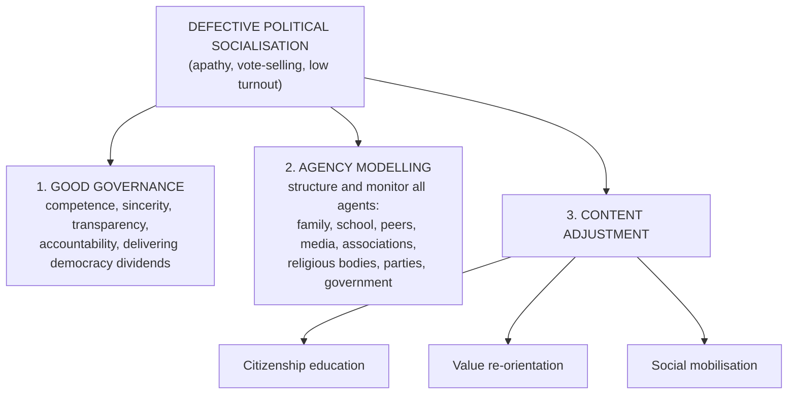

## Socialisation and Political Socialisation

**Socialisation** is the process by which an individual **learns to adjust to a group (or society) and behave in a manner the group approves**. It covers **the whole process of learning throughout the life course**, shaping the behaviour, beliefs and actions of adults as well as children.

**Political socialisation** is the **deliberate inculcation of political information, values and practices by instructional agents** formally or informally given that responsibility. In the words of **Almond and Powell** (1992), it includes:

> "all political learning, formal and informal, deliberate and unplanned, at every stage of the developmental cycle, including not only explicitly political learning but also nominally non-political learning that affects political behaviour, such as the learning of politically relevant social attitudes and the acquisition of politically relevant personality characteristics."

**The basic hypothesis:** *no political system can attain or remain in a condition of integration unless it develops among its members a body of **shared political knowledge** and a set of **shared political values and attitudes**.* Political socialisation is therefore **a means of building political cohesion**.

### Its content: political culture

The object of political socialisation is the **political culture**. **Gabriel Almond** (Almond and Coleman 1960) called it **"the process of induction into the political culture"** — its end product is a set of attitudes, cognitions, value standards and feelings towards the political system, its roles and role holders, and towards the **inputs** (demands and claims) and **outputs** (authoritative decisions) of the system.

Political actions depend both on the **objective situation** and on **predispositions** acquired through experience: political goals, expectations about the **rules of the game**, ideas of **legitimacy**, **group loyalties**, assumptions about human nature and **orientations towards authority**. The whole cycle of personality development from childhood to adulthood falls within political socialisation: the child's **image of government**, acquisition of **regime norms**, discovery of **nationality**, **democratic orientations**, **political vocabulary and ideology**, and **elite socialisation or re-socialisation**. To shape the child's image of government, states monitor the transmission of values from parent to child, family communication, the **civics curriculum**, the **mass media**, and encourage participation in school and club democracy.

### Five utilities of political socialisation (Dennis 1973)

1. **Stress absorber** — reduces stress on the essential variables of the system so it can keep allocating values authoritatively.
2. **Output side** — assures the system that its **decisions are acceptable and binding** on citizens.
3. **Input side** — **streamlines the volume and variety of demands**, preventing the communication network from being overloaded to the point of collapse.
4. **Role preparation** — prepares members for the roles that **convert inputs into binding outputs**.
5. **Support** — generates at least a **minimal level of positive support** for the basic political objects without which no system could operate.

It is thus **a tool for national acculturation** by responsible governments.

### Two kinds of political learning

| Politically relevant personality development | Specifically political learning |
|---|---|
| Basic dispositions, beliefs and attitudes that affect political behaviour | Learning for the **citizen role** (party attachment, ideology, motivation to participate) |
| | Learning for the **subject role** (national loyalty, orientation to authority, legitimacy of institutions) |
| | Learning for **specialised roles** (bureaucrat, party official, legislator) |

**Civic training** becomes a deliberate government policy when **instability** threatens — e.g. the **United States** attaches great importance to civic training in schools, and **Russia** treats character training, child-rearing practices and political education as state responsibilities.

---

## Agencies of Political Socialisation

| Agency | How it socialises |
|---|---|
| **Parents / family** | The **primary** agency, especially in childhood. The child forms its **first cognitive map** of the world, imitates the family, absorbs its traits and **moral values**, which later shape political attitudes |
| **School** | **Direct and formal** political learning — subjects such as **Government and Civics**, plus debates, class leadership, student associations and unionism. Governments decide what is taught |
| **Peer group** | People of similar **age, income or status** and interests — friends, colleagues, neighbours, clubs; frequent exchanges of ideas shape views of the world |
| **Mass media and social media** | Print and electronic media (newspapers, magazines, radio, TV) and the **internet**; provide information and enlightenment for opinions — which is why governments try to influence what they disseminate |
| **Voluntary associations and interest groups** | **Boys' Brigade, Girl Guides, Boy Scouts, Red Cross** build civic responsibility; interest groups, professional associations and **political parties** teach adults about the political process |
| Also | **Religious organisations**, **government institutions** and every other contact from childhood to adulthood |

<SortingGame title="Which agency of socialisation is at work?">

```sort
@buckets Family | School | Peer group | Mass/social media | Voluntary association
A child hears her parents discuss the elections at dinner and adopts their party preference => Family :: Parents give the child its first political map — the primary agency.
Students learn the three arms of government in a Civic Education class => School :: Formal, direct political learning happens at school.
A student votes for the same candidate as his hostel friends => Peer group :: People of similar age and status influence each other's views.
A viral video about a bill spreads on X (Twitter) and people form opinions on it => Mass/social media :: The media inform and enlighten, shaping public opinion.
A Boys' Scout learns community service and civic duty => Voluntary association :: Associations like the Scouts, Guides and Red Cross build civic responsibility.
A pupil campaigns to become class captain and learns about elections => School :: Class leadership and student unionism are political training.
```

</SortingGame>

---

## Political Participation

People **participate** in politics through organised activities in familiar structures — **political parties, elections, legislatures, executives and bureaucracies**. Participation is a function of political socialisation and describes the **relationship between state and society**: how groups organise to pursue their interests, how citizens get involved and represented, how they influence policy, and how people are recruited into political structures and for how long.

### Avenues and channels of participation

**1. Elections** — the **foremost** avenue: formal decision-making by which citizens **choose individuals for public office** (mostly executive and legislative). Not everyone may vote: besides a **minimum age**, many countries exclude **foreigners** and the **mentally incompetent**, despite **universal adult suffrage**. How free and fair an election is directly affects participation.

**2. Political parties** — organisations that seek to **influence government policy by nominating candidates and trying to seat them in office**; usually registered and regulated by the state. Their activities: campaigns, educational outreach, offering an alternative voice, protest, promoting an **ideology** and forming coalitions. The **electoral system** (simple plurality or proportional representation) shapes the **party system**: **non-partisan** (very rare), **single-party** (giving way) or **multiparty**.

**3. Legislative representation** — citizens' direct, regular voice in governance. The executive usually dominates policy, but modern legislatures increasingly assert themselves as a **co-equal branch**: passing laws, **approving budgets** and **scrutinising administration**.

- In bicameral federal systems (**Nigeria, USA**), the **House of Representatives** is elected **by population** (roughly **500,000–700,000** constituents per member across countries) and the **Senate** by **equal representation of each state**.
- **Britain**: the elected **House of Commons** and the **unelected House of Lords** — **hereditary peers** (duke, marquess, earl, viscount, baron), the **Archbishops of Canterbury and York** and **24 other senior bishops**, **life peers** (appointed by the Crown on the Prime Minister's advice) and formerly the **Law Lords**. Participation thus reflects both ordinary citizens and the medieval class system.

**4. Interest and pressure groups** — organised associations of people with **shared concerns** who try to influence public policy for themselves or their causes, by **lobbying** and bringing **pressure** on policy makers. Five broad categories:

| Category | Examples |
|---|---|
| **Economic interests** | Manufacturers' associations, the **labour congress**, trade unions, **farmers' associations**, professional groups |
| **Cause groups** | Religious organisations, veterans' groups, people with disabilities, anti-HIV/AIDS and anti-abortion campaigners |
| **Public interests** | Human rights groups, consumer protection, environmental protection, the **Red Cross**, **Amnesty International** |
| **Private and public institutional interests** | Private and public universities, **students' union** bodies, the press, the **African Union**, **European Union**, **United Nations** |
| **Non-associational groups and interests** | Government departments, agencies and corporations, **the military** |

<SortingGame title="Which kind of interest group?">

```sort
@buckets Economic interest | Cause group | Public interest | Institutional interest | Non-associational
Nigeria Labour Congress => Economic interest :: Trade unions and labour congresses defend members' economic interests.
Amnesty International => Public interest :: It campaigns for human rights for everyone, not a narrow membership.
An anti-abortion campaign group => Cause group :: Cause groups promote a particular cause or belief.
The students' union of a university => Institutional interest :: Institutional interests include universities and students' union bodies.
The Nigerian military pressing for a bigger defence budget => Non-associational :: Government agencies and the military are non-associational interests.
All Farmers Association of Nigeria => Economic interest :: Farmers' associations are economic interest groups.
An environmental protection group fighting oil pollution in the Delta => Public interest :: Environmental protection benefits the general public.
```

</SortingGame>

**5. Public opinion and public protests** — the **collection of attitudes, beliefs, views and behaviours** held and expressed by adults on public issues at a time. When organised and measured, they influence policy and drive corrections needed for peace, stability and development. **Opinion** is expressed mainly through the **media**; **protests** are mostly organised by interest and pressure groups — both are extensions of pressure-group activity.

**6. Public bureaucracy** — civil servants participate **directly** in the political system. The **top civil servants** — an elite corps of trained experts who move between ministries and "watch governments come and go" — become influential policy makers. Though supposed to be **neutral**, bureaucracies absorb dominant ideologies, tend to be **conservative** and have institutional interests. The **theory of representative bureaucracy** holds that a public workforce **representative of the population** (indigeneity, ethnicity, race, sex) ensures all groups' interests are considered, because bureaucrats tend to reflect the views of those who share their background (Krislov 2012).

---

## Voting: The Most Visible Indicator

**Voter participation** is the most visible indicator of a country's level of political socialisation and participation. Elections **strengthen legitimacy**; democracy has a **natural correction process** — dissatisfied majorities can replace rulers at the next election (Merkl 1988). Elections cannot be called **popular** if most of the **voting-age population** stays away.

Two figures matter:

- turnout as a **percentage of registered voters**, and
- turnout as a **percentage of the voting-age population (VAP)** (adults counted by the census/estimates — registered or not).

| Nigerian election | Turnout of registered voters | Turnout of voting-age population |
|---|---|---|
| **1979** (military → civilian) | 35.25% | 44.83% |
| **1983** (civilian → civilian; ended by the coup of December 1983) | 38.94% | 58.23% |
| **1999** (military → civilian) | 52.26% | 57.36% |
| **2003** | 69.08% | 65.33% |
| **2007** | 57.49% | 49.65% |
| **2011** | 53.68% | 48.32% |

*(Where turnout of VAP is higher than turnout of registered voters, more people were on the register than the adult population estimate — a sign of an inflated register.)* The **1992/93** transition collapsed when the **Babangida** regime **annulled the June 1993 presidential election**, presumed won by **Chief M. K. O. Abiola**.

**Average turnout** over the five elections up to 2016 (International IDEA 2017, as given in the textbook): **Nigeria 58.13%**, **Ghana 74.98%**, **South Africa 82.54%**, **France 80.93%**, **USA 80.04%** — voting participation in Nigeria is **relatively low**. The trend has continued since the textbook was written *(INEC figures, beyond the textbook)*:

<ChartBuilder title="Presidential election turnout in Nigeria (% of registered voters)">

```chart
@type line
@title Turnout of registered voters, Nigeria
@x Election year
@y Turnout (%)
Year | Turnout (%)
1979 | 35.25
1983 | 38.94
1999 | 52.26
2003 | 69.08
2007 | 57.49
2011 | 53.68
2015 | 43.65
2019 | 34.75
2023 | 26.72
```

</ChartBuilder>

### Why Nigerians stay away: political apathy

**Voter apathy** may now be the most prominent threat to Nigeria's democracy. **Ejue and Ekanem** (2011) trace it to three issues:

1. Most Nigerians **do not fully understand or appreciate the importance of elections**.
2. The voting-age population **does not know its rights** as the **source of power** and the fundamental decision makers.
3. **Voters' rights are not well protected** by government.

These stem from **flaws in political socialisation**, **mass illiteracy** and **bad governance**:

- **Illiteracy** — about **35%** of an estimated **200 million** people; Nigeria is among the **E-9** countries with the highest numbers of illiterates (**Bangladesh, Brazil, China, Egypt, India, Indonesia, Mexico, Nigeria, Pakistan**), which together account for more than half of the world's illiterates — some **60–100 million** Nigerians.
- **Bad governance** — failure to turn oil wealth into human capital, transport, rural infrastructure, health, education and agriculture has created an image of **political fraud**, so citizens see aspirants as not worth their time.

---

## Remedies: Correcting Political Socialisation

Political apathy shows a **defective political socialisation system**, which government should not leave to chance. Three perspectives for **corrective modelling**:



People identify strongly with their national system only when it **works in a distinctive and gratifying way** — so rulers must show **competence, sincerity, dedication, fiscal transparency, accountability and effectiveness**.

### 1. Citizenship education

Democracy can produce bad leaders where voters are **illiterate, uninformed, coerced or brainwashed** into voting for candidates imposed by **godfathers** (Roberts 2006). Many Nigerians vote by **party and ethnicity**, don't know what an **electoral offence** is (hence **underage voting**, **impersonation**) and **sell their votes** for cash and gifts. It is one thing to be a citizen, another to be a **responsible citizen** — aware of constitutional rights and moral responsibilities, informed, considerate, articulate, active in the community.

**Klusmeyer** (1996): people must learn that **"citizenship is the source of all governmental authority and the basis of all power"**, the link between individuals and their democratic community, carrying **responsibilities** without which "democracy becomes fundamentally disabled".

Citizens need practical **participatory skills** and **civic dispositions**:

| Participatory skills | Civic dispositions |
|---|---|
| **Interacting** — communication and cooperation in civic life | Civility, honesty, tolerance, sociability, self-restraint, compassion, trust |
| **Monitoring** — tracking the work of leaders and institutions | A sense of duty, loyalty, respect for others' work and dignity, courage |
| **Influencing** — affecting outcomes, e.g. resolving public issues | Political efficacy, capacity for cooperation, concern for the **common good** |

Nigeria's civics curricula lack **"practicals"** for these.

### 2. Value re-orientation

**Values** are the goals people work for — how they choose to use their time, energy and life (Ugwuegbu 2004). Shaped by experience and socialisation, once **internalised** they become standards for action and judgement. A **value system** is a rank-ordering of values. Values are **dynamic** and can change, so when a society realises its behaviour cannot lead to a desirable future it undertakes **national value re-orientation**. Nigeria's attempts:

| Programme | Government | Content |
|---|---|---|
| **Jaji Declaration** (**1977**) | Gen. Olusegun **Obasanjo** | Dream of a disciplined, fair, just and humane African society — **mere rhetoric** |
| **National Ethical Revolution** (**1982**) | Alhaji Shehu **Shagari** | A **Ministry of National Guidance** against the breakdown of ethics and discipline — ended by the **1983 coup** |
| **War Against Indiscipline (WAI)** (**1984**) | Gen. Muhammadu **Buhari** | Five phases: **queue culture, work ethics, nationalism and patriotism, corruption and economic sabotage, environmental sanitation** |
| **National Orientation Movement (NOM)** (**1985**) → **MAMSER** (**1987**) | Gen. Ibrahim **Babangida** | Mass education, value re-orientation and political mobilisation |
| **National Orientation Agency (NOA)** (**1993**) | Succeeded MAMSER | Value re-orientation mandate |
| **NEEDS** (**2004**) | President **Obasanjo** | Re-emphasise **honesty, hard work, selfless service, moral rectitude, patriotism**; faded after 2007 |

**Five national errors** to correct:

1. **Inconsistent assumptions** — WAI assumed discipline was all that was needed; NOM that development depends on citizens' orientation; NOA that values had weakened; NEEDS that re-orientation would resolve the political crisis.
2. **Lack of continuity** — each regime brings its own programme, which dies with it.
3. **No empirical record** of what values Nigerians across ethnic, professional and religious groups actually hold.
4. **No clear ideology** driving the programmes.
5. Re-orientation for the **people** but none for the **state and its institutions** — governments have no corporate vision, mission and value statements, unlike well-run companies.

### 3. Social mobilisation

Citizenship education gives **knowledge**, value re-orientation makes people **internalise virtues**; **social mobilisation** erodes old commitments so people become available for new patterns of behaviour.

- **Okafor** (2003): mobilisation is achieving a goal through **properly articulated group action**.
- **Akeredolu-Ale** (1989): to mobilise anything is to **commit it to productive use** so it contributes maximally to national goals.
- **Edward Shils** (1968): two stages — **(1) withdrawal/disengagement** from old negative settings, habits and commitments; **(2) induction** into stable new patterns of membership, organisation and commitment (mass political activity, new economic relations, national loyalty, civic commitment, new literate leaders).

**MAMSER** — the **Directorate for Social Mobilisation** recommended by Babangida's **Political Bureau**, slogan *"Mass Mobilisation for Self-reliance, Social Justice and Economic Recovery"* — failed because it wrongly assumed there already existed a **national society**, a **national elite** and **national masses**, ignoring **ethnic suspicion, religious rivalry** and competition for power and wealth. The proposed alternative is a **direct marketing / direct advocacy** approach, like NGOs in health and poverty work: segment Nigeria into **problem groups**, design a solution for each, and go out to deliver it person by person (as HIV programmes do with counselling and follow-up).

---

## Practice Questions

<MCQ question="Which is regarded as the primary agency of political socialisation?">
<Option>The school</Option>
<Option correct>The family</Option>
<Option>The mass media</Option>
<Option>Political parties</Option>
<Explain>Parents and family give the child its first cognitive map of the world and basic values, especially in childhood.</Explain>
</MCQ>

<MCQ question="Gabriel Almond described political socialisation as the process of induction into the…">
<Option>political party</Option>
<Option correct>political culture</Option>
<Option>civil service</Option>
<Option>electoral system</Option>
<Explain>Political culture — attitudes, values and feelings towards the political system — is the content of political socialisation.</Explain>
</MCQ>

<MCQ question="Amnesty International and environmental protection groups belong to which category of interest groups?">
<Option>Economic interests</Option>
<Option>Cause groups</Option>
<Option correct>Public interests</Option>
<Option>Non-associational interests</Option>
<Explain>Public interest groups pursue benefits for the public at large — human rights, consumers, the environment.</Explain>
</MCQ>

<MCQ question="The War Against Indiscipline (WAI) was introduced by which regime?">
<Option>Obasanjo (1977)</Option>
<Option>Shagari (1982)</Option>
<Option correct>Buhari (1984)</Option>
<Option>Babangida (1987)</Option>
<Explain>WAI (1984) under Buhari had five phases: queue culture, work ethics, nationalism and patriotism, corruption and economic sabotage, and environmental sanitation.</Explain>
</MCQ>

<Reveal question="1. Define political socialisation and state its basic hypothesis.">
Political socialisation is the deliberate inculcation of political information, values and practices by formal and informal agents — all political learning, formal and informal, at every stage of life (Almond and Powell). Its basic hypothesis: no political system can attain or keep integration unless it develops shared political knowledge, values and attitudes among its members — it is a means of building political cohesion.
</Reveal>

<Reveal question="2. List Dennis's five utilities of political socialisation.">
It acts as a stress absorber; ensures outputs (decisions) are accepted as binding; streamlines the volume and variety of input demands; prepares members for roles converting inputs to outputs; and generates at least minimal positive support for the system.
</Reveal>

<Reveal question="3. Discuss four avenues of political participation.">
Any four: elections (choosing office holders, subject to age and other qualifications); political parties (nominating candidates, campaigns, ideology); legislative representation (Reps by population, Senate by equal state representation); interest and pressure groups (lobbying and pressure); public opinion and protest (via media and organised groups); public bureaucracy (top civil servants as policy makers; representative bureaucracy).
</Reveal>

<Reveal question="4. What causes voter apathy in Nigeria and how can it be corrected?">
Causes: poor understanding of the importance of elections, ignorance of citizens' rights as the source of power, poor protection of voters' rights — rooted in defective socialisation, mass illiteracy and bad governance (image of political fraud). Remedies: good governance; agency modelling of all socialisation agents; content adjustment through citizenship education (skills and dispositions), consistent value re-orientation, and targeted social mobilisation (direct advocacy).
</Reveal>

<Reveal question="5. Explain Edward Shils's two stages of social mobilisation.">
First, withdrawal or disengagement from old, negative settings, habits and commitments; second, induction of the mobilised people into relatively stable new patterns of group membership, organisation and commitment — mass political activity, new economic relations, national loyalty, civic commitment and new literate leaders.
</Reveal>

<Takeaway>
- **Political socialisation** = learning political knowledge, values and practices (Almond & Powell); builds **political cohesion**; its content is **political culture** (Almond: induction into the political culture).
- **Dennis's five utilities**: stress absorber, binding outputs, streamlined inputs, role preparation, minimal support.
- **Agencies**: family (primary), school, peers, mass/social media, voluntary associations and interest groups, parties, religion, government.
- **Participation**: elections, parties, legislative representation, **interest groups** (economic, cause, public, institutional, non-associational), public opinion/protest, public bureaucracy (representative bureaucracy).
- Nigeria's **turnout is low** (average 58.13% vs Ghana 74.98%, South Africa 82.54%) and falling; causes: ignorance of elections and rights, unprotected voter rights, **illiteracy (E-9)**, **bad governance**.
- Remedies: **good governance**, **agency modelling**, **content adjustment** — citizenship education (interacting, monitoring, influencing), **value re-orientation** (Jaji 1977, Ethical Revolution 1982, WAI 1984, NOM 1985, MAMSER 1987, NOA 1993, NEEDS 2004), **social mobilisation** (Shils's two stages).
</Takeaway>

## Exam Tips

- Learn the **dates and owners** of Nigeria's re-orientation programmes — easy MCQ marks.
- Know the **five categories of interest groups** with one example each.
- Be precise about the **two turnout measures** (registered voters vs voting-age population).
- For essay questions on apathy, structure your answer as **causes** (three issues + illiteracy + bad governance) then **remedies** (three perspectives + three content areas).
