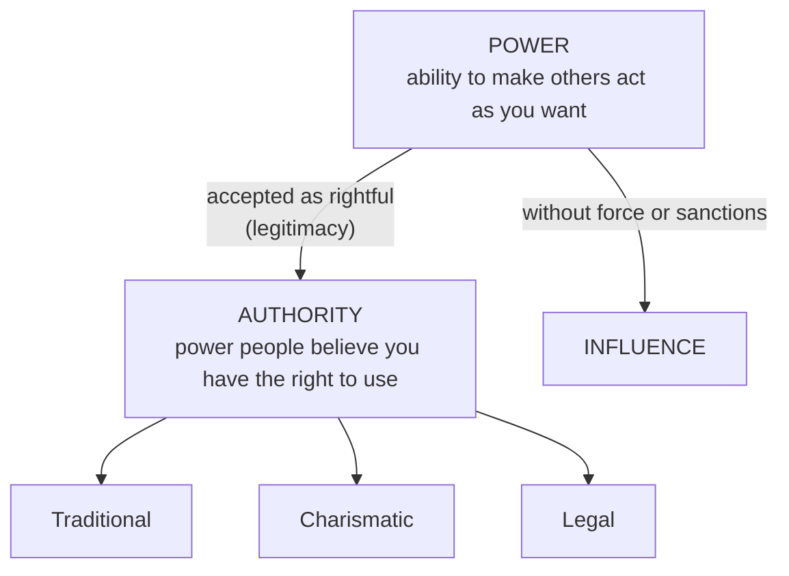

## Political Science and Politics

**Political science** is one of the social science disciplines: the **systematic (scientific) study of man's political behaviour and political relationships**. Its central framework is the **state**, and the state acts through its **government**.

### An old discipline with a young identity

- **Aristotle** (384–322 BC), in his book ***Politics***, called it the **"queen" of the sciences** or the **"master science"** — almost everything happens in a political context, because the decisions of the **polis** (the Greek city-state) governed most other things.
- Until the **19th century** political science had **no separate identity**: it was dominated by **political philosophers, theologians, journalists** — seldom by full-time professional analysts.
- The **first Chair in Political Science** was set up in **Sweden** in the **17th century**, but only in the **last quarter of the 19th century** did political science emerge as an **independent academic discipline**, and by the **turn of the 20th century** most **American** and many **German** universities had chairs and departments of politics, political science or government.

### What is politics?

Politics has **no single, universally accepted definition** — "there are as many definitions of politics as there are works in political science", many of them contradictory.

| Definition | By | Criticism |
|---|---|---|
| "Politics is the **essence of social existence**; two or more men interacting with one another are invariably involved in a political relationship." | **Aristotle** | **Too broad** — it makes every person in society a politician |
| Politics is the determination of **"who gets what, when and how"** | **Harold Lasswell** | Stresses **power** as the main ingredient; also **too broad** — who-gets-what exists in the family, clubs, markets, universities |
| Politics is the **"authoritative allocation of values for a society"** | **David Easton** | **Too abstract** — it does not say what the values are, how they are produced, who allocates them or by what rules |
| Politics is the **organisation and operation of governmental institutions** (making, enforcing and adjudicating law) | Institutional view | **Too narrow and formalistic** — ignores political parties and pressure groups |
| The quest for power, order and justice; the art of influencing, manipulating and controlling others; the resolution of conflict; a struggle among actors pursuing conflicting desires on public issues | Various | Each captures part of politics |

A working definition close to daily experience: politics is **the activities of governmental institutions in a state, together with any aspect of society that directly or indirectly affects how those institutions operate** — e.g. voting and forming pressure groups. Most political scientists agree politics has to do with **power, influence and authority**.

<Analogy>
Lasswell's "who gets what, when and how" is easy to see at the national level — who gets the oil money, which state gets the new university. But it happens in your hostel too: who gets the bottom bunk, when the light goes off, how the room's cleaning is shared. That is exactly why critics call it *too broad*: by this definition every relationship is politics.
</Analogy>

### The state

The **state** is the most important contemporary framework for politics. It is a **territorial organisation exercising a legitimate monopoly of force over a people within a specified geographical boundary**. Every modern state has four characteristics: **population**, **defined territory**, **functional government** and **sovereignty** (explained at the end of this lesson). **Government** is the **administrative apparatus** of the state — it performs the state's duties on its behalf.

### Politicians and political scientists

Political science is **not training to become a politician**. Political scientists carry out **calm, systematic, objective analysis** of politics, which may or may not help working politicians.

| Politicians | Political scientists |
|---|---|
| **Love power** | Are **sceptical** of power |
| Seek **popularity** | Seek **accuracy** |
| Think **practically** | Think **abstractly** |
| Respond to **groups** | Seek the **good of the whole** |
| Seek **name recognition** | Seek **professional prestige** |

So not all political scientists are politicians, and not all politicians are political scientists.

### Billy Dudley's components of politics

In his inaugural lecture ***Scepticism and Political Virtues*** (**1975**), **Billy Dudley** said politics (and so political science) involves:

1. **Consciousness formation** — making a collectivity aware of the issues and problems that confront it.
2. **Social mobilisation** — organising a collectivity for joint, collaborative action.
3. **Contestation** — contesting the determination of national priorities through argument and debate.
4. **Institutional struggle** — "the conversion of fights into games and debates".
5. **Transcendence** — bringing about change at the level of the person and at systemic and sub-systemic levels.

Political science is **the systematic study of these components** — of political life. It asks questions such as *"What reasons justify the actions of government?"* and *"Whose interests are served by government?"*

---

## How the Study of Politics Developed

| Period | Approach |
|---|---|
| **Before 1950** | Dominated by **philosophers, theologians, historians, political commentators and journalists** — **Aristotle, Plato, Thomas Hobbes, Jeremy Bentham, Machiavelli, John Locke**. Focus: the **moral end** of the state and the **formal structure** of government (the constitution, its origin and purpose) |
| **1950s onward** | The **behavioural revolution**, which had swept through **Sociology and Psychology**, reached political science. It shifted attention from the formal structure of the state to **man's political behaviour**, aiming to subject behaviour to **scientific analysis** — the **Scientific Behavioural Approach (SBA)** |

The behavioural approach **widened** political analysis to include people's **social, economic and psychological** behaviour as they relate to politics. Society is a **composite system** whose parts (subsystems) are closely related — to understand one part, you need the others. This **integration of disciplines** is the basis of the **multidisciplinary approach** in political science.

---

## Why Study Politics?

When we argue about the **pump price of petrol**, **scarcity of fertiliser**, **strikes by labour unions**, **illegal immigrants** or **corruption charges against leaders**, we are doing politics. Aristotle wrote that **man is a political animal**, which implies two things:

1. **Politics is the essence of social existence** — unless you live in isolation, you cannot avoid politics (Osaghae 2015).
2. **Everyone is a "politician"** — not only the *conspicuous* politicians in parties and elections, but anyone who discusses politics, votes or attends a parents–teachers meeting hoping to influence a decision. (Those at the core of decision-making are, of course, *more* political than the rest of us.)

**If we do not take an interest and participate in politics, someone else will** — and they will make the decisions that govern our lives. Awareness protects us, since **the ignorant are usually manipulated**. Even if politics seems immoral or corrupt, we should study it — just as a **virologist** studies a virus she dislikes in order to prevent the disease, rather than smashing the slide.

---

## Scope and Levels of Politics

Political scientists study **forms of government, political parties, pressure groups, elections, international relations, public institutions, comparative politics and public administration**, and fundamental **values** such as **equality, freedom, justice and power**.

| Sub-field | Concerned with |
|---|---|
| **Comparative Politics** | Using **comparison** to draw generalisations and valid conclusions — comparing countries, political systems, institutions and governments by specific rules and procedures |
| **International Relations (IR)** | Relations **between countries** — foreign affairs and diplomacy |
| **Public Administration** | **Management of public affairs** — how governments and their institutions are organised and run. (*Public affairs* studies the relationship between the public and major institutions such as government) |
| **Political Theory** | The ideas of political philosophers about how politics **works** and how it **should** work — a tool of analysis |

**Levels of politics.** Aristotle held that politics is **ubiquitous and universal**, from the individual to the inter-state level. Conventionally we distinguish three levels:

| Level | Meaning | Examples |
|---|---|---|
| **State level** | The **most important** level (some say the only one). The state is more or less permanent, has a defined territory and exercises the **monopoly of the legitimate use of force** — it has **compulsory jurisdiction** over all other associations | Activities of the **federal, state and local governments**; legislative, executive and judicial activities |
| **Intra-state level** | Politics **within** associations and groups that form part of the state, and among them | Relations between **governed and governors**, between **arms of government**, between **pressure groups and government**; politics inside a church or university |
| **Inter-state level** | **International politics** — between two or more states (studied by Spykman, Dunn, Goldstein, **Morgenthau**) | Diplomacy, treaties, the **United Nations** |

At the inter-state level **there is no institution with a monopoly of legitimate force** — cooperation is **voluntary**. The **UN** tries to create world order but faces **ideological conflicts, lack of commitment and inability to compel obedience**, because it lacks absolute control over member states. (When a church or university campaigns against a government policy, that is **state** politics, not intra-state politics.)

---

## Power, Influence, Authority and Legitimacy

These four concepts organise the study of politics.

### Power

**A has power over B to the extent that A can get B to do something B would not otherwise have done.** Power is a product of human relationships and takes three forms:

| Form | Meaning | Example |
|---|---|---|
| **Force** | **Physical** manipulation of the subordinate person | Assault, confinement, detention |
| **Domination** | Influence made **explicit** through a **command** or request (*controlling power*) | A soldier ordering a traveller out of a vehicle |
| **Manipulation** | Influencing others **without making explicit** what you want — often through **symbols** | **Propaganda** |

### Influence

A relationship **without sanctions, coercion or physical force** is one of **influence**. Every power relationship involves influence, but influence does **not** involve the force that goes with power.

- **Manifest (explicit) influence** — A's action causes a change in B's behaviour; B anticipates A's wants and complies.
- **Potential (implicit) influence** — indirect or unseen: e.g. the **National Assembly** weighing different groups' interests before passing a law that favours one group — that group had potential influence on the decision.

### Authority

**Authority** is a **superior form of power**: the ability to get people to do things **because they believe the person has the right** to tell them what to do. It derives from approved procedures of the political culture and is linked with **respect**, which creates legitimacy. **Max Weber's** three types of authority:

| Type | Basis | Examples |
|---|---|---|
| **Traditional** | The **sanctity of tradition** — the social order is seen as sacred | Respect for a **monarch or chief** (the Ooni, the Emir) |
| **Charismatic** | Belief in the **extraordinary personal qualities** of a leader, whose obedient people are **followers or disciples** | **Obafemi Awolowo, Indira Gandhi, Adolf Hitler, Kwame Nkrumah, Julius Nyerere, Nelson Mandela** |
| **Legal (rational-legal)** | The **supremacy of law** — everyone subscribes to the constitution, laws and rules | An elected president or governor exercising constitutional powers |

<SortingGame title="Power, influence or which type of authority?">

```sort
@buckets Force | Manipulation | Influence | Traditional authority | Charismatic authority | Legal authority
Soldiers detain a journalist who criticised the government => Force :: Physical confinement is force — the crudest form of power.
A government floods social media with one-sided adverts to win support => Manipulation :: Shaping behaviour through symbols without saying what you want is manipulation (propaganda).
Villagers obey the Oba's ban on farming during a festival => Traditional authority :: The Oba's right to command rests on sacred custom and tradition.
Crowds follow a leader because of his extraordinary personality and vision => Charismatic authority :: Obedience based on personal gifts (charisma) — like Awolowo, Nkrumah or Mandela.
Citizens pay tax because the Finance Act, passed by the National Assembly, requires it => Legal authority :: Obedience to the law because it was made by constitutional procedure.
Farmers' associations persuade lawmakers to include their needs in a bill, with no threats => Influence :: A change in decisions without sanctions or force is influence.
A governor issues an executive order within his constitutional powers => Legal authority :: Power exercised through the constitution is rational-legal authority.
```

</SortingGame>

### Legitimacy

**Legitimacy** is the **belief in and acceptance of a person's or government's right to make authoritative and binding decisions** — the belief in the right to govern and to be governed. **Through legitimacy, power is translated into authority.** When a government is seen as dishonest or "dirty", people feel less obliged to obey it and its legitimacy **erodes**; a government is legitimate when its rules and decisions are **respected and obeyed**. That is why governments usually follow **public opinion**.



---

## The Concept of Government

The **state** is abstract; it acts through its agent, the **government**. The word "government" has **five usages**:

| Usage | Example |
|---|---|
| 1. The **process or art of governing** — exercising control over others | Government policy, government programmes |
| 2. An **institution of the state** | The Nigerian government, the Chinese government |
| 3. The **people charged with governing** | Obama's government, Buhari's government |
| 4. The **manner, method or system** of governing | Presidential, colonial, military government |
| 5. A **discipline or subject of study** | The Department of Government, University of Essex |

In effect, government is at once a set of **activities** (making binding decisions on rules, resources and conflicts), a set of **persons** (holding executive — including the civil service — legislative and judicial offices) and a set of **institutions**: the **legislature makes laws**, the **executive enforces them**, the **judiciary interprets them** and applies them to disputes. None of these meanings stands alone.

### Origin of government

In the **earliest, simplest societies**, with no hierarchy, there was **no need for government**. As society grew more **complex** — some people and groups becoming more powerful, skills and resources becoming concentrated — an arrangement was needed to **preside over common affairs**, and **government emerged**.

- In the **Greek city-states**, all **male citizens took part directly** in government — the origin of **direct democracy**.
- As societies grew bigger, direct participation became impossible; modern democracy is **indirect (representative)** — citizens govern through **elected representatives**.
- Government has become **big business**, serviced by **huge bureaucracies** of permanent, trained staff (administration, banking, medicine, engineering…). As observers say, **"one thing governments do is grow"** — citizens keep demanding more services.

### Government and the state

They are close but **distinct**. A **government can exist without a state** — in stateless societies, and at the intra-state level (e.g. a **Students' Union Government**) — and a **state can survive without a recognised government** for a time (e.g. **Somalia**), as can **governments-in-exile**. But **no state can function effectively without government**.

| State | Government |
|---|---|
| A **territorial association** of people with defined boundaries | An **administrative institution** within the state |
| **More inclusive** — embraces all people and associations in its territory | Only **a part** of the state |
| **Permanent** (a continuing entity) | **Temporary** — lasts for a period |
| Depends on government to carry out its activities | The **machinery** by which the state performs its functions and maintains its existence |
| Elements: **population, territory, government, sovereignty** | Organs: **legislature, executive, judiciary** |

**The basic distinguishing feature of the state (compared with government) is its permanency.**

### The state, government and other associations

1. The **state includes** both the government and other human associations.
2. **Membership of the state is compulsory**; membership of other associations is **voluntary**.
3. The **state is permanent**; government and other associations are not.
4. Government, the state and other associations **depend on each other** to meet people's needs.
5. **State rules bind everyone**; an association's rules bind **only its members**.
6. The **state may use force** to enforce its laws; associations **cannot** enforce their rules by force.
7. The state can **fine, imprison or even pass the death penalty**; associations have no such power.

<SortingGame title="State or government?">

```sort
@buckets State | Government
Permanent — it continues when leaders change => State :: The state is a continuing entity; governments come and go.
Made up of the legislature, executive and judiciary => Government :: These are the organs of government.
Includes every person and association within its borders => State :: The state is more inclusive than government.
Can change after an election or a coup => Government :: Governments are temporary.
Its elements are population, territory, government and sovereignty => State :: These are the elements of the state.
The machinery through which the state's will is carried out => Government :: Government is the state's agent or machinery.
```

</SortingGame>

---

## Theories of the Origin of the State

The origin of the state is "shrouded in mystery" (Johari 2012) — the modern state is the result of a very long evolution. The main theories:

| Theory | Claim | Key points |
|---|---|---|
| **Divine origin (divine right)** | **God** ordained and established the state; rulers are God's **agents or descendants** | The **oldest** theory. Opposing the ruler = opposing God. Found in religious books; meant to maintain order and prevent anarchy |
| **Natural / organic** | The state arises from people's **natural desire to interact** and achieve moral perfection; it **evolves like an organism** | The state is an **organism**, citizens are its **organs**, government is its **brain**. A person outside the state is "either a god or a beast" (Aristotle) |
| **Force** | The state arose from **conquest** — the **strong subjugating the weak**: **"might is right"** | Power rests on physical force; no moral justification; subjects obey for fear of punishment |
| **Genetic (evolutionary)** | The state is an **extension of the family** | **Family → group (tribe/clan) → society → state**. Based on sociological facts; seen by some as the *historical* account. The state as a country is only about **500 years old** (from the **16th century**) |
| **Social contract** | The state is a **human creation**, formed by **agreement (consent)** of people who once lived in a **state of nature** | Thomas **Hobbes** (1588–1679) and John **Locke** (1632–1704) of England, Jean-Jacques **Rousseau** (1712–1778) of France |

### The social contract theorists

- **Thomas Hobbes** (*Leviathan*, 1651): life in the state of nature was **"solitary, poor, nasty, brutish and short"**. The law of nature led people to **surrender all their natural rights** to a man or assembly of men — the all-powerful sovereign, the **Leviathan** (an **absolute** ruler) — in return for peace, liberty, property and the good life of the **commonwealth**.
- **John Locke** *(beyond the textbook's summary)*: people in the state of nature already had natural rights to **life, liberty and property**; they contracted to form a government **only to protect those rights**, so government's power is **limited** and people may resist a government that violates the contract.
- **Jean-Jacques Rousseau** *(beyond the textbook's summary)*: sovereignty belongs to **the people**, expressed through the **general will**; government is only their agent.

---

## The Four Elements of the Modern State

**Population** and **territory** are the state's **physical elements**; **government** and **sovereignty** are its **spiritual elements**.

| Element | Explanation |
|---|---|
| **1. Human population** | The state is a human association: its **citizens** plus **aliens** living within its borders. Neither too large nor too small, so people can live in peace and security |
| **2. Defined territory** | A delineated part of the earth with **internationally recognised boundaries**: **land, territorial waters and airspace**. The textbook gives maritime jurisdiction as **three nautical miles** (the traditional limit; today most states claim **12 nautical miles** under the UN Convention on the Law of the Sea) |
| **3. Functional government** | The **soul of the state** — maintains law and order, promotes the good life, formulates and implements the state's will, protects life and property from **external aggression and internal disturbance**. There can be no state without a government |
| **4. Sovereignty** | The **highest power** of the state, which distinguishes it from all other associations: **supreme authority inside** its jurisdiction and **independence from foreign control**. After genocides and conflicts in **Rwanda, the former Yugoslavia, Burundi, Sri Lanka, Syria, Libya, Myanmar, Guatemala, Egypt**, the international community is **redefining sovereignty**: it no longer shields a government that commits or permits **gross human-rights abuses, genocide or mass electoral violence** from outside action |

---

## Practice Questions

<MCQ question="Who described politics as 'who gets what, when and how'?">
<Option>David Easton</Option>
<Option>Aristotle</Option>
<Option correct>Harold Lasswell</Option>
<Option>Billy Dudley</Option>
<Explain>Lasswell's definition makes power the key ingredient of politics. Easton spoke of the authoritative allocation of values; Aristotle of politics as the essence of social existence.</Explain>
</MCQ>

<MCQ question="Leviathan was propounded by…">
<Option>Aristotle</Option>
<Option>John Locke</Option>
<Option correct>Thomas Hobbes</Option>
<Option>J. J. Rousseau</Option>
<Explain>Hobbes's Leviathan (1651) describes the all-powerful sovereign to whom people surrender their natural rights.</Explain>
</MCQ>

<MCQ question="According to which theory is whoever holds authority appointed by God?">
<Option>Force theory</Option>
<Option>Genetic theory</Option>
<Option>Social contract theory</Option>
<Option correct>Divine right (divine origin) theory</Option>
<Explain>The divine origin theory — the oldest — holds that God ordained the state and that rulers are His agents.</Explain>
</MCQ>

<MCQ question="The basic distinguishing feature of the state compared with government is its…">
<Option>rules</Option>
<Option>power</Option>
<Option>status</Option>
<Option correct>permanency</Option>
<Explain>The state is a continuing entity; governments are temporary.</Explain>
</MCQ>

<MCQ question="Which is NOT one of the four elements of the modern state?">
<Option>Population</Option>
<Option>Defined territory</Option>
<Option correct>A written constitution</Option>
<Option>Sovereignty</Option>
<Explain>The four elements are population, defined territory, functional government and sovereignty. Britain, for example, has no single written constitution.</Explain>
</MCQ>

<Reveal question="1. Discuss four definitions of politics and the criticism of each.">
Aristotle — the essence of social existence (too broad: everyone becomes a politician). Lasswell — who gets what, when and how (power-centred; too broad: applies to families and clubs). Easton — the authoritative allocation of values (too abstract: doesn't say which values, who allocates, by what rules). Institutional — the organisation and operation of governmental institutions (too narrow and formalistic: ignores parties and pressure groups).
</Reveal>

<Reveal question="2. List and explain Billy Dudley's components of politics.">
Consciousness formation (awareness of a group's problems); social mobilisation (organising for joint action); contestation (debating national priorities); institutional struggle (turning fights into games and debates); transcendence (change at personal and systemic levels). He presented them in *Scepticism and Political Virtues* (1975).
</Reveal>

<Reveal question="3. Distinguish between power, influence and authority, and name Weber's types of authority.">
Power: A makes B do what B would not otherwise do (force, domination, manipulation). Influence: changing behaviour without sanctions or force (manifest or potential). Authority: power accepted as rightful — people obey because they believe the holder has the right to command. Types: traditional, charismatic, legal(-rational).
</Reveal>

<Reveal question="4. State five differences between the state and government.">
The state is a territorial association; government is an administrative institution within it. The state is more inclusive; government is part of it. The state is permanent; government is temporary. The state depends on government to act; government is its machinery. The state's elements are population, territory, government and sovereignty; government's organs are the legislature, executive and judiciary.
</Reveal>

<Reveal question="5. Explain the social contract theory of the origin of the state.">
The state is a human creation formed by the agreement (consent) of people who lived in a state of nature. For Hobbes, that life was solitary, poor, nasty, brutish and short, so people surrendered all their rights to an absolute sovereign (the Leviathan) in exchange for peace and security. Locke argued people kept their natural rights to life, liberty and property and created a limited government to protect them; Rousseau placed sovereignty in the people's general will.
</Reveal>

<Takeaway>
- **Political science** = systematic study of political behaviour and relationships; Aristotle's "master science"; first chair in **Sweden (17th c.)**; independent discipline from the late **19th century**; **behavioural revolution (1950s)** → Scientific Behavioural Approach and a multidisciplinary outlook.
- Definitions: **Aristotle** (essence of social existence), **Lasswell** (who gets what, when, how), **Easton** (authoritative allocation of values), institutional (too narrow). **Dudley (1975)**: consciousness formation, social mobilisation, contestation, institutional struggle, transcendence.
- Scope: comparative politics, IR, public administration, political theory. Levels: **state, intra-state, inter-state**.
- **Power** (force, domination, manipulation), **influence** (manifest, potential), **authority** (traditional, charismatic, legal), **legitimacy** (turns power into authority).
- **Government**: five meanings; legislature makes, executive enforces, judiciary interprets laws. State vs government: territorial vs administrative, inclusive vs part, **permanent vs temporary**.
- Origin of the state: **divine** (oldest), **organic**, **force** (might is right), **genetic** (family → clan → society → state), **social contract** (Hobbes, Locke, Rousseau).
- Elements of the state: **population, territory** (physical); **government, sovereignty** (spiritual).
</Takeaway>

## Exam Tips

- Match **authors to ideas**: Lasswell–who gets what; Easton–authoritative allocation; Hobbes–Leviathan/absolute sovereign; Locke–limited government, life-liberty-property; Rousseau–general will; Dudley–*Scepticism and Political Virtues* (1975).
- Remember the **criticisms** of each definition — "too broad", "too abstract", "too narrow".
- Weber's **three types of authority** with a Nigerian example each is a standard short question.
- For theories of the state, name the theory, state its claim, and give one criticism (e.g. the force theory gives no moral basis for the state; the divine theory cannot be proven).
