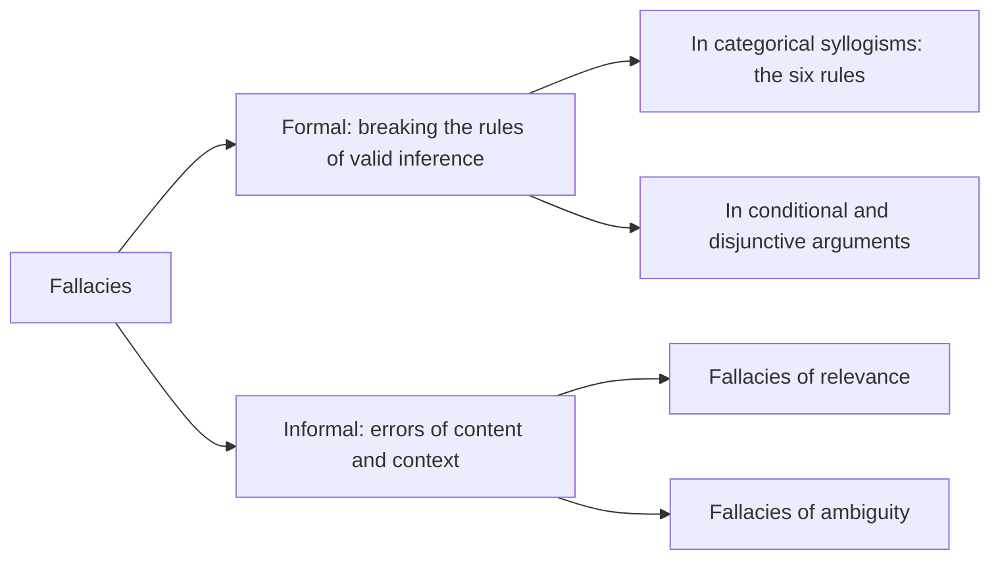

## Arguments and Fallacies

An **argument** has two major parts:

- the **conclusion** — the **claim, belief or position** a person puts forward for acceptance;
- the **premise(s)** — the **justification, reason or ground** used to support it.

An argument can have **more than one premise or conclusion**, and they can come in **any order** — the conclusion may even be **buried among the premises**. What matters is that **the premises are related to the conclusion** (Salmon 1963). Two textbook examples:

> Thinking is a function of man's immortal soul. God has given an immortal soul to every man and woman, but not to any other animal or to machines. **Hence, no animal or machine can think.**

> All men are mortal. Socrates is a man. **Therefore, Socrates is mortal.**

Sometimes the conclusion is **not really related to the premises**. Sometimes there is a **deliberate attempt** to reason falsely, to play on **pity**, or to bring in other factors **external to the argument**. Then a **fallacy** has occurred. As Copi puts it, fallacious arguments **"are, like men, pretenders"**.

### What is a fallacy?

| Definition | Source |
|---|---|
| **Any sort of mistake in reasoning or inference** — anything that **causes an argument to go wrong** | Popkin and Stroll (1969) |
| **A type of argument that may seem to be correct but which proves, upon examination, not to be so** | Copi (1982) |
| An argument whose **premises are irrelevant to the conclusion** but which is **psychologically persuasive** | The textbook |

Detecting fallacies **keeps our thinking clear** and helps us **avoid errors**. Giles St. Aubyn warns:

> "…thought, like all potent weapons, is exceedingly dangerous if mishandled. Clear thinking is therefore desirable not only in order to develop the full potentialities of mind but also to **avoid disaster**."



---

## Formal Fallacies

**Formal fallacies** come from **violating the rules of valid inference**. They occur in **formal logic**, which deals with **deductive arguments**. Since **validity is formal**, any argument — in **natural or artificial language** — that breaks these rules is **fallacious**, whatever its content.

### Categorical syllogisms

A **syllogism** is an argument in which **a conclusion is inferred from two premises**. A **categorical syllogism** is a **deductive argument in which a categorical conclusion is inferred from two categorical propositions**. It must contain **exactly three terms**:

| Term | Where |
|---|---|
| **Major term** | The **predicate** of the conclusion |
| **Minor term** | The **subject** of the conclusion |
| **Middle term** | Appears in **both premises** but **not** in the conclusion |

> No heroes are **cowards**. *(middle term: cowards)*<br />
> Some soldiers are **cowards**.<br />
> ∴ Some **soldiers** *(minor)* are not **heroes** *(major)*.

**Standard form:** the **major premise** (the one containing the major term) comes **first**, the **minor premise** **second**, and the **conclusion last**. If a syllogism is jumbled, **rearrange it — locate the conclusion first**:

> *Some evergreens are objects of worship because all fir trees are evergreens and some objects of worship are fir trees.*

The conclusion is "**Some evergreens are objects of worship**", so the major term is **objects of worship** and the minor term is **evergreens**. In standard form, the premise containing the major term goes first:

> Some objects of worship are fir trees.<br />
> All fir trees are evergreens.<br />
> ∴ Some evergreens are objects of worship.


### Refutation by logical analogy

**Validity depends on form, not content.** So an effective way to expose an invalid argument is **refutation by logical analogy**: build **another argument of exactly the same form** whose premises are **obviously true** and whose conclusion is **obviously false**.

| Your opponent's argument | The logical analogy (same form) |
|---|---|
| All robots are fast runners.<br />All heroes are fast runners.<br />∴ All heroes are robots. | All dogs are mammals.<br />All cats are mammals.<br />∴ All cats are dogs. |

Everyone can see the analogy is **invalid** — true premises, false conclusion. Because the original has **the same form**, it is **invalid too**. *(Both commit the **undistributed middle**.)*

### The six rules and their fallacies (Oyeshile's versions)

These are the same six rules as in the chapter on the nature of logic, but **this chapter numbers rules 4 and 5 the other way round**. Learn the rules by **content**, not number.

| Rule | Fallacy if broken | Textbook example |
|---|---|---|
| **1.** Exactly **three terms**, each used in the **same sense** throughout | **Four terms** (*quaternio terminorum*); if one of three terms shifts meaning, **equivocation** | All attempts to make Nigerians happier are efforts that all Nigerians must support. All the military governments' efforts are efforts to make Nigerians happier. ∴ All present activities of the government are efforts which all Nigerians must support. *(The military governments' efforts and "present activities of the government" are different terms.)* |
| **2.** The **middle term** must be **distributed** in at least one premise | **Undistributed middle** | All traditionalists are conservatives. Some scholars are conservatives. ∴ Some scholars are traditionalists. |
| **3.** No term may be **distributed in the conclusion** unless it is **distributed in a premise** | **Illicit major** or **illicit minor** (illicit process of the major/minor term) | All dogs are mammals *(mammals undistributed)*. No cats are dogs. ∴ No cats are mammals *(mammals distributed)* — **illicit major** |
| **4.** No valid syllogism has **two negative premises** | **Exclusive premises** | No P is M. No S is M. ∴ No S is P. |
| **5.** If **either premise is negative**, the conclusion must be **negative**. An affirmative conclusion needs **two affirmative premises** | **Drawing an affirmative conclusion from a negative premise** | — |
| **6.** No valid syllogism with a **particular conclusion** can have **two universal premises** | **Existential fallacy** (the textbook calls it the fallacy of "existential import") | All household pets are domestic animals. No unicorns are domestic animals. ∴ Some unicorns are not household pets. *(Unicorns do not exist; "some" asserts existence.)* |

### Logical versus practical possibility

Before testing other deductive forms, the textbook draws a distinction:

- Something is **practically possible** if it can happen **in actual life or daily experience**.
- Something is **logically possible** if it is **conceivable** — it involves **no contradiction**.

**Many practically impossible things are logically possible:** a man lifting a trailer with one hand, or a pig flying. Validity concerns **logical** possibility. An argument is invalid if it is **logically possible** for its premises to be true and its conclusion false, even if that never happens in practice.

### Fallacies in conditional and disjunctive arguments

In **modus ponens, modus tollens, hypothetical syllogism** and the **dilemmas**, we deal with **conditional statements** ("if p, then q"), which logicians call **material implication**. In *"If John passes the course, then I will be surprised"*, the part after **if** ("John passes the course") is the **antecedent**, and the part after **then** ("I will be surprised") is the **consequent**.

| Form | Valid version | Its fallacious twin |
|---|---|---|
| **Modus Ponens (MP)** — affirm the **antecedent** | If it rains, the ground will be wet. It rains. ∴ The ground is wet. | **Affirming the consequent:** If it rains, the ground will be wet. The ground is wet. ∴ It rained. *(A burst pipe could wet the ground.)* |
| **Modus Tollens (MT)** — deny the **consequent** | If it rains, the ground will be wet. The ground is not wet. ∴ It did not rain. | **Denying the antecedent:** If it rains, the ground will be wet. It did not rain. ∴ The ground is not wet. |
| **Hypothetical Syllogism (HS)** — the consequent of premise 1 is the antecedent of premise 2 | If John attends the party, he will be given a plate of rice. If John is given a plate of rice, he will be very happy. ∴ If John attends the party, he will be very happy. | Any other arrangement is fallacious |
| **Constructive Dilemma (CD)** — affirm the antecedents | If he attends the party, he will be given an award; and if he excels in the competition, he will become the champion. Either he attends the party or he excels in the competition. ∴ Either he will be given an award or he will become the champion. | — |
| **Destructive Dilemma (DD)** — deny the consequents | (same first premise) Either he will not be given an award or he will not become the champion. ∴ Either he does not attend the party or he does not excel in the competition. | — |
| **Disjunctive Syllogism (DS)** — deny **one** disjunct, affirm the **other** | Either Olu visits Ibadan or he visits Kano. Olu did not visit Ibadan. ∴ Olu visited Kano. *(Denying "Kano" and concluding "Ibadan" is equally valid.)* | **Affirming a disjunct** *(beyond the textbook)*: Olu visited Ibadan. ∴ Olu did not visit Kano. *(The "or" is inclusive — he may have visited both.)* |

**An error in the textbook.** After the invalid rain argument ("The ground is wet. Therefore, it rained"), it correctly says the argument "affirms the consequent instead of affirming the antecedent". But it then names the fallacy **"affirming the antecedent"**. The correct name is the **fallacy of affirming the consequent**. Affirming the antecedent is modus ponens itself, which is valid.

Check both twins with a truth table. A valid form has **no counterexample row**:

<Tabs>
<Tab label="Modus ponens">
<TruthTable title="p = it rains, q = the ground is wet" premises="p ⊃ q; p" conclusion="q" />
</Tab>
<Tab label="Affirming the consequent">
<TruthTable title="The ground is wet, so it rained?" premises="p ⊃ q; q" conclusion="p" />
</Tab>
<Tab label="Modus tollens">
<TruthTable title="The ground is not wet, so it did not rain" premises="p ⊃ q; ~q" conclusion="~p" />
</Tab>
<Tab label="Denying the antecedent">
<TruthTable title="It did not rain, so the ground is not wet?" premises="p ⊃ q; ~p" conclusion="~q" />
</Tab>
<Tab label="Affirming a disjunct">
<TruthTable title="i = Olu visits Ibadan, k = Olu visits Kano" premises="i v k; i" conclusion="~k" />
</Tab>
</Tabs>

<SortingGame title="Valid, or which formal fallacy?">

```sort
@buckets Valid | Affirming the consequent | Denying the antecedent | Affirming a disjunct
If it rains, the ground will be wet. It rains. So the ground is wet => Valid :: Modus ponens — the antecedent is affirmed.
If it rains, the ground will be wet. The ground is wet. So it rained => Affirming the consequent :: The ground could be wet for another reason.
If it rains, the ground will be wet. It did not rain. So the ground is not wet => Denying the antecedent :: Someone may have watered it.
If it rains, the ground will be wet. The ground is not wet. So it did not rain => Valid :: Modus tollens — the consequent is denied.
If you study hard, you will pass. You passed. So you studied hard => Affirming the consequent :: You might have passed by luck or an easy paper.
If Ada is a medical student, she studies anatomy. Ada is not a medical student. So she does not study anatomy => Denying the antecedent :: Nursing and physiotherapy students study anatomy too.
Either Olu visits Ibadan or he visits Kano. Olu did not visit Kano. So Olu visited Ibadan => Valid :: Disjunctive syllogism.
Either Olu visits Ibadan or he visits Kano. Olu visited Ibadan. So Olu did not visit Kano => Affirming a disjunct :: "Or" is inclusive — he may have visited both cities.
If John attends the party, he gets rice. If he gets rice, he will be happy. So if John attends the party, he will be happy => Valid :: Hypothetical syllogism.
```

</SortingGame>

---

## Informal Fallacies

**Informal fallacies** are errors in reasoning we fall into through **carelessness or inattention**, or because we want to **trick others** into accepting a position based on convictions that are **not factual**. They divide into:

- **fallacies of relevance** — the **premises are not related to the conclusion**;
- **fallacies of ambiguity** — words or phrases carry **more than one meaning**.

*(The textbook's list follows Copi's classic grouping: the first thirteen below are fallacies of relevance, and equivocation, division and composition are fallacies of ambiguity.)*

### Fallacies of relevance: appeals and attacks

| Fallacy | What goes wrong | Textbook example |
|---|---|---|
| **Argumentum ad baculum** (appeal to force) | Appealing to **force or the threat of force** to make someone accept a belief — used when **rational argument fails**. Summed up in **"might is right"** | "Remember that I hold **the yam and the knife**" *(a past-question example)* |
| **Argumentum ad hominem (abusive)** — "argument directed to the man" | **Attacking the person** who makes a claim instead of disproving the claim. Also called the **genetic fallacy**, because it attacks the **source or genesis** of a position rather than the position itself | **"Jane will be a bad journalist because she had a failed love affair."** |
| **Argumentum ad hominem (circumstantial)** | Arguing from the **relationship between a person's belief and his circumstances** — "you're bound to say that", or "you do it too" | A **hunter**, accused of barbarism for killing harmless animals for sport, replies: **"Why do you feed on the flesh of harmless cattle?"** |
| **Argumentum ad ignorantiam** (argument from ignorance) | Arguing that a claim is **true because it has not been proved false**, or **false because it has not been proved true**. Our **ignorance** proves **neither** | **"There must be ghosts, because no one has proved they don't exist."** / **"Ghosts don't exist, because I have never seen one."** |
| **Argumentum ad misericordiam** (appeal to pity) | Appealing to **pity** to win acceptance of a conclusion that concerns **a question of fact**, not sentiment. It is **common in courts of law** | A convicted **armed robber** pleads for leniency because **nobody will care for his dependants** if he is executed. A youth accused of **murdering his father and mother** pleads for leniency **because he is an orphan**! |
| **Argumentum ad populum** (appeal to the people) | An **emotional appeal "to the people" or "to the gallery"** to win assent to a conclusion **unsupported by good evidence**. Popular acceptance of a policy **does not prove it wise**, wide use of a product **does not prove it good**, and general assent **does not prove a claim true** | "Millions of Nigerians use this cream, so it must be safe." |
| **Argumentum ad verecundiam** (appeal to authority) | Appealing to an authority **outside that authority's special field**. Consulting a genuine **expert within their field** is not a fallacy | "A famous musician says this herbal mixture cures diabetes." |

### Fallacies of relevance: presumption and misdirection

| Fallacy | What goes wrong | Textbook example |
|---|---|---|
| **Accident** | Applying a **general rule** to a **particular case** whose **"accidental" circumstances make the rule inapplicable** | "It is compulsory to keep promises in all circumstances" — so you must return the gun you promised to keep for a friend, even though **he has gone insane** and wants it back |
| **Converse accident** (hasty generalisation) | **Generalising** on the basis of **insufficient evidence** | "Every Nigerian leader is elitist because past Nigerian leaders have been elitist." Looking only at people who drink **to excess**, one concludes that **all liquor is harmful** and should be banned |
| **False cause** | Saying one thing **causes** another when it does not. **(A) *Non causa pro causa*:** attributing the **wrong cause** to an event. **(B) *Post hoc ergo propter hoc*** ("after this, therefore because of this"): claiming A caused B **simply because A came before B** | "A witch cried in the night; a child died in the morning — so the witch caused the death." *(a past-question example — post hoc)* |
| **Petitio principii** (begging the question) | **Assuming as a premise the very conclusion to be proved** | **"God is the Creator of everything that exists because without Him nothing will exist."** |
| **Complex question** | A question that **presupposes an answer to a prior question that was never asked** — several questions **rolled into one**, so a simple "Yes" or "No" traps you | **"Have you stopped beating your wife?"**, **"Have you stopped cheating in exams?"**, "Have you stopped being a Marlian?" |
| **Ignoratio elenchi** (irrelevant conclusion) | An argument meant to establish **one conclusion** is directed at proving **a different conclusion** | Inferring from remarks about **how horrible murder is** that **the defendant is guilty** of it. Suggesting **a cut in the number of students** because of **unemployment** |

### Fallacies of ambiguity

| Fallacy | What goes wrong | Textbook example |
|---|---|---|
| **Equivocation** | Using a **word or term in different senses** in the same argument | **"The end of a thing is its perfection; death is the end of life; therefore, death is the perfection of life."** "End" means **goal** in the first premise and **termination** in the second |
| **Division** | Assuming that what is true of **the whole** must be true of **its parts** | **"Nigeria is great. Therefore, every Nigerian is great."** "Nigeria is a member of the UN; therefore, every Nigerian is a member of the UN." |
| **Composition** (the opposite of division) | Assuming that what is true of **the parts** must be true of **the whole** | **"All the actors are good. Therefore, the film must be good."** |

*(Beyond the textbook: Copi's list of fallacies of ambiguity also includes **amphiboly**, where a sentence's grammar allows two readings — "I shot an elephant in my pyjamas" — and **accent**, where a change of emphasis changes the meaning.)*

<Analogy>
**Division and composition** mirror each other. A **bag of rice** is heavy, but each grain is not — assuming the grain is heavy is **division**. Each grain is light, but the bag is not — assuming the bag is light is **composition**.
</Analogy>

<SortingGame title="Appeals and attacks: name the fallacy">

```sort
@buckets Ad baculum | Ad hominem (abusive) | Ad hominem (circumstantial) | Ad ignorantiam | Ad misericordiam | Ad populum | Ad verecundiam
"Do as I say — remember, I hold the yam and the knife." => Ad baculum :: A threat of force replaces reasons.
"Support our candidate, or your shop may not survive after the election." => Ad baculum :: Accept the conclusion or suffer — an appeal to force.
"Don't listen to Dr Bello's economic proposals — the man has been divorced twice." => Ad hominem (abusive) :: It attacks the person, not the proposals.
"Of course the senator backs the new oil policy — he owns shares in an oil company." => Ad hominem (circumstantial) :: It dismisses the view by pointing to the arguer's circumstances.
A hunter, criticised for killing animals for sport, replies: "Why do you eat the flesh of harmless cattle?" => Ad hominem (circumstantial) :: The textbook's classic — it turns to the critic's own circumstances instead of answering.
"There must be ghosts, because no one has ever proved that they don't exist." => Ad ignorantiam :: Lack of disproof is taken as proof.
"Nobody is marching in protest, so the government's actions must be acceptable to everyone." => Ad ignorantiam :: Absence of evidence of grievance is taken as evidence of approval (a past question).
"Please, sir, give me an A — if I fail, my father will stop paying my fees." => Ad misericordiam :: Pity replaces evidence about the quality of the work.
The armed robber pleads for leniency because nobody will take care of his dependants => Ad misericordiam :: The textbook's courtroom example.
"Millions of people use this skin cream, so it must be safe." => Ad populum :: Popularity does not prove safety.
"Every true patriot at this rally knows that only our party can save Nigeria!" => Ad populum :: An emotional appeal to the gallery.
"A famous Nollywood actor says this herbal mixture cures diabetes, so it must work." => Ad verecundiam :: An authority outside his field.
```

</SortingGame>

<SortingGame title="Presumption and ambiguity: name the fallacy">

```sort
@buckets Accident | Hasty generalisation | False cause | Begging the question | Complex question | Irrelevant conclusion | Equivocation | Division | Composition
"You promised to keep his gun for him, so you must give it back — even though he has gone mad and is threatening people." => Accident :: A good general rule applied to an exceptional case.
"Free speech is a right, so it's fine to falsely shout 'Fire!' in a crowded hall." => Accident :: The general rule does not fit this special case.
"I met two rude people from that town, so everyone from there is rude." => Hasty generalisation :: Far too few cases for a sweeping conclusion.
"Every Nigerian leader is elitist, because past Nigerian leaders have been elitist." => Hasty generalisation :: The textbook's converse accident.
"A witch cried in the night and a child died in the morning — surely the witch caused the death." => False cause :: Post hoc ergo propter hoc — mere sequence taken as cause.
"I wore my red shirt and we won, so I must wear it to every match." => False cause :: The shirt did not cause the win.
"God is the Creator of everything that exists because without Him nothing would exist." => Begging the question :: The premise simply assumes what is to be proved.
"This book is completely reliable because it says it never lies." => Begging the question :: It trusts the book's claim to prove the book trustworthy — circular.
"Have you stopped cheating in exams?" => Complex question :: Either answer admits to cheating.
"Have you stopped being a Marlian?" => Complex question :: It presupposes you were one (a past question).
"Murder is a horrible crime that destroys families; therefore the defendant is guilty." => Irrelevant conclusion :: It proves murder is terrible, not that this defendant did it.
"The end of a thing is its perfection; death is the end of life; so death is the perfection of life." => Equivocation :: "End" shifts from goal to termination.
"Nigeria is a member of the UN, so every Nigerian is a member of the UN." => Division :: A property of the whole is pushed onto the parts.
"Nigeria is great; therefore, every Nigerian is great." => Division :: The textbook's example.
"All the actors are good, so the film must be good." => Composition :: A property of the parts is pushed onto the whole.
"Every player on the team is a star, so the team will surely win the league." => Composition :: Great individuals do not guarantee a great team.
```

</SortingGame>

### Other common fallacies *(beyond the textbook)*

These are not in the chapter, but they appear as **distractors** in multiple-choice questions:

| Fallacy | Meaning |
|---|---|
| **Straw man** | Distorting an opponent's view into a weaker version and then attacking that |
| **Red herring** | Bringing in an irrelevant topic to divert attention (close to *ignoratio elenchi*) |
| **Slippery slope** | Claiming that one step will inevitably lead to a chain of disasters, without evidence |
| **Tu quoque** ("you too") | Rejecting criticism because the critic does the same thing — a form of circumstantial *ad hominem* |
| **False dilemma** | Presenting only two options when more exist |

---

## Conclusion

Fallacies are **errors in reasoning** that occur when **the premises are not related to the conclusion**. They may be **inadvertent or deliberate** — used to gain advantage, elicit pity, persuade or falsify. **Formal fallacies** break the rules of valid inference; **informal fallacies** mislead through **irrelevance or ambiguity**.

**Can we avoid fallacies completely? No** — we are beings of **emotion and sentiment**. But knowing the fallacies helps us **recognise and avoid them as much as possible**. It also strengthens **critical thinking**:

> **Critical thinking** is the ability to **subject information to objective analysis without sentiment or prejudice, and make a reasoned judgement**. It helps us understand the connections between events and ideas, **evaluate arguments, detect errors** and **solve problems systematically**.

---

## Quick Check

<MCQ question="A fallacy is best defined as…">
<Option>any false statement</Option>
<Option correct>an argument that seems correct but proves, on examination, not to be so</Option>
<Option>an argument with a false conclusion</Option>
<Option>a disagreement between two people</Option>
<Explain>Copi's definition. A fallacy is an error in reasoning; a valid argument can still have a false conclusion if a premise is false.</Explain>
</MCQ>

<MCQ question="Fallacies that come from violating the rules of valid inference are…">
<Option correct>formal fallacies</Option>
<Option>fallacies of relevance</Option>
<Option>fallacies of ambiguity</Option>
<Option>inductive fallacies</Option>
<Explain>Formal fallacies break rules of valid inference (the six syllogism rules, affirming the consequent and so on); informal fallacies divide into relevance and ambiguity.</Explain>
</MCQ>

<MCQ question="'If it rains, the ground will be wet. The ground is wet. Therefore, it rained.' This commits the fallacy of…">
<Option>affirming the antecedent</Option>
<Option correct>affirming the consequent</Option>
<Option>denying the antecedent</Option>
<Option>modus tollens</Option>
<Explain>The second premise affirms the consequent. (The textbook misnames this "affirming the antecedent" — affirming the antecedent is valid modus ponens.)</Explain>
</MCQ>

<MCQ question="Refutation by logical analogy works by…">
<Option>attacking the person who made the argument</Option>
<Option correct>building an argument of the same form with obviously true premises and an obviously false conclusion</Option>
<Option>showing that the conclusion is unpopular</Option>
<Option>checking whether the premises are true</Option>
<Explain>Since validity depends on form, one invalid instance of a form shows that every argument of that form is invalid.</Explain>
</MCQ>

<MCQ question="A person tells you to do something and reminds you that he has 'both the yam and the knife'. The fallacy is…">
<Option correct>argumentum ad baculum (appeal to force)</Option>
<Option>argumentum ad verecundiam (appeal to authority)</Option>
<Option>argumentum ad misericordiam (appeal to pity)</Option>
<Option>argumentum ad populum</Option>
<Explain>The threat of force ("might is right") replaces reasons.</Explain>
</MCQ>

<MCQ question="'A witch cried in the night and a child died in the morning, so the witch caused the death.' This is…">
<Option>hasty generalisation</Option>
<Option>begging the question</Option>
<Option correct>false cause (post hoc ergo propter hoc)</Option>
<Option>equivocation</Option>
<Explain>Taking A as the cause of B simply because A came before B.</Explain>
</MCQ>

<MCQ question="'Have you stopped being a Marlian?' is an example of…">
<Option>ad hominem</Option>
<Option correct>complex question</Option>
<Option>petitio principii</Option>
<Option>ignoratio elenchi</Option>
<Explain>It presupposes an answer to an unasked prior question (were you one?), so neither yes nor no is safe.</Explain>
</MCQ>

<MCQ question="The fallacy committed when the characteristics of a whole are thought to necessarily apply to its parts is…">
<Option>composition</Option>
<Option correct>division</Option>
<Option>accident</Option>
<Option>equivocation</Option>
<Explain>Division goes from whole to parts ("Nigeria is great, so every Nigerian is great"); composition goes from parts to whole.</Explain>
</MCQ>

<MCQ question="Arguing that a claim is true because it has not been proved false is…">
<Option>argumentum ad verecundiam</Option>
<Option>post hoc ergo propter hoc</Option>
<Option correct>argumentum ad ignorantiam</Option>
<Option>slippery slope</Option>
<Explain>The argument from ignorance — our inability to prove or disprove something establishes neither its truth nor its falsehood.</Explain>
</MCQ>

<MCQ question="Petitio principii is commonly known as…">
<Option correct>begging the question</Option>
<Option>straw man</Option>
<Option>red herring</Option>
<Option>appeal to pity</Option>
<Explain>It assumes as a premise the very conclusion to be proved.</Explain>
</MCQ>

<MCQ question="'The end of a thing is its perfection; death is the end of life; therefore, death is the perfection of life.' This commits…">
<Option correct>equivocation</Option>
<Option>composition</Option>
<Option>argumentum ad hominem</Option>
<Option>complex question</Option>
<Explain>"End" means goal in one premise and termination in the other.</Explain>
</MCQ>

## Practice Questions

<Reveal question="1. What is a fallacy? Distinguish formal from informal fallacies.">
A fallacy is any mistake in reasoning that causes an argument to go wrong (Popkin and Stroll) — an argument that seems correct but proves, on examination, not to be (Copi), usually one whose premises are irrelevant to its conclusion yet psychologically persuasive. Formal fallacies violate the rules of valid inference in deductive arguments, whatever the content (undistributed middle, illicit major, affirming the consequent, denying the antecedent). Informal fallacies are errors of carelessness or deliberate trickery that lie in content and context; they divide into fallacies of relevance (premises unrelated to the conclusion) and fallacies of ambiguity (shifting meanings).
</Reveal>

<Reveal question="2. State the six rules of the categorical syllogism and the fallacy that breaking each one commits, with an example.">
(1) Exactly three terms in one sense — four terms / equivocation (the "efforts to make Nigerians happier" example). (2) The middle term distributed at least once — undistributed middle (traditionalists/conservatives/scholars). (3) No term distributed in the conclusion unless it is distributed in a premise — illicit major or minor (All dogs are mammals; no cats are dogs; so no cats are mammals — illicit major). (4) No two negative premises — exclusive premises. (5) A negative premise requires a negative conclusion — affirmative conclusion from a negative premise. (6) No particular conclusion from two universal premises — existential fallacy (household pets and unicorns).
</Reveal>

<Reveal question="3. Explain affirming the consequent and denying the antecedent, and why they are invalid.">
Affirming the consequent: If p then q; q; therefore p ("If it rains the ground will be wet; the ground is wet; so it rained"). Denying the antecedent: If p then q; not p; therefore not q ("It did not rain, so the ground is not wet"). Both are invalid because q can be true for other reasons (a burst pipe, watering), so the premises can be true while the conclusion is false. A truth table shows a counterexample row (p false, q true) in each. The valid forms are modus ponens (affirm the antecedent) and modus tollens (deny the consequent).
</Reveal>

<Reveal question="4. Explain, with examples, ad baculum, ad hominem (abusive and circumstantial), ad ignorantiam and ad misericordiam.">
Ad baculum: the threat of force replaces argument ("might is right"; "remember I hold the yam and the knife"). Ad hominem abusive: attacking the person instead of the claim ("Jane will be a bad journalist because she had a failed love affair"), also called the genetic fallacy. Ad hominem circumstantial: appealing to the arguer's circumstances (the hunter who asks his critic why he eats cattle). Ad ignorantiam: a claim is true because not disproved, or false because not proved ("there must be ghosts because no one has disproved them"). Ad misericordiam: pity used to settle a question of fact (the robber pleading for his dependants; the parricide pleading that he is an orphan).
</Reveal>

<Reveal question="5. Explain ad populum, ad verecundiam, accident, converse accident and false cause.">
Ad populum: an emotional appeal to the people or the gallery; popularity does not prove wisdom, quality or truth. Ad verecundiam: appealing to an authority outside their field. Accident: applying a general rule to a special case it does not fit (keeping a promise to return a gun to a man who has gone insane). Converse accident, or hasty generalisation: generalising from too few or untypical cases (all Nigerian leaders are elitist; all liquor is harmful because of heavy drinkers). False cause: non causa pro causa (the wrong cause) and post hoc ergo propter hoc (A preceded B, so A caused B — the witch who cried at night).
</Reveal>

<Reveal question="6. Explain petitio principii, complex question, ignoratio elenchi, equivocation, division and composition.">
Petitio principii (begging the question): the conclusion is assumed as a premise ("God is the Creator of everything that exists because without Him nothing would exist"). Complex question: a question presupposing an answer to an unasked question ("Have you stopped cheating in exams?"). Ignoratio elenchi (irrelevant conclusion): proving a different conclusion from the one at issue (the horribleness of murder → the defendant is guilty). Equivocation: a word used in two senses ("end" as goal and as termination). Division: from whole to parts ("Nigeria is great, so every Nigerian is great"). Composition: from parts to whole ("all the actors are good, so the film is good").
</Reveal>

<Takeaway>
- **Fallacy** = an argument that **looks correct but isn't** (Copi); often irrelevant premises that are psychologically persuasive.
- **Formal fallacies** break the **rules of valid inference**: the six syllogism rules (four terms, undistributed middle, illicit major/minor, exclusive premises, affirmative from negative, existential fallacy); **affirming the consequent**; **denying the antecedent**. Expose them by **refutation by logical analogy**. Validity concerns **logical**, not practical, possibility.
- **Informal fallacies of relevance:** ad **baculum** (force), ad **hominem** abusive and circumstantial, ad **ignorantiam** (ignorance), ad **misericordiam** (pity), ad **populum** (the gallery), ad **verecundiam** (authority), **accident**, **converse accident** (hasty generalisation), **false cause** (non causa pro causa, post hoc), **petitio principii** (begging the question), **complex question**, **ignoratio elenchi** (irrelevant conclusion).
- **Fallacies of ambiguity:** **equivocation**, **division** (whole → parts), **composition** (parts → whole).
- We cannot avoid fallacies completely, but knowing them sharpens **critical thinking**.
</Takeaway>

## Exam Tips

- Past papers give **scenarios** ("the yam and the knife", "a witch cried in the night", "Have you stopped being a Marlian?", "no one is marching in protest") — practise **naming the fallacy from an example**.
- Know the **Latin names with their English equivalents**: baculum = force, hominem = the man, ignorantiam = ignorance, misericordiam = pity, populum = the people, verecundiam = authority, petitio principii = begging the question, ignoratio elenchi = irrelevant conclusion, post hoc ergo propter hoc = after this, therefore because of this.
- **Division vs composition:** division runs **whole → parts**, composition runs **parts → whole**.
- The invalid rain argument commits **affirming the consequent**, whatever the textbook's slip says.
