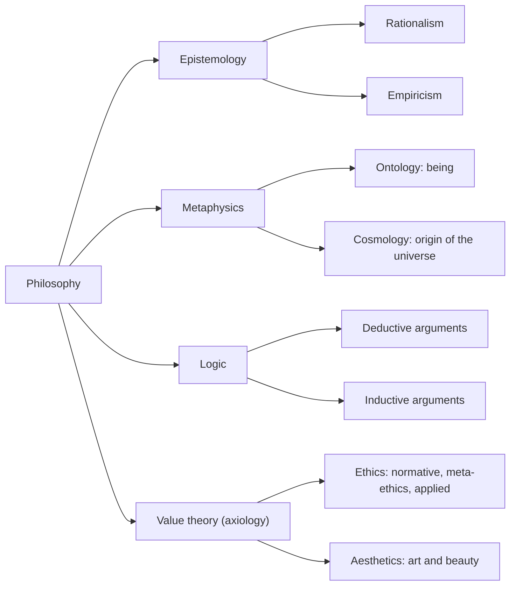

## Clearing the Myths

Philosophy is **not a subject in Nigerian primary or secondary schools**, so students often meet it with **trepidation, ignorance or superstition**. You may have heard claims like these — **all of them myths**:

- *"Philosophers are absent-minded"* — absent-minded people are found in every profession, including science, mathematics and law.
- *"Philosophers dress shabbily or eat from dumpsites."*
- *"Philosophy deals with things unreal and mysterious."*
- *"Only special people — herbalists, diviners or monks — can study philosophy."*
- *"Studying philosophy makes you morose, dejected or pessimistic."*

In fact, philosophy **examines the nature of existence** and seeks to **give reasons** for events, actions and things in the world.

---

## What Is Philosophy?

There is **no universally accepted definition** of philosophy — philosophers themselves do not agree. That is not unusual: law and economics have the same problem. But there **are** distinguishing marks. The best starting point is the word's **etymology**.

**Philosophy** comes from two Greek words:

- ***philos*** — **love**;
- ***sophia*** — **wisdom**.

So philosophy is the **"love of wisdom"**, or the **"pursuit of knowledge"**. It is carried out **systematically, by reasoning and speculation** (Bodunrin 1991). From the start, philosophy has aimed at:

- **cultivating the intellect**;
- **promoting human understanding**;
- **searching for values and meaning in life**.

Someone who thinks **deeply and critically** about the world has a **philosophical mind or attitude**.

**Other definitions:**

1. A way of **simplifying complex notions, ideas or beliefs** about the world, to make meaning of our existence.
2. A **critical examination of the fundamental issues of our existence**.
3. The attempt to **discover the mysteries of the universe in an integrated manner**.
4. The **search for knowledge that aims at influencing how we live**.
5. The study of the **most general or abstract features of the world**, interpreting and clarifying ideas and problems in the light of known facts.
6. The general study of **values, morals, logic and speculation about the nature of reality**.

Despite the lack of one definition, philosophy's concern is constant: **the pursuit of knowledge** about **what exists** and about **right and wrong, good and bad**.

### Methods of philosophy

**Philosophical method (methodology)** is **the study of how to do philosophy**. The common methods are:

| Method | Meaning |
|---|---|
| **Philosophical criticism** | **Rational appraisal of ideas or beliefs** to arrive at truth |
| **Philosophical argumentation** | Providing **arguments** to support a position or solution |
| **Methodic doubt** | **Systematically doubting** the truth of one's beliefs |
| **Dialectical method** | Investigating truth **through discussion** |
| **Inquiry** | A deliberate, formal **investigation** to determine the facts |
| **Analysis** | **Breaking down** a complex topic into smaller parts to understand it better |

### Goals of philosophy

1. **Developing the human person** to contribute meaningfully to society.
2. **Analysing ideas** to eliminate **vagueness and ambiguity**.
3. **Clarity and coherence** in explaining concepts and theories.
4. **Critical thinking** and identifying **logical fallacies** and errors of judgement.
5. **Criticising assumptions, beliefs and arguments**.
6. The habit of tackling life's problems **critically and rationally** (Onyewuenyi 1976).

---

## Two Senses of "Philosophy"

| Broad or popular sense | Technical or academic sense |
|---|---|
| **"A way of life"** — a people's **worldview**: the totality of their beliefs about the origin and nature of the world (**Nwala 1985**) | A **discipline or profession** that clarifies the appropriateness of concepts **through reasoning** |
| **Chatalian (1983):** philosophy is "essentially **the search for the guide of life**" — tied to **culture**, since a worldview embodies a people's language, art, religion, myth, behaviour and values | "A **critical and conscious effort** to understand the universe, its origin and man's place in it". **Oladipo (1999):** "a **critical theory** challenging prevailing descriptions of ourselves and offering **new descriptions**" |
| E.g. the **Yoruba** greet elders by **kneeling or prostrating**; the **Igbo** by **clenching the fists and bowing slightly** — expressions of cultural ethos | Practised by **professional or analytic philosophers**, e.g. African analytic philosophers **P. O. Bodunrin, Godwin Sogolo and Kwasi Wiredu** |

**Kwasi Wiredu (1980):**

> "The function of philosophy everywhere is to **examine the intellectual foundations of life**, using the best available modes of knowledge and reflection **for human well-being**."

**Where it began:** the love of wisdom and knowledge for its own sake drove the **Ionian philosophers of ancient Greece**. They reflected on:

- the composition of things around them;
- the heavenly bodies and the tides;
- conventional laws;
- birth and death.

**Thales** held that **water is the primary substance** that sustains all the diverse things in the world.

---

## First-Order and Second-Order Questions

Philosophical questions are **critical, fundamental and general (universal)**. That is how philosophy links to history, economics, physics, chemistry and other fields. It is **foundational** to them: they **took their point of departure from philosophy**.

| First-order | Second-order |
|---|---|
| Questions on **fundamental issues within philosophy itself** — in **epistemology, ethics, metaphysics** | Questions about **the foundations and basis of other disciplines** |
| *"Is the will free?" "What is knowledge?" "What makes an act right?"* | **Philosophy of law, of education, of science, of the social sciences, of religion; medical ethics** — examining each discipline's **methodology, concepts, logical coherence and relations to other fields** (Miller 1998) |
| — | E.g. in philosophy of law: *"What is the moral justification for **punishment, obligation, human rights, judicial precedent**?"* |

The first-order/second-order conception began in the **ancient period with Plato**, and continued in the modern period:

| Philosopher | Image of philosophy's role |
|---|---|
| **John Locke** | Philosophy as the **"under-labourer"** clearing the ground for knowledge |
| **René Descartes** | Philosophy as the search for an **"Archimedean point"** — a fixed, certain foundation |
| **Immanuel Kant** | Philosophy as the **"Queen of the sciences"** |

Other disciplines are presumed to take their **assumptions, presuppositions and methods for granted**. Philosophy **articulates and clarifies** them. This is sometimes called philosophy's **"meddlesome" character**.

**Is philosophy still needed in an age of science?** Yes:

- **Dipo Irele (1999)** argues that a "large chunk of issues" — the **perennial problems** of philosophy, such as the **ideal conduct** between people in society — **do not yield to empirical method**.
- The sciences discover facts but have **not provided ultimate solutions**.
- New problems keep arising from **genetic engineering, human cloning, artificial intelligence, global warming and pollution**. These need philosophers who can put the facts into **a larger and more general context** (Stumpf 1993).

<SortingGame title="First-order or second-order question?">

```sort
@buckets First-order | Second-order
Is human will free? => First-order :: A fundamental question within philosophy (metaphysics).
What justifies the punishment of offenders in law? => Second-order :: Philosophy of law examines law's basic concepts.
What is knowledge, and how is it different from belief? => First-order :: A core question of epistemology.
Is the scientific method a reliable route to truth? => Second-order :: Philosophy of science examines science's methodology.
What makes an action morally right? => First-order :: A question within ethics.
What should the aims of university education be? => Second-order :: Philosophy of education examines another discipline's foundations.
```

</SortingGame>

---

## The Branches of Philosophy

There are **four major branches**: **epistemology, metaphysics, logic and value theory (ethics)**.



### 1. Epistemology — the theory of knowledge

The name comes from the Greek ***episteme*** (**knowledge**) + ***logos*** (**theory, study**). Sometimes we are certain of what we know, such as the road to our house. At other times our knowledge claims prove **false**. You see a **wet street** and believe it rained — but the water may have **spilled from a water tanker**. **Justifying knowledge claims** is the business of epistemology.

**Joseph Omoregbe (1990):** epistemology studies **"the nature, the origin, the foundation, the method, the validity, the extent and the limits of human knowledge."** Its questions include:

- Is knowledge **objective or relative**?
- What are the **criteria or justification** that give **certain knowledge**?

| Rationalism | Empiricism |
|---|---|
| Knowledge is a product of **reason** | **Sense-experience** is the ultimate source of knowledge |
| **A priori** knowledge — derived from **reason**, prior to experience | **A posteriori** knowledge — derived from **experience** |

Epistemology also distinguishes **knowledge from belief**, and recognises knowledge from a **combination** of reason and experience.

### 2. Metaphysics — the study of reality

**Metaphysics** investigates **the nature of reality and the structures of what exists** — what exists or is possible, the ultimate constituents of things, and the nature of **being**. It asks:

- *"Why is there something rather than nothing?"*
- *"Who am I?"*
- *"Is my will free?"*
- *"Is reality spiritual or physical?"*
- *Does **God** exist? Why is there **evil** in the world?*

Metaphysics has two subdivisions:

- **Ontology** — the nature of **being or existence**;
- **Cosmology** — the **origin and history of the physical universe**.

### 3. Logic — the study of good reasoning

**Logic** is **the study of the general structure of sound reasoning and good arguments** (McInerney 1992). It helps people test whether their arguments are **valid and sound**. An **argument** is a set of statements in which some — the **premises** (reasons) — give **full or partial support** to another — the **conclusion**.

Logic has two main subdivisions:

- **formal logic** — the formal structure and rules of arguments;
- **informal logic** — the reasoning that guides everyday life.

The textbook places the two types of argument under informal logic; many logic texts treat deductive validity under formal logic.

| Deductive argument | Inductive argument |
|---|---|
| The premises give **full support** — the conclusion follows **necessarily** | The premises give only **partial or probable** support |
| Validity tested by **syllogism** and **truth tables** | Infers a **general conclusion or law from observed particular instances** |
| *All Boko Haram captives must be tested for HIV. Rikyiat is a Boko Haram captive. Therefore Rikyiat must be tested for HIV.* | *Chukwudi has repeatedly seen black eaglets, so he concludes that **all eaglets are probably black**.* A single **white eaglet** would disprove it |
| *All UI students are hard-working. Tosin is a UI student. Therefore Tosin is hard-working.* | — |

### 4. Ethics (value theory)

**Ethics** — also called **moral philosophy** — is **the systematic study of the principles of good behaviour** as individuals interact in society. A well-ordered society is one whose members are **disciplined and morally upright**. **Emmet Barcalow (1994):** ethics studies the **basic principles of moral conduct** and **what is right or wrong** in how people deal with one another.

| Branch of ethics | Concern |
|---|---|
| **Normative ethics** | **Moral judgements** and **how people ought to behave** |
| **Meta-ethics** | **Clarifying the meaning of moral terms** and concepts |
| **Applied ethics** | Using ethical principles to resolve **practical problems** — **abortion, euthanasia (mercy killing), in-vitro fertilisation** |

Other subsets include **business ethics**, **media ethics** and **aesthetics**. **Aesthetics** studies the **production, appreciation and experience of works of art**:

- *"What makes something a work of art?"*
- *"Is beauty in the eye of the beholder?"*
- *"What is the link between art, reality and truth?"*

It shares with ethics concerns about **emotion, pleasure, taste and subjectivity**. **Value theory (axiology)** thus covers **ethics and aesthetics**.

<SortingGame title="Which branch of philosophy asks this?">

```sort
@buckets Epistemology | Metaphysics | Logic | Ethics | Aesthetics
How do I know the street is wet because it rained, and not because a tanker spilled water? => Epistemology :: Justifying a knowledge claim.
Why is there something rather than nothing? => Metaphysics :: A question about existence itself.
Does the conclusion follow from the premises? => Logic :: Distinguishing good from bad reasoning.
Is euthanasia ever morally permissible? => Ethics :: An applied-ethics question about right conduct.
Is beauty in the eye of the beholder? => Aesthetics :: A question about art and beauty.
Is reality ultimately spiritual or physical? => Metaphysics :: The nature of reality.
Can reason alone give us knowledge, without experience? => Epistemology :: Rationalism versus empiricism.
What does the word "good" mean in "a good person"? => Ethics :: Meta-ethics clarifies moral terms.
```

</SortingGame>

<SortingGame title="Rationalism or empiricism?">

```sort
@buckets Rationalism | Empiricism
"We can know that 2 + 2 = 4 without counting any objects." => Rationalism :: A priori knowledge from reason alone.
"I know sugar is sweet because I tasted it." => Empiricism :: Knowledge from sense-experience (a posteriori).
"The mind alone, by pure reason, can grasp reality." => Rationalism :: Reason as the source of knowledge.
"All our ideas come from what we see, hear, touch, taste and smell." => Empiricism :: Sense-experience as the ultimate source.
"A triangle's angles sum to 180° — no measuring needed to know it." => Rationalism :: Derived by reasoning, not observation.
```

</SortingGame>

---

## Functions of Philosophy

| Function | Meaning |
|---|---|
| **Analytic** | **Analysis and clarification** — "breaking down" ideas, issues, statements and beliefs to understand them properly |
| **Speculative** | Using **the mind** — perhaps nature's greatest gift — to think, reason and **conjecture** about the world, including things **possible or merely probable** |
| **Prescriptive** | **Formulating goals, norms and standards** to guide culture, human life and social action |
| **Critical thinking** | Developing **tools of reasoning** — to think rationally, solve problems, make decisions and reach conclusions from information |

<SortingGame title="Which function of philosophy?">

```sort
@buckets Analytic | Speculative | Prescriptive | Critical thinking
Clarifying what "democracy" means before debating whether Nigeria has it => Analytic :: Breaking a concept down to understand it.
Imagining what a perfectly just society might look like => Speculative :: Using the mind to conjecture about the possible.
Proposing standards of honesty that public officials ought to follow => Prescriptive :: Formulating norms and ideals for social life.
Spotting that a campaign argument attacks the candidate rather than the policy => Critical thinking :: Reasoning well and identifying fallacies.
Asking whether time had a beginning => Speculative :: Reflecting on the nature of the world.
```

</SortingGame>

---

## Is Philosophy Relevant?

Through its pursuit of knowledge, philosophy **inculcates ideas that enhance our capacity for social change**:

- **Francis Bacon:** **"Knowledge is power."** Since ideas rule the world, a person with philosophical knowledge is better placed to effect **positive change**.
- **Plato:** the world would be better governed if **philosopher-kings** became leaders, or leaders were **trained in philosophy**.
- **Udo Etuk** (a Nigerian professional philosopher) says philosophy teaches core values:
  - there are **always two sides to an issue**;
  - the **desire to consider all sides**;
  - **objectivity and fairness**;
  - the imperative to **respect others' opinions**.

  In a country like Nigeria, with **high intolerance stemming from ethnic and religious differences**, these values can **mitigate divisive vices** and promote **tolerance and harmony**.

**Conclusion:** philosophy does **not** make one morose or pessimistic. It promotes **understanding**, helps us **analyse and clarify** concepts, and helps resolve the complex issues of existence. Training in philosophy gives the skills of **critical and reflective thinking** that **free humanity from fear, ignorance and superstition**.

---

## Quick Check

<MCQ question="Which is the investigation of the nature, criteria and justification of human knowledge?">
<Option>Cosmology</Option>
<Option>Ontology</Option>
<Option correct>Epistemology</Option>
<Option>Rationalism</Option>
<Explain>Epistemology (episteme = knowledge + logos = theory) studies the nature, origin, foundation, method, validity, extent and limits of knowledge (Omoregbe 1990).</Explain>
</MCQ>

<MCQ question="Ontology, a subdivision of metaphysics, is the study of…">
<Option>the origin of the universe</Option>
<Option correct>being or existence</Option>
<Option>moral conduct</Option>
<Option>valid arguments</Option>
<Explain>Metaphysics divides into ontology (being or existence) and cosmology (the origin and history of the physical universe).</Explain>
</MCQ>

<MCQ question="Who saw the role of philosophy as that of the 'under-labourer'?">
<Option correct>John Locke</Option>
<Option>René Descartes</Option>
<Option>Immanuel Kant</Option>
<Option>Plato</Option>
<Explain>Locke — under-labourer; Descartes — the search for an Archimedean point; Kant — the Queen of the sciences.</Explain>
</MCQ>

<MCQ question="The conceptual and foundational questions that philosophy raises about other disciplines are called…">
<Option>first-order questions</Option>
<Option correct>second-order questions</Option>
<Option>empirical questions</Option>
<Option>speculative questions</Option>
<Explain>Second-order questions examine the methodology, concepts and coherence of other disciplines, e.g. in the philosophy of law or of science.</Explain>
</MCQ>

<MCQ question="Which Ionian philosopher held that water is the primary substance of all things?">
<Option correct>Thales</Option>
<Option>Socrates</Option>
<Option>Plato</Option>
<Option>Aristotle</Option>
<Explain>Thales, one of the Ionian philosophers of ancient Greece, reflected on the composition of things and named water as the basic substance.</Explain>
</MCQ>

<MCQ question="Which of these is NOT one of the four major branches of philosophy named in the textbook?">
<Option>Epistemology</Option>
<Option>Metaphysics</Option>
<Option>Logic</Option>
<Option correct>Political philosophy</Option>
<Explain>The four major branches are epistemology, metaphysics, logic and value theory (ethics). Political philosophy — like aesthetics, a subset of value theory — is not one of the four.</Explain>
</MCQ>

<MCQ question="Chukwudi sees many black eaglets and concludes that all eaglets are probably black. This is…">
<Option>a deductive argument</Option>
<Option correct>an inductive argument</Option>
<Option>a meta-ethical claim</Option>
<Option>an a priori truth</Option>
<Explain>Induction infers a general conclusion from particular observations; its premises give only probable support, and one white eaglet would refute it.</Explain>
</MCQ>

<MCQ question="Applied ethics deals with…">
<Option>the meaning of moral terms</Option>
<Option>how people ought to behave in general</Option>
<Option correct>using ethical principles to resolve practical problems like abortion and euthanasia</Option>
<Option>the appreciation of art</Option>
<Explain>Meta-ethics clarifies moral terms; normative ethics deals with how we ought to behave; applied ethics tackles concrete issues.</Explain>
</MCQ>

## Practice Questions

<Reveal question="1. Why is there no single definition of philosophy? Give its etymology and three definitions.">
Philosophers do not agree on one definition, because they view the world differently — as in law and economics. Etymologically, philosophy comes from the Greek philos (love) and sophia (wisdom): the love of wisdom or pursuit of knowledge, carried out systematically by reasoning and speculation. Definitions: a critical examination of the fundamental issues of existence; an attempt to discover the mysteries of the universe in an integrated manner; the search for knowledge that aims at influencing how we live; the study of the most general features of the world; the study of values, morals, logic and speculation about reality.
</Reveal>

<Reveal question="2. Distinguish the broad and technical senses of philosophy, with examples.">
Broad or popular: a way of life or worldview — a people's fundamental beliefs about the origin and nature of the world (Nwala 1985), "the search for the guide of life" (Chatalian 1983), embedded in culture; e.g. Yoruba kneeling or prostrating and Igbo fist-and-bow greetings. Technical or academic: a discipline that clarifies concepts through reasoning — a critical, conscious effort to understand the universe and man's place in it, "a critical theory challenging prevailing descriptions" (Oladipo 1999) — practised by analytic philosophers such as Bodunrin, Sogolo and Wiredu.
</Reveal>

<Reveal question="3. Explain first- and second-order questions and the images of philosophy associated with Locke, Descartes and Kant.">
First-order questions concern fundamental issues within philosophy (epistemology, ethics, metaphysics). Second-order questions examine the foundations of other disciplines — their methods, concepts, coherence and implications — as in the philosophy of law, science, education and religion. The conception began with Plato. Locke saw philosophy as an under-labourer clearing the ground, Descartes as the search for an Archimedean point, and Kant as the Queen of the sciences, because other disciplines take their assumptions for granted. It remains relevant because perennial problems resist empirical methods (Irele) and new technologies raise new questions (Stumpf).
</Reveal>

<Reveal question="4. Describe the four branches of philosophy and their subdivisions.">
Epistemology (theory of knowledge): nature, sources and limits of knowledge; rationalism (reason, a priori) versus empiricism (experience, a posteriori). Metaphysics (nature of reality): ontology (being) and cosmology (origin of the universe); questions of God, evil, free will and mind. Logic (structure of sound reasoning): arguments made of premises and a conclusion; deductive (full support, e.g. the syllogism) versus inductive (probable support from particular cases). Ethics or value theory: normative ethics, meta-ethics and applied ethics (abortion, euthanasia, IVF), plus aesthetics (art and beauty).
</Reveal>

<Reveal question="5. State the functions and relevance of philosophy.">
Functions: analytic (clarifying ideas), speculative (reasoning and conjecturing about the world), prescriptive (formulating norms and goals) and critical thinking (reasoning, problem solving, decision making). Relevance: knowledge is power (Bacon), so philosophically trained people can effect positive change; Plato's philosopher-kings; and Udo Etuk's core values — seeing two sides of an issue, objectivity, fairness and respect for others' opinions — which can reduce Nigeria's ethnic and religious intolerance and promote harmony, freeing people from fear, ignorance and superstition.
</Reveal>

<Takeaway>
- **Myths** about philosophers (absent-minded, shabby, morose) are false. Philosophy **examines existence** and **gives reasons**.
- **No single definition**; **philos + sophia = love of wisdom**, the pursuit of knowledge by reasoning and speculation (Bodunrin).
- **Methods**: criticism, argumentation, **methodic doubt**, **dialectic**, inquiry, **analysis**. **Goals**: personal development, clarity, critical thinking, spotting fallacies (Onyewuenyi).
- **Broad sense** (worldview; Nwala, Chatalian; Yoruba and Igbo greetings) vs **technical sense** (academic analysis; Oladipo; Bodunrin, Sogolo, **Wiredu**). **Thales**: water is the primary substance.
- **First-order** (within philosophy) vs **second-order** (foundations of other disciplines): **Locke — under-labourer; Descartes — Archimedean point; Kant — Queen of the sciences**.
- **Branches**: **epistemology** (*episteme* = knowledge; rationalism/a priori vs empiricism/a posteriori), **metaphysics** (**ontology** — being; **cosmology** — origin of the universe), **logic** (deductive vs inductive), **ethics** (normative, meta-ethics, applied; plus aesthetics).
- **Functions**: analytic, speculative, prescriptive, critical thinking. **Relevance**: Bacon, Plato's philosopher-kings, **Udo Etuk** on tolerance.
</Takeaway>

## Exam Tips

- **Who said what** is a staple: Locke (under-labourer), Descartes (Archimedean point), Kant (Queen of the sciences), Thales (water), Omoregbe (definition of epistemology), Wiredu (function of philosophy).
- Remember the **Greek roots**: philos/sophia, episteme/logos.
- **Metaphysics = ontology + cosmology**; **ethics = normative + meta-ethics + applied**.
- If an MCQ asks which is **not a cardinal branch**, the answer is whatever falls outside **epistemology, metaphysics, logic and ethics** (e.g. political philosophy, or aesthetics as a mere subset).
- Beware circulated past-question keys: *"the senses alone are the primary source of knowledge"* describes **empiricism**, not rationalism.
