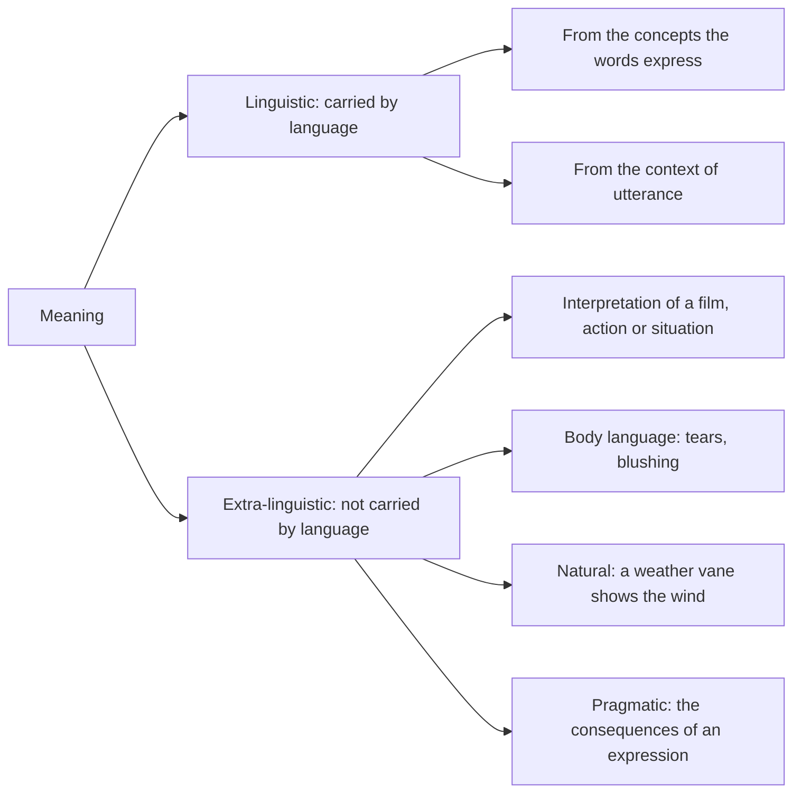

> "Careful and correct use of language is a powerful aid to straight thinking, for putting into words precisely what we mean necessitates getting our own minds quite clear on what we mean." — **W. I. B. Beveridge**

> "Colourless green ideas sleep furiously." — **Noam Chomsky**

> "Then you should say what you mean," the March Hare went on. "I do," Alice hastily replied; "at least — at least I mean what I say — that's the same thing, you know." "Not the same thing a bit!" said the Hatter. "Why, you might just as well say that 'I see what I eat' is the same thing as 'I eat what I see'!" — **Lewis Carroll**, *Alice's Adventures in Wonderland*

## Language and Its Uses

Human society rests on **social cooperation**, especially for **survival**. Cooperation needs a means of **communication** so that people can understand **what to do and how to do it**. **The essence of understanding is the capacity to derive meaning from what is communicated.** That is why **language** is one of humanity's greatest achievements.

> **Language** is a **system of signs and symbols** that **stand for something external** to the signs and symbols and **facilitate verbal exchange** among humans.

Language can be studied at several levels:

| Dimension | Language seen as… | Studied by |
|---|---|---|
| **Available sound** | The total resources of sound available for speech | **Phonetics** — the study of speech production |
| **Organised sound** | The patterns of speech sounds used in a particular language | **Phonology** |
| **Grammar** | The signs and the internal relationships between them | **Grammar** |

Language may be **spoken or written** (text or conversation). It facilitates interaction **among humans** and **between humans and their environment**. We use it for many purposes (Hurley 1997): to **command, ask questions, tell lies, narrate stories, make jokes, pray, give directions, greet, flirt, sing, deceive, analyse Nigeria's problems, and communicate ideas, opinions and feelings**.

### Copi's three functions of language

**Irving Copi** reduces this long list to **three basic functions**. (Some writers allow only two: the **cognitive/informative** and the **emotive/expressive**.)

| Function | Purpose | Can it be true or false? | Examples |
|---|---|---|---|
| **Informative** | To **communicate information** (or misinformation) by **"formulating and affirming (or denying) propositions"** (Copi 1978) | **Yes** | "There are eight planets in the solar system" (true); the textbook's "There are 79 planets in the solar system" and "The Earth is made of cheese and sand" (false — but still informative in function) |
| **Expressive** | To **express feelings, attitudes and emotions**, and sometimes to **evoke similar feelings** in the hearer | **No** | "Ouch!", "Oh Lord!", "my sweetheart", "That's too bad!", Shakespeare's *"Tomorrow, and tomorrow, and tomorrow, / Creeps in this petty pace from day to day"* |
| **Directive** | To **initiate or prevent action** — commands and requests aimed at a demonstrable result | **No** (it can be obeyed or disobeyed) | "Get out!", "Go and wash the dishes", "Close the window", "Don't do it!", "Get this file to the manager" |

Note that **false information is still informative**: the informative function is about *trying to state facts*, not about succeeding.

<SortingGame title="Informative, expressive or directive?">

```sort
@buckets Informative | Expressive | Directive
Lagos is the most populous city in Nigeria => Informative :: A claim about the world that can be checked as true or false.
Ouch! That hurts! => Expressive :: A cry of feeling — neither true nor false.
Submit your assignment before Friday => Directive :: A command meant to produce an action.
The Earth is made of cheese and sand => Informative :: False, but still an attempt to state a fact.
What a beautiful sunset! => Expressive :: It voices an attitude of admiration.
Please switch off your phones during the lecture => Directive :: A request that aims at an action.
Water boils at 100 °C at sea level => Informative :: A factual proposition.
Oh Lord, have mercy! => Expressive :: An emotional outburst, not a report.
Don't touch that wire! => Directive :: It aims to prevent an action.
```

</SortingGame>

---

## Meaning and Logic

When someone speaks and you nod and say **"I understand what you mean"**, something important has happened. In communication we **put a sense into signs and symbols** and hope the hearer can **decode what we mean**. But is **"saying what you mean"** the same as **"meaning what you say"**? The Hatter's reply to Alice shows that it is not.



| Kind of meaning | Explanation | Example |
|---|---|---|
| **Linguistic** | Communicated **through the medium of language**; deduced from the **concepts the words express** or the **context** in which they are uttered | "Close the door" understood as a request |
| **Extra-linguistic: interpretation** | The **interpretation a person gives to phenomena** in the world | "What did that film **mean** to you?" |
| **Extra-linguistic: body language** | What **body signals** communicate | Tears, blushing |
| **Extra-linguistic: natural** | A sign **associated with a natural event** | A **weather vane** pointing in a direction "means" the wind is blowing along that line *(strictly, the vane's arrow points into the wind — to where it comes from)* |
| **Extra-linguistic: pragmatic** | Meaning taken from the **consequences of an expression** | "Light bulb" means being able to **read at night** |

### When meaning goes wrong: the murder of Thomas Becket

**Thomas Becket**, the 12th-century **Archbishop of Canterbury**, had been a friend of **King Henry II of England**. They clashed over **the Church's relationship to the common law of England**, and Becket was **exiled**. After his return he became too much for the king to bear, and Henry exclaimed:

> **"Will no one rid me of this turbulent priest?"**

**Four of Henry's knights** took this as **an order**. On **29 December 1170** they **murdered Becket in Canterbury Cathedral**. Henry was probably only **venting his frustration**; the knights read his words as a direct command.


*The earliest known picture of Becket's murder, from a manuscript of about 1200 (British Library, Harley MS 5102, f. 32). Public domain, via Wikimedia Commons.*

**The lesson: actions can flow from a misinterpretation of meaning and intention.** Such misinterpretations come from **ambiguity and vagueness**, which are **built into language**.

### Ambiguity and vagueness

| | **Ambiguity** | **Vagueness** |
|---|---|---|
| **Definition** | An expression **encodes more than one meaning**, and it is unclear which is intended | An expression has **no uniquely determinable value or interpretation** (Clark 2009) — its **borderline is fuzzy** |
| **Picture it as** | **Two or more distinct** meanings | **One** meaning with **blurred edges** |
| **Examples** | "I've brought the **seal**" (a sea creature, or a device for closing an opening); "**black ties and trousers**" (are the trousers black too?); **bright, bank, biweekly, good** | "The man is **rich**" — from a few thousand naira to billions?; **painful, child, drunk, tall** |
| **Remedy** | A definition that says **which sense** is meant | A **precising definition** that draws a line |

"**Black ties and trousers**" is ambiguous in its **structure** (grammar), not in any single word. Logicians call this **syntactic ambiguity**, as opposed to **lexical ambiguity** (one word, several meanings — "seal", "bank") *(the terms are beyond the textbook)*.

<SortingGame title="Ambiguous or vague?">

```sort
@buckets Ambiguous | Vague
I've brought the seal => Ambiguous :: Two distinct meanings: an animal, or a device for sealing.
The man is rich => Vague :: One meaning, but no clear cut-off point for "rich".
We met by the bank => Ambiguous :: A riverbank or a financial bank.
The soup is hot => Vague :: There is no exact temperature at which soup becomes "hot".
The magazine comes out biweekly => Ambiguous :: Twice a week, or once every two weeks.
He was drunk at the party => Vague :: One bottle? Three? Ten? The boundary is unclear.
Visiting relatives can be boring => Ambiguous :: Going to visit them, or relatives who visit — a structural ambiguity.
She is a tall woman => Vague :: No precise height divides tall from not tall.
```

</SortingGame>

<Analogy>
**Ambiguity** is like a road sign pointing to **two different towns** with the same name: you must know which one is meant. **Vagueness** is like a town with **no clear boundary**: you know roughly where it is, but you cannot say exactly where it ends.
</Analogy>

### What a theory of meaning must explain

According to **William Lycan** (2000):

> That certain kinds of marks and noises have meanings, and that we human beings grasp those meanings **without even thinking about it**, are very striking facts. A philosophical theory of meaning should explain **what it is for a string of marks or noises to be meaningful** and, more particularly, **what it is in virtue of which the string has the distinctive meaning it does**. The theory should also explain **how it is possible for human beings to produce and to understand meaningful utterances** and to do that so effortlessly.

Understanding **the nature of meaning** is different from understanding **the human capacity to produce speech**. What interests philosophers is **how linguistic expressions themselves constitute meanings**. Compare four strings:

| String | Verdict |
|---|---|
| 1. *Singing lawn party incessant university.* | Real words, but **no grammatical sense** |
| 2. *Colourless green ideas sleep furiously.* (Chomsky) | **Grammatical but meaningless** — nothing can be colourless and green, and ideas do not sleep |
| 3. *Everybody has the right to disenfranchise him or herself.* | **Meaningful** — meaningful words linked to make sense |
| 4. *Jhjhb zhjhjs jhb jbkjsy.* | **Nonsense** — not even words |

Only string 3 has the unique property of **meaning something**. Lycan lists the **data** that any philosophy of language must start from:

1. Some strings of marks or noises are **meaningful sentences**.
2. Each meaningful sentence has **parts that are themselves meaningful**.
3. Each meaningful sentence **means something in particular**.
4. **Competent speakers** understand many sentences of their language **without effort and almost instantaneously**, and produce sentences in the same way.

<SortingGame title="Classify each string">

```sort
@buckets No grammatical sense | Grammatical but meaningless | Meaningful | Nonsense
Singing lawn party incessant university => No grammatical sense :: Real English words thrown together without grammar.
Colourless green ideas sleep furiously => Grammatical but meaningless :: Perfect grammar, impossible sense — Chomsky's famous example.
Everybody has the right to disenfranchise him or herself => Meaningful :: The words combine into a sentence that says something.
Jhjhb zhjhjs jhb jbkjsy => Nonsense :: These are not words at all.
The square root of Tuesday is jealous => Grammatical but meaningless :: Well-formed, but days have no square roots or feelings.
Quickly the from blue under => No grammatical sense :: Words without grammatical structure.
Lectures begin at eight o'clock tomorrow => Meaningful :: Grammatical and says something definite.
```

</SortingGame>

---

## Intension and Extension

One easy way to find the meaning of a word is to **define** it. A word can be defined through its **intensional** or its **extensional** meaning.

| | **Intensional (connotative) meaning** | **Extensional (denotative) meaning** |
|---|---|---|
| **What it is** | The **characteristics, qualities or attributes** the word **connotes** | The **members of the class** the word **denotes** |
| **"skyscraper"** | Above all, a building of **great height** | The Empire State Building, Burj Khalifa… |
| **"house"** | A building that is **habitable** | Every actual house |
| **"president"** | Head of state of a republic | **Obama, Obasanjo, Putin, El-Sisi**… |
| **"car"** | A four-wheeled motor vehicle for carrying people | **Mercedes-Benz, Toyota Corolla, Honda Accord**… |

**Beyond the textbook:** intension **determines** extension. Knowing the attributes lets you decide what belongs to the class. Two words can share an extension but differ in intension. "Unicorn" and "dragon" have **the same (empty) extension** — nothing — but very **different intensions**.

---

## Definitions

A **definition** is a group of words used to **give meaning to another word**. Every definition has **two parts**:

| Part | What it is | In *"'Telephone' means an electronic device that enables speech communication between at least two people"* |
|---|---|---|
| **Definiendum** | The **word to be defined** | **telephone** |
| **Definiens** | The **group of words that does the defining** — it directs us to what the word's meaning entails | **an electronic device that enables speech communication between at least two people** |

Memory aid: definie**ndum** = the one that **needs** defining (it ends in **-dum**, "to be done"); definie**ns** = the one **doing** the defining.

### The five purposes of definition

| Purpose | What it means | Type of definition that serves it |
|---|---|---|
| **1. To increase vocabulary** | To understand a word that is **new to me** | **Lexical** |
| **2. To remove ambiguity** | To settle which **sense** of a word with **two or more meanings** is intended — ambiguity breeds **equivocation** (a dangerous form of verbal deceit) and **verbal disputes** | **Lexical** |
| **3. To reduce vagueness** | To limit the **wide range of possible meanings** by fixing the **context** | **Precising** |
| **4. To give a theoretical explanation** | To give a **theoretical or scientific account** of a term | **Theoretical** |
| **5. To influence attitudes** | To **elicit an emotional reaction**, defining a word **positively or negatively** | **Persuasive** |

**Stipulative** definitions serve a further need: **naming something new**. The textbook also lists the **ostensive** definition, used when words fail.

**Verbal versus factual disputes.** A **verbal dispute** is a **prolonged disagreement over the meaning of a word**. A **factual dispute** is a disagreement over **what actually happened or is the case**. The textbook's example:

> **Muhammad:** Shola is guilty of stealing the phone. He confessed to me yesterday that he did it.<br />
> **Chinedu:** How can you say that? Shola has not even been accused by the court. No one is guilty until the court says so.

Muhammad uses **"guilty"** in its **moral** sense; Chinedu insists on its **legal** sense. They **agree on the facts** (Shola confessed; no court has ruled). The dispute is purely **verbal**, and **a definition of "guilty"** would end it.

<SortingGame title="Verbal or factual dispute?">

```sort
@buckets Verbal dispute | Factual dispute
Muhammad says Shola is guilty because he confessed; Chinedu says he is not guilty because no court has convicted him => Verbal dispute :: Both accept the facts; they use "guilty" in different senses (moral and legal).
Ada says the lecture holds at 8 a.m.; Bola says the timetable shows 10 a.m. => Factual dispute :: One of them has the facts wrong — check the timetable.
Two friends argue whether a man who earns ₦300,000 a month is "rich"; both agree on his salary => Verbal dispute :: They agree on the figure and disagree only on how to apply "rich".
Tunde insists Nigeria has 36 states; Emeka insists it has 37 => Factual dispute :: A matter of fact, settled by checking the constitution (36 states plus the FCT).
One student says a tomato is a fruit, another says it is a vegetable; both know exactly how tomatoes grow and are eaten => Verbal dispute :: The botanical and the culinary senses of "fruit" differ.
```

</SortingGame>

---

## Six Types of Definition

The five purposes give logicians a **pragmatic middle course** between two camps. One camp says a definition gives **no real information** about the definiendum; the other says definitions give **urgent clarifications** that lead to deeper truth about language (Hurley 1997).

| Type | What it does | Can it be true or false? | Textbook example |
|---|---|---|---|
| **Stipulative** | Gives meaning to a **new word** (a **neologism** — the textbook says "neologies") or a **new meaning to an old word**. The coiner is at **complete liberty**. Needed for **new developments**, **secret codes**, and **naming in the sciences**. It **does not tell us anything new** about the definiendum | **No** — it is a **proposal**, not a report | **"Tigon"** = the offspring of a **male tiger and a female lion**; **"liger"** = the offspring of a **male lion and a female tiger** |
| **Lexical** | **Reports the established, conventional usage** of a word — what **dictionaries** contain. It removes **ambiguity** | **Yes** — it can report usage correctly or incorrectly | "Bachelor" means **an unmarried man**. Defining it as "a **married** male" is a **false** lexical definition |
| **Precising** | Applies to **vague words**. It **fixes the meaning within a particular context**, beyond what a lexical definition can do. It is **not stipulative**, because it still **works within the lexical meaning** | Judged by how **fair and useful** it is for the purpose | "In this legislation, **'poor'** will mean having an **annual income of less than ₦50,000**"; a court fixing what counts as **death** (heart stops, breathing stops, brain stops, rigor mortis); "In this relationship, **'love'** means taking me to the cinema **once a month**" |
| **Theoretical** | Gives a **theoretical or scientific characterisation** of what a term denotes, within a **background theory**. Common in **philosophy and the sciences** | Judged by the **adequacy of the theory** behind it | **"Heat"** means the energy associated with the **random motion of the molecules** of a substance; **"weight"** means a measurement of the **gravitational force** acting on an object. "Light" is defined differently in **Newtonian** and in **Einstein's** physics; "substance" differently by **Aristotle** and by **Leibniz** |
| **Persuasive** | Aims to **influence attitudes** — to **engender a favourable or unfavourable emotion** towards what the word denotes | Its aim is **to persuade**, not to report | *Unfavourable:* "Abortion means the **cruel and insensitive murder of an unborn person**". *Favourable:* "Abortion means a **safe surgical operation that removes an unwanted mass of bloody tissue** from a woman" |
| **Ostensive** | Defines by **pointing at an example**. It is used when a word is **very hard to define verbally**, or when a **child** meets a word for the first time. It rarely features in logic textbooks | — | "**That** is the colour red" — while **pointing at a red apple, car or house** |

### One word, six definitions

Tap through the tabs to see how the **same idea** — being poor — can be defined in each of the six ways:

<Tabs>
<Tab label="Lexical">
**"Poor"** means **lacking sufficient money to live at a standard considered comfortable or normal in a society.**

This **reports** how English speakers actually use the word, as a dictionary would. It could be checked against real usage, so it can be **true or false**.
</Tab>
<Tab label="Precising">
**"For this bursary scheme, a 'poor' student means one whose parents together earn less than ₦600,000 a year."**

"Poor" is **vague**. This definition draws a **sharp line** for one purpose, but stays **within** the ordinary meaning.
</Tab>
<Tab label="Stipulative">
**"Let 'sapaholic' mean a student who spends a whole month's allowance in the first week."**

This coins a **new word** (a neologism). The coiner is free to define it any way, so it is **neither true nor false** — only more or less useful.
</Tab>
<Tab label="Theoretical">
**"Poverty" means capability deprivation — the lack of real freedom to be and do what one has reason to value.**

This comes from a **background theory** (Amartya Sen's capability approach). To accept the definition is to accept the theory behind it.
</Tab>
<Tab label="Persuasive">
*Unfavourable:* **"Poverty" means the natural reward of laziness.**

*Favourable:* **"Poverty" means the honest simplicity of people who refuse to steal.**

Neither reports usage. Each tries to make you **feel** a certain way about poor people.
</Tab>
<Tab label="Ostensive">
Pointing at a photograph of a family living in a leaking shack: **"That is poverty."**

Nothing is said about attributes. The meaning is shown **by example**, the way a child first learns words.
</Tab>
</Tabs>

<SortingGame title="What type of definition? (the textbook's exercise)">

```sort
@buckets Lexical | Stipulative | Precising | Theoretical | Persuasive | Ostensive
'Diffident' means lacking confidence in oneself; characterised by modest reserve => Lexical :: It reports the dictionary meaning of an established word.
'Fiduciary' means having to do with a confidence or trust; a person who holds something in trust => Lexical :: Standard dictionary usage.
'Gweed' means a thoroughly immature person who feigns intellectual prowess; a total loser => Stipulative :: A newly coined word. Its insulting tone also gives it a persuasive flavour.
'Neurosis' means a chronic emotional disturbance that arises from suppressed or forgotten emotional stress experienced in early childhood => Theoretical :: It rests on a psychological (Freudian) theory of the mind.
'Blind' means, for federal income tax purposes, either the inability to see better than 20/200 in the better eye with glasses or having a field of vision of 20 degrees or less => Precising :: It draws a sharp line for one purpose (tax) within the ordinary meaning.
'Magnetism' means a property of certain substances such as iron, cobalt and nickel that arises from the spin of the electrons in the unfilled inner shell of their atoms => Theoretical :: It explains the phenomenon through atomic theory.
'Diadem' means an ornamental headband worn as a badge of royalty; a crown => Lexical :: Dictionary usage.
'Psychiatry' means the fortuitous melding of modern medicine with psychology that promises relief to thousands of poor, desperate souls => Persuasive :: Glowing emotive language creates a favourable attitude.
'Subgression' means moving oneself and one's family to a subterranean bomb shelter to escape nuclear attack => Stipulative :: A new word coined for a new idea.
'Smoker' means a rude and disgusting individual who callously emits noxious tobacco fumes into the air => Persuasive :: Loaded words create an unfavourable attitude.
'Scaling' means a sport in which people race four-wheel drive vehicles up the face of boulder-strewn hillsides => Stipulative :: A new meaning given to an old word.
'Football' means a sport in which modern-day gladiators brutalise one another while trying to move a ridiculously shaped ball => Persuasive :: Mocking language creates an unfavourable attitude.
'Gingivectomy' means a surgical operation to remove tissues from the gums => Lexical :: It reports the established medical usage.
A mother points at a dog and says to her toddler, "That is a dog" => Ostensive :: The meaning is shown by pointing, not stated in words.
```

</SortingGame>

<Reveal question="Full answers to the textbook's 'type of definition' exercise (15 items)">
1. Diffident — **lexical**. 2. Fiduciary — **lexical**. 3. Gweed — **stipulative** (new word; persuasive in tone). 4. Neurosis — **theoretical**. 5. Blind (for tax purposes) — **precising**. 6. Magnetism — **theoretical**. 7. Diadem — **lexical**. 8. Psychiatry ("fortuitous melding… desperate souls") — **persuasive** (favourable). 9. Subgression — **stipulative**. 10. Obelisk ("an upright, four-sided pillar that terminates in a pyramid; a dagger") — **lexical**. 11. Smoker ("rude and disgusting individual…") — **persuasive** (unfavourable). 12. Scaling (racing four-wheel drives up hillsides) — **stipulative** (new meaning for an old word). 13. Football ("modern-day gladiators…") — **persuasive** (unfavourable). 14. Hydromobile ("a vehicle that uses diesel and operates under water") — **stipulative** (new word). 15. Gingivectomy — **lexical**.
</Reveal>

### Techniques for defining *(beyond the textbook)*

The chapter heading promises "defining techniques". The standard ones (Hurley) follow the intension/extension split:

| Extensional techniques (give **members**) | Intensional techniques (give **attributes**) |
|---|---|
| **Demonstrative (ostensive):** point at members — "That is a mango" | **Synonymous:** give a word with the same meaning — "'Physician' means doctor" |
| **Enumerative:** name members — "'Ocean' means the Atlantic, Pacific, Indian, Arctic, Southern…" | **Etymological:** trace the word's origin — "'Philosophy' comes from the Greek *philos* (love) + *sophia* (wisdom)" |
| **By subclass:** name kinds — "'Tree' means oak, iroko, palm, mahogany…" | **Operational:** state a test — "A substance is 'acidic' if it turns blue litmus paper red" |
| | **Genus and difference:** name the wider class (genus) and what marks this kind out (difference) — "'Human' means an **animal** (genus) **that has the capacity to reason** (difference)" |

---

## The Eight Rules for Lexical Definitions

**Lexical definitions** are the ones we use most often when we ask what a word means. So the rules below are mainly used to **judge proposed lexical definitions**:

| # | Rule | Bad definition | Better |
|---|---|---|---|
| **1** | **Give the essential meaning** — the significant attributes that **distinguish** the word from others | **"Human" means a featherless biped** — a **plucked chicken** qualifies (so it is also **too broad**) | "Human" means **an animal that has the capacity to reason** |
| **2** | **Be grammatically correct** | **"Vacation is when you don't have to go to work or attend school"** | "Vacation" means **a period of time during which activity at work or school is suspended** |
| **3** | **Do not be circular** — don't import the definiendum into the definiens | **"Silent" means a state of being silent**; **"science" means the activity engaged in by scientists**; **"time" is whatever is measured by a clock** | Define without the word itself or its close relatives |
| **4** | **Be neither too broad nor too narrow** | **Too narrow:** "bird" means a warm-blooded, feathered animal **that can fly** (it excludes **ostriches**). **Too broad:** "bird" means a warm-blooded animal **with wings** (it includes **bats**) | "Bird" means a **warm-blooded, egg-laying vertebrate with feathers and wings** |
| **5** | **Do not be negative where you can be affirmative** | **"Concord" means the absence of disagreement** | "Concord" means **peaceful coexistence**. Exception: **intrinsically negative** words — **"darkness" means the absence of light** |
| **6** | **Avoid ambiguous, obscure or figurative language** | **Figurative:** "Painting is silent poetry". **Obscure:** "Network means anything reticulated or decussated, at equal distances, with interstices between the intersections" | Plain, literal words |
| **7** | **Avoid emotional (emotive) terminology** | **"Capitalism" is a cruel ideology that makes it possible for the rich to continually exploit the poor** | "Capitalism" means **an economic system based on private ownership of the means of production and exchange for profit** |
| **8** | **Indicate the context** where the word needs one | **"Deuce" means a score of 40–40** (in what?) | **"Deuce" means (in tennis) a score of 40–40**; **"strike" means (in fishing) a pull on a line when a fish takes the bait** |

**A slip in the textbook's Rule 4 example.** It calls "a warm-blooded, **feathered** animal with wings" too broad because it "will include bats". But bats have **no feathers**, so that definition excludes them. The point works only without the word "feathered": "a warm-blooded animal with wings" is too broad, because bats have wings.

<FlowDiagram title="Checking a lexical definition">
<FlowStep title="1. Separate the parts">
Mark the **definiendum** and the **definiens**. Does the definiendum (or a form of it) appear in the definiens? → **circular** (Rule 3).
</FlowStep>
<FlowStep title="2. Test the fit">
Think of **counterexamples both ways**. Is there something the definiens covers that is not the thing? → **too broad**. Is there a genuine case it leaves out? → **too narrow** (Rule 4). Does it capture the **essential** feature? (Rule 1)
</FlowStep>
<FlowStep title="3. Check the wording">
Is it **grammatical**, with the definiens the same part of speech as the definiendum (Rule 2)? Is it **literal and clear** (Rule 6)? **Neutral**, not emotive (Rule 7)? **Affirmative** where possible (Rule 5)?
</FlowStep>
<FlowStep title="4. Check the context">
Does the word only make sense in a special field — tennis, fishing, law? Then the definition must **say so** (Rule 8).
</FlowStep>
</FlowDiagram>

<SortingGame title="Which rule is broken? (from the textbook's exercise)">

```sort
@buckets Not essential | Ungrammatical | Circular | Too broad | Too narrow | Negative | Figurative or obscure | Emotive | No context
'Human' means a featherless biped => Not essential :: It misses what makes us human, so a plucked chicken would qualify.
'Truculent' means you are cruel or fierce => Ungrammatical :: "Truculent" is an adjective; "you are cruel or fierce" is a clause. Say "cruel or fierce".
'Elusory' means to be elusive => Circular :: "Elusive" comes from the same root as the word being defined.
The meaning of a word is what is explained by the explanation of the meaning => Circular :: The definiens contains "meaning" — the very word being defined.
A cello is a musical instrument played with a bow => Too broad :: Violins, violas and double basses are played with a bow too.
Mackerel is a sea fish => Too broad :: Thousands of sea fish are not mackerel.
War is an act of violence intended to compel our opponent to fulfil our will => Too broad :: An armed robbery fits this description but is not a war.
A sculpture is a three-dimensional image made of marble => Too narrow :: Sculptures are also made of bronze, wood, clay and more.
A teacher is a person who gives instruction to children => Too narrow :: Lecturers teach adults too.
Honesty is the habitual absence of the intent to deceive => Negative :: It says what honesty is not; it could be affirmative (truthfulness and fairness).
A theist is anyone who is not an atheist or an agnostic => Negative :: Defined only by what a theist is not — and a stone is neither an atheist nor an agnostic!
'Camel' means a ship of the desert => Figurative or obscure :: A metaphor, not a literal definition.
Life is an art of drawing sufficient conclusions from insufficient premises => Figurative or obscure :: A witty metaphor, not a definition.
'Schooner' means sort of like a sailboat => Figurative or obscure :: "Sort of like" is too vague to define anything.
'Capitalism' is a cruel ideology that makes it possible for the rich to continually exploit the poor => Emotive :: "Cruel" and "exploit" are loaded words.
'Deuce' means a score of 40-40 => No context :: The word has this meaning only in tennis, and the definition must say so.
```

</SortingGame>

<Reveal question="Full answers to the textbook's 'rules of definition' exercise (20 items)">
1. **'Elusory' means to be elusive** — **circular** (same root); also awkward grammar ("to be" + adjective).
2. **A sculpture is a three-dimensional image made of marble** — **too narrow**.
3. **'Camel' means a ship of the desert** — **figurative**.
4. **'Bunny' means a mammal of the family Leporidae of the order Lagomorpha whose young are born furless and blind** — **obscure** language: a child's word defined in a zoologist's jargon. It also fails to indicate that "bunny" is an **informal/nursery** word (context).
5. **A teacher is a person who gives instruction to children** — **too narrow**.
6. **Life is an art of drawing sufficient conclusions from insufficient premises** — **figurative**.
7. **Knowledge is true opinion** — **too broad**: a lucky guess can be a true opinion. It misses the **essential** element of **justification**.
8. **The meaning of a word is what is explained by the explanation of the meaning** — **circular**.
9. **Honesty is the habitual absence of the intent to deceive** — **negative**.
10. **A painting is a picture drawn on canvas with a brush** — **too narrow**: paintings are also done on walls, paper and wood, and with knives or fingers.
11. **War is an act of violence intended to compel our opponent to fulfil our will** — **too broad**: a robbery fits.
12. **A hazard is anything that is dangerous** — debatable. "Dangerous" and "hazardous" are near-synonyms, so the definiens barely goes beyond the definiendum (close to **circular**). It is also **broad**: a dangerous criminal is not usually called "a hazard".
13. **A bore is a person who talks when you want him to listen** — a **witticism**. It misses the **essential meaning** (a tiresome, dull person) and is **too broad**: a lecturer talking while you'd rather be heard is not thereby a bore.
14. **'Truculent' means you are cruel or fierce** — **ungrammatical**.
15. **A theist is anyone who is not an atheist or an agnostic** — **negative** (and too broad).
16. **Logic is the study of arguments including definitions** — misses the **essential** point (logic **evaluates** reasoning, distinguishing correct from incorrect). The tacked-on "including definitions" confuses rather than clarifies.
17. **An organic substance is any substance that is not inorganic** — **negative and circular**.
18. **'Schooner' means sort of like a sailboat** — **vague** language, and **too broad**.
19. **A cello is a musical instrument played with a bow** — **too broad**.
20. **Mackerel is a sea fish** — **too broad**.
</Reveal>

---

## Conclusion

Language is the medium of thought. It works **informatively, expressively and directively**. Its meanings are **linguistic or extra-linguistic**, and its built-in **ambiguity and vagueness** can have deadly results, as Becket's murder shows. **Definitions** — built from a **definiendum** and a **definiens** — serve **five purposes** through **six types**. **Lexical definitions** must obey **eight rules**. For logic, **clear definitions come first**: an argument built on fuzzy terms fails before it starts.

---

## Quick Check

<MCQ question="According to Copi, the three basic functions of language are…">
<Option>phonetic, phonological and grammatical</Option>
<Option correct>informative, expressive and directive</Option>
<Option>lexical, stipulative and persuasive</Option>
<Option>cognitive, moral and aesthetic</Option>
<Explain>Informative (propositions, true or false), expressive (feelings, not true or false), directive (commands and requests aimed at action).</Explain>
</MCQ>

<MCQ question="'Go and wash the dishes!' uses language mainly in its…">
<Option>informative function</Option>
<Option>expressive function</Option>
<Option correct>directive function</Option>
<Option>ostensive function</Option>
<Explain>A command aims to initiate (or prevent) an action, so it is directive. It cannot be true or false.</Explain>
</MCQ>

<MCQ question="'I've brought the seal' is a problem of…">
<Option correct>ambiguity</Option>
<Option>vagueness</Option>
<Option>circularity</Option>
<Option>emotive language</Option>
<Explain>"Seal" has two distinct meanings (a sea creature, or a device for closing an opening). Vagueness is a fuzzy boundary, as in "rich".</Explain>
</MCQ>

<MCQ question="In the definition 'A bachelor is an unmarried man', the phrase 'an unmarried man' is the…">
<Option>definiendum</Option>
<Option correct>definiens</Option>
<Option>antecedent</Option>
<Option>extension</Option>
<Explain>The definiens does the defining; the definiendum ("bachelor") is the word being defined.</Explain>
</MCQ>

<MCQ question="The extensional (denotative) meaning of 'president' consists of…">
<Option>the qualities a president must have</Option>
<Option correct>the individuals who are presidents, such as Obasanjo and Putin</Option>
<Option>the dictionary definition of the word</Option>
<Option>the feelings the word arouses</Option>
<Explain>Extension = the members of the class the word denotes. Intension = the attributes it connotes.</Explain>
</MCQ>

<MCQ question="A definition that introduces a completely new term, or gives a new meaning to an existing term, is…">
<Option>lexical</Option>
<Option>precising</Option>
<Option>theoretical</Option>
<Option correct>stipulative</Option>
<Explain>Stipulative definitions create neologisms such as "tigon" and "liger". The coiner is free, so they are neither true nor false.</Explain>
</MCQ>

<MCQ question="The type of definition found in dictionaries, reporting a word's established usage, is…">
<Option correct>lexical</Option>
<Option>stipulative</Option>
<Option>persuasive</Option>
<Option>ostensive</Option>
<Explain>Lexical definitions report conventional usage, so they can be true or false ("bachelor = married male" is false).</Explain>
</MCQ>

<MCQ question="'In this legislation, poor means having an annual income of less than ₦50,000' is a…">
<Option>stipulative definition</Option>
<Option correct>precising definition</Option>
<Option>persuasive definition</Option>
<Option>theoretical definition</Option>
<Explain>It reduces the vagueness of an existing word for one context, staying within its ordinary meaning.</Explain>
</MCQ>

<MCQ question="'Heat means the energy associated with the random motion of the molecules of a substance' is a…">
<Option>lexical definition</Option>
<Option correct>theoretical definition</Option>
<Option>ostensive definition</Option>
<Option>persuasive definition</Option>
<Explain>It characterises heat within a scientific theory (kinetic theory).</Explain>
</MCQ>

<MCQ question="Defining 'human' as 'a featherless biped' breaks the rule that a lexical definition must…">
<Option>be grammatically correct</Option>
<Option correct>give the essential meaning (it is also too broad)</Option>
<Option>avoid figurative language</Option>
<Option>indicate the context</Option>
<Explain>It fails to state what distinguishes humans — a plucked chicken fits the definition.</Explain>
</MCQ>

<MCQ question="''Silent' means a state of being silent' breaks which rule?">
<Option>Too narrow</Option>
<Option>Negative</Option>
<Option correct>Circular</Option>
<Option>Emotive</Option>
<Explain>The definiendum appears in the definiens, so the definition explains nothing.</Explain>
</MCQ>

## Practice Questions

<Reveal question="1. Define language and explain Copi's three functions of language, with examples.">
Language is a system of signs and symbols that stand for something external to them and facilitate verbal exchange among humans; it can be studied as available sound (phonetics), organised sound (phonology) and grammar. Copi's functions: informative — formulating and affirming or denying propositions, true or false ("The Earth is made of cheese" is false but informative); expressive — conveying feelings, attitudes and emotions, sometimes to evoke them in others, neither true nor false ("Ouch!", "Oh Lord!"); directive — initiating or preventing action through commands and requests ("Get out!", "Close the window").
</Reveal>

<Reveal question="2. Distinguish linguistic from extra-linguistic meaning and illustrate the danger of misinterpretation.">
Linguistic meaning is conveyed through language and is drawn from the concepts the words express or the context of utterance. Extra-linguistic meaning is not conveyed through language: our interpretation of films, actions and situations; body language (tears, blushing); natural meaning (a weather vane and the wind); pragmatic meaning (the consequences of an expression — a light bulb means being able to read at night). Henry II's "Will no one rid me of this turbulent priest?" was taken by four knights as an order, and they murdered Thomas Becket in Canterbury Cathedral on 29 December 1170 — action flowing from misinterpreted meaning and intention.
</Reveal>

<Reveal question="3. Distinguish ambiguity from vagueness with examples.">
An ambiguous expression encodes more than one distinct meaning: "I've brought the seal" (animal or closing device), "bank", "biweekly", "black ties and trousers" (structural). A vague expression has no uniquely determinable interpretation — its boundary is fuzzy: "rich", "painful", "drunk", "tall". Ambiguity is cured by saying which sense is meant (a lexical definition); vagueness by drawing a line for a context (a precising definition). Ambiguity also causes verbal disputes, such as Muhammad and Chinedu on "guilty".
</Reveal>

<Reveal question="4. What must a theory of meaning explain, according to Lycan? Illustrate with meaningful and meaningless strings.">
It must explain what makes a string of marks or noises meaningful, what gives it its distinctive meaning, and how humans produce and understand meaningful utterances effortlessly. "Singing lawn party incessant university" lacks grammatical sense; "Colourless green ideas sleep furiously" is grammatical but meaningless; "Everybody has the right to disenfranchise him or herself" is meaningful; "Jhjhb zhjhjs" is nonsense. Lycan's data: some strings are meaningful sentences; their parts are meaningful; each means something in particular; competent speakers understand and produce sentences effortlessly and almost instantly.
</Reveal>

<Reveal question="5. Explain intension and extension, and definiendum and definiens.">
The intensional (connotative) meaning of a word is the set of attributes it connotes (a skyscraper must be very tall; a house must be habitable). The extensional (denotative) meaning is the class of things it denotes (president: Obama, Obasanjo, Putin, El-Sisi). In a definition, the definiendum is the word being defined and the definiens is the group of words that defines it: in "'Telephone' means an electronic device that enables speech communication between at least two people", "telephone" is the definiendum and the rest is the definiens.
</Reveal>

<Reveal question="6. State the five purposes of definition and describe the six types of definition with examples.">
Purposes: to increase vocabulary, to remove ambiguity, to reduce vagueness, to give a theoretical explanation, and to influence attitudes. Types: stipulative — a new word or new meaning, freely chosen, neither true nor false (tigon, liger); lexical — reports dictionary usage, can be true or false (bachelor = unmarried man); precising — fixes a vague word for a context (poor = annual income under ₦50,000 in a law); theoretical — characterisation within a theory (heat = energy of random molecular motion); persuasive — arouses favourable or unfavourable attitudes (the two abortion definitions); ostensive — pointing at an example ("That is red").
</Reveal>

<Reveal question="7. State the eight rules for lexical definitions with one faulty example each.">
1. Give the essential meaning ("featherless biped"). 2. Be grammatically correct ("Vacation is when you don't have to go to work"). 3. Do not be circular ("'Silent' means a state of being silent"). 4. Be neither too broad nor too narrow ("bird = warm-blooded feathered animal that can fly" excludes ostriches; "warm-blooded animal with wings" includes bats). 5. Do not be negative where you can be affirmative ("concord = absence of disagreement"; but "darkness = absence of light" is acceptable). 6. Avoid ambiguous, obscure or figurative language ("Painting is silent poetry"; the "reticulated or decussated" network). 7. Avoid emotive terms ("Capitalism is a cruel ideology…"). 8. Indicate the context ("deuce" in tennis; "strike" in fishing).
</Reveal>

<Takeaway>
- **Language** = a system of signs and symbols standing for something external. **Copi's functions:** **informative** (true or false), **expressive** (feelings), **directive** (action).
- **Meaning:** **linguistic** (concepts, context) vs **extra-linguistic** (interpretation, body language, natural, pragmatic). The **Becket** murder (1170) shows the cost of misread meaning.
- **Ambiguity** = several distinct meanings ("seal", "bank"). **Vagueness** = a fuzzy boundary ("rich", "drunk").
- **Lycan:** a theory of meaning explains what makes strings meaningful and how we grasp them effortlessly. "Colourless green ideas sleep furiously" is **grammatical but meaningless**.
- **Intension** = attributes; **extension** = members. **Definiendum** = the word defined; **definiens** = the defining words.
- **Six types:** **stipulative** (new word), **lexical** (dictionary), **precising** (fixes vagueness), **theoretical** (within a theory), **persuasive** (attitudes), **ostensive** (pointing).
- **Eight rules** for lexical definitions: essential, grammatical, not circular, not too broad or narrow, affirmative, literal and clear, non-emotive, context given.
</Takeaway>

## Exam Tips

- **Types of definition** are tested by example. Look for the giveaway: a **new word** → stipulative; **"for the purposes of…"** → precising; **science or theory** → theoretical; **loaded words** → persuasive; **pointing** → ostensive; **dictionary-style** → lexical.
- **Definiendum vs definiens** is an easy mark that students often swap. The definiendum is the word **being** defined.
- Be ready to **name the broken rule** for a faulty definition and to **explain why** (give the counterexample for "too broad" or "too narrow").
- Know **ambiguity vs vagueness**, with one example each, and **Copi's three functions** of language.
