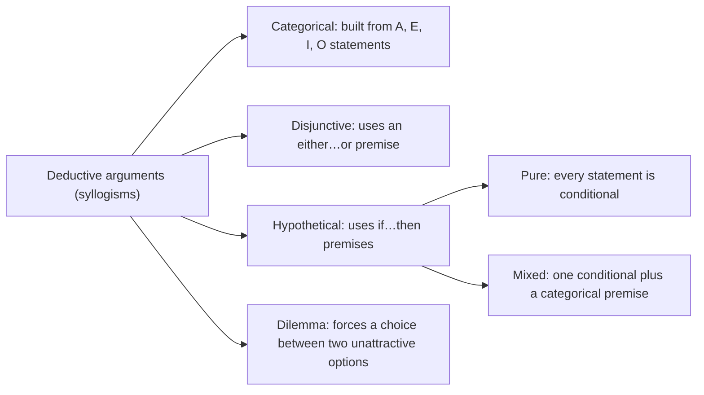

## What Is Logic?

Logic is often defined as **"the science of the laws of thought"**. The textbook (Ekanola) finds this **too vague**: **psychology** is also a science of the laws of thought. A better definition is:

> **Logic is the study of the laws of reasoning.**

**Reasoning** is a type of thought marked by **the making of inferences** — reaching **conclusions** on the basis of **premises**. The process of **deriving a conclusion from premises** is called **inference**. Because logic studies reasoning, its **primary concern is to distinguish correct reasoning from incorrect reasoning**.

Logic helps us reason **clearly and correctly** in two ways:

1. by **identifying, examining and analysing errors in reasoning**, called **fallacies**;
2. by giving us **techniques for testing** whether our reasoning or arguments are correct.

### The three laws of thought

These are **basic principles that any correct reasoning must obey**. They guide the making of meaningful statements: **for any statement or argument to be meaningful and correct, they must be obeyed.**

| Law | What it says | Logical form |
|---|---|---|
| **Law of Identity** | **If any statement is true, then it is true** | `p ⊃ p` — a **tautology** (always true) |
| **Law of (Non-)Contradiction** | **No statement can be both true and false** | `p · ~p` is **always false** — every statement of this form is a **self-contradiction** |
| **Law of Excluded Middle** | **Every statement is either true or false** — there is no third, "middle" option | `p v ~p` — always true |

Test each law yourself. The table checks **every possible truth value** of `p`:

<Tabs>
<Tab label="Identity">
<TruthTable title="Law of Identity" formula="p ⊃ p" />
</Tab>
<Tab label="Non-contradiction">
<TruthTable title="Law of Non-Contradiction" formula="p · ~p" />
</Tab>
<Tab label="Excluded middle">
<TruthTable title="Law of Excluded Middle" formula="p v ~p" />
</Tab>
</Tabs>

Notice that `p · ~p` comes out **F in every row** — a contradiction. The law of non-contradiction is really the claim that `~(p · ~p)` is always true. Type `~(p · ~p)` into the box to see it become a tautology.

<ExamTip>
Past papers ask: **"One of these is among the basic laws of thought"** — the answer is the **Law of Identity** (never "law of induction", "law of deduction" or "law of possibility"). Learn all three: **identity, non-contradiction, excluded middle**.
</ExamTip>

---

## Informal Logic and Formal Logic

| | Informal logic | Formal logic |
|---|---|---|
| **Concern** | Our **everyday activities** of making, establishing and evaluating claims, and **detecting errors** in reasoning | The **logical or formal structure** of statements and arguments, **ignoring their content** |
| **Language** | Arguments in **natural, ordinary language** — in discussions, debates and disagreements in daily life | Deductive arguments in natural language **and in artificial (symbolic) language** |
| **Aim** | The habit of **straight, clear and correct reasoning**: avoiding **fallacies and ambiguities** and promoting **effective communication** | To determine the **logical truth** of statements and the **validity** of arguments — purely by their **form** |
| **Typical topics** | The **nature**, **identification** and **kinds** of arguments; **fallacies** | Propositional (sentential) logic, **symbolic logic**, categorical syllogisms, **rules of inference** |
| **Described as** | The logic of real-life argument | **"The science of pure forms"** — postulates, theorems and axioms that are conceptually valid and formally consistent |

---

## Arguments

### The nature of an argument

An **argument** is a set of statements (propositions) with **two components**:

- at least one **premise** — the **justification, reason or ground** offered;
- at least one **conclusion** — the **main claim, belief or position** being put forward for acceptance.

The premises must be related to the conclusion so that they **provide support or grounds for accepting it**. A string of statements with no such support relation — a story, a list, a set of instructions — is **not** an argument.

**There is no fixed order.** The conclusion may come **last, first, or even between the premises**:

| Example | Where the conclusion is |
|---|---|
| **All men are mortal. Aristotle is a man. Therefore, Aristotle is mortal.** | **Last** statement |
| **All politicians are liars.** Adebayo is a politician and he lies a lot. Isiak is a politician and a known liar. Jonathan is a politician and a liar. | **First** statement |
| Government has decided to remove oil subsidy by 2012. Therefore, **the masses are bracing up for a mass protest against the subsidy removal.** People generally believe that this would further worsen the economic hardship in the country. | **In the middle** |

### Standard form and indicator words

Logicians rewrite arguments in **standard form**: **premises first, then the conclusion**, marked with the **therefore sign ∴**.

> All lawyers are liars.<br />
> Aderemi is a lawyer.<br />
> ∴ Aderemi is a liar.

In everyday speech, arguments come in many shapes, so we look for **indicator words**:

| Premise indicators (a premise follows) | Conclusion indicators (the conclusion follows) |
|---|---|
| since, because, for, as, following from, in view of, as shown by, inasmuch as, is substantiated by, as indicated by, the reason is that, for the reason that, may be inferred from, may be derived from, in view of the fact that | therefore, hence, thus, it is the case that, in consequence, as a result, proves that, accordingly, it follows that, we may infer that, I conclude that, which shows that, which means that, which allows us to infer that, which implies, which points to the conclusion that |

<Analogy>
Think of a premise indicator as an arrow pointing **forward to a reason** ("…**because** the ground is wet") and a conclusion indicator as an arrow pointing **forward to the claim** ("…**therefore** it rained"). A trick: put "**because**" in front of the sentence. If it reads naturally as a reason, it is a premise.
</Analogy>

<SortingGame title="Premise indicator or conclusion indicator?">

```sort
@buckets Premise indicator | Conclusion indicator
since => Premise indicator :: "Since" introduces the reason.
hence => Conclusion indicator :: "Hence" announces what follows from the reasons.
for the reason that => Premise indicator :: It literally introduces a reason.
accordingly => Conclusion indicator :: "Accordingly" introduces the claim being supported.
may be inferred from => Premise indicator :: "X may be inferred from Y" — Y is the premise.
it follows that => Conclusion indicator :: What follows is the conclusion.
because => Premise indicator :: The classic premise indicator.
thus => Conclusion indicator :: A classic conclusion indicator.
as shown by => Premise indicator :: What follows is the evidence.
which implies => Conclusion indicator :: What is implied is the conclusion.
```

</SortingGame>

<ExamTip>
A past question read: *"Oil reserves are finite. Accordingly, since consumption is continuously rapid, eventually the world will run out of oil."* The answer key circulating among students gives **"Oil reserves are finite"** as the conclusion — **that is wrong**. "**Accordingly**" announces the conclusion and "**since**" marks a premise, so the conclusion is **"eventually the world will run out of oil"**. The two premises are *oil reserves are finite* and *consumption is rapid*.
</ExamTip>

---

## Inductive and Deductive Arguments

### Inductive arguments

In an **inductive argument** one typically reasons **from particular premises to a universal conclusion**. The premises **do not give conclusive, one-hundred-percent support**: the support may be **strong, weak or nil, but never total**. **You can accept the premises and deny the conclusion without contradicting yourself.**

1. **Particular → universal:** Awolowo is human and is mortal. Azikiwe is human and is mortal. Ojukwu is human and is mortal. Therefore, **probably** all humans are mortal.
2. **Universal → universal:** All goats are mammals and have hearts. All dogs are mammals and have hearts. All donkeys are mammals and have hearts. Therefore, probably all mammals have hearts.
3. **Particular → particular:** Idi Amin was a dictator and was ruthless. Abacha was a dictator and was ruthless. Castro is a dictator. Therefore, Castro is probably ruthless.

### Deductive arguments

A **deductive argument** typically moves **from universal premises to a particular conclusion**, but sometimes from **universal premises to a universal conclusion**. Its premises provide **conclusive grounds — 100% support**: **the premises logically imply the conclusion**, so **if the premises are true, the conclusion cannot be false**.

1. All humans are mortal. Awolowo is human. Therefore, Awolowo is mortal.
2. Every mammal can reproduce. All dogs are mammals. Therefore, every dog can reproduce. *(universal → universal)*

| | Deductive | Inductive |
|---|---|---|
| **Support** | If all the premises are true, the conclusion **must necessarily** be true | If all the premises are true, the conclusion is **probably, but not necessarily**, true |
| **Content** | All the information in the conclusion is **already contained, at least implicitly, in the premises** | The conclusion **goes beyond the premises** — it contains information not in them, even implicitly |
| **Appraised as** | **Valid or invalid**; sound or unsound | **Strong or weak** (more or less probable) |
| **Signal words** | necessarily, must, certainly | probably, likely, it is reasonable to expect |

**A note beyond the textbook:** the textbook's own examples show that "universal to particular" and "particular to universal" are only **rough guides**. Modern logicians define the difference by **the kind of support the premises give**: **necessity** (deductive) or **probability** (inductive). When in doubt, ask: *could the premises all be true and the conclusion still be false?* If **no**, the argument is deductive; if **yes, but it is unlikely**, it is inductive.

<SortingGame title="Deductive or inductive? (the textbook's exercises and past questions)">

```sort
@buckets Deductive | Inductive
Sugar is a cube; therefore, it has six sides => Deductive :: Having six faces is part of what "cube" means, so the conclusion follows necessarily.
The lights were out and the car was gone, so we concluded that nobody was home => Inductive :: The evidence makes the conclusion likely, not certain — someone could be asleep inside.
Jonathan said he would stay in Abuja or go to Yenagoa for Christmas. He didn't stay in Abuja, so he must have gone to Yenagoa => Deductive :: A disjunctive syllogism: if the premises are true, the conclusion must be.
Every human breathes. John is human, so he breathes => Deductive :: Universal premise to particular conclusion, with full support.
Everyone interested in the job must write an examination. Benson wrote the examination, so he probably was interested in the job => Inductive :: "Probably" — Benson might have written it for another reason.
Every horse that has ever been observed has had a heart, therefore every horse has a heart => Inductive :: From observed cases to all cases — the conclusion goes beyond the evidence.
It rained every April from 2010 to 2019. Therefore, it will rain in April 2020 => Inductive :: A prediction from past cases; the future may differ.
All bachelors are unmarried men. Adamu is a bachelor. Consequently, Adamu is an unmarried man => Deductive :: If the premises are true, the conclusion cannot be false.
All humans are mortal. Albert Einstein is human. Therefore, Albert Einstein is mortal => Deductive :: The textbook's model deductive pattern.
```

</SortingGame>

<ExamTip>
A past question asked about **"The carton is a cube; therefore, it has six sides"** and the circulating key says **inductive**. By the textbook's own exercise (sugar cube) and its definitions, this is **deductive**: a cube has six faces **by definition**, so the conclusion **cannot** be false if the premise is true. Also remember: *an argument whose conclusion contains more information than its premises is* **inductive**.
</ExamTip>

---

## Truth, Validity and Soundness

- **Truth and falsity** belong **only to propositions** (statements), **never to arguments**.
- **Validity and invalidity** belong **only to deductive arguments**.
- **Soundness** belongs to deductive arguments that are **valid and have true premises**.

An argument is **valid** if its **premises logically imply its conclusion**: it is **impossible to accept the premises and deny the conclusion without self-contradiction**. **Validity is formal** — it depends on the **form** of the argument, not on whether its premises are actually true. So:

- if an argument is valid, **every argument with the same form is valid**;
- if an argument is invalid, **every argument with that form is invalid**;
- a valid argument **can have false premises and a false conclusion**.

**The textbook says** a deductive argument is invalid "only when its premises are true and the conclusion false". More precisely, an argument is invalid when it is **possible** for its premises to be true while its conclusion is false. It need not actually have true premises and a false conclusion.

An argument is **sound** if it is **valid and all its premises are true** (its conclusion is then guaranteed to be true). **Unless an argument is valid, it cannot be sound.**

| The argument is… | True premises, true conclusion | True premises, **false** conclusion | False premise(s), true conclusion | False premise(s), false conclusion |
|---|---|---|---|---|
| **Valid** | ✅ possible — and **sound** | ❌ **impossible** | ✅ possible (unsound) | ✅ possible (unsound) |
| **Invalid** | ✅ possible (unsound) | ✅ possible (unsound) | ✅ possible (unsound) | ✅ possible (unsound) |

**Sound arguments from the textbook:**

- All goats are mammals. All mammals have lungs. Therefore, all goats have lungs.
- All humans breathe. All Nigerians are human beings. Therefore, all Nigerians breathe.
- All Ghanaians are Africans. All Akans are Ghanaians. Therefore, Akans are Africans.

**Valid but unsound:** All Nigerians are footballers. Wole Soyinka is Nigerian. Therefore, Wole Soyinka is a footballer. The **form** is perfect, but the **first premise is false**.

<SortingGame title="Sound, valid but unsound, or invalid?">

```sort
@buckets Sound | Valid but unsound | Invalid
All birds have feathers. All eagles are birds. Therefore, all eagles have feathers => Sound :: Valid form and both premises are true.
All fish can fly. All sharks are fish. Therefore, all sharks can fly => Valid but unsound :: The form is valid, but the first premise is false.
All Lagosians are Nigerians. Tunde is Nigerian. Therefore, Tunde is a Lagosian => Invalid :: The premises can be true while the conclusion is false — Tunde may live in Kano.
All metals conduct electricity. Copper is a metal. Therefore, copper conducts electricity => Sound :: Valid and true premises.
All students are millionaires. Ada is a student. Therefore, Ada is a millionaire => Valid but unsound :: The form guarantees the conclusion only if the premises are true — the first is not.
If it rains, the road is wet. The road is wet. Therefore, it rained => Invalid :: The road could be wet from a burst pipe. This is the fallacy of affirming the consequent.
```

</SortingGame>

---

## Formal Logic and the Logical Connectives

**Formal logic** looks at **deductive connections between statements** without regard to their content. Its aim is to settle the **logical truth** of statements and the **validity** of arguments, **purely by their structure**.

**Sentential (propositional) logic** is a major traditional system of formal logic and **the foundation of symbolic logic**. It studies how **atomic (simple) statements** are combined into **compound statements** by **logical connectives**, and how statements are modified by denial.

Besides the connectives, propositional logic uses **propositional letters**. These symbols display the **logical form** of propositions and arguments with **clarity, brevity and precision**, and free us from **emotional attachment** to what a sentence says in natural language.

| Propositional **variables** | Propositional **constants** |
|---|---|
| **Lower-case letters** p, q, r, s, t, u… | **Upper-case letters** A to Z |
| Each stands for **any statement whatsoever**; an expression built from them is a **statement form** (propositional function) | Each stands for **one particular** simple statement: B for "the boy is laughing", G for "the girl is crying" |
| Used to state **forms**: `p ⊃ q` | Used to symbolise **actual sentences**: `B · G` |

**Rule for constants:** any letter may represent any sentence, but **two letters must not stand for the same sentence**, and **the same letter must not stand for two different sentences** in the same context.

There are **five standard forms of compound statement**:

| Connective | Symbol and its name | Parts of the compound | Example | Symbolised |
|---|---|---|---|---|
| **not / it is not the case that** (negation) | `~` the **curl** (also called the **wave** or **tilde**) | — | It is not the case that Smith is the owner of the car | `~S` |
| **and** (conjunction) | `·` the **dot** | **conjuncts** | Peter and James are apostles of the early church | `P · J` |
| **or** (disjunction) | `v` the **vee** or **wedge** | **disjuncts** | Smith will eat bread for breakfast or he will go hungry | `B v H` |
| **if … then** (conditional) | `⊃` the **horseshoe** | **antecedent** (after "if") and **consequent** (after "then") | If he gets the money, then he will squander it on women | `M ⊃ W` |
| **if and only if** (biconditional) | `≡` the **triple bar** | **components** | I will give you the money if and only if you stop lying | `M ≡ L` |

In the textbook, and in many typed exam papers, the horseshoe is printed as `>` and the curl as `-` or `~`. The truth-table tools in this lesson accept all of these. The textbook's list of variables also includes "v", which is easily confused with the wedge. The tools therefore treat a lower-case v **only as "or"**, so use other letters for statements.

**Many ways to negate.** "Smith is the owner of the car" can be denied as: *It is not Smith that owns the car. It is not the case that Smith is the owner of the car. It is false (not true) that Smith is the owner of the car. That "Smith is the owner of the car" is false (not true).* All of them are `~S`.

**Truth values.** Each connective is **truth-functional**: the truth of the compound depends only on the truth of its parts.

| `p` | `q` | `~p` | `p · q` | `p v q` | `p ⊃ q` | `p ≡ q` |
|---|---|---|---|---|---|---|
| T | T | F | T | T | T | T |
| T | F | F | F | T | **F** | F |
| F | T | T | F | T | T | F |
| F | F | T | F | F | T | T |

Points students often miss:

- **The negation of a false statement is true** (and of a true statement, false).
- `v` is **inclusive**: "p or q" is true when **both** are true.
- A **conditional is false in only one case**: a **true antecedent with a false consequent**. "If you pass GST212, I will buy you a phone" is broken only if you pass and get no phone.

### Quantifiers

Two further symbols quantify statements:

- **Universal quantifier** `(x)` — read **"given any x"**; it stands for **"all"**.
- **Existential quantifier** `(∃x)` — read **"there is at least one x"**; it stands for **"some"**.

*(Beyond the textbook: strictly, quantifiers belong to **predicate (quantificational) logic**, which extends propositional logic. The textbook presents them alongside the propositional connectives.)*

### Well-formed formulas

**Symbolic logic** is formal logic in an **artificial language**. It uses **propositional variables** (p, q, r…), **connectives** and **brackets** to build **formulas** — for example `p ⊃ (p · q)`.

A random jumble of symbols is **not** a formula. A formula must be **well-formed** (a **wff**):

1. a **propositional variable** on its own is well-formed — "Helen is a teacher" as `p`;
2. a well-formed formula preceded by the **negation sign** is well-formed — `~p`: "It is not the case that Helen is a teacher";
3. two well-formed formulas **joined by a connective** form a well-formed formula — "If it rains then the ground is wet" as `p ⊃ q`.

**Brackets work like punctuation** and remove ambiguity. The textbook's example loses a symbol in print: the ambiguous string is `p · q ⊃ r`, which could mean either `(p · q) ⊃ r` or `p · (q ⊃ r)`. These two formulas are **not** equivalent. Compare their final columns, especially the rows where `p` is false:

<Tabs>
<Tab label="(p · q) ⊃ r">
<TruthTable title="Brackets around p · q" formula="(p · q) ⊃ r" />
</Tab>
<Tab label="p · (q ⊃ r)">
<TruthTable title="Brackets around q ⊃ r" formula="p · (q ⊃ r)" />
</Tab>
</Tabs>

<SortingGame title="Which connective is the main one?">

```sort
@buckets Negation | Conjunction | Disjunction | Conditional | Biconditional
It is not true that fuel prices fell this year => Negation :: A denial of one simple statement.
Chioma passed and Emeka failed => Conjunction :: Two conjuncts joined by "and".
Either the lecturer is sick or the class has been cancelled => Disjunction :: Two disjuncts joined by "or".
If the generator is off, then the fan will stop => Conditional :: Antecedent "the generator is off", consequent "the fan will stop".
You will graduate if and only if you pass all your core courses => Biconditional :: "If and only if" — the triple bar.
ASUU is on strike, but lectures are holding in private universities => Conjunction :: "But" is logically an "and" — both claims are asserted.
Unless you register, you cannot write the exam => Disjunction :: "Unless" is usually symbolised with the wedge: you register or you cannot write the exam.
```

</SortingGame>

---

## Categorical Propositions: A, E, I and O

A **categorical syllogism** — the most important argument form in traditional formal logic — is built from **categorical propositions**: simple statements that **categorically assert or deny** something of a class. They come in **four standard forms**:

| Letter | Name | Standard form | Textbook example |
|---|---|---|---|
| **A** | **Universal affirmative** | **All** S are P | All goats eat salad |
| **E** | **Universal negative** | **No** S are P | No goats eat salad |
| **I** | **Particular affirmative** | **Some** S are P | Some goats are big |
| **O** | **Particular negative** | **Some** S are **not** P | Some goats are not big |

**The textbook mislabels two of these.** Its list prints "I: No goats eat salad" and "E: Some goats are big". The correct traditional letters are **E for "No…"** and **I for "Some… are…"**, as in the table above. The letters come from the Latin **AffIrmo** ("I affirm": A and I are affirmative) and **nEgO** ("I deny": E and O are negative).

### Distribution *(needed for the rules below)*

A term is **distributed** when the proposition refers to **all the members** of the class it names; otherwise it is **undistributed**.

| Form | Subject term | Predicate term |
|---|---|---|
| **A** — All S are P | **distributed** | undistributed |
| **E** — No S are P | **distributed** | **distributed** |
| **I** — Some S are P | undistributed | undistributed |
| **O** — Some S are not P | undistributed | **distributed** |

Memory aid: **A** distributes the **S**ubject, **E** distributes **B**oth, **I** distributes **N**othing, **O** distributes the **P**redicate — "**Any Student Earning Bs Is Not On Probation**" (A-S, E-B, I-N, O-P).

### Translating into standard form

Ordinary language is too rich for a complete rulebook, so these techniques are **guides, not strict rules**. You must first **understand** the sentence.

| Type of sentence | Example | Standard form |
|---|---|---|
| **1. Adjective as predicate** (a property, not a class) | Some students are brilliant | **Some students are brilliant persons** (**I**) |
| **2. Main verb other than "to be"** | All men eat | **All men are eaters** (**A**) |
| **3. Words out of order** | Rottweilers are all purebreds | **All rottweilers are purebreds** (**A**) |
| **4. "Every" and "any"** | Every man has his philosophy of life; any person can easily do the job | **All men are beings with a philosophy of life**; **all persons are beings who can easily do the job** (**A**) |
| **5. Exclusive propositions ("only", "none but")** | Only men can become kings; none but women can give birth to babies | **All those who can become kings are men**; **all those who can give birth to babies are women** — note that **subject and predicate swap** (**A**) |
| **6. No quantifier** — use the **context** | Men are rational; children are playing in the park | **All men are rational beings** (**A**); **some children are playing in the park** (**I**) |
| **7. Other non-standard forms** | Not all husbands beat their wives; there are square circles; there are no square circles | **Some husbands are not wife-beaters** (**O**); **some squares are circles** (**I**); **no squares are circles** (**E**) |

**Two slips in the textbook:**

- It says "some students are brilliant" corresponds to the **E** proposition. It is an **I** proposition (particular affirmative).
- It translates "all men eat" as "**some** men are eaters". The quantifier "all" must be kept: **"All men are eaters"**. Changing "all" to "some" changes the claim.

<SortingGame title="A, E, I or O?">

```sort
@buckets A (All S are P) | E (No S are P) | I (Some S are P) | O (Some S are not P)
All goats eat salad => A (All S are P) :: Universal affirmative.
No goats eat salad => E (No S are P) :: Universal negative — not I, despite the textbook's list.
Some goats are big => I (Some S are P) :: Particular affirmative — not E, despite the textbook's list.
Some students are brilliant => I (Some S are P) :: Some students are brilliant persons — particular affirmative.
Not all husbands beat their wives => O (Some S are not P) :: Some husbands are not wife-beaters.
Only men can become kings => A (All S are P) :: All those who can become kings are men.
Every Nigerian student must register for NYSC after graduating => A (All S are P) :: "Every" becomes "all".
There are no square circles => E (No S are P) :: No squares are circles.
Children are playing in the park => I (Some S are P) :: The context shows only some children are meant.
Some politicians are not honest => O (Some S are not P) :: Particular negative.
```

</SortingGame>

---

## Kinds of Deductive Argument (Syllogisms)

Deductive arguments are often called **syllogisms**. The textbook names four kinds:



| Kind | Example |
|---|---|
| **Categorical syllogism** — categorical statements that firmly assert or deny | All humans are rational. Nigerians are human. Therefore, Nigerians are rational. |
| **Disjunctive syllogism** — a disjunctive premise, which asserts that **at least one** of two claims is true (possibly both) | Either John is the messiah or there is no hope for his followers. John is not the messiah. Therefore, there is no hope for his followers. |
| **Pure hypothetical syllogism** — **only** conditional statements | If it rains, the soil will be moist. If the soil is moist, the crops will grow very fast. Therefore, if it rains, the crops will grow very fast. |
| **Mixed hypothetical syllogism** — a conditional plus a categorical premise | If you lie, I will not marry you again. You lie. Therefore, I will not marry you again. |
| **Dilemma** — puts the hearer between **two unattractive options** | If I tell the truth, I will not be given my lunch. If I don't tell the truth, I will suffer from a bad conscience. Therefore, whatever I say, I will either go hungry or suffer from a bad conscience. |

*(The first two premises of the pure hypothetical example above are supplied here; the scanned page cuts them off before the textbook's conclusion "Therefore, if it rains, then the crops would grow very fast". The dilemma also relies on an unstated premise: "Either I tell the truth or I don't".)*

### The anatomy of a categorical syllogism

Every standard categorical syllogism has **exactly three terms**, each appearing **twice**:

| Term | Where it appears |
|---|---|
| **Major term** | The **predicate of the conclusion**; also appears in the **major premise** |
| **Minor term** | The **subject of the conclusion**; also appears in the **minor premise** |
| **Middle term** | In **both premises** but **not in the conclusion** — it links the other two |

In *All humans are rational. Nigerians are human. Therefore, Nigerians are rational*: the major term is **rational**, the minor term is **Nigerians**, and the middle term is **human(s)**.

---

## Testing Validity: The Six Rules of the Categorical Syllogism

A syllogism that **passes all six rules is valid**. One that **breaks any rule is invalid** — or **fallacious** — and each broken rule has its own fallacy.

<FlowDiagram title="How to test a categorical syllogism">
<FlowStep title="1. Put it in standard form">
Translate every statement into A, E, I or O form and list the premises before the conclusion.
</FlowStep>
<FlowStep title="2. Find the terms">
The **subject of the conclusion** is the minor term, its **predicate** is the major term, and the term found **only in the premises** is the middle term. Check that each term keeps **one meaning** throughout.
</FlowStep>
<FlowStep title="3. Mark the distributed terms">
Use the A-S, E-B, I-N, O-P rule for every statement.
</FlowStep>
<FlowStep title="4. Run the six rules">
Three terms? Middle distributed at least once? No term distributed in the conclusion without being distributed in its premise? Negative premise gives a negative conclusion? Not two negative premises? No particular conclusion from two universal premises?
</FlowStep>
</FlowDiagram>

| Rule | If broken, the fallacy is… | Textbook example |
|---|---|---|
| **1. Exactly three terms, each used in the same sense throughout** | **Four terms** (*quaternio terminorum*) | All **banks** are usually soft and wet. Where you deposit your money are **banks**. Therefore, where you deposit your money is usually soft and wet. "Bank" means a **riverside** in the first premise and a **place for money** in the second, so there are really **four** terms. |
| **2. The middle term must be distributed at least once** | **Undistributed middle** | All dogs are animals raised for security purposes. Some crocodiles are animals raised for security purposes. Therefore, crocodiles are dogs. "Animals raised for security" is the predicate of an **A** and of an **I** — **undistributed both times**. |
| **3. A term distributed in the conclusion must be distributed in its premise** | **Illicit major** (major term) or **illicit minor** (minor term) | All politicians are dubious characters. All politicians aspire to occupy elective positions. Therefore, all those who aspire to occupy elective positions are dubious characters. The conclusion speaks of **all** aspirants, but the premises do not. **Illicit minor.** |
| **4. If one premise is negative, the conclusion must be negative** | **Affirmative conclusion from a negative premise** | Some good husbands do not beat their wives. All boxers beat their wives. Therefore, all boxers are good husbands. |
| **5. No valid syllogism has two negative premises** | **Exclusive premises** | No dogs eat grass. Some birds do not eat grass. Therefore, some birds are not dogs. Nothing follows from two denials. |
| **6. Two universal premises cannot yield a particular conclusion** | **Existential fallacy** | All mature cockerels crow in the morning. No broiler crows in the morning. Therefore, some broilers are not mature cockerels. **Particular** statements assert that something **exists**; **universal** ones are really **conditional** ("if anything is a cockerel…") and do not. |

**The textbook muddles Rule 3.** Its explanation describes the **major term** being undistributed in the major premise but distributed in the conclusion. That is the **illicit major**. Yet it names the fallacy **illicit minor** and gives an illicit-minor example. Keep them apart:

- **Illicit major:** the **major term** is distributed in the **conclusion** but **not in the major premise**. *All engineers are graduates. No lawyers are engineers. Therefore, no lawyers are graduates.* "Graduates" is distributed in the E conclusion, but not in the A premise.
- **Illicit minor:** the **minor term** is distributed in the **conclusion** but **not in the minor premise** — the politicians example above.

*(Beyond the textbook: Rule 6 belongs to the modern, "Boolean" reading of universals. Aristotle's traditional logic assumed that every class mentioned has members, and counted the cockerel argument as valid.)*

<SortingGame title="Which rule does each syllogism break?">

```sort
@buckets Four terms | Undistributed middle | Illicit major | Illicit minor | Affirmative from negative | Exclusive premises | Existential fallacy
A pen is a writing tool. The farmer keeps his pigs in a pen. Therefore, the farmer keeps his pigs in a writing tool => Four terms :: "Pen" shifts meaning, from a writing tool to an animal enclosure.
All Arsenal fans wear red. Some of my classmates wear red. Therefore, some of my classmates are Arsenal fans => Undistributed middle :: "People who wear red" is the predicate of an A and an I, so it is never distributed.
All cats are mammals. All dogs are mammals. Therefore, all dogs are cats => Undistributed middle :: "Mammals" is the predicate of two A propositions.
All engineers are graduates. No lawyers are engineers. Therefore, no lawyers are graduates => Illicit major :: "Graduates" is distributed in the E conclusion but not in the A major premise.
All lecturers are graduates. All lecturers are employees. Therefore, all employees are graduates => Illicit minor :: The conclusion covers all employees; the premise "all lecturers are employees" does not.
No reptiles are warm-blooded. All snakes are reptiles. Therefore, all snakes are warm-blooded => Affirmative from negative :: A negative premise can only support a negative conclusion.
No fish are mammals. Some pets are not fish. Therefore, some pets are not mammals => Exclusive premises :: Both premises are negative.
All students who score 100% in every course get a free laptop. All students who score 100% in every course are geniuses. Therefore, some geniuses get a free laptop => Existential fallacy :: Two universal premises do not guarantee that any such student exists; "some" asserts existence.
```

</SortingGame>

<Reveal question="Worked example: test 'All Christians are believers. Some Nigerians are not believers. Therefore, some Nigerians are not Christians.'">
**Terms:** minor = Nigerians, major = Christians, middle = believers — **three terms**, each used in one sense (Rule 1 ✓).

**Distribution:** Premise 1 (A) distributes *Christians*. Premise 2 (O) distributes *believers*. The conclusion (O) distributes *Christians*.

- Rule 2 ✓ — the middle term *believers* is distributed in premise 2.
- Rule 3 ✓ — *Christians* is distributed in the conclusion and in premise 1; *Nigerians* is not distributed in the conclusion.
- Rule 4 ✓ — one negative premise, negative conclusion.
- Rule 5 ✓ — only one negative premise.
- Rule 6 ✓ — the conclusion is particular, and one premise is particular.

**Valid.** (Whether it is **sound** depends on whether the premises are true.)
</Reveal>

---

## The Nine Valid Argument Forms

Propositional logic has a number of **valid argument forms**. They serve two functions:

1. **Recognising valid arguments.** Any argument with the **form of a valid argument form is valid**, and any argument with the form of an invalid one is invalid.
2. They are the **rules of inference** in the **method of deduction** — used to prove, step by step, that longer arguments are valid.

| # | Name | Form | In words | Example |
|---|---|---|---|---|
| 1 | **Modus Ponens** (MP) | `p ⊃ q, p ∴ q` | A conditional plus **its antecedent** imply **the consequent** | If NEPA takes the light, the freezer defrosts. NEPA took the light. So the freezer defrosts. |
| 2 | **Modus Tollens** (MT) | `p ⊃ q, ~q ∴ ~p` | A conditional plus **the denial of its consequent** imply **the denial of its antecedent** | If she wrote the exam, her name is on the list. Her name is not on the list. So she did not write the exam. |
| 3 | **Simplification** (Simp) | `p · q ∴ p` | A true conjunction implies **either conjunct** | Kano and Kaduna are northern states. So Kano is a northern state. |
| 4 | **Disjunctive Syllogism** (DS) | `p v q, ~p ∴ q` | A disjunction plus **the denial of one disjunct** imply **the other disjunct** | He is in the library or in the hostel. He is not in the library. So he is in the hostel. |
| 5 | **Addition** (Add) | `p ∴ p v q` | A true statement makes **any disjunction containing it** true | Lagos is in Nigeria. So Lagos is in Nigeria or Accra is in Togo. |
| 6 | **Conjunction** (Conj) | `p, q ∴ p · q` | Two true statements imply **their conjunction** | Ada passed. Obi passed. So Ada and Obi passed. |
| 7 | **Hypothetical Syllogism** (HS) | `p ⊃ q, q ⊃ r ∴ p ⊃ r` | If one proposition implies a second, and the second implies a third, **the first implies the third** | If fuel price rises, transport fares rise. If transport fares rise, food prices rise. So if fuel price rises, food prices rise. |
| 8 | **Constructive Dilemma** (CD) | `(p ⊃ q) · (r ⊃ s), p v r ∴ q v s` | Two conditionals plus **the disjunction of their antecedents** imply **the disjunction of their consequents** | If I study law, I spend six years. If I study medicine, I spend seven years. I will study law or medicine. So I will spend six years or seven. |
| 9 | **Destructive Dilemma** (DD) | `(p ⊃ q) · (r ⊃ s), ~q v ~s ∴ ~p v ~r` | Two conditionals plus **the disjunction of the denials of their consequents** imply **the disjunction of the denials of their antecedents** | If he is honest, he will return the money; if he is wise, he will apologise. Either he will not return the money or he will not apologise. So either he is not honest or he is not wise. |

*(The textbook's printed conclusion for the destructive dilemma is garbled. The correct conclusion is `~p v ~r`.)*

### Check any argument with a truth table

An argument form is valid if **there is no row** in which **all the premises are true and the conclusion false**. The rows where all the premises are true are the **critical rows**; if the conclusion is true in every one, the argument is valid. Edit the premises (separate them with semicolons) and the conclusion to test any form:

<TruthTable title="Is this argument valid? (Modus Ponens)" premises="p ⊃ q; p" conclusion="q" />

Now look at the **Benson exercise** read as a deduction: *if Benson was interested, he wrote the exam; he wrote the exam; so he was interested.* That is `p ⊃ q, q ∴ p` — the **fallacy of affirming the consequent** *(beyond the textbook)*. The table finds the counterexample row: Benson wrote the exam **without** being interested. This is why the textbook adds "probably" and counts the argument as **inductive**.

<TruthTable title="Affirming the consequent — try Modus Tollens instead" premises="p ⊃ q; q" conclusion="p" />

Try changing the premises above to `p ⊃ q; ~q` with conclusion `~p` (Modus Tollens), then to `p ⊃ q; ~p` with conclusion `~q` — the invalid **denying the antecedent**.

<SortingGame title="Name the valid argument form">

```sort
@buckets Modus Ponens | Modus Tollens | Simplification | Disjunctive Syllogism | Addition | Conjunction | Hypothetical Syllogism | Constructive Dilemma
Buhari is the president of Nigeria. Therefore, either Buhari is the president of Nigeria or Nigeria will disintegrate => Addition :: From p to p v q — a disjunct is added. It is NOT a disjunctive syllogism, which needs a disjunction as a premise.
The exam is either on Monday or on Friday. It is not on Monday. So it is on Friday => Disjunctive Syllogism :: p v q, ~p, therefore q.
If you are a UI student, you have a matric number. You are a UI student. So you have a matric number => Modus Ponens :: p ⊃ q, p, therefore q.
If the battery is charged, the phone will turn on. The phone will not turn on. So the battery is not charged => Modus Tollens :: p ⊃ q, ~q, therefore ~p.
Bola is tall and intelligent. So Bola is tall => Simplification :: p · q, therefore p.
The Niger is a river. The Benue is a river. So the Niger and the Benue are rivers => Conjunction :: p, q, therefore p · q.
If I skip breakfast, I get hungry. If I get hungry, I cannot concentrate. So if I skip breakfast, I cannot concentrate => Hypothetical Syllogism :: p ⊃ q, q ⊃ r, therefore p ⊃ r.
If it rains, the match is cancelled; if the pitch floods, the match is postponed. It will rain or the pitch will flood. So the match is cancelled or postponed => Constructive Dilemma :: Two conditionals plus a disjunction of their antecedents.
```

</SortingGame>

<ExamTip>
Past-paper traps:

- **"Buhari is the president of Nigeria. Therefore, either Buhari is the president of Nigeria or Nigeria will disintegrate."** The circulating key says *disjunctive syllogism*, but the form is `p ∴ p v q`: **Addition**. A disjunctive syllogism needs a disjunction **as a premise**.
- **`p v q, ~p ∴ q`** is **disjunctive syllogism**.
- **"The curl is used for…"** → **negation**. **"If a statement is false, its negation is…"** → **true**.
</ExamTip>

---

## Conclusion

This chapter has shown that:

- **logic** is **the study of the laws of reasoning**; it distinguishes **correct from incorrect reasoning**, obeys the **three laws of thought**, and exposes **fallacies**;
- **informal logic** examines everyday arguments, while **formal logic** studies **form**: connectives, symbols, categorical propositions and syllogisms;
- **arguments** consist of **premises and a conclusion**, marked by indicator words, and are **deductive** (necessary support) or **inductive** (probable support);
- **truth** belongs to statements, **validity** to deductive arguments, and **soundness** to valid arguments with true premises;
- validity can be tested by the **six rules of the syllogism** and by the **nine valid argument forms** — and, beyond the textbook, by **truth tables**.

---

## Quick Check

<MCQ question="The textbook prefers to define logic as…">
<Option>the science of the laws of thought</Option>
<Option correct>the study of the laws of reasoning</Option>
<Option>the study of the human mind</Option>
<Option>the art of persuasion</Option>
<Explain>"The science of the laws of thought" is too vague — psychology also studies the laws of thought. Logic studies reasoning, the drawing of inferences, to separate correct from incorrect reasoning.</Explain>
</MCQ>

<MCQ question="Which law of thought holds that every statement is either true or false?">
<Option>Law of identity</Option>
<Option>Law of non-contradiction</Option>
<Option correct>Law of excluded middle</Option>
<Option>Law of induction</Option>
<Explain>Excluded middle: p v ~p. Identity: if a statement is true, it is true (p ⊃ p). Non-contradiction: no statement is both true and false.</Explain>
</MCQ>

<MCQ question="Which type of logic assesses and analyses arguments in our daily use of ordinary language?">
<Option>Formal logic</Option>
<Option correct>Informal logic</Option>
<Option>Symbolic logic</Option>
<Option>Mathematical logic</Option>
<Explain>Informal logic deals with arguments in natural language, as they occur in discussions and debates, and with fallacies.</Explain>
</MCQ>

<MCQ question="Which of the following is a premise indicator?">
<Option>Hence</Option>
<Option>Therefore</Option>
<Option>Consequently</Option>
<Option correct>For the reason that</Option>
<Explain>"For the reason that" introduces a reason (premise). The others announce a conclusion.</Explain>
</MCQ>

<MCQ question="An argument whose conclusion contains more information than its premises is…">
<Option>deductive</Option>
<Option correct>inductive</Option>
<Option>valid</Option>
<Option>sound</Option>
<Explain>An inductive conclusion goes beyond the premises, so the premises give only probable support. A deductive conclusion is already contained, at least implicitly, in its premises.</Explain>
</MCQ>

<MCQ question="A deductive argument that is valid and has true premises is…">
<Option correct>sound</Option>
<Option>inductively strong</Option>
<Option>invalid</Option>
<Option>unsound</Option>
<Explain>Soundness = validity + true premises. An argument must be valid before it can be sound.</Explain>
</MCQ>

<MCQ question="Which combination is impossible for a valid argument?">
<Option>False premises and a false conclusion</Option>
<Option>False premises and a true conclusion</Option>
<Option correct>True premises and a false conclusion</Option>
<Option>True premises and a true conclusion</Option>
<Explain>Validity means the premises cannot all be true while the conclusion is false. Every other combination is possible.</Explain>
</MCQ>

<MCQ question="The horseshoe symbol stands for…">
<Option>and</Option>
<Option>or</Option>
<Option correct>if … then</Option>
<Option>if and only if</Option>
<Explain>Horseshoe = conditional. Dot = and, wedge (vee) = or, triple bar = if and only if, curl = negation.</Explain>
</MCQ>

<MCQ question="'Some goats are big' is which categorical proposition?">
<Option>A</Option>
<Option>E</Option>
<Option correct>I</Option>
<Option>O</Option>
<Explain>Particular affirmative = I. The textbook's list wrongly prints it as E. E is the universal negative ("No goats eat salad").</Explain>
</MCQ>

<MCQ question="'All banks are soft and wet; where you deposit your money are banks; so where you deposit your money is soft and wet' commits the fallacy of…">
<Option>undistributed middle</Option>
<Option correct>four terms</Option>
<Option>illicit minor</Option>
<Option>exclusive premises</Option>
<Explain>"Banks" is used in two senses (riverside and financial institution), so the syllogism has four terms — quaternio terminorum.</Explain>
</MCQ>

<MCQ question="A syllogism with two negative premises commits the fallacy of…">
<Option>existential fallacy</Option>
<Option>illicit major</Option>
<Option correct>exclusive premises</Option>
<Option>affirmative conclusion from a negative premise</Option>
<Explain>Rule 5: no valid categorical syllogism has two negative premises. Nothing follows from two denials.</Explain>
</MCQ>

<MCQ question="'If he is at home, his car is outside. His car is not outside. Therefore, he is not at home.' This is…">
<Option>Modus Ponens</Option>
<Option correct>Modus Tollens</Option>
<Option>Hypothetical Syllogism</Option>
<Option>Disjunctive Syllogism</Option>
<Explain>Denying the consequent to deny the antecedent: p ⊃ q, not q, therefore not p.</Explain>
</MCQ>

## Practice Questions

<Reveal question="1. Define logic, explain why 'the science of the laws of thought' is inadequate, and state the three laws of thought.">
Logic is the study of the laws of reasoning — the making of inferences from premises to conclusions — and its main concern is to distinguish correct from incorrect reasoning. "Science of the laws of thought" fails to separate logic from psychology, which also studies thought. The three laws: identity (if a statement is true, it is true; p ⊃ p, a tautology); non-contradiction (no statement can be both true and false; p · ~p is always false); excluded middle (every statement is either true or false; p v ~p).
</Reveal>

<Reveal question="2. Distinguish informal logic from formal logic.">
Informal logic deals with everyday making, evaluation and criticism of claims in natural language — the nature, identification and kinds of arguments, and fallacies — to build clear, straight reasoning and effective communication. Formal logic deals with the logical structure of statements and arguments regardless of content; it settles logical truth and validity by form alone ("the science of pure forms"), and includes propositional and symbolic logic, categorical syllogisms and rules of inference.
</Reveal>

<Reveal question="3. What is an argument? How do you identify its premises and conclusion?">
An argument is a set of statements in which at least one (the premise) provides support or grounds for another (the conclusion, the main claim). The conclusion can come first, last or between the premises. Put the argument in standard form (premises, then ∴ conclusion) and use indicators: premise indicators such as since, because, for, as shown by, for the reason that, may be inferred from; conclusion indicators such as therefore, hence, thus, accordingly, it follows that, which implies.
</Reveal>

<Reveal question="4. Distinguish deductive from inductive arguments, with examples.">
Deductive: the premises give conclusive (100%) support — if they are true, the conclusion must be true; the conclusion's content is already in the premises; usually universal to particular (All humans are mortal; Awolowo is human; so Awolowo is mortal). Inductive: the premises give only probable support; the conclusion goes beyond them; you can accept the premises and deny the conclusion without contradiction; usually particular to universal (Awolowo, Azikiwe and Ojukwu were human and mortal; so probably all humans are mortal). Inductive arguments can also run universal to universal, or particular to particular.
</Reveal>

<Reveal question="5. Explain truth, validity and soundness.">
Truth and falsity belong to propositions; validity and invalidity belong only to deductive arguments. An argument is valid when it is impossible for its premises to be true and its conclusion false — validity depends on form, so every argument of a valid form is valid, and a valid argument can have false premises. An argument is sound when it is valid and all its premises are true; an invalid argument can never be sound.
</Reveal>

<Reveal question="6. Name the logical connectives, their symbols and their parts.">
Negation — the curl (~), "not / it is not the case that". Conjunction — the dot (·), "and", parts called conjuncts. Disjunction — the vee or wedge (v), "or", parts called disjuncts. Conditional — the horseshoe (⊃), "if … then", with antecedent and consequent. Biconditional — the triple bar (≡), "if and only if", with components. The quantifiers are (x), universal ("all"), and (∃x), existential ("some").
</Reveal>

<Reveal question="7. State the four standard categorical propositions and translate: 'All men eat', 'Only men can become kings', 'Not all husbands beat their wives'.">
A: All S are P (universal affirmative). E: No S are P (universal negative). I: Some S are P (particular affirmative). O: Some S are not P (particular negative). Translations: All men are eaters (A — the textbook's "some men are eaters" is a slip); all those who can become kings are men (A); some husbands are not wife-beaters (O).
</Reveal>

<Reveal question="8. State the six rules of the categorical syllogism and the fallacy that breaking each one commits.">
1. Exactly three terms, each used in one sense — fallacy of four terms (quaternio terminorum). 2. The middle term must be distributed at least once — undistributed middle. 3. A term distributed in the conclusion must be distributed in its premise — illicit major (major term) or illicit minor (minor term). 4. If a premise is negative, the conclusion must be negative — affirmative conclusion from a negative premise. 5. No two negative premises — exclusive premises. 6. No particular conclusion from two universal premises — existential fallacy.
</Reveal>

<Reveal question="9. List the nine valid argument forms in symbols.">
Modus Ponens: p ⊃ q, p ∴ q. Modus Tollens: p ⊃ q, ~q ∴ ~p. Simplification: p · q ∴ p. Disjunctive Syllogism: p v q, ~p ∴ q. Addition: p ∴ p v q. Conjunction: p, q ∴ p · q. Hypothetical Syllogism: p ⊃ q, q ⊃ r ∴ p ⊃ r. Constructive Dilemma: (p ⊃ q) · (r ⊃ s), p v r ∴ q v s. Destructive Dilemma: (p ⊃ q) · (r ⊃ s), ~q v ~s ∴ ~p v ~r.
</Reveal>

<Takeaway>
- **Logic** = the study of the **laws of reasoning** (inference). The **three laws of thought**: **identity** (`p ⊃ p`), **non-contradiction** (`p · ~p` always false), **excluded middle** (`p v ~p`).
- **Informal logic**: everyday arguments and fallacies. **Formal logic**: form alone — "the science of pure forms".
- **Argument** = premise(s) + conclusion, in any order; spot them with **indicator words**. **Deductive**: necessary support. **Inductive**: probable support; the conclusion goes beyond the premises.
- **Truth** belongs to statements, **validity** to deductive arguments (it is formal), **soundness** = valid + true premises.
- Connectives: **curl ~ (not), dot · (and), wedge v (or), horseshoe ⊃ (if…then), triple bar ≡ (iff)**. Quantifiers: **(x)** all, **(∃x)** some.
- **A** All S are P · **E** No S are P · **I** Some S are P · **O** Some S are not P (the textbook swaps the E and I labels).
- **Six rules** → four terms, undistributed middle, illicit major/minor, affirmative from negative, exclusive premises, existential fallacy.
- **Nine valid forms**: MP, MT, Simp, DS, Add, Conj, HS, CD, DD.
</Takeaway>

## Exam Tips

- **Laws of thought** and **connective symbols** (curl, dot, wedge, horseshoe, triple bar) are easy marks. Learn them cold.
- For "deductive or inductive?", ask whether the conclusion **must** follow. **Definitions** (a cube has six sides) make an argument **deductive**; "probably" and predictions mark it **inductive**.
- For "identify the conclusion", find the **conclusion indicator** (therefore, accordingly, hence) — not simply the first or last sentence.
- **Addition** (`p ∴ p v q`) and **disjunctive syllogism** (`p v q, ~p ∴ q`) are often confused, even in answer keys.
- Learn **A-S, E-B, I-N, O-P** for distribution. It unlocks Rules 2 and 3.
