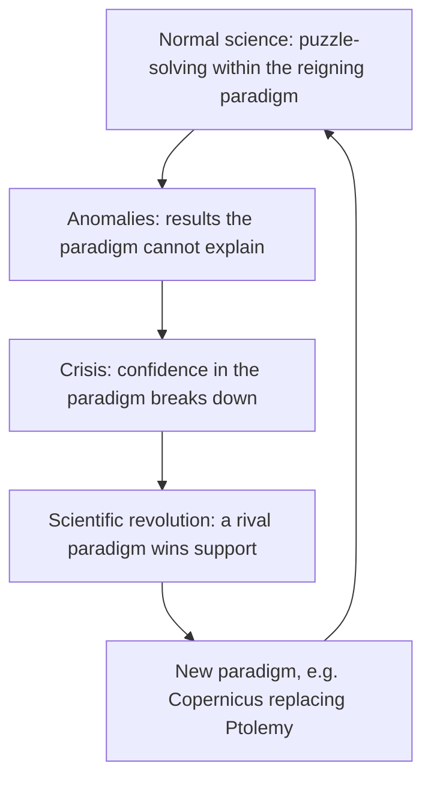

## Philosophy and Science: A Space of Overlap

**Philosophy of science** is **as old as Aristotle** and rose to special prominence in the **20th century**, as science kept recording advances. It is a **space of overlap between science and philosophy** — but scientists and philosophers **disagree** about its nature.

**Prince Louis de Broglie**, founder of the **wave theory of matter**, lamented that in the 19th century:

- **scientists** came to look with **suspicion** on philosophical speculations, which seemed to lack **precision** and to attack **vain problems**;
- **philosophers** lost interest in the special sciences, whose results seemed **too narrow**.

De Broglie judged this separation **harmful to both** (1957).

**Why the stand-off?** The central questions of philosophy of science are **about science, but not part of science**:

- they arise from their **generality** and **fundamental character**;
- **scientists cannot answer them as scientists** — although answering them usually requires a good understanding of scientific theories.

**The overlap:**

| Philosophical branch | Question science seems to answer |
|---|---|
| **Epistemology** | *"How can we have **knowledge** as opposed to mere belief or opinion?"* Science's general answer: **"Follow the scientific method."** |
| **Metaphysics** | If science gives knowledge, **what do its theories tell us about how the world is**, and what is the **scope** of what can be known? |

So **philosophy of science is both epistemology and metaphysics**.

---

## What Is Science?

**Institutionally**, the enterprise we call science is **"essentially the idea of the founders of the Royal Society of London"** — **the oldest organisation for the advancement of science in the world**, chartered in **1662** (Merken 1980).

- Its founders included **Christopher Wren and Robert Boyle**.
- They were interested in the **"new philosophy"** — the natural science emerging from the **experiments and observations** of **Copernicus, Galileo, William Gilbert and Kepler**.

**Semantically**, "science" comes from the Latin ***scientia*** — **knowledge** — and parallels the German ***Wissenschaft***, **"systematic, organised knowledge"** (DeWitt 2011). Science is:

| Science as a **body of knowledge** | Science as a **process** |
|---|---|
| Knowledge accumulated by **systematic study** and organised by **general covering principles** — general truths and laws, **testable or verifiable** (Rosenberg 2012) | **Gaining knowledge** through **repeated observation under controlled conditions (experiments)** and **explaining** them with **hypotheses that can be tested** (Ladyman 2002) |
| An **orderly system of facts** learned from study, observation and experiment, arranged as **an organic, progressive whole** | The study of nature through **observation, identification, description, experimental investigation and theoretical explanation**. Its key feature is **testing hypotheses and making predictions** |

**Certainty?** Other scientists must be able to **repeat the experiments** and check the data. Even so, **complete certainty and universal agreement are impossible**. **The most that can be said of scientific truth is that it has a high degree of probability.**

**What makes science different is its method** (Dicken 2010). Science presents itself as **the most reliable cognitive scheme** for human problems, because it has a special method for:

- observing **facts**;
- drawing **hypotheses**;
- postulating **theories**;
- discovering **laws**.

These, with its assumptions, make up **scientific knowledge**.

---

## The Constituents of Scientific Knowledge

| Constituent | What it is |
|---|---|
| **Facts** | A **fact** is **the worldly correlate of a true proposition** — an actual state of affairs whose obtaining makes a proposition true (Honderich 2005). **"Science is a structure built upon facts"** (Davies 1968) — derived from **what we see, hear and touch**, not personal opinion |
| **Hypothesis** | A **hunch or speculation proposed as a possible solution** to a problem — an **"educated guess"** based on prior knowledge and observation (Koupelis 2014). It is a **tentative explanation** of something that does not fit existing knowledge, often in **"if…then"** form. Arrived at by **abduction**. To be **scientific** it must be **testable, with replicable tests** |
| **Theory** | **The carrier of scientific knowledge** — a systematic binding together of what we know about some aspect of the world, aiming at **explanatory power and predictive fertility**. *"An explanation or model based on observation, experimentation and reasoning … tested and confirmed as a general principle"* (Rosenberg 2005) |
| **Law** | **A descriptive principle of nature that holds in all circumstances** covered by its wording — **no loopholes**. An exception would require the law to be **discarded** (or the event called a miracle). Laws may be **eponymous** (**Boyle's law**), named by **subject** (the **law of conservation of mass**), or **both** (**Newton's law of gravitation**) |

**Three assumptions about scientific facts:**

1. They are **directly given** to careful, **unprejudiced observation** through the senses.
2. They are **prior to and independent of** theory.
3. They form a **firm, reliable foundation** for scientific knowledge.

**Hypotheses:**

- Upon testing, a hypothesis can be **rejected or modified**, but **never proven** with certainty — an unseen counter-instance may always exist.
- When enough evidence accumulates, it becomes a **theory**.
- This links to **Popper**: scientific theories are those that **withstand repeated attempts to falsify them**.

**Theories:**

- **Carl Hempel and Ernest Nagel** (logical empiricists) saw theories as **hypothetico-deductive systems**: from a few powerful **axioms or hypotheses**, everything else follows **deductively**.
  - **Explanation** shows how things happened because of the theory's laws.
  - **Prediction** shows how things **will** happen according to them.
- The best theories **unify** disparate areas of experience — what **William Whewell** called a **"consilience of inductions"** (e.g. Newton's theory uniting falling apples and planetary orbits).
- Theories are **not the end** of science: they can be **proven wrong, improved or modified**.

**Theory versus law:** **a theory is an *explanation* of an observed phenomenon; a law is a *description* of it** (Zimmerman 2014). A description encompassing several laws that has not reached a law's incontrovertible status may be called a theory — e.g. **Einstein's theory of relativity**, **Darwin's theory of evolution**. The three concepts **overlap** (Martin 2005).

**Scientific knowledge is public.** Scientists from different backgrounds can reach **close agreement**. Theories are accepted **only when they make useful, dependable predictions that can be independently confirmed** — scientific knowledge rests on **naturalistic, empirically verifiable** explanations.

<SortingGame title="Fact, hypothesis, theory or law?">

```sort
@buckets Fact | Hypothesis | Theory | Law
"This thermometer reads 100 °C as the water boils in our lab today." => Fact :: An observed state of affairs — a true proposition's worldly correlate.
"If plants get more light, then they will grow taller." => Hypothesis :: A testable "if…then" educated guess.
Darwin's explanation of how species change by natural selection => Theory :: A well-tested explanation that binds many facts together.
"At constant temperature, the pressure of a gas is inversely proportional to its volume." => Law :: Boyle's law — a description that holds in all covered cases.
"Maybe the milk is spoilt — that is why the cereal tastes odd." => Hypothesis :: A hunch proposed as a possible solution, awaiting testing.
Einstein's account of space, time and gravity => Theory :: The theory of relativity — an explanatory framework.
"Mass is neither created nor destroyed in a chemical reaction." => Law :: The law of conservation of mass, named by its subject.
```

</SortingGame>

---

## The Scientific Method

Science presents itself as **the paradigm of rationality** because it has a **method**. What makes it scientific is **not what it studies but how it studies things** — a matter of **process and standards** (Law 2005). The basic ingredients are **observation, evidence, testing and logic**.

<FlowDiagram title="The scientific method at your breakfast table">
<FlowStep title="1. Observation">
Your cereal tastes odd — something about the milk does not seem right.
</FlowStep>
<FlowStep title="2. Hypothesis">
*"The milk is spoilt."*
</FlowStep>
<FlowStep title="3. Test with independent evidence">
Check the **date** on the carton (it is old) and **smell** the milk (it is sour). Two **independent sources** give **corroborating evidence**.
</FlowStep>
<FlowStep title="4. Interpret with background knowledge">
You know how long milk lasts, and that a sour smell signals spoilage.
</FlowStep>
<FlowStep title="5. Conclude — or withhold judgement">
Both agree, so the milk is spoilt. But if the milk **smells fine yet the date is a month old**, the evidence conflicts. The responsible answer is **"I cannot say"** — anything more decisive would be **baseless speculation**.
</FlowStep>
</FlowDiagram>

**Where there is neither supporting evidence nor logical–mathematical proof, there is no knowledge.** These are the standards of honest everyday life — and **the heart of scientific method**.

**How science differs from daily life.** The scientific process is:

- **more deliberate and explicit** in following its steps;
- **more dedicated** to the results of the method;
- **more public** and **open to independent review**.

This **slow, deliberate, explicit, public reasoning from evidence** makes the process clear and visible.

---

## Scientific Explanation: The Deductive-Nomological Model

Science aims to **explain events in the natural world**. In ordinary usage, **an explanation is an answer to a "why" question**. The standard account is the **deductive-nomological (D-N) model**:

- set out in the **1948 paper of Carl Hempel and Paul Oppenheim**;
- developed by **Carl Gustav Hempel (1905–1997)**, a German-American philosopher;
- also called the **covering-law model**.

**The idea:** an explanation is an **argument**. The **premises (the explanans)** do the explaining, and **the thing explained (the explanandum)** follows as the **conclusion**. It must satisfy **three conditions**:

1. **Deductive validity** — the explanandum must **follow logically** from the premises.
2. **A law of nature** — the premises must contain **at least one general law** (a **nomological**, law-like statement) that **"subsumes"** the case under a regularity.
3. **Truth** — all the premises must be **actually true**, so it is an **actual**, not merely possible, explanation.

It combines **deductive logic** with science's aim of explaining particulars as **instances of general laws** — hence **"deductive-nomological"**.

<Tabs>
<Tab label="Example">
| Part | Statement |
|---|---|
| **General law** (nomological premise) | All metals expand when heated. |
| **Initial conditions** | This rod is made of iron, a metal. This rod was heated. |
| **Explanandum** (conclusion) | Therefore, this rod expanded. |

*Why did the rod expand?* Because it is a metal, it was heated, and all metals expand when heated.
</Tab>
<Tab label="A failed explanation">
*"The rod expanded because it wanted to be longer."*

- There is **no general law of nature**.
- The rod's "wanting" is **not empirically true**.
- The conclusion does **not follow deductively** from anything testable.

It fails all three conditions.
</Tab>
</Tabs>

<SortingGame title="Which part of a D-N explanation?">

```sort
@buckets General law | Initial condition | Explanandum
All metals expand when heated => General law :: A nomological (law-like) premise covering the case.
This rod is made of iron => Initial condition :: A particular fact about this case.
This rod was heated to 200 °C => Initial condition :: A specific circumstance.
Therefore, this rod expanded => Explanandum :: The phenomenon to be explained, deduced as the conclusion.
Water boils at 100 °C at sea-level pressure => General law :: A general regularity of nature.
This kettle of water boiled => Explanandum :: What we wanted explained.
```

</SortingGame>

---

## What Is Philosophy of Science?

Following John Losee, there are **four conceptions**:

1. **Formulating worldviews** consistent with — and based on — important scientific theories, **elaborating the broader implications of science**.
2. **Exposing the assumptions and predispositions of scientists** — e.g. that **nature is not capricious**, and has regularities simple enough to be discovered.
3. A discipline that **analyses and clarifies the concepts and theories** of the sciences.
4. A **second-order discipline** asking:
   - **(i)** What **distinguishes scientific inquiry** from other investigation?
   - **(ii)** What **procedures** should scientists follow?
   - **(iii)** What conditions make a **scientific explanation correct**?
   - **(iv)** What is the **cognitive status of scientific laws and principles**?

### Schools of thought

| School | View of science |
|---|---|
| **Positivism** (the peak of canonising scientific method) | Science **begins with observations** in observation sentences, **accumulates** them, subjects them to **verification and confirmation**, and produces **general statements** — hypotheses, theories and laws. Science is **the paradigm of rationality, the model of truth and the standard of knowledge**. Knowledge is **progressive, cumulative and linear**, and its goal is **truth about the world** |
| **Karl Popper — critical rationalism** | Agrees with positivism that science is **rational, methodical, truth-seeking and progressive**, but science **begins with conjectures** (serious guesses) and progresses through **criticism, falsification and refutation**. Theories **cannot be conclusively shown true**. Popper rejects **Descartes'** "clear and distinct" criterion of truth: we cannot be sure clarity signals truth, only that **obscurity and confusion signal error**. So a valid scientific claim aims at **avoiding error while accepting ignorance** |
| **Thomas Kuhn — paradigms and revolutions** | Science is governed by **paradigms** — principles, procedures and axioms that guide **"normal science"**. When challenged by rival models, a **crisis** arises, leading to a **revolution** that overthrows the paradigm and sets up **new normal science**. History: **Ptolemy → Copernicus and Kepler → Newton → Einstein → quantum mechanics**. There is **no single, fixed, universal "rationality of science"** or "the" scientific method |
| **Paul Feyerabend — pluralism** | Overlaps with Kuhn: science is **one cognitive scheme with the same rights as voodoo, religion, mysticism, magic, mythology and philosophy**. **Reality, objectivity and truth are created**; what we face is **a plurality** |

**Beyond the textbook — Popper's falsifiability:** for Popper, a theory is **scientific only if some possible observation could prove it false**. *"All swans are white"* is scientific: one black swan refutes it. *"Things happen for a reason"* is not. This **demarcation** separates genuine science from pseudo-science, such as **astronomy from astrology**.



<SortingGame title="Positivism, Popper, Kuhn or Feyerabend?">

```sort
@buckets Positivism | Popper | Kuhn | Feyerabend
"Science starts from observations, verifies them, and builds up general laws step by step." => Positivism :: Cumulative, linear, verification-based science.
"Science starts from bold conjectures that we try hard to falsify." => Popper :: Conjectures and refutations.
"Normal science works within a paradigm until a crisis triggers a revolution." => Kuhn :: Paradigms and revolutions.
"Science has no more rights than magic, myth or religion — all are cognitive schemes." => Feyerabend :: Radical pluralism.
"A theory that no observation could ever refute is not scientific." => Popper :: Falsifiability as the mark of science.
"There is no single, fixed rationality of science across history." => Kuhn :: Different paradigms, different rationalities.
"Science is the model of truth and the standard of all knowledge." => Positivism :: Science as the paradigm of rationality.
```

</SortingGame>

---

## Science and Ethics *(from past examinations)*

Past GST 212 papers also test how **ethics guides science**:

- Science **must be guided by ethical considerations**. This helps it **fulfil its social functions** and **respect the dignity of the human person**, and scientists must research **within morally acceptable limits**.
- Ethics guides scientific practice through **ethical norms and considerations**.
- For science to be meaningful and ethical, it **must advance human interest, welfare and happiness**.
- Clinical research requires ethical consideration towards human and animal subjects — but **not of their social status**.

---

## Quick Check

<MCQ question="The enterprise known as science today is essentially the idea of the founders of…">
<Option correct>the Royal Society of London</Option>
<Option>the Academy of Plato</Option>
<Option>the University of Ibadan</Option>
<Option>the Vienna Circle</Option>
<Explain>The Royal Society, chartered in 1662 (Wren, Boyle and others), is the oldest organisation for the advancement of science.</Explain>
</MCQ>

<MCQ question="A scientific hypothesis is…">
<Option correct>a tentative, testable explanation for a naturally occurring phenomenon</Option>
<Option>a law that holds in all circumstances</Option>
<Option>a proven theory</Option>
<Option>a personal opinion</Option>
<Explain>A hypothesis is an educated guess awaiting testing; it can be rejected or modified but never proven with certainty.</Explain>
</MCQ>

<MCQ question="Which statement correctly distinguishes a theory from a law?">
<Option>A theory is certain; a law is a guess</Option>
<Option correct>A theory explains an observed phenomenon; a law describes it</Option>
<Option>Laws come before hypotheses</Option>
<Option>There is no difference</Option>
<Explain>Theories explain (e.g. evolution); laws describe regularities (e.g. Boyle's law) (Zimmerman 2014).</Explain>
</MCQ>

<MCQ question="The deductive-nomological model of explanation is also known as the…">
<Option correct>covering-law model</Option>
<Option>falsificationist model</Option>
<Option>paradigm model</Option>
<Option>inductive-statistical model</Option>
<Explain>Hempel's D-N (covering-law) model derives the explanandum from general laws plus true premises.</Explain>
</MCQ>

<MCQ question="Under the D-N model, a valid scientific explanation MUST contain at least one…">
<Option>personal opinion of the researcher</Option>
<Option>historical anecdote</Option>
<Option correct>general law of nature</Option>
<Option>supernatural cause</Option>
<Explain>The three conditions are deductive validity, at least one general (nomological) law, and true premises.</Explain>
</MCQ>

<MCQ question="Who held that science develops through paradigms, crises and revolutions?">
<Option>Karl Popper</Option>
<Option correct>Thomas Kuhn</Option>
<Option>Carl Hempel</Option>
<Option>Robert Boyle</Option>
<Explain>Kuhn: normal science within a paradigm → crisis → revolution → new paradigm.</Explain>
</MCQ>

<MCQ question="For Karl Popper, science begins with…">
<Option>observation and verification</Option>
<Option correct>conjectures that are tested by attempts at falsification</Option>
<Option>paradigms</Option>
<Option>revelation</Option>
<Explain>Popper's critical rationalism: conjectures and refutations. The positivists begin with observation.</Explain>
</MCQ>

<MCQ question="Which of the following is NOT true of the Newtonian worldview of science?">
<Option correct>The Earth is located at the centre of the universe</Option>
<Option>Nature operates according to universal laws</Option>
<Option>Motion can be described mathematically</Option>
<Option>Gravity acts between all masses</Option>
<Explain>An Earth-centred universe is the Ptolemaic view that Copernicus, Kepler and Newton overturned.</Explain>
</MCQ>

## Practice Questions

<Reveal question="1. Why do scientists and philosophers disagree about philosophy of science, and how does it overlap with epistemology and metaphysics?">
De Broglie noted that in the 19th century scientists came to suspect philosophical speculation as imprecise, while philosophers found the special sciences too narrow — a separation harmful to both. The deeper reason is that philosophy of science asks questions about science that are not part of science: general and fundamental, and not answerable by scientists as scientists. It overlaps with epistemology (how can we have knowledge rather than opinion? — "follow the scientific method") and with metaphysics (what do theories tell us about the world, and what is the scope of the knowable?).
</Reveal>

<Reveal question="2. What is science? Explain it as a body of knowledge and as a process.">
Institutionally, science is the idea of the founders of the Royal Society of London (1662). Etymologically it means knowledge (scientia; Wissenschaft — systematic, organised knowledge). As a body, it is knowledge organised by general covering principles: testable truths and laws forming an orderly, progressive whole. As a process, it gains knowledge by repeated observation in controlled experiments and by testable hypotheses, predictions and explanations. Its truths are highly probable, not certain, and its distinctiveness lies in its method.
</Reveal>

<Reveal question="3. Explain facts, hypotheses, theories and laws in science.">
Facts are the worldly correlates of true propositions, given to unprejudiced observation and forming science's foundation. Hypotheses are educated guesses — tentative, testable explanations (often "if…then"), reached by abduction, which can be rejected or modified but never proven. Theories are the carriers of scientific knowledge: confirmed explanations with explanatory and predictive power, seen by Hempel and Nagel as hypothetico-deductive systems. Laws are descriptive principles holding in all covered circumstances (Boyle's law, the conservation of mass). A theory explains; a law describes.
</Reveal>

<Reveal question="4. Explain the deductive-nomological model with an example.">
Hempel (with Oppenheim, 1948) treated explanation as a deductive argument: the explanans (premises) must (1) deductively entail the explanandum, (2) include at least one general law of nature that covers the case, and (3) be actually true. Example: all metals expand when heated (law); this rod is iron and was heated (conditions); therefore this rod expanded (explanandum). It is also called the covering-law model.
</Reveal>

<Reveal question="5. Compare the positivist, Popperian, Kuhnian and Feyerabendian views of science.">
Positivism: science begins with observation, verification and confirmation, producing cumulative, linear progress toward truth — the paradigm of rationality. Popper: science is rational and progressive but begins with conjectures tested by attempts at falsification; theories are never conclusively true, and science aims at avoiding error. Kuhn: normal science within paradigms, disrupted by crises and revolutions (Ptolemy to Copernicus to Newton to Einstein); there is no single rationality of science. Feyerabend: science is one cognitive scheme among voodoo, religion, myth and philosophy; truth and objectivity are created — pluralism.
</Reveal>

<Takeaway>
- Philosophy of science (as old as **Aristotle**) is the overlap of science and philosophy; its questions are **about** science, not **in** science (de Broglie on the split). It is **epistemology + metaphysics**.
- **Science**: the idea of the **Royal Society of London (1662)**; *scientia*/*Wissenschaft*; a **body** of organised knowledge and a **process** of testing; truths are **highly probable**, not certain; its distinctiveness is its **method**.
- **Facts** (true-proposition correlates), **hypotheses** (testable educated guesses; never proven), **theories** (carriers of knowledge; explain; Hempel and Nagel's hypothetico-deductive systems; Whewell's consilience), **laws** (describe; Boyle, conservation of mass, Newton).
- **Method**: observation, evidence, testing, logic (the spoilt milk); **withhold judgement** when evidence conflicts; science is more deliberate, dedicated and public.
- **D-N (covering-law) model** (Hempel and Oppenheim 1948): deductive validity + a general law + true premises.
- **Schools**: **positivism** (observation → verification, cumulative), **Popper** (conjectures and refutations; falsifiability), **Kuhn** (paradigm → crisis → revolution), **Feyerabend** (pluralism).
</Takeaway>

## Exam Tips

- Memorise the **three conditions of the D-N model** and be able to set out an example in **law + conditions → conclusion** form.
- Distinguish **Popper vs Kuhn vs positivism** by their **starting point**: conjecture / paradigm / observation.
- Remember the institutional origin (**Royal Society of London**) and the difference between **theory (explains)** and **law (describes)**.
- Past papers ask for textbook-style definitions: hypothesis = *tentative explanation*; scientific fact = *controlled, repeatable, rigorously verified observation*; the method aims to *minimise prejudice*.
