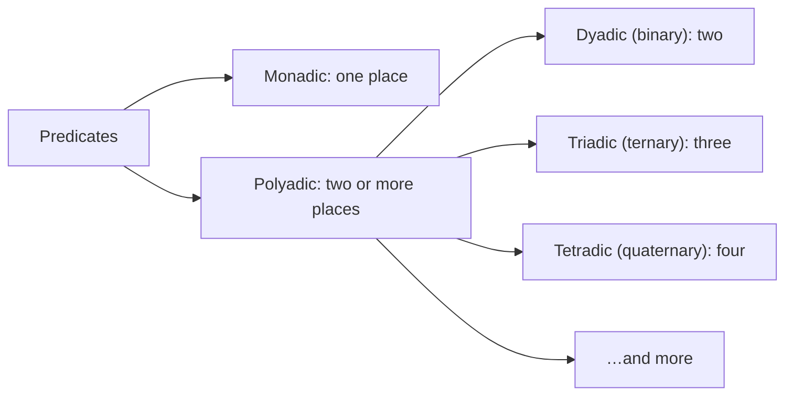

## Relational Terms, Phrases and Statements

Everyday statements often contain **terms or phrases that express relations**.

> **A term expresses a relation if it needs more than one entity to have complete meaning.**

- **Relational words:** parent, spouse, enemy, lover, uncle, cousin, friend, teacher. You cannot just be "a parent"; you are a parent **of someone**.
- **Relational phrases:** "is the colleague of", "shorter than", "older than", "as dark as", "in front of".

In logic, relational terms and phrases are treated as **predicates**, which come in two broad types:

| Type | Places | Example | The predicate |
|---|---|---|---|
| **Monadic** | **One-place** — says something about **one** individual | Hitler was a short man | "…was a short man" |
| **Polyadic** | **More than one place** — expresses a **relation** between individuals | John Stuart Mill is the son of James Mill | "…is the son of…" (two individuals) |

*(The textbook calls the father "James Stuart Mill". The philosopher and economist John Stuart Mill's father was **James Mill**.)*

### How many places?

Polyadic relations are classified by **the number of entities needed for the statement to have complete meaning**:



| Relation | Entities | Textbook examples |
|---|---|---|
| **Dyadic / binary** (two-place) | 2 | Bruno and Bianca are **lovers**. Bill Clinton and Hillary Clinton are **spouses**. Esau is **the brother of** Jacob. Mary is **a cousin of** Elizabeth. The researcher **is using** the computer. |
| **Triadic / ternary** (three-place) | 3 | Turkey is **between** Europe **and** Asia. The candidate **has submitted** his progress report **to** the Department. John **gave** his old house **to** charity. Kunle **told** Joy **about** Cinderella. |
| **Tetradic / quaternary** (four-place) | 4 | The government **acquired** the property **from** the family **for** ₦10,000,000. The government **released** the captured insurgents **to** the terrorist groups **in exchange for** the abducted schoolgirls. The dress that Paul **bought for** Helen was eventually **given to** Sandra. |

**A slip in the textbook.** It lists *"David, Moses, Raphael and Innocent are casual workers"* as a four-place relation. It is not one. "Is a casual worker" is a **monadic** predicate: the sentence is just four one-place statements joined together (David is a casual worker, Moses is a casual worker…). No relation holds **between** the four men. Count the entities a **single predicate needs**, not the number of names in the sentence.

<SortingGame title="How many places does the predicate have?">

```sort
@buckets Monadic | Dyadic | Triadic | Tetradic
Chioma is a brilliant student => Monadic :: "…is a brilliant student" needs only one individual.
Esau is the brother of Jacob => Dyadic :: "…is the brother of…" links two people.
Lagos is larger than Ibadan => Dyadic :: A comparison between two cities.
Turkey is between Europe and Asia => Triadic :: "…is between… and…" needs three entities.
Kunle told Joy about Cinderella => Triadic :: A teller, a hearer and a topic.
John gave his old house to charity => Triadic :: A giver, a gift and a receiver.
The government acquired the property from the family for ₦10,000,000 => Tetradic :: Buyer, property, seller and price.
Ade sold his car to Bola for ₦2 million => Tetradic :: Seller, thing sold, buyer and price.
David, Moses, Raphael and Innocent are casual workers => Monadic :: Four names, but "is a casual worker" says something about each man separately. There is no four-place relation.
```

</SortingGame>

---

## Relation, Relata and Direction

In a relational statement we can pick out:

- the **relation** — what the relational term expresses (for example, "is the father of");
- the **relata** (singular **relatum**) — the **entities between which the relation holds**. **The number of relata decides** whether the relation is binary, triadic or tetradic.

We can also ask about the **direction** of a relation:

| Direction | Example | Explanation |
|---|---|---|
| **Unidirectional** (irreversible) | **Henry is the father of Smith** | It runs only **from Henry to Smith** |
| **Bidirectional** | **Godwin Sogolo and A. G. A. Bello are colleagues** | It runs **from Sogolo to Bello and from Bello to Sogolo** |

To test the **validity of arguments** built from relational statements, we need the **attributes of relations**. Like the textbook, we look only at **dyadic (binary)** relations. There are **three families**, each with **three members**.

---

## The Attributes of Binary Relations

Write **xRy** for "x has the relation R to y". For example, if R is "is older than", then "Ade R Bola" means "Ade is older than Bola".

| Family | Always | Never | Sometimes |
|---|---|---|---|
| **Symmetry:** if xRy, does yRx follow? | **Symmetrical** — if xRy, then **always** yRx | **Asymmetrical** — if xRy, then **never** yRx | **Non-symmetrical** — if xRy, then yRx **may or may not** hold |
| **Reflexivity:** does x have R to itself? | **Reflexive** — a thing **has** the relation to itself | **Irreflexive** — **nothing can** have it to itself | **Non-reflexive** — a thing **may or may not** have it to itself |
| **Transitivity:** if xRy and yRz, does xRz follow? | **Transitive** — then **always** xRz | **Intransitive** — then **never** xRz | **Non-transitive** — then xRz **may or may not** hold |

The pattern is the same in every family: **always / never / sometimes**. The "sometimes" member always carries the prefix **non-**.

### Symmetry

| Attribute | Test | Textbook examples |
|---|---|---|
| **Symmetrical** | If X is a colleague of Y, **Y must be** a colleague of X. The relation runs **both ways** | is the same as, is the friend of, is the cousin of, is the contemporary of, is next to, is married to, has the same weight as, is equal to, is the colleague of |
| **Asymmetrical** | If A is the boss of B, **B cannot be** the boss of A. The relation is **unidirectional** | is the husband of, is the mother of, is taller than, is the son of, is bigger than, is the boss of |
| **Non-symmetrical** | If A loves B, **B may or may not** love A | loves, hates, is the brother of, is the sister of |

"Is the brother of" is **non-symmetrical**, not symmetrical. If Esau is the brother of Jacob, Jacob is the brother of Esau. But if John is the brother of Mary, Mary is **not** the brother of John — she is his sister.

### Reflexivity

| Attribute | Test | Textbook examples |
|---|---|---|
| **Reflexive** | A thing **has** the relation to itself | **identity** (everything is identical to itself), is the same height as, has the same weight as, is as poor as |
| **Irreflexive** | **Nothing can** have the relation to itself | is the brother of (nobody is their own brother), is east of, is married to, is wealthier than |
| **Non-reflexive** | A thing **may or may not** have it to itself | hates (a person may or may not hate himself), loves, opposes, adores |

*(Beyond the textbook: Copi separates **totally reflexive** relations, which **everything** has to itself — identity — from **reflexive** ones, which anything that has the relation to **something** also has to itself. "Has the same height as" only applies to things that have a height.)*

### Transitivity

| Attribute | Test | Textbook examples |
|---|---|---|
| **Transitive** | Ade is older than Bola and Bola is older than Sola, so **Ade must be** older than Sola | is older than, has the same height as, is richer than, lives in the same city as, is to the north of, is a predecessor of |
| **Intransitive** | X is the father of Y and Y is the father of Z, so X **cannot be** the father of Z (he is the grandfather) | is the father of, is the mother of, is (exactly) ten kilometres farther than |
| **Non-transitive** | X loves Y and Y loves Z, so X **may or may not** love Z | loves, hates, is the enemy of, is the friend of |

The textbook also lists **"is a little smaller than"** as intransitive. "A little" is vague: two "little" differences may still add up to "a little". A precise version shows the point clearly: **"is exactly 1 cm shorter than"** is intransitive, because X would then be 2 cm shorter than Z.

<Analogy>
Think of **transitivity** as a relay race. With a **transitive** relation, the baton always gets passed on: if Ade is older than Bola and Bola is older than Sola, "older than" reaches Sola from Ade. With an **intransitive** relation, the baton is **always dropped**: fatherhood does not pass from grandfather to grandson. With a **non-transitive** relation, the baton is **sometimes** passed on: your friend's friend may or may not be your friend.
</Analogy>

### Explore: draw the relation

Each tab shows one situation. Change the arrows and watch the verdicts update. Then try the challenges below.

<Tabs>
<Tab label="is older than">
<RelationGraph title="Ade (40), Bola (30), Sola (20)" label="is older than" nodes="Ade, Bola, Sola" arrows="Ade>Bola, Bola>Sola, Ade>Sola" />
</Tab>
<Tab label="is the father of">
<RelationGraph title="Three generations" label="is the father of" nodes="Ade, Bola, Sola" arrows="Ade>Bola, Bola>Sola" />
</Tab>
<Tab label="same height as">
<RelationGraph title="Ada and Ngozi are 170 cm; Kemi is 160 cm" label="has the same height as" nodes="Ada, Ngozi, Kemi" arrows="Ada>Ngozi, Ngozi>Ada, Ada>Ada, Ngozi>Ngozi, Kemi>Kemi" />
</Tab>
<Tab label="loves">
<RelationGraph title="A campus love story" label="loves" nodes="Tolu, Femi, Amaka, Dayo" arrows="Tolu>Femi, Femi>Tolu, Femi>Amaka, Amaka>Dayo, Tolu>Tolu" />
</Tab>
<Tab label="Build your own">
<RelationGraph title="Your relation" label="R" nodes="A, B, C, D" />
</Tab>
</Tabs>

**Challenges:**

1. In the **"is older than"** tab, try to add the arrow **Sola → Ade**. The relation stops being asymmetrical — but that situation is **impossible**, since Sola (20) cannot be older than Ade (40). The attributes of a relation tell you **which diagrams could ever be drawn**.
2. In the **"is the father of"** tab, add **Ade → Sola**. The diagram becomes non-transitive — yet no one can be both the father and the grandfather of the same person. Fatherhood is **intransitive in every possible situation**.
3. The **"loves"** tab is non-symmetrical, non-reflexive and non-transitive all at once. Love is **sometimes** returned, **sometimes** self-directed and **sometimes** passed on — never guaranteed either way.
4. In **"Build your own"**, try to draw a relation that is **symmetrical, reflexive and transitive**. *(Hint: split the letters into groups and connect everything within each group, loops included.)*

<SortingGame title="Symmetrical, asymmetrical or non-symmetrical?">

```sort
@buckets Symmetrical | Asymmetrical | Non-symmetrical
is married to => Symmetrical :: If Chidi is married to Ngozi, Ngozi is married to Chidi.
is the colleague of => Symmetrical :: Colleagueship runs both ways.
has the same weight as => Symmetrical :: If X weighs the same as Y, Y weighs the same as X.
is the cousin of => Symmetrical :: Cousinhood is mutual.
is the boss of => Asymmetrical :: If Amaka is Tunde's boss, Tunde cannot be Amaka's boss.
is taller than => Asymmetrical :: If X is taller than Y, Y cannot be taller than X.
is the mother of => Asymmetrical :: A mother cannot be her own child's child.
loves => Non-symmetrical :: Love may or may not be returned.
hates => Non-symmetrical :: Hatred may or may not be mutual.
is the brother of => Non-symmetrical :: If John is Mary's brother, Mary is his sister, not his brother; between two boys it runs both ways.
```

</SortingGame>

<SortingGame title="Reflexive, irreflexive or non-reflexive?">

```sort
@buckets Reflexive | Irreflexive | Non-reflexive
is identical to => Reflexive :: Everything is identical to itself.
has the same height as => Reflexive :: Everyone is the same height as themselves.
is as poor as => Reflexive :: Anyone is exactly as poor as themselves.
is the brother of => Irreflexive :: Nobody can be their own brother.
is east of => Irreflexive :: Nothing is east of itself.
is wealthier than => Irreflexive :: Nobody is wealthier than themselves.
is married to => Irreflexive :: Nobody can marry themselves.
loves => Non-reflexive :: A person may or may not love himself or herself.
opposes => Non-reflexive :: One may or may not oppose oneself.
adores => Non-reflexive :: Self-adoration is possible but not guaranteed.
```

</SortingGame>

<SortingGame title="Transitive, intransitive or non-transitive?">

```sort
@buckets Transitive | Intransitive | Non-transitive
is older than => Transitive :: If Ade is older than Bola and Bola older than Sola, Ade is older than Sola.
is to the north of => Transitive :: Kano is north of Ibadan and Ibadan is north of Lagos, so Kano is north of Lagos.
lives in the same city as => Transitive :: If X and Y share a city, and Y and Z share it, X and Z share it too.
is a descendant of => Transitive :: A descendant of a descendant of Abraham is a descendant of Abraham.
is the father of => Intransitive :: Your father's father is your grandfather, never your father.
is the mother of => Intransitive :: Your mother's mother is your grandmother.
is exactly ten kilometres farther than => Intransitive :: Two steps of exactly 10 km make 20 km, never exactly 10.
loves => Non-transitive :: X loves Y and Y loves Z — X may or may not love Z.
is the friend of => Non-transitive :: Your friend's friend may or may not be your friend.
is the enemy of => Non-transitive :: The enemy of my enemy may or may not be my enemy.
```

</SortingGame>

### One relation, several attributes

Every binary relation has **one attribute from each family**:

| Relation | Symmetry | Reflexivity | Transitivity |
|---|---|---|---|
| **has the same height as** | symmetrical | reflexive | transitive |
| **is identical to** | symmetrical | reflexive | transitive |
| **is older than** | asymmetrical | irreflexive | transitive |
| **is to the north of** | asymmetrical | irreflexive | transitive |
| **is a descendant of** | asymmetrical | irreflexive | transitive |
| **is the father of** | asymmetrical | irreflexive | intransitive |
| **is married to** | symmetrical | irreflexive | intransitive (your spouse's spouse is you, and nobody is married to themselves) |
| **loves** | non-symmetrical | non-reflexive | non-transitive |
| **hates** | non-symmetrical | non-reflexive | **non-transitive** |

**A contradiction in the textbook.** Near the end of the chapter it says "hate" is "non-symmetrical, **transitive** and non-reflexive". But a few lines earlier it lists "hates" among the **non-transitive** relations, and that is correct: if Bisi hates Kemi and Kemi hates Tayo, Bisi may or may not hate Tayo. Its other example is right: "has the same height as" is **symmetrical, transitive and reflexive**. *(Beyond the textbook, such a relation is called an **equivalence relation**. It sorts things into groups of "the same".)*

---

## Arguments Involving Relations

Some arguments are **valid because of the attributes of the relation** they contain.

**Example 1 — symmetry.**

> Every boy at the games competed with every girl who was there.<br />
> ∴ Every girl at the games competed with every boy who was there.

**Valid**, because **"competed with" is symmetrical** (bidirectional): if a boy competed with a girl, she competed with him.

**Example 2 — transitivity.**

> Isaac is a descendant of Abraham.<br />
> Jacob is a descendant of Isaac.<br />
> All of Abraham's descendants are wealthy.<br />
> ∴ Isaac is wealthy.

The textbook explains its validity through transitivity: "is a descendant of" is **transitive**, so Jacob is a descendant of Abraham, and **both** Isaac and Jacob are wealthy. Notice, though:

- As printed, the conclusion **"Isaac is wealthy"** follows from premises 1 and 3 **alone**. Premise 2 and transitivity are not needed.
- Transitivity does the work only for the conclusion **"Jacob is wealthy"**, which is probably what the example intends. Jacob is a descendant of Isaac, and Isaac of Abraham, so by transitivity Jacob is a descendant of Abraham, and therefore wealthy.
- **"Is wealthy" is not relational.** A relational argument can still depend on **non-relational** terms.

**Beyond the textbook:** the attribute of the relation acts as a **hidden premise**. The argument "Ade is older than Bola; Bola is older than Sola; so Ade is older than Sola" is valid because of the unstated truth **"is older than is transitive"**. Truth tables cannot show this, because they see "Ade is older than Bola" only as an unanalysed statement *p*. Relational arguments need **predicate (relational) logic**, or the method below.

<FlowDiagram title="Testing an argument involving relations (the textbook's five steps)">
<FlowStep title="1. Find the premises and the conclusion">
Use the indicator words and put the argument in standard form.
</FlowStep>
<FlowStep title="2. Locate the relational expression">
For example, "competed with", "is older than", "is a descendant of".
</FlowStep>
<FlowStep title="3. Determine its attributes">
Symmetry, reflexivity, transitivity — and decide **which attribute the argument relies on**. Swapping the order of x and y relies on **symmetry**; chaining x to y to z relies on **transitivity**.
</FlowStep>
<FlowStep title="4. Check how the relation is used">
Does the argument use the relation the way its attribute allows? For example, it treats the relation as **bidirectional** — is it really **symmetrical**?
</FlowStep>
<FlowStep title="5. Decide">
If the relation behaves as the argument needs, the argument is **valid**. If not, it is **invalid**. Either way, **explain the verdict by the attribute**.
</FlowStep>
</FlowDiagram>

<SortingGame title="Valid or invalid? (name the attribute that decides)">

```sort
@buckets Valid | Invalid
Ade is older than Bola. Bola is older than Sola. So Ade is older than Sola => Valid :: "Is older than" is transitive.
Ade is the father of Bola. Bola is the father of Sola. So Ade is the father of Sola => Invalid :: "Is the father of" is intransitive — Ade is Sola's grandfather.
Chidi is married to Ngozi. So Ngozi is married to Chidi => Valid :: "Is married to" is symmetrical.
Tolu loves Femi. So Femi loves Tolu => Invalid :: "Loves" is non-symmetrical — love may be unreturned.
Kano is north of Ibadan. Ibadan is north of Lagos. So Kano is north of Lagos => Valid :: "Is north of" is transitive.
Emeka is a friend of Uche. Uche is a friend of Obi. So Emeka is a friend of Obi => Invalid :: "Is a friend of" is non-transitive.
Musa is taller than Ali. So Ali is not taller than Musa => Valid :: "Is taller than" is asymmetrical.
Bisi hates Kemi. Kemi hates Tayo. So Bisi hates Tayo => Invalid :: "Hates" is non-transitive — despite the textbook's slip calling it transitive.
Obi is the brother of Ada. So Ada is the brother of Obi => Invalid :: "Is the brother of" is non-symmetrical — Ada may be Obi's sister.
Ada has the same height as Ngozi. Ngozi has the same height as Kemi. So Ada has the same height as Kemi => Valid :: "Has the same height as" is transitive.
```

</SortingGame>

---

## Conclusion

This chapter examined the **different forms and categories of relations**: monadic and polyadic predicates; dyadic, triadic and tetradic relations; relation, relata and direction; and the **attributes of binary relations** — symmetry, reflexivity and transitivity. It showed how these attributes decide the **validity of arguments involving relations**.

---

## Quick Check

<MCQ question="A term expresses a relation when it…">
<Option>describes a single object</Option>
<Option correct>needs more than one entity to have complete meaning</Option>
<Option>is used in a conditional statement</Option>
<Option>has two different meanings</Option>
<Explain>"Parent", "spouse" and "older than" need at least two entities — you are a parent OF someone.</Explain>
</MCQ>

<MCQ question="'Turkey is between Europe and Asia' expresses a…">
<Option>monadic predicate</Option>
<Option>dyadic relation</Option>
<Option correct>triadic (ternary) relation</Option>
<Option>tetradic relation</Option>
<Explain>"…is between… and…" needs three relata: Turkey, Europe and Asia.</Explain>
</MCQ>

<MCQ question="The entities between which a relation holds are called…">
<Option>predicates</Option>
<Option correct>relata</Option>
<Option>quantifiers</Option>
<Option>connectives</Option>
<Explain>Relata (singular: relatum). Their number decides whether the relation is binary, triadic or tetradic.</Explain>
</MCQ>

<MCQ question="If whenever X stands in a relation to Y, Y must stand in the same relation to X, the relation is…">
<Option>asymmetrical</Option>
<Option>transitive</Option>
<Option>reflexive</Option>
<Option correct>symmetrical</Option>
<Explain>Symmetrical relations are bidirectional: is married to, is the colleague of, has the same weight as.</Explain>
</MCQ>

<MCQ question="Which of these is an asymmetrical relation?">
<Option>is married to</Option>
<Option correct>is the boss of</Option>
<Option>loves</Option>
<Option>is the cousin of</Option>
<Explain>If A is B's boss, B cannot be A's boss. "Loves" is non-symmetrical; the others are symmetrical.</Explain>
</MCQ>

<MCQ question="Which relation is intransitive?">
<Option>has the same weight as</Option>
<Option>is older than</Option>
<Option>is identical to</Option>
<Option correct>is the mother of</Option>
<Explain>Your mother's mother is your grandmother, never your mother. The others are transitive.</Explain>
</MCQ>

<MCQ question="'Is a friend of' is non-transitive because, if X is a friend of Y and Y is a friend of Z…">
<Option>X is guaranteed to hate Z</Option>
<Option>Z must be a friend of X</Option>
<Option>the relation is impossible</Option>
<Option correct>X may or may not be a friend of Z</Option>
<Explain>Non-transitive = sometimes passed on, sometimes not.</Explain>
</MCQ>

<MCQ question="'Nobody can be their own brother' shows that 'is the brother of' is…">
<Option>reflexive</Option>
<Option correct>irreflexive</Option>
<Option>non-reflexive</Option>
<Option>symmetrical</Option>
<Explain>An irreflexive relation is one that nothing can have to itself.</Explain>
</MCQ>

<MCQ question="The relation 'has the same height as' is…">
<Option>asymmetrical, irreflexive and transitive</Option>
<Option correct>symmetrical, reflexive and transitive</Option>
<Option>non-symmetrical, non-reflexive and non-transitive</Option>
<Option>symmetrical, irreflexive and intransitive</Option>
<Explain>It runs both ways, everyone has it to themselves, and it passes along chains — an equivalence relation.</Explain>
</MCQ>

<MCQ question="'Every boy at the games competed with every girl there; therefore every girl competed with every boy there' is valid because 'competed with' is…">
<Option>transitive</Option>
<Option correct>symmetrical</Option>
<Option>reflexive</Option>
<Option>asymmetrical</Option>
<Explain>Reversing who competed with whom relies on symmetry (bidirectionality).</Explain>
</MCQ>

## Practice Questions

<Reveal question="1. What is a relational term? Distinguish monadic from polyadic predicates, and dyadic, triadic and tetradic relations, with examples.">
A term expresses a relation if it needs more than one entity to have complete meaning (parent, spouse, friend, "older than", "in front of"). In logic these are predicates. Monadic predicates are one-place ("Hitler was a short man"); polyadic predicates are many-place ("John Stuart Mill is the son of James Mill"). Dyadic or binary relations need two relata ("Esau is the brother of Jacob"); triadic or ternary relations need three ("Turkey is between Europe and Asia", "Kunle told Joy about Cinderella"); tetradic or quaternary relations need four ("The government acquired the property from the family for ₦10,000,000"). The number of relata decides the type. A list of names with a monadic predicate ("David, Moses, Raphael and Innocent are casual workers") is not a four-place relation.
</Reveal>

<Reveal question="2. Explain symmetry, asymmetry and non-symmetry, with two examples each.">
Symmetrical: if xRy then always yRx — the relation is bidirectional (is married to, is the colleague of, has the same weight as). Asymmetrical: if xRy then never yRx — unidirectional (is the boss of, is taller than, is the mother of). Non-symmetrical: if xRy, yRx may or may not hold (loves, hates, is the brother of — Mary is John's sister, not his brother).
</Reveal>

<Reveal question="3. Explain reflexive, irreflexive and non-reflexive relations, with examples.">
Reflexive: a thing has the relation to itself (identity, has the same height as, is as poor as). Irreflexive: nothing can have it to itself (is the brother of, is east of, is married to, is wealthier than). Non-reflexive: a thing may or may not have it to itself (loves, hates, opposes, adores).
</Reveal>

<Reveal question="4. Explain transitive, intransitive and non-transitive relations, with examples.">
Transitive: if xRy and yRz then always xRz (is older than, is north of, lives in the same city as, is a descendant of). Intransitive: if xRy and yRz then never xRz (is the father of, is the mother of, is exactly ten kilometres farther than). Non-transitive: xRz may or may not follow (loves, hates, is the friend of, is the enemy of).
</Reveal>

<Reveal question="5. How do we test the validity of an argument involving relations? Illustrate with a valid and an invalid argument.">
(1) Identify the premises and conclusion. (2) Locate the relational expression. (3) Determine its attributes and decide which the argument relies on. (4) Check whether the relation is used in the way its attributes allow. (5) If so, the argument is valid; if not, invalid — explain either verdict by the attribute. Valid: "Every boy at the games competed with every girl there; so every girl competed with every boy" — "competed with" is symmetrical. Invalid: "Emeka is a friend of Uche and Uche of Obi; so Emeka is a friend of Obi" — "is a friend of" is non-transitive.
</Reveal>

<Reveal question="6. Identify two errors in the textbook's treatment of relations.">
(a) It says "hate" is transitive, contradicting its own earlier list, which correctly classes "hates" as non-transitive. (b) It lists "David, Moses, Raphael and Innocent are casual workers" as a tetradic relation, but "is a casual worker" is monadic. (Also: in the Abraham–Isaac–Jacob argument, the printed conclusion "Isaac is wealthy" does not need transitivity; "Jacob is wealthy" does.)
</Reveal>

<Takeaway>
- A **relational term** needs **more than one entity** for complete meaning. Predicates are **monadic** (one place) or **polyadic**: **dyadic** (2), **triadic** (3), **tetradic** (4)… The number of **relata** decides.
- **Direction:** **unidirectional** ("is the father of") or **bidirectional** ("are colleagues").
- **Three families** of attributes, each **always / never / sometimes**:
  - **Symmetry:** symmetrical (married to) / asymmetrical (boss of) / non-symmetrical (loves).
  - **Reflexivity:** reflexive (same height as) / irreflexive (brother of) / non-reflexive (loves).
  - **Transitivity:** transitive (older than) / intransitive (father of) / non-transitive (friend of).
- **Relational arguments** are valid or invalid **because of the relation's attributes**: symmetry licenses reversing; transitivity licenses chaining.
</Takeaway>

## Exam Tips

- Learn **one clear example for each of the nine attributes**. Examiners love "is the father of" (intransitive), "is taller than" (transitive and asymmetrical), "is married to" (symmetrical) and "loves" (non-everything).
- **Always / never / sometimes** decides the answer. The **"non-"** words mean "sometimes". Don't confuse **asymmetrical** (never reversible) with **non-symmetrical** (sometimes reversible).
- For relational arguments, **name the attribute** that makes the argument valid or invalid.
- Count **relata**, not names, when deciding between dyadic, triadic and tetradic.
