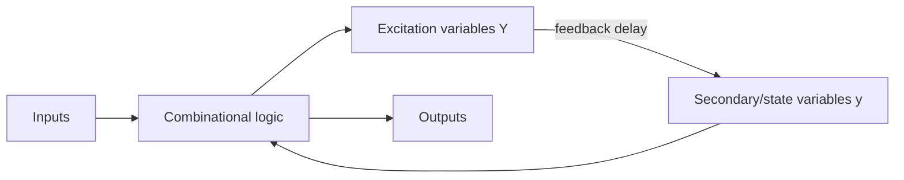

## Sequencing Without a Clock

In **synchronous** circuits a clock decides *when* state changes. **Asynchronous sequential circuits** have **no clock** — the state changes immediately in response to input changes, with feedback providing memory. They are harder to design but are used where a clock is impractical: very high speed paths, simple latches, interfaces between independently-clocked systems, and inside the flip-flops themselves.

**Real-world analogy:** A synchronous circuit is an orchestra following a conductor's beat. An asynchronous circuit is a casual conversation — people respond the instant they hear something, with no shared timekeeper. It's faster but far easier for two people to talk over each other (a *race*).

---

## Structure: Feedback Instead of Flip-Flops

An asynchronous circuit is combinational logic with **feedback loops**. The signals that feed back are the **state variables**:

- **Secondary (present-state) variables** $y$ — the fed-back values.
- **Excitation (next-state) variables** $Y$ — what the logic computes for them.

The circuit is **stable** when $Y = y$ (the next state equals the present state — nothing more wants to change). It is **unstable** when $Y \ne y$, so it keeps changing until it settles.

---

## Fundamental-Mode Operation

The standard design assumption is **fundamental mode**:

1. Only **one input** changes at a time.
2. No further input changes until the circuit has **settled** to a stable state.

This assumption tames the analysis — it guarantees the circuit reaches a defined stable state between input changes.

---

## Flow Table and Excitation Table

Asynchronous design uses tables analogous to the synchronous state table:

- **Primitive flow table:** one row per stable total state, listing next-state and output for each input combination. **Stable states are circled.**
- **Excitation (transition) table:** the binary-encoded version giving $Y$ as a function of inputs and $y$, from which you derive the **excitation equations**.

**Design flow:**

<Step>
1. Build the **primitive flow table** from the specification.
2. **Reduce/merge** compatible rows to minimise states.
3. Make a **state assignment** that is **race-free** (adjacent states differ in one bit).
4. Derive **excitation and output equations**.
5. Check for and eliminate **hazards**.
</Step>

---

## Races

A **race** occurs when an input change requires **two or more state variables to change**. Because real gates have unequal delays, the variables change at slightly different times and the path taken is uncertain.

| Type | What happens | Outcome |
|---|---|---|
| **Non-critical race** | different orderings still reach the **same** final state | harmless |
| **Critical race** | different orderings reach **different** final states | malfunction — must be avoided |

**Cure:** use a **race-free state assignment** so that any required transition changes only **one** state variable at a time (adjacent codes differ by a single bit, like a Gray code), or route the transition through intermediate states (a **cycle**).

---

## Cycles

A **cycle** is a deliberate sequence of unstable states the circuit passes through before reaching a stable one. Used correctly, cycles let a multi-variable transition happen one variable at a time, avoiding a critical race. Used carelessly, a cycle can become an endless loop that never stabilises — so each cycle must terminate in a stable state.

---

## Hazards

A **hazard** is an unwanted momentary glitch in an output caused by unequal propagation delays — especially dangerous in asynchronous circuits where a glitch can be latched as a permanent wrong state.

| Hazard | Cause | Fix |
|---|---|---|
| **Static-1** | output should stay 1 but dips to 0 briefly | add a **redundant** (consensus) prime-implicant term |
| **Static-0** | output should stay 0 but spikes to 1 | add a redundant term in POS form |
| **Dynamic** | output changes 0→1→0→1 instead of once | remove multiple paths / redesign |
| **Essential** | inherent to the circuit's structure (timing of input vs feedback) | add delay in feedback path |

**Static-1 hazard cure on a K-map:** whenever two adjacent 1-cells (that the output must keep at 1) lie in **different** groups, add an overlapping group that **bridges** them — a redundant term that holds the output at 1 during the switch.

<ExamTip>
The fix for a **static-1 hazard** is to add a redundant product term that covers the transition between two adjacent groups on the K-map. The extra gate is logically unnecessary but eliminates the glitch — examiners want both the diagnosis (adjacent cells in different groups) and the cure (consensus term).
</ExamTip>

---

## Synchronous vs Asynchronous — Summary

| Aspect | Synchronous | Asynchronous |
|---|---|---|
| Timing | clock edge | input change (no clock) |
| Memory | flip-flops | feedback loops |
| Speed | limited by clock | potentially faster |
| Design difficulty | systematic, easier | harder (races, hazards) |
| Main hazards | metastability | critical races, hazards |

---

## Key Takeaway

> Asynchronous sequential circuits have **no clock** — memory comes from **feedback**, and the circuit is **stable** when the excitation variables equal the secondary variables ($Y=y$). Design assumes **fundamental mode** (one input changes at a time, settle before the next). The chief dangers are **critical races** (cured by a race-free, single-bit-change state assignment or a cycle) and **hazards** (static-1 cured by a redundant consensus term). They are faster but far trickier than synchronous designs, which is why most systems are synchronous.

---

## Exam Tips

**What lecturers test:**
- Define fundamental-mode operation and stable vs unstable states
- Build and reduce a primitive flow table
- Distinguish critical from non-critical races and give a race-free assignment
- Identify a static-1 hazard on a K-map and add the redundant term to remove it
- Compare synchronous and asynchronous circuits

**Common mistakes:**
- Forgetting to circle the stable states in a flow table
- Treating every race as harmful (non-critical races are fine)
- Confusing a race (state-variable timing) with a hazard (output glitch)
- Omitting the redundant term, then claiming the hazard is unavoidable

**Likely question:**
> "(a) What is meant by fundamental-mode operation in asynchronous sequential circuits? (b) Distinguish between a critical and a non-critical race, and explain how a race-free state assignment avoids the problem. (c) Describe a static-1 hazard and show, using a K-map, how it is eliminated." (15 marks)
