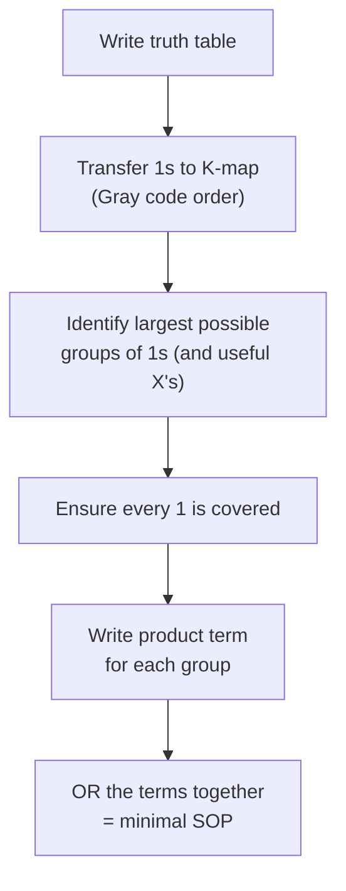

## Why Minimize?

A Boolean function can be written in many equivalent forms, but some require far fewer logic gates than others. **Minimization** finds the simplest equivalent expression. While algebraic simplification (previous topic) works, it requires intuition and is error-prone. The **Karnaugh Map (K-map)** is a systematic, visual method that almost guarantees the minimal result.

**Real-world analogy:** Imagine packing boxes into a truck. You could place them randomly, but with a systematic method (grouping similar boxes, filling spaces efficiently) you fit more in less space. A K-map systematically groups the 1s in a truth table to "pack" the logic into the fewest terms.

---

## What Is a Karnaugh Map?

A K-map is a **grid representation of a truth table**, arranged so that physically adjacent cells differ by exactly one variable. This adjacency is the key — when two adjacent cells both contain 1, the variable that differs between them can be eliminated.

**The core principle:** This is the graphical application of the rule $A + \overline{A} = 1$. If a term appears with both $A$ and $\overline{A}$ (but everything else the same), $A$ drops out.

### Map Sizes

| Inputs | Grid | Cells |
|---|---|---|
| 2 | 2×2 | 4 |
| 3 | 4×2 | 8 |
| 4 | 4×4 | 16 |

### Why Gray Code Ordering?

K-map rows and columns are labelled in **Gray code order** (00, 01, 11, 10) — NOT binary order (00, 01, 10, 11). This ensures only ONE variable changes between adjacent cells. Binary order would change two variables between 01 and 10, breaking the adjacency property.

---

## A 3-Input K-Map

Consider a function with truth table:

| A | B | C | X |
|---|---|---|---|
| 0 | 0 | 0 | 0 |
| 0 | 0 | 1 | 1 |
| 0 | 1 | 0 | 0 |
| 0 | 1 | 1 | 1 |
| 1 | 0 | 0 | 1 |
| 1 | 0 | 1 | 0 |
| 1 | 1 | 0 | 1 |
| 1 | 1 | 1 | 1 |

**Drawing the K-map** — rows are AB (in Gray code order: 00, 01, 11, 10), columns are C. The corner cell `AB \ C` shows which variable labels the rows and which labels the columns:

| AB \\ C | 0 | 1 |
|:---:|:---:|:---:|
| **00** | 0 | 1 |
| **01** | 0 | 1 |
| **11** | 1 | 1 |
| **10** | 1 | 0 |

---

## The Grouping Rules

These rules are critical — memorise them:

1. **Rectangles only** — no diagonal groups
2. **All cells in a group must be 1** — no zeros inside a group
3. **Group size must be a power of 2** — 1, 2, 4, 8, or 16 cells
4. **Edges wrap around** — left-right and top-bottom edges are adjacent
5. **Groups should be as LARGE as possible** — bigger groups = fewer variables
6. **Every 1 must be covered** by at least one group
7. **Minimize the number of groups** — each group becomes one product term

**Effect of group size on variable reduction:**

| Group size | Variables eliminated | Variables in term (4-var map) |
|---|---|---|
| 1 cell | 0 | 4 |
| 2 cells | 1 | 3 |
| 4 cells | 2 | 2 |
| 8 cells | 3 | 1 |
| 16 cells | 4 | 0 (output always 1) |

---

## Deriving a Product Term from a Group

For each group, look at which variables stay **constant** across all cells in that group:
- Variable always 0 → use its complement ($\overline{A}$)
- Variable always 1 → use the variable ($A$)
- Variable changes (0 and 1) → it drops out (not included)

---

## Complete Worked Example (3-Input)

Using the K-map above. The 1-cells are at: (AB=00, C=1), (AB=01, C=1), (AB=11, C=0), (AB=11, C=1), and (AB=10, C=0). We cover every 1 with the largest possible groups:

| AB \\ C | 0 | 1 |
|:---:|:---:|:---:|
| **00** | 0 | **1** |
| **01** | 0 | **1** |
| **11** | **1** | **1** |
| **10** | **1** | 0 |

**Group 1 — right column, cells (AB=00, C=1) and (AB=01, C=1):**
- A is always 0 → $\overline{A}$
- B changes (0 then 1) → drops out
- C is always 1 → $C$
- Term: $\overline{A}C$

**Group 2 — the AB=11 row (both C=0 and C=1):**
- A always 1, B always 1 → $AB$
- C varies → drops out
- Term: $AB$

**Group 3 — left column, cells (AB=11, C=0) and (AB=10, C=0):**
- A always 1, C always 0 → $A\overline{C}$
- B varies → drops out
- Term: $A\overline{C}$

**Minimized expression:**

$$X = \overline{A}C + AB + A\overline{C}$$

This is far simpler than the original sum-of-products from the truth table (which would have 5 three-variable terms).

---

## 4-Input K-Map Worked Example

Truth table with 1s at minterms 0, 2, 8, 9, 10, 11, 14, 15.

**K-map** — rows are AB, columns are CD, both in Gray code order:

| AB \\ CD | 00 | 01 | 11 | 10 |
|:---:|:---:|:---:|:---:|:---:|
| **00** | 1 | 0 | 0 | 1 |
| **01** | 0 | 0 | 0 | 0 |
| **11** | 0 | 0 | 1 | 1 |
| **10** | 1 | 1 | 1 | 1 |

**Identifying groups:**

**Group 1 — entire bottom row (AB=10), 4 cells:**
- A always 1, B always 0 → $A\overline{B}$
- C and D vary → drop out
- Term: $A\overline{B}$

**Group 2 — lower-right 2×2 block (AB=11 and AB=10, CD=11 and CD=10):**
- A always 1, C always 1 → $AC$
- B and D vary → drop out
- Term: $AC$

**Group 3 — four corners (AB=00 and AB=10, CD=00 and CD=10) — wrapping edges:**
- B always 0, D always 0 → $\overline{B}\,\overline{D}$
- A and C vary → drop out
- Term: $\overline{B}\,\overline{D}$

**Minimized expression:**

$$X = A\overline{B} + AC + \overline{B}\,\overline{D}$$

---

## Don't-Care Conditions (Incompletely Specified Functions)

Sometimes certain input combinations **never occur** in practice, or we **don't care** what the output is for them. These are marked with `X` (or `d`) in the truth table.

**Rule:** Treat each don't-care as **whatever value makes your groups larger** (and thus your expression simpler). If treating it as 1 helps make a bigger group, treat it as 1. If it does not help, treat it as 0.

**Example:** A function for BCD inputs (0–9) has don't-cares for 10–15 (these inputs never occur because BCD only uses 0–9).

| AB \\ CD | 00 | 01 | 11 | 10 |
|:---:|:---:|:---:|:---:|:---:|
| **00** | 1 | 0 | 1 | 0 |
| **01** | 0 | 1 | 1 | 0 |
| **11** | X | X | X | X |
| **10** | 1 | 0 | X | X |

(The `X` cells in rows AB=11 and the last two of AB=10 are don't-cares — inputs 10–15, which never occur in BCD.)

By treating selected don't-cares as 1, we can form larger groups and obtain a simpler expression than if we forced them all to 0.

---

## K-Map Procedure Summary

---

## Key Takeaway

> A Karnaugh map is a grid arrangement of a truth table where adjacent cells differ by one variable (Gray code ordering). Group adjacent 1s into rectangles of size $2^k$ — larger groups eliminate more variables. For each group, keep only the variables that stay constant. The OR of all group terms is the minimal sum-of-products. Don't-care conditions (`X`) can be treated as 0 or 1, whichever produces larger groups and a simpler expression. K-maps reduce circuit gate count systematically and visually.

---

## Exam Tips

**What lecturers test:**
- Draw a K-map from a truth table (correct Gray code ordering)
- Identify the largest valid groups
- Write the minimal SOP expression
- Use don't-care conditions to simplify further
- State all grouping rules

**Common mistakes:**
- Using binary order (00,01,10,11) instead of Gray code (00,01,11,10) for labels
- Making groups that are not powers of 2 (e.g., a group of 3 cells — illegal)
- Forgetting that edges wrap around (corners can group together)
- Not making groups as large as possible (results in a non-minimal expression)

**Likely question:**
> "Minimize the following Boolean function using a Karnaugh map: $F(A,B,C,D) = \sum(0,1,2,5,8,9,10)$ with don't-cares at $(3,11)$. Draw the K-map, show your groupings, and write the minimal sum-of-products expression." (15 marks)
