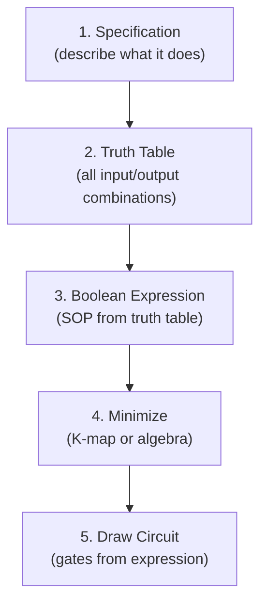
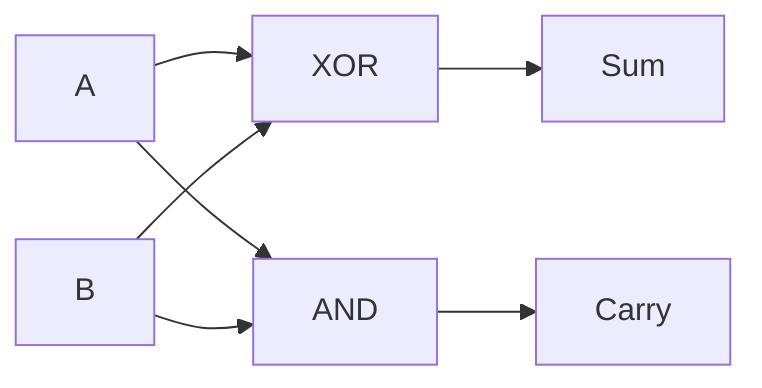
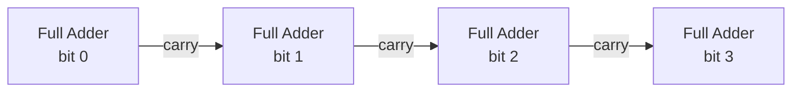
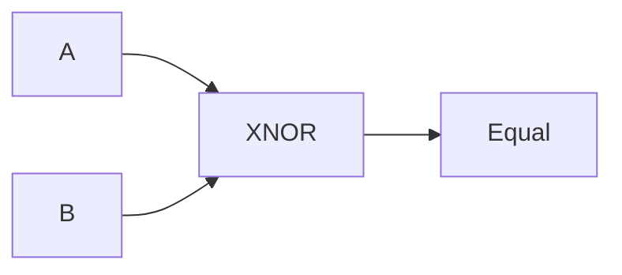

## What Is a Combinational Circuit?

A **combinational circuit** is one whose output depends **only on its current inputs** — it has no memory of past inputs. Given the same inputs, it always produces the same outputs.

This contrasts with **sequential circuits** (covered in later courses), whose output depends on both current inputs AND stored state (memory).

| Type | Output depends on | Examples |
|---|---|---|
| **Combinational** | Current inputs only | Adders, decoders, multiplexers |
| **Sequential** | Current inputs + stored state | Counters, registers, flip-flops |

**Real-world analogy:** A combinational circuit is like a vending machine button panel — press a button, get a specific output, no matter what you pressed before. A sequential circuit is like a combination lock — the output depends on the sequence of past inputs.

---

## The Combinational Design Process

Designing a combinational circuit follows a systematic process:



We will apply this process to design real building blocks.

---

## Building Block 1: The Multiplexer (MUX)

A **multiplexer** is a "data selector" — it routes one of several input signals to a single output, based on select lines.

**Analogy:** A multiplexer is like a railway switch operator who chooses which of several incoming tracks connects to the single outgoing track. The "select lines" are the operator's decision.

### 2-to-1 Multiplexer

Inputs: $I_0$, $I_1$ (data); $S$ (select). Output: $Y$.

- If $S = 0$: $Y = I_0$
- If $S = 1$: $Y = I_1$

**Truth table:**

| S | $I_0$ | $I_1$ | Y |
|---|---|---|---|
| 0 | 0 | x | 0 |
| 0 | 1 | x | 1 |
| 1 | x | 0 | 0 |
| 1 | x | 1 | 1 |

**Boolean expression:**

$$Y = \overline{S} \cdot I_0 + S \cdot I_1$$

**Reading it:** When $S=0$, the first term passes $I_0$; when $S=1$, the second term passes $I_1$.

### 4-to-1 Multiplexer

4 data inputs ($I_0$–$I_3$), 2 select lines ($S_1, S_0$), 1 output.

$$Y = \overline{S_1}\,\overline{S_0}\,I_0 + \overline{S_1}S_0 I_1 + S_1\overline{S_0}I_2 + S_1 S_0 I_3$$

| $S_1$ | $S_0$ | Output |
|---|---|---|
| 0 | 0 | $I_0$ |
| 0 | 1 | $I_1$ |
| 1 | 0 | $I_2$ |
| 1 | 1 | $I_3$ |

**Uses:** Data routing, implementing Boolean functions, building processors (selecting which register feeds the ALU).

---

## Building Block 2: The Decoder

A **decoder** takes an $n$-bit input and activates exactly one of $2^n$ output lines — the one corresponding to the input value.

**Analogy:** A decoder is like a postal sorting machine — it reads an address (binary input) and routes the letter to exactly one of many mailboxes (output lines).

### 2-to-4 Decoder

2 inputs ($A_1, A_0$), 4 outputs ($D_0$–$D_3$). The output corresponding to the binary input value is 1; all others are 0.

**Truth table:**

| $A_1$ | $A_0$ | $D_0$ | $D_1$ | $D_2$ | $D_3$ |
|---|---|---|---|---|---|
| 0 | 0 | 1 | 0 | 0 | 0 |
| 0 | 1 | 0 | 1 | 0 | 0 |
| 1 | 0 | 0 | 0 | 1 | 0 |
| 1 | 1 | 0 | 0 | 0 | 1 |

**Boolean expressions:**

$$D_0 = \overline{A_1}\,\overline{A_0} \qquad D_1 = \overline{A_1}A_0$$
$$D_2 = A_1\overline{A_0} \qquad D_3 = A_1 A_0$$

**Uses:** Memory address decoding (selecting which memory chip to access), instruction decoding in processors, driving 7-segment displays.

---

## Building Block 3: The Comparator

A **comparator** compares two binary numbers and indicates whether they are equal, or which is greater.

### 1-Bit Comparator

Compares two bits A and B. Three outputs: $A > B$, $A = B$, $A < B$.

**Truth table:**

| A | B | A&gt;B | A=B | A&lt;B |
|---|---|---|---|---|
| 0 | 0 | 0 | 1 | 0 |
| 0 | 1 | 0 | 0 | 1 |
| 1 | 0 | 1 | 0 | 0 |
| 1 | 1 | 0 | 1 | 0 |

**Boolean expressions:**

$$(A > B) = A\overline{B}$$
$$(A < B) = \overline{A}B$$
$$(A = B) = \overline{A}\,\overline{B} + AB = \overline{A \oplus B} \quad \text{(XNOR)}$$

Equality is just XNOR — the output is 1 when both bits are the same.

**Uses:** Sorting hardware, decision-making circuits, address matching.

---

## Building Block 4: Adders

Adders perform binary addition — the foundation of all arithmetic in a computer.

### Half Adder

Adds two single bits A and B, producing a Sum and a Carry.

**Truth table:**

| A | B | Sum | Carry |
|---|---|---|---|
| 0 | 0 | 0 | 0 |
| 0 | 1 | 1 | 0 |
| 1 | 0 | 1 | 0 |
| 1 | 1 | 0 | 1 |

**Boolean expressions:**

$$\text{Sum} = A \oplus B \quad \text{(XOR)}$$
$$\text{Carry} = A \cdot B \quad \text{(AND)}$$

**Why XOR for sum?** $1 + 1 = 10_2$, so the sum bit is 0 and carry is 1. XOR captures "sum is 1 when bits differ."



### Full Adder

The half adder cannot handle a carry coming IN from a previous bit position. The **full adder** adds three bits: A, B, and Carry-in ($C_{in}$).

**Truth table:**

| A | B | $C_{in}$ | Sum | $C_{out}$ |
|---|---|---|---|---|
| 0 | 0 | 0 | 0 | 0 |
| 0 | 0 | 1 | 1 | 0 |
| 0 | 1 | 0 | 1 | 0 |
| 0 | 1 | 1 | 0 | 1 |
| 1 | 0 | 0 | 1 | 0 |
| 1 | 0 | 1 | 0 | 1 |
| 1 | 1 | 0 | 0 | 1 |
| 1 | 1 | 1 | 1 | 1 |

**Boolean expressions:**

$$\text{Sum} = A \oplus B \oplus C_{in}$$
$$C_{out} = AB + C_{in}(A \oplus B)$$

### Ripple-Carry Adder

To add multi-bit numbers, chain full adders — the carry-out of each feeds the carry-in of the next:



To add two 4-bit numbers, use four full adders. The carry "ripples" from the least significant bit to the most significant.

**Worked example: Add $0110_2$ (6) + $0101_2$ (5):**

```
  Carry: 1 1 0 0
       0 1 1 0   (6)
     + 0 1 0 1   (5)
     ---------
       1 0 1 1   (11) ✓
```

Bit 0: $0+1+0 = 1$, carry 0  
Bit 1: $1+0+0 = 1$, carry 0... let me recompute:  
Bit 0: $0+1 = 1$, carry 0  
Bit 1: $1+0+0 = 1$, carry 0  
Bit 2: $1+1+0 = 0$, carry 1  
Bit 3: $0+0+1 = 1$, carry 0  
Result: $1011_2 = 11_{10}$ ✓

**Limitation:** The carry must ripple through all bits, so propagation delay accumulates. For fast addition, more complex designs (carry-lookahead adders) are used.

---

## Complete Design Example: A 1-Bit Comparator

Let us apply the full design process to build the "A = B" output of a comparator.

**Step 1 — Specification:** Output 1 when bit A equals bit B.

**Step 2 — Truth table:**

| A | B | Equal |
|---|---|---|
| 0 | 0 | 1 |
| 0 | 1 | 0 |
| 1 | 0 | 0 |
| 1 | 1 | 1 |

**Step 3 — Boolean expression (SOP — sum the rows where output is 1):**

$$\text{Equal} = \overline{A}\,\overline{B} + AB$$

**Step 4 — Minimize:** This is already minimal. Recognise it as XNOR: $\text{Equal} = \overline{A \oplus B}$.

**Step 5 — Circuit:** One XNOR gate.



---

## Key Takeaway

> Combinational circuits produce outputs based only on current inputs (no memory). The design process is: specify → truth table → Boolean expression → minimize → draw circuit. Key building blocks: the **multiplexer** (selects one of many inputs), the **decoder** (activates one of $2^n$ outputs), the **comparator** (compares two values), and **adders** (half adder for 2 bits, full adder for 3 bits including carry-in, chained into ripple-carry adders for multi-bit addition). These blocks combine to build everything from processors to memory systems.

---

## Exam Tips

**What lecturers test:**
- Derive the truth table and Boolean expression for a half adder and full adder
- Explain the difference between a half adder and a full adder
- Design a 2-to-4 decoder or 4-to-1 multiplexer (truth table + expressions)
- Apply the full design process to a described circuit
- Trace a ripple-carry addition showing carries

**Common mistakes:**
- Forgetting that the full adder has 3 inputs (A, B, and carry-in), giving 8 truth table rows
- Confusing multiplexer (many inputs → one output) with decoder (one input value → one of many outputs active)
- Using AND for sum instead of XOR (sum = XOR, carry = AND in a half adder)

**Likely question:**
> "Design a full adder. (a) Write its truth table. (b) Derive the Boolean expressions for Sum and Carry-out. (c) Explain how full adders are chained to add two 4-bit numbers, and state the limitation of this approach." (15 marks)
