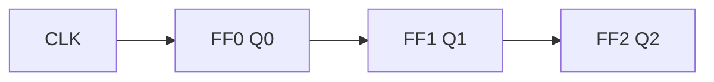

## What Counters and Registers Do

Two of the most useful sequential blocks are built by wiring flip-flops together:

- A **counter** cycles through a fixed sequence of binary states, one step per clock pulse — used for counting events, generating addresses, and dividing frequency.
- A **register** stores a group of bits as a unit — used to hold data words and to shift/serialise them.

**Real-world analogy:** A counter is the odometer of a car — each pulse (kilometre) advances it through a fixed numeric sequence and it rolls over at its maximum. A shift register is a bucket brigade — on each clock, every bit passes to its neighbour.

---

## Asynchronous (Ripple) Counters

In a **ripple counter**, only the first flip-flop sees the clock. Each flip-flop's output clocks the next one. They are wired as toggle (T=1 or JK=11) flip-flops.

For a 3-bit up-counter, $Q_2Q_1Q_0$ steps 000 → 001 → 010 → … → 111 → 000.

**The catch:** the clock "ripples" through the chain, so each stage adds a flip-flop propagation delay. The outputs do **not** all change at once, producing brief wrong values (decoding spikes) and limiting speed. Simple to build, but not for high frequencies.

---

## Synchronous Counters

In a **synchronous counter**, **all flip-flops share the same clock**, so every bit updates simultaneously. Combinational logic decides which flip-flops toggle.

**Toggle rule:** a flip-flop toggles when **all lower-order bits are 1**.

$$T_0 = 1,\quad T_1 = Q_0,\quad T_2 = Q_0 Q_1,\quad T_3 = Q_0 Q_1 Q_2$$

| Feature | Ripple (async) | Synchronous |
|---|---|---|
| Clocking | each FF clocks the next | all FFs share clock |
| Speed | slow (cumulative delay) | fast (one FF delay) |
| Output glitches | yes | no |
| Logic complexity | minimal | extra AND gates |

Synchronous counters cost more gates but are faster and glitch-free — the standard choice.

---

## Mod-N Counters

A counter's **modulus** is how many distinct states it cycles through before repeating. $n$ flip-flops give a natural modulus of $2^n$.

A **mod-N** counter (where $N < 2^n$) is made by **detecting the count = N and resetting** to zero. The classic example is a **decade (mod-10)** counter: 4 flip-flops (max 16) reset the instant the count reaches 1010 (10), so it cycles 0–9.

$$\text{flip-flops needed} = \lceil \log_2 N \rceil$$

---

## Up, Down and Up/Down Counters

- **Up counter:** counts 000 → 111.
- **Down counter:** counts 111 → 000 (toggle logic uses $\overline{Q}$ of lower bits).
- **Up/Down counter:** a mode input M selects direction by switching between $Q$ and $\overline{Q}$ feeds.

---

## Registers

A **register** is a row of flip-flops sharing a clock, storing an $n$-bit word. The simplest is a **parallel load register**: $n$ D flip-flops capturing $n$ data lines on one clock edge.

### Shift Registers

A **shift register** moves its stored bits one position per clock. They are classified by how data enters and leaves:

| Type | Abbrev. | Data in | Data out |
|---|---|---|---|
| Serial-In Serial-Out | SISO | one bit/clock | one bit/clock |
| Serial-In Parallel-Out | SIPO | one bit/clock | all bits at once |
| Parallel-In Serial-Out | PISO | all bits at once | one bit/clock |
| Parallel-In Parallel-Out | PIPO | all bits at once | all bits at once |

**Uses:** serial↔parallel conversion (SIPO/PISO are the heart of UART/serial communication), temporary storage, and delay lines.

### Ring and Johnson Counters

Feeding a shift register's output back to its input makes a counter:

- **Ring counter:** last output → first input. A single 1 circulates (1000 → 0100 → 0010 → 0001 → …) — $n$ states from $n$ flip-flops.
- **Johnson (twisted-ring) counter:** the **complemented** last output feeds back, giving $2n$ states from $n$ flip-flops.

<ExamTip>
Know the state counts cold: an $n$-bit **ring** counter has **n** states; an $n$-bit **Johnson** counter has **2n** states; a plain binary counter has **$2^n$** states. This comparison is a frequent short-answer question.
</ExamTip>

---

## Counters as Frequency Dividers

Because each flip-flop in a binary counter toggles at half the rate of the one before it, a counter is also a **frequency divider**. A single toggle flip-flop divides the clock by 2; an $n$-bit counter's top bit divides by $2^n$. This is how digital clocks derive 1 Hz from a fast crystal oscillator.

---

## Key Takeaway

> Counters and registers are flip-flops wired with purpose. **Ripple (asynchronous) counters** are simple but slow and glitchy because the clock propagates stage to stage; **synchronous counters** clock all flip-flops together for speed and clean outputs. A **mod-N** counter resets on reaching N (e.g. decade = mod-10). **Registers** store words; **shift registers** move bits one position per clock and come in SISO/SIPO/PISO/PIPO forms for serial↔parallel conversion. Feeding output back gives **ring** ($n$ states) and **Johnson** ($2n$ states) counters. Any binary counter is also a **frequency divider by $2^n$**.

---

## Exam Tips

**What lecturers test:**
- Contrast asynchronous (ripple) and synchronous counters with reasons
- Design a mod-N (e.g. decade) counter and state how many flip-flops it needs
- Give the toggle equations of a synchronous up-counter
- Classify shift registers (SISO/SIPO/PISO/PIPO) and state their uses
- Compare ring vs Johnson vs binary counter state counts

**Common mistakes:**
- Claiming ripple counters are glitch-free (they are not — outputs change one after another)
- Wrong modulus: $n$ flip-flops give $2^n$ states, mod-N needs detect-and-reset
- Confusing ring ($n$ states) with Johnson ($2n$ states)

**Likely question:**
> "(a) Explain, with a diagram, the difference between an asynchronous and a synchronous 4-bit counter, and state two advantages of the synchronous type. (b) Design a mod-10 (decade) counter, indicating how the count of ten is detected and reset." (15 marks)
