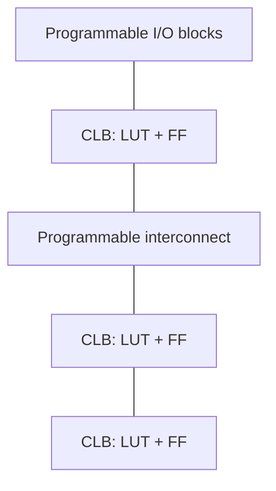

## From Equations to Silicon

You can minimise a Boolean function perfectly, but it still has to be **built**. This topic covers the menu of technologies that turn a logic design into a working chip, and the engineering trade-offs — cost, speed, flexibility, time-to-market — that decide which one to use.

**Real-world analogy:** Implementing logic is like producing a document. A **fixed-function chip / ASIC** is like printing thousands of identical books at a press — huge setup cost, but each copy is cheap and optimal. A **programmable device (FPGA)** is like a reusable whiteboard — instantly changeable, perfect for a few copies or while you're still editing, but costlier per unit and a little slower.

---

## Two Broad Routes

| Route | What it is | Best when |
|---|---|---|
| **Fixed (standard) logic** | off-the-shelf gate/MSI chips (e.g. 74-series) wired together | small designs, learning, prototypes |
| **Programmable logic** | a generic chip configured by the user (PLD/CPLD/FPGA) | medium volume, evolving designs |
| **Custom (ASIC)** | a chip fabricated for one specific design | very high volume, peak performance |

---

## Programmable Logic Devices (PLDs)

A **PLD** contains a generic array of gates whose connections the user **programs**. The classic small PLDs are based on an **AND array** feeding an **OR array** — exactly the two-level **SOP** structure. They differ in which array is programmable:

| Device | AND array | OR array | Flexibility |
|---|---|---|---|
| **ROM** | fixed (full decoder) | programmable | every minterm available |
| **PLA** (Programmable Logic Array) | programmable | programmable | most flexible (share product terms) |
| **PAL** (Programmable Array Logic) | programmable | fixed | faster, cheaper, less flexible |

- **ROM** as logic: the address lines are the inputs, the stored word is the output — it implements *any* function of its inputs (a full truth table) but wastes capacity on unused minterms.
- **PLA:** both arrays programmable, so product terms can be shared across outputs — densest use of terms.
- **PAL:** only the AND array is programmable (fixed OR connections). Less flexible but faster and cheaper — historically the most popular small PLD.

---

## CPLDs and FPGAs

As designs grew, PLDs scaled up:

- **CPLD (Complex PLD):** several PAL-like blocks linked by a programmable interconnect on one chip. Non-volatile, predictable timing, good for moderate logic and control.
- **FPGA (Field-Programmable Gate Array):** a large grid of **configurable logic blocks (CLBs)** — each typically a small **look-up table (LUT)** plus a flip-flop — joined by a vast **programmable interconnect**, with programmable I/O blocks around the edge.

FPGAs implement logic not as fixed gates but as **truth tables stored in LUTs**, so the same chip can become almost any digital circuit — even a whole processor — and be **re-programmed** in seconds. They are the dominant choice for prototyping and low-to-medium volume products.

---

## ASICs (Application-Specific Integrated Circuits)

An **ASIC** is a chip designed and fabricated for **one** application. Sub-routes trade off design effort vs optimality:

| ASIC style | Description | NRE cost | Performance |
|---|---|---|---|
| **Gate array / structured** | pre-made transistor array, only wiring customised | medium | good |
| **Standard cell** | built from a library of pre-designed cells | high | very good |
| **Full custom** | every transistor hand-designed | very high | best |

ASICs give the highest speed, lowest power and lowest per-unit cost — but only after a large **NRE (Non-Recurring Engineering)** cost and long design time. They make sense only at **high volume**.

---

## Choosing a Design Route

The decision balances several factors:

| Factor | Favours programmable (FPGA/CPLD) | Favours custom (ASIC) |
|---|---|---|
| Production volume | low–medium | high |
| Time to market | fast (reprogram) | slow (fabrication) |
| Unit cost | higher | lower (at volume) |
| NRE / setup cost | low | very high |
| Performance / power | good | best |
| Design changes likely? | yes (reprogrammable) | no (fixed in silicon) |

**Rule of thumb:** prototype and ship early volumes on an **FPGA**; if volume grows large enough that per-unit savings outweigh the NRE, migrate the proven design to an **ASIC**.

<ExamTip>
Lecturers love the **PLA vs PAL** distinction: in a **PLA both** the AND and OR arrays are programmable; in a **PAL only the AND** array is programmable (the OR array is fixed). PAL is faster and cheaper; PLA is more flexible. Also know that an **FPGA uses LUTs** to store logic, which is why it is reconfigurable.
</ExamTip>

---

## Key Takeaway

> A logic design is realised either as **fixed/standard logic**, **programmable logic**, or a **custom ASIC**. Small **PLDs** use an AND-array → OR-array (SOP) structure: **ROM** (fixed AND, programmable OR), **PLA** (both programmable, most flexible), **PAL** (programmable AND, fixed OR — fast and cheap). **CPLDs** chain PAL-blocks; **FPGAs** use a sea of **LUT-based CLBs** with programmable interconnect, making them reconfigurable and ideal for prototyping. **ASICs** (gate-array, standard-cell, full-custom) give the best performance and lowest unit cost but only at high volume due to large NRE cost. Choosing a route balances **volume, time-to-market, unit cost, NRE and performance**.

---

## Exam Tips

**What lecturers test:**
- Compare ROM, PLA and PAL by which arrays are programmable
- Describe the FPGA architecture (CLBs/LUTs, interconnect, I/O blocks) and why it is reconfigurable
- Contrast programmable logic with ASICs on cost, volume and flexibility
- Justify a design route for a given volume / time-to-market scenario

**Common mistakes:**
- Swapping PLA and PAL (PLA = both arrays programmable; PAL = AND only)
- Calling an FPGA an ASIC — FPGAs are *field*-programmable and reusable
- Ignoring NRE cost when arguing ASICs are "cheaper" (cheaper only per unit at high volume)
- Forgetting that ROM-as-logic implements the full truth table (every minterm)

**Likely question:**
> "(a) Using a block diagram, explain the structure common to ROM, PLA and PAL, and state which arrays are programmable in each. (b) Describe the architecture of an FPGA and explain why it can be reprogrammed. (c) Compare an FPGA and an ASIC implementation of the same design in terms of cost, performance and production volume." (18 marks)
