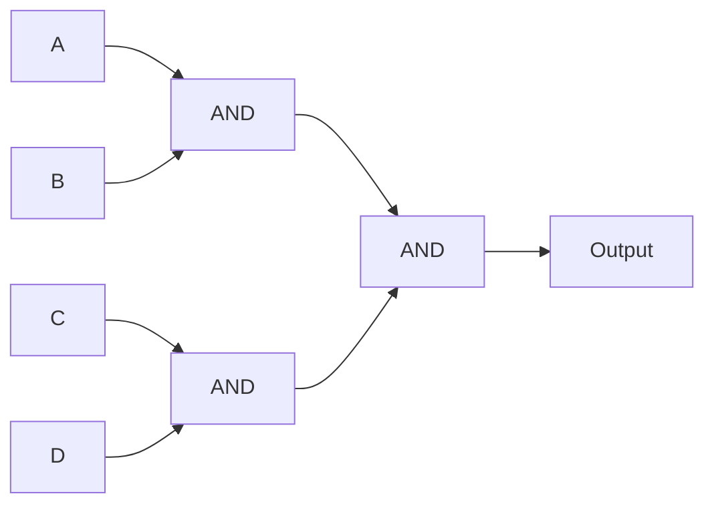
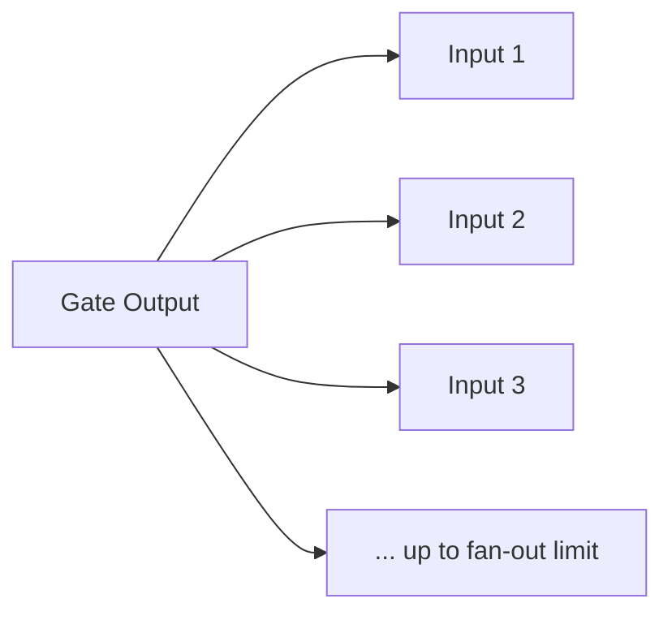
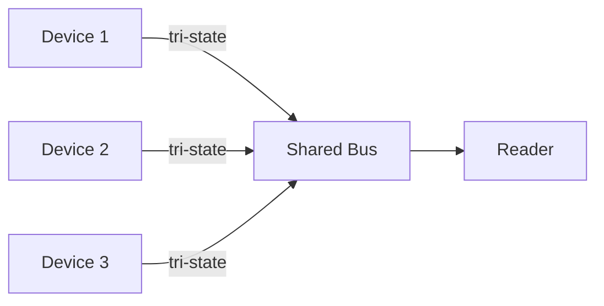

## Beyond the Ideal Gate

So far we have treated logic gates as perfect mathematical objects: inputs go in, the correct output comes out instantly. But real gates are physical electronic devices. They have limits:
- They can only drive a limited number of other gates (fan-out)
- They can only accept a limited number of inputs (fan-in)
- They take time to respond (propagation delay)
- Their outputs cannot be directly connected together (unless using tri-state)

Understanding these physical properties is essential for designing circuits that actually work in hardware.

**Real-world analogy:** A water tap (gate) has physical limits. It can only supply so much water pressure (drive so many outlets — fan-out). It takes a moment for water to start flowing when you open it (propagation delay). You cannot connect two taps to the same pipe and have them both push water without conflict (the tri-state problem).

---

## Fan-In

**Fan-in** is the number of inputs a single logic gate can accept.

- A 2-input AND gate has fan-in of 2
- A 4-input OR gate has fan-in of 4

**Physical limit:** As fan-in increases, the gate becomes slower and requires more silicon area. Most gates have a practical fan-in limit (typically 4–8 inputs). To build a gate with more inputs, you combine smaller gates.

**Example — building an 8-input AND from 2-input ANDs:**



Higher fan-in means fewer levels of gates (faster) but each gate is slower. There is a design trade-off.

---

## Fan-Out

**Fan-out** is the number of gate inputs that a single gate output can drive reliably.

Each gate input draws a small amount of current. A gate output can only supply a limited current. If you connect the output to too many inputs, the voltage levels degrade and the circuit malfunctions.

**Example:** A gate with fan-out of 10 can drive up to 10 other gate inputs. Connecting it to an 11th input risks unreliable operation.



**Solution when fan-out is exceeded:** Use a **buffer** — a gate that simply passes its input to its output but provides more driving current. Buffers "amplify" the signal to drive more loads.

---

## Propagation Delay

**Propagation delay** ($t_{pd}$) is the time between an input change and the corresponding output change. No real gate responds instantly — electrons take time to move through transistors.

**Typical values:** 1–10 nanoseconds (billionths of a second) per gate for common logic families.

**Why it matters:** In a circuit with several layers of gates, the total delay is the sum of delays along the longest path (the **critical path**). This determines the maximum speed at which the circuit can operate.

**Example:** If a signal passes through 5 gates, each with 2 ns delay, the total propagation delay is:

$$5 \times 2\,\text{ns} = 10\,\text{ns}$$

The circuit cannot reliably accept new inputs faster than every 10 ns. This is what limits a processor's clock speed.

### Propagation Delay Causes Glitches

Because different paths through a circuit have different delays, the output can momentarily show a wrong value before settling. These transient wrong values are called **glitches** or **hazards**.

---

## Timing Diagrams

A **timing diagram** shows how signals change over time. The horizontal axis is time; the vertical axis shows the logic level (0 or 1) of each signal.

**Example — an inverter with propagation delay:**

```
Input A:   ___╱‾‾‾‾‾‾‾╲_________
                                  
Output X:  ‾‾‾‾‾╲_______╱‾‾‾‾‾‾‾
              ↑         ↑
              delay     delay
```

When input A rises, output X falls — but only after the propagation delay. The output is the inverse of the input, shifted in time by $t_{pd}$.

**Reading a timing diagram for an AND gate:**

```
Time:    0    1    2    3    4    5
A:       0    1    1    0    1    1
B:       0    0    1    1    1    0
A·B:     0    0    1    0    1    0   (after delay)
```

The output A·B is 1 only when both A and B are 1 — but each transition is delayed by $t_{pd}$.

---

## Tri-State Drivers

In a normal logic gate, the output is always either 0 or 1. But what if we want multiple devices to share a single wire (a **bus**)? If two normal gates drive the same wire and one outputs 0 while the other outputs 1, there is a conflict — a short circuit that can damage the gates.

A **tri-state driver** solves this. It has three possible output states:
1. Logic 0
2. Logic 1
3. **High impedance (Z)** — effectively disconnected from the wire

A tri-state buffer has an **enable** input:

| Enable | Input | Output |
|---|---|---|
| 1 | 0 | 0 |
| 1 | 1 | 1 |
| 0 | X (any) | Z (high impedance) |

When enabled, it passes its input. When disabled, its output "floats" — electrically disconnected.



**How a bus works:** Only ONE tri-state driver is enabled at a time. The others are in high-impedance (Z) state, effectively disconnected. This lets many devices share one set of wires — fundamental to how processors communicate with memory and peripherals.

**Real-world analogy:** A bus is like a conference call where only one person speaks at a time (enabled). Everyone else mutes their microphone (high-impedance). If two people speak at once, you get garbled noise (bus conflict).

---

## Putting It Together: Design Implications

| Property | Design consideration |
|---|---|
| Fan-in | Limit inputs per gate; build large gates from small ones |
| Fan-out | Add buffers when driving many loads |
| Propagation delay | Minimise critical path length; determines max clock speed |
| Tri-state | Enables shared buses; only one driver active at a time |

A circuit that is logically correct (per Boolean algebra) can still fail in hardware if these physical properties are ignored. For example, exceeding fan-out causes unreliable voltage levels; ignoring propagation delay causes timing errors at high clock speeds.

---

## Key Takeaway

> Real logic gates have physical limitations. **Fan-in** is the number of inputs a gate accepts; **fan-out** is the number of inputs one output can drive (exceed it and add a buffer). **Propagation delay** is the time for an output to respond — it accumulates along the critical path and limits circuit speed. **Timing diagrams** visualise how signals change over time, including delays. **Tri-state drivers** have a third "high impedance" state that lets multiple devices share a bus — essential for connecting processors, memory, and peripherals.

---

## Exam Tips

**What lecturers test:**
- Define fan-in and fan-out; explain what happens when fan-out is exceeded
- Calculate total propagation delay through a chain of gates
- Draw or interpret a timing diagram for a gate (showing propagation delay)
- Explain the three states of a tri-state driver and why they enable buses
- Explain why two normal gate outputs cannot be directly connected

**Common mistakes:**
- Confusing fan-in (inputs accepted) with fan-out (outputs driven)
- Forgetting that propagation delays add up along a path
- Thinking high-impedance (Z) is the same as logic 0 — it is "disconnected", not "zero"

**Likely question:**
> "(a) Define fan-in and fan-out. What is the consequence of exceeding the fan-out of a gate, and how is it solved? (b) A signal passes through 6 gates each with propagation delay 3 ns. Calculate the total delay and explain how this limits clock speed. (c) Explain the three states of a tri-state buffer and why it is needed for a shared bus." (15 marks)
