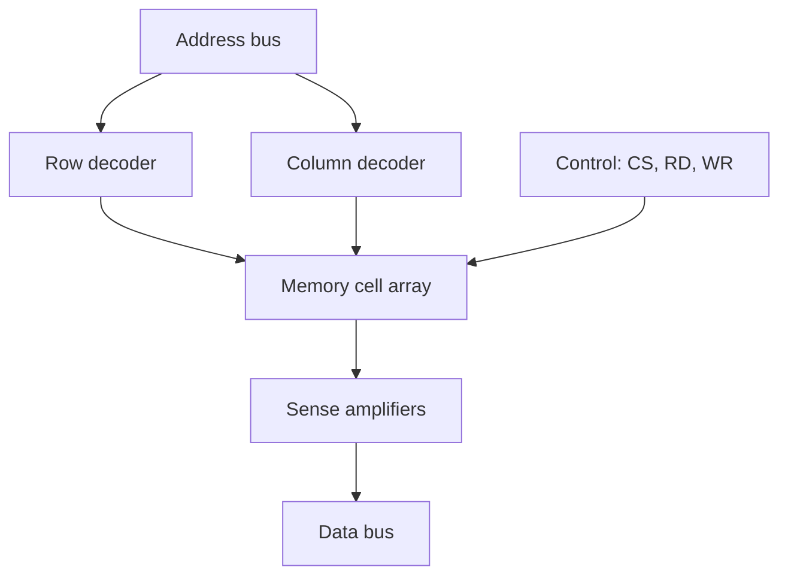

## From One Bit to Millions

A flip-flop stores one bit. To store thousands or billions of bits we use **semiconductor memory**: a regular array of cells, each holding one bit, organised so any location can be selected by its **address**. Memory is classified first by whether it can be written freely (RAM) or is mostly read (ROM), and by whether it keeps data when power is removed.

**Real-world analogy:** A memory chip is a giant grid of numbered pigeonholes. The **address** is the pigeonhole number, the **data** lines carry the letter you put in or take out, and the **control** lines say whether you're reading or writing.

---

## The Big Divide: Volatile vs Non-Volatile

| Property | Volatile | Non-volatile |
|---|---|---|
| Keeps data without power? | No | Yes |
| Typical examples | RAM (SRAM, DRAM) | ROM, Flash |
| Main use | working memory | firmware, storage |

---

## RAM (Random Access Memory)

"Random access" means **any location takes the same time to reach**, regardless of order. RAM is read/write and **volatile**. Two families:

### SRAM (Static RAM)

Each cell is a small flip-flop (typically 6 transistors). It holds its value **as long as power is applied** — no refreshing needed.

- **Fast**, simple to use.
- **Low density**, expensive (6 transistors/bit).
- Used for **cache memory** and registers.

### DRAM (Dynamic RAM)

Each cell is **one transistor + one capacitor**. The bit is the charge on the capacitor.

- **High density**, cheap (1 transistor/bit) → used for **main memory**.
- The capacitor leaks, so each cell must be **refreshed** (re-read and rewritten) every few milliseconds.
- Slower than SRAM because of refresh and access overhead.

| Feature | SRAM | DRAM |
|---|---|---|
| Cell | flip-flop (~6 transistors) | 1 transistor + 1 capacitor |
| Refresh needed? | No | Yes (periodic) |
| Speed | Faster | Slower |
| Density / cost | Low / expensive | High / cheap |
| Typical use | Cache | Main memory |

<ExamTip>
The single most-tested distinction in this topic: **SRAM uses a flip-flop and needs no refresh; DRAM uses a capacitor and must be periodically refreshed.** SRAM = fast/costly/cache; DRAM = dense/cheap/main memory.
</ExamTip>

---

## ROM (Read-Only Memory)

ROM is **non-volatile** — it retains data without power. The classic ROM is read-only in normal operation; the family differs in *how* (and whether) it can be programmed and erased.

| Type | Programmed | Erased | Reusable? |
|---|---|---|---|
| **Mask ROM** | at the factory (fixed) | never | no |
| **PROM** | once by the user (blow fuses) | never | no |
| **EPROM** | electrically by the user | UV light (whole chip) | yes, slowly |
| **EEPROM** | electrically | electrically, byte by byte | yes |
| **Flash** | electrically | electrically, in **blocks** | yes (fast, dense) |

- **PROM** — Programmable ROM: user writes once by blowing internal fuses.
- **EPROM** — Erasable PROM: erased by shining ultraviolet light through a quartz window.
- **EEPROM** — Electrically Erasable PROM: erased/written electrically, one byte at a time — flexible but slower and larger per bit.
- **Flash** — an EEPROM variant erased in large **blocks**, giving high density and speed. It powers USB drives, SSDs, and phone storage.

---

## Inside a Memory Cell and Array

Cells are arranged in a 2-D **array** of rows and columns. To pick one cell:

- A **row decoder** activates one **word line** (selects a row).
- A **column decoder / sense amplifiers** select the bit(s) within that row.

A 1024-bit memory might be a 32×32 grid — far fewer decoder outputs than a single 1-of-1024 decoder would need.

---

## The Memory Interface: Address, Data, Control

Every memory chip exposes three buses:

- **Address bus** ($k$ lines) — selects which location. $k$ address lines address $2^k$ locations.
- **Data bus** ($n$ lines) — carries the word in/out; $n$ is the word width.
- **Control lines** — **Chip Select (CS)**, **Read (RD/OE)**, **Write (WR/WE)**.

**Capacity formula:**

$$\text{Capacity} = 2^{k} \times n \text{ bits}$$

**Worked example:** a chip with **10 address lines** and an **8-bit** data bus stores

$$2^{10} \times 8 = 1024 \times 8 = 8192 \text{ bits} = 1\text{ KB} \;(1024 \times 8\text{-bit words}).$$

---

## Memory Expansion

Single chips are combined to make bigger memories:

- **Word-width expansion:** place chips side by side to widen each word (two 1K×8 chips → 1K×16).
- **Capacity (depth) expansion:** stack chips and use the extra address bits with a decoder driving each chip's **Chip Select**, so only one chip responds at a time (two 1K×8 chips → 2K×8).

---

## Key Takeaway

> Semiconductor memory is an addressable array of one-bit cells. The first split is **volatile RAM** (read/write working memory) vs **non-volatile ROM/Flash**. Within RAM, **SRAM** = flip-flop cell, no refresh, fast, used for cache; **DRAM** = capacitor cell, needs refresh, dense and cheap, used for main memory. The **ROM family** ranges from one-time **PROM** through UV-erased **EPROM**, electrically erased **EEPROM**, to block-erased **Flash**. Every chip uses **address + data + control** buses, with capacity $2^k \times n$ bits, and chips are combined for word-width or depth expansion.

---

## Exam Tips

**What lecturers test:**
- Classify a memory as volatile/non-volatile and RAM/ROM
- Contrast SRAM and DRAM (cell, refresh, speed, use)
- Order the ROM family by how it is programmed and erased
- Compute capacity from address/data line counts, and vice versa
- Explain word vs depth memory expansion

**Common mistakes:**
- Saying DRAM is faster than SRAM (it is denser/cheaper, but slower)
- Forgetting that DRAM needs refresh because of capacitor leakage
- Confusing EPROM (UV erase) with EEPROM (electrical erase)
- Capacity errors — remember $2^k$ locations, each $n$ bits

**Likely question:**
> "(a) Distinguish between SRAM and DRAM in terms of cell structure, refresh requirement and typical application. (b) A memory chip has 12 address lines and an 8-bit data bus. State its capacity. (c) Show how two such chips can be connected to double the storage capacity." (15 marks)
