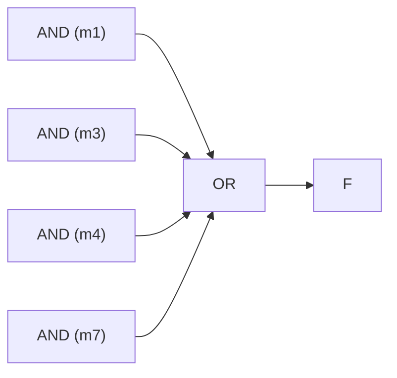

## Why Standard Forms Exist

Two engineers can write the *same* logic function in completely different-looking Boolean expressions. To compare, simplify, and feed functions into tools, we need **standard (canonical) forms** — a single agreed way to write any function directly from its truth table.

There are two canonical forms, and they are mirror images of each other:

- **Sum of Products (SOP)** — built from the rows where the output is **1**.
- **Product of Sums (POS)** — built from the rows where the output is **0**.

**Real-world analogy:** A truth table is a list of "for which inputs is the answer yes?" SOP lists all the *yes* cases and ORs them together. POS lists all the *no* cases and blocks them out. Both describe the same function — one by inclusion, one by exclusion.

---

## Literals, Product Terms, Sum Terms

- **Literal:** a variable or its complement — $A$, $\overline{A}$.
- **Product term:** literals ANDed together — $A\overline{B}C$.
- **Sum term:** literals ORed together — $(A + \overline{B} + C)$.

---

## Minterms

A **minterm** is a product term that includes **every** variable (each once, true or complemented). For $n$ variables there are $2^n$ minterms — one per truth-table row. A minterm equals 1 for *exactly one* input combination.

For variables A, B, C:

| Row | A | B | C | Minterm | Designation |
|---|---|---|---|---|---|
| 0 | 0 | 0 | 0 | $\overline{A}\,\overline{B}\,\overline{C}$ | $m_0$ |
| 1 | 0 | 0 | 1 | $\overline{A}\,\overline{B}\,C$ | $m_1$ |
| 2 | 0 | 1 | 0 | $\overline{A}\,B\,\overline{C}$ | $m_2$ |
| 3 | 0 | 1 | 1 | $\overline{A}\,B\,C$ | $m_3$ |
| 4 | 1 | 0 | 0 | $A\,\overline{B}\,\overline{C}$ | $m_4$ |
| 5 | 1 | 0 | 1 | $A\,\overline{B}\,C$ | $m_5$ |
| 6 | 1 | 1 | 0 | $A\,B\,\overline{C}$ | $m_6$ |
| 7 | 1 | 1 | 1 | $A\,B\,C$ | $m_7$ |

**Rule:** in a minterm, a variable appears **complemented if its value is 0**, **uncomplemented if its value is 1**.

---

## Maxterms

A **maxterm** is a sum term containing every variable. A maxterm equals 0 for exactly one input combination. The complementary rule applies:

**Rule:** in a maxterm, a variable appears **uncomplemented if its value is 0**, **complemented if its value is 1**.

| Row | A | B | C | Maxterm | Designation |
|---|---|---|---|---|---|
| 0 | 0 | 0 | 0 | $(A + B + C)$ | $M_0$ |
| 5 | 1 | 0 | 1 | $(\overline{A} + B + \overline{C})$ | $M_5$ |
| 7 | 1 | 1 | 1 | $(\overline{A} + \overline{B} + \overline{C})$ | $M_7$ |

Notice the rule is exactly the **opposite** of the minterm rule — that is the source of most exam errors.

---

## Canonical Sum of Products (SOP)

To get the canonical SOP, **OR together the minterms of every row where the output is 1**.

**Worked example.** Function $F$:

| A | B | C | F |
|---|---|---|---|
| 0 | 0 | 0 | 0 |
| 0 | 0 | 1 | 1 |
| 0 | 1 | 0 | 0 |
| 0 | 1 | 1 | 1 |
| 1 | 0 | 0 | 1 |
| 1 | 0 | 1 | 0 |
| 1 | 1 | 0 | 0 |
| 1 | 1 | 1 | 1 |

Output is 1 in rows 1, 3, 4, 7. So:

$$F = \overline{A}\,\overline{B}C + \overline{A}BC + A\overline{B}\,\overline{C} + ABC$$

Compactly: $F(A,B,C) = \sum m(1,3,4,7)$.

---

## Canonical Product of Sums (POS)

To get the canonical POS, **AND together the maxterms of every row where the output is 0**.

Using the same function, output is 0 in rows 0, 2, 5, 6:

$$F = (A+B+C)(A+\overline{B}+C)(\overline{A}+B+\overline{C})(\overline{A}+\overline{B}+C)$$

Compactly: $F(A,B,C) = \prod M(0,2,5,6)$.

---

## The Relationship: Minterm ↔ Maxterm

The same function can be written either way, and the index lists are **complementary**:

$$F = \sum m(1,3,4,7) = \prod M(0,2,5,6)$$

Every row index appears in exactly one of the two lists. Also, a minterm and the maxterm of the same index are complements:

$$\overline{m_i} = M_i$$

<ExamTip>
To convert SOP ↔ POS: keep the function the same and **swap the index sets to the missing numbers**. If $F = \sum m(1,3,4,7)$ on three variables (indices 0–7), then $F = \prod M(0,2,5,6)$ — the indices *not* in the sum.
</ExamTip>

---

## Standard vs Canonical Form

- **Canonical form:** every term contains *all* variables (full minterms/maxterms). Comes straight from the truth table.
- **Standard form:** a simplified SOP or POS where terms may have *fewer* literals after minimization (e.g. $F = AB + \overline{C}$).

Canonical forms are the unambiguous starting point; you then minimize them (via Boolean algebra or K-maps) into a smaller **standard** form for an efficient circuit.

---

## From SOP to Gates

A canonical SOP maps directly to a **two-level AND-OR** circuit: one AND gate per product term, all feeding a single OR gate.

A canonical POS maps to a two-level **OR-AND** circuit (one OR gate per sum term feeding a single AND gate).

---

## Key Takeaway

> Canonical forms give every function one unambiguous expression from its truth table. **SOP** ORs the **minterms** of the output-1 rows ($\sum m$); **POS** ANDs the **maxterms** of the output-0 rows ($\prod M$). In a minterm a 0-valued variable is complemented; in a maxterm the rule is reversed. The two forms describe the same function with complementary index sets ($\sum m(1,3,4,7) = \prod M(0,2,5,6)$). Canonical forms are the input to minimization, which produces the smaller **standard** form that becomes the actual circuit.

---

## Exam Tips

**What lecturers test:**
- Write the canonical SOP and POS of a function given its truth table
- Express a function in $\sum m$ and $\prod M$ notation and convert between them
- State the minterm/maxterm complementation rule correctly
- Distinguish canonical form from (minimized) standard form

**Common mistakes:**
- Applying the minterm rule to maxterms — they are **opposite** (in a maxterm, 0 → uncomplemented)
- Building SOP from the 0-rows or POS from the 1-rows (it's SOP←1s, POS←0s)
- Forgetting that the SOP and POS index sets must together cover *all* rows

**Likely question:**
> "A function $F(A,B,C)$ is 1 for inputs 0, 2, 5, 7 and 0 otherwise. (a) Write $F$ in canonical SOP form. (b) Write $F$ in canonical POS form. (c) State the relationship between the two index lists." (10 marks)
