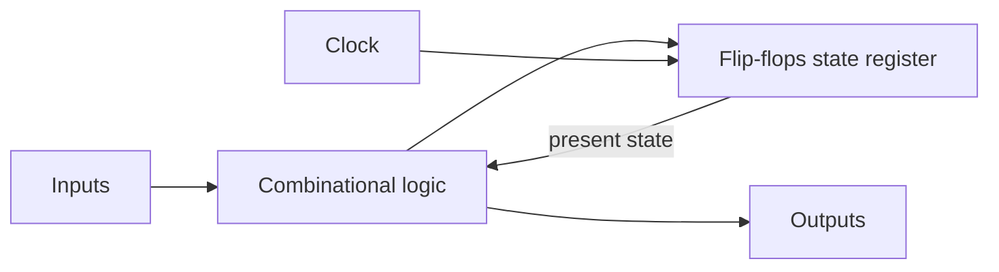
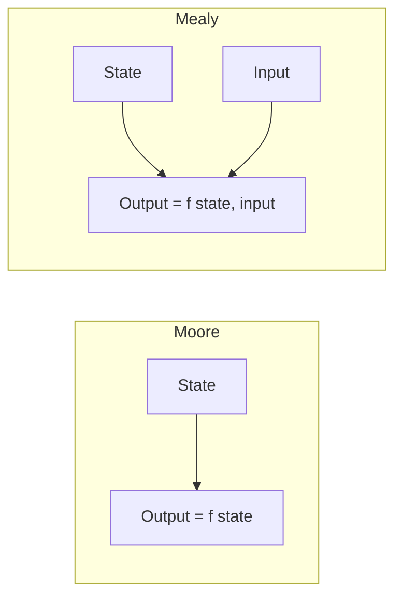

## Sequential Circuits Recap

A **sequential circuit** has memory: its outputs depend on the present inputs **and** on stored **state**. A **synchronous** sequential circuit updates that state only at clock edges, so the whole system marches in lockstep — easy to analyse and reliable to build.

Structurally, every synchronous sequential circuit is:

The flip-flops hold the **present state**; combinational logic computes the **next state** and the **outputs**.

**Real-world analogy:** A traffic light is a state machine. Its current colour is the *state*; a timer/sensor is the *input*; the rule "green → yellow → red → green" is the *next-state logic*. The lamp that lights is the *output*.

---

## Finite State Machines: Mealy vs Moore

A circuit with a finite number of states is a **Finite State Machine (FSM)**. There are two models, differing in how outputs are produced:

| Model | Output depends on | Output timing |
|---|---|---|
| **Moore** | present **state only** | changes only at clock edges; glitch-free, one cycle of delay |
| **Mealy** | present state **and** inputs | can change as soon as input changes; fewer states, faster response |

**Trade-off:** Moore is simpler to reason about and produces stable outputs but often needs more states; Mealy usually needs fewer states and reacts a cycle earlier, but its outputs can glitch with the inputs.

---

## Describing an FSM

### State Diagram

A directed graph: **circles = states**, **arrows = transitions** labelled with the input (and, for Mealy, the output). Moore outputs are written inside the state circle.

### State Table

A tabular form of the same information:

| Present state | Input = 0 → next, out | Input = 1 → next, out |
|---|---|---|
| $S_0$ | $S_0$, 0 | $S_1$, 0 |
| $S_1$ | $S_0$, 0 | $S_2$, 0 |
| $S_2$ | $S_0$, 1 | $S_2$, 0 |

(This example is a Mealy "detect two consecutive 1s" detector — output 1 on the input that completes the pattern.)

---

## The Design Procedure

Designing a synchronous sequential circuit follows a fixed recipe:

<Step>
**1. Derive the state diagram** from the word specification.

**2. Build the state table** (present state → next state + output for each input).

**3. State reduction** — merge equivalent states (states that are indistinguishable for all input sequences) to minimise the count.

**4. State assignment** — assign a unique binary code to each state. $k$ states need $\lceil \log_2 k \rceil$ flip-flops.

**5. Choose a flip-flop type** (D, JK, T) and use its **excitation table** to find the flip-flop input equations.

**6. Derive output equations** and **draw the circuit**.
</Step>

---

## Worked Example: A "Detect 11" Sequence Detector (Moore)

**Specification:** output 1 whenever the input has produced two consecutive 1s.

**Step 1–2 — states and table.** Three states: $S_0$ (no useful history), $S_1$ (saw one 1), $S_2$ (saw two 1s, output = 1).

| Present | Next (X=0) | Next (X=1) | Output |
|---|---|---|---|
| $S_0$ | $S_0$ | $S_1$ | 0 |
| $S_1$ | $S_0$ | $S_2$ | 0 |
| $S_2$ | $S_0$ | $S_2$ | 1 |

**Step 4 — state assignment** (2 flip-flops, present state $Q_1Q_0$):

| State | $Q_1Q_0$ |
|---|---|
| $S_0$ | 00 |
| $S_1$ | 01 |
| $S_2$ | 10 |

**Step 5 — next-state logic** (using D flip-flops, since $Q_{next}=D$). From the encoded table, derive $D_1, D_0$ as functions of $Q_1, Q_0, X$ — minimise each with a K-map.

For instance the output (Moore) depends only on the state:

$$Y = Q_1$$

(because only $S_2 = 10$ asserts the output). The next-state equations come from grouping the table rows; this is exactly where the **K-Map** and **flip-flop excitation** skills combine.

---

## Analysis (the reverse problem)

Given a circuit, you may be asked to find what it does:

<Step>
1. Read off the flip-flop **input equations** and **output equations** from the gates.
2. Substitute into each flip-flop's characteristic equation to get **next-state equations**.
3. Tabulate present state + input → next state + output (the **state table**).
4. Draw the **state diagram** and describe the behaviour in words.
</Step>

Analysis and design are mirror images — design goes spec → circuit, analysis goes circuit → spec.

---

## State Reduction Matters

Fewer states can mean fewer flip-flops. Two states are **equivalent** if, for every input sequence, they give the same outputs *and* go to equivalent next states. Merging them (via an implication table or inspection) can drop a 5-state machine to 4 states — sometimes saving a whole flip-flop.

<ExamTip>
The number of flip-flops needed is $\lceil \log_2(\text{number of states}) \rceil$. 3 or 4 states → 2 flip-flops; 5–8 states → 3 flip-flops. Examiners love asking "how many flip-flops are required for a machine with N states?"
</ExamTip>

---

## Key Takeaway

> A synchronous sequential circuit = **flip-flops (state) + combinational next-state/output logic**, all clocked together. Two FSM models: **Moore** outputs depend on state only (stable, more states); **Mealy** outputs depend on state and input (fewer states, faster, can glitch). Design follows a fixed procedure — **state diagram → state table → reduction → assignment → flip-flop excitation equations → circuit** — needing $\lceil \log_2 k \rceil$ flip-flops for $k$ states. Analysis runs the same steps in reverse.

---

## Exam Tips

**What lecturers test:**
- Distinguish Mealy from Moore machines (and identify which a diagram shows)
- Derive a state diagram and state table from a word description (sequence detector)
- Carry out state assignment and find next-state/output equations
- Analyse a given clocked circuit to recover its state table and behaviour
- State how many flip-flops a machine with N states needs

**Common mistakes:**
- Putting outputs on the arrows for a Moore machine (Moore outputs belong in the state)
- Forgetting to minimise/reduce states before assignment
- Using the characteristic table when the *excitation* table is required for design
- Miscounting flip-flops (use the ceiling of $\log_2$)

**Likely question:**
> "Design a synchronous sequence detector that outputs 1 each time the serial input completes the pattern '101'. (a) Draw the state diagram (Moore). (b) Construct the state table and assign states. (c) Using D flip-flops, derive the next-state and output equations." (20 marks)
