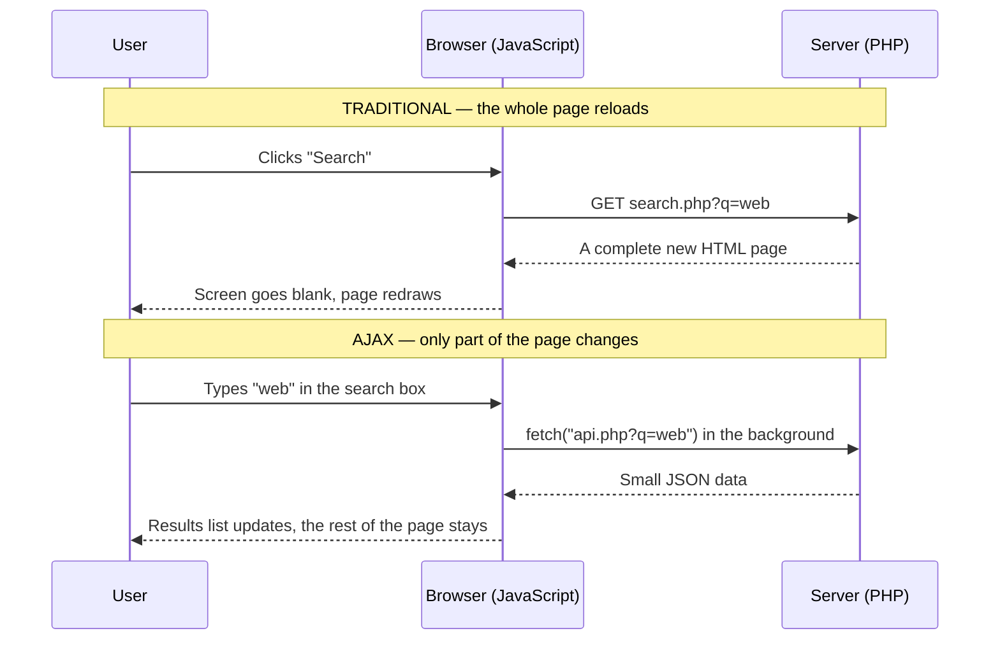

## The Problem With Full Page Reloads

In every PHP application so far, **each action reloads the whole page**: submit a form → the browser sends a request → the server builds a complete new HTML page → the browser throws the old page away and draws the new one.

That's fine for registration forms, but painful for:
- **searching as you type**,
- checking **"is this username taken?"** while the user types,
- **liking** a post or **adding a comment**,
- **loading more** results at the bottom of a feed,
- **live** notifications and chat.

**AJAX** lets the page talk to the server **in the background** and update **only the part that changed**.



---

## Synchronous vs Asynchronous Communication

| Synchronous | Asynchronous |
|---|---|
| The program **waits** for the reply before doing anything else | The program **sends the request and carries on**; it handles the reply **when it arrives** |
| The page **freezes** / is replaced while waiting | The page **stays usable** — you can keep typing and scrolling |
| Traditional form submission | **AJAX** requests |

<Analogy>
**Synchronous** is ordering at a counter and **standing there** until your food is ready — you can't do anything else. **Asynchronous** is ordering at a restaurant table: the waiter takes the order to the kitchen, and you **keep chatting** until the food is brought to you. JavaScript's `fetch()` is the waiter; the kitchen is the PHP server.
</Analogy>

---

## What Is AJAX?

**AJAX — Asynchronous JavaScript And XML** — is a technique for **exchanging data with a server in the background and updating parts of a web page without reloading the whole page**. The name was coined in **2005** (by Jesse James Garrett), when Google Maps and Gmail made it famous.

It isn't a language — it's **a combination of technologies**:

| Part | Role |
|---|---|
| **JavaScript** | Sends the request and updates the page |
| **An HTTP request object** — `XMLHttpRequest` (classic) or **`fetch()`** (modern) | Talks to the server without reloading |
| **The DOM** | Where the new content is inserted |
| **A data format** — originally **XML**, today almost always **JSON** | What the server sends back |
| **A server-side script** (PHP) | Receives the request, returns data |

> **Remember from Web 2.0:** AJAX is one of the technologies that turned the **read-only** web into the **interactive**, read-write web.

### JSON: The Data Format

**JSON (JavaScript Object Notation)** is a lightweight text format for data:

```json
{
  "matric_no": "IFT/2023/001",
  "name": "Ada Obi",
  "level": 300,
  "courses": ["IFT 302", "INS 204"],
  "graduated": false
}
```

| Direction | JavaScript | PHP |
|---|---|---|
| Data → JSON text | `JSON.stringify(obj)` | `json_encode($array)` |
| JSON text → data | `JSON.parse(text)` | `json_decode($text, true)` (`true` = associative array) |

A PHP script that answers AJAX requests is often called an **endpoint** or **API**. It sends JSON instead of HTML:

```php
<?php
header("Content-Type: application/json");
echo json_encode(["status" => "ok", "count" => 3]);
```

---

## The Classic Way: XMLHttpRequest

```js
const xhr = new XMLHttpRequest();
xhr.open("GET", "quote.php");           // 1. configure: method and URL
xhr.onreadystatechange = function () {  // 3. runs each time readyState changes
    if (xhr.readyState === 4 && xhr.status === 200) {
        document.getElementById("quote").textContent = xhr.responseText;
    }
};
xhr.send();                              // 2. send (returns immediately — asynchronous)
```

**`readyState` values:**

| Value | Name | Meaning |
|---|---|---|
| 0 | UNSENT | Object created, `open()` not called |
| 1 | OPENED | `open()` called |
| 2 | HEADERS_RECEIVED | Response headers have arrived |
| 3 | LOADING | Response body is downloading |
| **4** | **DONE** | **The request is complete** |

Check **`readyState === 4`** *and* **`status === 200`** before using `responseText`. (Modern code often uses `xhr.onload`, which fires only when done.)

<PhpPlayground title="XMLHttpRequest — load a quote without reloading" height="220">

```php
<?php // file: index.php ?>
<h3>Quote of the moment</h3>
<p id="quote"><i>Click the button…</i></p>
<button id="btn">New quote</button>
<p><small>Page loaded at <?= date("H:i:s") ?> — watch: this time never changes, because the page doesn't reload.</small></p>

<script>
document.getElementById("btn").addEventListener("click", function () {
    const xhr = new XMLHttpRequest();
    xhr.open("GET", "quote.php");
    xhr.onreadystatechange = function () {
        if (xhr.readyState === 4 && xhr.status === 200) {
            document.getElementById("quote").textContent = xhr.responseText;
        }
    };
    xhr.send();
});
</script>
```

```php
<?php // file: quote.php
$quotes = [
    "Talk is cheap. Show me the code. — Linus Torvalds",
    "First, solve the problem. Then, write the code. — John Johnson",
    "Simplicity is prerequisite for reliability. — Edsger Dijkstra",
    "Make it work, make it right, make it fast. — Kent Beck",
];
echo $quotes[array_rand($quotes)] . " (served at " . date("H:i:s") . ")";
```

</PhpPlayground>

Click **New quote** several times: the server time in the quote changes, but the "page loaded" time doesn't — proof that only one small request was made each time. The log under the result shows each **AJAX** request.

---

## The Modern Way: fetch()

**`fetch(url)`** starts a request and returns a **promise** — an object representing a result that will arrive **later**.

### With .then()

```js
fetch("api.php?q=web")
    .then(response => response.json())      // when the reply arrives, read the body as JSON
    .then(data => {
        console.log(data);                   // then use the data
    })
    .catch(error => {
        console.log("Network error:", error);
    });
```

### With async/await (cleaner)

```js
async function search(term) {
    try {
        const response = await fetch("api.php?q=" + encodeURIComponent(term));
        if (!response.ok) throw new Error("Server error " + response.status);
        const data = await response.json();
        showResults(data);
    } catch (error) {
        showMessage("Could not load results.");
    }
}
```

- **`await`** pauses **only this function** until the promise settles — the rest of the page keeps running.
- **`response.ok`** is `true` for status 200–299. `fetch()` **does not** throw on 404 or 500 — **check `ok` yourself**.
- **`encodeURIComponent()`** makes user text safe to put in a URL (spaces, `&`, `?`).

**Sending data with POST:**

```js
// As form fields (PHP reads them from $_POST)
fetch("save.php", { method: "POST", body: new URLSearchParams({ name: "Ada", level: 300 }) });

// As JSON (PHP reads php://input and json_decode()s it)
fetch("save.php", {
    method: "POST",
    headers: { "Content-Type": "application/json" },
    body: JSON.stringify({ name: "Ada", level: 300 })
});
```

### Live Search (GET + JSON)

**Type in the box** — results update after every keystroke, with no reload:

<PhpPlayground title="Live search with fetch() and a PHP JSON endpoint" height="280">

```php
<?php // file: index.php ?>
<h3>Find a course</h3>
<input id="q" placeholder="Type e.g. web, data, IFT" autocomplete="off" style="padding:6px;width:90%">
<p id="status" style="color:#64748b"></p>
<ul id="results"></ul>

<script>
const box = document.getElementById("q");
const list = document.getElementById("results");
const status = document.getElementById("status");

box.addEventListener("input", async function () {
    const term = box.value.trim();
    if (term === "") { list.innerHTML = ""; status.textContent = ""; return; }
    status.textContent = "Searching…";
    try {
        const response = await fetch("search.php?q=" + encodeURIComponent(term));
        const courses = await response.json();
        list.innerHTML = "";                              // clear old results
        for (const c of courses) {
            const li = document.createElement("li");
            li.textContent = c.code + " — " + c.title;    // textContent: safe from XSS
            list.appendChild(li);
        }
        status.textContent = courses.length + " result(s)";
    } catch (e) {
        status.textContent = "Search failed.";
    }
});
</script>
```

```php
<?php // file: search.php
header("Content-Type: application/json");
$courses = [
    ["code" => "IFT 302", "title" => "Web Application Development"],
    ["code" => "INS 204", "title" => "Systems Analysis and Design"],
    ["code" => "INS 202", "title" => "Human-Computer Interaction"],
    ["code" => "CSC 272", "title" => "Database Management Systems"],
    ["code" => "COS 202", "title" => "Computer Programming II"],
    ["code" => "IFT 212", "title" => "Data Communication and Networks"],
];
$q = strtolower(trim($_GET["q"] ?? ""));
$matches = array_values(array_filter($courses, function ($c) use ($q) {
    return $q !== "" && (str_contains(strtolower($c["code"]), $q) || str_contains(strtolower($c["title"]), $q));
}));
echo json_encode($matches);
```

</PhpPlayground>

Visit **`search.php?q=data`** in the address bar to see the raw JSON the JavaScript receives.

### Is the Username Taken? (POST + database)

A classic AJAX use: checking availability **while the user types**, before they submit. The endpoint uses a **prepared statement** — AJAX endpoints need the same security as any page:

<PhpPlayground title="Username availability check" height="220">

```sql
CREATE TABLE users (id INT AUTO_INCREMENT PRIMARY KEY, username VARCHAR(50) UNIQUE);
INSERT INTO users (username) VALUES ('ada'), ('musa'), ('chioma'), ('admin');
```

```php
<?php // file: index.php ?>
<label>Choose a username: <input id="u" autocomplete="off"></label>
<span id="msg"></span>
<p><small>Taken already: ada, musa, chioma, admin</small></p>

<script>
const input = document.getElementById("u");
const msg = document.getElementById("msg");
input.addEventListener("input", async () => {
    const name = input.value.trim();
    if (name.length < 3) { msg.textContent = ""; return; }
    const res = await fetch("check.php", { method: "POST", body: new URLSearchParams({ username: name }) });
    const data = await res.json();
    msg.textContent = data.available ? " ✓ available" : " ✗ taken";
    msg.style.color = data.available ? "green" : "red";
});
</script>
```

```php
<?php // file: check.php
header("Content-Type: application/json");
$conn = mysqli_connect("localhost", "root", "", "portal");
$username = trim($_POST["username"] ?? "");

$stmt = mysqli_prepare($conn, "SELECT COUNT(*) AS n FROM users WHERE username = ?");
mysqli_stmt_bind_param($stmt, "s", $username);
mysqli_stmt_execute($stmt);
$row = mysqli_fetch_assoc(mysqli_stmt_get_result($stmt));

echo json_encode(["username" => $username, "available" => $row["n"] == 0]);
```

</PhpPlayground>

### Adding Content Without Reloading (JSON POST)

Comments are sent as **JSON**; PHP reads the raw request body from **`php://input`**, saves the comment, and returns the new list. Add a few:

<PhpPlayground title="Post comments with JSON — no reload" height="300">

```sql
CREATE TABLE comments (id INT AUTO_INCREMENT PRIMARY KEY, author VARCHAR(50), body VARCHAR(300), created_at TIMESTAMP DEFAULT CURRENT_TIMESTAMP);
INSERT INTO comments (author, body) VALUES ('Ada', 'Great lecture on AJAX!');
```

```php
<?php // file: index.php ?>
<h3>Comments</h3>
<div id="list"></div>
<input id="author" placeholder="Name" size="8">
<input id="body" placeholder="Write a comment…">
<button id="send">Post</button>
<p id="err" style="color:#dc2626"></p>

<script>
function render(comments) {
    const list = document.getElementById("list");
    list.innerHTML = "";
    for (const c of comments) {
        const p = document.createElement("p");
        const b = document.createElement("b");
        b.textContent = c.author + ": ";          // textContent, never innerHTML, for user text
        p.appendChild(b);
        p.appendChild(document.createTextNode(c.body));
        list.appendChild(p);
    }
}

async function load() {
    const res = await fetch("comments.php");
    render(await res.json());
}

document.getElementById("send").addEventListener("click", async () => {
    const res = await fetch("comments.php", {
        method: "POST",
        headers: { "Content-Type": "application/json" },
        body: JSON.stringify({
            author: document.getElementById("author").value,
            body: document.getElementById("body").value
        })
    });
    const data = await res.json();
    document.getElementById("err").textContent = res.ok ? "" : data.error;
    if (res.ok) { render(data); document.getElementById("body").value = ""; }
});

load();
</script>
```

```php
<?php // file: comments.php
header("Content-Type: application/json");
$pdo = new PDO("mysql:host=localhost;dbname=blog", "root", "");
$pdo->setAttribute(PDO::ATTR_ERRMODE, PDO::ERRMODE_EXCEPTION);

if ($_SERVER["REQUEST_METHOD"] === "POST") {
    $input = json_decode(file_get_contents("php://input"), true) ?? [];
    $author = trim($input["author"] ?? "");
    $body = trim($input["body"] ?? "");

    if ($author === "" || $body === "" || strlen($body) > 300) {
        http_response_code(422);                       // Unprocessable: validation failed
        echo json_encode(["error" => "Name and a comment (max 300 characters) are required."]);
        exit;
    }
    $stmt = $pdo->prepare("INSERT INTO comments (author, body) VALUES (:author, :body)");
    $stmt->execute(["author" => $author, "body" => $body]);
}

$comments = $pdo->query("SELECT author, body FROM comments ORDER BY id")->fetchAll(PDO::FETCH_ASSOC);
echo json_encode($comments);
```

</PhpPlayground>

Try posting **`<script>alert(1)</script>`** as a comment: it appears as harmless text, because the page inserts it with **`textContent`**. Try an empty comment: the server answers **422** with an error message, and the page shows it.

---

## JavaScript for Dynamic Content: Good Practice

| Practice | Why |
|---|---|
| Show a **loading indicator** ("Searching…") | The user knows something is happening |
| **Handle errors** (`response.ok`, `try/catch`) | Networks fail — especially on mobile data |
| Insert user-supplied data with **`textContent`** / `createElement`, not `innerHTML` | Prevents **DOM-based XSS** |
| **Validate on the server** in every endpoint | Anyone can call `check.php` directly, skipping your JavaScript |
| Check **authentication** in endpoints too | An API that returns grades must check the session like any page |
| Avoid firing a request on **every** keystroke for heavy searches (**debounce**: wait ~300 ms after typing stops) | Less load on the server and the user's data |
| Keep a normal link/form **fallback** where possible | The site still works if JavaScript fails |

> **Same-origin policy:** by default, JavaScript on `example.com` may only `fetch` from `example.com`. Calling another domain's API requires that server to allow it with **CORS** headers (`Access-Control-Allow-Origin`). This protects users from malicious pages reading their data from other sites.

---

## Web Security Considerations

**Server-side programming introduces important security responsibilities.** Attacks target the gaps between what developers *expect* users to send and what attackers *actually* send. The **OWASP Top 10** is the industry's list of the most critical web application risks — injection, broken access control, cryptographic failures (e.g. plain-text passwords), security misconfiguration and more.

<Tabs>
<Tab label="Injection">

### SQL Injection

**What:** user input changes the structure of an SQL query (`' OR '1'='1`).

**Defence:** **prepared statements** for every query containing external input; a database user with **least privilege** (the web app's MySQL user shouldn't be able to `DROP` tables).

*(See the live demo in the Database-Driven Web Apps lesson.)*

</Tab>
<Tab label="XSS">

### Cross-Site Scripting (XSS)

**What:** malicious scripts are **injected into pages and run in other users' browsers** — stealing session cookies, defacing pages, sending requests as the victim.

| Kind | How it gets in |
|---|---|
| **Stored** | Saved in the database (a comment, a profile name) and shown to everyone |
| **Reflected** | Echoed straight back from the URL or a form (`search.php?q=<script>…`) |
| **DOM-based** | Client-side JavaScript inserts untrusted data with `innerHTML` |

**Defence:** **`htmlspecialchars()`** on output in PHP; **`textContent`** in JavaScript; **`HttpOnly`** session cookies (scripts can't read them); a **Content-Security-Policy** header.

</Tab>
<Tab label="CSRF">

### Cross-Site Request Forgery (CSRF)

**What:** a malicious site **tricks the victim's browser into sending a request** to a site where they're logged in — the browser attaches their session cookie automatically, so the request looks genuine ("transfer ₦50,000", "change my email").

**Defence:** a **CSRF token** — a random secret stored in the **session** and included as a **hidden field** in every form; the server **rejects** POSTs whose token doesn't match. Plus **`SameSite`** cookies and requiring **POST** (never GET) for changes.

</Tab>
<Tab label="Sessions & passwords">

### Broken Authentication

- Hash passwords with **`password_hash()`** / `password_verify()` — never plain text, never `md5`
- **`session_regenerate_id(true)`** after login (session fixation)
- Session cookies **`HttpOnly`**, **`Secure`**, **`SameSite`**
- **Log out** properly and **expire** idle sessions
- **Limit login attempts** (lock or slow down after several failures)
- **Generic** login errors ("Invalid username or password")
- Check **authorization** on **every** protected page and endpoint

</Tab>
<Tab label="Configuration">

### Security Misconfiguration and Exposure

- **HTTPS everywhere** (TLS certificate, e.g. free from Let's Encrypt) — protects passwords and cookies in transit
- **`display_errors = Off`** in production; log errors instead
- Don't commit **credentials** to Git; keep `config.php` outside the web root
- Remove **`phpinfo()`** files, default accounts (XAMPP's password-less `root`!) and unused software
- **Keep PHP, Apache, MySQL and libraries updated**
- **Uploads:** whitelist extensions, rename files, never allow executable uploads
- **Security headers:** see the table below

</Tab>
</Tabs>

### Security Headers

Servers can instruct browsers to add protections, using response headers:

| Header | Protects against |
|---|---|
| **`Content-Security-Policy`** | XSS — restricts where scripts, images and styles may load from (this StudyOS site uses one) |
| **`Strict-Transport-Security`** (HSTS) | Downgrade attacks — the browser always uses HTTPS |
| **`X-Frame-Options: DENY`** / CSP `frame-ancestors` | **Clickjacking** — the site can't be hidden inside another site's frame |
| **`X-Content-Type-Options: nosniff`** | The browser guessing file types (e.g. running an "image" as script) |
| **`Referrer-Policy`** | Leaking full URLs to other sites |

```php
header("X-Frame-Options: DENY");
header("X-Content-Type-Options: nosniff");
header("Referrer-Policy: strict-origin-when-cross-origin");
```

### CSRF Tokens in Practice

This bank page has a transfer form **with a CSRF token**. The "attacker's page" contains a hidden form pointing at the same `transfer.php` — but it can't know the victim's token. **Log in, make a genuine transfer, then visit the attacker's page and click its button.** Then set `CHECK_CSRF` to `false` in `transfer.php`, Run again, and repeat the attack:

<PhpPlayground title="CSRF attack and CSRF token defence" height="300">

```php
<?php // file: index.php
session_start();
if (isset($_GET["login"])) {
    session_regenerate_id(true);
    $_SESSION["user"] = "Ada";
    $_SESSION["balance"] = $_SESSION["balance"] ?? 100000;
}
// One random token per session
if (empty($_SESSION["csrf"])) {
    $_SESSION["csrf"] = bin2hex(random_bytes(16));
}
?>
<h3>UI Micro-Bank</h3>
<?php if (!isset($_SESSION["user"])): ?>
  <p><a href="index.php?login=1">Log in as Ada</a></p>
<?php else: ?>
  <p>Logged in as <b><?= $_SESSION["user"] ?></b>. Balance: <b>₦<?= number_format($_SESSION["balance"]) ?></b></p>
  <?php if (isset($_GET["msg"])): ?><p style="background:#fef3c7;padding:6px"><?= htmlspecialchars($_GET["msg"]) ?></p><?php endif; ?>
  <form method="post" action="transfer.php">
    <input type="hidden" name="csrf" value="<?= $_SESSION["csrf"] ?>">
    Send ₦<input name="amount" value="5000" size="7"> to <input name="to" value="Musa" size="8">
    <button type="submit">Transfer</button>
  </form>
  <p><a href="attacker.html">Visit a "free airtime" website…</a></p>
<?php endif; ?>
```

```php
<?php // file: transfer.php
const CHECK_CSRF = true;      // ← set to false to see the attack succeed

session_start();
if (!isset($_SESSION["user"])) { header("Location: index.php"); exit; }

if (CHECK_CSRF && !hash_equals($_SESSION["csrf"] ?? "", $_POST["csrf"] ?? "")) {
    // Refuse the request and send the user back with a message
    header("Location: index.php?msg=" . urlencode("Blocked: invalid CSRF token — request did not come from our form."));
    exit;
}
$amount = (int) ($_POST["amount"] ?? 0);
if ($amount > 0 && $amount <= $_SESSION["balance"]) {
    $_SESSION["balance"] -= $amount;
    $msg = "Transferred ₦" . number_format($amount) . " to " . ($_POST["to"] ?? "?");
} else {
    $msg = "Invalid amount.";
}
header("Location: index.php?msg=" . urlencode($msg));
exit;
```

```html
<!-- file: attacker.html -->
<h2 style="color:#16a34a">🎉 Claim your FREE ₦2,000 airtime!</h2>
<p>Just click the button below.</p>
<!-- Hidden form aimed at the bank. The browser will attach Ada's session cookie. -->
<form method="post" action="transfer.php">
  <input type="hidden" name="amount" value="50000">
  <input type="hidden" name="to" value="Attacker">
  <button type="submit">Claim airtime</button>
</form>
```

</PhpPlayground>

With the token check on, the forged request is **rejected** — the attacker's form has no valid `csrf` value. With it off, clicking "Claim airtime" silently **transfers ₦50,000** using Ada's logged-in session. (`hash_equals()` compares the tokens in constant time, so an attacker can't guess them character by character from timing.)

<MCQ question="Why does a CSRF attack work at all, even though the attacker never learns the victim's password?">
<Option>Because the attacker steals the password hash from the database.</Option>
<Option correct>Because the victim's browser automatically attaches its session cookie to requests sent to the bank, even when a different site triggered them.</Option>
<Option>Because the bank uses prepared statements.</Option>
<Option>Because JavaScript can read other sites' pages.</Option>
<Explain>
Browsers send a site's cookies with **every** request to that site, whoever initiated it. So a forged form submission from another page arrives **with the victim's valid session**. A **CSRF token** (a secret the attacker's page can't know) and **SameSite** cookies stop it.
</Explain>
</MCQ>

<MCQ question="A page shows search results with echo 'Results for ' . $_GET['q']; — which attack is it open to, and what is the fix?">
<Option>SQL injection; use prepared statements.</Option>
<Option correct>Reflected XSS; escape the output with htmlspecialchars().</Option>
<Option>CSRF; add a token.</Option>
<Option>Clickjacking; add X-Frame-Options.</Option>
<Explain>
The query string is **echoed straight back into the HTML**, so `?q=<script>…</script>` runs in the victim's browser — **reflected XSS**. Escape it: `htmlspecialchars($_GET['q'])`. (If the value were also used in SQL, it would need a prepared statement as well.)
</Explain>
</MCQ>

---

## Course Review: IFT 302 at a Glance

| Weeks | Topic | Key ideas to revise |
|---|---|---|
| 1 | Introduction | Internet vs Web; Web 1.0/2.0/3.0; static vs dynamic; frameworks; client vs server side |
| 2 | Website design | 8 principles; UI vs UX; responsive design, media queries |
| 3 | Architecture & tools | Client-server model, HTTP; Apache; dev environments; Git; MySQL basics |
| 4 | Client side | HTML5 structure & semantics; CSS selectors, box model, flex/grid; JavaScript, DOM, form validation |
| 5 | PHP | Syntax, variables, types, operators, control structures, arrays, functions, include/require, forms (GET/POST) |
| 6 | OOP in PHP | Classes, objects, constructors, access modifiers, inheritance, abstract/interfaces, error handling |
| 8 | Databases | Table design, MySQLi/PDO, CRUD, prepared statements, validation, SRMS |
| 9 | Dynamic web | Sessions, cookies, authentication vs authorization, password hashing, file handling, uploads |
| 10 | Frameworks | MVC, routing, templates; ASP.NET, Flask, Django |
| 11 | Quality & deployment | Testing methods, debugging, validation, hosting and deployment |
| 12 | Advanced | AJAX, fetch, JSON, dynamic content, security |

### Presenting Your Mini Project

1. **State the problem** and who the users are (e.g. "departmental course registration").
2. **Show the architecture** — browser, Apache, PHP, MySQL — and your **table design**.
3. **Demonstrate** the main flows live: register/login, CRUD, search.
4. **Show your security**: prepared statements, `htmlspecialchars()`, password hashing, sessions, validation — and demonstrate a blocked attack.
5. **Mention testing** — the test cases you ran and a bug you found and fixed.
6. **Reflect**: what you'd add next (AJAX search, roles, pagination, deployment).

---

## Practice Questions

<Reveal question="What is AJAX? Give three examples of its use.">
**AJAX (Asynchronous JavaScript And XML)** is a technique in which JavaScript **exchanges data with the server in the background** (with `XMLHttpRequest` or `fetch()`) and **updates part of the page without reloading it**. Today the data is usually JSON. Examples: **live search suggestions**, **checking username availability** while typing, **posting comments or likes** without a reload, **infinite scrolling**, chat and notifications.
</Reveal>

<Reveal question="Differentiate between synchronous and asynchronous communication.">
In **synchronous** communication the program **waits** for the server's reply before continuing — the page is blocked or replaced (a normal form submission). In **asynchronous** communication the request is sent and the program **continues**; the reply is handled **when it arrives**, so the page stays usable (AJAX).
</Reveal>

<Reveal question="Write JavaScript using fetch() that requests students.php, which returns a JSON array, and lists the names in a <ul id='list'>.">
```js
fetch("students.php")
    .then(response => response.json())
    .then(students => {
        const list = document.getElementById("list");
        for (const s of students) {
            const li = document.createElement("li");
            li.textContent = s.name;
            list.appendChild(li);
        }
    })
    .catch(() => alert("Could not load students"));
```
with `students.php` sending `header("Content-Type: application/json"); echo json_encode($students);`.
</Reveal>

<Reveal question="Explain the readyState values of XMLHttpRequest.">
**0 UNSENT** — created, `open()` not yet called; **1 OPENED** — `open()` called; **2 HEADERS_RECEIVED** — `send()` called and headers received; **3 LOADING** — the body is downloading; **4 DONE** — the operation is complete. Code normally acts when `readyState === 4` and `status === 200`.
</Reveal>

<Reveal question="Explain SQL injection, XSS and CSRF, and one defence against each.">
**SQL injection** — malicious input alters an SQL query; defend with **prepared statements**. **XSS** — injected scripts run in other users' browsers; defend by **escaping output** (`htmlspecialchars()`, `textContent`) and a CSP. **CSRF** — another site makes the victim's browser send an authenticated request; defend with a **CSRF token** in forms (checked against the session) and **SameSite** cookies.
</Reveal>

<Takeaway>
**AJAX (Asynchronous JavaScript And XML)** exchanges data with the server **in the background** and updates **part** of the page — no full reload. **Asynchronous** = send the request and carry on; handle the reply when it arrives. Data is usually **JSON** (`JSON.parse`/`stringify`; PHP `json_encode`/`json_decode`, `header("Content-Type: application/json")`). Classic **`XMLHttpRequest`**: `open` → `send` → act when **`readyState === 4` and `status === 200`**. Modern **`fetch()`** returns a **promise**: `.then()` or **`async`/`await`**, check **`response.ok`**, handle errors; POST form fields (`URLSearchParams` → `$_POST`) or JSON (`php://input`). Insert user data with **`textContent`**. **Security:** prepared statements (**SQL injection**), `htmlspecialchars`/`textContent`/CSP (**XSS**), **CSRF tokens** + SameSite, hashed passwords + secure sessions, **HTTPS**, security headers, safe uploads, hidden error details, least privilege and updates — and **every AJAX endpoint** needs the same validation and access checks as a page.
</Takeaway>

## Exam Tips

**What lecturers test:**
- Define AJAX; how it differs from traditional page loading; synchronous vs asynchronous
- The technologies AJAX combines; JSON
- Writing a simple **XMLHttpRequest** or **fetch()** call and updating the DOM
- `readyState` values
- **Security considerations**: SQL injection, XSS, CSRF, password storage, sessions, HTTPS — with defences

**Common mistakes:**
- Forgetting that `fetch()` doesn't reject on 404/500 — check `response.ok`
- Using `innerHTML` with server data containing user input
- Assuming an endpoint is safe because "only my JavaScript calls it"
- Confusing XSS (runs script in users' browsers) with SQL injection (attacks the database)

**Likely question:**
> "What is AJAX? With the aid of a diagram, contrast traditional and AJAX-based request handling. Write JavaScript that uses fetch() to retrieve JSON from a PHP script and display it. Discuss three security threats to web applications and their countermeasures." (25 marks)
