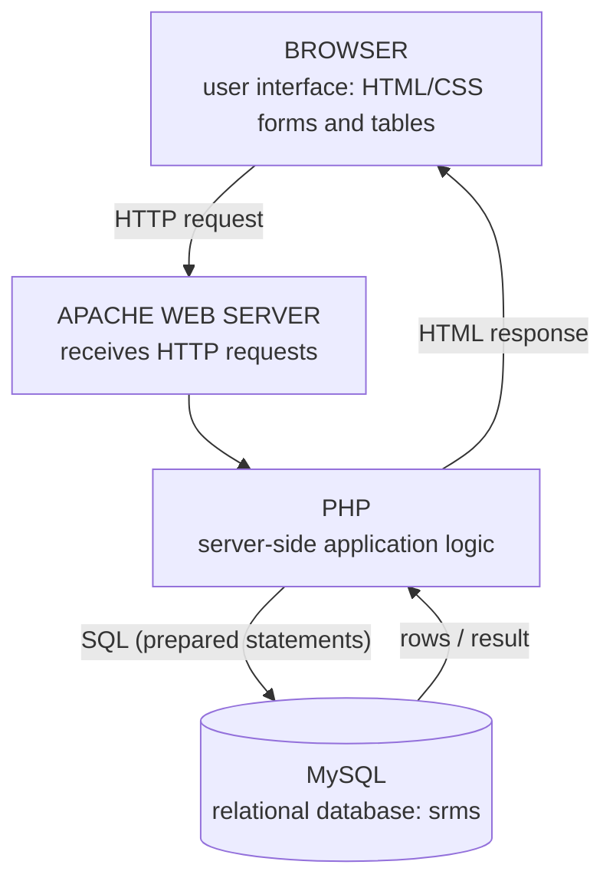
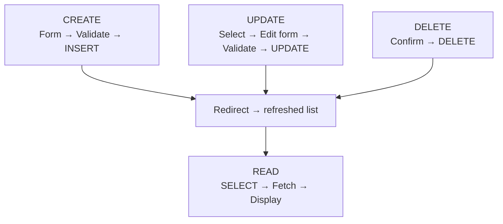

## What Makes a Web Application Database-Driven?

A **database-driven web application** keeps its data in a **database** instead of writing it into the HTML. Every page is **built from the data at the moment it's requested**, and every form **changes the data**. The student portal, a bank website and an online shop all work this way.

The cycle on every request:

1. The **web page receives a request**.
2. **PHP executes the application logic**.
3. **PHP sends SQL to MySQL**.
4. **MySQL returns data or performs a change**.
5. **PHP generates the response** (HTML).
6. **The browser displays the result**.

### Architecture of Our Student Record Management System (SRMS)



Typical flow: **Browser → PHP → MySQL → PHP → Browser**.

### Case Study: Student Record Management System

| | |
|---|---|
| **Purpose** | Manage student records |
| **Actors** | Administrator / staff user |
| **Core functions** | **Add, View, Search, Edit, Delete** |
| **Data** | Matric number, names, gender, department, level, email, phone |

**Every function interacts with the MySQL database.**

---

## From Problem Domain to Database

Designing the table follows five steps:

1. **Identify the real-world entity:** **STUDENT**.
2. **Identify its attributes:** matric_no, names, department, level…
3. **Choose appropriate data types** for each attribute.
4. **Select a primary key.**
5. **Identify uniqueness and required fields.**

(Later, **relationships** — with departments and courses — are added. That's database design, covered fully in CSC 272.)

### Student Table Design

| Column | Data type | Rules | Why this type |
|---|---|---|---|
| `id` | `INT UNSIGNED` | **Primary key**, **auto increment** | A whole number the database assigns automatically; UNSIGNED = no negatives |
| `matric_no` | `VARCHAR(30)` | **UNIQUE**, **NOT NULL** | Contains letters and slashes (e.g. `IFT/2023/001`) — text, not a number |
| `first_name`, `last_name` | `VARCHAR(50)` | NOT NULL | Variable-length text up to 50 characters |
| `gender` | `ENUM('Male','Female')` | NOT NULL | Only the listed values are allowed |
| `department` | `VARCHAR(100)` | NOT NULL | Text |
| `level` | `TINYINT UNSIGNED` | NOT NULL | Small whole number (0–255 unsigned) — 100 to 700 fits |
| `email` | `VARCHAR(120)` | **UNIQUE** | No two students may share an email |
| `phone` | `VARCHAR(20)` | — | **Text**, not a number: phone numbers keep leading zeros (`0803…`) and may contain `+` |
| `created_at` | `TIMESTAMP` | `DEFAULT CURRENT_TIMESTAMP` | Filled in automatically when the row is inserted |

### Primary Key vs UNIQUE

| Primary key | UNIQUE |
|---|---|
| **Uniquely identifies each row** | **Prevents duplicate values in a column** |
| **A table has one** primary key | A table can have **many** UNIQUE columns |
| Can never be NULL | May allow NULL (e.g. a student without email) |
| Example: **`id` identifies the database row** | Example: **`matric_no` should not be duplicated** |

<ExamTip>
A favourite discussion question: **"Why should `id` be an integer when every student already has a unique matric number?"** Because an integer key is **small, fast to index and compare, never changes**, and is assigned automatically — while a matric number is longer text that could be **corrected or reformatted** later. Changing a primary key would break every link and related record that uses it.
</ExamTip>

### Create the Database and Table

Run the SQL with **phpMyAdmin** (SQL tab), **MySQL Workbench** or the **MySQL command line**. Try it here — then **run the duplicate INSERT at the bottom** and watch **UNIQUE** reject it:

<SqlPlayground title="Create the srms database">

```sql
CREATE DATABASE srms;
USE srms;

CREATE TABLE students (
    id INT UNSIGNED AUTO_INCREMENT PRIMARY KEY,
    matric_no VARCHAR(30) NOT NULL UNIQUE,
    first_name VARCHAR(50) NOT NULL,
    last_name VARCHAR(50) NOT NULL,
    gender ENUM('Male','Female') NOT NULL,
    department VARCHAR(100) NOT NULL,
    level TINYINT UNSIGNED NOT NULL,
    email VARCHAR(120) UNIQUE,
    phone VARCHAR(20),
    created_at TIMESTAMP DEFAULT CURRENT_TIMESTAMP
);

INSERT INTO students (matric_no, first_name, last_name, gender, department, level, email, phone)
VALUES ('IFT/2023/001', 'Ada', 'Obi', 'Female', 'Information Technology', 300, 'ada.obi@ui.edu.ng', '08031234567');

SELECT * FROM students;

-- Now try a duplicate matric number:
INSERT INTO students (matric_no, first_name, last_name, gender, department, level)
VALUES ('IFT/2023/001', 'John', 'Musa', 'Male', 'Computer Science', 200);
```

</SqlPlayground>

---

## What Is CRUD?

**Almost every data-management application uses four operations**, known as **CRUD**:

| Letter | Operation | SQL | SRMS page |
|---|---|---|---|
| **C** | **Create** | `INSERT` | Add Student |
| **R** | **Read** | `SELECT` | Student list, search |
| **U** | **Update** | `UPDATE` | Edit Student |
| **D** | **Delete** | `DELETE` | Delete Student |

---

## Connecting PHP to MySQL

PHP offers **two** ways to talk to MySQL:

| | **MySQLi** ("MySQL improved") | **PDO** (PHP Data Objects) |
|---|---|---|
| Databases supported | **MySQL/MariaDB only** | **Many** (MySQL, PostgreSQL, SQLite, SQL Server…) with the same code |
| Styles | **Procedural** (`mysqli_query($conn, …)`) and object-oriented | Object-oriented only |
| Placeholders | `?` only | `?` **and named** (`:email`) |
| Used in | The course's **SRMS slides** | The course's **PHP lecture notes** — "often a good choice for new applications" |

Both support **prepared statements**. You'll see both below.

### MySQLi Connection (SRMS)

```php
<?php
$conn = mysqli_connect("localhost", "root", "", "srms");
if (!$conn) {
    die("Database connection failed");
}
mysqli_set_charset($conn, "utf8mb4");
```

The four arguments are **host, username, password, database**. XAMPP's defaults are user **`root`** with an **empty password** — fine on your own laptop, never on a live server. `utf8mb4` makes names like *Adébáyọ̀* and emoji store correctly.

### PDO Connection (lecture notes)

```php
<?php
$host = "localhost";
$dbname = "school";
$username = "root";
$password = "";

$pdo = new PDO("mysql:host=$host;dbname=$dbname", $username, $password);
$pdo->setAttribute(PDO::ATTR_ERRMODE, PDO::ERRMODE_EXCEPTION);
echo "Database connected successfully.";
```

The first argument is the **DSN** (Data Source Name) — which driver, host and database. **`ERRMODE_EXCEPTION`** makes database errors **throw exceptions** instead of failing silently.

### Why Put the Connection in db.php?

- **Centralises connection settings** — change the password in one place
- **Prevents repeated connection code** on every page
- **Makes maintenance easier**
- Other pages simply use **`require_once 'db.php';`**
- **Keeps database credentials out of the HTML interface** (and out of Git — add `db.php`/`config.php` to `.gitignore` on real projects)

---

## Prepared Statements: The Idea

A **prepared statement** keeps the **SQL structure** separate from the **user's values**:

1. **The SQL structure is written separately from user values.**
2. **Placeholders (`?`) represent the values.**
3. **Values are bound with their types.**
4. **The database receives the intended statement and the parameters separately** — so a value can **never change the structure** of the SQL.

**Use prepared statements whenever external input enters SQL.**

### Why: SQL Injection, Live

**SQL injection** occurs when an attacker **manipulates a database query through malicious input**. The unsafe pattern is **gluing user input into the SQL string**:

```php
$sql = "SELECT * FROM users WHERE username = '$username' AND password = '$password'";
```

This demo has a real `users` table. **First log in normally** (`ada` / `ada-pass-99`) and with a wrong password. **Then type `' OR '1'='1` into both boxes** and submit. Read the SQL the unsafe version actually sends:

<PhpPlayground title="SQL injection vs prepared statement" height="380">

```sql
CREATE TABLE users (
    id INT AUTO_INCREMENT PRIMARY KEY,
    username VARCHAR(50) UNIQUE,
    password VARCHAR(255)
);
-- Plain-text passwords ONLY to demonstrate the attack. Real systems store hashes.
INSERT INTO users (username, password) VALUES ('admin', 'S3cret!2026'), ('ada', 'ada-pass-99');
```

```php
<?php
$conn = mysqli_connect("localhost", "root", "", "demo");
$username = $_POST["username"] ?? "";
$password = $_POST["password"] ?? "";
?>
<form method="post">
  <input name="username" placeholder="Username" value="<?= htmlspecialchars($username) ?>">
  <input name="password" placeholder="Password" value="<?= htmlspecialchars($password) ?>">
  <button type="submit">Log in</button>
</form>
<?php
if ($_SERVER["REQUEST_METHOD"] === "POST") {
    // ✗ UNSAFE: user input pasted straight into the SQL text
    $sql = "SELECT * FROM users WHERE username = '$username' AND password = '$password'";
    echo "<h4>Unsafe (string concatenation)</h4>";
    echo "<p>SQL sent: <code>" . htmlspecialchars($sql) . "</code></p>";
    $result = mysqli_query($conn, $sql);
    if (mysqli_num_rows($result) > 0) {
        $user = mysqli_fetch_assoc($result);
        echo "<p style='color:#dc2626'><b>Logged in as " . htmlspecialchars($user["username"]) . "</b></p>";
    } else {
        echo "<p>Login failed.</p>";
    }

    // ✓ SAFE: prepared statement — the input can only ever be a value
    echo "<h4>Safe (prepared statement)</h4>";
    $stmt = mysqli_prepare($conn, "SELECT * FROM users WHERE username = ? AND password = ?");
    mysqli_stmt_bind_param($stmt, "ss", $username, $password);
    mysqli_stmt_execute($stmt);
    $safe = mysqli_stmt_get_result($stmt);
    if (mysqli_num_rows($safe) > 0) {
        $user = mysqli_fetch_assoc($safe);
        echo "<p style='color:#15803d'><b>Logged in as " . htmlspecialchars($user["username"]) . "</b></p>";
    } else {
        echo "<p>Login failed — the input was treated as plain text.</p>";
    }
}
```

</PhpPlayground>

**What happened?** With `' OR '1'='1` the unsafe query becomes:

```sql
SELECT * FROM users WHERE username = '' OR '1'='1' AND password = '' OR '1'='1'
```

The quote in the input **closed the string early**, and `OR '1'='1'` — always true — became **part of the SQL logic**. Every row matches, and the attacker is logged in as the **first user: admin**, without knowing any password. The prepared statement sent the SQL and the values **separately**, so MySQL looked for a user literally named `' OR '1'='1` — and found none.

Also try a name with an apostrophe, like **`O'Brien`**, in the unsafe version: it breaks the SQL with a **syntax error**. Prepared statements fix bugs as well as attacks.

<Analogy>
A prepared statement is like a **printed bank withdrawal slip**: the bank designs the form ("Pay ______ the sum of ______"), and the customer can only fill the blanks. Concatenation is like letting the customer **write the whole instruction** themselves — "Pay Ada ₦5,000 *and also transfer everything to account 123*". Blanks can't change the form; free text can.
</Analogy>

---

## CREATE: Add a Student

**Steps:** the user fills an HTML form → **PHP receives the POST data** → **validate required fields** → **prepare the INSERT** → **bind values** → **execute** → **redirect to the student list**.

```php
$sql = "INSERT INTO students (matric_no, first_name, last_name, gender, department, level, email, phone)
        VALUES (?, ?, ?, ?, ?, ?, ?, ?)";
$stmt = mysqli_prepare($conn, $sql);
mysqli_stmt_bind_param($stmt, "sssssiss",
    $matric_no, $first_name, $last_name, $gender, $department, $level, $email, $phone);
mysqli_stmt_execute($stmt);
```

### What Do the Type Letters Mean?

| Letter | Type |
|---|---|
| **`s`** | **string** |
| **`i`** | **integer** |
| **`d`** | **double** (decimal number) |
| **`b`** | **binary** (blob) |

**The number and order of type letters must match the bound variables.** In `"sssssiss"`, the **6th** letter is **`i`** because the 6th placeholder is `level`, an integer; every other value is text. Eight `?`s → eight letters → eight variables.

### The PDO Version

PDO uses **named placeholders** and passes values in an array to `execute()` — no type letters:

```php
$sql = "INSERT INTO students (name, email, department)
        VALUES (:name, :email, :department)";
$stmt = $pdo->prepare($sql);
$stmt->execute([
    "name" => $name,
    "email" => $email,
    "department" => $department
]);
```

---

## READ: Display Students

```php
$sql = "SELECT id, matric_no, first_name, last_name, department, level, email
        FROM students ORDER BY id DESC";
$result = mysqli_query($conn, $sql);
while ($row = mysqli_fetch_assoc($result)) {
    echo htmlspecialchars($row['matric_no']);
}
```

- **`mysqli_query`** is fine here because the SQL contains **no user input**.
- **`mysqli_fetch_assoc`** returns **one row at a time** as an associative array (`$row['matric_no']`), and **`null`** when there are no more rows — which ends the `while` loop.

**PDO equivalent:**

```php
$stmt = $pdo->query("SELECT * FROM students");
$students = $stmt->fetchAll(PDO::FETCH_ASSOC);
foreach ($students as $student) {
    echo htmlspecialchars($student["name"]) . "<br>";
}
```

### Why htmlspecialchars() on Database Data?

- **Database data may be displayed inside HTML.**
- **User-supplied data should not automatically become HTML/JavaScript** — someone could register with the name `<script>…</script>`.
- **`htmlspecialchars()` converts special HTML characters.**
- **Prepared statements protect the SQL; `htmlspecialchars()` protects the HTML output.** **They solve different problems** — you need both.

### Try It: PDO CRUD in One Script

This runs the lecture notes' PDO code against a `school` database. Each **Run** inserts another student — watch the table below the result grow, and open **🗄 MySQL database** to see the rows:

<PhpPlayground title="PDO — insert, then read" height="260">

```sql
CREATE TABLE students (
    id INT AUTO_INCREMENT PRIMARY KEY,
    name VARCHAR(100) NOT NULL,
    email VARCHAR(100) NOT NULL,
    department VARCHAR(100) NOT NULL
);
INSERT INTO students (name, email, department) VALUES ('Ada', 'ada@example.com', 'Computer Science');
```

```php
<?php
$host = "localhost";
$dbname = "school";
$username = "root";
$password = "";

$pdo = new PDO("mysql:host=$host;dbname=$dbname", $username, $password);
$pdo->setAttribute(PDO::ATTR_ERRMODE, PDO::ERRMODE_EXCEPTION);

// CREATE — a prepared INSERT with named placeholders
$name = "Student " . rand(100, 999);
$stmt = $pdo->prepare("INSERT INTO students (name, email, department)
                       VALUES (:name, :email, :department)");
$stmt->execute([
    "name" => $name,
    "email" => strtolower(str_replace(" ", ".", $name)) . "@example.com",
    "department" => "ICT"
]);
echo "<p>Inserted <b>$name</b> with id " . $pdo->lastInsertId() . ".</p>";

// READ
$students = $pdo->query("SELECT * FROM students")->fetchAll(PDO::FETCH_ASSOC);
?>
<table border="1" cellpadding="5">
  <tr><th>ID</th><th>Name</th><th>Department</th></tr>
  <?php foreach ($students as $student): ?>
    <tr>
      <td><?= $student["id"] ?></td>
      <td><?= htmlspecialchars($student["name"]) ?></td>
      <td><?= htmlspecialchars($student["department"]) ?></td>
    </tr>
  <?php endforeach; ?>
</table>
```

</PhpPlayground>

---

## Searching Student Records

Search **by matriculation number, first name or surname**, using **`LIKE`** for **partial matching**: the pattern **`%john%`** matches any value **containing** "john" (`%` = any characters). **The search term is user input, so it goes through a prepared statement too:**

```php
$sql = "SELECT id, matric_no, first_name, last_name
        FROM students
        WHERE matric_no LIKE ?
           OR first_name LIKE ?
           OR last_name LIKE ?";
$stmt = mysqli_prepare($conn, $sql);
$term = "%" . $search . "%";
mysqli_stmt_bind_param($stmt, "sss", $term, $term, $term);
mysqli_stmt_execute($stmt);
$result = mysqli_stmt_get_result($stmt);
```

The `%` signs are added **to the value**, not written into the SQL — the placeholder stays a single `?`.

---

## UPDATE: Edit a Student

**Steps:** **select the existing record** → **populate an edit form** with it → user **changes permitted fields** → **validate the new values** → **execute a prepared UPDATE using the student's ID** → **redirect back to the list**.

```php
$sql = "UPDATE students
        SET first_name=?, last_name=?, department=?, level=?, email=?, phone=?
        WHERE id=?";
$stmt = mysqli_prepare($conn, $sql);
mysqli_stmt_bind_param($stmt, "sssissi",
    $first_name, $last_name, $department, $level, $email, $phone, $id);
mysqli_stmt_execute($stmt);
```

`"sssissi"`: the **4th** value (`level`) and the **7th** (`id`) are integers.

## DELETE: Remove a Student

**Steps:** **identify the correct student ID** → **ask for confirmation** → **use a prepared DELETE** → **execute** → **redirect to the list**.

```php
$sql = "DELETE FROM students WHERE id=?";
$stmt = mysqli_prepare($conn, $sql);
mysqli_stmt_bind_param($stmt, "i", $id);
mysqli_stmt_execute($stmt);
```

> **Do not trust an ID simply because it came from a URL.** Anyone can type `delete.php?id=5` — or `delete.php?id=5 OR 1=1`. Validate it as an integer (`filter_var($id, FILTER_VALIDATE_INT)`), bind it with `"i"`, **confirm** before deleting, and in a real system **check the user is allowed to** delete. Deleting should be a **POST** action after confirmation, not a plain link — search-engine crawlers and browser prefetching follow links.

---

## The Complete SRMS

Here is the whole system — **the course's own queries**, organised into files like the suggested project structure. It has a real MySQL database with five students. **Run it and use it:**

- **Search** for `obi` or `IFT`.
- **Add** a student — then try adding the **same matric number** again, or level `250`.
- **Edit** a student's level; **Delete** one (you'll be asked to confirm).
- Open **🗄 MySQL database** under the result to see the table change after each action.
- Read each file's tab to see how it works. **Reset** restores the original data.

<PhpPlayground title="Student Record Management System (PHP + MySQL)" height="460">

```sql
CREATE TABLE students (
    id INT UNSIGNED AUTO_INCREMENT PRIMARY KEY,
    matric_no VARCHAR(30) NOT NULL UNIQUE,
    first_name VARCHAR(50) NOT NULL,
    last_name VARCHAR(50) NOT NULL,
    gender ENUM('Male','Female') NOT NULL,
    department VARCHAR(100) NOT NULL,
    level TINYINT UNSIGNED NOT NULL,
    email VARCHAR(120) UNIQUE,
    phone VARCHAR(20),
    created_at TIMESTAMP DEFAULT CURRENT_TIMESTAMP
);
INSERT INTO students (matric_no, first_name, last_name, gender, department, level, email, phone) VALUES
('IFT/2023/001', 'Ada', 'Obi', 'Female', 'Information Technology', 300, 'ada.obi@ui.edu.ng', '08031234567'),
('CSC/2022/014', 'Musa', 'Bello', 'Male', 'Computer Science', 400, 'musa.bello@ui.edu.ng', '08129876543'),
('IFT/2024/102', 'Chioma', 'Eze', 'Female', 'Information Technology', 200, 'chioma.eze@ui.edu.ng', '07061234567'),
('LIS/2023/045', 'Tunde', 'Adeyemi', 'Male', 'Library and Information Studies', 300, 'tunde.a@ui.edu.ng', '09011112222'),
('CSC/2025/007', 'Fatima', 'Yusuf', 'Female', 'Computer Science', 100, 'fatima.y@ui.edu.ng', '08023334444');
```

```php
<?php // file: index.php
require_once "db.php";
require_once "layout.php";

$search = trim($_GET["search"] ?? "");
if ($search !== "") {
    $sql = "SELECT id, matric_no, first_name, last_name, department, level
            FROM students
            WHERE matric_no LIKE ? OR first_name LIKE ? OR last_name LIKE ?
            ORDER BY id DESC";
    $stmt = mysqli_prepare($conn, $sql);
    $term = "%" . $search . "%";
    mysqli_stmt_bind_param($stmt, "sss", $term, $term, $term);
    mysqli_stmt_execute($stmt);
    $result = mysqli_stmt_get_result($stmt);
} else {
    $sql = "SELECT id, matric_no, first_name, last_name, department, level
            FROM students ORDER BY id DESC";
    $result = mysqli_query($conn, $sql);
}

page_top("Student Records");
if (isset($_GET["msg"])) {
    echo '<p class="msg">' . htmlspecialchars($_GET["msg"]) . '</p>';
}
?>
<form method="get">
  <input name="search" value="<?= htmlspecialchars($search) ?>" placeholder="Matric no or name">
  <button type="submit">Search</button> <a href="index.php">Clear</a>
</form>
<p><a class="btn" href="create.php">+ Add student</a></p>
<table>
  <tr><th>Matric No</th><th>Name</th><th>Department</th><th>Level</th><th></th></tr>
  <?php while ($row = mysqli_fetch_assoc($result)): ?>
    <tr>
      <td><?= htmlspecialchars($row["matric_no"]) ?></td>
      <td><?= htmlspecialchars($row["first_name"] . " " . $row["last_name"]) ?></td>
      <td><?= htmlspecialchars($row["department"]) ?></td>
      <td><?= (int) $row["level"] ?></td>
      <td>
        <a href="edit.php?id=<?= (int) $row["id"] ?>">Edit</a> |
        <a href="delete.php?id=<?= (int) $row["id"] ?>">Delete</a>
      </td>
    </tr>
  <?php endwhile; ?>
</table>
<p><?= mysqli_num_rows($result) ?> record(s)</p>
<?php page_bottom(); ?>
```

```php
<?php // file: db.php
$conn = mysqli_connect("localhost", "root", "", "srms");
if (!$conn) {
    die("Database connection failed");
}
mysqli_set_charset($conn, "utf8mb4");
```

```php
<?php // file: create.php
require_once "db.php";
require_once "layout.php";

$errors = [];
$s = ["matric_no" => "", "first_name" => "", "last_name" => "", "gender" => "",
      "department" => "", "level" => "", "email" => "", "phone" => ""];

if ($_SERVER["REQUEST_METHOD"] === "POST") {
    foreach ($s as $key => $value) {
        $s[$key] = trim($_POST[$key] ?? "");
    }
    $errors = validate_student($s, true);

    if (!$errors) {
        $sql = "INSERT INTO students (matric_no, first_name, last_name, gender, department, level, email, phone)
                VALUES (?, ?, ?, ?, ?, ?, ?, ?)";
        $stmt = mysqli_prepare($conn, $sql);
        $level = (int) $s["level"];
        $email = $s["email"] === "" ? null : $s["email"];
        mysqli_stmt_bind_param($stmt, "sssssiss", $s["matric_no"], $s["first_name"], $s["last_name"],
            $s["gender"], $s["department"], $level, $email, $s["phone"]);
        try {
            mysqli_stmt_execute($stmt);
            header("Location: index.php?msg=" . urlencode("Student added."));
            exit;
        } catch (mysqli_sql_exception $e) {
            // 1062 = duplicate entry (UNIQUE matric_no or email)
            $errors[] = $e->getCode() === 1062 ? "That matric number or email is already registered." : $e->getMessage();
        }
    }
}

page_top("Add Student");
student_form($s, $errors, "Save student");
page_bottom();
```

```php
<?php // file: edit.php
require_once "db.php";
require_once "layout.php";

$id = filter_var($_GET["id"] ?? $_POST["id"] ?? "", FILTER_VALIDATE_INT);
if (!$id) {
    die("Invalid student ID.");
}
$errors = [];

if ($_SERVER["REQUEST_METHOD"] === "POST") {
    $s = [];
    foreach (["matric_no", "first_name", "last_name", "department", "level", "email", "phone"] as $key) {
        $s[$key] = trim($_POST[$key] ?? "");
    }
    $errors = validate_student($s, false);
    if (!$errors) {
        $sql = "UPDATE students
                SET first_name=?, last_name=?, department=?, level=?, email=?, phone=?
                WHERE id=?";
        $stmt = mysqli_prepare($conn, $sql);
        $level = (int) $s["level"];
        $email = $s["email"] === "" ? null : $s["email"];
        mysqli_stmt_bind_param($stmt, "sssissi", $s["first_name"], $s["last_name"],
            $s["department"], $level, $email, $s["phone"], $id);
        mysqli_stmt_execute($stmt);
        header("Location: index.php?msg=" . urlencode("Student updated."));
        exit;
    }
} else {
    // Select the existing record to populate the form
    $stmt = mysqli_prepare($conn, "SELECT * FROM students WHERE id = ?");
    mysqli_stmt_bind_param($stmt, "i", $id);
    mysqli_stmt_execute($stmt);
    $s = mysqli_fetch_assoc(mysqli_stmt_get_result($stmt));
    if (!$s) {
        die("Student not found.");
    }
}

page_top("Edit Student");
student_form($s + ["id" => $id], $errors, "Update student");
page_bottom();
```

```php
<?php // file: delete.php
require_once "db.php";
require_once "layout.php";

$id = filter_var($_GET["id"] ?? $_POST["id"] ?? "", FILTER_VALIDATE_INT);
if (!$id) {
    die("Invalid student ID.");
}

if ($_SERVER["REQUEST_METHOD"] === "POST") {
    $stmt = mysqli_prepare($conn, "DELETE FROM students WHERE id = ?");
    mysqli_stmt_bind_param($stmt, "i", $id);
    mysqli_stmt_execute($stmt);
    header("Location: index.php?msg=" . urlencode("Student deleted."));
    exit;
}

$stmt = mysqli_prepare($conn, "SELECT matric_no, first_name, last_name FROM students WHERE id = ?");
mysqli_stmt_bind_param($stmt, "i", $id);
mysqli_stmt_execute($stmt);
$student = mysqli_fetch_assoc(mysqli_stmt_get_result($stmt));
if (!$student) {
    die("Student not found.");
}

page_top("Delete Student");
?>
<p>Delete <b><?= htmlspecialchars($student["first_name"] . " " . $student["last_name"]) ?></b>
   (<?= htmlspecialchars($student["matric_no"]) ?>)? This cannot be undone.</p>
<form method="post">
  <input type="hidden" name="id" value="<?= $id ?>">
  <button type="submit" class="danger">Yes, delete</button>
  <a href="index.php">Cancel</a>
</form>
<?php page_bottom(); ?>
```

```php
<?php // file: layout.php
// Shared page layout, validation and form — included by every page.
function page_top($title) {
    echo "<!DOCTYPE html><html><head><title>" . htmlspecialchars($title) . " | SRMS</title>";
    echo "<style>body{font-family:Arial,sans-serif;margin:0}header{background:#1e3a8a;color:#fff;padding:10px 14px}
          main{padding:12px 14px;overflow-x:auto}table{border-collapse:collapse;width:100%;font-size:13px}
          th,td{border:1px solid #cbd5e1;padding:6px;text-align:left}th{background:#e0e7ff}
          .msg{background:#dcfce7;padding:8px;border-radius:6px}.err{color:#dc2626}
          .btn,button{background:#1e3a8a;color:#fff;border:0;padding:7px 12px;border-radius:6px;text-decoration:none}
          .danger{background:#dc2626}label{display:block;margin-top:8px;font-weight:bold;font-size:13px}
          input,select{padding:6px;width:100%;box-sizing:border-box}</style></head><body>";
    echo "<header><b>SRMS</b> — " . htmlspecialchars($title) . "</header><main>";
}

function page_bottom() {
    echo "</main></body></html>";
}

function validate_student(array $s, bool $isNew): array {
    $errors = [];
    if ($isNew && $s["matric_no"] === "") $errors[] = "Matric number is required.";
    if ($s["first_name"] === "" || $s["last_name"] === "") $errors[] = "First and last names are required.";
    if ($isNew && !in_array($s["gender"], ["Male", "Female"], true)) $errors[] = "Choose a gender.";
    if ($s["department"] === "") $errors[] = "Department is required.";
    $level = filter_var($s["level"], FILTER_VALIDATE_INT, ["options" => ["min_range" => 100, "max_range" => 700]]);
    if ($level === false || $level % 100 !== 0) $errors[] = "Level must be 100, 200, 300 … 700.";
    if ($s["email"] !== "" && !filter_var($s["email"], FILTER_VALIDATE_EMAIL)) $errors[] = "Email is not valid.";
    if (strlen($s["first_name"]) > 50 || strlen($s["last_name"]) > 50) $errors[] = "Names must be 50 characters or fewer.";
    return $errors;
}

function student_form(array $s, array $errors, string $button) {
    $v = fn($key) => htmlspecialchars((string) ($s[$key] ?? ""));
    foreach ($errors as $e) echo '<p class="err">' . htmlspecialchars($e) . '</p>';
    echo '<form method="post">';
    if (isset($s["id"])) {
        echo '<input type="hidden" name="id" value="' . (int) $s["id"] . '">';
        echo '<input type="hidden" name="matric_no" value="' . $v("matric_no") . '">';
        echo '<p>Matric No: <b>' . $v("matric_no") . '</b></p>';
    } else {
        echo '<label>Matric No</label><input name="matric_no" value="' . $v("matric_no") . '">';
        echo '<label>Gender</label><select name="gender"><option value="">--</option>';
        foreach (["Male", "Female"] as $g) echo "<option" . ($s["gender"] === $g ? " selected" : "") . ">$g</option>";
        echo '</select>';
    }
    echo '<label>First name</label><input name="first_name" value="' . $v("first_name") . '">';
    echo '<label>Last name</label><input name="last_name" value="' . $v("last_name") . '">';
    echo '<label>Department</label><input name="department" value="' . $v("department") . '">';
    echo '<label>Level</label><input name="level" value="' . $v("level") . '">';
    echo '<label>Email</label><input name="email" value="' . $v("email") . '">';
    echo '<label>Phone</label><input name="phone" value="' . $v("phone") . '">';
    echo '<p><button type="submit">' . $button . '</button> <a href="index.php">Cancel</a></p></form>';
}
```

</PhpPlayground>

**Design points to notice:**
- **`db.php`** holds the connection once; every page `require_once`s it.
- **`layout.php`** holds shared layout, **validation** and the form, so `create.php` and `edit.php` don't repeat them (DRY).
- **Every** query that includes user input is **prepared**; values going into HTML are **escaped**; IDs are **validated as integers** and bound with `"i"`.
- After a successful change, the page **redirects** (`header("Location: …")` + `exit`) back to the list. This is the **Post/Redirect/Get** pattern: refreshing the list afterwards **doesn't resubmit the form** and create a duplicate.
- The duplicate check relies on the database's **UNIQUE** constraint; PHP catches the **`mysqli_sql_exception`** with error code **1062** and shows a friendly message.

---

## Validation vs Prepared Statements

| Validation | Prepared statement |
|---|---|
| Asks: **"Is this data acceptable?"** | Asks: **"How do we safely place this value into SQL?"** |
| Enforces **business rules** — required fields, level 100–700, valid email, sensible lengths | Keeps **values separate from SQL structure** |
| Stops **bad data** | Stops **SQL injection** |

**Validation does NOT replace prepared statements. Prepared statements do NOT validate business rules. Use both.** (And `htmlspecialchars()` for the output — a third, separate protection.)

**What should we check?** Required fields are present; **level** is within the permitted range; **email** has an acceptable format; **matric number** is not empty; **text lengths** are reasonable. **Server-side validation is required even when the HTML has `required`/`type` attributes.**

### The Complete CRUD Cycle



**After changes, redirect and refresh the list.**

### Suggested Project Structure

```text
config/db.php
students/index.php      ← list + search
students/create.php     ← add form
students/store.php      ← handles the add form's POST
students/edit.php       ← edit form
students/update.php     ← handles the edit form's POST
students/delete.php
assets/css/style.css
index.php
```

(The playground combines "form" and "handler" into one self-processing file — `create.php` does the job of `create.php` + `store.php`. Both designs are common.)

### Application Flow

**Browser request → PHP page receives request → input validation → prepared SQL → MySQL execution → result processing → HTML response → browser displays updated page.**

---

## Common Beginner Mistakes

| Mistake | Consequence |
|---|---|
| **Concatenating user input directly into SQL** | SQL injection; broken queries on names like O'Brien |
| **Using GET for destructive operations without confirmation** | A link click, crawler or prefetch deletes data |
| **Trusting client-side validation only** | Bad data reaches the database |
| **Displaying database values without output escaping** | Stored XSS |
| **Using vague column types** (everything `VARCHAR(255)`, phone as `INT`) | Wasted space, lost leading zeros, no checking |
| **Deleting without a `WHERE` condition** | `DELETE FROM students;` empties the whole table |
| **Repeating database connection code everywhere** | Hard to maintain; passwords scattered in many files |

### Database Connection Problems — Checklist

**Is Apache running? Is MySQL running? Is the database name correct? The username? The password? The table name?** Most "it doesn't work" errors are one of these.

### Testing the SRMS

Test with: **a normal student**; **a duplicate matriculation number**; **an empty required field**; **an invalid level**; **a partial surname** search; **editing** a record; **deleting** a record; and **suspicious input such as SQL-looking text** (`' OR '1'='1`, `<script>`). You can do every one of these in the playground above.

---

## Class Discussion

<Reveal question="Why should id be an integer?">
Integers are **compact and fast to compare and index**, can be **generated automatically** (AUTO_INCREMENT), and **never need to change**. They make joins, links (`edit.php?id=3`) and foreign keys simple and efficient. Business data like matric numbers may be reformatted or corrected; a surrogate integer key stays stable.
</Reveal>

<Reveal question="Why should matric_no be UNIQUE?">
Each matric number belongs to **exactly one student**. A UNIQUE constraint makes the **database itself refuse duplicates** (error 1062), even if the PHP validation has a bug or two staff register the same student at the same time.
</Reveal>

<Reveal question="What happens if DELETE has no WHERE clause?">
**Every row in the table is deleted.** `DELETE FROM students;` removes all students. Always include a precise `WHERE id = ?`, and confirm before deleting.
</Reveal>

<Reveal question="Why is a prepared statement safer than SQL concatenation?">
With concatenation, user input becomes **part of the SQL text**, so characters like `'` can end a string and inject new SQL logic (e.g. `' OR '1'='1`). A prepared statement sends the **SQL structure and the values separately**; the database treats bound values **only as data**, so they can never change the query's meaning.
</Reveal>

<Reveal question="Why do we still need validation if we use prepared statements?">
Prepared statements only guarantee the value is **inserted safely**; they don't check whether it **makes sense**. Without validation you could safely store an empty name, level 999 or `not-an-email`. **Validation enforces the business rules; prepared statements protect the SQL.**
</Reveal>

<MCQ question="In mysqli_stmt_bind_param($stmt, 'sisd', $a, $b, $c, $d), what type is $b bound as?">
<Option>string</Option>
<Option correct>integer</Option>
<Option>double</Option>
<Option>binary</Option>
<Explain>
The letters map to the variables **in order**: `$a` → **s**, `$b` → **i** (integer), `$c` → **s**, `$d` → **d** (double). The number of letters must equal the number of variables and placeholders.
</Explain>
</MCQ>

<MCQ question="Which combination fully protects a page that saves a comment and later displays it?">
<Option>Prepared statements only</Option>
<Option>htmlspecialchars() only</Option>
<Option correct>Server-side validation + prepared statement for the INSERT + htmlspecialchars() when displaying</Option>
<Option>JavaScript validation + mysqli_query()</Option>
<Explain>
Each tool solves a different problem: **validation** rejects unacceptable data, the **prepared statement** prevents **SQL injection** when saving, and **`htmlspecialchars()`** prevents **XSS** when the comment is shown. JavaScript validation can be bypassed.
</Explain>
</MCQ>

---

## Practice Questions

<Reveal question="Write the CREATE TABLE statement for the students table and explain the choice of three data types.">
```sql
CREATE TABLE students (
    id INT UNSIGNED AUTO_INCREMENT PRIMARY KEY,
    matric_no VARCHAR(30) NOT NULL UNIQUE,
    first_name VARCHAR(50) NOT NULL,
    last_name VARCHAR(50) NOT NULL,
    gender ENUM('Male','Female') NOT NULL,
    department VARCHAR(100) NOT NULL,
    level TINYINT UNSIGNED NOT NULL,
    email VARCHAR(120) UNIQUE,
    phone VARCHAR(20),
    created_at TIMESTAMP DEFAULT CURRENT_TIMESTAMP
);
```
e.g. **`INT UNSIGNED AUTO_INCREMENT`** for `id` — whole, non-negative, generated automatically; **`VARCHAR(30)`** for `matric_no` — contains letters and slashes; **`TINYINT UNSIGNED`** for `level` — small numbers 100–700 fit in one byte; **`VARCHAR(20)`** for `phone` — keeps leading zeros and `+`; **`ENUM`** for gender — restricts values.
</Reveal>

<Reveal question="Write PHP code that connects to MySQL with MySQLi and inserts a student using a prepared statement.">
```php
<?php
$conn = mysqli_connect("localhost", "root", "", "srms");
if (!$conn) {
    die("Database connection failed");
}
$sql = "INSERT INTO students (matric_no, first_name, last_name, gender, department, level)
        VALUES (?, ?, ?, ?, ?, ?)";
$stmt = mysqli_prepare($conn, $sql);
mysqli_stmt_bind_param($stmt, "sssssi", $matric_no, $first_name, $last_name, $gender, $department, $level);
mysqli_stmt_execute($stmt);
echo "Student added.";
```
</Reveal>

<Reveal question="Write PHP (PDO) that retrieves all students and displays their names safely.">
```php
<?php
$pdo = new PDO("mysql:host=localhost;dbname=school", "root", "");
$pdo->setAttribute(PDO::ATTR_ERRMODE, PDO::ERRMODE_EXCEPTION);
$stmt = $pdo->query("SELECT * FROM students");
$students = $stmt->fetchAll(PDO::FETCH_ASSOC);
foreach ($students as $student) {
    echo htmlspecialchars($student["name"]) . "<br>";
}
```
</Reveal>

<Reveal question="Write a prepared UPDATE that changes a student's department and a prepared DELETE by ID (MySQLi).">
```php
$stmt = mysqli_prepare($conn, "UPDATE students SET department = ? WHERE id = ?");
mysqli_stmt_bind_param($stmt, "si", $department, $id);
mysqli_stmt_execute($stmt);

$stmt = mysqli_prepare($conn, "DELETE FROM students WHERE id = ?");
mysqli_stmt_bind_param($stmt, "i", $id);
mysqli_stmt_execute($stmt);
```
</Reveal>

<Reveal question="Explain validation, SQL injection and output escaping, and how each is handled in the SRMS.">
**Validation** checks that data is acceptable (required fields, level range, email format) — done in PHP on the server (`validate_student`). **SQL injection** is manipulating SQL through malicious input — prevented with **prepared statements** for every query containing user input. **Output escaping** stops user-supplied text from being interpreted as HTML/JavaScript (XSS) — done with **`htmlspecialchars()`** whenever database values are displayed.
</Reveal>

<Takeaway>
A **database-driven** app builds pages from data: **Browser → PHP → MySQL → PHP → Browser**. Design the table from the entity: choose **data types** carefully (`INT UNSIGNED AUTO_INCREMENT` id, `VARCHAR` for matric numbers and phones, `TINYINT` level, `ENUM`, `TIMESTAMP`); **one primary key** identifies rows, **UNIQUE** stops duplicates. **CRUD** = INSERT, SELECT, UPDATE, DELETE. Connect with **MySQLi** (`mysqli_connect(host, user, pass, db)`) or **PDO** (`new PDO("mysql:host=…;dbname=…")` + `ERRMODE_EXCEPTION`), kept in **`db.php`** and loaded with `require_once`. **Prepared statements** separate SQL from values (`?` + `bind_param` with **type letters s, i, d, b** in matching order, or PDO named placeholders) — they stop **SQL injection** (`' OR '1'='1`). **Validate** business rules too, **escape output** with `htmlspecialchars()`, validate IDs from URLs, **confirm deletes**, and **redirect after changes**.
</Takeaway>

## Exam Tips

**What lecturers test (from the assessment task):**
- **Design the students table** and **write the CREATE TABLE SQL**
- **Write PHP connection code**
- **Write a prepared INSERT**, a **SELECT to list students**, a **prepared UPDATE** and a **prepared DELETE**
- **Explain validation, SQL injection and output escaping**
- Primary key vs UNIQUE; the meaning of the **type letters**; CRUD

**Common mistakes:**
- Type-letter string that doesn't match the number/order of variables
- Putting `%` in the SQL instead of the bound value for LIKE searches
- `DELETE` or `UPDATE` without `WHERE`
- Forgetting `htmlspecialchars()` when echoing database values

**Likely question:**
> "Design a MySQL table for a Student Record Management System and write the CREATE TABLE statement. Using MySQLi prepared statements, write PHP code to insert a student and to delete a student by ID. Explain how prepared statements prevent SQL injection and why validation is still necessary." (25 marks)
