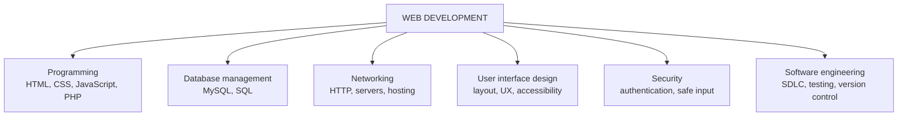
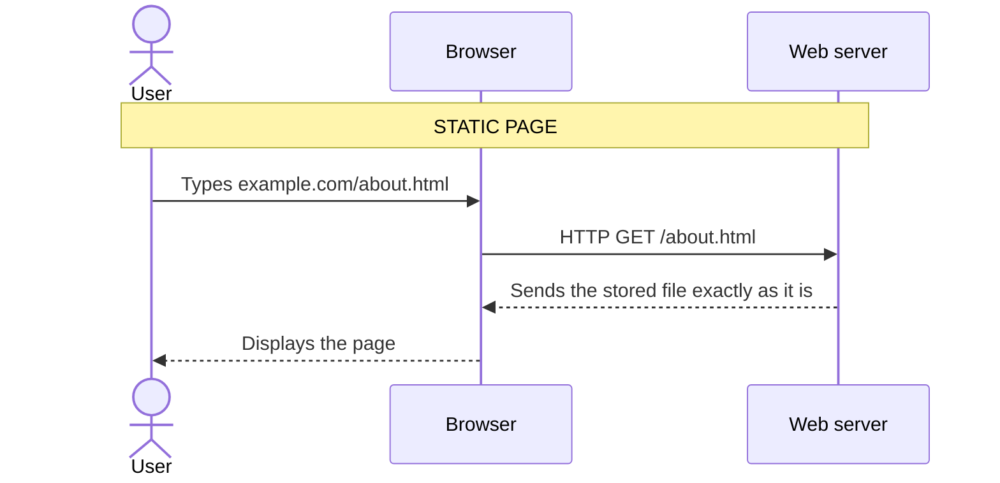
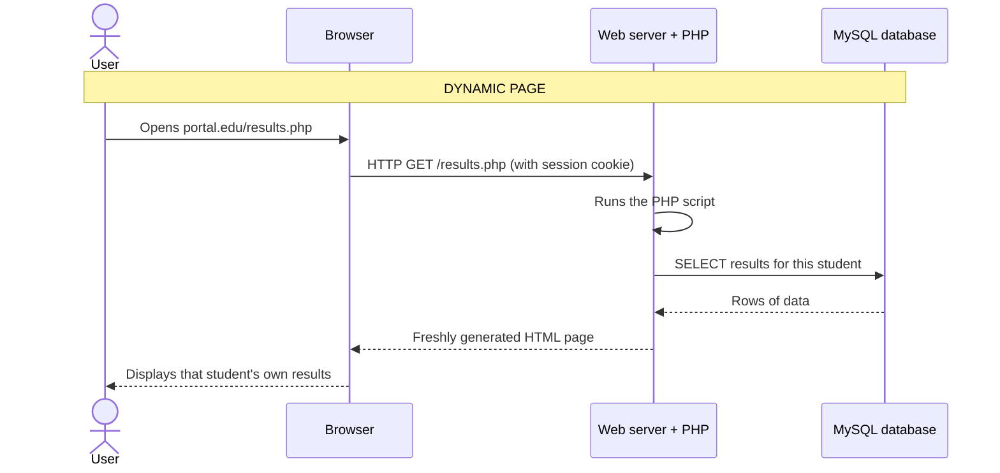
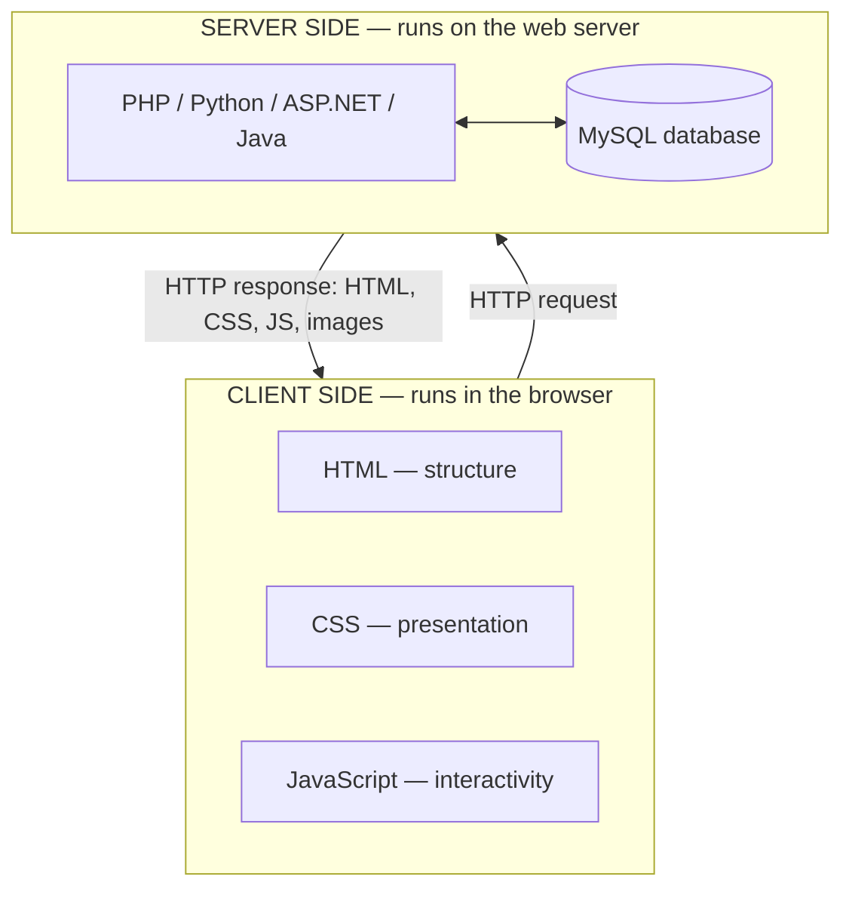

## What Is Web Development?

**Web development** is the process of **designing, building, deploying and maintaining websites and web applications** that are accessed through the **Internet** or an organisation's **intranet**.

A **website** is a collection of **interconnected web pages** stored on a **web server** and accessed through a **web browser** using a **URL** (Uniform Resource Locator), for example `https://www.ui.edu.ng`.

Modern web development is not just "making pages". It combines many disciplines:



<Analogy>
Think of building a **restaurant**. The dining room (tables, menu, décor) is what customers see — the **front end**. The kitchen (chefs, recipes, stock room) is hidden but does the real work — the **back end** and **database**. The waiter carrying orders back and forth is **HTTP**. A web developer has to understand the whole restaurant, not just the paint on the walls.
</Analogy>

---

## The World Wide Web

The **World Wide Web (WWW, or "the Web")** is a **global information system** of **interlinked hypertext documents and multimedia resources** that are **identified by URLs** and **accessed through the Internet**.

It was invented in **1989** by **Tim Berners-Lee**, a British scientist working at **CERN** (*Conseil Européen pour la Recherche Nucléaire* — the European nuclear research laboratory near Geneva). He wanted physicists in different places to share documents easily by clicking **links** between them.


*Figure: The NeXT computer that became the world's first web server at CERN. The label warns: "This machine is a server. DO NOT POWER IT DOWN!!" Photo: Coolcaesar, CC BY-SA 3.0, via Wikimedia Commons.*

Berners-Lee created the **three core ideas** that the Web still runs on today:

| Invention | What it does |
|---|---|
| **HTML** (HyperText Markup Language) | Describes the **structure** of a page and its **links**, e.g. `<a href="about.html">` |
| **URL** (Uniform Resource Locator) | Gives every resource a **unique address**, e.g. `https://ui.edu.ng` |
| **HTTP** (HyperText Transfer Protocol) | The **rules** a browser and server use to request and send pages, e.g. `GET /index.html` |

So the Web relies primarily on five things:

1. **HTTP/HTTPS** — the communication protocol (HTTPS is the **encrypted, secure** version).
2. **URLs** — addresses for every page, image and file.
3. **HTML** — the language pages are written in.
4. **Web browsers** — software that requests and displays pages (Chrome, Firefox, Edge, Safari).
5. **Web servers** — computers/software that store pages and send them on request (Apache, Nginx, IIS).

### Anatomy of a URL

A URL tells the browser **how** to fetch a resource and **where** it lives:


| Part | Meaning |
|---|---|
| **Scheme** (`https`) | The protocol to use |
| **Host** (`www.example.com`) | The server's domain name (translated to an IP address by **DNS**) |
| **Port** (`443`) | The "door" on the server — usually hidden because 80 (HTTP) and 443 (HTTPS) are defaults |
| **Path** (`/courses/ift302/index.php`) | Which resource on that server |
| **Query string** (`?week=1`) | Extra data sent to the server as name=value pairs |
| **Fragment** (`#objectives`) | A position **within** the page — never sent to the server |

---

## Internet vs World Wide Web

Students often use these two words as if they mean the same thing. **They do not.**

| Internet | World Wide Web |
|---|---|
| A **global network of computers** | An **information system running on the Internet** |
| It is an **infrastructure** (cables, routers, satellites, TCP/IP) | It is a **service** that uses that infrastructure |
| Supports **many services**: email, FTP, VoIP, online gaming, **and the Web** | Uses **HTTP/HTTPS** |
| **Exists independently** of the Web (it started in 1969 as ARPANET) | **Depends on** the Internet (or a network) to work |

<Analogy>
The **Internet is the road network**; the **Web is one kind of vehicle** that travels on it. Email, WhatsApp calls and file transfers are other vehicles using the same roads. You can have roads without buses, but you can't run a bus service without roads.
</Analogy>

<MCQ question="Which statement about the Internet and the World Wide Web is correct?">
<Option>They are two names for the same thing.</Option>
<Option>The Internet runs on top of the World Wide Web.</Option>
<Option correct>The Web is a service that runs on the Internet, which also carries email, FTP and VoIP.</Option>
<Option>The Web was invented before the Internet.</Option>
<Explain>
The **Internet** is the infrastructure (a global network of networks, dating from ARPANET in 1969). The **Web** (1989) is one service on it, using HTTP/HTTPS. Email (SMTP), file transfer (FTP) and voice calls (VoIP) are other services on the same Internet.
</Explain>
</MCQ>

---

## The Evolution of the Web

The Web has passed through three broad generations. Each added a new kind of relationship between users and websites.

<Tabs>
<Tab label="Web 1.0">

### Web 1.0 — The Read-Only Web (about 1991–2004)

**Characteristics:**
- **Static** websites — pages were plain HTML files
- **No user interaction** beyond clicking links
- Content written only by the site owner; visitors could **read, not write**
- Used mainly for **publishing information**

**Examples:** early university websites, company **"brochure" websites** listing address, products and phone number.

</Tab>
<Tab label="Web 2.0">

### Web 2.0 — The Read-Write Web (about 2004 onwards)

**Characteristics:**
- **Dynamic** websites built from databases
- **User-generated content** — visitors post, comment, upload and review
- **Social media**, **blogs**, **online shopping**, wikis
- Rich interaction without reloading the whole page

**Examples:** **Facebook**, **YouTube**, **Wikipedia**, Jumia, Twitter/X.

**Technologies that made it possible:** **PHP**, **JavaScript**, **AJAX** (updating part of a page in the background), **MySQL**.

</Tab>
<Tab label="Web 3.0">

### Web 3.0 — The Semantic and Intelligent Web (emerging)

**Characteristics:**
- **AI integration** and **machine learning**
- **Personalisation** — content tailored to each user
- **Linked data** — information described so machines can "understand" it (Berners-Lee's *Semantic Web* idea)
- **APIs** connecting services to each other
- **Blockchain integration** — decentralised applications (often called "Web3")

**Examples:** **AI-powered chatbots**, **recommendation systems** (YouTube and Netflix suggestions), **intelligent search engines** that answer questions directly.

</Tab>
</Tabs>

| Generation | User's role | Content comes from | Typical technology |
|---|---|---|---|
| **Web 1.0** | Reader | Site owner only | HTML |
| **Web 2.0** | Reader **and writer** | Users + site owner | PHP, JavaScript, AJAX, MySQL |
| **Web 3.0** | Reader, writer and **owner/partner** | Users, owner **and machines (AI)** | AI/ML, APIs, linked data, blockchain |

<ExamTip>
Examiners like "**Read-Only → Read-Write → Semantic/Intelligent**". Always give **characteristics + an example** for each generation — a list of characteristics alone earns only part of the marks.
</ExamTip>

---

## Website vs Web Application

| Website | Web Application |
|---|---|
| Primarily **provides information** | **Performs tasks** for the user |
| **Mostly static** | **Dynamic** |
| **Minimal interaction** | **High interaction** |
| **Usually no login** | **Login usually required** |
| Example: a **university homepage** | Example: the **student portal** (course registration, results, fees) |

The line is blurry — many sites are a mix. A news website is mostly informational, but its comment section and paywall login are "application" features. The question to ask is: **does the user mainly *read*, or mainly *do* something?**

---

## Types of Websites: Static and Dynamic

### 1. Static Website

A **static website** is one whose **content remains the same until someone manually edits the files**. Every visitor sees exactly the same page.

- Built with **HTML and CSS only** (sometimes a little JavaScript)
- **No database**, no server-side program
- **Fast**, **secure** and **easy to host**

| Advantages | Disadvantages |
|---|---|
| **Faster loading** — the server just sends a file | **Difficult to update frequently** — every change means editing HTML |
| **Lower cost** — cheap or free hosting | **No personalisation** — everyone sees the same thing |
| **Easy maintenance** for small sites | **Limited functionality** — no logins, search, carts |
| **Better security** — no database to attack | |

**Examples:** personal **portfolio** websites, **company profile** websites, event landing pages.

### 2. Dynamic Website

A **dynamic website** **generates its pages automatically** at the moment they are requested, using **server-side programming** and a **database**.

- Uses server-side languages such as **PHP, Python, ASP.NET, Java, Node.js**
- **Connected to databases**
- **Personalised** content (your name, your results, your cart)
- **Interactive**

| Advantages | Disadvantages |
|---|---|
| **Easy updates** — change the database, every page updates | **More complex** to build |
| **User authentication** (login) | **Requires server-side software** (PHP, database server) |
| **Database integration** — search, filter, store | **Higher hosting requirements** and cost |
| **Interactive features** — comments, carts, payments | Slightly **slower**, and more to secure |

**Examples:** **Facebook**, **Amazon**, the **student portal**, **banking systems**.

### How the Server Handles Each Type

The key difference is **what the server does** when a request arrives:





### Static vs Dynamic Web Pages — Comparison

| Feature | Static | Dynamic |
|---|---|---|
| **Content** | Fixed | Changes (per user, per request) |
| **Database** | No | Yes |
| **Server-side language** | No | Yes |
| **Personalisation** | No | Yes |
| **Speed** | Faster | Slightly slower |
| **Maintenance** | Manual (edit files) | Automated (update data) |

<MCQ question="A bank's online platform shows each customer their own balance after they log in. What kind of site is this?">
<Option>A static website, because it uses HTML.</Option>
<Option correct>A dynamic web application, because pages are generated per user from a database.</Option>
<Option>A Web 1.0 site, because banks are traditional.</Option>
<Option>A static website, because the balance is read-only.</Option>
<Explain>
The balance page is **generated on request** by a server-side program that looks up **that customer's** data in a database, and it requires **login**. Those are the marks of a **dynamic web application**. Every website uses HTML — even dynamic ones send HTML to the browser in the end.
</Explain>
</MCQ>

---

## Framework-Based Web Development

A **framework** is a **collection of reusable software components, libraries, tools and best practices** that **simplify application development**.

Instead of writing every feature from scratch (login, database access, routing URLs to code, form validation), developers use a framework that already provides them, and they follow its **standard structure**.

<Analogy>
Building a house from scratch means **making your own bricks**. A framework is like buying **ready-made bricks, doors and a proven floor plan** — you still design and build the house, but faster, more safely, and in a layout other builders instantly recognise.
</Analogy>

### Benefits of Frameworks

- **Faster development** — common features are already built
- **Reusable code**
- **Better organisation** — a standard folder structure (often **MVC**: Model-View-Controller)
- **Improved security** — protection against SQL injection, XSS and CSRF built in
- **Easier maintenance** — any developer who knows the framework can work on the project
- **Scalability**
- **Built-in authentication** (registration, login, password reset)
- **Database abstraction** — work with data using code rather than raw SQL everywhere

### Framework Examples by Language

| Language | Frameworks |
|---|---|
| **PHP** | **Laravel**, **CodeIgniter**, **Symfony**, **Yii** |
| **Python** | **Django**, **Flask**, **FastAPI** |
| **C#** | **ASP.NET** (and ASP.NET Core) — Microsoft's platform for **enterprise** web applications |

### Overview of PHP, ASP.NET and Python for the Web

| | PHP | ASP.NET | Python |
|---|---|---|---|
| **What it is** | A server-side scripting language made for the web (Rasmus Lerdorf, 1995) | Microsoft's web framework (2002), running on .NET | A general-purpose language with web frameworks |
| **Language** | PHP | **C#** (mainly) | Python |
| **Typical stack** | Apache + MySQL + PHP (**XAMPP/LAMP**) | IIS or Kestrel + SQL Server | Django/Flask + PostgreSQL or MySQL |
| **Strengths** | Easy to start, cheap hosting everywhere, runs WordPress | Strong typing, performance, enterprise tooling | Clean syntax; strong in AI/data science |
| **Known for** | WordPress, Wikipedia (MediaWiki), Facebook's early code | Banking, corporate intranets, Stack Overflow | Instagram (Django), Pinterest |

This course uses **PHP** for server-side programming, then introduces ASP.NET, Flask and Django later on.

---

## Client-Side vs Server-Side Technologies

Every web application is split between **two computers**: the user's device (the **client**) and the **server**.



| | Client-Side | Server-Side |
|---|---|---|
| **Runs** | **Inside the browser** on the user's device | **On the web server** |
| **Examples** | **HTML, CSS, JavaScript** | **PHP, Python, ASP.NET, Java** (and Node.js) |
| **Responsibilities** | **Interface**, **user interaction**, **validation** (quick checks), **animation** | **Business logic**, **authentication**, **database access**, **security** |
| **Can the user see the code?** | **Yes** — "View Page Source" shows it | **No** — the user only receives the output |
| **Can the user change it?** | Yes (so it can never be fully trusted) | No |

<ExamTip>
A favourite question: "**Why must form data be validated on the server even if JavaScript already validated it?**" Because client-side code runs on the user's machine — a user can **disable JavaScript** or **send a request directly** without using your form. Client-side validation is for **user convenience**; server-side validation is for **security**.
</ExamTip>

### Common Web Technologies

| Technology | Purpose |
|---|---|
| **HTML** | **Structure** of pages |
| **CSS** | **Presentation** (colours, fonts, layout) |
| **JavaScript** | **Interactivity** in the browser |
| **PHP** | **Server-side** programming |
| **Python** | **Back-end** programming |
| **Apache** | **Web server** |
| **MySQL** | **Database** |
| **Git** | **Version control** |
| **VS Code** | **Code editor** |

---

## Roles of a Web Developer

A professional web developer should understand:

| Area | What it involves |
|---|---|
| **Front-end development** | Building what users see and touch: HTML, CSS, JavaScript |
| **Back-end development** | Server logic, APIs, processing forms: PHP, Python, etc. |
| **Database management** | Designing tables, writing SQL, keeping data consistent |
| **Web security** | Protecting against SQL injection, XSS, stolen passwords |
| **Testing** | Checking that features work on all browsers and devices |
| **Deployment** | Putting the application on a live server |
| **Version control** | Tracking changes and collaborating with Git |
| **APIs** | Connecting to other services (payments, maps, SMS) |

Developers who can do **both front-end and back-end** work are called **full-stack developers**.

---

## The Web Development Lifecycle

Web applications are built using the **Software Development Life Cycle (SDLC)**. Each phase contributes to a **reliable** application:

<FlowDiagram title="The SDLC applied to a web application" cycle>
<FlowStep title="Requirement Analysis">
Find out **what the system must do** — talk to users and stakeholders. For a student portal: *students must register courses, view results and pay fees.* Mistakes here are the most expensive to fix later, so this phase stops you building the wrong thing.
</FlowStep>
<FlowStep title="System Design">
Plan **how** it will work: page layouts (wireframes), the **database tables**, the site's navigation structure and the architecture (which server, which language). Good design prevents messy, hard-to-change code.
</FlowStep>
<FlowStep title="Development (Coding)">
Write the **HTML, CSS, JavaScript, PHP and SQL**. Use **Git** so every change is tracked and team members don't overwrite each other's work.
</FlowStep>
<FlowStep title="Testing">
Check every feature: forms, logins, calculations, **different browsers and phones**, and **security** (what happens if someone types SQL into the login box?). Testing catches bugs **before users do**.
</FlowStep>
<FlowStep title="Deployment">
Upload the application to a **live web server** (hosting), connect the domain name, set up the production database and **HTTPS**.
</FlowStep>
<FlowStep title="Maintenance">
Fix bugs users report, apply **security updates**, add new features, and **back up** the database. Most of a website's life is spent here — and new requirements start the cycle again.
</FlowStep>
</FlowDiagram>

---

## Practical: Your First Web Page

The practical for this week has five parts.

<Step step="1" title="Install the tools">
Install **Visual Studio Code**, **XAMPP** (which bundles Apache, PHP and MySQL), and **Google Chrome** or **Mozilla Firefox**. Git is optional at this stage. (Full installation steps are in the next lesson.)
</Step>

<Step step="2" title="Start Apache and MySQL">
Open the **XAMPP Control Panel** and click **Start** beside **Apache** and **MySQL**. Both should turn **green**.
</Step>

<Step step="3" title="Find the web root">
The **web root** is the folder Apache serves files from. In **XAMPP** it is **`htdocs`** (usually `C:\xampp\htdocs`); in **WAMP** it is **`www`**. Create a folder called **`Week1`** inside it.
</Step>

<Step step="4" title="Create index.html">
Inside `Week1`, create a file named **`index.html`** with the code below and save it.
</Step>

<Step step="5" title="Open it through the server">
In the browser, visit **`http://localhost/Week1/`**. Apache automatically serves `index.html` when a folder is requested.
</Step>

Here is the page from the lecture. **Edit it right here** — change the heading, add another paragraph — and press **Run** to see how the browser renders it:

<Playground title="My first web page">

```html
<!DOCTYPE html>
<html>
<head>
    <title>My First Web Page</title>
</head>
<body>

<h1>Welcome to Framework-Based Web Development</h1>

<p>This is my first web page.</p>

</body>
</html>
```

</Playground>

**What each part does:**

| Code | Meaning |
|---|---|
| `<!DOCTYPE html>` | Tells the browser this is an **HTML5** document |
| `<html>` … `</html>` | The **root** element that wraps everything |
| `<head>` | Information **about** the page (not shown in the page body) |
| `<title>` | The text shown on the **browser tab** |
| `<body>` | Everything **visible** on the page |
| `<h1>` | The main **heading** |
| `<p>` | A **paragraph** |

### Opening a file vs opening through localhost

- **Double-clicking the file** opens an address like `file:///C:/xampp/htdocs/Week1/index.html`. The browser reads the file **directly from disk**. That's fine for plain HTML, but **PHP will not run** — you would see raw PHP code.
- **Visiting `http://localhost/Week1/`** makes the browser send an **HTTP request to Apache** on your own computer, exactly as it would to a real server. **PHP runs.**

From the PHP lessons onwards, **always open your pages through `http://localhost/…`**.

### Inspecting a Web Page with Developer Tools

Every modern browser includes **Developer Tools**:

1. **Right-click** anywhere on the page and choose **Inspect** (or press **F12**, or **Ctrl + Shift + I**).
2. Explore the **Elements** tab to see the **HTML structure** — hover over an element and it highlights on the page. You can even edit text and CSS live.
3. Open the **Console** tab to see **JavaScript errors and messages**.
4. The **Network** tab shows every **HTTP request** the page made and how long each took.

These tools are essential for **debugging** and for understanding **how the browser interprets** your code.

---

## Practice Questions

<Reveal question="Explain the difference between the Internet and the World Wide Web.">
The **Internet** is a **global network of computers** — the physical and logical **infrastructure** (routers, cables, TCP/IP) that exists independently and supports many services such as email, FTP and VoIP. The **World Wide Web** is an **information system/service** of interlinked hypertext documents identified by URLs and accessed through the Internet using **HTTP/HTTPS**. The Web **depends on** the Internet; the Internet does not depend on the Web.
</Reveal>

<Reveal question="Differentiate between a website and a web application, with examples.">
A **website** mainly **provides information**, is mostly **static**, has **minimal interaction** and usually **no login** — e.g., a **university homepage** or company profile site. A **web application** **performs tasks**, is **dynamic**, highly **interactive** and usually **requires login** — e.g., a **student portal**, **online banking**, or **Gmail**.
</Reveal>

<Reveal question="Compare static and dynamic web pages using five distinguishing features, with two examples of each.">
| Feature | Static | Dynamic |
|---|---|---|
| Content | Fixed until edited | Generated per request |
| Database | None | Yes |
| Server-side language | None | PHP, Python, ASP.NET… |
| Personalisation | None | Yes |
| Speed | Faster | Slightly slower |
| Maintenance | Manual editing | Automated through data |

**Static examples:** a personal portfolio site; a company profile/brochure site. **Dynamic examples:** Facebook; a university student portal (also Amazon, banking systems).
</Reveal>

<Reveal question="What is a web development framework, and why is it useful? Name two PHP and two Python frameworks.">
A framework is a **collection of reusable components, libraries, tools and best practices** that simplify development by providing ready-made features and a **standard structure**. Benefits: **faster development, reusable code, better organisation, improved security, easier maintenance, scalability, built-in authentication and database abstraction**. PHP: **Laravel, CodeIgniter** (also Symfony, Yii). Python: **Django, Flask** (also FastAPI).
</Reveal>

<Reveal question="Identify three client-side and three server-side technologies, and state what each side is responsible for.">
**Client-side:** HTML, CSS, JavaScript — responsible for the **interface, user interaction, quick validation and animation**, running **in the browser**. **Server-side:** PHP, Python, ASP.NET (also Java) — responsible for **business logic, authentication, database access and security**, running **on the web server**.
</Reveal>

<Reveal question="Describe the roles of Apache and MySQL in a web application.">
**Apache** is the **web server**: it **receives HTTP requests** from browsers, **locates the requested files**, **runs server-side scripts** such as PHP (through a module) and **sends the responses** back. **MySQL** is the **database server**: it **stores and retrieves the application's data** (users, products, results) when the PHP code sends it SQL queries.
</Reveal>

<Reveal question="Why must you open a PHP page through http://localhost/ rather than by double-clicking the file?">
Double-clicking opens the file with a `file://` address, so the browser reads it straight from disk and **no web server is involved** — the PHP code is never executed. Visiting `http://localhost/…` sends an **HTTP request to Apache**, which passes `.php` files to the **PHP interpreter** and returns the generated HTML.
</Reveal>

<Takeaway>
**Web development** = designing, building, deploying and maintaining websites and web applications. The **Web** (Tim Berners-Lee, **CERN, 1989**) is a **service** built on **HTML, URLs and HTTP**, running on the **Internet** (the infrastructure). The Web evolved from **read-only (1.0)** to **read-write (2.0)** to **semantic/intelligent (3.0)**. **Websites inform; web applications perform tasks.** **Static** pages are fixed files — fast, cheap, secure; **dynamic** pages are **generated per request** by server-side code and a database. **Frameworks** give reusable, secure structure. **Client-side** (HTML, CSS, JS) handles the interface; **server-side** (PHP, Python, ASP.NET) handles logic, authentication, data and security. Build web apps with the **SDLC**, and test pages through **`http://localhost/`**.
</Takeaway>

## Exam Tips

**What lecturers test:**
- Definitions: web development, the WWW, framework
- **Internet vs Web** and **website vs web application** tables
- **Static vs dynamic** — five features and two examples each
- Web 1.0 / 2.0 / 3.0 characteristics **with examples**
- Client-side vs server-side technologies and their responsibilities
- Drawing the basic **client–server** architecture (covered in detail in the Web Architecture lesson)

**Common mistakes:**
- Saying "the Internet was invented by Tim Berners-Lee" — he invented the **Web**
- Calling HTML a **programming** language — it is a **markup** language
- Listing JavaScript as server-side only (in this course's split it is **client-side**, although Node.js can run it on servers)

**Likely question:**
> "Distinguish between static and dynamic websites, giving five features and two examples of each. Explain the roles of client-side and server-side technologies in a dynamic web application." (15 marks)
