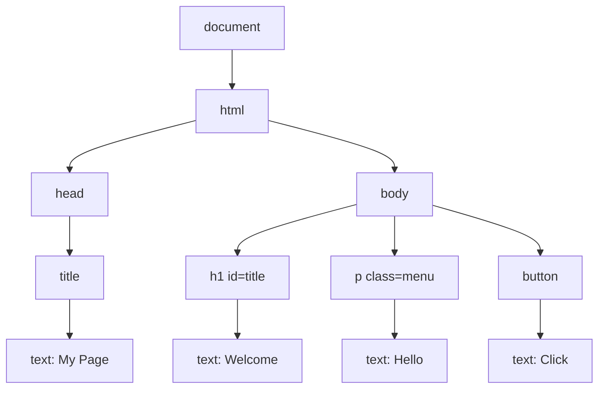

## What Is JavaScript?

**JavaScript** is a **programming language that adds interactivity and dynamic functionality to web pages**. Unlike HTML and CSS, it has real programming logic — variables, decisions, loops and functions — and it runs **inside the browser**.

**Examples of what JavaScript does:**
- **Image sliders**
- **Form validation**
- **Pop-up messages**
- **Interactive menus**
- **Games**
- **Calculators**

> **JavaScript is not Java.** The two languages are unrelated; the similar name was a marketing decision in 1995.

---

## Adding JavaScript to HTML

<Tabs>
<Tab label="Internal">

**Internal JavaScript** is written inside a **`<script>`** element in the HTML file:

```html
<script>
    alert("Welcome!");
</script>
```

</Tab>
<Tab label="External ✓">

**External JavaScript** is written in a **separate `.js` file** (e.g. `script.js`) and linked with a `<script>` tag that has a **`src`** attribute:

```html
<script src="script.js"></script>
```

and in `script.js`:

```js
alert("Welcome!");
```

**External JavaScript is generally preferred for larger projects** — the same reasons as external CSS: reuse across pages, cleaner HTML, browser caching.

</Tab>
</Tabs>

### Where to Put the `<script>` Tag

The browser runs a script **the moment it reaches it**. A script in the `<head>` runs **before the `<body>` exists**, so code like `document.getElementById("title")` finds **nothing** and returns `null`. Two fixes:

```html
<!-- Fix 1: put the script at the end of <body> -->
<body>
    <h1 id="title">Welcome</h1>
    <script src="script.js"></script>
</body>

<!-- Fix 2: keep it in <head> but add defer — it runs after the page is built -->
<head>
    <script src="script.js" defer></script>
</head>
```

---

## JavaScript Fundamentals

### Variables

**Variables store data that can be used later in a program.**

| Keyword | Use it for | Example |
|---|---|---|
| **`let`** | Values that **may change** | `let name = "John";` |
| **`const`** | Values that **should not be reassigned** | `const age = 20;` |
| `var` | Old style (before 2015) — avoid in new code | `var x = 5;` |

**Naming rules:** names may contain letters, digits, `_` and `$`, **must not start with a digit**, are **case-sensitive** (`score` ≠ `Score`), and can't be reserved words like `if` or `let`. Use **camelCase**: `studentName`, `totalScore`.

### Data Types

| Type | Example | Notes |
|---|---|---|
| **String** | `let name = "John";` | Text, in `"double"`, `'single'` or `` `backtick` `` quotes |
| **Number** | `let age = 20;` | Whole numbers and decimals alike (`3.14`) |
| **Boolean** | `let isStudent = true;` | `true` or `false` |
| **Array** | `let courses = ["HTML", "CSS", "JavaScript"];` | An ordered list; **first item is index 0** |
| **Object** | `let student = { name: "John", age: 20 };` | Named properties: `student.name` |
| **Null** | `let result = null;` | **Intentionally empty** |
| **Undefined** | `let x;` | Declared but **not yet given a value** |

**JavaScript is dynamically typed**: a variable can hold any type and **change type** later. `typeof` tells you what a value currently is.

### Operators

| Kind | Operators | Example → result |
|---|---|---|
| **Arithmetic** | `+  -  *  /  %` | `10 % 3` → `1` (remainder) |
| **String joining** | `+` | `"IFT" + 302` → `"IFT302"` |
| **Comparison** | `==  ===  !==  >  <  >=  <=` | `5 > 3` → `true` |
| **Logical** | `&&` (and), `\|\|` (or), `!` (not) | `age >= 16 && hasPin` |

**`===` checks both value and type**; `==` converts types first and can surprise you. **Prefer strict equality (`===`)**:

- `5 == "5"` → `true` (the string is converted to a number)
- `5 === "5"` → `false` (number vs string)

**Run this and read the console output:**

<Playground title="JavaScript fundamentals in the console">

```js
let name = "Ada";
const age = 20;
let courses = ["HTML", "CSS", "JavaScript"];
let student = { name: "Ada", level: 300 };

console.log(typeof name, typeof age, typeof courses, typeof student);
console.log("First course:", courses[0], "| Number of courses:", courses.length);
console.log("Student level:", student.level);

console.log(10 + 5, 10 - 5, 10 * 5, 10 / 5, 10 % 3);
console.log("IFT" + 302);
console.log(5 == "5", 5 === "5", 5 !== 3);

let x;
console.log(x, null);
```

</Playground>

### Conditional Statements

**Conditions allow a program to make decisions:**

```js
let score = 70;
if (score >= 50) {
    console.log("Pass");
} else {
    console.log("Fail");
}
```

For more than two outcomes, chain **`else if`**:

```js
if (score >= 70) {
    console.log("A");
} else if (score >= 60) {
    console.log("B");
} else if (score >= 50) {
    console.log("C");
} else {
    console.log("F");
}
```

### Loops

**Loops repeat instructions** — useful when working with repeated data:

```js
for (let i = 1; i <= 5; i++) {
    console.log(i);          // 1, 2, 3, 4, 5
}
```

| Part | Meaning |
|---|---|
| `let i = 1` | **Start**: create a counter |
| `i <= 5` | **Condition**: keep looping while true |
| `i++` | **Update**: add 1 after each pass |

Other loops: `while (condition) { … }` repeats while a condition holds; `for (const c of courses) { … }` visits each item of an array.

### Functions

**A function is a reusable block of code.** Define it once, **call** it whenever you need it:

```js
function greet() {
    alert("Welcome!");
}
greet();                     // call it
```

Functions can **accept information (parameters)** and **send back a result (return)**:

```js
function greet(name) {
    return "Welcome " + name;
}
console.log(greet("Ada"));   // Welcome Ada
```

**Functions allow code to be reused, making programs easier to maintain.** A short modern form is the **arrow function**: `const greet = name => "Welcome " + name;`

<Playground title="Conditions, loops and functions — try your own score">

```js
function grade(score) {
  if (score >= 70) return "A";
  else if (score >= 60) return "B";
  else if (score >= 50) return "C";
  else if (score >= 45) return "D";
  else return "F";
}

const scores = [82, 67, 55, 48, 31];   // change these
for (let i = 0; i < scores.length; i++) {
  console.log("Score " + scores[i] + " → grade " + grade(scores[i]));
}
```

</Playground>

<MCQ question="What does console.log(3 + '3') print?">
<Option>6</Option>
<Option correct>33</Option>
<Option>An error</Option>
<Option>undefined</Option>
<Explain>
When one side of `+` is a **string**, JavaScript **joins** (concatenates) instead of adding: `3` becomes `"3"`, giving `"33"`. This is a classic bug with form input, because values read from `<input>` fields are **always strings** — convert with `Number(value)` before doing arithmetic.
</Explain>
</MCQ>

---

## JavaScript Events

**An event is an action that happens in the browser**, which JavaScript can respond to.

| Event | Fires when… |
|---|---|
| `click` | an element is clicked or tapped |
| `submit` | a form is submitted |
| `change` | a select, checkbox or input's value is changed and committed |
| `input` | the user types in a field (every keystroke) |
| `mouseover` | the pointer moves onto an element |
| `load` | the page (or an image) has finished loading |
| `keydown` | a key is pressed |

**Two ways to connect an event to code:**

```html
<!-- 1. Inline event attribute (the lecture's first example) -->
<button onclick="sayHello()">Click Me</button>
```

```js
// 2. addEventListener — preferred: keeps JavaScript out of the HTML
let button = document.getElementById("welcomeButton");
button.addEventListener("click", function () {
    alert("Welcome to JavaScript!");
});
```

### Practice 3: Create an Interactive Button

<Playground title="Practice 3 — interactive button">

```html
<button id="welcomeButton">Click Me</button>
<button onclick="sayHello()">Inline version</button>
```

```js
function sayHello() {
  alert("Hello!");
}

let button = document.getElementById("welcomeButton");
button.addEventListener("click", function () {
  alert("Welcome to JavaScript!");
});
```

</Playground>

---

## DOM Manipulation

### What Is the DOM?

The **Document Object Model (DOM)** is a **programming interface that represents an HTML document as a tree of objects**. When a browser loads a page, it builds this tree; **JavaScript can then access and modify any element dynamically** — change text, styles, add or remove elements — **without reloading the page**.

For this HTML:

```html
<html>
  <head><title>My Page</title></head>
  <body>
    <h1 id="title">Welcome</h1>
    <p class="menu">Hello</p>
    <button>Click</button>
  </body>
</html>
```

the browser builds this tree:



Every tag becomes an **element node**; the text inside becomes a **text node**. `document` is the entry point JavaScript uses to reach everything.

### Accessing (Selecting) Elements

| Method | Returns | Example |
|---|---|---|
| `document.getElementById("title")` | **The one element** with that id | the `<h1>` |
| `document.getElementsByClassName("menu")` | **All elements** with that class (a live collection) | every `.menu` |
| `document.querySelector(".menu")` | **The first** element matching a **CSS selector** | the first `.menu` |
| `document.querySelectorAll("p")` | **All** elements matching the selector | every `<p>` |

`querySelector` accepts any CSS selector — `"#title"`, `".menu"`, `"nav a"` — so it's the most flexible.

### Changing Content and Styles

```js
// Change the text
document.getElementById("title").textContent = "Hello Students";

// Change a CSS property (CSS names become camelCase: background-color → backgroundColor)
document.getElementById("title").style.color = "blue";

// Add / remove / toggle a CSS class (cleaner than setting many styles)
document.getElementById("title").classList.toggle("highlight");
```

> **`textContent` vs `innerHTML`:** `textContent` inserts **plain text**; `innerHTML` parses the string **as HTML**. Never put user-typed text into `innerHTML` — a user could type `` and run their own script (**cross-site scripting, XSS**). Use `textContent` for user input.

### Creating and Removing Elements

```js
// Create a new element
let paragraph = document.createElement("p");
paragraph.textContent = "This paragraph was created using JavaScript.";
document.body.appendChild(paragraph);    // add it to the end of <body>

// Remove an element
paragraph.remove();
```

### Practice 4: Change the Message

The task: when the button is clicked, change the heading to **"Welcome to Client-side programming"**. The solution also changes its colour and adds a list item each time — click several times:

<Playground title="Practice 4 — DOM manipulation">

```html
<h2 id="message">Hello</h2>
<button id="changeButton">Change Message</button>
<button id="addButton">Add item</button>
<button id="removeButton">Remove last</button>
<ul id="list"></ul>
```

```js
const heading = document.getElementById("message");
const list = document.getElementById("list");
let count = 0;

document.getElementById("changeButton").addEventListener("click", function () {
  heading.textContent = "Welcome to Client-side programming";
  heading.style.color = "#1d4ed8";
});

document.getElementById("addButton").addEventListener("click", function () {
  count++;
  const item = document.createElement("li");
  item.textContent = "Item " + count + " (created with JavaScript)";
  list.appendChild(item);
  console.log("Items in list:", list.children.length);
});

document.getElementById("removeButton").addEventListener("click", function () {
  if (list.lastElementChild) list.lastElementChild.remove();
  console.log("Items in list:", list.children.length);
});
```

</Playground>

---

## HTML Forms

**Forms allow users to enter and submit information** — registration forms, login forms, contact forms, search forms, payment forms, feedback forms.

```html
<form action="register.php" method="post">
    <label for="name">Name:</label>
    <input type="text" id="name" name="name">
    <button type="submit">Submit</button>
</form>
```

| Attribute | Purpose |
|---|---|
| `action` | **Where** to send the data (a server-side script — PHP, in later lessons) |
| `method` | **How**: `get` (data in the URL) or `post` (data in the request body — use for passwords and anything that changes data) |
| `name` (on each input) | The **key** the server uses to read the value, e.g. `$_POST["name"]` |
| `id` (on each input) | Links the input to its `<label>` and lets JavaScript find it |

### Common Form Controls

| Control | Code |
|---|---|
| Text | `<input type="text">` |
| Email | `<input type="email">` |
| Password (characters hidden) | `<input type="password">` |
| Number | `<input type="number">` |
| Date (shows a date picker) | `<input type="date">` |
| Checkbox (any number can be ticked) | `<input type="checkbox" name="agree">` |
| Radio buttons (**only one per group** — same `name`) | `<input type="radio" name="gender" value="female">` |
| Multi-line text | `<textarea></textarea>` |
| Drop-down list | `<select>` with `<option>` items |
| Submit button | `<button type="submit">Submit</button>` |

```html
<select name="department">
    <option>Computer Science</option>
    <option>ICT</option>
</select>
```

### Labels and Accessibility

**Every form control should have a label.** It makes forms **easier to understand** and **improves accessibility**: screen readers read the label aloud, and clicking the label focuses the field (a bigger target).

```html
<label for="email">Email Address</label>
<input type="email" id="email">
```

**The label's `for` value must match the input's `id`.**

---

## Form Validation

**Form validation is the process of checking that user input is correct and meets the requirements before it is submitted for processing.** It **helps prevent errors and improves data quality**.

A registration form might require:
- **Name must not be empty.**
- **Email must be valid.**
- **Password must contain at least eight characters.**
- **Age must be within a specified range.**

### Why Form Validation Is Important

- **Ensures required fields are completed**
- **Reduces incorrect data entry**
- **Improves user experience** — instant feedback instead of a server error later
- **Protects applications from invalid input**
- **Reduces unnecessary server processing**

### HTML5 Validation (Built In)

HTML5 provides validation **with no JavaScript at all**:

| Rule | Attribute | Example |
|---|---|---|
| **Required field** — cannot be empty | `required` | `<input type="text" required>` |
| **Email format** | `type="email"` | `<input type="email">` |
| **Minimum length** | `minlength` | `<input type="password" minlength="8">` |
| **Number range** | `min`, `max` | `<input type="number" min="18" max="100">` |
| **Pattern** (regular expression) | `pattern` | `<input type="text" pattern="[A-Za-z]{3,}">` |

In the last example, `[A-Za-z]` means "a letter", and `{3,}` means "3 or more of them". **Try submitting this form with bad data:**

<Playground title="HTML5 validation — no JavaScript needed">

```html
<form id="f">
  <label>Name (letters, 3+): <input type="text" pattern="[A-Za-z]{3,}" required></label><br><br>
  <label>Email: <input type="email" required></label><br><br>
  <label>Password (8+): <input type="password" minlength="8" required></label><br><br>
  <label>Age (18–100): <input type="number" min="18" max="100" required></label><br><br>
  <button type="submit">Register</button>
</form>
<p id="ok"></p>
```

```js
// Only runs if every HTML5 rule passed — the browser blocks submission otherwise
document.getElementById("f").addEventListener("submit", function (e) {
  e.preventDefault();   // stay on this page for the demo
  document.getElementById("ok").textContent = "✓ All HTML5 rules passed!";
});
```

</Playground>

### JavaScript Form Validation

**HTML validation is useful, but JavaScript can provide more customised behaviour** — your own messages, checks that compare fields ("passwords must match"), and errors shown next to each field.

The lecture's pattern uses the form's **`onsubmit`** attribute:

```html
<form onsubmit="return validateForm()">
    <input type="text" id="username">
    <button type="submit">Submit</button>
</form>
```

```js
function validateForm() {
    let username = document.getElementById("username").value;
    if (username === "") {
        alert("Username cannot be empty.");
        return false;          // cancel the submission
    }
    return true;               // allow the form to be sent
}
```

**If the function returns `false`, the form is not submitted.** The modern equivalent uses `addEventListener("submit", …)` and calls **`event.preventDefault()`** to cancel:

```js
form.addEventListener("submit", function (event) {
    if (username.value.trim() === "") {
        event.preventDefault();      // stop the form being sent
        showError("Username cannot be empty.");
    }
});
```

(`.trim()` removes spaces from both ends, so a name of only spaces counts as empty.)

### Common Validation Rules

| Validation | Purpose |
|---|---|
| **Required** | Ensures a field is **not empty** |
| **Email** | Checks for a **valid email format** |
| **Password length** | Ensures **password strength** |
| **Number range** | **Restricts acceptable values** |
| **Pattern** | Matches a **specified format** (e.g. matric number, phone) |

<ExamTip>
Client-side validation is **for the user's convenience, not for security**. Anyone can switch off JavaScript, edit the HTML in DevTools, or send data straight to the server. **Always validate again on the server** (PHP) — you'll do this in the form-processing lesson.
</ExamTip>

---

## Mini Project: Student Registration Page

The course's mini project requires:

| HTML | CSS | JavaScript |
|---|---|---|
| Header, navigation, footer | Attractive page layout | Validate the student's **name** |
| Registration form with **name, email, password, department** and a **submit button** | Styled navigation and form | Validate the **email** |
| | Proper spacing; responsive design | Check **password length** |
| | A distinct look for the submit button | **Prevent submission** when information is invalid |
| | | Display **error messages**; display a **success message** when valid |

Here is a complete working solution. **Test it:** submit it empty, then with a bad email, then with a 5-character password, then with everything correct. Then read the JavaScript — every requirement is commented.

<Playground title="Mini project — Student Registration Page" height="480">

```html
<header><h1>UI Student Portal</h1></header>
<nav><a href="#">Home</a><a href="#">Register</a><a href="#">Contact</a></nav>

<main>
  <h2>Student Registration</h2>
  <form id="regForm" novalidate>
    <label for="fullName">Full name</label>
    <input type="text" id="fullName" name="fullName">
    <small class="error" id="nameError"></small>

    <label for="email">Email</label>
    <input type="email" id="email" name="email">
    <small class="error" id="emailError"></small>

    <label for="password">Password (at least 8 characters)</label>
    <input type="password" id="password" name="password">
    <small class="error" id="passwordError"></small>

    <label for="department">Department</label>
    <select id="department" name="department">
      <option value="">-- Select department --</option>
      <option>Computer Science</option>
      <option>Information Technology</option>
      <option>Library and Information Studies</option>
    </select>
    <small class="error" id="deptError"></small>

    <button type="submit">Register</button>
    <p id="success"></p>
  </form>
</main>

<footer>&copy; 2026 University of Ibadan</footer>
```

```css
* { box-sizing: border-box; }
body { margin: 0; font-family: Arial, sans-serif; background: #f1f5f9; color: #0f172a; }
header { background: #1e3a8a; color: white; padding: 14px; text-align: center; }
header h1 { margin: 0; font-size: 22px; }
nav { display: flex; justify-content: center; gap: 18px; background: #172554; padding: 10px; }
nav a { color: #bfdbfe; text-decoration: none; }
nav a:hover { color: white; }
main { max-width: 420px; margin: 16px auto; background: white; padding: 18px; border-radius: 12px; }
h2 { margin-top: 0; }
label { display: block; margin-top: 12px; font-weight: bold; font-size: 14px; }
input, select { width: 100%; padding: 10px; margin-top: 4px; border: 1px solid #cbd5e1; border-radius: 8px; font-size: 15px; }
input.invalid, select.invalid { border-color: #dc2626; background: #fef2f2; }
.error { color: #dc2626; font-size: 13px; display: block; min-height: 16px; }
button { margin-top: 16px; width: 100%; padding: 12px; border: 0; border-radius: 8px;
         background: #f97316; color: white; font-size: 16px; font-weight: bold; cursor: pointer; }
button:hover { background: #ea580c; }
#success { color: #15803d; font-weight: bold; text-align: center; }
footer { text-align: center; padding: 14px; color: #64748b; font-size: 13px; }
```

```js
const form = document.getElementById("regForm");

// Show or clear an error message under a field
function setError(input, errorId, message) {
  document.getElementById(errorId).textContent = message;
  input.classList.toggle("invalid", message !== "");
  return message === "";               // true when the field is valid
}

form.addEventListener("submit", function (event) {
  event.preventDefault();              // requirement: prevent submission (we decide below)
  document.getElementById("success").textContent = "";

  const name = document.getElementById("fullName");
  const email = document.getElementById("email");
  const password = document.getElementById("password");
  const dept = document.getElementById("department");

  // Requirement: validate the student's name (not empty, letters and spaces only)
  let nameMsg = "";
  if (name.value.trim() === "") nameMsg = "Name is required.";
  else if (!/^[A-Za-z ]{3,}$/.test(name.value.trim())) nameMsg = "Use letters only (at least 3).";

  // Requirement: validate the email (simple pattern: something@something.something)
  let emailMsg = "";
  if (email.value.trim() === "") emailMsg = "Email is required.";
  else if (!/^[^\s@]+@[^\s@]+\.[^\s@]+$/.test(email.value.trim())) emailMsg = "Enter a valid email address.";

  // Requirement: check password length
  const passMsg = password.value.length < 8 ? "Password must be at least 8 characters." : "";

  // Department must be chosen
  const deptMsg = dept.value === "" ? "Please choose your department." : "";

  // Requirement: display error messages (every field is checked, not just the first)
  const ok = [
    setError(name, "nameError", nameMsg),
    setError(email, "emailError", emailMsg),
    setError(password, "passwordError", passMsg),
    setError(dept, "deptError", deptMsg),
  ].every(Boolean);

  if (ok) {
    // Requirement: display a success message when the information is valid
    document.getElementById("success").textContent =
      "✓ Registration successful. Welcome, " + name.value.trim() + "!";
    console.log("Valid data — a real site would now send it to register.php");
    // form.submit();   // in a real project: send the data to the server
  } else {
    console.log("Form blocked: fix the highlighted fields");
  }
});
```

</Playground>

**How it works:**
1. **`novalidate`** on the form turns off the browser's built-in bubbles so **our own messages** are shown.
2. On **submit**, `event.preventDefault()` stops the form; each field is checked and **`setError`** writes a message beneath it and adds the red `invalid` class.
3. `[…].every(Boolean)` is `true` only if **all four checks passed** — only then is the success message shown.
4. The regular expression `/^[^\s@]+@[^\s@]+\.[^\s@]+$/` means: *some characters without spaces or @, then @, then more characters, a dot, and more characters*.

---

## Best Practices for Client-Side Programming

- **Write clean and readable code.**
- **Separate HTML, CSS and JavaScript** into different files where possible.
- **Use semantic HTML elements.**
- **Keep CSS organised and reusable.**
- **Validate user input before submission** (and again on the server).
- **Test frequently on multiple browsers and devices.**
- **Comment complex code** where necessary.
- **Use meaningful variable and function names** (`studentEmail`, not `x`).
- Keep the **browser console** open while developing — errors appear there in red.

---

## Practice Questions

<Reveal question="Differentiate between let and const, and between == and ===.">
**`let`** declares a variable whose value **can be reassigned**; **`const`** declares one that **cannot be reassigned**. **`==`** compares values **after converting types** (`5 == "5"` is true); **`===`** compares **value and type** with no conversion (`5 === "5"` is false). Strict equality is preferred because it avoids surprising conversions.
</Reveal>

<Reveal question="What is the DOM? Write JavaScript to change the text of <h1 id='title'> to 'Hello Students' and make it blue.">
The **Document Object Model** is a **programming interface that represents an HTML document as a tree of objects**, allowing JavaScript to access and modify elements dynamically.

```js
const title = document.getElementById("title");
title.textContent = "Hello Students";
title.style.color = "blue";
```
</Reveal>

<Reveal question="Compare getElementById, querySelector and querySelectorAll.">
**`getElementById("x")`** returns the **single element** with id `x`. **`querySelector(sel)`** returns the **first element** matching **any CSS selector** (e.g. `".menu"`, `"nav a"`). **`querySelectorAll(sel)`** returns **all matching elements** as a list you can loop over.
</Reveal>

<Reveal question="List five HTML5 validation attributes/types and what each checks.">
**`required`** — field must not be empty; **`type="email"`** — must look like an email address; **`minlength`** — minimum number of characters; **`min` / `max`** — allowed number range; **`pattern`** — must match a regular expression (e.g. `[A-Za-z]{3,}`).
</Reveal>

<Reveal question="Write a validateForm() function that stops submission if the password is shorter than 8 characters.">
```js
function validateForm() {
    let password = document.getElementById("password").value;
    if (password.length < 8) {
        alert("Password must contain at least eight characters.");
        return false;
    }
    return true;
}
```
used with `<form onsubmit="return validateForm()">`.
</Reveal>

<Reveal question="Why must data validated with JavaScript still be validated on the server?">
Client-side code runs on the **user's device**, so it can be **bypassed** — by disabling JavaScript, editing the page in DevTools, or sending an HTTP request directly. Client-side validation improves **user experience**; **server-side validation** is what actually **protects** the application and database.
</Reveal>

<Takeaway>
**JavaScript** adds **behaviour** to pages. Add it **internally** (`<script>`) or **externally** (`<script src="script.js">`, preferred) — at the end of `<body>` or with `defer`. Use **`let`** (changeable) and **`const`** (fixed); types include **string, number, boolean, array, object, null, undefined**; prefer **`===`**. Control flow uses **if/else**, **loops** and reusable **functions**; code reacts to **events** (`click`, `submit`, `input`…) via **`addEventListener`**. The **DOM** is the page as a **tree of objects**: select with **`getElementById` / `querySelector(All)`**, change with **`textContent`** and **`style`/`classList`**, add with **`createElement` + `appendChild`**, delete with **`remove()`**. **Forms** collect input (label every field; `for` = `id`). **Validate** with **HTML5 attributes** (`required`, `type="email"`, `minlength`, `min`/`max`, `pattern`) and **JavaScript** (return `false` / `preventDefault()` to block submission) — and always **again on the server**.
</Takeaway>

## Exam Tips

**What lecturers test:**
- Definition and uses of JavaScript; internal vs external scripts
- Variables (`let`/`const`), data types, operators — especially **`==` vs `===`**
- Writing a simple **if/else**, **for loop** and **function**
- Events and `addEventListener`
- DOM definition; **selecting** elements and **changing content/style**; creating/removing elements
- Form controls; labels; **HTML5 validation attributes**; a **JavaScript `validateForm()`** function

**Common mistakes:**
- Scripts in `<head>` without `defer` → `null` errors
- `getElementById("#title")` — **no `#`** with getElementById (it's only for `querySelector`)
- Forgetting that input values are **strings**
- `type="text"` for radio buttons — it must be **`type="radio"`**, and a group shares one **`name`**

**Likely question:**
> "What is form validation and why is it important? Using HTML5 attributes and JavaScript, write a registration form that requires a name, a valid email and a password of at least eight characters, and prevents submission when any rule fails." (20 marks)
