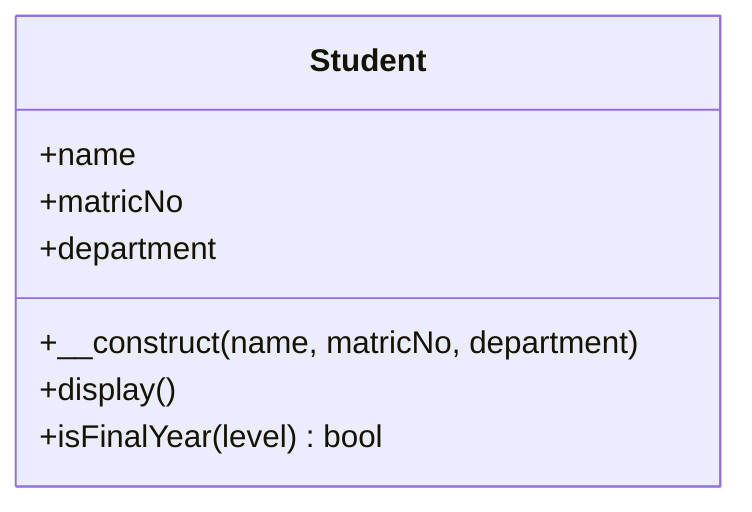

## The Big Idea

**PHP OOP (Object-Oriented Programming) organises code into classes and objects that contain properties (data) and methods (behaviour).**

- **Classes provide structure; objects are individual instances of classes.**
- **OOP supports scalable, reusable and maintainable applications.**

### Procedural vs Object-Oriented Programming

| Procedural programming | Object-oriented programming |
|---|---|
| **A step-by-step approach**; commands run **sequentially** | Creates **classes and objects** and decides **how they interact** |
| Data (variables) and the functions that use them are **separate** | Data and the functions that use it are **bundled together** in objects |
| Everything you've written so far: variables + functions | `$student = new Student(...); $student->display();` |
| Fine for small scripts | Scales better for large applications (Laravel, WordPress plugins) |

<Analogy>
A **class** is like the **architect's plan for a hostel room**: it says every room has a door number, a bed, a reading table, and can be "allocated" or "cleaned". The **objects** are the **actual rooms** built from that plan — Room A101 allocated to Ada, Room B214 allocated to Musa. One plan, many rooms, each with its own values.
</Analogy>

### Advantages of OOP

- **Clear program structure.**
- **DRY — "Don't Repeat Yourself":** common code is **defined once and reused**, instead of copy-pasted.
- **Improved maintainability, modification and debugging** — change the class, every object benefits.
- **Reusable components** reduce code duplication and **development time**.

### Core PHP OOP Concepts (the Roadmap)

| Concept | Meaning | Lesson |
|---|---|---|
| **Classes and objects** | A class is a **template**; an object is an **instance** | This lesson |
| **Encapsulation** | **Controls access** to an object's internal state using **visibility modifiers** (`public`, `protected`, `private`) | Next lesson |
| **Inheritance** | A **child class inherits** public and protected members from a **parent class** | Next lesson |
| **Abstraction** | An abstract class provides a **blueprint** for related classes and can't be instantiated itself | Next lesson |
| **Interfaces** | Define **methods that implementing classes must provide** | Next lesson |

---

## Defining a Class

A class is declared with the **`class` keyword, followed by its name and a pair of curly braces**. Everything the class contains goes inside the braces:

```php
<?php
class Fruit {
    // Properties
    public $name;
    public $color;

    // Method to set the properties
    function set_details($name, $color) {
        $this->name = $name;
        $this->color = $color;
    }

    // Method to display the properties
    function get_details() {
        echo "Name: " . $this->name . ". Color: " . $this->color . ".<br>";
    }
}
```

| Term | Meaning | In the example |
|---|---|---|
| **Property** | A **variable declared within a class** | `$name`, `$color` |
| **Method** | A **function declared within a class** | `set_details()`, `get_details()` |
| **`$this`** | Refers to **the current object** — "*this* particular fruit" | `$this->name` |
| **`->`** | The **object operator**: reach a property or method of an object | `$this->color` |

**Naming conventions:** class names use **PascalCase** (`Fruit`, `StudentRecord`); one class per file (`Fruit.php`) in real projects.

> **Watch the `$`:** you write **`$this->name`**, *not* `$this->$name`. With the extra `$`, PHP uses the **value** of the variable `$name` as the property name — a common, confusing bug.

---

## Creating Objects

**Classes are nothing without objects.** Objects are created with the **`new`** keyword. **Each object shares the class's structure, but has its own property values:**

<PhpPlayground title="Two objects from one class">

```php
<?php
class Fruit {
    public $name;
    public $color;

    function set_details($name, $color) {
        $this->name = $name;
        $this->color = $color;
    }

    function get_details() {
        echo "Name: " . $this->name . ". Color: " . $this->color . ".<br>";
    }
}

// Create an object named $apple from the Fruit class
$apple = new Fruit();
$apple->set_details("Apple", "Red");
$apple->get_details();

// Create an object named $banana from the Fruit class
$banana = new Fruit();
$banana->set_details("Banana", "Yellow");
$banana->get_details();

// Properties can be read (and, because they're public, changed) directly
$banana->color = "Green";
echo "The banana is now " . $banana->color . "<br>";
echo "The apple is still " . $apple->color;
```

</PhpPlayground>

Changing `$banana->color` doesn't affect `$apple` — **each object has its own copy of the properties**.

### instanceof

**The `instanceof` keyword checks whether an object belongs to a specific class.** It returns **`true` or `false`**:

```php
$apple = new Fruit();
var_dump($apple instanceof Fruit);    // bool(true)
```

It's used to check what kind of object you've been given — e.g. `if ($user instanceof Admin) { … }`.

---

## The Constructor: `__construct()`

Calling `set_details()` after every `new` is repetitive — and easy to forget, leaving an object half-built. The **constructor** fixes that.

**`__construct()` is a special method automatically called each time an object is created** with `new`. **Constructor arguments can initialise properties immediately**, which **reduces the need for a separate setter call** after creation. **Remember the two leading underscores: `__construct()`.**

```php
<?php
class Fruit {
    public $name;
    public $color;

    function __construct($name, $color) {
        $this->name = $name;
        $this->color = $color;
    }

    function get_details() {
        echo "Name: " . $this->name . ". Color: " . $this->color . ".<br>";
    }
}

$apple = new Fruit("Apple", "Red");       // values passed straight to __construct()
$apple->get_details();
```

**Step by step:**
1. The `Fruit` class has two properties, `$name` and `$color`.
2. **`new Fruit("Apple", "Red")`** creates an empty object, then **PHP automatically calls `__construct("Apple", "Red")`** on it.
3. The constructor stores the values in `$this->name` and `$this->color`.
4. The finished object is assigned to `$apple`, ready to use.

> **PHP 8 shortcut — constructor property promotion:** `public function __construct(public $name, public $color) {}` declares the properties **and** assigns them in one line. You'll see it in modern frameworks; the long form above is what exams expect.

## The Destructor: `__destruct()`

**`__destruct()` is automatically called when an object is destroyed or when the script finishes execution.** It's the **opposite** lifecycle step to `__construct()`, and also **starts with two underscores**. It's used for clean-up — closing files, releasing connections, writing a log line.

An object is destroyed when **nothing refers to it any more**: at the **end of the script**, or earlier if you `unset()` it or set its variable to `null`:

<PhpPlayground title="Constructor and destructor — the object lifecycle">

```php
<?php
class Fruit {
    public $name;
    public $color;

    function __construct($name, $color) {
        $this->name = $name;
        $this->color = $color;
        echo "✔ Created: $this->name<br>";
    }

    function __destruct() {
        echo "✖ Destroyed: Name: " . $this->name . ". Color: " . $this->color . ".<br>";
    }
}

$apple = new Fruit("Apple", "Red");
$banana = new Fruit("Banana", "Yellow");

echo "--- Working with the fruits ---<br>";
unset($apple);                     // no more references → destroyed right now
echo "--- End of script ---<br>";
// $banana is destroyed automatically when the script finishes
```

</PhpPlayground>

---

## Class Constants

**Class constants store fixed values associated with a class.** They are declared **inside the class with the `const` keyword** and **cannot be changed after declaration**. They are **public by default** and conventionally written in **UPPERCASE**.

They're accessed with the **scope resolution operator `::`** (not `->`, because they belong to the **class**, not to an object):

| Where | Syntax | Example |
|---|---|---|
| **Outside** the class | `ClassName::CONSTANT` | `Goodbye::MESSAGE` |
| **Inside** the class | `self::CONSTANT` | `self::MESSAGE` |

```php
<?php
class Goodbye {
    const MESSAGE = "Thank you for visiting University of Ibadan!";

    public function bye() {
        echo self::MESSAGE;       // inside the class
    }
}

echo Goodbye::MESSAGE;            // outside the class — no object needed

$goodbye = new Goodbye();
$goodbye->bye();
```

---

## Static Methods and Properties

The **`static`** keyword creates members that **belong to the class itself**, not to any object. **They can be accessed without creating an object first.**

| | Static | Regular (instance) |
|---|---|---|
| Belongs to | **The class** — one shared copy | **Each object** — its own copy |
| Access from outside | `ClassName::method()` / `ClassName::$property` | `$object->method()` / `$object->property` |
| Access inside the class | `self::method()` / `self::$property` | `$this->method()` / `$this->property` |
| From a child class | `parent::method()` / `parent::$property` | — |
| Can use `$this`? | **No** (there's no object) | Yes |
| Typical use | Utility functions, counters, settings shared by all objects | Data that differs per object |

```php
class greeting {
    public static function welcome() {
        echo "Hello World!";
    }
}
greeting::welcome();              // no object needed

class calc {
    public static function sum($x, $y) {
        return $x + $y;
    }
}
$res = calc::sum(6, 4);           // 10

class pi {
    public static $value = 3.14159;
}
echo pi::$value;                  // note the $ after ::
```

**A static property is shared by every object** — perfect for counting how many objects have been created:

<PhpPlayground title="Static members — a shared counter">

```php
<?php
class Student {
    public static $count = 0;             // one copy, shared by the class
    public $name;                         // each object has its own

    public function __construct($name) {
        $this->name = $name;
        self::$count++;                   // update the shared counter
    }

    public static function howMany() {
        return "Students created: " . self::$count;
    }
}

class calc {
    public static function sum($x, $y) {
        return $x + $y;
    }
}

new Student("Ada");
new Student("Musa");
$s = new Student("Chioma");

echo Student::howMany() . "<br>";          // static method, no object needed
echo "Last student: " . $s->name . "<br>";
echo "calc::sum(6, 4) = " . calc::sum(6, 4);
```

</PhpPlayground>

<MCQ question="Inside a class, how do you correctly read a regular (non-static) property called $level of the current object?">
<Option>`$level`</Option>
<Option>`self::$level`</Option>
<Option correct>`$this->level`</Option>
<Option>`$this->$level`</Option>
<Explain>
Instance properties are reached through the current object: **`$this->level`** — no `$` before `level`. `self::$level` is for **static** properties; a bare `$level` would be a local variable inside the method; `$this->$level` uses the *value* of `$level` as the property name.
</Explain>
</MCQ>

<MCQ question="What is special about __construct()?">
<Option>It must be called manually after every new.</Option>
<Option correct>It runs automatically when an object is created with new, and can receive the arguments given to new.</Option>
<Option>It runs when the object is destroyed.</Option>
<Option>It makes all properties private.</Option>
<Explain>
The constructor is called **automatically** by `new`, receiving its arguments — e.g. `new Fruit("Apple", "Red")` calls `__construct("Apple", "Red")`. The method that runs on destruction is **`__destruct()`**.
</Explain>
</MCQ>

---

## Classroom Practice: A Student Class

The practical asks you to:
1. **Create a `Student` class with name, matric number and department.**
2. **Add a constructor to initialise all three.**
3. **Create two `Student` objects with different values.**
4. **Add a method to display each student's details.**

(Steps 5–6 — protected properties with a child class, and an interface requiring `display()` — are in the next lesson.)



*A UML class diagram: the class name, its properties, then its methods. `+` means public.*

<PhpPlayground title="Classroom practice — the Student class">

```php
<?php
class Student {
    public $name;
    public $matricNo;
    public $department;

    public function __construct($name, $matricNo, $department) {
        $this->name = $name;
        $this->matricNo = $matricNo;
        $this->department = $department;
    }

    public function display() {
        echo "<div style='border:1px solid #cbd5e1;border-radius:8px;padding:8px;margin:6px 0'>";
        echo "<b>" . htmlspecialchars($this->name) . "</b><br>";
        echo "Matric No: " . htmlspecialchars($this->matricNo) . "<br>";
        echo "Department: " . htmlspecialchars($this->department);
        echo "</div>";
    }

    public function isFinalYear($level) {
        return $level >= 400;
    }
}

$student1 = new Student("Ada Obi", "IFT/2023/001", "Information Technology");
$student2 = new Student("Musa Bello", "CSC/2022/014", "Computer Science");

$student1->display();
$student2->display();

var_dump($student1 instanceof Student);
echo "<br>Is a 400-level student in final year? ";
echo $student2->isFinalYear(400) ? "Yes" : "No";
```

</PhpPlayground>

**Extend it yourself:** add a `$level` property to the constructor; add a `promote()` method that adds 100 to the level; create a third student from an **array** of students with a `foreach`.

### Objects and Arrays Together

Objects fit naturally into arrays — an array of `Student` objects is how database rows are often represented in OOP code:

```php
$students = [
    new Student("Ada Obi", "IFT/2023/001", "IT"),
    new Student("Musa Bello", "CSC/2022/014", "CS"),
];
foreach ($students as $s) {
    $s->display();
}
```

---

## Practice Questions

<Reveal question="Differentiate between procedural and object-oriented programming, and state three advantages of OOP.">
**Procedural** programming follows a **step-by-step, sequential** approach with data and functions kept separate. **OOP** organises code into **classes and objects** that bundle **properties (data)** and **methods (behaviour)** and interact with each other. Advantages: **clear structure**; **DRY** — common code defined once and reused; **easier maintenance, modification and debugging**; **reusable components** that shorten development time.
</Reveal>

<Reveal question="Define class, object, property, method and $this.">
A **class** is a **template** defining the properties and methods of objects. An **object** is an **individual instance** of a class, created with `new`. A **property** is a **variable declared within a class**; a **method** is a **function declared within a class**. **`$this`** refers to the **current object** inside a method.
</Reveal>

<Reveal question="Write a Car class with a constructor that sets brand and year, and a method that returns a description. Create two cars.">
```php
<?php
class Car {
    public $brand;
    public $year;

    public function __construct($brand, $year) {
        $this->brand = $brand;
        $this->year = $year;
    }

    public function describe() {
        return "$this->brand ($this->year)";
    }
}

$car1 = new Car("Toyota Corolla", 2015);
$car2 = new Car("Kia Rio", 2021);
echo $car1->describe() . "<br>" . $car2->describe();
```
</Reveal>

<Reveal question="What is the difference between __construct() and __destruct()?">
**`__construct()`** runs **automatically when an object is created** (`new`) and is used to **initialise** its properties. **`__destruct()`** runs **automatically when an object is destroyed** — when no references remain, e.g. after `unset()` or at the **end of the script** — and is used for **clean-up**. Both start with **two underscores**.
</Reveal>

<Reveal question="How are class constants and static properties accessed, inside and outside a class?">
Both use the scope resolution operator **`::`**. Outside: **`ClassName::CONSTANT`** and **`ClassName::$property`**. Inside the class: **`self::CONSTANT`** and **`self::$property`**; from a child class, **`parent::$property`**. Constants are fixed (`const`); static properties can change but are **shared by the whole class**.
</Reveal>

<Takeaway>
**OOP** organises code into **classes** (templates) and **objects** (instances created with **`new`**) that bundle **properties** (variables in a class) and **methods** (functions in a class). Inside methods, **`$this->property`** means "this object's property"; outside, use **`$object->method()`**. **`instanceof`** tests an object's class. **`__construct()`** runs automatically on `new` to initialise properties; **`__destruct()`** runs when the object is destroyed (no references left / end of script). **Class constants** (`const`, UPPERCASE) and **static** members belong to the **class**: access with **`ClassName::`** outside and **`self::`** inside (`parent::` from a child). Benefits: **structure, DRY, maintainability, reuse**.
</Takeaway>

## Exam Tips

**What lecturers test:**
- Procedural vs OOP; advantages of OOP; the core concepts list
- Definitions: class, object, property, method, `$this`, `instanceof`
- **Writing a class with a constructor** and creating two objects (the Student practice)
- `__construct()` vs `__destruct()`
- Class constants with `::` and `self::`; static methods/properties

**Common mistakes:**
- `function construct()` or `_construct()` — it needs **two** underscores: `__construct`
- `$this->$name` instead of `$this->name`
- Using `->` for constants/static members (they need `::`)
- Forgetting `new` — `$s = Student("Ada");` calls a *function* named Student

**Likely question:**
> "Explain the terms class, object, constructor and destructor. Write a PHP class Student with properties name, matric number and department, a constructor that initialises them, and a method that displays the details. Create two Student objects." (15 marks)
