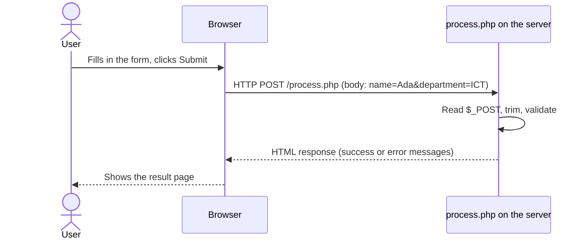

## Why Form Processing Matters

**One of the most important uses of server-side programming is processing forms.** Registration, login, course registration, search, feedback, payment — every one of them is an HTML form whose data is **sent to the server**, where PHP **checks it, uses it and responds**.

In the JavaScript lesson you validated forms **in the browser**. Now the data actually **arrives at the server**:



---

## The Form Side: action, method and name

```html
<form method="post" action="process.php">
    <label for="name">Name:</label>
    <input type="text" id="name" name="name">
    <button type="submit">Submit</button>
</form>
```

| Attribute | Purpose |
|---|---|
| **`action`** | **Which PHP file receives** the data (`process.php`). If left out, the form submits **to the same page**. |
| **`method`** | **How** the data is sent: **`get`** or **`post`** |
| **`name`** (on each field) | **The key PHP uses to find the value** — `name="name"` becomes `$_POST["name"]` |

<ExamTip>
**No `name`, no data.** A field without a `name` attribute is **not sent at all** — `id` is for labels, CSS and JavaScript; **`name` is for the server**. This is the most common reason `$_POST["…"]` comes back empty.
</ExamTip>

---

## GET and POST

<Tabs>
<Tab label="GET">

```html
<form method="get" action="search.php">
```

**The submitted information is included in the URL**, after a `?`:

```text
search.php?query=php
```

Several fields are joined with `&`: `search.php?query=php&level=300`.

**GET is commonly used for:** **searches**, **filtering**, **retrieving information** — anything that **doesn't change data** and that users may want to **bookmark or share**.

</Tab>
<Tab label="POST">

```html
<form method="post" action="process.php">
```

**The form data is sent in the request body** rather than being appended to the URL.

**POST is commonly used for:** **registration**, **login**, **updating information**, **creating records** — anything that **changes data** on the server or includes **passwords**.

</Tab>
</Tabs>

| | GET | POST |
|---|---|---|
| Where the data goes | **In the URL** (query string) | **In the request body** |
| Visible in address bar / history / server logs | **Yes** | No |
| Can be bookmarked or shared | **Yes** | No |
| Size | Limited by URL length (a few thousand characters) | Much larger (files too) |
| Refresh/back button | Re-runs silently | Browser warns "Resubmit form?" |
| Read in PHP with | **`$_GET`** | **`$_POST`** |
| Use for | Searching, filtering, reading | Login, registration, creating/updating data |

> **POST does not make sensitive information automatically secure.** It only keeps data out of the URL — anyone watching the network can still read it. **For sensitive data, HTTPS and proper server-side security are still required.**

---

## Receiving Form Data in PHP

PHP puts submitted values into **superglobal arrays** — `$_POST` for POST forms, `$_GET` for GET forms — indexed by each field's **`name`**:

```php
<?php
$name = $_POST["name"];
echo "Welcome " . $name;
```

### Checking Whether Data Was Submitted

**Instead of immediately accessing a value, it is safer to check whether it exists.** If someone opens `process.php` directly (without submitting the form), `$_POST["name"]` doesn't exist and PHP raises an *Undefined array key* warning.

<Tabs>
<Tab label="isset()">

```php
if (isset($_POST["name"])) {
    $name = $_POST["name"];
    echo "Welcome " . $name;
}
```

**`isset()`** returns `true` if the variable/key **exists and is not `null`**.

</Tab>
<Tab label="?? operator">

```php
$name = $_POST["name"] ?? "";
```

The **null coalescing operator**: use `$_POST["name"]` if it exists, **otherwise `""`**. One line, no warning.

</Tab>
<Tab label="REQUEST_METHOD">

```php
if ($_SERVER["REQUEST_METHOD"] === "POST") {
    // the form was submitted — process it
}
```

Checks **how the page was requested**. Ideal for pages that both **show** the form (GET) and **process** it (POST).

</Tab>
</Tabs>

### Cleaning User Input — and Escaping Output

**User input should not automatically be trusted.**

1. **`trim()`** removes unnecessary whitespace, so `"  Ada "` becomes `"Ada"` and a name made only of spaces becomes `""` (and fails the "required" check):

   ```php
   $name = trim($_POST["name"]);
   ```

2. **`htmlspecialchars()`** **escapes output**. **When displaying user-provided text in HTML, escaping is essential** — it converts special characters into safe HTML entities so **malicious HTML is not interpreted as page content**:

   ```php
   echo htmlspecialchars($name);
   ```

| Character | Becomes |
|---|---|
| `<` | `&lt;` |
| `>` | `&gt;` |
| `&` | `&amp;` |
| `"` | `&quot;` |
| `'` | `&#039;` |

**See why it matters.** Run this, then in the **Name** box type **`<b style="color:red">Hacked</b>`** (or `<script>alert('XSS')</script>`) and submit. The **unsafe** line lets your HTML take over the page; the **safe** line shows it as harmless text. Switch to **HTML sent** to compare exactly what each line produced:

<PhpPlayground title="Why htmlspecialchars() matters (XSS)" height="300">

```php
<?php
$name = trim($_POST["name"] ?? "");
?>
<form method="post">
  <label>Name: <input type="text" name="name" value=""></label>
  <button type="submit">Submit</button>
</form>

<?php if ($name !== ""): ?>
  <p><strong>Unsafe:</strong> Welcome <?php echo $name; ?></p>
  <p><strong>Safe:</strong> Welcome <?php echo htmlspecialchars($name); ?></p>
<?php endif; ?>
```

</PhpPlayground>

This attack is **Cross-Site Scripting (XSS)**: an attacker stores or sends content containing `<script>`, and when other users view the page, the script runs **in their browsers** — it could steal their session and log in as them. **Rule: escape every piece of user-supplied text when you output it into HTML.**

---

## Complete Form Example

The course's complete example has two files: **`index.php`** shows the form and **`process.php`** receives it. **Run it, fill in the form in the result area and click Submit.** Then go back (click *Back to form*) and submit with an empty field, or with just spaces:

<PhpPlayground title="Complete form example — two files" height="260">

```php
<?php // file: index.php ?>
<!DOCTYPE html>
<html>
<head>
    <title>Student Form</title>
</head>
<body>
<h1>Student Information</h1>
<form method="post" action="process.php">
    <label for="name">Name:</label>
    <input type="text" id="name" name="name" required>
    <br><br>
    <label for="department">Department:</label>
    <input type="text" id="department" name="department" required>
    <br><br>
    <button type="submit">Submit</button>
</form>
</body>
</html>
```

```php
<?php // file: process.php
$name = trim($_POST["name"] ?? "");
$department = trim($_POST["department"] ?? "");

if ($name === "" || $department === "") {
    echo "Please complete all fields.";
    echo '<p><a href="index.php">Back to form</a></p>';
    exit;
}

echo "Name: " . htmlspecialchars($name) . "<br>";
echo "Department: " . htmlspecialchars($department);
echo '<p><a href="index.php">Back to form</a></p>';
```

</PhpPlayground>

**Line by line (`process.php`):**
1. **`$_POST["name"] ?? ""`** — read the field, or use an empty string if it's missing.
2. **`trim(…)`** — strip spaces, so "   " counts as empty.
3. **`if ($name === "" || $department === "")`** — **server-side validation**: both are required.
4. **`exit;`** — stop the script right there, so nothing below runs.
5. **`htmlspecialchars(…)`** — escape the values before putting them into the HTML.

> Why validate again when the inputs have `required`? Because **`required` only runs in the browser**. Try it: visit **`process.php`** directly in the address bar (a GET request with no data) — the PHP check still catches it. **Server-side validation is the one that counts.**

---

## Server-Side Validation

Checking "not empty" is only the start. PHP's **`filter_var()`** validates common formats:

| Check | Code |
|---|---|
| Required | `if ($name === "") …` |
| **Valid email** | `filter_var($email, FILTER_VALIDATE_EMAIL)` → the email, or `false` |
| Whole number in a range | `filter_var($level, FILTER_VALIDATE_INT, ["options" => ["min_range" => 100, "max_range" => 500]])` |
| Minimum length | `strlen($password) >= 8` |
| Pattern (e.g. letters and spaces only) | `preg_match("/^[A-Za-z ]+$/", $name)` |
| One of a fixed list | `in_array($department, ["ICT", "Computer Science"], true)` |

### A Sticky, Self-Processing Form

Real forms usually **submit to themselves** (no `action`), then either **show errors next to each field** or **show success**. They're **"sticky"**: after an error, the fields **keep what the user typed**, so they don't have to start again. **Try submitting it empty, then with a bad email, then correctly:**

<PhpPlayground title="Registration form — validation, errors, sticky values" height="420">

```php
<?php
$errors = [];
$name = $email = $department = "";
$level = "";

if ($_SERVER["REQUEST_METHOD"] === "POST") {
    $name = trim($_POST["name"] ?? "");
    $email = trim($_POST["email"] ?? "");
    $department = $_POST["department"] ?? "";
    $level = $_POST["level"] ?? "";

    if ($name === "") {
        $errors["name"] = "Name is required.";
    } elseif (!preg_match("/^[A-Za-z .'-]+$/", $name)) {
        $errors["name"] = "Use letters only.";
    }

    if ($email === "") {
        $errors["email"] = "Email is required.";
    } elseif (!filter_var($email, FILTER_VALIDATE_EMAIL)) {
        $errors["email"] = "Please enter a valid email.";
    }

    if (!in_array($department, ["Computer Science", "ICT", "Software Engineering"], true)) {
        $errors["department"] = "Choose a department.";
    }

    if (!filter_var($level, FILTER_VALIDATE_INT, ["options" => ["min_range" => 100, "max_range" => 500]])) {
        $errors["level"] = "Level must be between 100 and 500.";
    }
}

// Small helper: print a value safely inside HTML
function e($value) { return htmlspecialchars($value); }
?>
<style>
  body { font-family: Arial, sans-serif; }
  label { display: block; margin-top: 10px; font-weight: bold; }
  .err { color: #dc2626; font-size: 13px; }
  .ok { background: #dcfce7; padding: 10px; border-radius: 8px; }
</style>

<?php if ($_SERVER["REQUEST_METHOD"] === "POST" && !$errors): ?>
  <p class="ok">✓ Registered <strong><?= e($name) ?></strong> (<?= e($email) ?>),
     <?= e($department) ?>, <?= e($level) ?> level.</p>
  <p><a href="index.php">Register another student</a></p>
<?php else: ?>
  <h2>Student Registration</h2>
  <form method="post">
    <label>Full name</label>
    <input type="text" name="name" value="<?= e($name) ?>">
    <div class="err"><?= $errors["name"] ?? "" ?></div>

    <label>Email</label>
    <input type="text" name="email" value="<?= e($email) ?>">
    <div class="err"><?= $errors["email"] ?? "" ?></div>

    <label>Department</label>
    <select name="department">
      <option value="">-- choose --</option>
      <?php foreach (["Computer Science", "ICT", "Software Engineering"] as $d): ?>
        <option <?= $d === $department ? "selected" : "" ?>><?= $d ?></option>
      <?php endforeach; ?>
    </select>
    <div class="err"><?= $errors["department"] ?? "" ?></div>

    <label>Level</label>
    <input type="number" name="level" value="<?= e($level) ?>">
    <div class="err"><?= $errors["level"] ?? "" ?></div>

    <p><button type="submit">Register</button></p>
  </form>
<?php endif; ?>
```

</PhpPlayground>

**Techniques to notice:**
- **`$errors` array** — one entry per failed field; `!$errors` (empty array) means everything passed.
- **`value="<?= e($name) ?>"`** — puts the submitted value back into the field (**sticky**), **escaped**.
- **`<?php if (…): ?> … <?php else: ?> … <?php endif; ?>`** — PHP's **alternative syntax** for mixing control structures with HTML; far easier to read than echoing HTML strings.
- The emails check uses **`filter_var`**, and the level uses **`FILTER_VALIDATE_INT`** with a range.

---

## GET in Action: A Search Form

GET suits searching: the query appears in the URL, so results can be bookmarked or shared. **Search for "web" or "data", then look at the address bar:**

<PhpPlayground title="Search with GET" height="260">

```php
<?php
$courses = [
    "IFT 302" => "Web Application Development",
    "INS 204" => "Systems Analysis and Design",
    "INS 202" => "Human-Computer Interaction",
    "CSC 272" => "Database Management Systems",
    "COS 202" => "Computer Programming II",
];
$query = trim($_GET["query"] ?? "");
?>
<form method="get" action="index.php">
  <input type="text" name="query" value="<?= htmlspecialchars($query) ?>" placeholder="Search courses">
  <button type="submit">Search</button>
</form>

<?php
if ($query !== "") {
    echo "<p>Results for <strong>" . htmlspecialchars($query) . "</strong>:</p><ul>";
    $found = 0;
    foreach ($courses as $code => $title) {
        if (stripos($title, $query) !== false || stripos($code, $query) !== false) {
            echo "<li>$code — $title</li>";
            $found++;
        }
    }
    echo "</ul>";
    echo $found === 0 ? "<p>No courses found.</p>" : "<p>$found found.</p>";
}
```

</PhpPlayground>

You can also skip the form and type **`index.php?query=system`** in the address bar — exactly what a shared link does.

---

## Checkboxes, Radio Buttons and Select Lists

- A **radio group** sends **one value** under its `name`: `$_POST["gender"]` → `"female"`.
- A **select** sends the chosen option's `value` (or its text if there's no `value`).
- **Checkboxes** only send a value **if ticked**. To receive **several**, add **`[]`** to the name — PHP then builds an **array**:

```html
<input type="checkbox" name="skills[]" value="HTML"> HTML
<input type="checkbox" name="skills[]" value="PHP"> PHP
```

```php
$skills = $_POST["skills"] ?? [];          // an array, e.g. ["HTML", "PHP"]
echo "You chose: " . htmlspecialchars(implode(", ", $skills));
```

<PhpPlayground title="Checkbox arrays and radio buttons" height="240">

```php
<?php if ($_SERVER["REQUEST_METHOD"] === "POST"):
    $skills = $_POST["skills"] ?? [];
    $mode = $_POST["mode"] ?? "not chosen";
?>
  <p>Skills (<?= count($skills) ?>): <?= htmlspecialchars(implode(", ", $skills)) ?: "none" ?></p>
  <p>Study mode: <?= htmlspecialchars($mode) ?></p>
  <pre><?php print_r($_POST); ?></pre>
  <a href="index.php">Back</a>
<?php else: ?>
  <form method="post">
    <p>Skills:
      <label><input type="checkbox" name="skills[]" value="HTML"> HTML</label>
      <label><input type="checkbox" name="skills[]" value="CSS"> CSS</label>
      <label><input type="checkbox" name="skills[]" value="PHP"> PHP</label>
    </p>
    <p>Mode:
      <label><input type="radio" name="mode" value="Full-time"> Full-time</label>
      <label><input type="radio" name="mode" value="Part-time"> Part-time</label>
    </p>
    <button type="submit">Send</button>
  </form>
<?php endif; ?>
```

</PhpPlayground>

---

## Important PHP Superglobals

**Superglobals are special variables that PHP makes available everywhere** in your scripts — inside functions too.

| Superglobal | Purpose |
|---|---|
| **`$_GET`** | **Data submitted using GET** (the query string) |
| **`$_POST`** | **Data submitted using POST** |
| **`$_SESSION`** | **Session information** (next lessons) |
| **`$_COOKIE`** | **Cookie information** |
| **`$_FILES`** | **Uploaded files** |
| **`$_SERVER`** | **Server and request information** — e.g. `REQUEST_METHOD`, `PHP_SELF`, `HTTP_USER_AGENT`, `REMOTE_ADDR` |
| **`$_REQUEST`** | **Combines** GET, POST (and, depending on settings, cookie) data — avoid it; be explicit about where data comes from |

---

## Exercises

### Exercise 2: Calculator

**Receive two numbers and calculate addition, subtraction, multiplication and division.** Notice the **division-by-zero** check and the `is_numeric` validation:

<PhpPlayground title="Exercise — calculator" height="260">

```php
<?php
$a = $_POST["a"] ?? "";
$b = $_POST["b"] ?? "";
?>
<form method="post">
  <input type="text" name="a" value="<?= htmlspecialchars($a) ?>" size="6"> and
  <input type="text" name="b" value="<?= htmlspecialchars($b) ?>" size="6">
  <button type="submit">Calculate</button>
</form>
<?php
if ($_SERVER["REQUEST_METHOD"] === "POST") {
    if (!is_numeric($a) || !is_numeric($b)) {
        echo "<p>Please enter two numbers.</p>";
    } else {
        echo "<p>$a + $b = " . ($a + $b) . "</p>";
        echo "<p>$a − $b = " . ($a - $b) . "</p>";
        echo "<p>$a × $b = " . ($a * $b) . "</p>";
        echo "<p>$a ÷ $b = " . ($b == 0 ? "undefined (cannot divide by zero)" : round($a / $b, 4)) . "</p>";
    }
}
```

</PhpPlayground>

### Exercise 6: A Simple Login Form

**Use hard-coded credentials first** — `admin` / `12345` — to practise conditions. **Try wrong details, then the right ones:**

<PhpPlayground title="Exercise — login with hard-coded credentials" height="220">

```php
<?php
$message = "";
if ($_SERVER["REQUEST_METHOD"] === "POST") {
    $username = trim($_POST["username"] ?? "");
    $password = $_POST["password"] ?? "";

    if ($username === "admin" && $password === "12345") {
        $message = "<p style='color:green'>Login successful. Welcome, admin!</p>";
    } else {
        $message = "<p style='color:red'>Invalid username or password.</p>";
    }
}
?>
<h3>Login</h3>
<form method="post">
  <p><input type="text" name="username" placeholder="Username"></p>
  <p><input type="password" name="password" placeholder="Password"></p>
  <button type="submit">Log in</button>
</form>
<?= $message ?>
```

</PhpPlayground>

> **This is only for learning conditional statements. Never use hard-coded passwords in a real application.** Real systems store **password hashes** in a database and remember the logged-in user with a **session** — covered in the Sessions and Authentication lesson.

---

## Practice Questions

<Reveal question="Explain the difference between GET and POST, giving two uses of each.">
With **GET**, form data is **appended to the URL** as a query string (e.g. `search.php?query=php`) — visible, bookmarkable, limited in length; used for **searching, filtering and retrieving information**. With **POST**, data is **sent in the request body** — not shown in the URL, suitable for larger data; used for **registration, login, updating information and creating records**. POST alone is not secure — HTTPS is still needed for sensitive data.
</Reveal>

<Reveal question="Why is the name attribute important in form processing?">
PHP identifies each submitted value **by the field's `name`**: `<input name="email">` arrives as `$_POST["email"]` (or `$_GET["email"]`). A field **without a name is not sent** to the server at all.
</Reveal>

<Reveal question="What is the purpose of isset() and trim() when processing forms?">
**`isset()`** checks that a value **exists (and isn't null)** before using it, avoiding *undefined* warnings when the page is opened without submitting the form. **`trim()`** **removes leading and trailing whitespace**, so accidental spaces are removed and a field containing only spaces is treated as empty.
</Reveal>

<Reveal question="What is XSS and how does htmlspecialchars() help prevent it?">
**Cross-Site Scripting** occurs when **malicious scripts are injected into web pages and executed in other users' browsers** — e.g. a "name" containing `<script>…</script>` that is echoed back unescaped. **`htmlspecialchars()`** converts `<`, `>`, `&`, `"` and `'` into HTML entities (`&lt;` etc.), so the browser **displays** the text instead of **interpreting** it as HTML/JavaScript.
</Reveal>

<Reveal question="Write PHP that validates a submitted email address and prints an appropriate message.">
```php
<?php
$email = trim($_POST["email"] ?? "");
if ($email === "") {
    echo "Email is required.";
} elseif (!filter_var($email, FILTER_VALIDATE_EMAIL)) {
    echo "Please enter a valid email.";
} else {
    echo "Thank you, " . htmlspecialchars($email);
}
```
</Reveal>

<Reveal question="Why must forms be validated on the server even when HTML5 and JavaScript validation are used?">
Browser validation can be **bypassed** — by disabling JavaScript, editing the form in DevTools, or sending an HTTP request directly (e.g. opening `process.php?name=`). Only code running **on the server** is under the developer's control, so **server-side validation is the real protection**; client-side validation just gives users faster feedback.
</Reveal>

<Takeaway>
A form's **`action`** names the PHP file, **`method`** chooses **GET** (data **in the URL** — search, filter, read) or **POST** (data **in the request body** — login, registration, create/update; still needs **HTTPS**), and each field's **`name`** becomes the key in **`$_GET`/`$_POST`**. Check before reading: **`isset()`**, **`??`**, or **`$_SERVER["REQUEST_METHOD"] === "POST"`**. **Clean** input with **`trim()`**, **validate on the server** (`filter_var` for emails and integers, `strlen`, `preg_match`, `in_array`), and **escape output** with **`htmlspecialchars()`** to prevent **XSS**. Good forms are **self-processing** and **sticky** (show errors, keep values). Checkboxes named `skills[]` arrive as **arrays**. Superglobals: `$_GET`, `$_POST`, `$_SESSION`, `$_COOKIE`, `$_FILES`, `$_SERVER`, `$_REQUEST`.
</Takeaway>

## Exam Tips

**What lecturers test:**
- **GET vs POST** — definitions, differences, uses
- Receiving data with `$_POST`/`$_GET` and the role of the **`name`** attribute
- `isset()`, `trim()`, `htmlspecialchars()` — what each does and why
- Writing a **complete form + processing script** (the course's `index.php` + `process.php`)
- Validating an email with `filter_var()`; the superglobals table
- XSS and why input must never be trusted

**Common mistakes:**
- Missing `name` on inputs; mismatched names (`name="Email"` vs `$_POST["email"]`)
- Echoing user input without `htmlspecialchars()`
- Relying only on HTML `required` or JavaScript for validation

**Likely question:**
> "Write an HTML form that collects a student's name, email, department and level, and a PHP script that validates the data on the server (all fields required, valid email) and displays it safely. Explain the difference between GET and POST." (20 marks)
