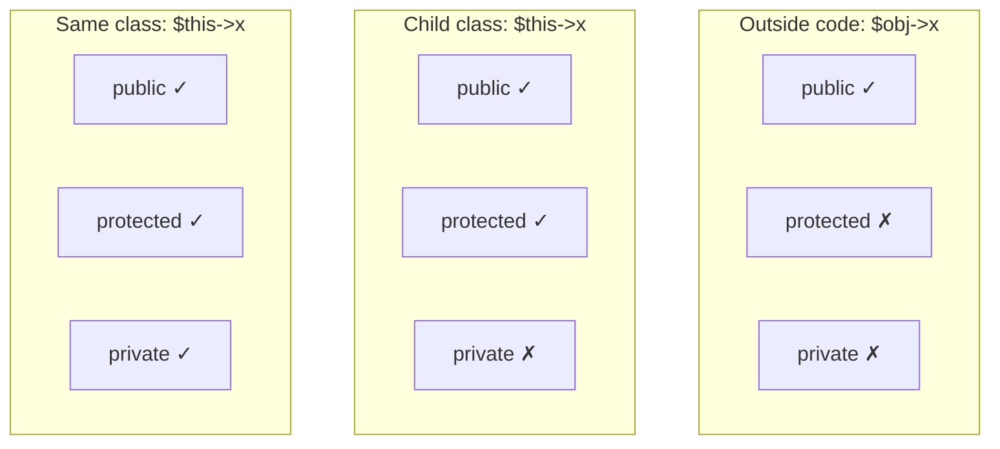
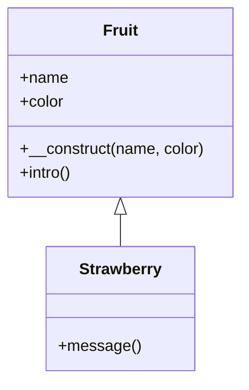
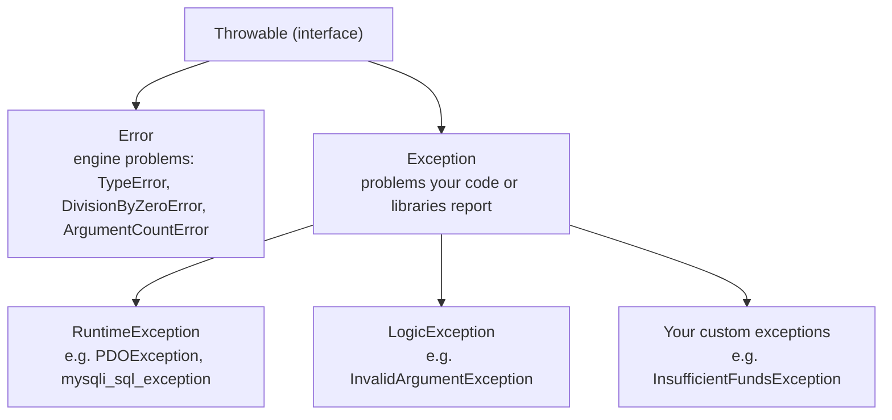

## Encapsulation and Access Modifiers

**Encapsulation** means **bundling an object's data with the methods that use it, and controlling access to its internal state**. You decide what the outside world may touch directly, and what it may only change **through methods that check the rules**.

In PHP, **access modifiers** (visibility keywords) **control where properties and methods can be accessed**:

| Modifier | Accessible from… | Notes |
|---|---|---|
| **`public`** | **Everywhere** — inside the class, child classes, and outside code | **The default** if no modifier is given |
| **`protected`** | **Inside the class and classes derived from it** (child classes) | Not from outside code |
| **`private`** | **Only inside the class where it is defined** | Not even child classes |



### Public, Private and Protected in Action

**Run it, read the error, then fix it** by commenting out the offending line:

<PhpPlayground title="Access modifiers — see the error">

```php
<?php
class Fruit {
    public $name;
    protected $color;
    private $weight;

    public function __construct($name, $color, $weight) {
        $this->name = $name;
        $this->color = $color;       // fine: inside the class
        $this->weight = $weight;     // fine: inside the class
    }

    public function get_details() {
        return "Name: $this->name. Color: $this->color. Weight: {$this->weight}g.";
    }
}

$apple = new Fruit("Apple", "Red", 150);
echo $apple->get_details() . "<br>";   // OK: public method
echo $apple->name . "<br>";            // OK: public property
echo $apple->color . "<br>";           // Error: Cannot access protected property
```

</PhpPlayground>

Change the last line to `echo $apple->weight;` — *Cannot access private property*. The object's `color` and `weight` can only be reached **through its public methods**.

### Why Encapsulate? Getters, Setters and Rules

Public properties can be set to **anything** — a negative balance, a level of 999. Making them **private** and offering **methods** lets the class **enforce its rules**:

<PhpPlayground title="A bank account that protects its balance">

```php
<?php
class BankAccount {
    private $balance = 0;
    private $owner;

    public function __construct($owner) {
        $this->owner = $owner;
    }

    public function deposit($amount) {
        if ($amount <= 0) {
            echo "Deposit must be positive.<br>";
            return;
        }
        $this->balance += $amount;
    }

    public function withdraw($amount) {
        if ($amount > $this->balance) {
            echo "Insufficient funds: cannot withdraw ₦" . number_format($amount) . ".<br>";
            return;
        }
        $this->balance -= $amount;
    }

    // A "getter": read-only access to the private balance
    public function getBalance() {
        return $this->balance;
    }
}

$acct = new BankAccount("Ada");
$acct->deposit(50000);
$acct->withdraw(20000);
$acct->withdraw(100000);          // refused by the class's rule
$acct->deposit(-500);             // refused
echo "Balance: ₦" . number_format($acct->getBalance());
// $acct->balance = 1000000;      // try it: private — not allowed!
```

</PhpPlayground>

**Encapsulation benefits:** the object **can't be put into an invalid state**, the **internal details can change** without breaking code that uses the class, and bugs are **easier to trace** (only the class's own methods touch its data).

---

## Inheritance

**Inheritance allows a child class to inherit the public and protected properties and methods of a parent class.** The child **can also add its own properties and methods**. It's created with the **`extends`** keyword.

- **Private members of the parent are not directly accessible** to the child.
- PHP supports **single inheritance**: a class extends **one** parent (traits and interfaces fill the gap — see below).

<PhpPlayground title="Inheritance with extends">

```php
<?php
// Parent class
class Fruit {
    public $name;
    public $color;

    public function __construct($name, $color) {
        $this->name = $name;
        $this->color = $color;
    }

    public function intro() {
        echo "The fruit is $this->name and the color is $this->color.<br>";
    }
}

// Strawberry is inherited from Fruit
class Strawberry extends Fruit {
    public function message() {
        echo "Am I a fruit or a berry?<br>";
    }
}

$strawberry = new Strawberry("Strawberry", "red");   // uses Fruit's constructor
$strawberry->intro();       // inherited from Fruit
$strawberry->message();     // Strawberry's own method

var_dump($strawberry instanceof Strawberry);   // true
var_dump($strawberry instanceof Fruit);        // also true: a Strawberry IS A Fruit
```

</PhpPlayground>

> **The "is-a" test:** use inheritance when the child **is a** kind of the parent — a Strawberry *is a* Fruit, an `Admin` *is a* `User`, a `Lecturer` *is a* `StaffMember`. If it's "has a" (a Student *has a* Course), use a property instead.



### Protected Members in Inheritance

**A protected member cannot be called from outside the class, but a child class can use it.** A **public child method can expose controlled behaviour** without exposing the protected member directly:

```php
class Fruit {
    public $name;
    public $color;
    public function __construct($name, $color) {
        $this->name = $name;
        $this->color = $color;
    }
    protected function intro() {
        echo "The fruit is $this->name and the color is $this->color.";
    }
}

class Strawberry extends Fruit {
    public function message() {
        echo "Am I a fruit or a berry? ";
        $this->intro();          // OK: calling a protected method from within the child
    }
}

$strawberry = new Strawberry("Strawberry", "red");
$strawberry->message();          // OK: message() is public
// $strawberry->intro();         // ERROR: intro() is protected
```

### Method Overriding

**A child class can redefine an inherited method using the same name.** **The child's version replaces the inherited behaviour** for that class. **Constructors can be overridden too.**

To **extend** rather than completely replace the parent's version, call it with **`parent::`**:

<PhpPlayground title="Overriding, and extending with parent::">

```php
<?php
class Fruit {
    public $name;
    public $color;

    public function __construct($name, $color) {
        $this->name = $name;
        $this->color = $color;
    }

    public function intro() {
        return "The fruit is $this->name and the color is $this->color.";
    }
}

class Strawberry extends Fruit {
    public $weight;

    // Overridden constructor: reuse the parent's, then add the new property
    public function __construct($name, $color, $weight) {
        parent::__construct($name, $color);
        $this->weight = $weight;
    }

    // Overridden method
    public function intro() {
        return "A $this->name is $this->color, and the weight is $this->weight gram.";
    }
}

class Mango extends Fruit {
    public function intro() {
        return parent::intro() . " It is juicy!";   // extends the parent's version
    }
}

$fruits = [new Fruit("Apple", "red"), new Strawberry("Strawberry", "red", 50), new Mango("Mango", "yellow")];
foreach ($fruits as $f) {
    echo $f->intro() . "<br>";      // each object uses its own class's version
}
```

</PhpPlayground>

The loop calls `intro()` on three different kinds of fruit and each responds **in its own way** — this is **polymorphism** ("many forms").

### The final Keyword

**`final` prevents change through inheritance:**

```php
final class Fruit {
    // cannot be extended — "class Strawberry extends Fruit" is an error
}

class Fruit {
    final public function intro() {
        // cannot be overridden in a child class
    }
}
```

**Use `final` when a design element must not be changed through inheritance** — e.g. a security check or a calculation that every subclass must use exactly as written.

---

## Abstract Classes

**An abstract class cannot be instantiated directly.** It contains **at least one abstract method** — a method **declared but not implemented**. **Child classes must implement** the abstract method(s). Its purpose is to **force every child to provide certain behaviour** while sharing the common parts.

<PhpPlayground title="Abstract class — Car, Audi and Citroen">

```php
<?php
abstract class Car {
    public $name;

    // Non-abstract method: shared by all children
    public function __construct($name) {
        $this->name = $name;
    }

    // Abstract method: every child MUST implement it
    abstract public function intro();
}

class Audi extends Car {
    public function intro() {
        return "German quality! I'm an $this->name!";
    }
}

class Citroen extends Car {
    public function intro() {
        return "French extravagance! I'm a $this->name!";
    }
}

$audi = new Audi("Audi");
echo $audi->intro() . "<br>";
$citroen = new Citroen("Citroen");
echo $citroen->intro() . "<br>";

// $car = new Car("Generic");   // try it: Cannot instantiate abstract class Car
```

</PhpPlayground>

### Abstract Method Rules

When a child implements an abstract method:
1. It must use **the same method name**.
2. It must have **the same or a less restrictive access modifier** — an abstract `protected` method may become `protected` or `public` in the child, **not `private`**.
3. The **number of required arguments must be the same**.
4. The child **may add optional arguments** (with default values).

```php
abstract class ParentClass {
    abstract protected function prefixName($name);
}

class ChildClass extends ParentClass {
    // public is less restrictive than protected ✓; extra optional arguments ✓
    public function prefixName($name, $separator = ".", $greet = "Dear") {
        $prefix = $name == "John Doe" ? "Mr" : ($name == "Jane Doe" ? "Mrs" : "");
        return "$greet $prefix$separator $name";
    }
}
```

---

## Interfaces

**An interface defines which public methods a class must implement, without defining how.** It's a **contract**.

- Declared with the **`interface`** keyword; its methods are **public** and have **no body**.
- A class uses **`implements`**, and **must implement all** of the interface's methods.
- A class can implement **several interfaces** (`class A implements X, Y`) — even though it can extend only one class.

<PhpPlayground title="Interfaces — one contract, many implementations">

```php
<?php
interface Animal {
    public function makeSound();
}

class Cat implements Animal {
    public function makeSound() {
        echo "Meow<br>";
    }
}

class Dog implements Animal {
    public function makeSound() {
        echo "Woff<br>";
    }
}

class Goat implements Animal {
    public function makeSound() {
        echo "Meeeh<br>";
    }
}

// This function accepts ANY object that implements Animal
function speak(Animal $animal) {
    $animal->makeSound();
}

foreach ([new Cat(), new Dog(), new Goat()] as $a) {
    speak($a);
}
```

</PhpPlayground>

`speak(Animal $animal)` works with **any** class that signs the `Animal` contract — code written against **interfaces** is easy to extend with new classes later.

### Abstract Class vs Interface

| | Abstract class | Interface |
|---|---|---|
| Keyword | `abstract class` … `extends` | `interface` … `implements` |
| Can contain **properties** and **implemented methods**? | **Yes** | **No** — only method signatures (and constants) |
| Visibility of methods | public, protected | **public only** |
| How many can a class use? | **One** (single inheritance) | **Many** |
| Use it when… | Related classes **share code** plus some required methods ("is a") | Unrelated classes must offer the **same capability** ("can do") |

---

## Traits

**Traits declare methods that can be reused in multiple classes** — a mechanism for **code reuse** without inheritance. A trait **can contain methods and abstract methods**, with **any access modifier**. A class includes a trait with the **`use`** keyword; **several traits are separated by commas**.

<PhpPlayground title="Traits — reusable methods">

```php
<?php
trait message1 {
    public function msg1() {
        echo "PHP OOP is fun! ";
    }
}

trait message2 {
    public function msg2() {
        echo "Traits reduce code duplication!";
    }
}

class Welcome {
    use message1;
}

class Welcome2 {
    use message1, message2;
}

$obj = new Welcome();
$obj->msg1();
echo "<br>";

$obj2 = new Welcome2();
$obj2->msg1();
$obj2->msg2();
```

</PhpPlayground>

**When to use a trait:** several **unrelated** classes need the **same helper methods** (e.g. `Timestampable`, `Loggable`), and making them share a parent class would make no sense.

---

## Namespaces

**Namespaces prevent naming conflicts between classes, interfaces, functions and constants**, and **group related code under a name**.

**Why use them?**
- **Avoid name conflicts** in larger projects
- **Organise code** into logical groups
- **Separate your code from libraries' code**
- **Allow the same name for more than one class** — e.g. an HTML `Table` class and a furniture `Table` class

**Rules and syntax:**
- **The `namespace` declaration must be the very first statement in the PHP file.**
- Everything declared in the file then **belongs to that namespace**.
- Outside it, **qualify** the class with its namespace: `new Html\Table()`.
- **`use` imports** a namespace or class and can give it an **alias**.

```php
<?php
namespace Html;

class Table {
    public $title = "";
    public $rows = 0;

    public function info() {
        echo "<p>$this->title has $this->rows rows.</p>";
    }
}
```

```php
<?php
require "Html/Table.php";

$table = new Html\Table();        // fully qualified
$table->title = "My table";
$table->rows = 5;
$table->info();

use Html as H;                    // alias for the namespace
$t2 = new H\Table();

use Html\Table as T;              // alias for the class
$t3 = new T();
```

Frameworks such as Laravel use namespaces everywhere (`App\Models\Student`), and **Composer** loads namespaced classes automatically.

---

## OOP Concept Map

| Concept | In one line |
|---|---|
| **Class** | Defines **properties and methods** |
| **Object** | An **instance** created with `new` |
| **Encapsulation** | **Visibility control** — public / protected / private |
| **Inheritance** | A child **`extends`** a parent class |
| **Abstraction** | **Abstract** classes and methods — a blueprint |
| **Interface** | A **required public method contract** |
| **Trait** | **Reusable methods** across classes |
| **Static** | **Class-level** members |
| **Namespace** | An **organised naming scope** |

---

## Error Handling

**Errors happen** — a missing file, a failed database connection, bad input. Good applications **detect them, handle them gracefully, and never show internal details to users**.

### Types of PHP Errors

| Type | Example cause | Script continues? |
|---|---|---|
| **Parse error** (syntax) | Missing `;` or `}` | **No** — the file never runs |
| **Fatal error** | Calling an undefined function; `require` of a missing file; uncaught exception | **No** |
| **Warning** | `include` of a missing file; undefined variable or array key (PHP 8) | Yes |
| **Notice / Deprecated** | Code that works but is discouraged | Yes |

### Development vs Production Settings

**During development**, show every error so you can fix it:

```php
error_reporting(E_ALL);
ini_set('display_errors', '1');
```

**In production**, detailed errors **should not be displayed to end users**, because they may **reveal sensitive information** (file paths, SQL, passwords in connection strings). Instead, **log** them and show a friendly message:

```php
ini_set('display_errors', '0');
ini_set('log_errors', '1');                 // written to the server's error log
error_log("Payment failed for order 1042"); // add your own log lines
```

### Exceptions: try, catch, finally, throw

An **exception** is an object that represents an error. Code that might fail goes in a **`try`** block; if an exception is **thrown**, PHP jumps to the matching **`catch`** block; **`finally`** runs **either way**.

```php
try {
    // code that might fail
} catch (SomeException $e) {
    // handle it: $e->getMessage(), $e->getCode(), $e->getLine()
} finally {
    // always runs (e.g. close a file)
}
```

- **`throw new Exception("message");`** raises your own exception.
- Useful methods: **`getMessage()`**, **`getCode()`**, **`getFile()`**, **`getLine()`**.
- **Uncaught** exceptions become a **fatal error**.

<PhpPlayground title="try, catch, finally and a custom exception" height="280">

```php
<?php
// A custom exception: a class that extends Exception
class InsufficientFundsException extends Exception {}

class BankAccount {
    private $balance = 0;

    public function deposit($amount) {
        if ($amount <= 0) {
            throw new InvalidArgumentException("Deposit must be positive.");
        }
        $this->balance += $amount;
    }

    public function withdraw($amount) {
        if ($amount > $this->balance) {
            throw new InsufficientFundsException("Cannot withdraw ₦" . number_format($amount)
                . "; balance is ₦" . number_format($this->balance) . ".");
        }
        $this->balance -= $amount;
    }
}

$acct = new BankAccount();
$tests = [["deposit", 5000], ["withdraw", 2000], ["withdraw", 9000], ["deposit", -1]];

foreach ($tests as [$action, $amount]) {
    try {
        $acct->$action($amount);
        echo "✓ $action $amount succeeded<br>";
    } catch (InsufficientFundsException $e) {
        echo "✗ Declined: " . $e->getMessage() . "<br>";
    } catch (InvalidArgumentException $e) {
        echo "✗ Invalid input: " . $e->getMessage() . "<br>";
    } finally {
        echo "&nbsp;&nbsp;(transaction logged)<br>";
    }
}

// Built-in errors are thrown too:
try {
    echo intdiv(10, 0);
} catch (DivisionByZeroError $e) {
    echo "Caught " . get_class($e) . ": " . $e->getMessage();
}
```

</PhpPlayground>

**Order matters:** PHP uses the **first** `catch` whose class matches, so put **specific** exceptions before general ones (`catch (Exception $e)` last).

### The Exception Hierarchy



`catch (Exception $e)` catches exceptions but **not** `Error`s; `catch (Throwable $t)` catches both.

### A Real Use: Database Connections

With `PDO::ERRMODE_EXCEPTION`, a failed connection or query throws a **`PDOException`**. Catch it, **log the details privately**, and show the user something safe:

```php
try {
    $pdo = new PDO("mysql:host=localhost;dbname=school", "root", "");
    $pdo->setAttribute(PDO::ATTR_ERRMODE, PDO::ERRMODE_EXCEPTION);
} catch (PDOException $e) {
    error_log($e->getMessage());               // details for the developer
    die("Sorry, the service is unavailable."); // nothing sensitive for the user
}
```

---

## Classroom Practice (Parts 5 and 6)

Continuing the Student class from the last lesson: **change one property to `protected` and demonstrate controlled access through a child class**, and **create an interface that requires a `display()` method**:

<PhpPlayground title="Classroom practice — protected + child class + interface" height="260">

```php
<?php
interface Displayable {
    public function display();
}

class Student implements Displayable {
    public $name;
    protected $matricNo;          // hidden from outside code
    public $department;

    public function __construct($name, $matricNo, $department) {
        $this->name = $name;
        $this->matricNo = $matricNo;
        $this->department = $department;
    }

    public function display() {
        echo "<p><b>$this->name</b> — $this->department</p>";
    }
}

class PostgraduateStudent extends Student {
    private $supervisor;

    public function __construct($name, $matricNo, $department, $supervisor) {
        parent::__construct($name, $matricNo, $department);
        $this->supervisor = $supervisor;
    }

    // Controlled access: the child may read the protected matric number
    public function display() {
        echo "<p><b>$this->name</b> ($this->matricNo) — PG, $this->department. Supervisor: $this->supervisor</p>";
    }
}

$people = [
    new Student("Ada Obi", "IFT/2023/001", "Information Technology"),
    new PostgraduateStudent("Musa Bello", "PG/2024/017", "Computer Science", "Prof. Adeyemi"),
];

foreach ($people as $p) {
    if ($p instanceof Displayable) {
        $p->display();
    }
}
// echo $people[0]->matricNo;   // try it: Cannot access protected property
```

</PhpPlayground>

---

## Practice Questions

<Reveal question="Explain the three access modifiers in PHP with an example of each.">
**`public`** — accessible **everywhere** (default): `public $name;` can be read with `$obj->name`. **`protected`** — accessible **inside the class and its child classes** only: `protected $color;` can be used as `$this->color` in a child, but `$obj->color` from outside is an error. **`private`** — accessible **only inside the defining class**: `private $balance;` can't be read even by a child class.
</Reveal>

<Reveal question="What is inheritance? Write a Lecturer class that extends a Staff class and overrides a describe() method.">
Inheritance lets a **child class inherit the public and protected members of a parent class** (with `extends`) and add or override its own.
```php
<?php
class Staff {
    public $name;
    public function __construct($name) { $this->name = $name; }
    public function describe() { return "$this->name works at UI."; }
}
class Lecturer extends Staff {
    public function describe() {
        return parent::describe() . " $this->name teaches courses.";
    }
}
echo (new Lecturer("Dr. Eze"))->describe();
```
</Reveal>

<Reveal question="Differentiate between an abstract class and an interface.">
An **abstract class** (`abstract class`, used with `extends`) **can contain properties and implemented methods** as well as abstract ones; methods may be public or protected; a class can extend **only one**. An **interface** (`interface`, used with `implements`) contains **only public method signatures** (and constants) — no implementation; a class can implement **many**. Use abstract classes for **related classes sharing code**; interfaces for a **common capability** across unrelated classes.
</Reveal>

<Reveal question="What does the final keyword do?">
On a **class**, `final` **prevents it from being extended**. On a **method**, it **prevents the method from being overridden** in child classes.
</Reveal>

<Reveal question="What is a trait and when would you use one?">
A **trait** is a group of **methods (and abstract methods) that can be reused in several classes** with the `use` keyword; a class can use **multiple traits**. Use one when **unrelated classes need the same methods**, since PHP has single inheritance and a shared parent class wouldn't make sense.
</Reveal>

<Reveal question="Explain try, catch, finally and throw, and why detailed errors should not be displayed in production.">
Code that might fail goes in **`try`**; **`throw`** raises an exception; a matching **`catch`** block handles it (using `getMessage()` etc.); **`finally`** runs **whether or not** an exception occurred. In production, detailed error messages can **reveal sensitive information** — file paths, SQL, database names or credentials — which helps attackers, so errors should be **logged** privately and users shown a **friendly generic message**.
</Reveal>

<Takeaway>
**Encapsulation** controls access: **`public`** (everywhere, default), **`protected`** (class + children), **`private`** (class only); expose private data through **methods that enforce rules** (getters/setters). **Inheritance** (`extends`) passes **public and protected** members to a child, which can **add** members, **override** methods (same name) and reuse the parent's with **`parent::`**; one object behaving per its class is **polymorphism**; **`final`** blocks extending/overriding. **Abstract classes** can't be instantiated and force children to implement **abstract methods** (same name, same or less restrictive visibility, same required arguments). **Interfaces** are public-method **contracts** (`implements`, many allowed). **Traits** reuse methods (`use`). **Namespaces** prevent name clashes (declared **first** in the file; `use … as` for aliases). **Errors:** show them in development (`E_ALL`, `display_errors`), **log and hide** them in production; handle problems with **`try` / `catch` / `finally`**, **`throw`**, and custom exception classes.
</Takeaway>

## Exam Tips

**What lecturers test:**
- The three access modifiers and encapsulation
- Inheritance with `extends`; protected members in inheritance; overriding; `final`
- Abstract classes (definition, rules) and **interfaces** — and their differences
- Traits, static members and namespaces (definitions and syntax)
- Error handling: `error_reporting`/`display_errors`, why not to show errors in production, **try/catch/finally**, `throw`

**Common mistakes:**
- Thinking `private` members are inherited and usable in the child — they're not
- Trying `new` on an abstract class or interface
- Declaring an interface method with a body, or as `protected`
- Putting code before a `namespace` declaration

**Likely question:**
> "Explain encapsulation and inheritance in PHP. Write an abstract class Shape with an abstract method area(), and two classes Rectangle and Circle that extend it. Show how exceptions can be used to reject a negative dimension." (20 marks)
