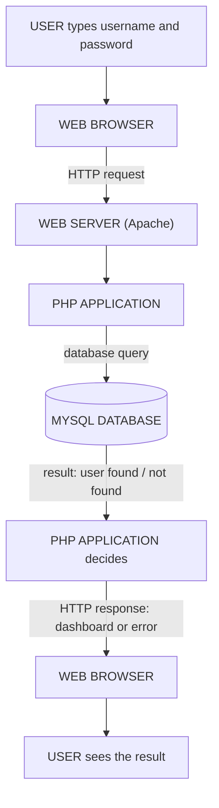

## Why Server-Side Programming?

In the client-side lessons, HTML, CSS and JavaScript built pages that run **in the user's browser**. But many websites must do much more than display information. Think about the **university student portal**. A student should be able to:

1. **Create an account.**
2. **Log in.**
3. **View personal information.**
4. **Register courses.**
5. **Check results.**
6. **Update their profile.**

**Where is all this information stored?** On a **server**, usually in a **database**. A programming language **running on the server** is needed to **process requests, communicate with the database and generate responses**. This is **server-side programming**.

### What Is Server-Side Programming?

**Server-side programming** is **programming that is executed on a web server rather than directly in the user's browser**. A server-side program can:

- **Receive requests** from users
- **Process information**
- **Apply business rules** (e.g. *a student may register at most 24 units*)
- **Communicate with databases**
- **Authenticate users**
- **Create dynamic web pages**
- **Send responses** back to the browser

**Common server-side technologies:** **PHP**, **Python**, **Java**, **C#**, **Ruby**, and **JavaScript with Node.js**. This course focuses on **PHP**.

### Client Side vs Server Side: A Login Form

Suppose a student enters **Username: `student01`** and **Password: `mypassword`**. The browser can't check these itself — the list of real users is on the server. So:



| Client side | Server side |
|---|---|
| Runs **mainly in the browser** | Runs **on the server** |
| **HTML, CSS, JavaScript** | **PHP, Python, Java, Node.js** |
| The user **can see and change** the code | The user **only sees the output** |

---

## What Is PHP?

**PHP** is a **server-side scripting language** commonly used for developing **dynamic websites and web applications**.

PHP originally stood for **Personal Home Page** (Rasmus Lerdorf, 1994–95). Today the name is a **recursive acronym**: **PHP: Hypertext Preprocessor** — "preprocessor" because it processes the page **before** it is sent to the browser.

**PHP code is executed on the server, and only the result is sent to the browser:**

```php
<?php
echo "Hello, Students!";
?>
```

The browser does **not** receive the PHP code. It receives only:

```text
Hello, Students!
```

**This is an important difference between PHP and JavaScript.** JavaScript is sent to the browser and runs there (anyone can read it with View Source); PHP runs on the server and stays private.

### Why Use PHP?

PHP is widely used because it:
- Is **relatively easy to learn**
- Is **open source** (free)
- **Works on all major operating systems**
- **Integrates well with HTML** — you can mix the two in one file
- **Supports databases** such as **MySQL**
- Has **extensive documentation and community support**
- Can build **both small and large** web applications (WordPress, which runs a large share of all websites, is written in PHP)

**Things built with PHP:** login systems, registration systems, content management systems, e-commerce websites, **student portals**, blogs, **online examination systems**, inventory systems.

---

## Setting Up and Creating a PHP Project

To practise PHP you need a **code editor**, a **web browser**, a **web server**, **PHP** — and later a **database**. **XAMPP** provides **Apache, PHP, MySQL/MariaDB and phpMyAdmin** in one install (see the *Setting Up the Environment* lesson).

<Step step="1" title="Create a project folder in the web root">
```text
htdocs/
    myphp/
        index.php
```
</Step>

<Step step="2" title="Start Apache">
Open the **XAMPP Control Panel** and **Start Apache**.
</Step>

<Step step="3" title="Visit the project through the server">
Open **`http://localhost/myphp/`**. The browser requests the page from **your local Apache server**; **Apache finds the PHP file and PHP processes it** before the result is returned to the browser.
</Step>

> **The playgrounds in this lesson run real PHP 8.3 inside your browser**, acting as a mini web server, so you can practise even without XAMPP. The first time you press **Run**, the PHP engine (about 3.5 MB) downloads once. Use **"HTML sent"** to see exactly what the server sends back — the equivalent of *View Page Source*.

---

## Your First PHP Program

<PhpPlayground title="Hello, World!">

```php
<?php
echo "Hello, World!";
```

</PhpPlayground>

Press **Run**, then click **HTML sent**. You'll see just `Hello, World!` — no `<?php`, no `echo`.

### Understanding PHP Syntax

| Rule | Example |
|---|---|
| PHP code **begins with** `<?php` | `<?php` |
| … and **can end with** `?>` | `?>` |
| In a **PHP-only file**, the closing tag is **often omitted** (it prevents stray spaces or blank lines after `?>` being sent to the browser) | a file that ends with PHP code |
| Each **statement ends with a semicolon** | `echo "Hello World";` |
| **`echo`** outputs text (you can also use `print`) | `echo "Hi", " there";` |

### Practice 1: First PHP Program

Display three lines: *Welcome to PHP Programming*, *My name is [your name]*, *I am learning server-side programming*. **Change the name to yours and Run:**

<PhpPlayground title="Practice 1">

```php
<?php
echo "Welcome to PHP Programming<br>";
echo "My name is Beverly<br>";
echo "I am learning server-side programming.";
```

</PhpPlayground>

**The `<br>` is HTML** — PHP just sends it as text, and the **browser** turns it into a line break. Remove the `<br>`s and run again: everything appears on one line, because browsers ignore plain line breaks in HTML.

---

## Embedding PHP in HTML

**One of PHP's most useful features is that it can be embedded into HTML.** A `.php` file can be mostly HTML with PHP "islands" where dynamic content is needed:

<PhpPlayground title="PHP inside an HTML page">

```php
<!DOCTYPE html>
<html>
<head>
    <title>My PHP Page</title>
</head>
<body>
    <h1>Student Portal</h1>
    <?php
    echo "<p>Welcome to the student portal.</p>";
    ?>
    <p>Today is <?= date("l, j F Y") ?>.</p>
</body>
</html>
```

</PhpPlayground>

- **HTML provides the page structure; PHP generates the dynamic content.**
- Everything **outside** `<?php … ?>` is sent to the browser **unchanged**.
- **`<?= … ?>`** is a **short echo tag**: `<?= $x ?>` means `<?php echo $x; ?>`. It's the neatest way to print one value inside HTML.
- The file **must be saved as `.php`** — Apache only hands `.php` files to PHP.

---

## PHP Comments

**Comments are notes written in code for developers. They are not displayed** as page content (and, unlike HTML comments, they're **never sent to the browser**).

```php
<?php
// This is a single-line comment
# This is also a single-line comment

/*
This is a
multi-line comment.
*/

echo "Comments help developers understand their code.";   // comment after code
```

---

## Variables in PHP

**A variable stores information that can be used by a program.** In PHP, **variables begin with `$`**:

```php
$name = "John";
$age = 20;
```

**PHP does not require you to declare the data type separately** — it works out the type from the value you assign (PHP is **loosely/dynamically typed**, like JavaScript).

### Variable Naming Rules

A PHP variable:
1. **Begins with `$`**.
2. **Must begin with a letter or underscore** after the `$`.
3. **Cannot begin with a number**.
4. Can contain only **letters, numbers and underscores** (no spaces or hyphens).
5. **Is case-sensitive.**

| Valid | Invalid | Why invalid |
|---|---|---|
| `$name` | `$1name` | starts with a number |
| `$studentName` | `$student-name` | hyphen is not allowed (PHP reads it as *minus*) |
| `$age` | `$student name` | space is not allowed |
| `$_username` | `name` | missing `$` |

**`$name`, `$Name` and `$NAME` are three different variables.** (Function names and keywords like `echo` are *not* case-sensitive — only variables are.)

### Practice 2: Student Information

Create variables for a student's **name, age, department, level and matriculation number**, and display them:

<PhpPlayground title="Practice 2 — student information">

```php
<?php
$name = "John";
$age = 21;
$department = "Computer Science";
$level = 300;
$matricNo = "IFT/2023/0417";

echo "Name: $name<br>";
echo "Age: $age<br>";
echo "Department: $department<br>";
echo "Level: $level<br>";
echo "Matric No: $matricNo";
```

</PhpPlayground>

Notice **`"Name: $name"`** — inside **double quotes**, PHP replaces a variable with its value (**interpolation**). Try changing one pair of double quotes to **single quotes** and run: `'Name: $name'` prints the text `$name` literally. Also try `echo $Name;` — PHP gives an `Undefined variable $Name` warning, because variables are case-sensitive.

---

## PHP Data Types

| Type | Holds | Example |
|---|---|---|
| **String** | **Text** | `$name = "Ada";` |
| **Integer** | **Whole numbers** (positive or negative) | `$age = 21;` |
| **Float** (double) | **Numbers with decimals** | `$price = 2500.50;` |
| **Boolean** | **`true` or `false`** | `$isStudent = true;` |
| **Array** | **Multiple values** in one variable | `$courses = ["PHP", "HTML", "CSS"];` |
| **Object** | An instance **created from a class** (OOP lessons) | `$s = new Student();` |
| **NULL** | The **absence of a value** | `$value = null;` |

### Checking Data Types with `var_dump()`

**`var_dump()` shows a variable's type and value** — **particularly useful when debugging**:

<PhpPlayground title="var_dump() and gettype()">

```php
<?php
$name = "Ada";
$age = 21;
$price = 2500.50;
$isStudent = true;
$courses = ["PHP", "HTML", "CSS"];
$value = null;

echo "<pre>";           // keep var_dump's line breaks in the browser
var_dump($name);
var_dump($age);
var_dump($price);
var_dump($isStudent);
var_dump($courses);
var_dump($value);
echo "</pre>";

echo "gettype(\$age) is " . gettype($age);
```

</PhpPlayground>

Read the output: `string(3) "Ada"` means **type string, length 3, value "Ada"**; `int(21)`; `float(2500.5)`; `bool(true)`; the array lists each element with its **index**.

**Type juggling:** because PHP is loosely typed, it converts types automatically when needed — `"5" + 3` gives `8` (the string becomes a number). Convenient, but it's why **strict comparison** (below) matters.

---

## Constants

**A constant stores a value that should not change during program execution.** Unlike variables, constants have **no `$`**, and by convention are written in **UPPERCASE**:

```php
<?php
define("SITE_NAME", "Student Portal");
const MAX_UNITS = 24;          // the other way to declare a constant

echo SITE_NAME;
echo "Maximum units per semester: " . MAX_UNITS;
```

Constants are useful for values such as the **application name**, **configuration values**, **tax rates** and **database settings**. Trying to change one (`SITE_NAME = "x";`) is an **error**.

---

## PHP Operators

**Operators are symbols used to perform operations.**

<Tabs>
<Tab label="Arithmetic">

| Operator | Meaning | `$a = 10; $b = 3;` → |
|---|---|---|
| `+` | Addition | `$a + $b` → **13** |
| `-` | Subtraction | `$a - $b` → **7** |
| `*` | Multiplication | `$a * $b` → **30** |
| `/` | Division | `$a / $b` → **3.3333…** |
| `%` | **Modulus** (remainder) | `$a % $b` → **1** |
| `**` | Exponent | `$a ** 2` → **100** |

`%` is handy for checking **even/odd**: `$n % 2 == 0` means even.

</Tab>
<Tab label="Assignment">

The basic assignment operator is **`=`** — it **stores** a value (it does *not* test equality).

| Operator | Same as | Example (`$score = 50`) |
|---|---|---|
| `+=` | `$x = $x + y` | `$score += 10;` → **60** |
| `-=` | `$x = $x - y` | `$score -= 5;` → **45** |
| `*=` | `$x = $x * y` | `$score *= 2;` → **100** |
| `/=` | `$x = $x / y` | `$score /= 2;` → **25** |
| `.=` | append text | `$msg .= "!";` |
| `++` / `--` | add / subtract 1 | `$i++;` |

</Tab>
<Tab label="Comparison">

**Comparison operators compare values** and give `true` or `false`:

| Operator | Meaning |
|---|---|
| `==` | **Equal** (after type conversion) |
| `===` | **Identical** — equal **and** the same type |
| `!=` | Not equal |
| `!==` | **Not identical** |
| `>` / `<` | Greater than / less than |
| `>=` / `<=` | Greater than or equal to / less than or equal to |

`$age = 20; var_dump($age >= 18);` → **`bool(true)`**

</Tab>
<Tab label="Logical">

**Logical operators combine conditions:**

| Operator | Meaning | True when… |
|---|---|---|
| `&&` (or `and`) | **AND** | **both** conditions are true |
| `\|\|` (or `or`) | **OR** | **at least one** is true |
| `!` | **NOT** | the condition is false |

```php
$age = 20;
$registered = true;
if ($age >= 18 && $registered === true) {
    echo "Eligible";
}
```

</Tab>
</Tabs>

### Important: `==` vs `===`

- **`5 == "5"`** checks whether the values are equal **after type conversion** → `true`.
- **`5 === "5"`** checks **both value and data type** → `false` (integer vs string).

**For reliable comparisons, `===` is generally preferred** when strict comparison is intended. **Predict each result, then Run:**

<PhpPlayground title="Operators — predict, then run">

```php
<?php
$a = 10;
$b = 3;
echo "Sum: " . ($a + $b) . "<br>";
echo "Remainder: " . ($a % $b) . "<br>";

$score = 50;
$score += 10;
echo "Score after += 10: $score<br>";

echo "<pre>";
var_dump(5 == "5");
var_dump(5 === "5");
var_dump(0 == "");        // PHP 8: false (older PHP said true!)
var_dump(null == false);
var_dump("abc" == 0);     // PHP 8: false

$age = 20;
$registered = true;
var_dump($age >= 18 && $registered === true);
var_dump(!$registered);
echo "</pre>";
```

</PhpPlayground>

<ExamTip>
**`.` joins strings; `+` adds numbers.** `echo "Total: " + 5;` is a classic mistake — in PHP 8 it throws an error, because `+` tries to treat `"Total: "` as a number. Write `echo "Total: " . 5;`. Also wrap arithmetic in brackets when joining: `"Sum: " . ($a + $b)`. (PHP 8 happens to do the `+` first even without brackets, but PHP 7 did not — brackets make your intention clear in any version.)
</ExamTip>

<MCQ question="What does this code output?  $x = '7'; $y = 7; var_dump($x === $y);">
<Option>bool(true)</Option>
<Option correct>bool(false)</Option>
<Option>int(7)</Option>
<Option>An error</Option>
<Explain>
`===` requires **the same value and the same type**. `$x` is the **string** `'7'` and `$y` is the **integer** `7`, so they are not identical: **`bool(false)`**. With `==`, PHP would convert and give `bool(true)`.
</Explain>
</MCQ>

<MCQ question="Which is a valid PHP variable name?">
<Option>`$2ndYear`</Option>
<Option>`$student-name`</Option>
<Option correct>`$_level`</Option>
<Option>`level`</Option>
<Explain>
After `$`, a name must start with a **letter or underscore**, so **`$_level`** is valid. `$2ndYear` starts with a digit, `$student-name` contains a hyphen (read as minus), and `level` has no `$`.
</Explain>
</MCQ>

---

## How a PHP File Is Processed

When a user requests `http://localhost/student/register.php`:

<FlowDiagram title="The PHP request-response process">
<FlowStep title="1. Browser request">
The browser sends an **HTTP request** to **Apache**.
</FlowStep>
<FlowStep title="2. Apache receives the request">
Apache **identifies the requested PHP file** in the web root.
</FlowStep>
<FlowStep title="3. PHP executes">
Because the file ends in `.php`, Apache passes it to **PHP**, which **processes the instructions** from top to bottom.
</FlowStep>
<FlowStep title="4. Database interaction">
**If necessary, PHP communicates with MySQL** — for example to save the registration.
</FlowStep>
<FlowStep title="5. PHP generates the response">
PHP **produces HTML** (everything it `echo`es, plus the HTML outside the PHP tags).
</FlowStep>
<FlowStep title="6. Apache sends the response">
Apache **sends the generated HTML back** to the browser.
</FlowStep>
<FlowStep title="7. Browser displays the page">
The browser **renders the HTML and applies CSS and JavaScript**. **The user never sees the PHP source code.**
</FlowStep>
</FlowDiagram>

---

## Common Beginner Errors

| Error | Wrong | Right |
|---|---|---|
| **Opening the PHP file directly** | Double-clicking `C:\xampp\htdocs\project\index.php` | Start Apache and visit `http://localhost/project/` |
| **Forgetting the opening tag** | `echo "Hello";` (printed as plain text) | `<?php echo "Hello";` |
| **Forgetting semicolons** | `$name = "John"` → *Parse error: syntax error* | `$name = "John";` |
| **Wrong capitalisation** | `$name = "John"; echo $Name;` → *Undefined variable* | Use the exact same name |
| **Joining with `+`** | `echo "Hi " + $name;` | `echo "Hi " . $name;` |

**Try it:** delete a semicolon in any playground above and run — read PHP's *Parse error* message. It names the **file and line number**; the real mistake is usually on **that line or the line just before it**.

---

## Practice Questions

<Reveal question="Define server-side programming and list five things a server-side program can do.">
Server-side programming is **programming executed on a web server rather than in the user's browser**. It can **receive requests, process information, apply business rules, communicate with databases, authenticate users, create dynamic web pages and send responses** back to the browser (any five).
</Reveal>

<Reveal question="What is PHP, and why doesn't the browser receive PHP code?">
PHP (**PHP: Hypertext Preprocessor**, originally *Personal Home Page*) is a **server-side scripting language** for building dynamic websites. PHP code is **executed on the server**; only its **output** (usually HTML) is sent in the HTTP response, so the browser never receives the source code. This keeps logic and secrets (such as database passwords) private.
</Reveal>

<Reveal question="State the rules for naming PHP variables and give two valid and two invalid examples.">
A variable **starts with `$`**, then a **letter or underscore**; it **cannot start with a number**, may contain only **letters, numbers and underscores**, and is **case-sensitive**. Valid: `$studentName`, `$_username`. Invalid: `$1name`, `$student-name`.
</Reveal>

<Reveal question="Explain five PHP data types with examples.">
**String** — text, `$name = "Ada";`. **Integer** — whole numbers, `$age = 21;`. **Float** — decimals, `$price = 2500.50;`. **Boolean** — `true`/`false`, `$isStudent = true;`. **Array** — several values, `$courses = ["PHP", "HTML"];`. Also **Object** (instance of a class) and **NULL** (no value).
</Reveal>

<Reveal question="Differentiate between a variable and a constant, and show how to declare a constant.">
A **variable** (`$score`) can **change** during execution; a **constant** **cannot** be changed once defined, has **no `$`**, and is usually uppercase. Declare with `define("SITE_NAME", "Student Portal");` or `const MAX_UNITS = 24;`.
</Reveal>

<Reveal question="Write a PHP program that displays your name, department and level using variables.">
```php
<?php
$name = "Ada Obi";
$department = "Information Technology";
$level = 300;
echo "Name: $name<br>";
echo "Department: $department<br>";
echo "Level: $level";
```
</Reveal>

<Takeaway>
**Server-side programming** runs on the **server** to receive requests, apply business rules, use databases, authenticate users and build dynamic pages. **PHP** (*PHP: Hypertext Preprocessor*) runs on the server and sends **only its output** to the browser. Code goes between **`<?php` and `?>`**; statements end with **`;`**; `echo` outputs; **`<?= ?>`** echoes inside HTML; PHP can be **embedded in HTML**. Comments: `//`, `#`, `/* */`. **Variables start with `$`**, then a letter or underscore, and are **case-sensitive**; types are inferred: **string, integer, float, boolean, array, object, NULL** — inspect with **`var_dump()`**. **Constants** (`define()`/`const`) never change. Operators: arithmetic (`+ - * / % **`), assignment (`= += -= .=`), comparison (**`===` is strict** — prefer it), logical (`&& || !`). Join strings with **`.`**.
</Takeaway>

## Exam Tips

**What lecturers test:**
- Define server-side programming; client-side vs server-side
- What PHP is, what the acronym means, why it is popular
- **How a PHP file is processed** (the 7 steps)
- Variable naming rules (valid vs invalid names)
- The data types with examples; `var_dump()`
- Constants; the operator families; **`==` vs `===`**
- Short programs: display details, simple arithmetic

**Common mistakes:**
- Missing `$`, missing `;`, or wrong capitalisation of a variable
- Using `+` instead of `.` to join strings
- Single quotes where you wanted interpolation: `'Hello $name'`

**Likely question:**
> "Explain how a PHP page is processed from the moment a user requests it. State four rules for naming PHP variables and write a PHP script that stores a student's name, age and department in variables and displays them." (15 marks)
