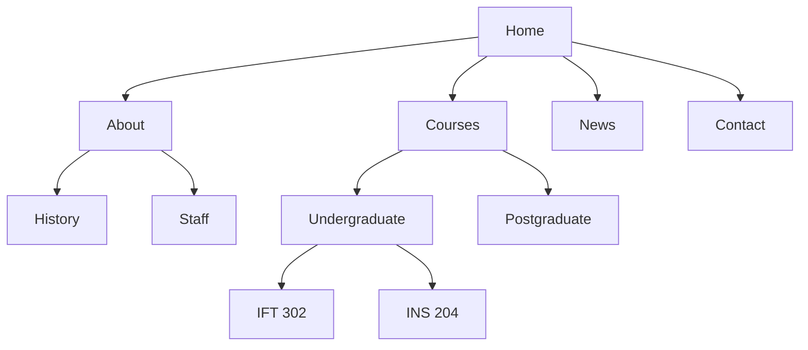

## What Is Website Design?

**Website design** is the process of **planning, conceptualising and arranging content** intended for the Internet. It involves creating websites that are:

- **visually appealing**,
- **functional**,
- **user-friendly**, and
- **accessible across different devices**.

A well-designed website **combines aesthetics (looks) with functionality (works)** to achieve a specific objective — providing information, selling products, or offering an online service such as course registration.

### Characteristics of a Good Website Design

Good website design should:

| Characteristic | What it means in practice |
|---|---|
| **Be visually attractive** | Harmonious colours, readable fonts, quality images |
| **Load quickly** | Most visitors leave a page that takes more than a few seconds |
| **Be easy to navigate** | Users can find what they want in a few clicks |
| **Work on different devices** | Phone, tablet, laptop, desktop, TV |
| **Meet users' needs** | Designed around what the audience actually wants to do |

---

## The Eight Principles of Website Design

**Web design principles** are **guidelines** that help designers create **effective, attractive and user-friendly** websites.

<Tabs>
<Tab label="1. Simplicity">

### Simplicity

The design should **avoid unnecessary elements that distract users**. A simple website has:
- **clean layouts**,
- **minimal clutter**,
- **clear navigation**, and
- **simple colour schemes**.

**Example:** **Google's homepage** — a logo, one search box and two buttons. Everything on it serves the one task users came to do.

**Test:** for every element, ask *"If I removed this, would users miss it?"* If not, remove it.

</Tab>
<Tab label="2. Consistency">

### Consistency

**All pages should maintain a uniform appearance.** Consistency covers:
- **fonts**,
- **colours**,
- **button styles**,
- **navigation menus**, and
- **page layouts**.

**Why it matters:** consistency **improves usability** (users learn the site once), makes the website look **professional**, and **builds trust**. If the "Pay" button is green on one page and grey on the next, users hesitate.

**How developers achieve it:** one **external stylesheet** shared by every page, and reusable components (the same header and footer included on every page).

</Tab>
<Tab label="3. Visual hierarchy">

### Visual Hierarchy

Visual hierarchy **arranges elements according to their importance**, so the eye reads the most important things first. It is created with:
- **larger headings**,
- **bold text**,
- **contrasting colours**, and
- **strategic spacing**.

**Example:** the **page title** should be larger than **subheadings**, which should be larger than **body text**. In HTML this is what `h1` → `h2` → `h3` → `p` expresses.

</Tab>
<Tab label="4. Balance">

### Balance

Balance refers to **distributing visual elements evenly** so a page doesn't feel lopsided.

- **Symmetrical balance** — elements are **evenly arranged on both sides** of a centre line. Formal and stable. **Example: corporate websites.**
- **Asymmetrical balance** — **different-sized elements are balanced creatively**, e.g. a large image on one side balanced by a block of text and a bright button on the other. Dynamic and modern. **Example: modern portfolio websites.**

</Tab>
<Tab label="5. Contrast">

### Contrast

Contrast **helps important information stand out**. It can be created with differences in:
- **colour**,
- **size**,
- **shape**, and
- **font weight**.

**Example:** a **bright "Buy Now" button on a dark background**.

Contrast also matters for **readability**: light grey text on a white background is hard to read, especially outdoors on a phone.

</Tab>
<Tab label="6. White space">

### White Space

**White space** (also called **negative space**) is the **empty area between elements**. It doesn't have to be white — it's simply space with nothing in it.

It is important because it:
- **improves readability**,
- **reduces clutter**, and
- **draws attention to important content**.

Beginners often think empty space is "wasted". It isn't — it **groups** related items and **separates** unrelated ones.

</Tab>
<Tab label="7. Accessibility">

### Accessibility

Websites should be **usable by everyone, including people with disabilities** — visual, hearing, motor or cognitive.

Accessibility practices include:
- **Alternative text (alt text) for images** — read aloud by screen readers
- **Keyboard navigation** — everything usable with Tab and Enter, no mouse needed
- **Sufficient colour contrast** — WCAG recommends at least **4.5 : 1** for normal text
- **Readable fonts** — adequate size, clear typefaces
- **Captions for videos**

Accessible design helps everyone: captions help people in noisy buses; large buttons help anyone on a moving okada.

</Tab>
<Tab label="8. Performance">

### Performance

**A beautiful website is ineffective if it loads slowly.** Performance can be improved by:
- **compressing images** (e.g., WebP format, correct dimensions),
- **optimising code** (minifying CSS and JavaScript, removing unused code),
- **reducing unnecessary animations**, and
- **using caching** (so returning visitors don't re-download files).

On mobile data plans, a lighter site is also **cheaper** for your users.

</Tab>
</Tabs>

![Four wireframes. Top left, symmetrical balance: a centred title and three equal cards mirrored about a dashed centre line. Top right, asymmetrical balance: a large image on the left balanced by a heading, text lines and an orange Hire me button on the right. Bottom left, cluttered: many tightly packed coloured boxes and three red buttons competing for attention. Bottom right, generous white space: a small logo and menu, a centred heading, two text lines and one green Apply now button surrounded by empty space](/images/ift302/balance-and-white-space.svg)

*Figure: Symmetrical vs asymmetrical balance (top), and a cluttered layout vs one using white space (bottom).*

<Analogy>
Good design is like a **well-arranged market stall**. The trader puts the **best tomatoes at the front** (visual hierarchy), keeps **prices written the same way** on every item (consistency), leaves **space between baskets** so you can see each one (white space), and uses a **bright umbrella** so you spot the stall from far away (contrast). A stall piled with everything at once (clutter) makes you walk past.
</Analogy>

### Try It: Hierarchy and Contrast

This course card has **weak hierarchy and contrast** — everything is the same size and colour. Edit the CSS to fix it: make the title large and bold, make the button stand out, and add spacing. Press **Run** after each change.

<Playground title="Fix the hierarchy">

```html
<div class="card">
  <p class="tag">New course</p>
  <h2 class="title">Web Application Development</h2>
  <p class="meta">IFT 302 · 3 units · 12 weeks</p>
  <p class="desc">Build dynamic websites with HTML, CSS, JavaScript, PHP and MySQL.</p>
  <button class="btn">Enrol now</button>
</div>
```

```css
.card { border: 1px solid #ccc; padding: 4px; max-width: 320px; }
.tag, .title, .meta, .desc, .btn {
  font-size: 14px; font-weight: normal; color: #888;
  margin: 0; background: none; border: none;
}
/* Try: .title { font-size: 24px; font-weight: bold; color: #0f172a; }
        .btn { background: #f97316; color: white; padding: 10px 18px; border-radius: 8px; }
        .card { padding: 20px; } and give the paragraphs some margin */
```

</Playground>

<MCQ question="A designer makes the 'Register' button bright orange on a dark blue page so it stands out. Which principle is mainly being applied?">
<Option>Balance</Option>
<Option correct>Contrast</Option>
<Option>Consistency</Option>
<Option>Performance</Option>
<Explain>
**Contrast** uses differences in **colour, size, shape or weight** to make important information stand out — exactly like the course's example of a **bright "Buy Now" button on a dark background**. (It also supports visual hierarchy, but the technique itself is contrast.)
</Explain>
</MCQ>

---

## User Interface (UI) and User Experience (UX)

Although the terms are often used together, **UI and UX are different concepts**.

### User Interface (UI)

**User Interface (UI)** refers to **everything users interact with on a website** — the visible, touchable parts:

**buttons**, **menus**, **icons**, **forms**, **navigation bars**, **images**, **typography**, **colours**.

**UI focuses on appearance and interaction.**

**Characteristics of a good UI.** A good UI must:
- be **attractive**,
- be **consistent**,
- make the website **easy to understand and navigate**,
- be **interactive** (buttons respond, forms give feedback), and
- be **responsive** (adapt to the screen).

### User Experience (UX)

**User Experience (UX)** refers to the **overall experience users have while interacting with a website** — how it *feels* to use it from start to finish.

**UX focuses on ease of use, efficiency, satisfaction and accessibility.** Good UX answers questions such as:
- **Can users easily find information?**
- **Is the website easy to navigate?**
- **Are tasks completed quickly?**
- **Do users enjoy using the website?**

### UI vs UX

| User Interface (UI) | User Experience (UX) |
|---|---|
| Focuses on **appearance** | Focuses on **experience** |
| **Colours** | **Ease of use** |
| **Buttons** | **User satisfaction** |
| **Layout** | **User journey** |
| **Typography** | **Navigation efficiency** |
| **Interactive elements** | **Overall usability** |

### The Relationship Between UI and UX

**UI and UX work together.** A shopping website may have:

| Good UI | Poor UX |
|---|---|
| Beautiful colours | **Difficult checkout process** |
| Attractive product cards | **Slow-loading pages** |
| Modern buttons | **Confusing navigation** |

**The website looks attractive but provides a poor experience.** Users judge a site by both — the **interface (appearance)** is as important as the **experience (ease of interaction)**.

<Analogy>
In a car, the **UI** is the dashboard, steering wheel and seat fabric. The **UX** is what the whole journey feels like: is the seat comfortable after two hours, can you find the hazard-light switch in an emergency, does the car get you there without stress? A beautiful dashboard (good UI) in a car that stalls every kilometre (bad UX) is still a bad car.
</Analogy>

<MCQ question="Users say a university portal 'looks modern' but they can't find where to print their course form, and it takes 9 clicks. Which is the main problem?">
<Option>Poor UI — the colours are wrong.</Option>
<Option correct>Poor UX — navigation efficiency and task completion are weak.</Option>
<Option>Poor performance — the images are too large.</Option>
<Option>Poor balance — the layout is symmetrical.</Option>
<Explain>
"Looks modern" means the **UI** is fine. Not finding a feature and needing 9 clicks are problems of **findability, navigation efficiency and task speed** — all **UX** concerns.
</Explain>
</MCQ>

---

## Website Architecture: Organising the Pages

Before designing pages, designers decide **how the pages are organised and linked** — the site's **structure** (also called its *information architecture*). It is usually drawn as a **sitemap**:



**Good structure means:**
- **Shallow, not deep** — important pages should be reachable in **about three clicks** from the home page.
- **Logical groups** that match how users think (by *task* — "Apply", "Pay fees" — rather than by internal department names).
- **Clear, consistent navigation** on every page, plus **breadcrumbs** (`Home › Courses › IFT 302`) on deep pages.
- **Meaningful URLs** that mirror the structure: `/courses/undergraduate/ift302`.

---

## Responsive Web Design (RWD)

**Responsive Web Design** is an approach that **enables websites to adapt automatically to different screen sizes and devices**. The **same website** should work properly on:

**smartphones**, **tablets**, **laptops**, **desktop computers** and **smart TVs**.

### Why Responsive Design Is Important

- **Most users browse on mobile phones** — in Nigeria, the large majority of web traffic comes from phones.
- **Improves user experience** — no pinching and zooming.
- **Better search engine rankings** — Google ranks sites primarily on their mobile version (*mobile-first indexing*).
- **Reduces maintenance costs** — one codebase instead of a separate "m." mobile site.
- **One website serves all devices.**

### Common Screen Sizes

| Device | Typical width |
|---|---|
| **Mobile** | Up to **767 px** |
| **Tablet** | **768–1023 px** |
| **Laptop** | **1024–1439 px** |
| **Desktop** | **1440 px and above** |

These widths become the **breakpoints** in media queries.

### Step 0: The Viewport Meta Tag

Every responsive page **must** include this line in its `<head>`:

```html
<meta name="viewport" content="width=device-width, initial-scale=1">
```

Without it, phones pretend to be about **980 px wide** and shrink the whole page to fit — so your media queries never trigger and the text is tiny. `width=device-width` tells the phone to use its **real width**.

### Features of Responsive Design

<Tabs>
<Tab label="Flexible layouts">

**Page elements automatically adjust to the screen size.** Use **relative units** (`%`, `fr`, `rem`, `vw`) and modern layout tools instead of fixed pixel widths:

```css
/* ✗ Fixed: overflows any screen narrower than 960px */
.container { width: 960px; }

/* ✓ Flexible: full width on phones, never wider than 960px */
.container { width: 100%; max-width: 960px; margin: 0 auto; }

/* ✓ Grid that fits as many 220px+ columns as the screen allows */
.cards {
  display: grid;
  grid-template-columns: repeat(auto-fit, minmax(220px, 1fr));
  gap: 16px;
}
```

</Tab>
<Tab label="Flexible images">

**Images resize automatically without distortion:**

```css
img {
  max-width: 100%;  /* never wider than its container */
  height: auto;     /* keep the original proportions */
}
```

`max-width` (not `width`) means small images are never stretched larger than their real size.

</Tab>
<Tab label="Media queries">

**Media queries apply different styles for different screen sizes.** The course's example:

```css
@media (max-width: 768px) {
  body {
    font-size: 16px;
  }
}
```

Read it as: *"**If** the screen is **768 px wide or less**, apply these rules."*

| Query | Applies when… |
|---|---|
| `@media (max-width: 767px)` | screen is **767 px or narrower** (phones) |
| `@media (min-width: 768px)` | screen is **768 px or wider** (tablets and up) |
| `@media (min-width: 768px) and (max-width: 1023px)` | **tablets only** |
| `@media (orientation: landscape)` | device is held sideways |

</Tab>
<Tab label="Responsive navigation">

**The menu changes form with the screen size:**

| Desktop | Mobile |
|---|---|
| `Home \| About \| Contact \| Services` | `☰ Menu` |

On narrow screens a full menu bar would wrap onto several lines, so it is hidden behind a **hamburger icon (☰)** that toggles the menu open with JavaScript. The practical below shows this.

</Tab>
<Tab label="Responsive typography">

**Font sizes adjust according to screen size:**

```css
html { font-size: 16px; }
h1   { font-size: 1.75rem; }            /* 28px on phones */

@media (min-width: 1024px) {
  h1 { font-size: 2.5rem; }             /* 40px on laptops */
}

/* Or fluid: grows smoothly between 28px and 48px */
h1 { font-size: clamp(1.75rem, 4vw, 3rem); }
```

`rem` units are relative to the root font size, so the whole page scales together — and respects users who set a larger default font for readability.

</Tab>
</Tabs>

### Mobile-First vs Desktop-First

| | **Mobile-first** ✅ (recommended) | Desktop-first |
|---|---|---|
| **Base CSS** is written for | Small screens | Large screens |
| Media queries **add** layout with | `min-width` | `max-width` |
| Advantage | Phones load only the simple styles; forces you to **prioritise content** | Easier when converting an old desktop site |

```css
/* Mobile-first: one column by default… */
.cards { display: grid; grid-template-columns: 1fr; gap: 16px; }

/* …two columns from tablet width… */
@media (min-width: 768px)  { .cards { grid-template-columns: 1fr 1fr; } }

/* …three columns from laptop width */
@media (min-width: 1024px) { .cards { grid-template-columns: 1fr 1fr 1fr; } }
```

### Responsive Design Best Practices

- **Design for mobile first.**
- **Use flexible grids and layouts.**
- **Optimise images.**
- **Test on multiple devices and browsers** — Chrome DevTools' **device toolbar** (**Ctrl + Shift + M**) simulates phones and tablets.
- **Ensure buttons are easy to tap** — at least about **44–48 px** tall, with space between them.
- **Avoid fixed-width layouts.**
- **Use readable font sizes** — at least **16 px** for body text on phones.

<ExamTip>
If asked to "write a media query", always include the **`@media`** keyword, the **condition in brackets** (e.g. `(max-width: 768px)`), and **at least one complete CSS rule** inside the braces. Mention the **viewport meta tag** too — many students forget it, and without it media queries don't work on real phones.
</ExamTip>

---

## Practical: A Responsive Page Layout

This is the week's practical — a simple website layout with a header, responsive navigation, a card grid and a footer. Use the **Mobile / Tablet / Laptop / Desktop** buttons to see the **same code** adapt:

- **Mobile:** the menu collapses behind **☰ Menu**, and the cards stack in **one column**.
- **Tablet:** the full menu appears and the cards form **two columns**.
- **Laptop and up:** **three columns**.

Tap **☰ Menu** in Mobile view to open the menu, then try changing the breakpoints or colours and press **Run**.

<Playground title="Responsive layout — switch devices" responsive>

```html
<header class="site-header">
  <h1 class="logo">UI Tech Hub</h1>
  <button class="menu-btn" id="menuBtn">☰ Menu</button>
  <nav id="nav">
    <a href="#">Home</a><a href="#">Courses</a><a href="#">About</a><a href="#">Contact</a>
  </nav>
</header>

<main>
  <h2>Our Courses</h2>
  <section class="cards">
    <article class="card"><h3>HTML &amp; CSS</h3><p>Structure and style web pages.</p></article>
    <article class="card"><h3>JavaScript</h3><p>Make pages interactive.</p></article>
    <article class="card"><h3>PHP &amp; MySQL</h3><p>Build dynamic, data-driven sites.</p></article>
  </section>
</main>

<footer>© 2026 UI Tech Hub</footer>
```

```css
* { box-sizing: border-box; }
body { margin: 0; font-family: Arial, sans-serif; color: #0f172a; }

/* ---------- Mobile-first base styles ---------- */
.site-header { background: #1e3a8a; color: white; padding: 12px 16px;
               display: flex; flex-wrap: wrap; align-items: center; justify-content: space-between; }
.logo { font-size: 20px; margin: 0; }
.menu-btn { background: #f97316; color: white; border: 0; padding: 8px 14px;
            border-radius: 6px; font-size: 15px; }
nav { display: none; width: 100%; flex-direction: column; margin-top: 10px; }
nav.open { display: flex; }
nav a { color: white; text-decoration: none; padding: 10px 0; border-top: 1px solid #3b5bb5; }

main { padding: 16px; }
.cards { display: grid; grid-template-columns: 1fr; gap: 14px; }
.card { background: #eff6ff; border: 1px solid #bfdbfe; border-radius: 10px; padding: 14px; }
.card h3 { margin: 0 0 6px; }
footer { text-align: center; padding: 14px; background: #f1f5f9; }

/* ---------- Tablet: 768px and wider ---------- */
@media (min-width: 768px) {
  .menu-btn { display: none; }
  nav { display: flex; flex-direction: row; width: auto; margin: 0; gap: 20px; }
  nav a { border: 0; }
  .cards { grid-template-columns: 1fr 1fr; }
}

/* ---------- Laptop: 1024px and wider ---------- */
@media (min-width: 1024px) {
  main { max-width: 1100px; margin: 0 auto; }
  .cards { grid-template-columns: 1fr 1fr 1fr; }
}
```

```js
// Toggle the mobile menu open and closed
document.getElementById("menuBtn").addEventListener("click", function () {
  document.getElementById("nav").classList.toggle("open");
  console.log("Menu toggled");
});
```

</Playground>

---

## Modern Website Design Tools

| Design tools (plan the look) | Development tools (build it) |
|---|---|
| **Figma** — browser-based, collaborative; the industry standard for wireframes and prototypes | **Visual Studio Code** — code editor |
| **Adobe XD** — Adobe's UI/UX design tool (in maintenance mode since 2023) | **Chrome Developer Tools** — inspect, debug, test responsiveness |
| **Sketch** — macOS-only UI design tool | **Bootstrap** — CSS framework with a ready-made **12-column responsive grid** and components |
| **Canva** — quick, simple graphics (banners, social images) | **Tailwind CSS** — "utility-first" framework: style with classes like `p-4 md:grid-cols-2` |

---

## Best Practices for Website Design

- **Keep navigation simple.**
- **Maintain consistent branding** (logo, colours, fonts).
- **Use high-quality images** — but compress them.
- **Ensure fast loading times.**
- **Prioritise accessibility.**
- **Optimise for search engines (SEO)** — descriptive titles, headings and alt text.
- **Design with mobile users in mind.**
- **Test usability before deployment** — watch real users try real tasks.

---

## Practice Questions

<Reveal question="List and explain any five principles of website design, with an example of each.">
Any five of: **Simplicity** — avoid unnecessary elements (Google homepage). **Consistency** — uniform fonts, colours, buttons and navigation across pages (one shared stylesheet). **Visual hierarchy** — arrange by importance using size, weight, colour, spacing (page title > subheadings > body text). **Balance** — distribute elements evenly, symmetrical (corporate sites) or asymmetrical (portfolio sites). **Contrast** — make important items stand out (bright "Buy Now" on dark background). **White space** — empty space between elements for readability and focus. **Accessibility** — usable by people with disabilities (alt text, keyboard navigation, contrast, captions). **Performance** — fast loading (compressed images, optimised code, caching).
</Reveal>

<Reveal question="Distinguish between UI and UX, and explain how a site can have good UI but poor UX.">
**UI** is **everything users interact with** — buttons, menus, icons, forms, typography, colours; it focuses on **appearance and interaction**. **UX** is the **overall experience** of using the site — ease of use, efficiency, satisfaction and accessibility. A shopping site with **beautiful colours, attractive product cards and modern buttons** (good UI) can still have a **difficult checkout, slow pages and confusing navigation** (poor UX). Both are needed.
</Reveal>

<Reveal question="What is responsive web design? Explain three of its features.">
RWD is an approach that makes a website **adapt automatically to different screen sizes and devices**, so one site works on phones, tablets, laptops, desktops and TVs. Features: **flexible layouts** (relative units, flexbox/grid so elements resize), **flexible images** (`max-width: 100%; height: auto`), **CSS media queries** (different styles for different widths, e.g. `@media (max-width: 768px)`), **responsive navigation** (full menu on desktop, ☰ menu on mobile) and **responsive typography** (font sizes adjust to the screen).
</Reveal>

<Reveal question="Write a media query that makes all paragraphs 18px on screens 1024px wide and above.">
```css
@media (min-width: 1024px) {
  p {
    font-size: 18px;
  }
}
```
</Reveal>

<Reveal question="What is the viewport meta tag and why is it needed?">
`<meta name="viewport" content="width=device-width, initial-scale=1">` in the `<head>` tells mobile browsers to **lay the page out at the device's real width** at 100% zoom. Without it, phones render the page as if the screen were about 980 px wide and shrink it, so text is tiny and **media queries for small screens never apply**.
</Reveal>

<Reveal question="Explain the mobile-first approach and why it is recommended.">
In mobile-first design the **base CSS targets small screens**, and **`min-width` media queries add** extra layout for larger screens. It is recommended because **most users are on phones**, it forces designers to **prioritise essential content**, and phones download and apply only the simpler styles, improving **performance**.
</Reveal>

<Takeaway>
**Website design** = planning and arranging content so a site is **attractive, functional, user-friendly and accessible on all devices**. The **eight principles**: **simplicity, consistency, visual hierarchy, balance** (symmetrical/asymmetrical), **contrast, white space, accessibility, performance**. **UI** is the look and the controls; **UX** is the whole experience — a site needs both. Organise pages in a **shallow, logical structure**. **Responsive design** adapts one site to every screen with **flexible layouts, flexible images, media queries, responsive navigation and typography** — plus the **viewport meta tag**. Design **mobile-first** (`min-width` breakpoints at about **768 px** and **1024 px**) and test on real devices.
</Takeaway>

## Exam Tips

**What lecturers test:**
- Definition of website design and the characteristics of good design
- The principles of website design — **explain with examples**
- **UI vs UX** table and the shopping-site example
- Responsive design: definition, importance, features, best practices, screen-size breakpoints
- Writing a simple **media query**

**Common mistakes:**
- Writing `@media max-width: 768px` without the **brackets** around the condition
- Confusing **padding** (inside) with **margin** (outside) when talking about white space
- Treating UI and UX as the same thing

**Likely question:**
> "Explain five principles of website design. Differentiate between UI and UX, and describe how responsive web design ensures a website works on different devices, using a CSS media query to illustrate." (20 marks)
