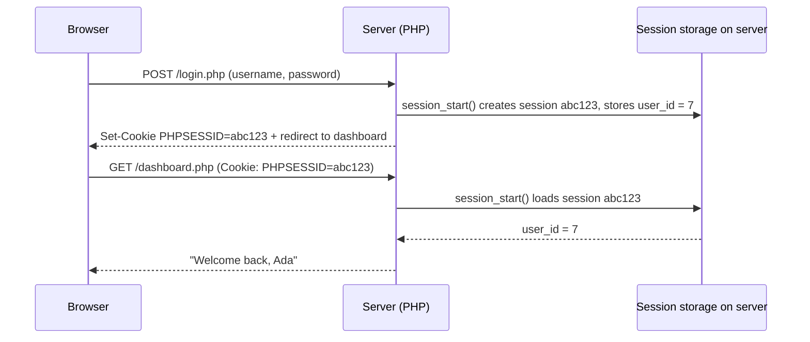
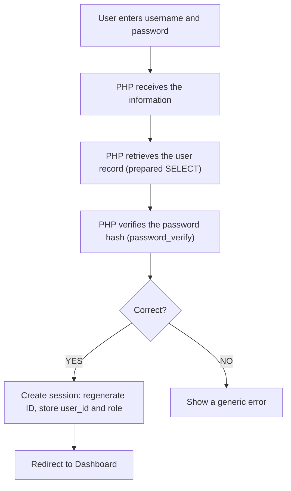

## The Problem: HTTP Forgets

Web applications need to **remember users as they move between pages**:

1. User **logs in**.
2. User visits **dashboard**.
3. User visits **profile**.
4. User visits **results**.

**How does the website know the user is already logged in?** HTTP is **stateless** — every request arrives on its own, with no memory of the one before. Without help, the server would ask for the password on every single page.

The two tools that give web applications memory are **cookies** (stored in the **browser**) and **sessions** (stored on the **server**, identified by a cookie).

---

## Cookies

**A cookie is a small piece of information stored by the browser for a website.** The server asks the browser to store it (with a `Set-Cookie` header), and **the browser sends it back automatically with every later request** to that site.

**Uses:** **preferences** (theme, language), **remembering settings**, **tracking certain interactions** (analytics), and **maintaining application state** (the session ID).

### Setting and Reading a Cookie

```php
setcookie("username", "John", time() + 3600);
```

| Argument | Here | Meaning |
|---|---|---|
| name | `"username"` | The cookie's name |
| value | `"John"` | What to store (always text) |
| expires | `time() + 3600` | A Unix timestamp: **now + 3600 seconds = 1 hour**. Leave it out (or `0`) and the cookie is deleted when the browser closes |

Read it on a **later** request with **`$_COOKIE["username"]`**. To **delete** a cookie, set it again with an expiry time **in the past**: `setcookie("username", "", time() - 3600);`

> **`setcookie()` must be called before any output** (HTML, `echo`, even a blank line before `<?php`), because cookies travel in the HTTP **headers**, which are sent before the page body. The same rule applies to `session_start()` and `header()`.

**Try it:** choose a theme — the cookie is set and the page reloads with it. **Run again** later: the choice is remembered. Watch the 🍪 line under the result: that's the browser's cookie jar.

<PhpPlayground title="A theme preference cookie" height="220">

```php
<?php
// 1. If the user picked a theme, store it in a cookie for 30 days
if (isset($_GET["theme"]) && in_array($_GET["theme"], ["light", "dark"], true)) {
    setcookie("theme", $_GET["theme"], time() + 60 * 60 * 24 * 30);
    header("Location: index.php");     // reload so the new cookie is sent back
    exit;
}
if (isset($_GET["forget"])) {
    setcookie("theme", "", time() - 3600);   // expiry in the past = delete
    header("Location: index.php");
    exit;
}

// 2. Read the cookie the browser sent (default: light)
$theme = $_COOKIE["theme"] ?? "light";
$bg = $theme === "dark" ? "#0f172a" : "#ffffff";
$fg = $theme === "dark" ? "#e2e8f0" : "#0f172a";
?>
<body style="background:<?= $bg ?>;color:<?= $fg ?>;font-family:Arial;padding:10px">
  <h3>Current theme: <?= htmlspecialchars($theme) ?></h3>
  <a href="index.php?theme=light">Light</a> |
  <a href="index.php?theme=dark">Dark</a> |
  <a href="index.php?forget=1">Forget my choice</a>
  <p>Cookies the browser sent: <code><?= htmlspecialchars(json_encode($_COOKIE)) ?></code></p>
</body>
```

</PhpPlayground>

### Cookie Security Options

Modern `setcookie()` takes an options array:

```php
setcookie("theme", "dark", [
    "expires"  => time() + 86400 * 30,
    "path"     => "/",
    "secure"   => true,      // only sent over HTTPS
    "httponly" => true,      // JavaScript can't read it (limits XSS damage)
    "samesite" => "Lax",     // not sent on most cross-site requests (limits CSRF)
]);
```

**Never store sensitive data in a cookie** (passwords, account balances, "is_admin=1"): cookies are **stored on the user's device**, **visible** and **editable** by the user, and limited to about **4 KB**.

---

## Sessions

**A session keeps information about a user's interaction on the server.** PHP gives each visitor a random **session ID**, stores it in a cookie (**`PHPSESSID`**), and keeps the actual data in a file **on the server**. The browser only ever holds the ID.



### Starting a Session and Storing Data

**A session must be started before using session variables:**

```php
session_start();
$_SESSION["username"] = "John";
```

**The value can then be read on another page — after starting the session there too:**

```php
session_start();
echo $_SESSION["username"];     // John
```

`session_start()` either **creates** a new session or **resumes** the existing one (using the ID from the cookie). Call it at the **very top** of every page that uses sessions, **before any output**.

### Destroying a Session (Logout)

```php
session_start();
session_unset();      // remove all session variables
session_destroy();    // delete the session data on the server
```

**This removes the session information.** Good practice also **deletes the session cookie**, so the browser forgets the old ID:

```php
setcookie(session_name(), "", time() - 3600, "/");
```

**Try it** — a visit counter kept in the session:

<PhpPlayground title="A session visit counter" height="200">

```php
<?php
session_start();

if (isset($_GET["reset"])) {
    session_unset();
    session_destroy();
    header("Location: index.php");
    exit;
}

$_SESSION["visits"] = ($_SESSION["visits"] ?? 0) + 1;
?>
<h3>You have loaded this page <?= $_SESSION["visits"] ?> time(s) this session.</h3>
<p><a href="index.php">Reload</a> | <a href="index.php?reset=1">Destroy session</a></p>
<p>Your session ID (kept in the PHPSESSID cookie): <code><?= session_id() ?></code></p>
```

</PhpPlayground>

Click **Reload** a few times: the count survives between requests because it lives **on the server**, found again through the `PHPSESSID` cookie.

### Sessions vs Cookies

| | **Session** | **Cookie** |
|---|---|---|
| **Where data is stored** | **On the server** | **On the user's browser** |
| What the browser holds | Only a **session ID** (in a cookie) | The **data itself** |
| Primary use | **Maintaining information about a user's interaction with the server** — login state, cart | **Preferences**, "remember me", tracking |
| Can the user read/edit it? | **No** | **Yes** |
| Size limit | Large (server storage) | About **4 KB** per cookie |
| Lifetime | Usually ends when the browser closes or after inactivity (≈24 min by default) | **Until its expiry date** (or browser close if none) |
| Safe for sensitive data? | **Yes** (e.g. `user_id`, `role`) | **No** |
| PHP | `session_start()`, `$_SESSION` | `setcookie()`, `$_COOKIE` |

<ExamTip>
"**Differentiate between sessions and cookies**" — the key point is **where the data lives**: sessions on the **server** (only an ID travels in a cookie), cookies in the **browser**. Then give **uses**, **security**, **size** and **lifetime** differences.
</ExamTip>

---

## Password Security

**Passwords should never be stored as plain text.** If the database is ever leaked (it happens to big companies), every user's password — often reused on email and bank accounts — is exposed.

```text
✗ Incorrect:   password = mypassword123
```

Instead, store a **hash**: the output of a **one-way** function. You can't turn the hash back into the password; you can only **check** whether a typed password produces a matching hash.

| Function | Purpose |
|---|---|
| **`password_hash($password, PASSWORD_DEFAULT)`** | Creates a secure hash (currently **bcrypt**) with a **random salt** built in |
| **`password_verify($password, $hash)`** | Returns `true` if the password matches the stored hash |

```php
$hashedPassword = password_hash($password, PASSWORD_DEFAULT);

if (password_verify($password, $hashedPassword)) {
    echo "Password is correct.";
}
```

**The database stores the hash, not the user's original password.** Store it in a column of at least **`VARCHAR(255)`**, because hash formats grow as algorithms improve.

<PhpPlayground title="password_hash() and password_verify()" height="240">

```php
<?php
$password = "mypassword123";

$hash1 = password_hash($password, PASSWORD_DEFAULT);
$hash2 = password_hash($password, PASSWORD_DEFAULT);

echo "<p><b>Hash 1:</b> <code>$hash1</code></p>";
echo "<p><b>Hash 2:</b> <code>$hash2</code></p>";
echo "<p>Same password, different hashes? " . ($hash1 !== $hash2 ? "Yes — each has a random salt" : "No") . "</p>";

echo "<p>Verify 'mypassword123' against hash 1: " . (password_verify("mypassword123", $hash1) ? "✓ correct" : "✗ wrong") . "</p>";
echo "<p>Verify 'MyPassword123' against hash 1: " . (password_verify("MyPassword123", $hash1) ? "✓ correct" : "✗ wrong") . "</p>";
echo "<p>Verify against hash 2: " . (password_verify($password, $hash2) ? "✓ correct" : "✗ wrong") . "</p>";
```

</PhpPlayground>

**Read the hash:** `$2y$` = bcrypt, `10$` = the **cost** (work factor), then 22 characters of **salt**, then the hash itself. The random salt means two users with the same password get **different** hashes, which defeats pre-computed "rainbow tables". The cost makes each guess **deliberately slow** for an attacker.

> **Why not `md5()` or `sha1()`?** They're **fast** — a graphics card can try **billions per second** — and unsalted. They were never designed for passwords. Always use `password_hash()`.

---

## Authentication and Authorization

| **Authentication** | **Authorization** |
|---|---|
| **"Who are you?"** | **"What are you allowed to do?"** |
| **Determining whether a user is who they claim to be** | **Determining what an authenticated user may access** |
| Username + password, OTP, fingerprint | Roles and permissions: student, lecturer, admin |
| Happens at **login** | Happens on **every protected page/action** |
| Failure → "Invalid username or password" | Failure → **403 Forbidden** / "Access denied" |

### The Login Flow



**Authentication protects user accounts and data, so handle it carefully:**
- Use **prepared statements** to find the user.
- Use **`password_verify()`**, never compare plain passwords.
- Call **`session_regenerate_id(true)`** after a successful login — it gives the logged-in session a **new ID**, defeating **session fixation** (an attacker planting a known session ID before the victim logs in).
- Show a **generic** message — "Invalid username or password" — so attackers can't discover which usernames exist.
- Store only what you need in the session (the user's **ID** and **role**), never the password.
- Protect every private page with a **login check**, and admin pages with a **role check**.
- Use **HTTPS** in production, so passwords and session cookies can't be intercepted.

---

## Build It: A Login and Registration System

This is the week's practical, complete and working, with a real MySQL `users` table. One account already exists: **`admin` / `Admin@123`** (role **admin**).

**Try this sequence:**
1. **Register** a new account (try a short password and a taken username first).
2. **Log in** with it → the **dashboard** greets you; open **🗄 MySQL database** to see your **hashed** password.
3. Click **Admin area** → **403 Access denied** (you're a *student*: **authorization** failed).
4. **Log out**, log in as **admin**, and open the Admin area again.
5. After logging out, type `dashboard.php` in the address bar → you're **redirected to login**.

<PhpPlayground title="Login and registration system" height="360">

```sql
CREATE TABLE users (
    id INT AUTO_INCREMENT PRIMARY KEY,
    username VARCHAR(50) NOT NULL UNIQUE,
    full_name VARCHAR(100) NOT NULL,
    password_hash VARCHAR(255) NOT NULL,
    role ENUM('student','admin') NOT NULL DEFAULT 'student',
    created_at TIMESTAMP DEFAULT CURRENT_TIMESTAMP
);
-- The admin's password is Admin@123 (stored only as a bcrypt hash)
INSERT INTO users (username, full_name, password_hash, role)
VALUES ('admin', 'Portal Administrator', '$2y$10$iTXn9uL4uXylQ29j0fUHEe2njNYgPT1aCe/dCagWHAWSZ6TT/cZFW', 'admin');
```

```php
<?php // file: login.php
require_once "auth.php";

if (current_user()) {                       // already logged in
    header("Location: dashboard.php");
    exit;
}

$error = "";
$username = "";
if ($_SERVER["REQUEST_METHOD"] === "POST") {
    $username = trim($_POST["username"] ?? "");
    $password = $_POST["password"] ?? "";

    // 1. Retrieve the user record (prepared statement)
    $stmt = mysqli_prepare($conn, "SELECT id, full_name, password_hash, role FROM users WHERE username = ?");
    mysqli_stmt_bind_param($stmt, "s", $username);
    mysqli_stmt_execute($stmt);
    $user = mysqli_fetch_assoc(mysqli_stmt_get_result($stmt));

    // 2. Verify the password hash
    if ($user && password_verify($password, $user["password_hash"])) {
        // 3. Create the session
        session_regenerate_id(true);
        $_SESSION["user_id"] = $user["id"];
        $_SESSION["name"] = $user["full_name"];
        $_SESSION["role"] = $user["role"];
        header("Location: dashboard.php");
        exit;
    }
    $error = "Invalid username or password.";   // generic on purpose
}
page_top("Log in");
?>
<?php if (isset($_GET["registered"])): ?><p class="ok">Account created — please log in.</p><?php endif; ?>
<?php if (isset($_GET["loggedout"])): ?><p class="ok">You have been logged out.</p><?php endif; ?>
<?php if ($error): ?><p class="err"><?= htmlspecialchars($error) ?></p><?php endif; ?>
<form method="post">
  <label>Username</label><input name="username" value="<?= htmlspecialchars($username) ?>">
  <label>Password</label><input type="password" name="password">
  <p><button type="submit">Log in</button></p>
</form>
<p>No account? <a href="register.php">Register</a></p>
<?php page_bottom(); ?>
```

```php
<?php // file: register.php
require_once "auth.php";

$errors = [];
$username = $full_name = "";
if ($_SERVER["REQUEST_METHOD"] === "POST") {
    $username = trim($_POST["username"] ?? "");
    $full_name = trim($_POST["full_name"] ?? "");
    $password = $_POST["password"] ?? "";
    $confirm = $_POST["confirm"] ?? "";

    if (!preg_match("/^[A-Za-z0-9_]{3,20}$/", $username)) $errors[] = "Username: 3–20 letters, numbers or _.";
    if ($full_name === "") $errors[] = "Full name is required.";
    if (strlen($password) < 8) $errors[] = "Password must be at least 8 characters.";
    if ($password !== $confirm) $errors[] = "Passwords do not match.";

    if (!$errors) {
        $hash = password_hash($password, PASSWORD_DEFAULT);          // never store the plain password
        $stmt = mysqli_prepare($conn, "INSERT INTO users (username, full_name, password_hash) VALUES (?, ?, ?)");
        mysqli_stmt_bind_param($stmt, "sss", $username, $full_name, $hash);
        try {
            mysqli_stmt_execute($stmt);
            header("Location: login.php?registered=1");
            exit;
        } catch (mysqli_sql_exception $e) {
            $errors[] = $e->getCode() === 1062 ? "That username is taken." : "Registration failed.";
        }
    }
}
page_top("Register");
foreach ($errors as $e) echo '<p class="err">' . htmlspecialchars($e) . '</p>';
?>
<form method="post">
  <label>Username</label><input name="username" value="<?= htmlspecialchars($username) ?>">
  <label>Full name</label><input name="full_name" value="<?= htmlspecialchars($full_name) ?>">
  <label>Password</label><input type="password" name="password">
  <label>Confirm password</label><input type="password" name="confirm">
  <p><button type="submit">Create account</button></p>
</form>
<p>Have an account? <a href="login.php">Log in</a></p>
<?php page_bottom(); ?>
```

```php
<?php // file: dashboard.php
require_once "auth.php";
require_login();                           // authentication check

$user = current_user();
page_top("Dashboard");
?>
<h3>Welcome, <?= htmlspecialchars($user["name"]) ?>!</h3>
<p>Role: <b><?= htmlspecialchars($user["role"]) ?></b></p>
<ul>
  <li><a href="dashboard.php">My dashboard</a></li>
  <li><a href="admin.php">Admin area</a> (admins only)</li>
  <li><a href="logout.php">Log out</a></li>
</ul>
<?php page_bottom(); ?>
```

```php
<?php // file: admin.php
require_once "auth.php";
require_role("admin");                     // authorization check

page_top("Admin area");
$result = mysqli_query($conn, "SELECT username, full_name, role, created_at FROM users ORDER BY id");
?>
<h3>All users</h3>
<table border="1" cellpadding="4">
  <tr><th>Username</th><th>Name</th><th>Role</th></tr>
  <?php while ($row = mysqli_fetch_assoc($result)): ?>
    <tr><td><?= htmlspecialchars($row["username"]) ?></td><td><?= htmlspecialchars($row["full_name"]) ?></td><td><?= $row["role"] ?></td></tr>
  <?php endwhile; ?>
</table>
<p><a href="dashboard.php">Back</a></p>
<?php page_bottom(); ?>
```

```php
<?php // file: logout.php
session_start();
session_unset();
session_destroy();
setcookie(session_name(), "", time() - 3600, "/");   // forget the old session ID
header("Location: login.php?loggedout=1");
exit;
```

```php
<?php // file: auth.php
// Shared by every page: session, database connection and access checks.
session_start();
$conn = mysqli_connect("localhost", "root", "", "portal");

function current_user() {
    if (!isset($_SESSION["user_id"])) return null;
    return ["id" => $_SESSION["user_id"], "name" => $_SESSION["name"], "role" => $_SESSION["role"]];
}

// Authentication: must be logged in
function require_login() {
    if (!current_user()) {
        header("Location: login.php");
        exit;
    }
}

// Authorization: must have the right role
function require_role($role) {
    require_login();
    if ($_SESSION["role"] !== $role) {
        http_response_code(403);
        page_top("Access denied");
        echo "<p class='err'>403 — You do not have permission to view this page.</p>";
        echo "<p><a href='dashboard.php'>Back to dashboard</a></p>";
        page_bottom();
        exit;
    }
}

function page_top($title) {
    echo "<!DOCTYPE html><html><head><title>$title | UI Portal</title><style>
      body{font-family:Arial,sans-serif;margin:0}header{background:#1e3a8a;color:#fff;padding:10px 14px}
      main{padding:10px 14px}label{display:block;margin-top:8px;font-weight:bold;font-size:13px}
      input{padding:7px;width:100%;box-sizing:border-box}button{background:#1e3a8a;color:#fff;border:0;padding:8px 14px;border-radius:6px}
      .err{color:#dc2626}.ok{background:#dcfce7;padding:8px;border-radius:6px}
    </style></head><body><header><b>UI Portal</b> — $title</header><main>";
}

function page_bottom() {
    echo "</main></body></html>";
}
```

</PhpPlayground>

**How the pieces fit:**

| File | Role |
|---|---|
| `auth.php` | **Starts the session**, connects to the database, and defines **`require_login()`** (authentication) and **`require_role()`** (authorization) — included at the top of every page |
| `register.php` | Validates input, **hashes** the password, **INSERTs** the user; a duplicate username triggers MySQL error **1062** |
| `login.php` | **Prepared SELECT** → **`password_verify()`** → **`session_regenerate_id(true)`** → stores `user_id`, `name`, `role` in `$_SESSION` → redirects |
| `dashboard.php` | `require_login()` — anyone logged in |
| `admin.php` | `require_role("admin")` — logged in **and** an admin, otherwise **403** |
| `logout.php` | `session_unset()`, `session_destroy()`, delete the cookie, redirect |

Notice the pages **never trust anything from the browser** about who the user is — not a hidden field, not a cookie like `role=admin`. The role comes from the **database**, is kept in the **server-side session**, and is checked on **every** request.

<MCQ question="After a successful password_verify(), which step protects against session fixation?">
<Option>`setcookie('loggedin', 'yes')`</Option>
<Option correct>`session_regenerate_id(true)`</Option>
<Option>`session_destroy()`</Option>
<Option>Storing the password in `$_SESSION`</Option>
<Explain>
**`session_regenerate_id(true)`** issues a **brand-new session ID** at the moment of login (and deletes the old session), so any ID an attacker planted or saw beforehand becomes useless. A `loggedin=yes` cookie can be forged by the user; `session_destroy()` is for logout; and passwords must never be stored in the session.
</Explain>
</MCQ>

<MCQ question="A logged-in student opens admin.php and sees '403 Access denied'. Which process failed?">
<Option>Authentication</Option>
<Option correct>Authorization</Option>
<Option>Password hashing</Option>
<Option>Session creation</Option>
<Explain>
The student **is** logged in, so **authentication** (who you are) succeeded. They lack the **admin role**, so **authorization** (what you may do) failed — hence **403 Forbidden**.
</Explain>
</MCQ>

---

## Practice Questions

<Reveal question="What is a session? Show how to start one, store a value, read it on another page and destroy it.">
A session is a mechanism for **maintaining user-related state on the server** across requests; the browser holds only a **session ID** cookie.
```php
// page1.php
session_start();
$_SESSION["username"] = "John";

// page2.php
session_start();
echo $_SESSION["username"];

// logout.php
session_start();
session_unset();
session_destroy();
```
</Reveal>

<Reveal question="Write PHP to set a cookie called 'language' to 'English' for 7 days, read it, and delete it.">
```php
setcookie("language", "English", time() + 7 * 24 * 60 * 60);   // set (before any output)
echo $_COOKIE["language"] ?? "not set";                        // read (on a later request)
setcookie("language", "", time() - 3600);                      // delete: expiry in the past
```
</Reveal>

<Reveal question="Why should passwords not be stored as plain text? Explain password_hash() and password_verify().">
If the database is leaked or viewed by an insider, plain-text passwords are **immediately usable** — on this site and on others where users reuse them. **`password_hash($password, PASSWORD_DEFAULT)`** produces a **one-way, salted, deliberately slow hash** (bcrypt) to store instead. **`password_verify($password, $hash)`** checks a typed password against the stored hash at login, returning **true** or **false** — the original password is never needed or stored.
</Reveal>

<Reveal question="Differentiate between authentication and authorization, with an example of each in a student portal.">
**Authentication** verifies **identity** — *who you are* — e.g. logging in with matric number and password. **Authorization** decides **permissions** — *what you may do* — e.g. only the **admin** role can open the "manage users" page, and a student can view **only their own** results.
</Reveal>

<Reveal question="Describe the steps of a secure login process.">
1) User submits **username and password** (over **HTTPS**, via **POST**). 2) PHP **retrieves the user record** with a **prepared statement**. 3) PHP **verifies the password** with `password_verify()`. 4) If correct: **`session_regenerate_id(true)`**, store `user_id`/`role` in **`$_SESSION`**, **redirect** to the dashboard. 5) If wrong: show a **generic** error. Every protected page then checks the session (`require_login`) and role (`require_role`).
</Reveal>

<Takeaway>
**HTTP is stateless**; **cookies** and **sessions** give applications memory. A **cookie** is **small data stored in the browser**, set with **`setcookie(name, value, expiry)`** *before any output*, read via **`$_COOKIE`**, deleted with a past expiry; use `secure`, `httponly` and `samesite`, and **never store sensitive data** in it. A **session** stores data **on the server** — **`session_start()`** first, then **`$_SESSION`** — and the browser keeps only the **PHPSESSID** cookie; log out with **`session_unset()` + `session_destroy()`**. **Never store plain-text passwords**: **`password_hash()`** to store, **`password_verify()`** to check. **Authentication** = who you are (login); **authorization** = what you may do (roles → 403). Secure login: prepared SELECT → `password_verify` → **`session_regenerate_id(true)`** → session → redirect; protect every page with login and role checks.
</Takeaway>

## Exam Tips

**What lecturers test:**
- What a **session** is; `session_start()`, `$_SESSION`, destroying a session
- What a **cookie** is; `setcookie()` with an expiry; `$_COOKIE`
- **Sessions vs cookies**
- Why plain-text passwords are wrong; the purpose of **`password_hash()`** and **`password_verify()`**
- **Authentication vs authorization**; the login flow diagram
- Building a login/registration system

**Common mistakes:**
- Output (even whitespace) before `session_start()`, `setcookie()` or `header()` → "headers already sent"
- Forgetting `session_start()` on the second page, then wondering why `$_SESSION` is empty
- Comparing `$password == $row["password"]` instead of using `password_verify()`
- Deleting a cookie by `unset($_COOKIE["x"])` — that only affects the current script, not the browser

**Likely question:**
> "Differentiate between sessions and cookies. Explain why passwords should be hashed and describe how password_hash() and password_verify() are used in a login system. Write PHP code that restricts a page to logged-in users." (20 marks)
