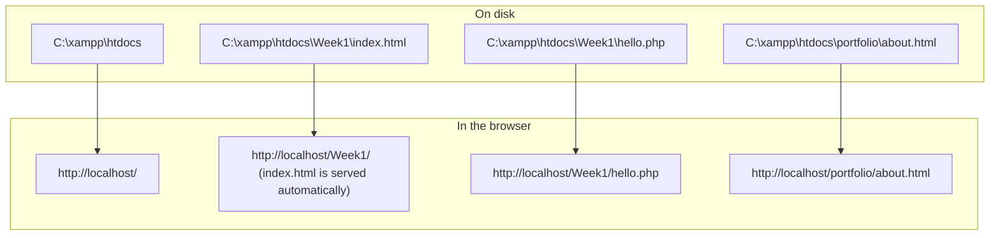

## Why You Need a Development Environment

To build web applications you need **two kinds of tools** on your own computer:

1. A **code editor** to **write** HTML, CSS, JavaScript, PHP and SQL.
2. A **local server environment** to **run** them — a web server, the PHP interpreter and a database — exactly as a real hosting company would, but privately on your laptop.

| Tool | Role in this course | Where to get it |
|---|---|---|
| **Visual Studio Code (VS Code)** | Code editor / IDE | `code.visualstudio.com/Download` |
| **XAMPP** | Local server: **Apache + MySQL (MariaDB) + PHP + phpMyAdmin** | `www.apachefriends.org` |
| **Chrome** or **Firefox** | Test pages; **Developer Tools** for debugging | Already on most computers |
| **Git** *(optional for now)* | Version control | `git-scm.com` |

<Analogy>
VS Code is your **workshop bench and tools**; XAMPP is a **private test track**. You build the car on the bench, then drive it round your own track before taking it out on the public road (a live web server).
</Analogy>

---

## Part 1 — Visual Studio Code

**Visual Studio Code** is a **free source-code editor** made by **Microsoft** (first released in 2015). It runs on **Windows, macOS and Linux** and is the most widely used editor for web development. It is the preferred editor for this course.

> **Don't confuse it with *Visual Studio*** — a much larger, separate IDE used mainly for C# and .NET desktop development.

### Installing VS Code (Windows)

<Step step="1" title="Visit the download page">
Go to **`https://code.visualstudio.com/Download`**.
</Step>

<Step step="2" title="Pick your operating system">
Click the download button for your computer's **OS** — **Windows**, **macOS** (`.zip`) or **Linux** (`.deb` for Ubuntu/Debian, `.rpm` for Fedora). The download starts automatically.
</Step>

<Step step="3" title="Run the installer">
When the download finishes, **double-click** the downloaded **`.exe`** file, or **right-click → Run as administrator**. **Accept the licence agreement** and click **Next**, keeping the default install location.
</Step>

<Step step="4" title="Select additional tasks">
The installer asks which extra tasks to perform. The recommended choices are:

| Option | What it does | Recommended? |
|---|---|---|
| **Create a desktop icon** | Shortcut on the desktop | Optional |
| **Add "Open with Code" action to Windows Explorer file context menu** | Right-click any **file** → *Open with Code* | ✅ Yes |
| **Add "Open with Code" action to Windows Explorer directory context menu** | Right-click any **folder** → open the whole project | ✅ Yes |
| **Register Code as an editor for supported file types** | `.html`, `.css`, `.php` files open in VS Code | ✅ Yes |
| **Add to PATH** | Lets you type `code .` in a terminal to open the current folder | ✅ Yes (ticked by default) |
</Step>

<Step step="5" title="Install and launch">
Click **Install**. When it finishes, tick **Launch Visual Studio Code** and click **Finish**. Congratulations — VS Code is installed.
</Step>

### The VS Code Window


*Figure: The five main areas of the VS Code window.*

| Area | Purpose |
|---|---|
| **1. Activity Bar** | Switch between **Explorer**, **Search**, **Source Control** (Git), **Run and Debug** and **Extensions** |
| **2. Side Bar** | Shows the view you picked — usually the **Explorer** (your project's files and folders) |
| **3. Editor** | Where you **write code**. Each open file is a **tab**; you can split the editor to see two files side by side |
| **4. Panel** | **Integrated terminal**, **Problems** (errors and warnings), **Output** |
| **5. Status Bar** | Current Git branch, error count, cursor position (line/column) and the file's **language mode** |

**Always open a folder, not single files:** use **File → Open Folder…** and choose your project folder (for example `C:\xampp\htdocs\Week1`). The Explorer then shows every file in the project and the terminal starts in that folder.

### Features That Save You Time

| Feature | What it does | Try it |
|---|---|---|
| **Emmet** (built in) | Expands abbreviations into full HTML | In an empty `.html` file type **`!`** then press **Tab** → a complete HTML5 skeleton appears |
| **IntelliSense** | Suggests tags, properties and functions as you type | Type `<inp` and pick `input` from the list |
| **Syntax highlighting** | Colours code by meaning so typos stand out | An unclosed quote turns the rest of the line the wrong colour |
| **Integrated terminal** | A command line inside the editor | **Ctrl + `** (backtick) |
| **Extensions** | Add languages, formatters and tools | **Ctrl + Shift + X** |
| **Source Control** | Stage, commit and push with Git without typing commands | The branch icon on the Activity Bar |

### Recommended Extensions

Open the Extensions view (**Ctrl + Shift + X**), search the name and click **Install**:

| Extension | Why it's useful |
|---|---|
| **Live Server** (Ritwick Dey) | Opens HTML pages in the browser and **reloads automatically** when you save. **Note: it only serves static files — it does not run PHP.** Use XAMPP for `.php` pages. |
| **PHP Intelephense** | PHP autocompletion, error detection and "go to definition" |
| **Prettier – Code formatter** | Formats HTML, CSS and JavaScript neatly and consistently |
| **Auto Rename Tag** | Renaming `<div>` automatically renames the matching `</div>` |

### Essential Keyboard Shortcuts (Windows)

| Shortcut | Action |
|---|---|
| **Ctrl + S** | Save the file (a **●** on the tab means **unsaved changes**) |
| **Ctrl + `** | Show/hide the integrated terminal |
| **Ctrl + B** | Show/hide the side bar |
| **Ctrl + P** | Quick-open a file by typing its name |
| **Ctrl + Shift + P** | **Command Palette** — search for any command |
| **Ctrl + /** | Comment / uncomment the current line |
| **Shift + Alt + F** | Format the whole document |
| **Alt + ↑ / ↓** | Move the current line up or down |
| **Shift + Alt + ↓** | Duplicate the current line |
| **Ctrl + D** | Select the next occurrence of the selected word (multi-cursor editing) |

<ExamTip>
The number-one beginner mistake is **editing a file, forgetting to save, and refreshing the browser** — then wondering why nothing changed. Watch for the **●** on the editor tab, or turn on **File → Auto Save**.
</ExamTip>

---

## Part 2 — XAMPP: Your Local Server

**XAMPP** is a **free, open-source package** from **Apache Friends** that installs a complete web server stack in one go. The name is an acronym:

| Letter | Stands for | Role |
|---|---|---|
| **X** | **Cross-platform** | Runs on Windows, Linux and macOS |
| **A** | **Apache** | The **web server** — receives HTTP requests and sends back pages |
| **M** | **MariaDB** (a drop-in replacement for **MySQL**) | The **database server** |
| **P** | **PHP** | The **server-side language** interpreter |
| **P** | **Perl** | Another server-side scripting language |

It also includes **phpMyAdmin** (a web interface for managing MySQL databases) and, on Windows, optional extras: **FileZilla** (FTP server), **Mercury** (mail server) and **Tomcat** (Java server).

> **Why does XAMPP say "MySQL" if it uses MariaDB?** MariaDB was created by MySQL's original developers and is **compatible** with it — same SQL, same PHP functions, same default port. XAMPP's Control Panel still labels it **MySQL**, and in this course the two names are interchangeable.

### Installing XAMPP (Windows)

<Step step="1" title="Download">
Visit **`https://www.apachefriends.org/`** and click the download button for your **OS**. Choose the **latest PHP 8** version. The download starts automatically.
</Step>

<Step step="2" title="Run the installer">
**Double-click** the downloaded `.exe`, or **right-click → Run as administrator**.
</Step>

<Step step="3" title="Handle the UAC warning">
You may see a warning about **User Account Control (UAC)** advising you **not to install into `C:\Program Files`** because of restricted write permissions. Click **OK** — you will install to **`C:\xampp`**, which avoids the problem.
</Step>

<Step step="4" title="Select components">
Keep at least **Apache**, **MySQL**, **PHP** and **phpMyAdmin** ticked. FileZilla, Mercury, Tomcat and Perl are not needed for this course.
</Step>

<Step step="5" title="Choose the folder and install">
Accept the default folder **`C:\xampp`**, choose a language, and click **Next** until installation begins. It takes a few minutes.
</Step>

<Step step="6" title="Allow through the firewall">
The first time Apache starts, **Windows Defender Firewall** may ask whether to allow it. Allow access on **private networks**.
</Step>

<Step step="7" title="Open the Control Panel">
Tick **"Do you want to start the Control Panel now?"** and click **Finish**. Later you can open it from the Start menu (**XAMPP Control Panel**) or run `C:\xampp\xampp-control.exe`.
</Step>

### The XAMPP Control Panel


*Figure: The XAMPP Control Panel with **Apache** and **MySQL** running (names highlighted green). Screenshot: VulcanSphere, software by Apache Friends, GPL, via Wikimedia Commons.*

Here's how to read it:

| Column / button | Meaning |
|---|---|
| **Module** | The service — **green background = running** |
| **PID(s)** | The Windows **process ID** of the running service |
| **Port(s)** | The network ports it listens on: **Apache → 80 (HTTP) and 443 (HTTPS)**, **MySQL → 3306** |
| **Start / Stop** | Starts or stops that service |
| **Admin** | Opens the service's web page: Apache → **`http://localhost/`** (XAMPP dashboard); MySQL → **`http://localhost/phpmyadmin`** |
| **Config** | Opens configuration files: Apache → **`httpd.conf`**; MySQL → **`my.ini`**; PHP → **`php.ini`** |
| **Logs** | Opens the error logs — **the first place to look when a service won't start** |
| **Netstat** (right side) | Lists which programs are using which ports — finds port conflicts |
| **Shell** | Opens a command prompt set up for XAMPP |
| **Explorer** | Opens the `C:\xampp` folder |
| **Log area** (bottom) | Messages such as *"Status change detected: running"* or error details in red |

### Check That It Works

1. Click **Start** beside **Apache** and **MySQL**. Both module names should turn **green**.
2. Visit **`http://localhost/`** — you should see the **XAMPP dashboard** (Welcome to XAMPP).
3. Visit **`http://localhost/phpmyadmin`** — you should see **phpMyAdmin**, where you'll create databases later in the course.

`localhost` is a special hostname that always means **"this computer"** (IP address **127.0.0.1**). Requests to it never leave your machine.

---

## The Web Root: htdocs

Apache only serves files from **one folder** — the **web root** (also called the *document root*):

| Package | Web root |
|---|---|
| **XAMPP** | **`C:\xampp\htdocs`** |
| **WAMP** | **`C:\wamp64\www`** |
| **MAMP** (macOS) | `/Applications/MAMP/htdocs` |
| **LAMP** (Linux) | Usually **`/var/www/html`** |

Every folder inside the web root becomes part of a **URL**:



**Rules to remember:**
- Put each exercise or project in **its own folder** inside `htdocs` (e.g. `Week1`, `srms`, `portfolio`).
- If a folder contains **`index.html`** or **`index.php`**, Apache serves it automatically when you visit the folder's URL.
- **Avoid spaces** in folder and file names (`my site` becomes `my%20site` in URLs). Use `my-site` or `my_site`.
- Keep names **lower-case** — Linux servers treat `Index.php` and `index.php` as **different files**, even though Windows doesn't.

---

## Your First PHP Test Page

Create **`C:\xampp\htdocs\Week1\hello.php`** in VS Code:

```php
<?php
// hello.php — proves Apache is passing .php files to the PHP interpreter
echo "<h1>Hello from PHP!</h1>";
echo "<p>Today is " . date("l, j F Y") . ".</p>";
echo "<p>You are running PHP version " . phpversion() . ".</p>";
?>
```

Now visit **`http://localhost/Week1/hello.php`**. You should see the heading, **today's date**, and your PHP version.

Right-click the page and choose **View Page Source**. You'll see **only HTML** — no `<?php` and no `echo`. The PHP ran **on the server** and only its **output** was sent to the browser.

<FlowDiagram title="What happens when you visit http://localhost/Week1/hello.php">
<FlowStep title="Browser sends a request">
The browser sends **`GET /Week1/hello.php`** over HTTP to **localhost, port 80** — which is **Apache**, running on your own computer.
</FlowStep>
<FlowStep title="Apache finds the file">
Apache maps the URL onto the web root: `/Week1/hello.php` → **`C:\xampp\htdocs\Week1\hello.php`**. The file exists, so it continues. (If not, it returns **404 Object not found!**)
</FlowStep>
<FlowStep title="PHP runs the script">
Because the file ends in **`.php`**, Apache hands it to the **PHP interpreter**. PHP executes the code between `<?php` and `?>` — calling `date()` and `phpversion()` — and produces **plain HTML** as output.
</FlowStep>
<FlowStep title="Apache sends the response">
Apache sends that HTML back with the status **200 OK**. A `.html` file would have skipped the PHP step and been sent unchanged.
</FlowStep>
<FlowStep title="Browser renders the page">
The browser receives ordinary HTML and displays it. It never sees the PHP source — which is why server-side code (passwords, database queries) stays private.
</FlowStep>
</FlowDiagram>

**See your full PHP configuration:** create `info.php` containing just `<?php phpinfo(); ?>` and visit it. It lists the PHP version, loaded extensions (look for **mysqli** and **pdo_mysql**, which you'll need for databases) and the location of **`php.ini`**. **Delete this file afterwards** — on a real server it reveals details attackers find useful.

<MCQ question="You open C:\xampp\htdocs\Week1\hello.php by double-clicking it, and the browser shows the raw PHP code. Why?">
<Option>PHP is not installed with XAMPP.</Option>
<Option>The file should have been saved as hello.html.</Option>
<Option correct>The browser opened it with a file:// address, so no web server ran the PHP.</Option>
<Option>Apache only runs PHP files stored on the desktop.</Option>
<Explain>
Double-clicking loads the file **straight from disk** (`file:///C:/xampp/htdocs/...`). The browser can't execute PHP — only a web server with the PHP interpreter can. Visit **`http://localhost/Week1/hello.php`** instead, so the request goes through **Apache**.
</Explain>
</MCQ>

---

## Troubleshooting Common Problems

| Symptom | Likely cause | Fix |
|---|---|---|
| **Apache won't start**; log says port **80** or **443** is in use | Another program is using the port — commonly **IIS** (World Wide Web Publishing Service), **Skype** (older versions), **VMware**, or another web server | Click **Netstat** to see which program holds the port. Stop that program/service, **or** change Apache's port: **Config → httpd.conf**, change `Listen 80` to `Listen 8080` and `ServerName localhost:80` to `ServerName localhost:8080`, then use **`http://localhost:8080/`** |
| **MySQL won't start** or *"MySQL shutdown unexpectedly"* | Another MySQL service already on port **3306**, or XAMPP was closed abruptly and the data files were left in a bad state | Stop any other MySQL service in **Windows Services**; read **Logs → mysql_error.log** for the exact reason. Always **Stop** services before shutting down |
| Page shows **raw PHP code** | Opened with `file://`, or saved with a `.html` extension | Use `http://localhost/…` and save as **`.php`** |
| **"Object not found!" (404)** | Wrong folder or spelling in the URL | Check the file is **inside `htdocs`** and the path matches exactly |
| **Blank white page** for a `.php` file | A PHP error with error display turned off | Check `display_errors = On` in **php.ini** (development only) and look at Apache's **error.log** |
| Changes **don't appear** | File not saved, or the browser is showing a **cached** copy | Save (**Ctrl + S**) and hard-refresh (**Ctrl + F5**) |
| **"Access forbidden!" (403)** | Trying to list a folder that has no index file, or a restricted path | Add an `index.php`/`index.html`, or request a specific file |

<Reveal question="Troubleshooting practice: a classmate's Apache starts, then immediately stops. The log shows 'Port 80 in use by Unable to open process with PID 4!'. What is going on and what are two ways to fix it?">
**PID 4** is the Windows **System** process — usually the **World Wide Web Publishing Service (IIS)** or another Windows HTTP service is holding port 80. Fix 1: open **Services** (Win + R → `services.msc`), **stop** *World Wide Web Publishing Service* and set it to **Manual**, then start Apache again. Fix 2: leave that service alone and **move Apache to another port** — in `httpd.conf` change `Listen 80` → `Listen 8080` and `ServerName localhost:80` → `ServerName localhost:8080`, then browse to `http://localhost:8080/`.
</Reveal>

---

## Other Local Server Packages

XAMPP isn't the only choice. They all contain the same idea — **Apache (or Nginx) + MySQL/MariaDB + PHP**:

| Package | Platform | Notes |
|---|---|---|
| **XAMPP** | Windows, Linux, macOS | Cross-platform; the course's choice |
| **WAMP** (WampServer) | **Windows** only | Web root is **`www`**; tray icon turns green when ready |
| **MAMP** | **macOS** (and Windows) | Popular with Mac users |
| **LAMP** | **Linux** | Not a single installer — you install Apache, MySQL and PHP with the package manager; web root `/var/www/html` |
| **Laragon** | Windows | Lightweight and fast; auto-creates pretty URLs such as `project.test` |

<ExamTip>
Know what each letter stands for: **W**indows/**L**inux/**M**acOS + **A**pache + **M**ySQL + **P**HP. XAMPP's **X** means **cross-platform**, and its extra **P** is **Perl**.
</ExamTip>

---

## Security Note: XAMPP Is for Development Only

XAMPP is configured for **convenience, not security**:
- MySQL's **`root`** user has **no password** by default.
- phpMyAdmin is reachable by anyone who can reach your machine.
- Error messages show internal details.

That's fine on your own laptop, but **never use XAMPP as a public production server**. Real hosting uses hardened configurations (covered in the Testing and Deployment lesson).

---

## Optional: Installing Git

Download Git from **`https://git-scm.com/`** and install with the default options. Then, in the VS Code terminal (**Ctrl + `**):

```bash
git --version
git config --global user.name "Ada Obi"
git config --global user.email "ada.obi@example.com"
```

The first command confirms Git is installed; the other two record **who you are** in every commit you make. Git is covered properly in the Web Architecture and Tools lesson.

---

## Practical Checklist

- [ ] VS Code installed and a folder opened with **File → Open Folder**
- [ ] XAMPP installed in **`C:\xampp`**
- [ ] **Apache** and **MySQL** both **green** in the Control Panel
- [ ] **`http://localhost/`** shows the XAMPP dashboard
- [ ] **`http://localhost/phpmyadmin`** opens phpMyAdmin
- [ ] **`C:\xampp\htdocs\Week1\index.html`** displays at **`http://localhost/Week1/`**
- [ ] **`hello.php`** shows today's date at **`http://localhost/Week1/hello.php`**
- [ ] Opened **Developer Tools** (F12) and looked at the **Elements** and **Console** tabs

**Assignment evidence (from the course):** screenshots of the **XAMPP Control Panel with Apache running**, your **source code in VS Code**, and the **rendered page in the browser**.

---

## Practice Questions

<Reveal question="What does each letter of XAMPP stand for, and what is the role of each component?">
**X** — cross-platform (Windows, Linux, macOS). **A** — **Apache**, the web server that receives HTTP requests and returns responses. **M** — **MySQL/MariaDB**, the database server that stores application data. **P** — **PHP**, the server-side scripting language. **P** — **Perl**, another scripting language. XAMPP also bundles **phpMyAdmin** for managing databases through the browser.
</Reveal>

<Reveal question="What is the web root in XAMPP and in WAMP, and how does a file's location map to its URL?">
XAMPP: **`C:\xampp\htdocs`**; WAMP: **`www`** (e.g. `C:\wamp64\www`). The path **after** the web root becomes the URL path after `http://localhost/`. So `C:\xampp\htdocs\Week1\hello.php` is served at **`http://localhost/Week1/hello.php`**, and a folder containing `index.html` or `index.php` is served at the folder URL, e.g. `http://localhost/Week1/`.
</Reveal>

<Reveal question="Which default ports do Apache and MySQL use, and why does it matter?">
Apache uses **80** (HTTP) and **443** (HTTPS); MySQL uses **3306**. Only one program can listen on a port at a time, so if another program (IIS, Skype, another MySQL) already holds that port, the XAMPP service **fails to start**. You then stop the other program or change the port in the configuration file.
</Reveal>

<Reveal question="Why can't the VS Code Live Server extension be used to test PHP pages?">
Live Server is a small **static file server** — it sends files to the browser **as they are** and reloads the page on save. It has **no PHP interpreter**, so `.php` files are not executed. PHP pages must be served by **Apache with PHP**, i.e. through XAMPP at `http://localhost/…`.
</Reveal>

<Reveal question="After View Page Source on hello.php you see no PHP code. Explain why.">
PHP is a **server-side** language. Apache passed the file to the PHP interpreter, which **executed** the code and produced **HTML output**; only that output was sent in the HTTP response. The browser never receives the PHP source code.
</Reveal>

<Takeaway>
You need an **editor** and a **local server**. **VS Code** (Microsoft, free) — open a **folder**, use **Emmet** (`!` + Tab), the **integrated terminal** (Ctrl + `), and extensions; **save before refreshing**. **XAMPP** = **cross-platform, Apache, MySQL/MariaDB, PHP, Perl** + phpMyAdmin; install to **`C:\xampp`**, **Start Apache and MySQL** (green = running; ports **80/443** and **3306**). Files go in the web root **`htdocs`** (WAMP: `www`) and are opened through **`http://localhost/folder/file`** — never by double-clicking — so Apache runs the PHP. Port conflicts are the usual start-up problem: check **Netstat** and **Logs**. XAMPP is for **development only**.
</Takeaway>

## Exam Tips

**What lecturers test:**
- The steps to install VS Code and XAMPP
- What XAMPP stands for and the role of each component
- The **web root** (`htdocs` / `www`) and how to run a page at `http://localhost/…`
- Components of a local server package (Apache, MySQL/MariaDB, PHP, phpMyAdmin)

**Common mistakes:**
- Saving files outside `htdocs`, then getting **404 Object not found**
- Opening `.php` files by double-clicking (shows raw code)
- Writing "XAMPP stands for Windows…" — the **X** means **cross-platform**

**Likely question:**
> "Describe the steps involved in setting up a local web development environment using XAMPP and VS Code, and explain how a PHP page placed in the web root is processed when requested from a browser." (10 marks)
