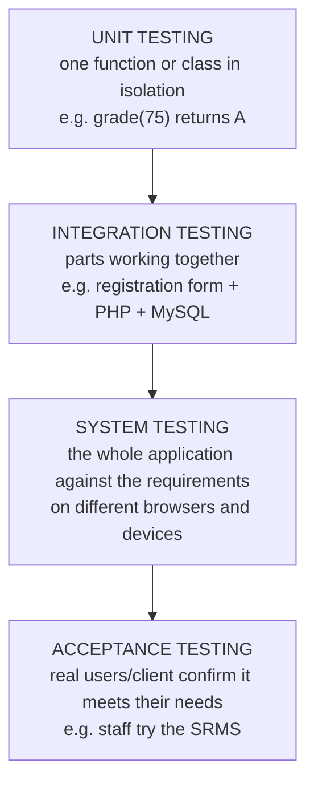

## Why Testing Matters

Every application has bugs; the question is **who finds them first — you or your users**. A bug found while coding costs minutes to fix. The same bug found after launch — say, a result-computation error in a student portal — costs **data corrections, complaints, lost trust**, and sometimes money or security.

| Term | Meaning |
|---|---|
| **Quality assurance (QA)** | The **whole process** that ensures quality: standards, reviews, planning, testing — aimed at **preventing** defects |
| **Software testing** | **Executing the software** to **find defects** and check it meets its requirements |
| **Bug / defect** | A flaw that makes the software behave incorrectly |
| **Debugging** | **Locating and fixing** the cause of a defect once a test (or user) reveals it |

Testing is the **Testing** phase of the SDLC — but in practice it happens **throughout** development.

---

## Software Testing Methods

### Levels of Testing



| Level | Tests | Usually done by |
|---|---|---|
| **Unit** | The **smallest pieces** — individual functions and methods | Developers (often automated) |
| **Integration** | **Interactions** between modules — PHP ↔ database, page ↔ session | Developers/testers |
| **System** | The **complete system** end to end against the requirements | Testers |
| **Acceptance** (UAT) | Whether it's **acceptable to the users/client** | Users, client |

### Black-Box vs White-Box Testing

| **Black-box** | **White-box** |
|---|---|
| Tester **doesn't look at the code** — only inputs and outputs | Tester **uses knowledge of the code's structure** |
| "Does the login accept valid users and reject invalid ones?" | "Is every branch of the `if…elseif` in `grade()` executed by some test?" |
| Based on **requirements** | Based on **code paths**, conditions, loops |
| Techniques: **equivalence partitioning**, **boundary value analysis** | Techniques: statement/branch coverage |

(**Grey-box** testing mixes both — e.g. testing through the UI while checking the database.)

### Types of Testing for Web Applications

| Type | Checks | Example |
|---|---|---|
| **Functional** | Features do what the requirements say | Adding a student saves it and shows it in the list |
| **Regression** | Old features **still work** after a change | Re-run all tests after adding search |
| **Usability** | Users can complete tasks easily | Watch five students register for courses |
| **Compatibility** | Works on different **browsers, devices, screen sizes** | Chrome, Firefox, Safari; Android and iPhone |
| **Performance / load** | Speed, and behaviour under **many users** | 2,000 students logging in on registration day |
| **Security** | Resistance to attacks | SQL injection, XSS, CSRF, access to others' records |
| **Accessibility** | Usable by people with disabilities | Keyboard-only use, screen reader, contrast |

**Manual testing** — a person follows test steps. **Automated testing** — code runs the tests (unit tests, browser automation); fast to repeat, ideal for **regression testing**.

---

## Writing Test Cases

A **test case** describes one check: the **input**, the **expected result**, and (when run) the **actual result**.

| ID | Description | Input | Expected result | Actual | Pass/Fail |
|---|---|---|---|---|---|
| TC-01 | Add a valid student | IFT/2026/001, Ada, 300 | "Student added", appears in list | | |
| TC-02 | Duplicate matric number | IFT/2026/001 again | "Already registered", not saved | | |
| TC-03 | Empty required field | First name blank | "Names are required", not saved | | |
| TC-04 | Level below range | 50 | "Level must be 100 … 700" | | |
| TC-05 | Suspicious input | Name `<script>alert(1)</script>` | Shown as text, no alert | | |
| TC-06 | SQL-looking search | `' OR '1'='1` | No error; treated as text | | |

These come straight from the course's *Testing the SRMS* list.

### Choosing Inputs: Equivalence Partitions and Boundaries

**Equivalence partitioning:** divide inputs into groups the program should treat the **same way**, and test **one value from each** — for a score: invalid below 0, **F** (0–39), **E** (40–44) … **A** (70–100), invalid above 100.

**Boundary value analysis:** bugs love **edges**, so test values **at and next to each boundary**: −1, 0, 39, **40**, 44, **45**, 49, **50**, 59, **60**, 69, **70**, 100, 101.

<ExamTip>
If asked to "design test cases" for a range like *level 100–700*, list **valid** values (100, 400, 700), **invalid** values (99, 701, -5, "abc", empty) and the **boundaries** — and state the **expected result** for each. A test case without an expected result isn't a test case.
</ExamTip>

### Automated Unit Tests — Find the Bug

This playground has a `grade()` function and a tiny **automated test runner** with boundary-value tests. **Run it: one test fails.** Find the bug in `grade()`, fix it and Run again until everything passes:

<PhpPlayground title="Unit tests with boundary values — find the bug" height="300">

```php
<?php
// The code under test (it has ONE bug)
function grade(int $score): string {
    if ($score < 0 || $score > 100) return "Invalid";
    if ($score >= 70) return "A";
    if ($score >= 60) return "B";
    if ($score > 50) return "C";
    if ($score >= 45) return "D";
    if ($score >= 40) return "E";
    return "F";
}

// A tiny test runner
$passed = 0;
$failed = 0;
function check($description, $actual, $expected) {
    global $passed, $failed;
    if ($actual === $expected) {
        $passed++;
        echo "<div style='color:#15803d'>✓ $description</div>";
    } else {
        $failed++;
        echo "<div style='color:#dc2626'>✗ $description — expected <b>$expected</b>, got <b>$actual</b></div>";
    }
}

// Test cases: equivalence partitions + boundaries
$cases = [
    [-1, "Invalid"], [0, "F"], [39, "F"], [40, "E"], [44, "E"], [45, "D"],
    [49, "D"], [50, "C"], [59, "C"], [60, "B"], [69, "B"], [70, "A"], [100, "A"], [101, "Invalid"],
];
foreach ($cases as [$score, $expected]) {
    check("grade($score) should be $expected", grade($score), $expected);
}
echo "<p><b>$passed passed, $failed failed</b></p>";
```

</PhpPlayground>

<Reveal question="Where is the bug?">
`if ($score > 50) return "C";` should be **`>= 50`**. A score of exactly **50** falls through to "D". Only the **boundary** test `grade(50)` catches it — tests with 55 or 58 would all pass. That's why boundary value analysis matters.
</Reveal>

Real projects use a testing framework — for PHP, **PHPUnit**:

```php
use PHPUnit\Framework\TestCase;

final class GradeTest extends TestCase
{
    public function testFiftyIsC(): void
    {
        $this->assertSame("C", grade(50));
    }

    public function testNegativeScoreIsInvalid(): void
    {
        $this->assertSame("Invalid", grade(-1));
    }
}
```

Run with `vendor/bin/phpunit` after installing it with **Composer**. Automated tests are re-run after **every change** — cheap, fast **regression testing**.

---

## Debugging Techniques

| Technique | How |
|---|---|
| **Read the error message** | PHP tells you the **type**, **message**, **file** and **line**. The real mistake is often on that line **or just above** it |
| **Print what's happening** | `var_dump($x)`, `print_r($array)` (inside `<pre>`), `echo "reached step 2";`, `die()` to stop at a point |
| **Enable error reporting** (development) | `error_reporting(E_ALL); ini_set('display_errors', '1');` — never in production |
| **Check the logs** | Apache **`error.log`** (XAMPP: `C:\xampp\apache\logs\error.log`); your own `error_log()` lines |
| **Browser DevTools** | **Console** for JavaScript errors; **Network** tab for each request's **status code**, form data and response; **Elements** for HTML/CSS |
| **Step debugger** | **Xdebug** + VS Code's *PHP Debug* extension: set **breakpoints**, run line by line, **inspect variables** |
| **Isolate the problem** | Comment out half the code (**binary search**), reproduce with the smallest input |
| **Rubber duck debugging** | Explain the code line by line to someone (or a rubber duck) — you often spot the mistake yourself |
| **Version control** | `git diff` shows what changed since it last worked; revert to test |

### Common Web Bugs and Their Usual Causes

| Symptom | Usual cause |
|---|---|
| **Blank white page** | A fatal error with `display_errors` off — check the log |
| **"Headers already sent"** | Output (even a space or blank line before `<?php`) before `header()`, `setcookie()` or `session_start()` |
| **Undefined variable / array key** | Misspelt or case-different name; form field `name` mismatch; missing `isset()`/`??` |
| **SQL error / no results** | Wrong table/column name, missing quotes, database not selected; print the SQL |
| **CSS or JS not loading** | Wrong **path**; check the **Network** tab for **404**; browser **cache** (Ctrl + F5) |
| **Changes don't appear** | File not saved; editing a different copy than the server serves |
| **Works on localhost, fails online** | Different PHP version, file-name **case** (Linux is case-sensitive), wrong database credentials, missing extensions |

<PhpPlayground title="Debugging practice — why is the total wrong?" height="240">

```php
<?php
// Expected output: Total units = 12, and the courses listed.
// Actual output is wrong. Use var_dump() / print_r() to find TWO bugs.
$courses = [
    ["code" => "IFT 302", "units" => 3],
    ["code" => "INS 204", "units" => 3],
    ["code" => "INS 202", "units" => 3],
    ["code" => "COS 202", "units" => "3"],
];

$total = 0;
for ($i = 1; $i < count($courses); $i++) {
    $total += $courses[$i]["units"];
}

echo "<ul>";
foreach ($courses as $course) {
    echo "<li>" . $course["Code"] . "</li>";
}
echo "</ul>";
echo "Total units = $total";
```

</PhpPlayground>

<Reveal question="The two bugs">
1) The loop starts at **`$i = 1`**, skipping the first course (arrays start at **0**) — total is 9 instead of 12. Fix: `$i = 0`, or use `foreach`. 2) **`$course["Code"]`** should be **`$course["code"]`** — array keys are **case-sensitive**, so PHP warns *Undefined array key "Code"* and prints nothing. (The string `"3"` in the last course is **not** a bug: PHP converts numeric strings when adding.)
</Reveal>

---

## Website Validation

**Validation** checks your pages against **standards**, catching problems browsers silently tolerate:

| Tool | Checks |
|---|---|
| **W3C Markup Validation Service** — `validator.w3.org` | **HTML** errors: unclosed tags, duplicate `id`s, missing `alt`, invalid nesting |
| **W3C CSS Validation Service** — `jigsaw.w3.org/css-validator` | **CSS** syntax errors and invalid properties |
| **Lighthouse** (Chrome DevTools → *Lighthouse*) | Scores for **Performance, Accessibility, Best Practices and SEO**, with specific fixes |
| **WAVE** — `wave.webaim.org` | **Accessibility** problems: contrast, labels, headings, alt text |
| **Device toolbar** (DevTools, Ctrl + Shift + M) | **Responsive** layout at phone and tablet sizes |
| **Link checkers** | Broken links (404s) across the site |

Validating **before** deployment avoids layout bugs that appear only in some browsers, and improves **accessibility** and **search ranking**.

---

## Publishing and Deployment

**Deployment** is putting the application on a **live server** so users can reach it on the Internet.

### Environments

| Environment | Purpose |
|---|---|
| **Development** | Your laptop (XAMPP) — errors shown, test data |
| **Staging / testing** | A copy of the live setup for final testing |
| **Production** | The **live** site real users use — errors hidden, real data, backups |

### Deployment Steps

<FlowDiagram title="From localhost to a live website">
<FlowStep title="1. Prepare the code">
Turn **off** `display_errors`; remove test files and `phpinfo()` pages; move credentials into a config file **outside the web root**; run your tests; commit to **Git**.
</FlowStep>
<FlowStep title="2. Choose hosting">
Pick a hosting plan with the right **PHP and MySQL versions**, enough storage and bandwidth, backups and SSL (see *Hosting considerations* below).
</FlowStep>
<FlowStep title="3. Register a domain">
Buy a name from a **registrar** — e.g. `.com.ng` / `.ng` through a **NiRA-accredited** registrar, or `.com` internationally. You rent it yearly.
</FlowStep>
<FlowStep title="4. Point the domain at the server (DNS)">
In the DNS settings, set the **nameservers** your host gives you, or create an **A record** (domain → the server's **IP address**) and a **CNAME** for `www`. Changes take minutes to a few hours to **propagate**.
</FlowStep>
<FlowStep title="5. Upload the files">
Copy the project into the host's web root (often **`public_html`**) using **SFTP/FTP** (e.g. **FileZilla**), the **cPanel File Manager**, or **Git** (`git pull` on the server, or an automatic deploy).
</FlowStep>
<FlowStep title="6. Move the database">
**Export** it from phpMyAdmin on localhost (**Export → SQL**), create a database and a **user with limited privileges** on the host, **Import** the SQL file, and update the connection settings (`db.php`) with the new name, user and password.
</FlowStep>
<FlowStep title="7. Enable HTTPS">
Install a **TLS certificate** (many hosts offer free **Let's Encrypt**/AutoSSL) and **redirect HTTP to HTTPS**.
</FlowStep>
<FlowStep title="8. Test the live site">
Run your test cases again **on production**: forms, logins, uploads, links, mobile layout. Check the server's **error log**.
</FlowStep>
<FlowStep title="9. Monitor and maintain">
Schedule **backups** (files **and** database), watch **uptime** and errors, apply **security updates**, and deploy fixes through the same careful process.
</FlowStep>
</FlowDiagram>

### Hosting Types

| Type | What you get | Suits | Trade-off |
|---|---|---|---|
| **Shared hosting** | Space on a server **shared with many sites**; control panel (cPanel), PHP + MySQL ready | Student projects, small business sites | Cheapest and easiest; limited resources and control |
| **VPS** (Virtual Private Server) | Your own **virtual machine** with root access | Growing apps, custom setups | More power and control; **you** manage the server |
| **Dedicated server** | A **whole physical machine** | Large, high-traffic systems | Expensive; full responsibility |
| **Cloud (IaaS)** — AWS, Azure, Google Cloud | Rent servers, databases, storage **on demand** | Apps that must **scale** | Flexible, pay-as-you-go; complex, bills can surprise |
| **Platform as a Service (PaaS)** | Push your code; the platform runs it | Framework apps (Laravel, Django, Flask) | Very little server work; less control |
| **Static hosting** — Netlify, GitHub Pages, Vercel | Serves HTML/CSS/JS files | Static sites, front-ends | Often free; **no PHP/MySQL** on the server |

### Hosting Considerations

| Consideration | Questions to ask |
|---|---|
| **Cost** | Monthly/yearly price, renewal price, currency (naira vs dollar billing) |
| **Reliability (uptime)** | Guaranteed uptime? **99.9%** still allows about **8.8 hours** of downtime a year; 99.99% about 53 minutes |
| **Performance and location** | Where are the servers? Closer to your users means **lower latency**; enough RAM/CPU for peak times (registration day!) |
| **Software support** | Supported **PHP version**, **MySQL/MariaDB**, extensions, SSH, Git, Composer |
| **Storage and bandwidth** | Enough disk for uploads; monthly data transfer limits |
| **Security** | Free **SSL**, firewall, malware scanning, isolation between accounts |
| **Backups** | Automatic, how often, easy to restore? |
| **Scalability** | Can you upgrade without moving hosts? |
| **Support** | 24/7 support, response time, documentation |
| **Legal and data protection** | Where personal data is stored and how it's protected — in Nigeria, the **Nigeria Data Protection Act (2023)** applies to personal data such as students' records |

<MCQ question="A PHP site works on XAMPP but, after uploading to a Linux host, images in /Images/logo.png don't load, though the file is uploaded as images/logo.png. Why?">
<Option>Linux hosts don't support PNG files.</Option>
<Option correct>Linux file systems are case-sensitive, so /Images and /images are different folders.</Option>
<Option>The database wasn't imported.</Option>
<Option>HTTPS blocks images.</Option>
<Explain>
Windows (XAMPP) ignores letter case in paths, but **Linux treats `Images` and `images` as different names**, so the request returns **404**. Keep file and folder names **lower-case** and consistent. The Network tab in DevTools would show the 404.
</Explain>
</MCQ>

---

## Practice Questions

<Reveal question="Differentiate between unit, integration, system and acceptance testing.">
**Unit testing** checks the **smallest parts** (a function or class) in isolation. **Integration testing** checks that **modules work together** (e.g. PHP with the database). **System testing** checks the **whole application** against its requirements. **Acceptance testing** checks, usually with **users/the client**, that the system meets their needs and is ready for use.
</Reveal>

<Reveal question="Explain black-box and white-box testing with an example of each.">
**Black-box** testing examines behaviour **without looking at the code**, using inputs and expected outputs from the requirements — e.g. entering an invalid email and expecting an error. **White-box** testing uses **knowledge of the code's structure** to exercise its paths — e.g. choosing scores so that **every branch** of `grade()`'s `if…elseif` chain runs.
</Reveal>

<Reveal question="Design boundary-value test cases for a field that accepts a student level from 100 to 700.">
Valid boundaries and inside values: **100**, **700**, 400 → accepted. Just outside: **99**, **701** → rejected ("Level must be between 100 and 700"). Other invalid inputs: **0**, **-100**, **"abc"**, **empty** → rejected. (If levels must be multiples of 100: **250** → rejected.)
</Reveal>

<Reveal question="Describe five debugging techniques for a PHP web application.">
Any five: **read the error message** (type, file, line); **print values** with `var_dump()`/`print_r()`/`echo`; **enable error reporting** in development (`E_ALL`, `display_errors`); **check server logs** (Apache `error.log`, `error_log()`); use **browser DevTools** (Console, Network tab status codes); use a **step debugger** (Xdebug breakpoints); **isolate** the problem by commenting out code; **rubber duck** explanation; compare versions with **Git**.
</Reveal>

<Reveal question="Outline the steps to deploy a PHP and MySQL application to a live server.">
1) **Prepare** the code for production (hide errors, secure config, test). 2) **Choose hosting** with suitable PHP/MySQL. 3) **Register a domain**. 4) Configure **DNS** (nameservers or A record to the server IP). 5) **Upload files** via SFTP/FTP, cPanel or Git. 6) **Export** the database from phpMyAdmin, **import** it on the host, create a limited-privilege user and update `db.php`. 7) Enable **HTTPS**. 8) **Test** the live site. 9) Set up **backups, monitoring** and maintenance.
</Reveal>

<Reveal question="State five factors to consider when choosing a web host.">
Any five: **cost**; **uptime/reliability** (SLA); **performance and server location** (latency to users); **software support** (PHP/MySQL versions, SSH, Git); **storage and bandwidth**; **security** (SSL, firewall); **backups**; **scalability**; **support quality**; **data protection/legal** requirements.
</Reveal>

<Takeaway>
**QA** is the whole process of preventing defects; **testing** executes software to find them; **debugging** finds and fixes their causes. **Levels:** unit → integration → system → acceptance. **Black-box** (requirements, inputs/outputs) vs **white-box** (code paths). Types: functional, **regression**, usability, compatibility, performance/load, security, accessibility. Write **test cases** with inputs and **expected results**; choose inputs with **equivalence partitioning** and **boundary values**; automate unit tests (PHPUnit). **Debug** by reading errors, printing values, logs, DevTools (Console/Network), Xdebug breakpoints and isolating the problem. **Validate** with the W3C HTML/CSS validators, Lighthouse and WAVE. **Deploy:** prepare → host → domain → DNS → upload (SFTP/cPanel/Git) → export/import database → **HTTPS** → test live → back up and monitor. Choose hosting (shared, VPS, dedicated, cloud, PaaS, static) by **cost, uptime, location, software, resources, security, backups, scalability, support and data protection**.
</Takeaway>

## Exam Tips

**What lecturers test:**
- **Software testing methods** — levels, black-box vs white-box, types
- Writing **test cases** for a form or function
- **Debugging techniques** and tools
- **Website validation** tools and why validation matters
- **Publishing and deployment** steps; **hosting considerations** and hosting types

**Common mistakes:**
- Confusing testing (finding defects) with debugging (fixing them)
- Test cases without expected results
- Forgetting the **database** when describing deployment
- Leaving `display_errors` on in production

**Likely question:**
> "Distinguish between black-box and white-box testing. Design five test cases for a student registration form. Describe the steps involved in deploying a PHP/MySQL web application and discuss four factors to consider when choosing a hosting provider." (20 marks)
