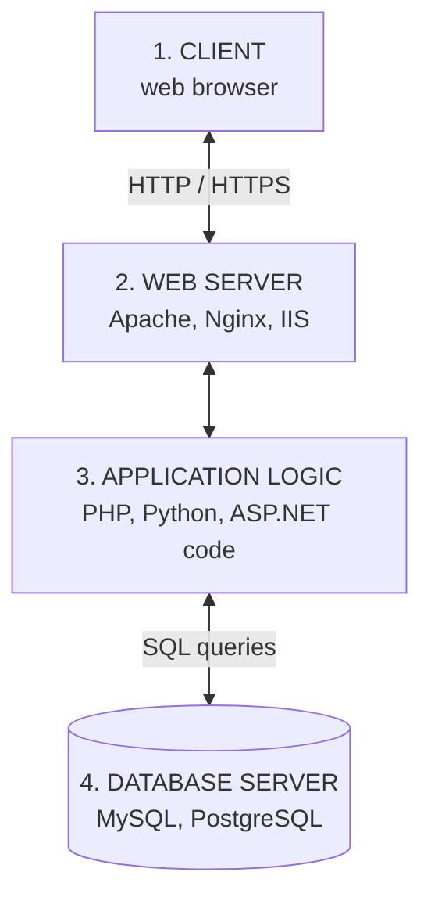
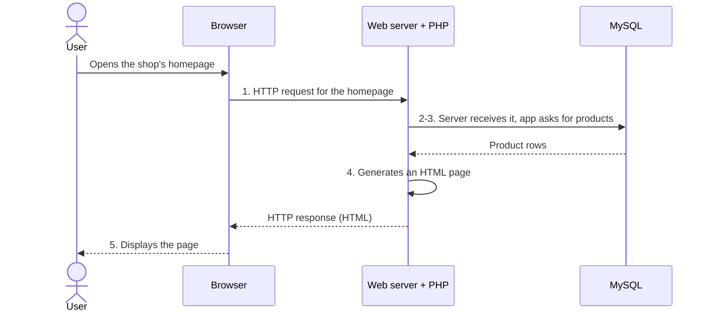
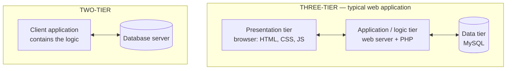
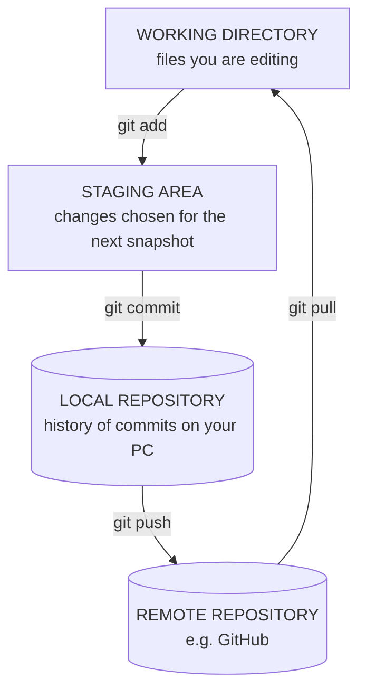
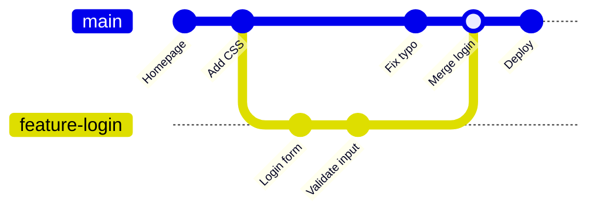

## What Happens Behind the Scenes?

We use websites every day and expect them to respond almost instantly. But what actually happens between clicking a link and seeing the page? **How do the different components of a web application interact, and how is your request processed from your browser to the server and back?**

This lesson answers that question, then introduces the tools developers use to build and manage web applications: **Apache**, **development environments**, **Git** and **MySQL**.

---

## Website Architecture

**Web development architecture** is the **structure and organisation of the components that work together to deliver websites and web applications**. It defines **how clients, servers, databases and other services communicate over a network**.

It is the **foundational skeleton** that ensures a system handles **security, performance and scaling** smoothly, even under heavy global traffic.

There are several types of web architecture — **client-server**, **serverless** (code runs as on-demand cloud functions), **microservices** (many small cooperating services) and others. This course focuses on the **client-server architecture**, which the others build on.

A **typical web application** consists of four parts:



The interaction between these components is what makes a website **dynamic and interactive**.

---

## Client-Server Architecture

**Client-server architecture** is a **computing model** in which **clients request services or resources**, and **servers provide those services** over a network.

The client and server communicate using **protocols** such as **HTTP** (HyperText Transfer Protocol) or **HTTPS** (HTTP Secure — HTTP encrypted with TLS).

<Analogy>
A **restaurant**: you (the **client**) don't walk into the kitchen. You give your order to the waiter (**HTTP request**); the kitchen (**server**) prepares it, fetching ingredients from the store room (**database**); the waiter brings back your plate (**HTTP response**). Many customers are served by one kitchen — and if the kitchen closes, nobody eats.
</Analogy>

### Components of Client-Server Architecture

<Tabs>
<Tab label="Client">

### Client

A **client** is **any device or software application that requests information from a server**.

**Examples:** **Google Chrome**, **Mozilla Firefox**, **Microsoft Edge**, **Safari** (and mobile apps that talk to a server).

**Functions of the client:**
- **Sends requests** to the server
- **Displays web pages** (renders HTML and CSS)
- **Collects user input** (forms, clicks, typing)
- **Runs client-side scripts** (JavaScript)

</Tab>
<Tab label="Server">

### Server

A **server** is **a computer or software that receives requests, processes them, and sends responses to clients**.

**Examples:** **Apache HTTP Server**, **Nginx**, **Microsoft Internet Information Services (IIS)**.

**Functions of the server:**
- **Hosts the websites** (stores their files)
- **Processes application logic** (runs PHP, Python, etc.)
- **Manages user authentication** (logins)
- **Accesses databases**
- **Serves web pages and files**

</Tab>
<Tab label="Database server">

### Database Server

A **database server** **stores and retrieves data requested by applications**.

**Examples:** **MySQL**, **PostgreSQL**, **Oracle Database**, **Microsoft SQL Server**.

The browser **never talks to the database directly** — only the application code on the web server does. This protects the data.

</Tab>
</Tabs>

### How Client-Server Architecture Works

The course's example — a user visits an **online shopping website**:



1. The **browser sends a request** for the homepage.
2. The **web server receives** the request.
3. The **application retrieves products** from the **MySQL database**.
4. The **server generates an HTML page**.
5. The **browser displays** the page to the user.

Step through the full journey — including the parts that happen before the request even reaches the server:

<FlowDiagram title="The request-response cycle, step by step">
<FlowStep title="1. You enter a URL">
You type `https://shop.example.com/products.php` or click a link. The browser splits the URL into **scheme** (https), **host** (shop.example.com) and **path** (/products.php).
</FlowStep>
<FlowStep title="2. DNS lookup">
Computers find each other by **IP address**, not by name. The browser asks the **Domain Name System (DNS)** — the Internet's phone book — for the IP address of `shop.example.com` (e.g. `203.0.113.10`).
</FlowStep>
<FlowStep title="3. Connection">
The browser opens a **TCP connection** to that IP on **port 443** (HTTPS) or **80** (HTTP). For HTTPS, a **TLS handshake** sets up encryption so nobody in between can read the traffic.
</FlowStep>
<FlowStep title="4. HTTP request">
The browser sends an **HTTP request**: a **method** (`GET`), the **path** (`/products.php`), and **headers** (browser type, accepted formats, cookies).
</FlowStep>
<FlowStep title="5. Server processing">
**Apache** receives the request, finds `products.php` and hands it to **PHP**. The PHP code runs the business logic — for example checking if the user is logged in.
</FlowStep>
<FlowStep title="6. Database query">
PHP sends an **SQL query** to **MySQL**: `SELECT name, price FROM products`. MySQL returns the matching rows.
</FlowStep>
<FlowStep title="7. HTTP response">
PHP builds an **HTML page** from the rows. Apache sends it back with a **status code** (`200 OK`) and headers (`Content-Type: text/html`).
</FlowStep>
<FlowStep title="8. Rendering">
The browser **parses the HTML**, requests the **CSS, JavaScript and images** it references (more requests!), builds the page and **displays it**. The whole cycle usually takes well under a second.
</FlowStep>
</FlowDiagram>

### Inside an HTTP Request and Response

HTTP messages are plain text. A request looks like this:

```http
GET /products.php?category=phones HTTP/1.1
Host: shop.example.com
User-Agent: Mozilla/5.0 (Windows NT 10.0) Chrome/126.0
Accept: text/html
Cookie: PHPSESSID=8f3a91c2
```

…and the server's response:

```http
HTTP/1.1 200 OK
Content-Type: text/html; charset=UTF-8
Content-Length: 5120

<!DOCTYPE html>
<html> ... the generated page ... </html>
```

**Common HTTP methods:**

| Method | Purpose | Example |
|---|---|---|
| **GET** | **Retrieve** a resource; data goes in the URL | Viewing a page, searching |
| **POST** | **Send data** to be processed; data goes in the request body | Submitting a login or registration form |
| **PUT / PATCH** | **Update** an existing resource | Editing a profile (mostly in APIs) |
| **DELETE** | **Remove** a resource | Deleting a post (mostly in APIs) |

**Common status codes:**

| Code | Meaning | When you see it |
|---|---|---|
| **200 OK** | Success | The page loaded normally |
| **301 / 302** | Moved permanently / temporarily | Redirect, e.g. after logging in |
| **304 Not Modified** | Use your cached copy | Revisiting a page |
| **400 Bad Request** | The request was malformed | Broken form data |
| **401 Unauthorized** | You must log in | Protected area |
| **403 Forbidden** | Logged in or not, you may not access this | Restricted folder |
| **404 Not Found** | The resource doesn't exist | Mistyped URL |
| **500 Internal Server Error** | The server's code crashed | A PHP fatal error |
| **503 Service Unavailable** | The server is overloaded or down for maintenance | Portal on registration day |

> **Pattern:** **2xx** = success, **3xx** = redirection, **4xx** = **client** error (your request is wrong), **5xx** = **server** error (the server failed).

**HTTP is stateless**: each request is independent, and the server doesn't automatically remember that the same user sent the previous one. Websites "remember" logged-in users using **cookies and sessions** — covered in a later lesson.

<MCQ question="A student's registration form works, but after they click Submit the portal shows 'Error 500'. Where is the problem most likely to be?">
<Option>In the student's browser.</Option>
<Option>The URL was mistyped.</Option>
<Option correct>In the server-side code that processes the form.</Option>
<Option>The student is not logged in.</Option>
<Explain>
**5xx codes are server errors**: the request reached the server, but the server-side code (for example, a PHP script with a fatal error or a failed database query) crashed. A mistyped URL gives **404**, and not being logged in usually gives **401** or a redirect (**302**) to the login page.
</Explain>
</MCQ>

### Two-Tier and Three-Tier Architecture

Client-server systems are often described by how many **tiers** (layers) they have:



In a **three-tier** web application, each tier can be **changed, secured and scaled independently** — you could add more web servers without touching the database, or redesign the pages without touching the logic.

### Advantages and Disadvantages

| Advantages | Disadvantages |
|---|---|
| **Centralised management** — data and code live in one place | **Server failure affects all clients** (single point of failure) |
| **Improved security** — access is controlled at the server | **High server load may reduce performance** (e.g. results day) |
| **Easier maintenance** — update the server once; every user gets the change | **Requires network connectivity** — no network, no service |
| **Scalability** — add more server capacity as users grow | |
| **Efficient resource sharing** — many clients share one database | |

<ExamTip>
"**Draw and explain the client-server architecture**" is a standard question. Draw **client (browser) ↔ web server ↔ database server**, label the arrows **HTTP request / HTTP response** and **SQL query / results**, then describe the numbered steps of the shopping example. Finish with two advantages and two disadvantages.
</ExamTip>

---

## Web Servers: Apache

A **web server** is **a computer or software that stores, processes and delivers web content to clients over HTTP or HTTPS**. (The word means both the *machine* and the *software* running on it.)

### Apache HTTP Server

**Apache HTTP Server**, usually just called **Apache**, is **one of the world's most widely used open-source web servers**. First released in **1995**, it is maintained by the **Apache Software Foundation** and powers everything from small personal sites to large enterprise applications. It is the **A** in XAMPP, WAMP and LAMP.

**Features of Apache:**
- **Open source and free**
- **Cross-platform** (Windows, Linux, macOS)
- Supports **HTTP and HTTPS**
- **Highly configurable**
- Supports **modules and extensions** (e.g. `mod_php` to run PHP, `mod_rewrite` for clean URLs, `mod_ssl` for HTTPS)
- **Secure and reliable**
- **Compatible with PHP, Python, Perl** and other server-side technologies

**Responsibilities of Apache:**
1. **Receives requests** from browsers.
2. **Locates the requested files** (inside the document root, e.g. `htdocs`).
3. **Executes server-side scripts** (with the appropriate modules, e.g. PHP).
4. **Returns web pages** to users.
5. **Manages multiple simultaneous connections**.
6. **Logs requests and errors**.

### Common Apache Configuration Files

| File | Purpose | Location (examples) |
|---|---|---|
| **`httpd.conf`** | **Main Apache configuration** — ports, document root, modules | XAMPP: `C:\xampp\apache\conf\httpd.conf` |
| **`.htaccess`** | **Directory-level configuration** — rules for one folder and its subfolders, no restart needed | Any folder inside the web root |
| **`apache2.conf`** | **Main configuration file on Linux distributions** such as Ubuntu/Debian | `/etc/apache2/apache2.conf` |

Some lines you'd find in `httpd.conf`:

```apacheconf
# The port Apache listens on
Listen 80
ServerName localhost:80

# The web root: where Apache looks for requested files
DocumentRoot "C:/xampp/htdocs"

# Load an optional module (URL rewriting)
LoadModule rewrite_module modules/mod_rewrite.so
```

(In Apache configuration files a comment must be on **its own line**, starting with `#`.)

And an example `.htaccess` file:

```apacheconf
# Show our own page instead of Apache's default "Not Found"
ErrorDocument 404 /mysite/404.html

# Don't list the contents of folders that have no index file
Options -Indexes
```

Apache records every request in **`access.log`** and every problem in **`error.log`** (XAMPP: `C:\xampp\apache\logs\`). When something fails, **check the error log first**.

### Advantages of Apache

- **Free and open source**
- **Stable and reliable**
- **Extensive documentation**
- **Large community support**
- Supports **SSL/TLS** for secure communication
- **Modular architecture** — load only the features you need

**Other web servers:** **Nginx** (very fast at serving many simultaneous connections, often placed in front of Apache or application servers), **Microsoft IIS** (Windows servers, ASP.NET) and **LiteSpeed**.

---

## Development Environments

A **development environment** is **a collection of software tools used by developers to create, test, debug and deploy web applications**. A good development environment **improves productivity and reduces development errors**.

### Components of a Development Environment

| Component | What it is for | Examples |
|---|---|---|
| **Code editor / IDE** | Writing and editing code | **Visual Studio Code**, **Sublime Text**, **IntelliJ IDEA**, **Eclipse**, **PyCharm** |
| **Web browser** | Testing websites | **Chrome**, **Firefox**, **Edge** |
| **Browser developer tools** | Built-in tools to **inspect HTML, edit CSS, debug JavaScript and monitor network activity** | Chrome DevTools (F12) |
| **Local server environment** | Running websites on your own computer | **XAMPP**, **WAMP**, **MAMP**, **Laragon** — containing **Apache, MySQL/MariaDB, PHP, phpMyAdmin** |
| **Package managers** | Installing libraries and dependencies | **npm** (JavaScript), **Composer** (PHP) |
| **Version control** | Tracking changes and collaborating | **Git** + GitHub |

> **Editor vs IDE:** a **code editor** (VS Code, Sublime) is lightweight and extended with plugins; an **IDE** — *Integrated Development Environment* (IntelliJ, Eclipse, PyCharm) — bundles editor, compiler/runner, debugger and project tools in one heavier application. VS Code with extensions sits in between.

---

## Version Control Basics (Git)

### What Is Version Control?

**Version control** is **a system that records changes to files over time**, allowing developers to:
- **track modifications**,
- **revert to previous versions**, and
- **collaborate efficiently**.

Without it, projects end up as `project_final.zip`, `project_final2.zip`, `project_REAL_final.zip` — and nobody knows which one works.

### What Is Git?

**Git** is a **distributed version control system created by Linus Torvalds in 2005** (the creator of Linux). It is **the most widely used version control system** for software development.

*Distributed* means **every developer has a full copy of the project and its entire history** on their own computer — you can commit and view history offline, and if the server is lost, any copy can restore it.

**Benefits of Git:**
- **Tracks project history** — who changed what, when and why
- **Supports collaboration** — many developers on one project
- **Enables rollback** to previous versions
- **Prevents accidental data loss**
- **Facilitates branching and merging**

### Git vs GitHub

| Git | GitHub |
|---|---|
| The **version control software** | A **website/service that hosts Git repositories online** |
| Runs **on your computer** | Runs **in the cloud** (owned by Microsoft) |
| Works **offline** | Adds collaboration: pull requests, issues, code review |
| — | Alternatives: **GitLab**, **Bitbucket** |

### Basic Git Terminology

| Term | Meaning |
|---|---|
| **Repository (repo)** | A **project folder managed by Git** |
| **Commit** | A **saved snapshot of changes** |
| **Branch** | An **independent line of development** |
| **Merge** | **Combining changes** from branches |
| **Clone** | **Copying a remote repository** to your computer |
| **Push** | **Uploading** local commits to a remote repository |
| **Pull** | **Downloading** updates from a remote repository |

### The Three Areas of Git

Every change passes through three places:



### Common Git Commands

| Command | Function |
|---|---|
| `git init` | **Creates a new Git repository** in the current folder |
| `git status` | **Displays modified and tracked files** |
| `git add .` | **Stages all modified files** (`git add index.html` stages one file) |
| `git commit -m "Initial commit"` | **Saves staged changes** with a **descriptive message** |
| `git log` | **Shows the project's commit history** |
| `git remote add origin https://github.com/username/project.git` | **Connects** the local repo to a **remote repository** |
| `git push origin main` | **Uploads** your commits |
| `git pull origin main` | **Downloads** the latest changes |
| `git clone <url>` | Copies an existing remote repository |
| `git branch feature-login` / `git switch feature-login` | Creates / moves to a branch |
| `git merge feature-login` | Merges that branch into the current one |

### A Typical First Session

<Step step="1" title="Create the repository">
```bash
cd C:/xampp/htdocs/portfolio
git init
```
</Step>

<Step step="2" title="Make a first commit">
```bash
git status                     # index.html and style.css shown as untracked
git add .
git commit -m "Add homepage and stylesheet"
```
</Step>

<Step step="3" title="Connect to GitHub and upload">
Create an empty repository on GitHub, then:
```bash
git branch -M main
git remote add origin https://github.com/ada-obi/portfolio.git
git push -u origin main
```
`git branch -M main` names your branch **main** (older Git versions call the first branch *master*). `-u` remembers the remote, so next time `git push` is enough.
</Step>

<Step step="4" title="Work in cycles">
Edit → `git add .` → `git commit -m "Describe what changed"` → `git push`. Write messages that say **what and why**: *"Fix email validation on contact form"*, not *"changes"*.
</Step>

### Branching and Merging

Branches let you build a feature **without breaking the working version**:



The `main` branch stays working while the login feature is developed on `feature-login`; when it's finished and tested, it is **merged** back.

> **Tip:** add a **`.gitignore`** file listing things Git should never track — e.g. `config.php` containing database passwords, or the `vendor/` and `node_modules/` library folders.

<MCQ question="You edited index.html and ran git commit -m 'Update header', but Git says 'nothing added to commit'. What did you forget?">
<Option>git init</Option>
<Option correct>git add — the change was never staged.</Option>
<Option>git push</Option>
<Option>git pull</Option>
<Explain>
A commit only includes changes that are in the **staging area**. Run **`git add index.html`** (or `git add .`) first, then commit. `git push` comes *after* committing and only uploads existing commits.
</Explain>
</MCQ>

---

## Introduction to MySQL

**MySQL** is an **open-source Relational Database Management System (RDBMS)** used to **store, organise and retrieve data** for web applications. It uses **Structured Query Language (SQL)** to manage data.

Many web applications use the **Apache–MySQL–PHP** stack for dynamic websites — exactly what XAMPP installs.

### Features of MySQL

- **Open source**
- **Relational** — data stored in related tables
- **Fast retrieval and reliable storage**
- **Supports multiple users simultaneously**
- **Cross-platform** — works on different operating systems
- **Processes queries and transactions efficiently**, even with large amounts of data
- **Secure**, with user authentication and privileges

### Database Concepts

| Term | Meaning | Example |
|---|---|---|
| **Database** | An **organised collection of related data** | A university database holding student records |
| **Table** | A collection of related data arranged in **rows and columns** | The `Students` table |
| **Record (row)** | A **single entry** in a table | Ada's details |
| **Field (column)** | A **specific attribute** of every record | `Department` |
| **Primary key** | A field that **uniquely identifies** each record | `StudentID` |

**Example `Students` table:**

| StudentID | Name | Department |
|---|---|---|
| 001 | Ada | Computer Science |
| 002 | Musa | Information Technology |

Here each **row** is one student (a record), each **column** is an attribute (a field), and **StudentID** is the primary key — no two students can share it.

### Basic SQL Commands

| Task | SQL |
|---|---|
| **Create a database** | `CREATE DATABASE SchoolDB;` |
| **Select a database** | `USE SchoolDB;` |
| **Create a table** | `CREATE TABLE Students (StudentID INT PRIMARY KEY, Name VARCHAR(100), Department VARCHAR(50));` |
| **Insert data** | `INSERT INTO Students VALUES (1, 'John', 'Computer Science');` |
| **Retrieve data** | `SELECT * FROM Students;` |
| **Update data** | `UPDATE Students SET Department = 'Software Engineering' WHERE StudentID = 1;` |
| **Delete data** | `DELETE FROM Students WHERE StudentID = 1;` |

Notes on the syntax:
- **`INT`** stores whole numbers; **`VARCHAR(100)`** stores text up to 100 characters.
- **`PRIMARY KEY`** makes `StudentID` unique and required.
- Text values go in **single quotes**: `'John'`.
- Every statement ends with a **semicolon** `;`.
- **`*`** in `SELECT *` means "all columns".

<ExamTip>
**Never run `UPDATE` or `DELETE` without a `WHERE` clause** unless you really mean *every row*. `DELETE FROM Students;` empties the whole table. Examiners love asking what a statement *without* `WHERE` does.
</ExamTip>

### Try It: Run the Lecture's SQL

This runs a real SQL database **inside your browser**. The whole sequence from the lecture is below — press **Run**, read each result, then experiment: insert yourself as a student, change a department, delete a row, or try the `UPDATE` **without** its `WHERE` and see what happens. **Reset data** puts everything back.

<SqlPlayground title="SchoolDB — from CREATE to DELETE">

```sql
CREATE DATABASE SchoolDB;
USE SchoolDB;

CREATE TABLE Students (
    StudentID INT PRIMARY KEY,
    Name VARCHAR(100),
    Department VARCHAR(50)
);

INSERT INTO Students VALUES (1, 'John', 'Computer Science');
INSERT INTO Students VALUES (2, 'Ada', 'Computer Science');
INSERT INTO Students VALUES (3, 'Musa', 'Information Technology');

SELECT * FROM Students;

UPDATE Students
SET Department = 'Software Engineering'
WHERE StudentID = 1;

DELETE FROM Students
WHERE StudentID = 3;

SELECT * FROM Students;
```

</SqlPlayground>

<Reveal question="Predict before you run: what does SELECT Name FROM Students WHERE Department = 'Computer Science'; return right after the three INSERTs?">
Two rows — **John** and **Ada** — and only the **Name** column, because `SELECT Name` asks for that column alone and `WHERE` keeps only the Computer Science students. (After the `UPDATE`, John's department becomes Software Engineering, so the same query would then return only **Ada**.)
</Reveal>

### Managing MySQL with phpMyAdmin

XAMPP includes **phpMyAdmin** at **`http://localhost/phpmyadmin`** — a web interface for MySQL. You can create databases and tables with forms, browse and edit rows, and run SQL in its **SQL** tab. It is convenient for learning, but every button simply generates **SQL statements** like the ones above — so learn the SQL itself.

### Advantages of MySQL

- **Easy to learn and use**
- **Supports large databases**
- **Reliable performance**
- **Integrates well with PHP and Apache**
- **Strong community support**
- **Suitable for both small and enterprise applications**

---

## Practice Questions

<Reveal question="Define client-server architecture and describe the role of the client, the server and the database server.">
Client-server architecture is a **computing model in which clients request services or resources and servers provide them over a network**, communicating via **HTTP/HTTPS**. The **client** (browser) sends requests, displays pages, collects input and runs JavaScript. The **server** (e.g. Apache) hosts the site, processes application logic, manages authentication, accesses databases and serves pages/files. The **database server** (e.g. MySQL) stores and retrieves data requested by the application.
</Reveal>

<Reveal question="Explain what happens, step by step, when a user visits an online shopping homepage.">
1) The **browser sends an HTTP request** for the homepage (after a DNS lookup finds the server's IP). 2) The **web server receives** it and runs the application code. 3) The **application retrieves products from the MySQL database** with an SQL query. 4) The **server generates an HTML page** from the data. 5) The server sends it back in an **HTTP response** and the **browser displays** it.
</Reveal>

<Reveal question="State four responsibilities of Apache and the purpose of httpd.conf and .htaccess.">
Apache **receives requests from browsers**, **locates requested files**, **executes server-side scripts** (via modules such as mod_php), **returns web pages**, **manages many simultaneous connections** and **logs requests and errors**. **`httpd.conf`** is the **main configuration file** (ports, document root, modules); **`.htaccess`** provides **directory-level configuration** for one folder (e.g. custom error pages, disabling directory listing). On Linux, the main file is often **`apache2.conf`**.
</Reveal>

<Reveal question="What is Git? Explain commit, branch, merge, push and pull.">
**Git** is a **distributed version control system** (Linus Torvalds, 2005) that records changes to files over time. **Commit** — a saved snapshot of staged changes. **Branch** — an independent line of development. **Merge** — combining changes from one branch into another. **Push** — uploading local commits to a remote repository. **Pull** — downloading updates from a remote repository.
</Reveal>

<Reveal question="Write SQL to create a Courses table (CourseCode, Title, Units), insert IFT302 'Web Application Development' with 3 units, and list all courses.">
```sql
CREATE TABLE Courses (
    CourseCode VARCHAR(10) PRIMARY KEY,
    Title VARCHAR(100),
    Units INT
);
INSERT INTO Courses VALUES ('IFT302', 'Web Application Development', 3);
SELECT * FROM Courses;
```
</Reveal>

<Reveal question="Give two advantages and two disadvantages of client-server architecture.">
**Advantages** (any two): centralised management, improved security, easier maintenance, scalability, efficient resource sharing. **Disadvantages** (any two): server failure affects all clients, high server load may reduce performance, it requires network connectivity.
</Reveal>

<Takeaway>
**Web architecture** is how clients, servers, databases and services are organised to work together. In the **client-server model**, **clients** (browsers) send **HTTP/HTTPS requests** and **servers** (Apache, Nginx, IIS) **process them and respond**, fetching data from a **database server** (MySQL). Responses carry **status codes** — 2xx success, 3xx redirect, 4xx client error, 5xx server error — and HTTP is **stateless**. **Apache** is a free, modular, cross-platform web server configured by **`httpd.conf`** (and **`.htaccess`** per folder; **`apache2.conf`** on Linux). A **development environment** = editor/IDE, browser + DevTools, local server, package managers, version control. **Git** (Torvalds, 2005) tracks history: **add → commit → push/pull**, with **branches** merged back. **MySQL** is an open-source **RDBMS** using **SQL**: `CREATE`, `INSERT`, `SELECT`, `UPDATE … WHERE`, `DELETE … WHERE`.
</Takeaway>

## Exam Tips

**What lecturers test:**
- Definition and **diagram** of client-server architecture, with the step-by-step example
- Functions of the client, server and database server, with examples
- Advantages and disadvantages of client-server architecture
- Apache: features, responsibilities, configuration files table
- Components of a development environment
- Git: definition, benefits, terminology and the command table
- MySQL: definition, features, database concepts, and **writing basic SQL**

**Common mistakes:**
- Saying the browser queries the database directly — only the **server-side code** does
- Confusing **Git** (software) with **GitHub** (hosting service)
- Forgetting quotes around text values or the semicolon in SQL

**Likely question:**
> "With the aid of a diagram, explain the client-server architecture of a web application. Describe two responsibilities of Apache and write SQL statements to create a Students table, insert two records and retrieve them." (20 marks)
